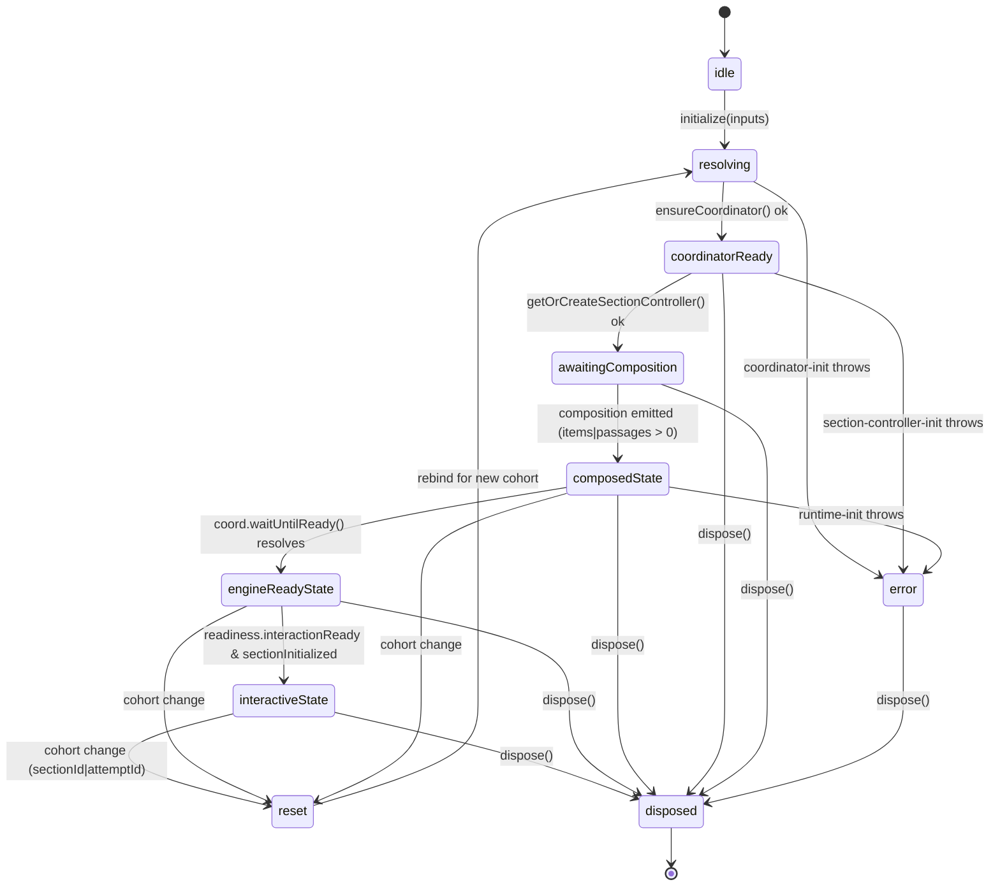

# M7 Design — Variant A: Single-Class `SectionRuntimeEngine`

> **Variant under evaluation:** all four M7 concerns (FSM + coordinator
> lifecycle + two-tier runtime resolution + readiness emission +
> framework-error routing) collapsed onto one `SectionRuntimeEngine`
> class. No port interfaces, no layered modules. Tests mount the class
> against the real `ToolkitCoordinator` and assert observable
> behavior.

---

## 1. Public API surface

All names in this section live in `@pie-players/pie-assessment-toolkit`
under `src/runtime/`. New types are co-located with the engine; the
engine class file imports them.

### 1.1 Configuration & input types (`src/runtime/section-runtime-types.ts`, new)

```ts
import type {
  FrameworkErrorListener,
  FrameworkErrorModel,
  FrameworkErrorPort,
} from "../services/framework-error-bus.js";
import type { ToolkitCoordinator } from "../services/ToolkitCoordinator.js";
import type {
  SectionControllerHandle,
  SectionControllerEvent,
} from "../services/section-controller-types.js";
import type { ToolConfigStrictness } from "../services/tool-config-validation.js";
import type { ToolRegistry } from "../services/ToolRegistry.js";
import type {
  LoadingCompleteDetail,
  Stage,
  StageChangeDetail,
  StageSourceCe,
} from "@pie-players/pie-players-shared/pie";
import type {
  SectionPlayerReadinessChangeDetail,
} from "@pie-players/pie-section-player/contracts/public-events";

export type FrameworkErrorHandler = (model: FrameworkErrorModel) => void;
export type StageChangeHandler = (detail: StageChangeDetail) => void;
export type LoadingCompleteHandler = (detail: LoadingCompleteDetail) => void;

export type PlayerOverrides = {
  loaderConfig?: Record<string, unknown>;
  loaderOptions?: Record<string, unknown>;
  [key: string]: unknown;
};

/**
 * Tier-1 surface: every key honored here mirrors a kebab CE attribute
 * and a top-level prop. `runtime.<key>` always wins.
 *
 * Locked at 15 keys post-M5; M6 added `onStageChange` / `onLoadingComplete`.
 */
export interface SectionRuntimeConfig {
  assessmentId?: string;
  playerType?: string;
  player?: PlayerOverrides | null;
  lazyInit?: boolean;
  tools?: Record<string, unknown> | null;
  accessibility?: Record<string, unknown> | null;
  coordinator?: ToolkitCoordinator | null;
  createSectionController?: (() => unknown) | null;
  isolation?: "inherit" | "force";
  env?: Record<string, unknown>;
  toolConfigStrictness?: ToolConfigStrictness;
  onFrameworkError?: FrameworkErrorHandler;
  enabledTools?: string;
  onStageChange?: StageChangeHandler;
  onLoadingComplete?: LoadingCompleteHandler;
}

/**
 * Per-CE inputs the engine consumes. The engine resolves these
 * against `runtime` to produce `SectionRuntimeState`.
 *
 * Layout-shell knobs (`showToolbar`, `narrowLayoutBreakpoint`, …) are
 * NOT engine inputs; they stay on the layout CE.
 */
export interface SectionRuntimeInputs {
  // Identity (per-attempt; never mirrored on `runtime`).
  assessmentId: string;
  sectionId: string;
  attemptId?: string;
  section: unknown | null;

  // Tier-2 (top-level CE props; runtime wins).
  playerType?: string;
  player?: PlayerOverrides | null;
  lazyInit?: boolean;
  tools?: Record<string, unknown> | null;
  accessibility?: Record<string, unknown> | null;
  coordinator?: ToolkitCoordinator | null;
  createSectionController?: (() => unknown) | null;
  isolation?: "inherit" | "force";
  env?: Record<string, unknown> | null;
  toolConfigStrictness?: ToolConfigStrictness;
  toolRegistry?: ToolRegistry | null;

  // Tier-1 mirror (`runtime` wins).
  runtime: SectionRuntimeConfig | null;
  enabledTools?: string;

  // Deprecated kebab attrs kept by `resolveToolsConfig` for one major.
  itemToolbarTools?: string;
  passageToolbarTools?: string;

  // Top-level callbacks (runtime keys win).
  onFrameworkError?: FrameworkErrorHandler;
  onStageChange?: StageChangeHandler;
  onLoadingComplete?: LoadingCompleteHandler;

  // Section view derived from `env` (engine resolves).
  // Optional override for hosts that pre-resolve.
  view?: "candidate" | "scorer" | "author";
}

/** Resolved view exposed back to layout consumers. Stable per `update()` call. */
export interface SectionRuntimeState {
  effectiveToolsConfig: unknown;
  effectiveRuntime: ResolvedRuntimeView;
  playerRuntime: ResolvedPlayerRuntime;
}

/** Lifecycle event surface; observable via `engine.subscribe(...)`. */
export type SectionRuntimeLifecycleEvent =
  | { type: "stage-change"; detail: StageChangeDetail }
  | { type: "loading-complete"; detail: LoadingCompleteDetail }
  | { type: "readiness-change"; detail: SectionPlayerReadinessChangeDetail }
  | { type: "interaction-ready"; detail: SectionPlayerReadinessChangeDetail }
  | { type: "ready"; detail: SectionPlayerReadinessChangeDetail }
  | { type: "framework-error"; detail: FrameworkErrorModel }
  | {
      type: "composition-changed";
      detail: { composition: unknown; version: number };
    }
  | { type: "session-changed"; detail: Record<string, unknown> }
  | {
      type: "section-controller-ready";
      detail: {
        sectionId: string;
        attemptId?: string;
        controller: SectionControllerHandle;
      };
    }
  | {
      type: "runtime-owned" | "runtime-inherited";
      detail: { runtimeId: string; parentRuntimeId: string | null };
    };

export type SectionRuntimeListener = (
  event: SectionRuntimeLifecycleEvent,
) => void;
```

### 1.2 Engine class (`src/runtime/SectionRuntimeEngine.ts`, expanded seed)

```ts
export interface SectionRuntimeEngineOptions {
  /**
   * Source-CE shape for the canonical stage tracker.
   * - `"layout"`: outermost CE is `<pie-section-player-*>` (kernel-driven).
   * - `"toolkit"`: outermost CE is `<pie-assessment-toolkit>` (standalone).
   *
   * The engine constructs exactly one `StageTracker` matching this
   * shape and routes `pie-stage-change` through it.
   */
  sourceCeShape: StageSourceCe;

  /**
   * Tag name minus the `--version-<encoded>` suffix; carried verbatim
   * on every emitted `StageChangeDetail.sourceCe`.
   */
  sourceCe: string;

  /**
   * Optional pre-existing runtime id (e.g. when a parent context
   * already minted one). Engine generates one via `createRuntimeId`
   * if omitted.
   */
  runtimeId?: string;

  /**
   * Optional inherited engine resources. Set by a parent CE's engine
   * when a nested toolkit detects an inherited host runtime context.
   * The nested engine becomes a "passthrough" — no owned coordinator,
   * no owned bus.
   */
  inherited?: {
    coordinator: ToolkitCoordinator;
    frameworkErrorPort: FrameworkErrorPort;
    parentRuntimeId: string;
  };
}

export class SectionRuntimeEngine {
  readonly runtimeId: string;
  readonly sourceCe: string;
  readonly sourceCeShape: StageSourceCe;
  readonly frameworkErrorPort: FrameworkErrorPort;

  constructor(opts: SectionRuntimeEngineOptions);

  // ---- Lifecycle ---------------------------------------------------

  /**
   * Bootstrap for the current `(sectionId, attemptId)` cohort.
   *
   * Idempotent for the same cohort. On cohort change emits `disposed`
   * for the outgoing cohort, resets the stage tracker, and re-arms.
   *
   * Resolution order:
   *  1. Apply `inputs` to the resolver → `runtimeState`.
   *  2. Resolve coordinator: `inputs.coordinator` >
   *     inherited (from constructor opts) > owned (built with the
   *     engine's `FrameworkErrorBus`).
   *  3. Acquire `SectionControllerHandle` via `coord.getOrCreateSectionController`.
   *  4. Wire registry + composition emit + session emit.
   *  5. Drive the stage progression: `composed` once items/passages
   *     compose; `engine-ready` on `coord.waitUntilReady()`;
   *     `interactive` on readiness join.
   */
  initialize(inputs: SectionRuntimeInputs): Promise<void>;

  /**
   * Recompute `runtimeState` against new inputs without rolling the
   * cohort. Use from a Svelte `$effect` (wrapped in `untrack`) when
   * top-level props change but identity does not.
   *
   * Idempotent — short-circuits if the input signature is unchanged.
   */
  update(inputs: SectionRuntimeInputs): void;

  /** Tear down. Idempotent. Emits `disposed` if a cohort is active. */
  dispose(): Promise<void>;

  // ---- Observability ----------------------------------------------

  /** Current stage; `null` before `composed`. */
  getStage(): Stage | null;

  /**
   * Resolves when the engine reaches `target` (or rejects with a
   * dispose error). Honors `failed` status — a `failed` `target`
   * resolves rather than waits forever.
   */
  waitUntilStage(target: Stage): Promise<void>;

  /** Read-only resolved view; refreshed by `initialize` and `update`. */
  getRuntimeState(): SectionRuntimeState;

  /** Effective coordinator after `initialize` resolves; `null` before. */
  getCoordinator(): ToolkitCoordinator | null;

  /** Section controller handle after `engine-ready`; `null` before. */
  getSectionController(): SectionControllerHandle | null;

  /**
   * Subscribe to lifecycle events. Listeners are called synchronously
   * from the same emit point as the corresponding DOM event so the
   * event and the callback stay in lockstep per cohort. Returns a
   * disposer.
   */
  subscribe(listener: SectionRuntimeListener): () => void;

  /** Convenience for hosts that want raw framework-error fan-out. */
  subscribeFrameworkErrors(listener: FrameworkErrorListener): () => void;

  // ---- pie-item client contract — pass-through --------------------
  // pie-item contract compatibility: payload shapes here MUST stay
  // verbatim. They mirror the existing M6-seed surface.

  register(detail: RuntimeRegistrationDetail): boolean;
  unregister(element: HTMLElement): boolean;
  handleContentRegistered(detail: RuntimeRegistrationDetail): void;
  handleContentUnregistered(detail: RuntimeRegistrationDetail): void;
  handleContentLoaded(args: {
    itemId: string;
    canonicalItemId?: string;
    contentKind?: string;
    detail?: unknown;
    timestamp?: number;
  }): void;
  handleItemPlayerError(args: {
    itemId: string;
    canonicalItemId?: string;
    contentKind?: string;
    error: unknown;
    timestamp?: number;
  }): void;
  updateItemSession(itemId: string, session: unknown): unknown;
  getCanonicalItemId(itemId: string): string;

  // ---- Composition + navigation facades ---------------------------

  getCompositionModel(): unknown;
  navigateToItem(index: number): unknown;
  persist(): Promise<void>;
  hydrate(): Promise<void>;

  /**
   * Publish a framework error through the engine's bus. Internal
   * failure paths (`coordinator-init`, `runtime-init`, `runtime-dispose`)
   * call this; hosts that want to inject a synthetic failure
   * (e.g. from an outer hook) can also call it.
   */
  reportFrameworkError(args: {
    kind: FrameworkErrorModel["kind"];
    source: string;
    error: unknown;
    recoverable?: boolean;
  }): FrameworkErrorModel;
}
```

### 1.3 Host CE props that survive

The engine ABSORBS internal seams; the **CE prop surface stays
identical** across `<pie-section-player-*>` and
`<pie-assessment-toolkit>`. No host has to change attributes/props.
`runtime`, top-level callbacks, identity props (`section-id`,
`attempt-id`, `assessment-id`), and layout-shell props all keep their
current shape — they become pure inputs to `engine.update(...)`.

The only host-visible removals are the four `@deprecated` events in
`SECTION_PLAYER_PUBLIC_EVENTS` (see §5).

---

## 2. File structure

### 2.1 `packages/assessment-toolkit/src/runtime/`

| Path | Status | Notes |
| --- | --- | --- |
| `SectionRuntimeEngine.ts` | **expand** | Becomes the canonical engine. Absorbs coordinator lifecycle, bus, stage tracker, resolver dispatch, legacy emit chain. |
| `section-runtime-types.ts` | **new** | `SectionRuntimeConfig`, `SectionRuntimeInputs`, `SectionRuntimeState`, `SectionRuntimeLifecycleEvent`, handler aliases. |
| `section-runtime-resolver.ts` | **new** | Pure functions absorbed from `packages/section-player/src/components/shared/section-player-runtime.ts`: `resolveToolsConfig`, `resolveRuntime`, `resolvePlayerRuntime`, `resolveOnFrameworkError`, `resolveSectionPlayerRuntimeState`. Default constants (`DEFAULT_ASSESSMENT_ID`, `DEFAULT_PLAYER_TYPE`, `DEFAULT_LAZY_INIT`, `DEFAULT_ISOLATION`, `DEFAULT_ENV`) move here. Engine-internal but re-exported for tests. |
| `section-runtime-readiness.ts` | **new** | `createReadinessDetail` + `ReadinessSignals` moved verbatim from `packages/section-player/src/components/shared/section-player-readiness.ts` so the engine owns its inputs. |
| `RuntimeRegistry.ts` | unchanged | Engine still composes it. |
| `registration-events.ts` | unchanged | pie-item client contract — sacred. |
| `runtime-id.ts` | unchanged | Engine uses `createRuntimeId`. |
| `session-event-emitter-policy.ts` | unchanged | Engine composes it. |
| `tool-host-contract.ts` | unchanged | Engine uses `dispatchCrossBoundaryEvent`. |
| `runtime-event-guards.ts` | unchanged | Local-runtime guard; engine uses it. |

### 2.2 `packages/assessment-toolkit/src/components/`

| Path | Status | Notes |
| --- | --- | --- |
| `PieAssessmentToolkit.svelte` | **edit (heavy thinning)** | Owned-coordinator path, framework-error bus, stage tracker, register/unregister listeners, legacy stage `$effect`s — all delegated to the engine. The CE retains: prop declaration, anchor div, error-banner UI, `assessmentToolkitRuntimeContext` provider wiring, instrumentation bridge, and external API (`waitUntilReady`, `getServiceBundle`, `setHooks`, `navigateToItem`, …). All formerly-local stage state and `frameworkErrorBus` allocations disappear. |

### 2.3 `packages/section-player/src/`

| Path | Status | Notes |
| --- | --- | --- |
| `components/shared/section-player-runtime.ts` | **delete** | Resolver + types relocate to assessment-toolkit. Re-exports kept here for one PR (step 6) then removed. |
| `components/shared/section-player-readiness.ts` | **delete** | Moves to assessment-toolkit (`section-runtime-readiness.ts`). |
| `components/shared/section-player-stage-tracker.ts` | **delete** | Was already a re-export shim; no longer needed once the engine owns the tracker. |
| `components/shared/SectionPlayerLayoutKernel.svelte` | **edit (heavy thinning)** | Constructs `engine = new SectionRuntimeEngine({sourceCeShape: "layout", sourceCe})`, calls `engine.update(inputs)` from a single tracked `$effect` (wrapped in `untrack`), reads `engine.getRuntimeState().effectiveRuntime` for layout child binding. Drops: `resolveSectionPlayerRuntimeState` derived, stage tracker, cohort `$effect`, legacy readiness emit `$effect`, framework-error handler. Keeps: composition snapshot derivation, layout slot model, scaffold wiring, focus management, navigation API. |
| `components/shared/SectionPlayerLayoutScaffold.svelte` | unchanged | Pure layout shell. |
| `components/PieSectionPlayerBaseElement.svelte` | **edit (heavy thinning)** | Drops every `effective*` derived; drops imperative `toolkitElement.onFrameworkError = …` and `toolkitElement.onStageChange = …` wiring. The base CE still mounts `<pie-assessment-toolkit>` but passes the engine handle through `assessmentToolkitHostRuntimeContext` so the inner toolkit's engine starts in passthrough mode. |
| `components/PieSectionPlayerSplitPaneElement.svelte` | **edit** | Drops `resolveOnFrameworkError`. Forwards `runtime`/handlers verbatim into the kernel; the engine resolves. |
| `components/PieSectionPlayerVerticalElement.svelte` | **edit** | Same. |
| `components/PieSectionPlayerTabbedElement.svelte` | **edit** | Same. |
| `components/PieSectionPlayerKernelHostElement.svelte` | **edit** | Same. |
| `contracts/public-events.ts` | **edit** | Remove deprecated entries (`readinessChange`, `interactionReady`, `ready`, `sectionControllerReady`). Engine still emits them as DOM events for one major if `legacy: true` is opted in via policy — but the rip-out posture says delete. |
| `contracts/runtime-host-contract.ts` | unchanged | Layout host contract surface unchanged. |
| `contracts/stages.ts` | unchanged | M6 vocabulary stable. |

### 2.4 Package exports / `dist`

`packages/assessment-toolkit/package.json` → adds:

```jsonc
"./runtime/SectionRuntimeEngine": {
  "types": "./dist/runtime/SectionRuntimeEngine.d.ts",
  "import": "./dist/runtime/SectionRuntimeEngine.js"
}
```

This is **non-CE** — programmatic engine access for advanced hosts.
No new CE entry points needed; the consolidation is internal to
existing custom elements.

The engine constructor + types are re-exported from `index.ts` so
`import { SectionRuntimeEngine } from "@pie-players/pie-assessment-toolkit"`
works for consumers that don't need a deep export.

`packages/section-player/package.json` → no exports change. The
deleted `section-player-runtime.ts` had no external `exports` entry,
so no consumer-facing path is broken.

---

## 3. State machine + lifecycle



### 3.1 Mapping internal states → emitted M6 stages

| Internal state | Emitted stage (`status`) | Emit trigger |
| --- | --- | --- |
| `idle` | — | none |
| `resolving` | — | none |
| `coordinatorReady` | — | none (M6 dropped `attached` and `runtime-bound`) |
| `awaitingComposition` | — | engine waits for a tracked composition signal |
| `composedState` | `composed` (`entered`) | first composition tick with items.length > 0 ‖ passages.length > 0 |
| `engineReadyState` | `engine-ready` (`entered`) | `coord.waitUntilReady()` resolves |
| `engineReadyState` w/ failure | `engine-ready` (`failed`) on coord throw, then `interactive` (`failed`) | `coord.waitUntilReady()` rejects ⇒ no further stages |
| `engineReadyState` w/ skip | `engine-ready` (`skipped`) | `initialize()` rejects before `engine-ready` latched (matches commit `099c1b5`) |
| `interactiveState` | `interactive` (`entered`) | join: `engineReadyStageEntered ∧ sectionInitialized ∧ readinessDetail.interactionReady` |
| `disposed` | `disposed` (`entered`) | only if `getCurrent() !== null` |

The engine also emits the legacy chain alongside the M6 stages:
`readiness-change` on every `readinessDetail` change, `interaction-ready`
on the first `interactionReady`, `ready` on the first
`allLoadingComplete`, and `pie-loading-complete` once per cohort.

### 3.2 Cohort rollover

`update()` compares `(sectionId, attemptId)` against the active cohort.
On change:

1. If the active cohort has any emitted stage, emit `disposed`.
2. Reset the stage tracker with the new identity.
3. Reset latches: `composedStageEntered`, `engineReadyStageEntered`,
   `interactiveStageEntered`, `sectionInitialized`,
   `loadingCompleteEmittedForCohort`, `interactionReadyDispatched`,
   `finalReadyDispatched`.
4. Re-call `initialize()` for the new cohort.

---

## 4. Two-tier resolution wiring

### 4.1 Where inputs come from

The kernel and the toolkit each declare the same prop set they
declare today (see `SectionPlayerLayoutKernel.svelte` lines 81–137 and
`PieAssessmentToolkit.svelte` lines 152–177). They feed those props,
plus identity (`sectionId`, `attemptId`, `section`, `assessmentId`),
into a single `SectionRuntimeInputs` object and call:

```ts
const engine = new SectionRuntimeEngine({
  sourceCe,                  // "pie-section-player-splitpane" | … | "pie-assessment-toolkit"
  sourceCeShape,             // "layout" | "toolkit"
  inherited: inheritedRuntime ? {
    coordinator: inheritedRuntime.coordinator,
    frameworkErrorPort: inheritedRuntime.frameworkErrorPort,
    parentRuntimeId: inheritedRuntime.runtimeId,
  } : undefined,
});

$effect(() => {
  void sectionId; void attemptId; void runtime; /* … */
  untrack(() => {
    engine.update(toRuntimeInputs(/* current props */));
  });
  return () => { void engine.dispose(); };
});
```

### 4.2 Resolver flow inside the engine

```text
SectionRuntimeInputs
  → section-runtime-resolver.resolveSectionPlayerRuntimeState(...)
      ↳ resolveToolsConfig({runtime, tools, enabledTools, …})
      ↳ resolveRuntime({...assessmentId, ...mergedPlayer, ...effectiveTools, runtime})
      ↳ resolvePlayerRuntime({effectiveRuntime, playerType, env})
  → SectionRuntimeState { effectiveToolsConfig, effectiveRuntime, playerRuntime }
```

The resolver is a pure module — same shape and same precedence rule as
M5 (`runtime.<key>` wins over the matching prop). The engine caches
the last `runtimeState` and returns it from `getRuntimeState()` until
the next `update()`.

### 4.3 How layout consumers read `effectiveRuntime`

```svelte
<!-- SectionPlayerLayoutKernel.svelte -->
<script lang="ts">
  // engine constructed once per kernel mount
  const runtimeState = $derived(engine.getRuntimeState());
  const effectiveRuntime = $derived(runtimeState.effectiveRuntime);
  const playerRuntime = $derived(runtimeState.playerRuntime);
</script>

<SectionPlayerLayoutScaffold runtime={effectiveRuntime} … />
```

`engine.update(...)` is the only mutation point; `getRuntimeState()`
is read-only. `$derived` re-evaluates when `engine.getRuntimeState()`'s
identity changes (the engine returns the same object until `update()`
produces a new one, so `$derived` short-circuits).

### 4.4 How `<pie-section-player-base>` and the toolkit consume the engine

- `<pie-section-player-base>` no longer derives `effective*` keys
  itself. It receives `runtime` (already resolved by the engine in the
  kernel) and forwards it verbatim to `<pie-assessment-toolkit>`. It
  also reads the engine's coordinator+bus from
  `assessmentToolkitHostRuntimeContext` and forwards them down.
- `<pie-assessment-toolkit>` constructs its own engine; that engine
  detects the inherited context and runs in passthrough mode (no owned
  coordinator, no owned bus, no stage emit — stage events flow from
  the parent engine instead).
- Standalone `<pie-assessment-toolkit>` (no parent context) constructs
  an engine in owned mode.

The strict mirror rule (M5) is **the engine's invariant**, enforced in
`section-runtime-resolver.ts`. The
`m5-mirror-rule.test.ts → RUNTIME_TIER_CONSUMERS` table updates to
read from the engine's resolver entry, not from
`section-player-runtime.ts`.

---

## 5. Readiness emission ownership

### 5.1 Engine emits (single source)

| Event / callback | Trigger | Emit point |
| --- | --- | --- |
| `pie-stage-change` (`composed`, `engine-ready`, `interactive`, `disposed`) | M6 stage tracker | `engine.dispatch("pie-stage-change", detail)` on the host CE |
| `pie-loading-complete` | first `readinessDetail.allLoadingComplete` per cohort | engine |
| `readiness-change` (deprecated, kept this milestone) | every `readinessDetail` change | engine |
| `interaction-ready` (deprecated) | first `interactionReady` per cohort | engine |
| `ready` (deprecated) | first `allLoadingComplete` per cohort | engine |
| `framework-error` | `FrameworkErrorBus` fan-out | engine bus subscriber |
| `composition-changed` | RAF-flushed composition diff | engine |
| `session-changed` | `updateItemSession` round-trip filtered by `session-event-emitter-policy` | engine |
| `runtime-owned` / `runtime-inherited` | first ownership decision | engine |
| `section-controller-ready` (deprecated) | first controller resolution | engine (one-shot) |
| `onFrameworkError`, `onStageChange`, `onLoadingComplete` callbacks | resolved from `effectiveRuntime`; invoked at the same emit point as the matching DOM event | engine |

The engine resolves callback handlers at emit time (not bind time) so
late-binding hosts and cohort-change re-resolutions always reach the
latest reference — same pattern as today's kernel/toolkit (matches
`SectionPlayerLayoutKernel.svelte` line 209 and
`PieAssessmentToolkit.svelte` line 227).

### 5.2 Kernel / scaffold still emits (DOM-attribute / layout-only)

| Event | Source | Reason |
| --- | --- | --- |
| `element-preload-retry` | `<pie-section-player-items-pane>` reflects this from its preloader; kernel forwards | preload concern is DOM-driven; not engine state |
| `element-preload-error` | same | same |
| `data-item-player-type` / `data-item-player-tag` / `data-env-mode` / `data-env-role` reflections | toolkit CE | DOM-attribute reflection on the host element; not events |
| Navigation status announcements (`aria-live`) | `SectionPlayerLayoutScaffold` | accessibility shell concern |
| `[is-current]` reflection on item cards | scaffold | layout DOM concern |

### 5.3 Pre-cutover dual-emit risk

During steps 3–5 of the migration, both old and new emit paths exist
side-by-side. The cutover commit MUST land the engine emit and the
old-path removal in the same PR for `pie-stage-change` and
`pie-loading-complete` to avoid duplicate stage events. See §8 PR4.

---

## 6. Coordinator lifecycle

### 6.1 Today (post-M6)

`<pie-assessment-toolkit>` constructs the owned `ToolkitCoordinator`
inline:

```ts
// PieAssessmentToolkit.svelte ~line 666–688
ownedCoordinator = buildOwnedCoordinator(validatedTools);
```

The bus is constructed at module top (`new FrameworkErrorBus()` ~line
140) and shared with the coordinator. Disposal happens in the unmount
`$effect` (~line 1276).

### 6.2 M7 — engine ownership

```ts
// inside SectionRuntimeEngine
private readonly frameworkErrorBus = new FrameworkErrorBus();
private ownedCoordinator: ToolkitCoordinator | null = null;
private inheritedCoordinator: ToolkitCoordinator | null = null;
private effectiveCoordinator: ToolkitCoordinator | null = null;

private async ensureCoordinator(inputs: SectionRuntimeInputs):
    Promise<ToolkitCoordinator> {
  // 1. Explicit tier-2 prop / tier-1 runtime key.
  if (inputs.runtime?.coordinator) return inputs.runtime.coordinator;
  if (inputs.coordinator) return inputs.coordinator;

  // 2. Inherited via parent engine context (constructor opts).
  if (this.opts.inherited?.coordinator) {
    this.inheritedCoordinator = this.opts.inherited.coordinator;
    return this.inheritedCoordinator;
  }

  // 3. Build owned with this engine's bus.
  const validated = validateToolsConfigForBootstrap(inputs);
  this.ownedCoordinator = new ToolkitCoordinator({
    assessmentId: inputs.assessmentId || `assessment-${this.runtimeId}`,
    lazyInit: inputs.lazyInit ?? true,
    toolConfigStrictness: inputs.toolConfigStrictness ?? "error",
    deferToolConfigValidation: true,
    tools: validated as any,
    toolRegistry: inputs.toolRegistry ?? null,
    accessibility: inputs.accessibility as any,
    frameworkErrorBus: this.frameworkErrorBus,
  });
  return this.ownedCoordinator;
}
```

### 6.3 Disposal

```ts
async dispose(): Promise<void> {
  if (this.cohortKey === null) return; // idempotent
  const cohort = this.cohortKey;
  this.cohortKey = null;
  this.activeInitToken += 1;

  // Emit `disposed` if we ever entered a stage.
  if (this.stageTracker.getCurrent() !== null) {
    this.stageTracker.enter("disposed");
  }
  this.unsubscribeController?.();
  this.unsubscribeController = null;

  if (this.effectiveCoordinator && cohort) {
    try {
      await this.effectiveCoordinator.disposeSectionController({
        sectionId: cohort.sectionId,
        attemptId: cohort.attemptId,
      });
    } catch (error) {
      this.reportFrameworkError({
        kind: "runtime-dispose",
        source: this.sourceCe,
        error,
        recoverable: true,
      });
    }
  }

  this.registry.clear();
  this.controller = null;
  this.effectiveCoordinator = null;
  this.inheritedCoordinator = null;
  this.ownedCoordinator = null;
  // Bus is owned by the engine for its full lifetime.
  this.frameworkErrorBus.dispose();
}
```

### 6.4 Wiring from the host CE

```svelte
<!-- PieAssessmentToolkit.svelte (post-M7) -->
<script lang="ts">
  const inheritedRuntime = $derived.by(() => /* via context — same as today */);
  const engine = new SectionRuntimeEngine({
    sourceCe: "pie-assessment-toolkit",
    sourceCeShape: "toolkit",
    inherited: inheritedRuntime
      ? {
          coordinator: inheritedRuntime.coordinator,
          frameworkErrorPort: inheritedRuntime.frameworkErrorPort,
          parentRuntimeId: inheritedRuntime.runtimeId,
        }
      : undefined,
  });

  $effect(() => {
    void section; void sectionId; void attemptId; void runtime; /* tracked */
    untrack(() => engine.update(toEngineInputs(/* current props */)));
    return () => { void engine.dispose(); };
  });
</script>
```

`assessmentToolkitHostRuntimeContext` is extended to carry
`{ runtimeId, coordinator, frameworkErrorPort }` so the nested toolkit
can detect "passthrough" mode purely via context (no global lookups).

---

## 7. Blast radius

Categorized as **source-edit** (S), **test-update** (T), **doc-update**
(D), **delete** (X), or **unchanged-but-dependent** (U).

### 7.1 `packages/assessment-toolkit`

| Path | Cat. | Why |
| --- | --- | --- |
| `src/runtime/SectionRuntimeEngine.ts` | S | major expansion |
| `src/runtime/section-runtime-types.ts` | S (new) | engine surface types |
| `src/runtime/section-runtime-resolver.ts` | S (new) | resolver functions move here |
| `src/runtime/section-runtime-readiness.ts` | S (new) | readiness helper moves here |
| `src/runtime/RuntimeRegistry.ts` | U | engine composes |
| `src/runtime/registration-events.ts` | U | pie-item contract |
| `src/runtime/runtime-id.ts` | U | engine consumes |
| `src/runtime/session-event-emitter-policy.ts` | U | engine composes |
| `src/runtime/tool-host-contract.ts` | U | engine composes |
| `src/runtime/runtime-event-guards.ts` | U | engine composes |
| `src/components/PieAssessmentToolkit.svelte` | S | heavy thinning |
| `src/context/assessment-toolkit-context.ts` | S | extend host-runtime context shape |
| `src/context/runtime-context-consumer.ts` | S | mirror context shape change |
| `src/index.ts` | S | export `SectionRuntimeEngine`, types |
| `src/services/ToolkitCoordinator.ts` | U | construction call site moves |
| `src/services/framework-error.ts` | U | model unchanged |
| `src/services/framework-error-bus.ts` | U | engine owns instances |
| `src/services/ToolRegistry.ts` | U | engine forwards |
| `src/services/section-controller-types.ts` | U | engine forwards |
| `src/scripts/build-ce-components.mjs` | U | wiring untouched |
| `package.json` | S | add `./runtime/SectionRuntimeEngine` export |
| `tests/toolkit-coordinator-framework-error.test.ts` | U | bus contract unchanged |
| `tests/framework-error-bus.test.ts` | U | bus contract unchanged |
| `tests/toolkit-coordinator-section-events.test.ts` | U | unchanged |
| `tests/toolkit-coordinator-telemetry.test.ts` | U | unchanged |
| `tests/section-runtime-engine.test.ts` | T (new) | engine unit |
| `tests/section-runtime-resolver.test.ts` | T (new) | resolver unit |
| `tests/section-runtime-engine-coordinator.test.ts` | T (new) | owned-vs-inherited path |
| `tests/section-runtime-engine-stage.test.ts` | T (new) | stage emission contract |
| `tests/session-event-emitter-policy.test.ts` | U | unchanged |

### 7.2 `packages/section-player`

| Path | Cat. | Why |
| --- | --- | --- |
| `src/components/shared/SectionPlayerLayoutKernel.svelte` | S | heavy thinning |
| `src/components/shared/section-player-runtime.ts` | X | move to assessment-toolkit |
| `src/components/shared/section-player-readiness.ts` | X | move to assessment-toolkit |
| `src/components/shared/section-player-stage-tracker.ts` | X | shim no longer needed |
| `src/components/shared/SectionPlayerLayoutScaffold.svelte` | U | layout shell only |
| `src/components/shared/SectionItemsPane.svelte` | U | preload events kept here |
| `src/components/shared/SectionPassagesPane.svelte` | U | unchanged |
| `src/components/shared/SectionPlayerTabbedContent.svelte` | U | unchanged |
| `src/components/shared/SectionPlayerVerticalContent.svelte` | U | unchanged |
| `src/components/shared/SectionItemCard.svelte` | U | unchanged |
| `src/components/shared/SectionPassageCard.svelte` | U | unchanged |
| `src/components/shared/SectionSplitDivider.svelte` | U | unchanged |
| `src/components/SectionPlayerShell.svelte` | U | unchanged |
| `src/components/PieSectionPlayerBaseElement.svelte` | S | heavy thinning |
| `src/components/PieSectionPlayerSplitPaneElement.svelte` | S | drop local resolver shim |
| `src/components/PieSectionPlayerVerticalElement.svelte` | S | same |
| `src/components/PieSectionPlayerTabbedElement.svelte` | S | same |
| `src/components/PieSectionPlayerKernelHostElement.svelte` | S | same |
| `src/components/ItemShellElement.svelte` | U | pie-item contract |
| `src/components/PassageShellElement.svelte` | U | pie-item contract |
| `src/contracts/public-events.ts` | S | remove deprecated events |
| `src/contracts/runtime-host-contract.ts` | U | host contract surface unchanged |
| `src/contracts/stages.ts` | U | M6 vocab stable |
| `src/contracts/host-hooks.ts` | U | unchanged |
| `src/contracts/layout-contract.ts` | U | unchanged |
| `src/contracts/layout-parity-metadata.ts` | U | unchanged |
| `src/contracts/card-title-formatters.ts` | U | unchanged |
| `src/policies/*` | U | unchanged |
| `src/controllers/SectionController.ts` | U | engine constructs but contract unchanged |
| `src/controllers/*.ts` | U | unchanged |
| `tests/section-player-runtime.test.ts` | T | retarget imports to engine resolver |
| `tests/section-player-stage-tracker.test.ts` | T | now exercises engine via tracker re-export; assertions same |
| `tests/m5-mirror-rule.test.ts` | T | `RUNTIME_TIER_CONSUMERS` table updated to engine resolver |
| `tests/section-player-readiness-events.spec.ts` | T | ordering unchanged but emit source moves; selectors stay |
| `tests/section-player-controller-access.spec.ts` | T | adjust to one-shot `section-controller-ready` |
| `tests/section-player-toolkit-observability.spec.ts` | T | telemetry assertions unchanged |
| `tests/*.spec.ts` (other e2e) | U | host CE prop surface unchanged |
| `README.md` | D | update engine summary |
| `ARCHITECTURE.md` | D | replace "kernel owns resolver" diagram |
| `package.json` | U | no exports change |

### 7.3 `packages/assessment-player`

| Path | Cat. | Why |
| --- | --- | --- |
| `src/components/AssessmentPlayerDefaultElement.ts` | U | mounts `<pie-section-player-*>`; CE surface unchanged |
| `src/controller/AssessmentController.ts` | U | unchanged |
| `src/contracts/runtime-host-contract.ts` | U | unchanged |
| `src/contracts/public-events.ts` | U | unchanged |
| `src/components/AssessmentPlayerShellElement.ts` | U | unchanged |
| `tests/*` | U | unchanged |
| `package.json` | U | unchanged |

### 7.4 Apps

| Path | Cat. | Why |
| --- | --- | --- |
| `apps/section-demos/src/routes/(demos)/**/*.svelte` | U | mount CEs by tag |
| `apps/section-demos/src/lib/demo-runtime/**` | U | same |
| `apps/section-demos/src/lib/demo-runtime/custom-tools/**` | U | unchanged |
| `apps/assessment-demos/src/routes/(demos)/**/*.svelte` | U | mount CEs by tag |
| `apps/item-demos/**` | U | item-player only |
| `apps/section-demos/playwright.config.ts` | U | unchanged |
| `apps/section-demos` test specs in `packages/section-player/tests/*.spec.ts` | T | covered above |
| `apps/docs/**` | U | unchanged |
| `apps/local-esm-cdn/**` | U | unchanged |

### 7.5 External consumers

| Path | Cat. | Why |
| --- | --- | --- |
| `../element-QuizEngineFixedFormPlayer/dist/**` | U | consumes built `dist`; CE attribute surface unchanged |
| `../element-QuizEngineFixedFormPlayer/server/**` | U | server only |
| `../element-QuizEngineFixedPlayer/**` | U | same as above |
| `../../kds/pie-api-aws/containers/pieoneer/src/lib/section-demos/**` | U | mounts `<pie-section-player-*>` by tag; reads canonical events |
| `../../kds/pie-api-aws/containers/pieoneer/node_modules/.vite/deps/**` | U | bundler artefacts |

External breakage exposure:

- Any consumer that listens for `readiness-change`, `interaction-ready`,
  `ready`, or `section-controller-ready` keeps working through one
  more major (engine still emits them) and then breaks at the next
  major. The rip-out posture says delete now — we ship the major bump
  with the changeset.
- No consumer reaches into
  `@pie-players/pie-section-player/components/shared/section-player-runtime`
  via package exports (no `exports` entry was ever published for it).
  Internal-only path; safe to delete.

---

## 8. Migration path

Eight ordered commits, each with passing tests. Roughly 7–8 PRs.

| # | Commit | What lands | Tests at end |
| --- | --- | --- | --- |
| 1 | **Move resolver into assessment-toolkit (no-op behavior).** | New files `section-runtime-types.ts`, `section-runtime-resolver.ts`, `section-runtime-readiness.ts` in assessment-toolkit. `section-player-runtime.ts` becomes a re-export shim pointing at the new path. Resolver functions byte-identical. | All existing unit + e2e green. |
| 2 | **Engine surface expansion (parallel path, dormant).** | Engine grows `SectionRuntimeEngineOptions`, `update`, `getRuntimeState`, stage tracker, readiness emit helpers, `subscribe`, `frameworkErrorPort`. Constructed but unused by host CEs. Engine has its own `FrameworkErrorBus`. | New unit tests for engine `update` / resolver wiring / stage emission. Toolkit/kernel still on old paths. |
| 3 | **Toolkit CE delegates coordinator + bus to engine.** | `PieAssessmentToolkit.svelte` constructs an engine in owned/passthrough mode, drops `ownedCoordinator` + `frameworkErrorBus` locals + bootstrap `$effect`, drops register/unregister/content-loaded listeners (engine takes them), drops stage tracker + cohort `$effect`. Toolkit still owns DOM-event emit (for one PR) but delegates the data plane to engine. | Existing toolkit tests (`framework-error-bus.test.ts`, telemetry, section events) green. New: `section-runtime-engine-coordinator.test.ts`. |
| 4 | **Engine becomes the single emit source.** | Engine dispatches `pie-stage-change`, `pie-loading-complete`, `readiness-change`, `interaction-ready`, `ready`, `framework-error`, `composition-changed`, `session-changed`, `runtime-owned`, `runtime-inherited`, `section-controller-ready` directly on `engine.host`. Toolkit + kernel + base remove their own `dispatch()` calls and `$effect` emit chains. Cutover lands in one PR to avoid double-emit. | `section-player-readiness-events.spec.ts`, stage-tracker test, contract-parity tests green. |
| 5 | **Kernel + base CE thinning.** | `SectionPlayerLayoutKernel.svelte` reads `engine.getRuntimeState().effectiveRuntime` instead of `resolveSectionPlayerRuntimeState`. Drops cohort `$effect`, stage progression `$effect`, legacy readiness `$effect`. `PieSectionPlayerBaseElement.svelte` drops `effective*` derived chain and imperative `toolkitElement.onFrameworkError = …` / `onStageChange = …` wiring; engine is the single resolution + emit point. Layout CEs drop their per-CE `resolveOnFrameworkError` derived. | All section-player e2e green. |
| 6 | **Delete moved files.** | Remove `packages/section-player/src/components/shared/section-player-runtime.ts`, `section-player-readiness.ts`, `section-player-stage-tracker.ts`. Update consumer imports (kernel + layout CEs). Update `m5-mirror-rule.test.ts` consumer table. | `m5-mirror-rule.test.ts` and resolver test green from new path. |
| 7 | **Remove deprecated public events.** | `SECTION_PLAYER_PUBLIC_EVENTS` drops `readinessChange`, `interactionReady`, `ready`, `sectionControllerReady`. Engine stops dispatching them. Add a major-bump changeset under `.changeset/m7-engine-consolidation.md`. | Update tests that listened for the deprecated events to use `pie-stage-change` filtering. |
| 8 | **Docs + final sweep.** | Update `packages/section-player/ARCHITECTURE.md`, root `README.md`, `docs/section-player/client-architecture-tutorial.md`. Re-run `bun run check:source-exports`, `bun run check:consumer-boundaries`, `bun run check:custom-elements`. Run `bun run verify:publish`. | `bun run typecheck` + full test suite green. |

PR count estimate: **7–8 PRs** (steps 1, 2, 3, 4, 5+6 (combined), 7, 8;
or split PR5/6 if reviewers prefer smaller).

---

## 9. Test plan

### 9.1 New unit tests (`packages/assessment-toolkit/tests/`)

| File | Coverage |
| --- | --- |
| `section-runtime-engine.test.ts` | constructor; `initialize`/`update`/`dispose`; idempotent dispose; cohort rollover; `getStage`/`waitUntilStage`; `subscribe` listener fan-out + thrown-listener isolation. |
| `section-runtime-resolver.test.ts` | every two-tier precedence case (one per tier-1 key); player merging; tools merging; M5 mirror invariants. Replaces `packages/section-player/tests/section-player-runtime.test.ts`. |
| `section-runtime-engine-coordinator.test.ts` | owned-coordinator path (creates+disposes); inherited-coordinator path (does NOT create+dispose); `runtime.coordinator` precedence over top-level `coordinator` prop; `runtime-init` failure routes to bus + emits `engine-ready: skipped` + `interactive: failed` (matches commit `099c1b5`). |
| `section-runtime-engine-stage.test.ts` | canonical stage order per shape; `failed`/`skipped` semantics; cohort reset emits `disposed` + restarts at `composed`; `pie-loading-complete` once per cohort; callback / DOM-event lockstep. |
| `section-runtime-engine-framework-error.test.ts` | bus fan-out across coordinator-side and CE-side failures; `onFrameworkError` resolution at emit time; banner gating for bootstrap kinds. |

### 9.2 Existing tests that must change

| File | Change |
| --- | --- |
| `packages/section-player/tests/section-player-runtime.test.ts` | retarget `import` from local path to `@pie-players/pie-assessment-toolkit/runtime/SectionRuntimeEngine` (or its resolver export). Function signatures unchanged. |
| `packages/section-player/tests/m5-mirror-rule.test.ts` | `RUNTIME_TIER_CONSUMERS` table reads from the new resolver entry. |
| `packages/section-player/tests/section-player-stage-tracker.test.ts` | shim path moves; assertions identical. |
| `packages/section-player/tests/section-player-readiness-events.spec.ts` | event names + ordering unchanged; `event.composedPath()` first entry now is the engine's host (still the outermost CE); selectors stay. |
| `packages/section-player/tests/section-player-controller-access.spec.ts` | the deprecated `section-controller-ready` event keeps firing through PR4–PR6; PR7 removes it. Update accordingly. |
| `packages/assessment-toolkit/tests/toolkit-coordinator-framework-error.test.ts` | Coordinator construction call site moves into engine; test still constructs the coordinator directly (unaffected). |

### 9.3 E2E impact (Playwright)

- Critical e2e suites for section-player and assessment-player keep
  the same selectors, prop surface, and event names (until PR7).
- The pre-push lefthook chain runs Playwright suites; remember
  `required_permissions: ["all"]` per the playwright-sandbox rule.
- New Playwright spec: `engine-stage-emission.spec.ts` — verifies that
  in a wrapped configuration (splitpane → toolkit), only the splitpane
  emits `pie-stage-change` (one stream, not two).

### 9.4 Contract / boundary checks

`bun run check:source-exports`, `bun run check:consumer-boundaries`,
`bun run check:custom-elements`, `bun run verify:publish` all run on
PR8. Engine adds one CE-export contract: `dist/runtime/SectionRuntimeEngine.js`.

---

## 10. Risks and unknowns

1. **Sub-toolkit stage emission removal.** Today a wrapped layout
   emits two stage streams (one per CE shape). Variant A collapses
   that to one. Risk: an external consumer subscribes specifically to
   `<pie-assessment-toolkit>`'s `pie-stage-change` events when nested.
   Probe before PR4: grep `apps/`, `kds/pie-api-aws`, and
   `pie/element-Quiz*` for selectors targeting the inner toolkit.
2. **Engine context propagation under shadow DOM.** The toolkit CE
   uses `shadow: "open"`; layout CEs use `shadow: "none"`. The
   `assessmentToolkitHostRuntimeContext` already crosses shadow roots
   today, but extending it with `frameworkErrorPort` + `runtimeId`
   means more shape to validate. Probe: write a unit test that mounts
   `<pie-section-player-splitpane>` containing
   `<pie-assessment-toolkit>` and asserts the inner engine starts in
   passthrough mode.
3. **Svelte 5 reactivity at the class boundary.** The engine is a
   plain class; consumers must call `engine.update(...)` from
   `$effect` to reflect prop changes. Risk: forgetting to track a
   prop ⇒ stale `effectiveRuntime`. Mitigation: kernel + toolkit pass
   the same `SectionRuntimeInputs` builder over a tracked
   `JSON.stringify`-stable signature; add a CI guardrail
   `m7-engine-input-coverage.test.ts` that asserts every public CE
   prop maps to an engine input.
4. **Pre-cutover dual-emit window.** Steps 3–5 leave both old and new
   emit paths in tree. Single-class shape makes it hard to gate emit
   behind a feature flag without polluting the class with branches.
   Mitigation: collapse PR4 (cutover) into one commit; reviewers see
   the full move at once.
5. **Owned coordinator failure paths during cohort rollover.** Today
   the toolkit's bootstrap `$effect` re-tries on
   `getOwnedBootstrapFailureKey()` change. The engine has to mirror
   that retry semantics so a host that fixes its `tools` config sees
   recovery. Probe: explicit test for the recovery cycle.
6. **Test ergonomics regression.** The single-class shape means tests
   either spin up a real `ToolkitCoordinator` (slow, but realistic) or
   rely on a hand-rolled stub coordinator passed via
   `inputs.coordinator`. There's no port to mock individually. Honest
   admission: this is the dominant pain point; layered/FSM-with-ports
   variants beat us here.
7. **`runtime.frameworkErrorPort` exposure.** Whether the engine's bus
   should appear on the public CE surface (e.g. via a `getter` or
   imperative `subscribeFrameworkErrors` on the CE itself). Unknown:
   should advanced hosts get programmatic access or only the DOM
   event? Default for M7: yes — expose via the engine class export but
   NOT on the CE prototype (CEs stay attribute-driven).
8. **Telemetry bridge ordering.** `attachInstrumentationEventBridge`
   currently sits in the toolkit CE and the layout CEs. Engine doesn't
   need to absorb it (it's a DOM-event listener concern), but
   unsubscription order matters on dispose. Probe: ensure engine
   dispose runs BEFORE telemetry detach so the final `disposed` stage
   reaches the telemetry bridge.

---

## 11. Comparison anchor (variant trade-offs)

- **Strength: lowest cognitive cost for the common host.** One class,
  one constructor, one `initialize`, one `dispose`, one `subscribe`.
  Reviewers and new contributors read a single file (~600–800 lines
  post-M7) and have the entire engine model. Beats layered (3–5
  modules + a coordination shell) and FSM-with-ports (state types +
  port types + adapter wiring) on time-to-comprehension by a wide
  margin. Maps cleanly to "single section, default coordinator,
  default policies."
- **Weakness: testability seams disappear.** Today the resolver is a
  pure function (testable in isolation), the stage tracker is a
  primitive (testable in isolation), and the bus is a service.
  Variant A keeps the resolver pure (exported from
  `section-runtime-resolver.ts`), but the engine itself becomes a
  monolith — exercising its stage emission requires constructing a
  real coordinator (or a hand-rolled `ToolkitCoordinator`-shaped
  stub). FSM-with-ports beats us here: each port mocks
  independently.
- **Weakness: future refactor pressure.** Consolidation milestones
  pile concerns onto the engine. If a future M (e.g. instrumentation
  bridge consolidation, or a "passage runtime" shape) lands, single-
  class invites another expansion of the same file. Layered or ported
  variants offer natural seams for new responsibilities. Honest call:
  if M7 is the last big consolidation, single-class is right-sized;
  if more are pending, ports pay back.
