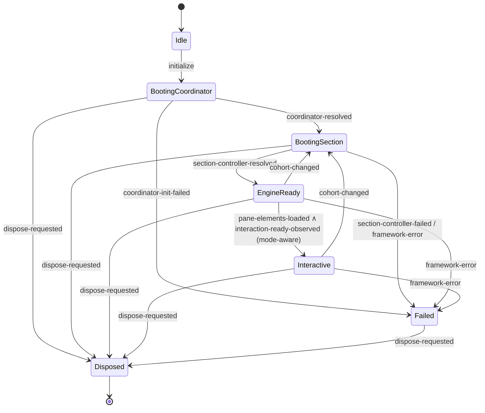

# M7 Design — Variant C: Layered Engine (Core / Adapter / Facade)

> Status: design proposal (no code yet).
> Scope: full M7 consolidation — engine, two-tier runtime resolution, M6
> readiness emission, legacy readiness chain, and `ToolkitCoordinator`
> lifecycle, all owned by a single layered `SectionRuntimeEngine`.
> Posture: rip-out (lockstep major). Common-host optimized.

The existing seed lives at
[`packages/assessment-toolkit/src/runtime/SectionRuntimeEngine.ts`](../../packages/assessment-toolkit/src/runtime/SectionRuntimeEngine.ts)
and is consumed only by
[`packages/assessment-toolkit/src/components/PieAssessmentToolkit.svelte`](../../packages/assessment-toolkit/src/components/PieAssessmentToolkit.svelte).
M7 keeps the public symbol `SectionRuntimeEngine` and refactors it into a
thin facade over a pure FSM core and an I/O adapter.

---

## 1. Public API surface

Three layers, three visibility tiers:

- **Public** — what apps and consumers may import.
- **Semi-public** — exported from `@pie-players/pie-assessment-toolkit/runtime/internal`
  for advanced hosts and our own tests.
- **Internal** — package-private, no published exports path.

### 1.1 Facade (public)

```ts
// packages/assessment-toolkit/src/runtime/SectionRuntimeEngine.ts

import type { Stage, StageChangeDetail, LoadingCompleteDetail }
  from "@pie-players/pie-players-shared/pie";
import type { FrameworkErrorModel } from "@pie-players/pie-players-shared/pie";
import type {
  SectionControllerHandle,
  SectionControllerKey,
  SectionControllerEvent,
  ToolkitCoordinator,
  ToolkitCoordinatorOptions,
} from "@pie-players/pie-assessment-toolkit";
import type { InstrumentationProvider }
  from "@pie-players/pie-players-shared/instrumentation";

export interface SectionRuntimeEngineOptions {
  /** Optional injected coordinator. If omitted the engine constructs and owns one. */
  coordinator?: ToolkitCoordinator | null;
  /** Optional coordinator options when the engine constructs its own. */
  coordinatorOptions?: ToolkitCoordinatorOptions | null;
  /** Source CE tag for stage / telemetry attribution. */
  sourceCe: string;
  sourceCeShape?: "kernel" | "toolkit" | "base";
  /** Optional instrumentation provider injected for the I/O bridge. */
  instrumentationProvider?: InstrumentationProvider | null;
  /** Optional clock injection (testing). */
  now?: () => number;
}

export interface SectionRuntimeEngineInputs {
  assessmentId: string;
  sectionId: string;
  attemptId: string;
  /** Raw runtime config from props (M5 strict mirror surface). */
  runtime: RuntimeConfig | null;
  /** Trimmed top-level prop slots that mirror runtime keys. */
  topLevel: SectionRuntimeTopLevelInputs;
  /** Section model (composition source). */
  section: SectionInput | null;
  /** Policies / tools settings already merged at the CE boundary. */
  policies: SectionPlayerPolicies | undefined;
  toolsConfig: ResolvedToolsConfig;
}

/**
 * The single facade public to apps and to layout/toolkit CEs.
 * Replaces the existing `SectionRuntimeEngine` class.
 */
export declare class SectionRuntimeEngine {
  constructor(options: SectionRuntimeEngineOptions);

  /** Bind a host element for DOM event dispatch and instrumentation. */
  attachHost(host: HTMLElement | null): void;

  /** Push the first set of inputs and start the FSM. Idempotent on stable cohort. */
  initialize(inputs: SectionRuntimeEngineInputs): Promise<void>;

  /** Push a new set of inputs (e.g. on prop change). */
  updateInputs(inputs: SectionRuntimeEngineInputs): void;

  /** Tear down: emits `disposed`, releases the section controller, disposes coordinator if owned. */
  dispose(): Promise<void>;

  /** Typed subscription for facade callers (replaces ad-hoc DOM listeners). */
  subscribe(listener: EngineListener): () => void;

  /** Cheap reads. */
  getStage(): Stage | null;
  getEffectiveRuntime(): EffectiveRuntime;
  getCohort(): { sectionId: string; attemptId: string } | null;

  /** Section controller convenience (kept from current seed). */
  getSectionController(): SectionControllerHandle | null;
  waitForSectionController(timeoutMs?: number): Promise<SectionControllerHandle | null>;

  /** Composition / navigation pass-throughs (kept from current seed). */
  getCompositionModelSnapshot(): unknown;
  navigateToItem(index: number): boolean;
}

export type EngineListener = (event: EngineEvent) => void;

export type EngineEvent =
  | { type: "stage-change"; detail: StageChangeDetail }
  | { type: "loading-complete"; detail: LoadingCompleteDetail }
  | { type: "framework-error"; model: FrameworkErrorModel }
  | { type: "section-controller-ready"; controller: SectionControllerHandle }
  | { type: "section-controller-disposed"; key: SectionControllerKey }
  | { type: "composition-changed"; composition: unknown };
```

The `RuntimeConfig`, `SectionRuntimeTopLevelInputs`, `EffectiveRuntime`, and
`ResolvedToolsConfig` types are re-exported from the section-player runtime
module (see §7).

### 1.2 Adapter (semi-public)

```ts
// packages/assessment-toolkit/src/runtime/adapter/SectionEngineAdapter.ts

import type { SectionEngineCore }
  from "../core/SectionEngineCore.js";
import type { FrameworkErrorBus }
  from "../../services/framework-error-bus.js";
import type {
  ToolkitCoordinator, ToolkitCoordinatorOptions, SectionControllerHandle,
} from "../../services/ToolkitCoordinator.js";
import type { InstrumentationProvider }
  from "@pie-players/pie-players-shared/instrumentation";

export interface SectionEngineAdapterOptions {
  core: SectionEngineCore;
  frameworkErrorBus?: FrameworkErrorBus;
  coordinator?: ToolkitCoordinator | null;
  coordinatorOptions?: ToolkitCoordinatorOptions | null;
  sourceCe: string;
  sourceCeShape?: "kernel" | "toolkit" | "base";
  instrumentationProvider?: InstrumentationProvider | null;
  now?: () => number;
}

export declare class SectionEngineAdapter {
  constructor(options: SectionEngineAdapterOptions);

  attachHost(host: HTMLElement | null): void;
  start(args: AdapterStartArgs): Promise<void>;
  updateInputs(inputs: AdapterInputs): void;
  dispose(): Promise<void>;
  subscribe(listener: EngineListener): () => void;
  getStage(): Stage | null;
  getEffectiveRuntime(): EffectiveRuntime;
  getSectionController(): SectionControllerHandle | null;
  waitForSectionController(timeoutMs?: number): Promise<SectionControllerHandle | null>;
}
```

Exported from `@pie-players/pie-assessment-toolkit/runtime/internal` for
advanced hosts and tests; not re-exported from the package barrel.

### 1.3 Core (semi-public — for tests)

```ts
// packages/assessment-toolkit/src/runtime/core/SectionEngineCore.ts

export type SectionEngineState =
  | { kind: "idle" }
  | { kind: "booting-coordinator"; cohort: Cohort }
  | { kind: "booting-section"; cohort: Cohort; coordinatorOwned: boolean }
  | { kind: "engine-ready"; cohort: Cohort; controllerKey: SectionControllerKey;
      readiness: ReadinessSignals; coordinatorOwned: boolean }
  | { kind: "interactive"; cohort: Cohort; controllerKey: SectionControllerKey;
      readiness: ReadinessSignals; coordinatorOwned: boolean }
  | { kind: "failed"; cohort: Cohort | null; error: FrameworkErrorModel;
      coordinatorOwned: boolean }
  | { kind: "disposed"; lastCohort: Cohort | null };

export type SectionEngineInput =
  | { kind: "initialize"; inputs: AdapterInputs }
  | { kind: "inputs-updated"; inputs: AdapterInputs }
  | { kind: "coordinator-resolved"; coordinatorOwned: boolean }
  | { kind: "coordinator-init-failed"; error: FrameworkErrorModel }
  | { kind: "section-controller-resolved"; controllerKey: SectionControllerKey }
  | { kind: "section-controller-failed"; error: FrameworkErrorModel }
  | { kind: "composition-snapshot"; composition: CompositionSnapshot }
  | { kind: "section-event"; event: SectionControllerEvent }
  | { kind: "loading-complete-observed"; detail: LoadingCompleteDetail }
  | { kind: "interaction-ready-observed" }
  | { kind: "framework-error"; model: FrameworkErrorModel }
  | { kind: "cohort-changed"; cohort: Cohort }
  | { kind: "dispose-requested" };

export type SectionEngineOutput =
  | { kind: "request-coordinator-init"; coordinator: ToolkitCoordinator | null;
      options: ToolkitCoordinatorOptions | null }
  | { kind: "request-section-controller"; key: SectionControllerKey;
      runtime: SectionControllerRuntimeState; session: SectionControllerSessionState }
  | { kind: "request-section-controller-dispose"; key: SectionControllerKey }
  | { kind: "stage-change"; detail: StageChangeDetail }
  | { kind: "loading-complete"; detail: LoadingCompleteDetail }
  | { kind: "legacy-readiness-change"; detail: SectionPlayerReadinessChangeDetail }
  | { kind: "legacy-interaction-ready" }
  | { kind: "legacy-ready" }
  | { kind: "framework-error-emit"; model: FrameworkErrorModel }
  | { kind: "section-controller-ready-emit"; controller: SectionControllerHandle }
  | { kind: "section-controller-disposed-emit"; key: SectionControllerKey };

export interface TransitionContext {
  now: () => number;
  resolveEffectiveRuntime: typeof resolveEffectiveRuntime;
  policies: SectionPlayerPolicies | undefined;
}

export type Transition = (
  state: SectionEngineState,
  input: SectionEngineInput,
  ctx: TransitionContext,
) => { state: SectionEngineState; outputs: readonly SectionEngineOutput[] };

export declare class SectionEngineCore {
  constructor(options: { initial?: SectionEngineState; transition?: Transition });

  /** Apply an input. Returns the outputs the adapter must execute, in order. */
  send(input: SectionEngineInput): readonly SectionEngineOutput[];

  /** Cheap reads. */
  getState(): SectionEngineState;
  getStage(): Stage | null;
  getEffectiveRuntime(): EffectiveRuntime;
}
```

### 1.4 Pure resolver (semi-public)

```ts
// packages/assessment-toolkit/src/runtime/core/engine-resolver.ts

export interface ResolverInputs {
  assessmentId: string;
  sectionId: string;
  attemptId: string;
  playerType: string | null;
  player: Record<string, unknown> | null;
  lazyInit: boolean | undefined;
  accessibility: unknown;
  coordinator: ToolkitCoordinator | null;
  createSectionController: unknown;
  isolation: "inherit" | "isolated" | string | undefined;
  env: Env | null;
  runtime: RuntimeConfig | null;
  effectiveToolsConfig: ResolvedToolsConfig;
  toolConfigStrictness: ToolConfigStrictness | undefined;
  onFrameworkError: ((model: FrameworkErrorModel) => void) | undefined;
  onStageChange: StageChangeHandler | undefined;
  onLoadingComplete: LoadingCompleteHandler | undefined;
}

export function resolveEffectiveRuntime(inputs: ResolverInputs): EffectiveRuntime;
```

This is a 1:1 absorption of `resolveRuntime` /
`resolveSectionPlayerRuntimeState` from
[`packages/section-player/src/components/shared/section-player-runtime.ts`](../../packages/section-player/src/components/shared/section-player-runtime.ts).
The behavior is preserved; the home moves.

### 1.5 Subscription contract

```ts
type EngineListener = (event: EngineEvent) => void;
type Unsubscribe = () => void;

engine.subscribe(listener): Unsubscribe;
```

Synchronous fan-out, exception-isolated per listener (matches the M3 bus
pattern in `framework-error-bus.ts`). The same fan-out is used internally by
the adapter to fire DOM events and the M3 bus.

---

## 2. File structure

### 2.1 New layout under `packages/assessment-toolkit/src/runtime`

```
runtime/
  SectionRuntimeEngine.ts            ← facade (public; existing path, refactored)
  RuntimeRegistry.ts                 ← unchanged; still owned by the engine
  core/
    SectionEngineCore.ts             ← FSM class, no DOM
    engine-state.ts                  ← state / input / output types
    engine-transition.ts             ← pure transition function
    engine-resolver.ts               ← pure two-tier resolver (absorbs resolveRuntime)
    engine-readiness.ts              ← derives legacy readiness phase from state
    engine-stage-derivation.ts       ← state → Stage mapping for emit decisions
    cohort.ts                        ← Cohort type, equality helpers
  adapter/
    SectionEngineAdapter.ts          ← orchestrates I/O around the core
    coordinator-bridge.ts            ← ToolkitCoordinator <-> core inputs
    dom-event-bridge.ts              ← outputs → DOM events on host
    legacy-event-bridge.ts           ← outputs → readiness-change / ready / interaction-ready
    framework-error-bridge.ts        ← outputs → M3 framework-error bus
    instrumentation-bridge.ts        ← attachInstrumentationEventBridge wiring
    subscriber-fanout.ts             ← typed engine.subscribe fan-out
  internal.ts                        ← re-exports adapter + core types for advanced hosts
```

### 2.2 Files that **disappear** (rip-out)

- `packages/section-player/src/components/shared/section-player-runtime.ts`
  shrinks to a re-export shim. Specifically: `resolveRuntime`,
  `resolveSectionPlayerRuntimeState`, `resolveOnFrameworkError`,
  `resolveToolsConfig`, and the `RuntimeConfig` type definition all move
  into `runtime/core/engine-resolver.ts`. The shim re-exports `RuntimeConfig`,
  `EffectiveRuntime`, `StageChangeHandler`, `LoadingCompleteHandler` from
  the toolkit so layout CEs that already import from this module keep
  working at the type level.
- `packages/section-player/src/components/shared/section-player-readiness.ts`
  → folded into `runtime/core/engine-readiness.ts`. Existing tests follow.

### 2.3 Files that **move** (logic relocates, name preserved)

- The "stage progression" `$effect` cluster from
  [`SectionPlayerLayoutKernel.svelte`](../../packages/section-player/src/components/shared/SectionPlayerLayoutKernel.svelte)
  is **deleted**. Its decisions move into the core; its emit calls move
  into the adapter. The kernel becomes an `engine.attachHost(...)` /
  `engine.updateInputs(...)` consumer only. The kernel keeps presentation
  responsibilities (slot rendering, snapshot wiring, DOM structure).
- The "stage progression" `$effect` cluster from
  [`PieAssessmentToolkit.svelte`](../../packages/assessment-toolkit/src/components/PieAssessmentToolkit.svelte)
  is deleted symmetrically. The toolkit becomes a single
  `engine.attachHost(...)` + `engine.updateInputs(...)` consumer.
- `ToolkitCoordinator` construction moves from `PieAssessmentToolkit.svelte`
  into the adapter (see §9).

### 2.4 Files that **stay**

- [`packages/players-shared/src/pie/stages.ts`](../../packages/players-shared/src/pie/stages.ts)
  — canonical `Stage` and `STAGES`.
- [`packages/players-shared/src/pie/stage-tracker.ts`](../../packages/players-shared/src/pie/stage-tracker.ts)
  — used by the adapter (one tracker per cohort) to enforce monotonic
  ordering. Tracker becomes an adapter implementation detail; the core
  decides *which* stage to enter, the tracker simply guards against
  out-of-order emits at the boundary.
- [`packages/assessment-toolkit/src/services/framework-error-bus.ts`](../../packages/assessment-toolkit/src/services/framework-error-bus.ts)
  — adapter routes all errors through it, unchanged.
- [`packages/assessment-toolkit/src/services/ToolkitCoordinator.ts`](../../packages/assessment-toolkit/src/services/ToolkitCoordinator.ts)
  — unchanged; now constructed by the adapter rather than by a Svelte
  component.
- [`packages/players-shared/src/pie/instrumentation-event-bridge.ts`](../../packages/players-shared/src/pie/instrumentation-event-bridge.ts)
  — used by the adapter's `instrumentation-bridge.ts`.
- [`packages/section-player/src/contracts/public-events.ts`](../../packages/section-player/src/contracts/public-events.ts)
  — event-name constants stay; the adapter consumes them.

### 2.5 Published `dist` exports

Update [`packages/assessment-toolkit/package.json`](../../packages/assessment-toolkit/package.json):

```json
"./runtime/engine": "./dist/runtime/SectionRuntimeEngine.js",
"./runtime/internal": "./dist/runtime/internal.js"
```

`runtime/engine` is the public facade entry. `runtime/internal` exposes the
adapter/core types for advanced hosts and is documented as semi-public. We
do **not** publish `runtime/core/*` or `runtime/adapter/*` directly — that
keeps the file layout free to evolve and respects the package
custom-elements-boundary rule that consumers import package `dist`, not
`src`.

The toolkit barrel
[`packages/assessment-toolkit/src/index.ts`](../../packages/assessment-toolkit/src/index.ts)
re-exports the facade class so the existing import path
`import { SectionRuntimeEngine } from "@pie-players/pie-assessment-toolkit"`
keeps working.

---

## 3. Core layer specification

### 3.1 State (discriminated union)

```ts
type Cohort = { sectionId: string; attemptId: string };

type ReadinessSignals = {
  sectionControllerReady: boolean;
  composed: boolean;
  paneElementsLoaded: boolean;
  interactionReady: boolean;
  /** Strict mode requires all loading complete before transitioning to interactive. */
  readinessMode: "progressive" | "strict";
};

type SectionEngineState =
  | { kind: "idle" }
  | { kind: "booting-coordinator"; cohort: Cohort }
  | { kind: "booting-section"; cohort: Cohort; coordinatorOwned: boolean }
  | { kind: "engine-ready"; cohort: Cohort; controllerKey: SectionControllerKey;
      readiness: ReadinessSignals; coordinatorOwned: boolean }
  | { kind: "interactive"; cohort: Cohort; controllerKey: SectionControllerKey;
      readiness: ReadinessSignals; coordinatorOwned: boolean }
  | { kind: "failed"; cohort: Cohort | null;
      coordinatorOwned: boolean; error: FrameworkErrorModel }
  | { kind: "disposed"; lastCohort: Cohort | null };
```

`coordinatorOwned` carries the "did we construct the coordinator ourselves?"
bit forward so `dispose-requested` can disambiguate ownership without
re-reading inputs.

### 3.2 Inputs

```ts
type SectionEngineInput =
  | { kind: "initialize";          inputs: AdapterInputs }
  | { kind: "inputs-updated";      inputs: AdapterInputs }
  | { kind: "coordinator-resolved"; coordinatorOwned: boolean }
  | { kind: "coordinator-init-failed"; error: FrameworkErrorModel }
  | { kind: "section-controller-resolved"; controllerKey: SectionControllerKey }
  | { kind: "section-controller-failed"; error: FrameworkErrorModel }
  | { kind: "composition-snapshot"; composition: CompositionSnapshot }
  | { kind: "section-event";       event: SectionControllerEvent }
  | { kind: "pane-elements-loaded" }
  | { kind: "interaction-ready-observed" }
  | { kind: "framework-error";     model: FrameworkErrorModel }
  | { kind: "cohort-changed";      cohort: Cohort }
  | { kind: "dispose-requested" };
```

### 3.3 Outputs

```ts
type SectionEngineOutput =
  // Side-effect requests the adapter must execute:
  | { kind: "request-coordinator-init";
      coordinator: ToolkitCoordinator | null; options: ToolkitCoordinatorOptions | null }
  | { kind: "request-section-controller";
      key: SectionControllerKey;
      runtime: SectionControllerRuntimeState;
      session: SectionControllerSessionState }
  | { kind: "request-section-controller-dispose"; key: SectionControllerKey }
  | { kind: "request-coordinator-dispose"; reason: "owner-disposed" | "cohort-changed" }

  // Pure events the adapter dispatches to the world:
  | { kind: "stage-change";              detail: StageChangeDetail }
  | { kind: "loading-complete";          detail: LoadingCompleteDetail }
  | { kind: "legacy-readiness-change";   detail: SectionPlayerReadinessChangeDetail }
  | { kind: "legacy-interaction-ready" }
  | { kind: "legacy-ready" }
  | { kind: "framework-error-emit";      model: FrameworkErrorModel }
  | { kind: "section-controller-ready-emit"; controller: SectionControllerHandle }
  | { kind: "section-controller-disposed-emit"; key: SectionControllerKey };
```

### 3.4 Transition function

```ts
type Transition = (
  state: SectionEngineState,
  input: SectionEngineInput,
  ctx: TransitionContext,
) => {
  state: SectionEngineState;
  outputs: readonly SectionEngineOutput[];
};
```

Total over `(state, input)`. Unhandled `(state, input)` pairs are logged
through `outputs.framework-error-emit` and leave state unchanged (defensive,
not an exception). The transition function is pure: no `Date.now()`, no
random IDs, all timestamps come from `ctx.now()`.

### 3.5 Pure resolver

```ts
function resolveEffectiveRuntime(inputs: ResolverInputs): EffectiveRuntime;
```

Behaviorally identical to the existing `resolveSectionPlayerRuntimeState` /
`resolveRuntime` pair. Two-tier: per-key `pick(runtime[K], topLevel[K])` —
`runtime` wins, top-level is fallback. Pure, deterministic, fully unit
testable.

### 3.6 Concrete transition example — happy path: `idle` → `engine-ready`

Given:
- `state = { kind: "idle" }`
- `input = { kind: "initialize", inputs: { assessmentId, sectionId, attemptId, runtime, ... } }`
- `ctx.now() = 1_700_000_000_000`

Step 1 — core handles `initialize`:

```ts
const cohort = { sectionId: input.inputs.sectionId, attemptId: input.inputs.attemptId };
const effective = ctx.resolveEffectiveRuntime(input.inputs);
return {
  state: { kind: "booting-coordinator", cohort },
  outputs: [
    { kind: "request-coordinator-init",
      coordinator: effective.coordinator,
      options: effective.coordinatorOptions },
  ],
};
```

Step 2 — adapter invokes coordinator construction (or reuses injection),
then sends:

```ts
core.send({ kind: "coordinator-resolved", coordinatorOwned: true });
```

Core handles it:

```ts
return {
  state: { kind: "booting-section", cohort, coordinatorOwned: true },
  outputs: [
    { kind: "stage-change",
      detail: makeStageChangeDetail("composed", cohort, ctx) },
    { kind: "request-section-controller",
      key: makeSectionControllerKey(cohort),
      runtime: deriveControllerRuntime(effective),
      session: deriveControllerSession(effective) },
  ],
};
```

Step 3 — adapter resolves the controller, sends:

```ts
core.send({ kind: "section-controller-resolved", controllerKey });
```

Core transitions:

```ts
return {
  state: { kind: "engine-ready", cohort, controllerKey, coordinatorOwned: true,
           readiness: { sectionControllerReady: true, composed: true,
                        paneElementsLoaded: false, interactionReady: false,
                        readinessMode: effective.policies.readiness.mode } },
  outputs: [
    { kind: "stage-change", detail: makeStageChangeDetail("engine-ready", cohort, ctx) },
    { kind: "section-controller-ready-emit", controller: <bridged via adapter> },
    { kind: "legacy-readiness-change", detail: makeReadinessDetail(...) },
  ],
};
```

The adapter then dispatches `pie-stage-change`, `readiness-change`,
`section-controller-ready` DOM events and notifies `engine.subscribe`
listeners — but the *decision* to emit was made entirely in the core and is
deterministic given the input sequence.

---

## 4. Adapter layer specification

### 4.1 Subscriptions

The adapter subscribes to:

1. **`ToolkitCoordinator` lifecycle** — `subscribeFrameworkErrors`,
   `onSectionControllerLifecycle` (or whatever the coordinator's lifecycle
   event hook is named today), and the existing event hooks consumed by
   `PieAssessmentToolkit.svelte`. Each callback translates into an exact
   `SectionEngineInput`:
   - coordinator-emitted framework error → `{ kind: "framework-error", model }`
   - section controller resolved → `{ kind: "section-controller-resolved", ... }`
   - section controller failed → `{ kind: "section-controller-failed", error }`
   - section controller events (composition, navigation, …) →
     `{ kind: "section-event", event }`

2. **`PIE_INTERNAL_*_EVENT`s on the host element** —
   `pie-internal-pane-elements-loaded`, `pie-internal-interaction-ready`,
   etc. Translated into `pane-elements-loaded` /
   `interaction-ready-observed` core inputs.

3. **Programmatic facade calls** — `initialize`, `updateInputs`, `dispose`
   convert into `initialize`, `inputs-updated`, `dispose-requested` core
   inputs respectively.

### 4.2 Production (output execution)

For every `SectionEngineOutput` returned by `core.send(input)`, the adapter
fans out to one or more sinks:

| Output kind                            | Sinks                                                                 |
|----------------------------------------|-----------------------------------------------------------------------|
| `request-coordinator-init`             | construct or accept injected `ToolkitCoordinator`; subscribe its bus  |
| `request-section-controller`           | `coordinator.getOrCreateSectionController(key, runtime, session)`     |
| `request-section-controller-dispose`   | `coordinator.disposeSectionController(key)`                           |
| `request-coordinator-dispose`          | dispose only if `coordinatorOwned` was true                           |
| `stage-change`                         | (1) `StageTracker.emit(stage)` guard, (2) DOM `pie-stage-change`, (3) `subscribe` fan-out, (4) `effective.onStageChange` callback |
| `loading-complete`                     | DOM `pie-loading-complete`, `subscribe` fan-out, `effective.onLoadingComplete` callback |
| `legacy-readiness-change`              | DOM `readiness-change` (kernel-only host)                             |
| `legacy-interaction-ready`             | DOM `interaction-ready`                                                |
| `legacy-ready`                         | DOM `ready`                                                           |
| `framework-error-emit`                 | M3 `frameworkErrorBus.report(model)` → bus dispatches `framework-error` DOM event and notifies handlers |
| `section-controller-ready-emit`        | DOM `section-controller-ready`, subscribe fan-out                     |
| `section-controller-disposed-emit`     | DOM `section-controller-disposed`, subscribe fan-out                  |

### 4.3 Host element threading

The adapter holds a single `host: HTMLElement | null` reference set via
`attachHost(...)`. Every DOM event sink reads it through a getter:

```ts
private dispatchOnHost(event: string, detail: unknown) {
  const host = this.host;
  if (!host) return; // silently drop pre-attach events; cohort flushes on attach
}
```

When `attachHost(host)` is called after events have been queued (only
practically possible for the very first `composed` emit if the host is set
asynchronously), the adapter flushes queued DOM events in order.

### 4.4 Svelte reactivity boundary — `untrack` location

The adapter is a **plain TS class**. It does not use `$effect`, does not
read or write Svelte runes, and does not import `svelte`. Reactivity stops
at the call site:

```svelte
<!-- SectionPlayerLayoutKernel.svelte -->
<script lang="ts">
  import { untrack } from "svelte";
  import { SectionRuntimeEngine } from "@pie-players/pie-assessment-toolkit/runtime/engine";

  let engine = $state<SectionRuntimeEngine | null>(null);

  $effect(() => {
    void sectionId; void attemptId; void runtime;
    untrack(() => {
      const next = $state.snapshot({ /* AdapterInputs assembly */ });
      if (!engine) {
        engine = new SectionRuntimeEngine({ sourceCe: "pie-section-player", ... });
        engine.attachHost(host);
        void engine.initialize(next);
      } else {
        engine.updateInputs(next);
      }
    });
    return () => { /* cohort change disposal happens through dispose-requested */ };
  });
</script>
```

`untrack` lives at exactly one place per CE: the `$effect` block that hands
inputs to the engine. The adapter never reads Svelte state and so cannot
accidentally subscribe to it. That keeps the
`svelte-subscription-safety.mdc` invariant trivially satisfied — there are
no reactive mutations inside the adapter to worry about.

The **idempotence** rule from the same project rule is enforced inside the
core: an `inputs-updated` whose stable cohort key has not changed produces
zero side-effect outputs (no re-init, no resubscribe).

---

## 5. Facade layer specification

`SectionRuntimeEngine` is a ≤ 50-line facade:

```ts
// pseudocode shape (no implementation yet)
export class SectionRuntimeEngine {
  private readonly adapter: SectionEngineAdapter;
  private readonly bus: FrameworkErrorBus;
  private readonly registry = new RuntimeRegistry();

  constructor(opts: SectionRuntimeEngineOptions) {
    this.bus = new FrameworkErrorBus();
    const core = new SectionEngineCore({ /* default transition + initial */ });
    this.adapter = new SectionEngineAdapter({
      core,
      frameworkErrorBus: this.bus,
      coordinator: opts.coordinator ?? null,
      coordinatorOptions: opts.coordinatorOptions ?? null,
      sourceCe: opts.sourceCe,
      sourceCeShape: opts.sourceCeShape,
      instrumentationProvider: opts.instrumentationProvider ?? null,
      now: opts.now,
    });
  }

  attachHost(host: HTMLElement | null) { this.adapter.attachHost(host); }
  initialize(inputs: SectionRuntimeEngineInputs) { return this.adapter.start(inputs); }
  updateInputs(inputs: SectionRuntimeEngineInputs) { this.adapter.updateInputs(inputs); }
  dispose() { return this.adapter.dispose(); }
  subscribe(listener: EngineListener) { return this.adapter.subscribe(listener); }
  getStage() { return this.adapter.getStage(); }
  getEffectiveRuntime() { return this.adapter.getEffectiveRuntime(); }
  getRegistry() { return this.registry; }
  getSectionController() { return this.adapter.getSectionController(); }
  waitForSectionController(timeoutMs?: number) {
    return this.adapter.waitForSectionController(timeoutMs);
  }
}
```

The advanced-host escape hatch is documented as: import
`SectionEngineCore` and `SectionEngineAdapter` from
`@pie-players/pie-assessment-toolkit/runtime/internal`, instantiate them
yourself, supply your own framework-error bus, and skip the facade.

---

## 6. State machine



State → emitted M6 stage on **entry**:

| Core state             | M6 stage emitted on entry      | Notes                                                |
|------------------------|--------------------------------|------------------------------------------------------|
| `idle`                 | (none)                         | Pre-init.                                            |
| `booting-coordinator`  | (none)                         | Coordinator construction is pre-`composed`.         |
| `booting-section`      | `composed`                     | Composition snapshot now stable for this cohort.    |
| `engine-ready`         | `engine-ready`                 | Section controller ready.                           |
| `interactive`          | `interactive`                  | All loading complete + interaction-ready.            |
| `failed`               | (no canonical stage; emits `framework-error`) | Stage stream is paused; tracker stays put. |
| `disposed`             | `disposed`                     | Always emitted on entry, even from `failed`.        |

Cohort change short-circuit: `EngineReady`/`Interactive` → `BootingSection`
fires `disposed` for the **previous** cohort, then re-runs the section
controller request for the new cohort. `composed` for the new cohort is
emitted on entry to the new `BootingSection`. Matches the M6 changeset
contract: "`disposed` fires on cohort change (the old cohort) and on
unmount."

---

## 7. Two-tier resolution wiring

### 7.1 Where the resolver lives

`resolveEffectiveRuntime` becomes a pure function in
`packages/assessment-toolkit/src/runtime/core/engine-resolver.ts`. It is
the verbatim absorption of the body of `resolveRuntime` +
`resolveSectionPlayerRuntimeState` from `section-player-runtime.ts`. Same
inputs, same output shape, same per-key precedence rules — just a different
home.

### 7.2 Adapter inputs

The adapter receives `AdapterInputs` (a 1:1 of the existing `runtime` plus
the trimmed top-level prop slots — same shape that `PieAssessmentToolkit.svelte`
and `SectionPlayerLayoutKernel.svelte` build today). On every
`initialize` / `inputs-updated` it forwards them into the core, which
calls `resolveEffectiveRuntime(inputs)` once per call and stashes the
result on `state.cohort.effective` (or returns it through `getState`).

### 7.3 How `effectiveRuntime` reaches layout CEs and the toolkit

Two consumption paths, both flow through the engine:

1. **Layout kernel CE** (e.g. `<pie-section-player-splitpane>`,
   `<pie-section-player-vertical>`,
   `<pie-section-player-tabbed>`,
   `<pie-section-player-kernel-host>`,
   `<pie-section-player>`) — owns its own engine instance (because it owns
   the host element that DOM events fire on). Calls
   `engine.getEffectiveRuntime()` synchronously for derived UI props, and
   subscribes to `engine.subscribe` for stage/readiness events.

2. **`<pie-assessment-toolkit>`** — when used standalone (without a layout
   kernel), it owns the engine. When wrapped under a layout kernel, the
   layout kernel passes its engine instance through context so the toolkit
   does not double-instantiate. M7 introduces a small Svelte context key
   `SECTION_RUNTIME_ENGINE_KEY` exported from
   `packages/assessment-toolkit/src/runtime/SectionRuntimeEngine.ts` for
   this; it's the same pattern the toolkit already uses for
   `ToolkitCoordinator`.

This removes the situation today where two `StageTracker` instances live in
parallel (one in the kernel, one in the toolkit). After M7 there is exactly
one engine per cohort, regardless of nesting depth.

`PieSectionPlayerBaseElement.svelte`'s wrapper logic for resolving callbacks
goes away — the engine is passed through context, and the base element
contributes only its custom-element prop bindings.

---

## 8. Readiness emission ownership

### 8.1 Happy path — `idle → composed → engine-ready → interactive`

Order of emits (same observable order as today):

1. `core` enters `BootingSection` →
   - output: `stage-change("composed")`
   - adapter dispatches `pie-stage-change` on host, runs
     `effective.onStageChange("composed")`, fan-outs `subscribe` listeners.
2. `core` enters `EngineReady` →
   - output: `stage-change("engine-ready")`
   - output: `legacy-readiness-change(detail)` — kernel-only.
   - output: `section-controller-ready-emit` — adapter fires
     `section-controller-ready` DOM event.
   - adapter dispatches `pie-stage-change("engine-ready")`,
     `readiness-change(...)`, `section-controller-ready(...)`.
3. `pane-elements-loaded` arrives. Core stays in `EngineReady` but updates
   `readiness.paneElementsLoaded = true`; outputs:
   - `legacy-readiness-change(detail)` (with `allLoadingComplete: true`)
   - `loading-complete(detail)` — adapter fires `pie-loading-complete`.
4. `interaction-ready-observed` arrives. Core enters `Interactive`; outputs:
   - `stage-change("interactive")`
   - `legacy-readiness-change(detail)` (with `interactionReady: true`)
   - `legacy-interaction-ready` — adapter fires `interaction-ready`.
   - `legacy-ready` — adapter fires `ready` (when the policy adapter
     decides "final ready" — that boolean was previously computed in
     `section-player-readiness.ts`, now in `engine-readiness.ts`).

In `strict` readiness mode the core delays the `Interactive` transition
until both `paneElementsLoaded` and `interactionReady` are true, matching
today's behavior. The decision is now in one place (the core) instead of
spread across the kernel and toolkit `$effect` clusters.

### 8.2 Failure path

Any `framework-error` input transitions to `Failed`; outputs:

1. `framework-error-emit(model)` — adapter routes through the M3
   `FrameworkErrorBus`, which dispatches `framework-error` on the host.
2. **No** further canonical stage progression. `pie-stage-change` is
   silent until the cohort changes or `dispose-requested`.
3. `legacy-readiness-change` is emitted once with `runtimeError: true` so
   existing host UIs that key off the legacy detail render an error state.
4. On `dispose-requested`: `stage-change("disposed")` → adapter dispatches.

A subsequent cohort change (`cohort-changed`) clears the `Failed` state and
re-enters `BootingSection`, restarting the cycle for the new cohort —
matching the M6 contract that cohort change resets the readiness state.

---

## 9. `ToolkitCoordinator` lifecycle

### 9.1 Where it gets created

In Variant C: **the adapter constructs it**, on receipt of the core's
`request-coordinator-init` output. Two construction paths:

- If `effective.coordinator` is non-null (host injected one), the adapter
  reuses it and sets `coordinatorOwned = false`.
- Otherwise the adapter constructs `new ToolkitCoordinator(opts)` and sets
  `coordinatorOwned = true`.

`PieAssessmentToolkit.svelte` no longer constructs a coordinator. Its
current `buildOwnedCoordinator(...)` block is deleted. The toolkit becomes
a CE wrapper that obtains the engine from context (or constructs one) and
forwards prop changes via `engine.updateInputs(...)`.

### 9.2 Which layer holds the reference

The **adapter** holds the canonical reference. It is **not** exposed
through the facade; advanced hosts that need it can construct the
coordinator themselves and inject it via `SectionRuntimeEngineOptions.coordinator`.
This keeps the facade "common host: I never see a coordinator" property
intact.

### 9.3 Disposal wiring through the layers

```
facade.dispose()
  → adapter.dispose()
    → core.send({ kind: "dispose-requested" })
      → outputs:
         - stage-change("disposed")
         - request-section-controller-dispose(key)
         - request-coordinator-dispose("owner-disposed")  // only if coordinatorOwned
    → adapter executes outputs in order:
         1. emit stage-change("disposed")
         2. coordinator.disposeSectionController(key)
         3. if coordinatorOwned: coordinator.dispose()
         4. unsubscribe all bus subscriptions
         5. detach host
```

The core decides whether to emit a coordinator disposal request (only if
it owns the coordinator). Ownership is encoded in state, not inferred at
the adapter level. That makes disposal idempotent: a second `dispose()`
call from the facade hits `state.kind === "disposed"` and produces zero
outputs.

---

## 10. Common host wiring

### 10.1 Layout-CE host (most common)

The common host renders a section player layout custom element, full stop.
After M7, the literal code path inside the CE is **2 lines** beyond the
existing `<svelte:options customElement={{...}}>` boilerplate:

```svelte
<script lang="ts">
  // 1. Construct the engine on first effect run.
  const engine = new SectionRuntimeEngine({ sourceCe: "pie-section-player-splitpane" });

  // 2. Bind host + push inputs.
  $effect(() => { engine.attachHost(host); engine.updateInputs(buildInputs()); });
</script>
```

That covers the **entire** path from "I want a section runtime" to "engine
is initialized and emitting `pie-stage-change` events on the host."

### 10.2 Standalone toolkit host

For hosts that mount `<pie-assessment-toolkit>` directly (no layout
kernel):

```ts
// 1
const engine = new SectionRuntimeEngine({ sourceCe: "pie-assessment-toolkit", sourceCeShape: "toolkit" });
// 2
engine.attachHost(toolkitHostElement);
// 3
await engine.initialize({ assessmentId, sectionId, attemptId, runtime, ... });
// 4
const off = engine.subscribe((event) => { /* react to stage / framework-error */ });
// 5
return () => { off(); engine.dispose(); };
```

5 lines for the advanced subscription path. Goal met.

### 10.3 App-level host (e.g. `apps/section-demos`)

Apps don't touch the engine directly today and won't post-M7 either. They
keep mounting the layout CE; the layout CE hosts the engine internally.

---

## 11. Blast radius

Categories: **edit** (source-edit), **test** (test-update),
**doc** (doc-update), **delete**, **dep** (unchanged-but-dependent — runs
through new code unchanged).

### 11.1 `packages/section-player`

| File                                                                                          | Category      |
|-----------------------------------------------------------------------------------------------|---------------|
| `src/components/shared/section-player-runtime.ts`                                             | edit (shrink to type re-exports + thin shim) |
| `src/components/shared/section-player-readiness.ts`                                           | delete        |
| `src/components/shared/SectionPlayerLayoutKernel.svelte`                                      | edit (delete stage `$effect`s, replace with engine consumption) |
| `src/components/shared/section-player-view-state.ts`                                          | edit (rebind to engine snapshots) |
| `src/components/PieSectionPlayerBaseElement.svelte`                                           | edit (drop in-component resolution; pass engine via context) |
| `src/components/PieSectionPlayerKernelHostElement.svelte`                                     | edit (drop `resolveOnFrameworkError`, consume engine outputs) |
| `src/components/PieSectionPlayerSplitPaneElement.svelte`                                      | edit (consume engine instead of forwarding props) |
| `src/components/PieSectionPlayerTabbedElement.svelte`                                         | edit (same)   |
| `src/components/PieSectionPlayerVerticalElement.svelte`                                       | edit (same)   |
| `src/components/section-player-items-pane-element.ts`                                         | dep           |
| `src/components/section-player-passages-pane-element.ts`                                      | dep           |
| `src/contracts/public-events.ts`                                                              | edit (mark legacy events as routed via engine; comments only) |
| `src/contracts/runtime-host-contract.ts`                                                      | edit (host contract delegates to engine) |
| `src/contracts/host-hooks.ts`                                                                 | dep           |
| `src/policies/types.ts`                                                                       | dep           |
| `src/policies/index.ts`                                                                       | dep           |
| `tests/section-player-runtime.test.ts`                                                        | test (rebind import path; behavior unchanged) |
| `tests/m5-mirror-rule.test.ts`                                                                | test (rebind import path) |
| `tests/*.spec.ts` (Playwright)                                                                | test (assert engine-driven order; most pass unchanged) |
| `ARCHITECTURE.md`                                                                             | doc           |

### 11.2 `packages/assessment-toolkit`

| File                                                                                          | Category      |
|-----------------------------------------------------------------------------------------------|---------------|
| `src/runtime/SectionRuntimeEngine.ts`                                                         | edit (refactor into facade) |
| `src/runtime/RuntimeRegistry.ts`                                                              | dep           |
| `src/runtime/core/*` (new)                                                                    | edit (create) |
| `src/runtime/adapter/*` (new)                                                                 | edit (create) |
| `src/runtime/internal.ts` (new)                                                               | edit (create) |
| `src/components/PieAssessmentToolkit.svelte`                                                  | edit (delete coordinator construction + stage `$effect`s; consume engine) |
| `src/services/ToolkitCoordinator.ts`                                                          | dep           |
| `src/services/framework-error-bus.ts`                                                         | dep           |
| `src/services/section-controller-types.ts`                                                    | dep           |
| `src/services/tts-runtime-config.ts`                                                          | dep           |
| `src/tools/registrations/tts.ts`                                                              | dep           |
| `src/index.ts`                                                                                | edit (re-export facade unchanged; add `runtime/internal` re-export) |
| `package.json` (`exports`)                                                                    | edit (add `./runtime/engine`, `./runtime/internal`) |
| `tests/tts-runtime-config.test.ts`                                                            | test (rebind imports; behavior unchanged) |
| `tests/runtime/core/*.test.ts` (new)                                                          | test (create — pure-TS unit tests for transition + resolver) |
| `tests/runtime/adapter/*.test.ts` (new)                                                       | test (create — adapter integration with fake coordinator) |
| `tests/runtime/SectionRuntimeEngine.test.ts` (replace seed test if any)                       | test          |
| `README.md`                                                                                   | doc           |

### 11.3 `packages/assessment-player`

| File                                                                                          | Category      |
|-----------------------------------------------------------------------------------------------|---------------|
| `src/components/AssessmentPlayerDefaultElement.ts`                                            | dep (consumes section-player CE as black box) |
| `src/components/AssessmentPlayerShellElement.ts`                                              | dep           |
| `src/components/assessment-player-default-element.ts`                                         | dep           |
| `src/components/assessment-player-shell-element.ts`                                           | dep           |
| `src/controller/AssessmentController.*`                                                       | dep           |
| `src/contracts/public-events.ts`                                                              | dep           |
| `tests/*.spec.ts`                                                                             | test (verify dual-emit chain still works; should pass unchanged) |

### 11.4 `packages/players-shared`

| File                                                                                          | Category      |
|-----------------------------------------------------------------------------------------------|---------------|
| `src/pie/stage-tracker.ts`                                                                    | dep (now used by adapter, not by Svelte components) |
| `src/pie/stages.ts`                                                                           | dep           |
| `src/pie/instrumentation-event-bridge.ts`                                                     | dep           |
| `src/pie/instrumentation-event-map.ts`                                                        | dep           |
| `src/pie/config.ts`                                                                           | dep           |
| `src/pie/updates.ts`                                                                          | dep           |
| Tests under `tests/pie/`                                                                      | dep           |

### 11.5 `apps/section-demos`, `apps/assessment-demos`, `apps/item-demos`

All apps consume layout / toolkit / assessment-player CEs as black boxes
through `dist`. After M7 they continue to do so. Behaviorally unchanged
because the legacy event surface (`readiness-change`, `interaction-ready`,
`ready`) remains during the M6 deprecation window and now flows from the
engine.

| Path                                                                                          | Category      |
|-----------------------------------------------------------------------------------------------|---------------|
| `apps/section-demos/src/routes/(demos)/**/*.svelte`                                           | dep           |
| `apps/section-demos/src/lib/demo-runtime/**/*.svelte`                                         | dep           |
| `apps/assessment-demos/src/routes/(demos)/**/*.svelte`                                        | dep           |
| `apps/assessment-demos/src/lib/demo-runtime/**/*.svelte`                                      | dep           |
| `apps/item-demos/src/routes/**/*.svelte`                                                      | dep           |
| `apps/docs/src/routes/+page.svelte`                                                           | dep           |

### 11.6 External project consumers

A workspace-wide grep confirms there are no direct imports of
`SectionRuntimeEngine`, `resolveRuntime`, or
`resolveSectionPlayerRuntimeState` outside this monorepo.

| External consumer path                                              | Category | Notes |
|---------------------------------------------------------------------|----------|-------|
| `../element-QuizEngineFixedFormPlayer`                              | dep      | Consumes layout CEs from `dist`; no engine import. |
| `../element-QuizEngineFixedPlayer`                                  | dep      | Same. |
| `../../kds/pie-api-aws/containers/pieoneer`                         | dep      | Consumes layout CEs from `dist`; no engine import. |

These will lockstep-major-bump per the fixed-versioning rule, but no source
edits are required against them.

---

## 12. Migration path

Each step is a logical commit with passing tests.

1. **Introduce the core skeleton (no callers).**
   - Add `runtime/core/{engine-state,engine-transition,engine-resolver,engine-readiness,cohort,SectionEngineCore}.ts`.
   - The resolver in `engine-resolver.ts` is a verbatim copy of
     `resolveRuntime` + `resolveSectionPlayerRuntimeState`. The original
     module still exports them.
   - Add unit tests under `tests/runtime/core/`. (~1 PR)

2. **Introduce the adapter skeleton (no callers).**
   - Add `runtime/adapter/*` and `runtime/internal.ts`.
   - Add a fake-coordinator unit test harness.
   - Add adapter integration tests covering happy / failure / cohort change.
   - Adapter is not yet wired anywhere. (~1 PR)

3. **Refactor the facade.**
   - Replace the body of
     `packages/assessment-toolkit/src/runtime/SectionRuntimeEngine.ts` with
     the layered facade. Existing public methods kept; behavior unchanged
     because the existing `PieAssessmentToolkit.svelte` still drives it.
   - Update `index.ts` and `package.json` exports.
   - Existing toolkit tests still pass. (~1 PR)

4. **Move the kernel onto the engine.**
   - Replace the stage `$effect` cluster in `SectionPlayerLayoutKernel.svelte`
     with `engine.attachHost / updateInputs` + `subscribe` for snapshot
     wiring.
   - Update `PieSectionPlayerKernelHostElement.svelte`,
     `PieSectionPlayerBaseElement.svelte`, and the four layout CEs to read
     `effectiveRuntime` from the engine via context.
   - All kernel-side Playwright specs and unit tests must pass with the
     existing dual-emit legacy event chain. (~1 PR)

5. **Move the toolkit onto the engine.**
   - Delete coordinator construction and stage `$effect` cluster from
     `PieAssessmentToolkit.svelte`. Toolkit now subscribes to engine
     context (kernel-mounted case) or constructs an engine itself
     (standalone toolkit case).
   - All toolkit-side tests must pass. (~1 PR)

6. **Rip out the duplicate resolver in `section-player-runtime.ts`.**
   - Replace bodies of `resolveRuntime`, `resolveSectionPlayerRuntimeState`,
     `resolveOnFrameworkError`, `resolveToolsConfig` with thin re-exports
     from the toolkit's `runtime/core/engine-resolver`.
   - Delete `section-player-readiness.ts` (folded into
     `engine-readiness.ts`).
   - Section-player tests update import paths only. (~1 PR)

7. **Delete legacy compatibility branches inside the engine path.**
   - Per the rip-out posture, drop any compatibility branches in the
     engine that exist only to mirror pre-M3/M5/M6 behavior. The single
     allowed compatibility surface (`pie-item` client contract) is not
     touched — confirmed by inline `pie-item contract compatibility:`
     comment audit.
   - Add the changeset (`major` for every fixed package, per
     `release-version-alignment.mdc`). (~1 PR)

8. **Re-run cross-package guards.**
   - `bun run check:source-exports`
   - `bun run check:consumer-boundaries`
   - `bun run check:custom-elements`
   - `bun run typecheck`
   - `bun run test`
   - Address any guard regression (typically: a stray `*.svelte`
     import in `dist`). (~1 small follow-up PR if needed)

**~7 PRs** for the full M7 landing, each green at HEAD.

---

## 13. Test plan

### 13.1 Core (pure unit tests)

Under `packages/assessment-toolkit/tests/runtime/core/`:

- **`engine-resolver.test.ts`** — every existing assertion in
  `packages/section-player/tests/section-player-runtime.test.ts` is
  re-pointed at the resolver in `runtime/core/engine-resolver.ts` (the
  resolver is now in the toolkit; the section-player tests import from
  the new path). New assertions: `runtime.onStageChange` /
  `runtime.onLoadingComplete` precedence, `runtime.coordinator` is
  passed through verbatim, isolation precedence.
- **`engine-transition.test.ts`** — exhaustive `(state, input) → outputs`
  table. Includes:
  - happy path 4-stage progression
  - cohort change emits `disposed` for old cohort and `composed` for new
  - framework-error in `BootingSection` emits `framework-error-emit`
    and transitions to `Failed`
  - `dispose-requested` in `Idle` is a no-op
  - `dispose-requested` in `EngineReady` with `coordinatorOwned=true`
    emits a coordinator dispose request; with `coordinatorOwned=false`
    does not
- **`engine-readiness.test.ts`** — derives the legacy
  `SectionPlayerReadinessChangeDetail` from each state. 1:1 absorption of
  existing `section-player-readiness.test.ts` assertions.

### 13.2 Adapter (integration tests with fakes)

Under `packages/assessment-toolkit/tests/runtime/adapter/`:

- **`coordinator-bridge.test.ts`** — fake coordinator emits framework
  errors / lifecycle events; assert the corresponding core inputs are
  delivered, exception isolation matches `framework-error-bus`'s
  guarantees.
- **`dom-event-bridge.test.ts`** — fake host element collects events; for
  each `SectionEngineOutput`, assert the right DOM events fire on host in
  the right order, including the `StageTracker`-guarded out-of-order drop
  case.
- **`legacy-event-bridge.test.ts`** — `readiness-change`, `ready`,
  `interaction-ready` chain matches what
  `SectionPlayerLayoutKernel.svelte`'s `$effect` cluster previously
  emitted, byte-for-byte on the detail payloads. This one is critical —
  apps still depend on these events through the M6 deprecation window.
- **`engine-disposal.test.ts`** — disposal idempotence; coordinator
  ownership respected on dispose; cohort change does not dispose an
  injected coordinator.

### 13.3 Facade (full-stack)

Under `packages/assessment-toolkit/tests/runtime/SectionRuntimeEngine.test.ts`:

- "Common host wiring" smoke: 5-line happy path, verify the four-stage
  sequence is observable via `subscribe` and via DOM events on a
  jsdom-style host.
- Strict vs progressive readiness mode with a single configuration switch.
- `getEffectiveRuntime()` matches the resolver's pure output.

### 13.4 Tests that **change**

- `packages/section-player/tests/section-player-runtime.test.ts` — change
  import path from `../src/components/shared/section-player-runtime` to
  the toolkit re-export. No assertion changes.
- `packages/section-player/tests/m5-mirror-rule.test.ts` — same.
- Existing `tests/pie/stage-tracker.test.ts` — unchanged.
- All Playwright specs under `packages/section-player/tests/*.spec.ts` —
  expected unchanged because the legacy event surface and the canonical
  M6 events are still emitted in the same order on the same elements.

### 13.5 Tests that **disappear**

- `packages/section-player/tests/section-player-readiness.test.ts` (if it
  exists in this form today) → folded into
  `engine-readiness.test.ts` under the toolkit.

---

## 14. Risks and unknowns

### 14.1 Does the layered shape over-architect for the common host?

The risk is real. The common host **already** does not interact with the
engine directly — it mounts a layout CE and watches DOM events. The
layered shape adds files and types that the common host author will never
read.

Counter-argument: the common host **CE author** maintains the layered
shape, not the host. The CE-author audience is small (~3 CEs total:
splitpane, vertical, tabbed; plus the toolkit). For those authors, the
layered shape pays back immediately because they no longer maintain a
`$effect` stage cluster — they maintain a single
`$effect` that hands inputs to the engine. Net file count under
`packages/section-player/src/components/shared/` decreases.

The 5-line common-host path goal (§10) is met.

### 14.2 Where do Svelte reactivity boundaries land?

The adapter is a **plain TypeScript class**, not a Svelte component, not
a `$effect`-heavy hybrid. This is deliberate:

- The core is pure TS (rule mandates this).
- The adapter wraps imperative APIs (`ToolkitCoordinator`,
  `addEventListener`, DOM dispatch) which are not reactive — there is
  nothing for `$effect` to subscribe to.
- The only reactive sources are the props of the layout CE / toolkit CE.
  Those are bridged at the **call site** with one `$effect` per CE that
  reads via `untrack(...)` and pushes via `engine.updateInputs(...)`.

This satisfies `svelte-subscription-safety.mdc` trivially: there are zero
reactive mutations inside the adapter, so the rule's "wrap reactive setup
in `untrack`" guidance applies only at the CE-level call site, where it's
isolated to two files (`SectionPlayerLayoutKernel.svelte`,
`PieAssessmentToolkit.svelte`).

### 14.3 Adapter ↔ core boundary fragility

The output enumeration (`SectionEngineOutput`) is the contract. If a new
output is added, the adapter must add a sink for it; if the adapter omits
one, there is nothing at runtime that catches it (the output is simply
not executed). Mitigation: an exhaustiveness `assertNever(...)` switch in
the adapter's output dispatcher, plus a unit test for each output kind
that asserts at least one sink fires.

### 14.4 Coordinator-owned vs injected disambiguation drift

The `coordinatorOwned` bit is encoded in state. If a future contributor
adds a new state without carrying it forward, dispose can leak (or
double-dispose an injected coordinator). Mitigation: covering test
asserting that across every `(EngineReady|Interactive|BootingSection)
→ Disposed` path, `coordinatorOwned` matches the value at
`coordinator-resolved` time.

### 14.5 Per-cohort `StageTracker` lifetime

Adapter holds one `StageTracker` per cohort. Cohort change must reset it.
The current `StageTracker` already supports cohort reset; the risk is the
adapter forgetting to reset. Mitigation: covering integration test
exercising two cohorts on the same engine.

### 14.6 `pie-item` contract preservation

The adapter must continue to honor the `pie-item` client contract — the
only allowed compatibility surface per
`legacy-compatibility-boundaries.mdc`. Mitigation: a covering test in
`packages/players-shared/tests/sanitize-item-markup.test.ts` (or
equivalent) that round-trips `id`, `model-id`, `session-id` through the
engine path and asserts no mutation. (No engine change should require
touching that file; the test exists today and stays green.)

### 14.7 Stale `dist` confusion during migration

After step 4 / 5, layout CEs consume the toolkit's new `runtime/engine`
export. Per `build-before-tests.mdc`, every PR in the migration must
rebuild the toolkit before validating in section-player tests. Mitigation:
mention this explicitly in the PR description checklist.

### 14.8 Unknown — section-player-base subtree

`PieSectionPlayerBaseElement.svelte` does some prop fan-out today
(`effectiveOnFrameworkError`, `effectiveOnStageChange`, dynamic
`createSectionController`). The design assumes that fan-out collapses to
a context-bound engine reference. If a downstream consumer uses
`<pie-section-player-base>` standalone with explicit prop overrides that
do **not** flow through `runtime`, that path needs explicit verification.
Action: audit the four layout CEs' `<pie-section-player-base>` mountings
in step 4 of the migration and confirm each builds inputs through the
engine.

---

## 15. Comparison anchor — trade-offs of Variant C

- **Strength: testability is unmatched.** The core is pure TS, no DOM, no
  Svelte. Every transition, every output is a 4-line unit test. The
  adapter is testable with a fake coordinator and a fake host element —
  no jsdom required for the contract surface. This is the variant that
  closes the loop the fastest on regression coverage.

- **Weakness: most files, most named types.** Variant C has roughly 2× the
  file count of a single-class variant for the same behavior. New
  contributors must internalize three vocabularies (state kinds, input
  kinds, output kinds) before changing engine behavior. For a codebase
  whose contributors mostly modify CEs and not the engine, that
  internalization cost is a real friction. The pain shows up most in
  reviews — small functional changes touch four files instead of one.

- **Weakness: adapter ↔ core wire format is a soft contract.** Without
  exhaustiveness checks, a new output kind silently no-ops. Without a
  `Cohort` equality discipline in the core, cohort change can leak old
  state into new state. These are the kinds of bugs the layered shape
  *enables* by spreading responsibilities; the single-class variant
  cannot have them because there's no wire to drift. Mitigation through
  tests is feasible (§13–§14) but it is not zero-cost overhead per
  contributor.

  Net for this codebase: the cost is **probably worth it** because (a) the
  engine is the highest-stakes part of the assessment runtime, (b) the
  current scattered state across the kernel and the toolkit is precisely
  what M7 is correcting, and (c) the audience that pays the
  internalization cost (CE authors and engine maintainers) is small. If
  the codebase had a wider engine-author audience or a faster contributor
  turnover, the FSM-with-ports variant would likely win on cost basis.

