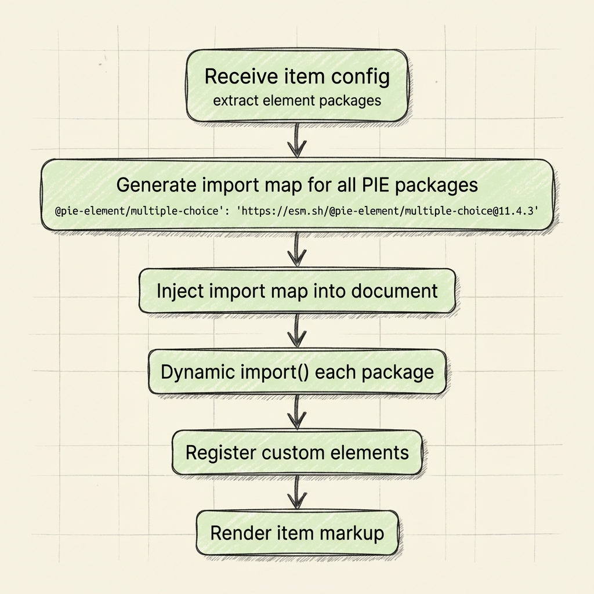

# PIE Players - High-Level Architecture

**Version**: 1.0
**Date**: 2026-01-09
**Status**: Architecture Specification

---

## Executive Summary

The **PIE Players** project provides a comprehensive, modern architecture for rendering and delivering Platform for Interactive Education (PIE) assessment content. The system consists of multiple **item players** (for rendering individual questions) and an **assessment toolkit** (for coordinating full test experiences with tools, accommodations, and navigation).

Built with Bun, TypeScript, and Svelte 5, the architecture leverages modern web standards (Web Components, CSS Custom Highlight API) while maintaining framework independence and backwards compatibility with existing PIE content.

### Key Capabilities

- **Multiple Player Types**: IIFE (legacy compatible), ESM (modern), and Fixed (pre-bundled) players
- **Unified Authoring & Delivery**: Single players support both student/teacher delivery views and authoring/configuration modes
- **Assessment Toolkit**: Reference implementation for full test delivery with navigation, tools, and accommodations
- **Accessibility First**: WCAG 2.2 AA compliance, IEP/504 accommodation support
- **Framework Agnostic**: Web Components work with any JavaScript framework

---

## Table of Contents

1. [System Overview](#system-overview)
2. [Item Players](#item-players)
3. [Assessment Toolkit](#assessment-toolkit)
4. [Tools & Accommodations](#tools--accommodations)
5. [Question Layout Engine](#question-layout-engine)
6. [Technology Stack](#technology-stack)
7. [Integration Patterns](#integration-patterns)
8. [References](#references)

---

## System Overview

### Architectural Layers

The PIE Players architecture consists of three major areas organized into logical layers:


### Component Organization


---

## Item Players

Item players are Web Components that render individual PIE assessment items. They handle element loading, model transformation, and session management.

### Player Types

#### 1. IIFE Player (`<pie-iife-player>`)

**Purpose**: Load PIE elements dynamically from IIFE bundles (legacy format).

**Use Cases**:

- Drop-in replacement for `@pie-framework/pie-player-components`
- Backwards compatibility with existing PIE deployments
- Dynamic element loading from PIE build service or CDN

**Loading Strategy**:


1. Receive item config → extract element versions
2. Fetch IIFE bundle from PIE build service
3. Execute IIFE to register elements globally
4. Render item markup with registered elements
5. Initialize models via controllers

**Key Features**:

- Dynamic bundle loading from PITS (PIE build service)
- CDN support with bundle hash
- Multiple environment support (prod, stage, dev)
- Hosted mode (server-side vs client-side controllers)

**Attributes**:

- `config` - Item configuration
- `env` - Environment (mode: gather/evaluate, role: student/instructor)
- `session` - Session data for responses
- `bundle-host` - PITS environment (prod/stage/dev)
- `use-cdn` - Use CDN instead of build service

See: [packages/iife-player/src/README.md](../packages/iife-player/src/README.md)

---

#### 2. ESM Player (`<pie-esm-player>`)

**Purpose**: Load PIE elements from modern ESM packages (future-forward).

**Use Cases**:

- Modern browsers with native ESM support
- Smaller bundle sizes (~85% reduction vs IIFE)
- Faster loading with import maps

**Loading Strategy**:



1. Receive item config → extract element packages
2. Generate import map for all PIE packages
3. Inject import map into document
4. Dynamic import() each package
5. Register custom elements
6. Render item markup

**Key Features**:

- Pure ESM (no IIFE fallback)
- Import maps for dependency resolution
- Configurable CDN (esm.sh, jsDelivr)
- Smaller bundle size
- Modern browsers only (Chrome 89+, Firefox 108+, Safari 16.4+)

**Attributes**:

- `config` - Item configuration
- `env` - Environment
- `session` - Session data
- `esm-cdn-url` - ESM CDN base URL
- `esm-probe-timeout` - Package probe timeout

See: [packages/esm-player/src/README.md](../packages/esm-player/src/README.md)

---

#### 3. Fixed Player (`<pie-fixed-player>`)

**Purpose**: Pre-bundled player with fixed element combinations (performance optimized).

**Use Cases**:

- Performance-critical deployments
- Fixed question type sets
- Reduced runtime overhead

**Loading Strategy**:


1. Install npm package with pre-bundled elements
2. Import player (elements already bundled)
3. Render item with pre-registered elements
4. No runtime bundle fetching

**Key Features**:

- Zero runtime bundle loading
- Hash-based versioning (deterministic builds)
- Smaller API payload (data only, no bundles)
- Build-time element combination
- CI/CD publishing from in-repo configs

**Bundle Hash Format**:

```
@pie-framework/pie-fixed-player-static@{loader-version}-{element-hash}.{iteration}
Example: @pie-framework/pie-fixed-player-static@1.0.1-a3f8b2c.1
```

**Attributes**:

- `item-id` - Item identifier
- `api-base-url` - API endpoint for data-only response
- `token` - JWT authentication
- `env` - Environment

See: [packages/fixed-player/src/README.md](../packages/fixed-player/src/README.md)

---

### Player Comparison

| Feature             | IIFE Player   | ESM Player  | Fixed Player |
| ------------------- | ------------- | ----------- | ------------ |
| **Bundle Format**   | IIFE          | ESM         | Pre-bundled  |
| **Loading**         | Dynamic       | Dynamic     | Static       |
| **Browser Support** | All           | Modern      | All          |
| **Bundle Size**     | Large         | Small       | Smallest     |
| **Performance**     | Medium        | Medium      | Fast         |
| **Flexibility**     | High          | High        | Low          |
| **Use Case**        | Legacy compat | Modern apps | Performance  |

---

### Unified Authoring & Delivery

**New in this generation**: All players support both **delivery** (student/teacher views) and **authoring** (configuration) modes in a single package.

**Legacy**: Separate packages (`pie-player` for delivery, `pie-author` for authoring).

**Mode Switching**:

```html
<!-- Delivery Mode (Student View) -->
<pie-iife-player
  config={itemConfig}
  env={{ mode: 'gather', role: 'student' }}
></pie-iife-player>

<!-- Authoring Mode (Configure) -->
<pie-iife-player
  config={itemConfig}
  mode="author"
  configuration={configurationOptions}
  onmodel-updated={(e) => console.log('Model updated:', e.detail)}
></pie-iife-player>
```

**Benefits**:

- Single package to install and maintain
- Consistent API across modes
- Easier version management
- Reduced bundle duplication

See: [docs/AUTHORING_MODE.md](AUTHORING_MODE.md)

---

## Assessment Toolkit

The **Assessment Toolkit** provides composable services for coordinating tools, accommodations, and full test delivery. It's designed as a **toolkit, not a framework** — products use only what they need.

### Core Principles

1. **Composable Services** - Import only what you need
2. **No Framework Lock-in** - Works with any JavaScript framework
3. **Product Control** - Products control navigation, persistence, layout, backend
4. **Standard Contracts** - Well-defined event types for component communication

### Toolkit Services

#### 1. ToolCoordinator

**Purpose**: Central service managing tool visibility and z-index layering.

**Key Methods**:

```typescript
toolCoordinator.registerTool(id, name, element);
toolCoordinator.showTool(id);
toolCoordinator.hideTool(id);
toolCoordinator.bringToFront(element);
toolCoordinator.isToolVisible(id);
```

**Z-Index Layers**:


```
0-999:     PIE content and player chrome
1000-1999: Non-modal tools (ruler, protractor, line reader)
2000-2999: Modal tools (calculator, dictionary)
3000-3999: Tool control handles (drag, resize)
4000-4999: Highlight infrastructure (TTS, annotations)
5000+:     Critical overlays (errors, notifications)
```

---

#### 2. HighlightCoordinator

**Purpose**: Manages text highlighting for TTS and annotations using CSS Custom Highlight API.

**The Problem**: Both TTS (temporary word highlighting) and student annotations (persistent highlighting) need to highlight text simultaneously without interfering.

**Technology**: CSS Custom Highlight API (Chrome 105+, Safari 17.2+, Firefox 128+)

**Key Methods**:

```typescript
// TTS highlights (temporary)
highlightCoordinator.highlightTTSWord(textNode, start, end);
highlightCoordinator.highlightTTSSentence(ranges);
highlightCoordinator.clearTTS();

// Annotation highlights (persistent)
highlightCoordinator.addAnnotation(range, color); // returns ID
highlightCoordinator.removeAnnotation(id);
```

**Benefits vs Traditional Approach**:

- Zero DOM mutation (preserves framework virtual DOM)
- Framework-compatible
- Screen reader friendly
- Multiple highlights overlap gracefully
- Better performance

---

#### 3. TTSService

**Purpose**: Singleton text-to-speech service with word highlighting synchronization.

**Key Features**:

- Read full question or selected text
- Pause, resume, stop playback
- Word-level highlighting synchronized with audio
- Voice selection and speed control
- State management (playing, paused, stopped)

**Provider Architecture**:

- **BrowserTTSProvider** - Web Speech API (implemented)
- **AWS Polly Provider** - Cloud-based neural voices (interface defined)

**Integration**:

```typescript
const ttsService = TTSService.getInstance();
await ttsService.initialize("browser");
ttsService.setHighlightCoordinator(highlightCoordinator);

await ttsService.speak("Read this text");
await ttsService.speakRange(selectedRange);

ttsService.pause();
ttsService.resume();
ttsService.stop();
```

---

#### 4. ThemeProvider

**Purpose**: Accessibility theming (color schemes, font sizes).

**Key Features**:

- High contrast modes
- Font size scaling
- Color scheme support
- CSS custom properties

**API**:

```typescript
themeProvider.applyTheme({
  highContrast: true,
  fontSize: "large",
  backgroundColor: "#000",
  foregroundColor: "#fff",
});

themeProvider.setHighContrast(true);
themeProvider.setFontSize("xlarge");
```

---

#### 5. ToolConfigResolver

**Purpose**: IEP/504 tool configuration resolution (3-tier hierarchy).

**Three-Tier Configuration**:


```
Item Level (most specific):
  "This question requires scientific calculator"
      ↓
Roster/Test Level:
  "Calculator allowed, dictionary blocked"
      ↓
Student Level:
  "Student has TTS accommodation per IEP"
      ↓
Final Configuration:
  Scientific calculator (required) + TTS (enabled)
```

**Precedence Rules**:

1. Roster block (`"0"` = blocked) — highest priority
2. Item restriction
3. Item requirement
4. Student accommodation
5. Roster default (`"1"` = allowed)
6. System default (not allowed)

**API**:

```typescript
const resolver = new ToolConfigResolver();

const resolved = resolver.resolveTool(
  "calculator",
  itemConfig.tools,
  rosterConfig.allowances,
  studentProfile.accommodations
);

const allTools = resolver.resolveAll({
  itemConfig,
  rosterConfig,
  studentProfile,
});
```

---

### Assessment Player (Reference Implementation)

The **Assessment Player** is a reference implementation showing how to wire toolkit services together for full test delivery.


**Features**:

- Linear navigation through assessment items
- Event-driven architecture with TypedEventBus
- Session state management with subscriptions
- TTS integration via TTSService
- Theme support via ThemeProvider
- ToolCoordinator and HighlightCoordinator integration
- Product-specific callbacks for customization

**Integration Pattern**:

```typescript
import {
  TypedEventBus,
  ToolCoordinator,
  HighlightCoordinator,
  TTSService,
  ThemeProvider,
  ToolConfigResolver,
} from "@pie-framework/assessment-toolkit";

// Initialize services
const eventBus = new TypedEventBus();
const toolCoordinator = new ToolCoordinator();
const highlightCoordinator = new HighlightCoordinator();
const ttsService = TTSService.getInstance();
const themeProvider = new ThemeProvider();
const toolResolver = new ToolConfigResolver();

// Wire up events
eventBus.on("player:session-changed", async (e) => {
  await myBackend.saveSession(e.detail);
});

eventBus.on("tool:activated", (e) => {
  toolCoordinator.bringToFront(e.target);
});
```

See: [packages/assessment-toolkit/src/README.md](../packages/assessment-toolkit/src/README.md)

---

## Tools & Accommodations

The toolkit includes a set of **accessibility accommodations** and **assessment tools** (calculator, ruler, protractor, line reader, magnifier, TTS, highlighting, etc.) implemented as Web Components and coordinated via shared services (ToolCoordinator, HighlightCoordinator, TTSService, ThemeProvider).

**Canonical docs:**

- [Tools & Accommodations Architecture](tools-and-accomodations/architecture.md)
- [Tool development & integration](../packages/assessment-toolkit/src/tools/README.md)
- [Calculator providers](../packages/assessment-toolkit/src/tools/calculators/README.md)

---

## Question Layout Engine

The Question Layout Engine defines how assessment UI is composed (template selection, responsive layout, slots for passage/item/tools) while keeping navigation/state/persistence in a separate session layer.

**Canonical doc:**

- [Question Layout Engine Architecture](question-layout-engine-architecture.md)

---

## Technology Stack

### Core Technologies

**Bun**

- Fast all-in-one toolkit
- Package manager, bundler, runtime
- TypeScript support out of the box

**TypeScript**

- Type-safe development
- Enhanced IDE support
- Better refactoring

**Svelte 5**

- Reactive UI framework with runes
- Compiles to efficient vanilla JavaScript
- Small bundle size (~3KB per component)
- Runes: `$state`, `$derived`, `$effect`

**Turbo**

- High-performance build system
- Monorepo task orchestration
- Caching and parallelization

**Vite**

- Lightning-fast dev server
- Modern bundler
- HMR (Hot Module Replacement)

### Web Standards

**Web Components (Custom Elements)**

- Framework-agnostic standard
- Native browser support
- Encapsulation with shadow DOM (optional)

**CSS Custom Highlight API**

- Native highlighting without DOM mutation
- Multiple overlapping highlights
- Screen reader compatible
- Chrome 105+, Safari 17.2+, Firefox 128+

**Web Speech API**

- Browser-native text-to-speech
- Voice selection and rate control
- Word boundary events for highlighting

**CSS Container Queries**

- Responsive tool layouts
- Component-level responsive design
- Chrome 105+, Safari 16+, Firefox 110+

### Supporting Libraries

**Moveable.js**

- Drag, rotate, resize functionality
- Used by ruler and protractor tools
- Keyboard navigation support

**Desmos API**

- Graphing calculator integration
- Scientific calculator modes
- LaTeX math expression support

**Math.js**

- Open source calculator engine
- Apache 2.0 license (free)
- Scientific functions

### Browser Support

**Target**: Modern evergreen browsers

**Coverage**: ~85% global browser market (2025)

**Fallback Strategy**: Graceful degradation for advanced features

---

## Integration Patterns

### Pattern 1: Standalone Item Player

Use a single item player for rendering individual questions:

```html
<script type="module">
  import '@pie-framework/pie-iife-player'
</script>

<pie-iife-player
  config={itemConfig}
  env={{ mode: 'gather', role: 'student' }}
  session={{ id: 'session-123', data: [] }}
></pie-iife-player>
```

### Pattern 2: Item Player + Tools

Add assessment tools to item player:

```typescript
import { ToolCoordinator } from "@pie-framework/assessment-toolkit";
import "@pie-framework/pie-tool-calculator";

const toolCoordinator = new ToolCoordinator();

// Register calculator
toolCoordinator.registerTool("calculator", "Calculator", calcElement);

// Show calculator
toolCoordinator.showTool("calculator");
```

### Pattern 3: Full Assessment (Toolkit)

Use assessment toolkit for complete test delivery:

```typescript
import {
  TypedEventBus,
  ToolCoordinator,
  HighlightCoordinator,
  TTSService,
  ThemeProvider,
} from "@pie-framework/assessment-toolkit";

// Initialize services
const eventBus = new TypedEventBus();
const toolCoordinator = new ToolCoordinator();
const highlightCoordinator = new HighlightCoordinator();
const ttsService = TTSService.getInstance();
const themeProvider = new ThemeProvider();

// Wire up events
eventBus.on("player:session-changed", async (e) => {
  await backend.saveSession(e.detail);
});
```

### Pattern 4: Custom Assessment Player

Build your own assessment player using toolkit services:

```typescript
class CustomAssessmentPlayer {
  private eventBus = new TypedEventBus();
  private toolCoordinator = new ToolCoordinator();

  constructor() {
    this.setupEventHandlers();
    this.setupNavigation();
    this.setupPersistence();
  }

  private setupEventHandlers() {
    this.eventBus.on("player:session-changed", async (e) => {
      await this.saveToBackend(e.detail);
    });
  }

  private setupNavigation() {
    // Custom navigation logic
  }

  private setupPersistence() {
    // Custom persistence logic
  }
}
```

---

## References

### Documentation

- [Authoring Mode Guide](AUTHORING_MODE.md) - Complete authoring documentation
- [Question Layout Engine Architecture](question-layout-engine-architecture.md) - Layout system design
- [Tools & Accommodations Architecture](tools-and-accomodations/architecture.md) - Tools system design
- [Assessment Toolkit README](../packages/assessment-toolkit/src/README.md) - Toolkit usage
- [Tools README](../packages/assessment-toolkit/src/tools/README.md) - Tool development guide

### Standards & Specifications

- [WCAG 2.2 Guidelines](https://www.w3.org/WAI/WCAG22/quickref/)
- [CSS Custom Highlight API](https://developer.mozilla.org/en-US/docs/Web/API/CSS_Custom_Highlight_API)
- [Web Components](https://developer.mozilla.org/en-US/docs/Web/API/Web_components)
- [Web Speech API](https://developer.mozilla.org/en-US/docs/Web/API/Web_Speech_API)
- [QTI Specification](http://www.imsglobal.org/question/index.html)

### PIE Framework

- [PIE Documentation](https://pie-api.readme.io/)
- [PIE Elements](https://github.com/pie-framework/pie-elements)
- [PIE Examples](https://github.com/pie-framework/pie-examples)

---

## Conclusion

The **PIE Players** architecture provides a comprehensive, modern foundation for rendering PIE assessment content. The system is organized into three major areas:

1. **Item Players** - Multiple player types (IIFE, ESM, Fixed) for different deployment scenarios
2. **Assessment Toolkit** - Composable services for full test delivery with tools and accommodations
3. **Tools & Accommodations** - 15+ assessment tools with WCAG 2.2 AA compliance

By leveraging modern web standards (Web Components, CSS Custom Highlight API) and maintaining framework independence, the architecture ensures long-term maintainability, excellent performance, and broad compatibility.

The toolkit approach (vs framework) gives products maximum flexibility while providing battle-tested reference implementations for common scenarios.

---

**Document Version**: 1.0
**Last Updated**: 2026-01-09
**Maintainers**: PIE Framework Team
