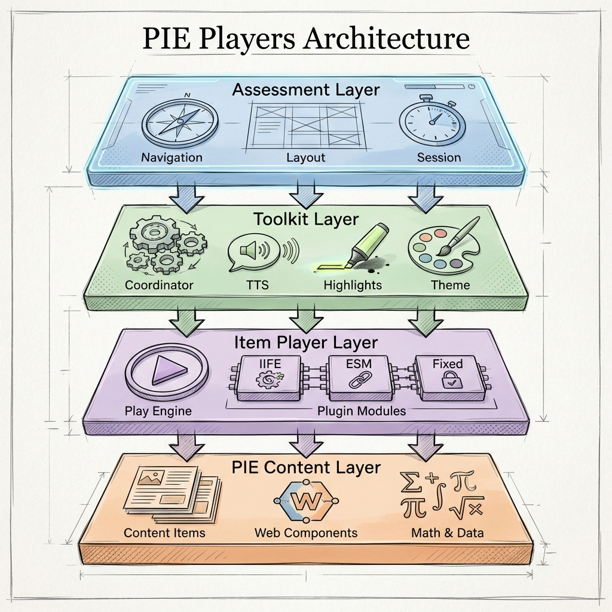
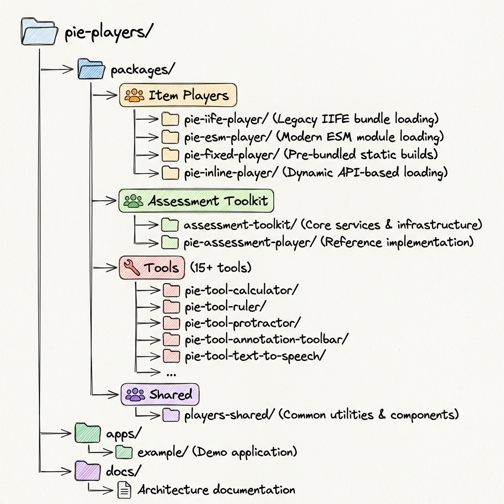

# PIE Players - High-Level Architecture

**Version**: 2.0
**Date**: 2026-02-08
**Status**: Architecture Specification

---

## Executive Summary

The **PIE Players** project provides a comprehensive, modern architecture for rendering and delivering Platform for Interactive Education (PIE) assessment content. The system consists of multiple **item players** (for rendering individual questions) and an **assessment toolkit** (for coordinating full test experiences with tools, accommodations, and navigation).

Built with Bun, TypeScript, and Svelte 5, the architecture leverages modern web standards (Web Components, CSS Custom Highlight API) while maintaining framework independence and backwards compatibility with existing PIE content.

### Key Capabilities

- **Multiple Player Types**: IIFE (legacy compatible), ESM (modern), and Fixed (pre-bundled) players
- **Unified Authoring & Delivery**: Single players support both student/teacher delivery views and authoring/configuration modes
- **Assessment Toolkit**: Composable services for full test delivery with navigation, tools, and accommodations
- **Accessibility First**: WCAG 2.2 AA compliance, IEP/504 accommodation support
- **Framework Agnostic**: Web Components work with any JavaScript framework

---

## Table of Contents

1. [System Overview](#system-overview)
2. [Item Players](#item-players)
3. [Assessment Toolkit](#assessment-toolkit)
4. [Tools & Accommodations](#tools--accommodations)
5. [Technology Stack](#technology-stack)
6. [Integration Patterns](#integration-patterns)
7. [References](#references)

---

## System Overview

### Architectural Layers

The PIE Players architecture consists of three major areas organized into logical layers:

**Layer 1: Content Rendering** - Item players that render individual PIE assessment items
**Layer 2: Orchestration** - Section player and assessment toolkit services that coordinate full assessments
**Layer 3: Tools & Accommodations** - Accessibility tools and test-taking accommodations

### Component Organization

---

## Item Players

Item players are Web Components that render individual PIE assessment items. They handle element loading, model transformation, and session management.

### Player Types

#### 1. IIFE Player (`<pie-iife-player>`)

**Purpose**: Load PIE elements dynamically from IIFE bundles (legacy format).

**Architecture**:
- Fetches IIFE bundles from PIE build service (PITS) or CDN
- Executes IIFE to register elements globally in window
- Renders item markup with registered custom elements
- Initializes models via PIE controllers

**Use Cases**:
- Drop-in replacement for `@pie-framework/pie-player-components`
- Backwards compatibility with existing PIE deployments
- Dynamic element loading from PIE build service or CDN

**Key Features**:
- Dynamic bundle loading from PITS (prod/stage/dev environments)
- CDN support with bundle hash
- Hosted mode (server-side vs client-side controllers)

See: [packages/iife-player/src/README.md](../packages/iife-player/src/README.md)

---

#### 2. ESM Player (`<pie-esm-player>`)

**Purpose**: Load PIE elements from modern ESM packages with view-based architecture.

**Architecture**:
- Generates import maps for PIE packages and dependencies
- Uses native dynamic import() for package loading
- Supports view-based loading (delivery, author, print, custom variants)
- Automatic fallback to standard view if custom view unavailable

**Use Cases**:
- Modern browsers with native ESM support
- Smaller bundle sizes (~85% reduction vs IIFE)
- UI variant selection (mobile, accessibility, branding)

**View System**:

The ESM player supports loading different views/variants of elements through ESM subpath exports.

**Built-in views**:
- `delivery` - Standard student/teacher interaction (root export)
- `author` - Configuration UI (`/author` export)
- `print` - Print views (`/print` export)

**Custom views** (enabled by package.json subpath exports):
- `delivery-mobile` - Touch-optimized UI for tablets/phones
- `delivery-a11y` - Accessibility-optimized (screen readers, high contrast)
- `delivery-simple` - Simplified UI for younger students
- `delivery-branded` - Custom district branding

**Benefits**:
- Shared controller logic across all UI variants
- Consistent assessment results regardless of view
- Easy maintenance with single business logic codebase
- Graceful degradation with automatic fallback

See: [packages/esm-player/src/README.md](../packages/esm-player/src/README.md)

---

#### 3. Fixed Player (`<pie-fixed-player>`)

**Purpose**: Pre-bundled player with fixed element combinations (performance optimized).

**Architecture**:
- All elements pre-bundled at build time
- Zero runtime bundle fetching
- Hash-based versioning for deterministic builds

**Use Cases**:
- Performance-critical deployments
- Fixed question type sets
- Reduced runtime overhead

**Key Features**:
- Build-time element combination
- Smaller API payload (data only, no bundles)
- CI/CD publishing from in-repo configs

See: [packages/fixed-player/src/README.md](../packages/fixed-player/src/README.md)

---

#### 4. Print Player (`<pie-print>`)

**Purpose**: Render complete assessment items for print (paper tests, answer keys, PDF export).

**Architecture**:
- Loads print modules from CDN
- Transforms markup (replaces interactive tags with print tags)
- Role-based rendering (student worksheets vs instructor answer keys)
- Hash-based element naming to avoid conflicts

**Use Cases**:
- Paper-based assessments
- Teacher answer keys with rationales
- PDF exports for archival/compliance
- Print previews in content authoring systems

See: [packages/print-player/README.md](../packages/print-player/README.md)

---

### Player Comparison

| Feature             | IIFE Player   | ESM Player  | Fixed Player | Print Player |
| ------------------- | ------------- | ----------- | ------------ | ------------ |
| **Bundle Format**   | IIFE          | ESM         | Pre-bundled  | ESM          |
| **Loading**         | Dynamic       | Dynamic     | Static       | Dynamic      |
| **Browser Support** | All           | Modern      | All          | Modern       |
| **Bundle Size**     | Large         | Small       | Smallest     | Small        |
| **Performance**     | Medium        | Medium      | Fast         | Fast         |
| **Interactivity**   | Yes           | Yes         | Yes          | No (static)  |
| **Use Case**        | Legacy compat | Modern apps | Performance  | Print/PDF    |

---

### Element Loading Optimization

The section player implements **element aggregation** to eliminate duplicate bundle loads when multiple items use the same PIE elements.

**Problem**: Without aggregation, each item loads elements independently, causing duplicate network requests.

**Solution**: Aggregate elements from all items and load once:
- Section player analyzes all items upfront
- Creates element loader (IIFE or ESM)
- Loads all unique elements in one operation
- Items initialize from pre-loaded registry

**Performance Benefits**:
- Section with 5 items (3 multiple-choice, 2 hotspot)
  - Before: 5 loader calls, ~550ms total
  - After: 1 loader call, ~250ms total
  - **50% faster**

**Architecture**: Element loaders implement a common interface with `loadFromItems()` method that handles aggregation and version conflict detection.

See: `@pie-players/pie-players-shared/loaders` for implementation details.

---

### Unified Authoring & Delivery

**New in this generation**: All players support both **delivery** (student/teacher views) and **authoring** (configuration) modes in a single package.

**Benefits**:
- Single package to install and maintain
- Consistent API across modes
- Easier version management
- Reduced bundle duplication

**Mode Switching**: Players accept a `mode` attribute/property that switches between delivery and authoring views, loading the appropriate element view variant.

See: [docs/AUTHORING_MODE.md](AUTHORING_MODE.md)

---

## Assessment Toolkit

The **Assessment Toolkit** provides composable services for coordinating tools, accommodations, and full test delivery. It's designed as a **toolkit, not a framework** — products use only what they need.

### Core Principles

1. **Composable Services** - Import only what you need
2. **No Framework Lock-in** - Works with any JavaScript framework
3. **Product Control** - Products control navigation, persistence, layout, backend
4. **Standard Contracts** - Well-defined event types for component communication
5. **QTI 3.0 Native** - Uses QTI 3.0 Personal Needs Profile (PNP) directly for accessibility accommodations
6. **Section Player Integration** - Toolkit services integrate seamlessly with the section player

### Primary Interface: Section Splitpane Player

The splitpane custom element from `@pie-players/pie-section-player` is the primary container/interface for integrating assessment toolkit services. When services are passed to the splitpane player, it automatically:

- Extracts SSML from embedded `<speak>` tags in passages and items
- Manages accessibility catalog lifecycle (add on load, clear on navigation)
- Renders TTS tools inline in passage/item headers
- Resolves catalogs with priority: extracted → item → assessment
- Coordinates z-index layering for tools
- Synchronizes text highlighting with TTS playback

**Integration Pattern**: Products initialize toolkit services and pass them as JavaScript properties to `pie-section-player-splitpane`. The player handles the rest automatically.

See: [TOOL_PROVIDER_SYSTEM](./TOOL_PROVIDER_SYSTEM.md) for integration details.

---

### QTI 3.0 Support

The toolkit natively supports **QTI 3.0** features for industry-standard assessment delivery.

#### Implemented Features

**1. Personal Needs Profile (PNP)** - Student accommodations and IEP/504 support

Maps QTI 3.0 PNP support IDs to PIE tools with precedence hierarchy:
1. District block (absolute veto) - highest priority
2. Test administration override
3. Item restriction (per-item block)
4. Item requirement (forces enable)
5. District requirement
6. PNP supports (student needs)

**2. Context Declarations** - Global variables shared across items

Enables:
- Cross-item randomization (shared random seeds)
- Adaptive testing (difficulty adjustment based on performance)
- Shared configuration (currency symbols, measurement units)
- Item dependencies

#### Planned Features

**3. Accessibility Catalogs** (Phase 2) - Alternative content representations
- Pre-recorded TTS audio files
- Sign language videos
- Braille representations
- Simplified language versions

**4. Stimulus References** (Phase 3) - Shared passages/stimuli
- Reading comprehension passages
- Shared diagrams/images
- Split-view layouts

#### Benefits

- **Standards Compliant**: Uses QTI 3.0 directly (no custom abstractions)
- **Simpler Code**: 72% reduction in abstraction complexity
- **Easy Integration**: One-line initialization for full QTI 3.0 support
- **Third-Party Friendly**: All services work independently

---

### ToolkitCoordinator: Centralized Service Management

The **ToolkitCoordinator** is a centralized orchestrator for all PIE Assessment Toolkit services, providing a single entry point for initialization, configuration, and service management.

**Problem Solved**: Before ToolkitCoordinator, applications had to manage multiple independent services (TTSService, ToolCoordinator, HighlightCoordinator, AccessibilityCatalogResolver, ElementToolStateStore), wire them together, and pass all separately to the player.

**Solution**: Single coordinator that owns all services as public properties. Products initialize one coordinator with configuration and pass it to the section player.

**Benefits**:
- Single initialization point
- Centralized configuration
- Services owned by coordinator
- Tool state management included
- Sensible defaults (section player creates default coordinator if not provided)

**Architecture**: The coordinator manages five core services and provides convenience methods for tool configuration and state management.

See: [packages/assessment-toolkit/src/README.md](../packages/assessment-toolkit/src/README.md) for API details.

---

### Toolkit Services

The toolkit provides six core services that work together:

#### 1. ToolCoordinator

**Purpose**: Central service managing tool visibility and z-index layering.

**Architecture**: Maintains tool registry with visibility state and manages z-index layers:
- 0-999: PIE content and player chrome
- 1000-1999: Non-modal tools (ruler, protractor, line reader)
- 2000-2999: Modal tools (calculator)
- 3000-3999: Tool control handles (drag, resize)
- 4000-4999: Highlight infrastructure (TTS, annotations)
- 5000+: Critical overlays (errors, notifications)

---

#### 2. HighlightCoordinator

**Purpose**: Manages text highlighting for TTS and annotations using CSS Custom Highlight API.

**Problem Solved**: Both TTS (temporary word highlighting) and student annotations (persistent highlighting) need to highlight text simultaneously without interfering.

**Technology**: CSS Custom Highlight API (Chrome 105+, Safari 17.2+, Firefox 128+)

**Benefits**:
- Zero DOM mutation (preserves framework virtual DOM)
- Framework-compatible
- Screen reader friendly
- Multiple highlights overlap gracefully
- Better performance

---

#### 3. TTSService

**Purpose**: Text-to-speech service with word highlighting synchronization.

**Architecture**:
- Provider-based (BrowserTTSProvider, AWS Polly Provider)
- Integrates with HighlightCoordinator for synchronized highlighting
- Works with AccessibilityCatalogResolver for QTI 3.0 catalog support

**Key Features**:
- Read full question or selected text
- Pause, resume, stop playback
- Word-level highlighting synchronized with audio
- Voice selection and speed control
- State management (playing, paused, stopped)

---

#### 4. AccessibilityCatalogResolver

**Purpose**: QTI 3.0 accessibility catalog resolution with automatic SSML extraction.

**Architecture**:
- Resolves catalogs with priority: extracted → item → assessment
- Supports pre-recorded audio, sign language videos, braille
- Integrates with section player for automatic SSML extraction

---

#### 5. ElementToolStateStore

**Purpose**: Manages element-level ephemeral tool state using globally unique composite keys.

**Architecture**: Uses composite key format `${assessmentId}:${sectionId}:${itemId}:${elementId}` to ensure uniqueness across multi-section assessments.

**State Separation**: Tool state (ephemeral, client-only) is separate from PIE session data (persistent, sent to server for scoring).

---

#### 6. PNPToolResolver

**Purpose**: QTI 3.0 Personal Needs Profile (PNP) tool resolution with precedence hierarchy.

**Architecture**: Resolves tool availability following QTI 3.0 PNP precedence rules, mapping QTI support IDs to PIE tool IDs.

---

### Assessment Player (Future Reference Implementation)

A reference **Assessment Player** may be provided as an optional higher-level abstraction for multi-section assessments. It would:

- Manage navigation across multiple sections
- Coordinate section player instances
- Provide assessment-level state management
- Delegate to section players for rendering and toolkit integration

**Current Status**: The section player is the primary interface. An AssessmentPlayer would be a convenience wrapper.

---

## Tools & Accommodations

The toolkit includes 15+ **accessibility accommodations** and **assessment tools** implemented as Web Components and coordinated via shared services.

**Tools Include**:
- Text-to-Speech (TTS)
- Calculator (Desmos, Math.js)
- Ruler & Protractor
- Line Reader
- Answer Eliminator
- Magnifier
- Highlighter
- Color Contrast
- And more...

**Coordination**: Tools register with ToolCoordinator for z-index management, use HighlightCoordinator for text highlighting, and integrate with TTSService for read-aloud functionality.

**Canonical Documentation**:
- [Tools & Accommodations Architecture](tools-and-accomodations/architecture.md)
- [Tool Development & Integration](../packages/assessment-toolkit/src/tools/README.md)
- [Calculator Providers](../packages/assessment-toolkit/src/tools/calculators/README.md)

---

## Technology Stack

### Core Technologies

- **Bun** - Fast all-in-one toolkit (package manager, bundler, runtime)
- **TypeScript** - Type-safe development with enhanced IDE support
- **Svelte 5** - Reactive UI framework with runes, compiles to efficient vanilla JavaScript
- **Turbo** - High-performance build system for monorepo task orchestration
- **Vite** - Lightning-fast dev server with HMR

### Web Standards

- **Web Components (Custom Elements)** - Framework-agnostic standard with native browser support
- **CSS Custom Highlight API** - Native highlighting without DOM mutation
- **Web Speech API** - Browser-native text-to-speech with word boundary events
- **CSS Container Queries** - Component-level responsive design

### Supporting Libraries

- **Moveable.js** - Drag, rotate, resize functionality for ruler and protractor tools
- **Desmos API** - Graphing and scientific calculator integration
- **Math.js** - Open source calculator engine (Apache 2.0 license)

### Browser Support

- **Target**: Modern evergreen browsers
- **Coverage**: ~85% global browser market (2026)
- **Fallback Strategy**: Graceful degradation for advanced features

---

## Integration Patterns

### Pattern 1: Standalone Item Player

Use a single item player for rendering individual questions. Suitable for embedding single questions in content management systems or learning platforms.

**Players**: IIFE, ESM, or Fixed player
**Complexity**: Low
**Use Case**: Single question rendering

---

### Pattern 2: Item Player + Standalone Tools

Add individual assessment tools to item player without full toolkit integration. Suitable for simple test-taking experiences with limited accommodation needs.

**Architecture**: Direct tool registration with ToolCoordinator
**Complexity**: Medium
**Use Case**: Simple assessments with basic tools

---

### Pattern 3: Section Player with Toolkit

Use section player with full assessment toolkit for complete section delivery with QTI 3.0 support. This is the recommended pattern for production assessments.

**Architecture**:
1. Initialize toolkit services (TTSService, catalogResolver, coordinators)
2. Pass services to section player as JavaScript properties
3. Section player automatically handles SSML extraction, catalog lifecycle, TTS tools, service coordination

**Complexity**: Medium
**Use Case**: Production assessments with full accessibility support

**See**: [TOOL_HOST_CONTRACT](./TOOL_HOST_CONTRACT.md) for runtime host/tool examples.

---

### Pattern 4: Custom Assessment Player

Build your own assessment player using toolkit services for complete control over navigation, layout, and persistence.

**Architecture**: Use toolkit services directly with custom player logic
**Complexity**: High
**Use Case**: Custom assessment experiences with specific requirements

---

## References

### Architecture Documentation

- [Authoring Mode Guide](AUTHORING_MODE.md) - Complete authoring documentation
- [Tools & Accommodations Architecture](tools-and-accomodations/architecture.md) - Tools system design
- [Math Renderer Architecture](MATH-RENDERER-ARCHITECTURE.md) - Pluggable math rendering
- [Question Layout Engine Architecture](question-layout-engine-architecture.md) - Layout system design

### Package Documentation

- [Assessment Toolkit README](../packages/assessment-toolkit/src/README.md) - Toolkit usage and QTI 3.0 examples
- [Section Player README](../packages/section-player/README.md) - Complete section player API
- [Tool Provider System](./TOOL_PROVIDER_SYSTEM.md) - Service integration details
- [Tools README](../packages/assessment-toolkit/src/tools/README.md) - Tool development guide

### Standards & Specifications

- [WCAG 2.2 Guidelines](https://www.w3.org/WAI/WCAG22/quickref/)
- [QTI Specification](http://www.imsglobal.org/question/index.html)
- [CSS Custom Highlight API](https://developer.mozilla.org/en-US/docs/Web/API/CSS_Custom_Highlight_API)
- [Web Components](https://developer.mozilla.org/en-US/docs/Web/API/Web_components)
- [Web Speech API](https://developer.mozilla.org/en-US/docs/Web/API/Web_Speech_API)

### PIE Framework

- [PIE Documentation](https://pie-api.readme.io/)
- [PIE Elements](https://github.com/pie-framework/pie-elements)
- [PIE Examples](https://github.com/pie-framework/pie-examples)

---

## Conclusion

The **PIE Players** architecture provides a comprehensive, modern foundation for rendering PIE assessment content. The system is organized into three major areas:

1. **Item Players** - Multiple player types (IIFE, ESM, Fixed, Print) for different deployment scenarios
2. **Assessment Toolkit** - Composable services for full test delivery with tools and accommodations
3. **Tools & Accommodations** - 15+ assessment tools with WCAG 2.2 AA compliance

By leveraging modern web standards (Web Components, CSS Custom Highlight API) and maintaining framework independence, the architecture ensures long-term maintainability, excellent performance, and broad compatibility.

The toolkit approach (vs framework) gives products maximum flexibility while providing battle-tested reference implementations for common scenarios. The section player serves as the primary interface, automatically handling SSML extraction, catalog lifecycle, and service coordination.

---

**Document Version**: 2.0
**Last Updated**: 2026-02-08
**Maintainers**: PIE Framework Team
