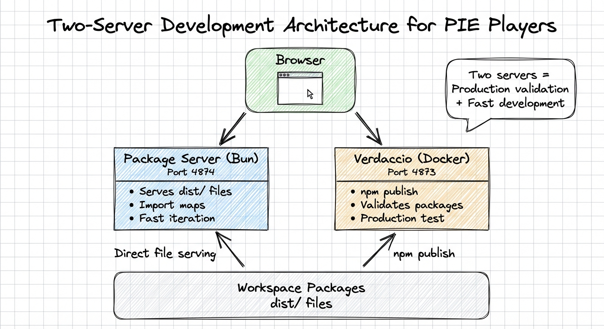
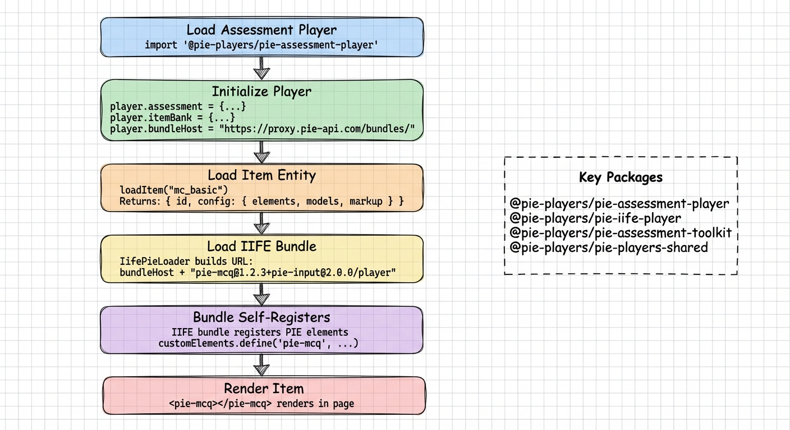
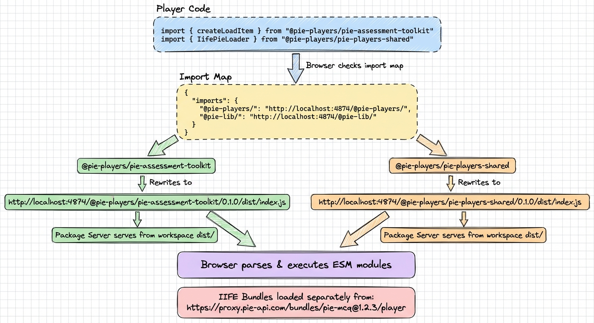

# PIE Players Demo System

## Overview

This document describes the demo system for PIE Players (assessment player, item players, toolkit, tools, and accommodations), using a two-tier architecture that provides both **production validation** and **fast development iteration**.

## Quick Start

**The example app serves as the main demo environment:**

```bash
# Start the example app (development mode)
bun run dev:example

# Or use the default dev command
bun run dev
```

The example app at `apps/example` provides:
- Assessment player demos at `/assessment`
- Item player demos (IIFE, ESM, Inline, Fixed) at their respective routes
- Toolkit component showcases
- Tool and accommodation testing

**For production-like testing with Verdaccio validation:**

```bash
# Start Verdaccio and publish packages
bun run registry:start
bun run registry:publish

# Start package server for CDN-like serving
bun run dev:demo

# Then use the example app or create standalone demos
```

## Architecture

### Two-Tier Design



The demo system uses two complementary servers working together:

| Server | Port | Purpose | Technology |
|--------|------|---------|------------|
| **Package Server** | 4874 | Serves built `dist/` files directly to browser via import maps | Bun script |
| **Verdaccio** | 4873 | Validates packages can be published to npm registry | Docker container |

**Why two servers?**

This architecture gives us the best of both worlds:

1. **Production Validation** (Verdaccio) - *Used at startup*
   - Validates packages once when starting the demo
   - Ensures packages are production-ready before real npm publish
   - Validates `package.json` configuration and exports
   - Catches packaging issues early (missing files, wrong paths)
   - Runs in background after initial validation

2. **Fast Development** (Package Server) - *Used continuously*
   - Serves files directly from workspace `dist/` folders to browser
   - No need to republish after every code change
   - Just rebuild and refresh browser for instant updates
   - CDN-like URLs for browser import maps
   - This is what the browser actually loads from during development

**Development Workflow:**

When you run `bun run dev:demo assessment-player`, here's what happens:

1. 🔍 **Startup validation** (one-time)
   - Verdaccio Docker container starts (if not running)
   - Packages are published to Verdaccio
   - This validates they're production-ready

2. 🚀 **Continuous serving** (during development)
   - Package Server starts on port 4874
   - Vite dev server starts on port 5174
   - Browser loads from Package Server (not Verdaccio!)

3. 🔄 **Making changes**
   - Edit code in your package
   - Rebuild: `bun run build` (in package directory)
   - Refresh browser - changes appear instantly
   - No need to republish to Verdaccio!

**Key point:** Browser gets files from Package Server (port 4874), not Verdaccio. Verdaccio just validates once at startup that packages are correct.

### Key Components

#### 1. Example App (`apps/example`)

The primary demo environment built with SvelteKit:

**Key Routes:**
- `/assessment` - Full assessment player with template selection
- `/toolkit` - Assessment toolkit component demos
- Individual player demos (IIFE, ESM, Inline, Fixed)
- Tool and accommodation showcases

**Features:**
- Hot module replacement (HMR) for fast iteration
- Sample assessments and item banks
- Mode switching (gather/view/evaluate)
- Live configuration editing
- Built with Svelte 5 and DaisyUI

#### 2. Assessment Player Web Component

The core player component (`packages/assessment-player`):

```html
<pie-assessment-player
  mode="gather"
></pie-assessment-player>
```

**Features:**
- Svelte 5 custom element with `shadow: none`
- Props: `assessment`, `itemBank`, `mode`, `bundleHost`, etc.
- Dynamically loads PIE items via IIFE bundles
- Built-in navigation, tools, and accommodations
- Session state management

#### 2. Package Server (`scripts/serve-packages.ts`)

A lightweight Bun script (~90 lines) that:
- Scans workspace for packages with `dist/` directories
- Serves files via HTTP with CORS enabled
- Provides CDN-like URLs: `http://localhost:4874/@pie-players/assessment-player/0.1.0/dist/index.js`
- Started automatically by demo commands
- Fast and simple—no configuration needed

#### 3. Verdaccio Registry (Docker)

A local npm registry running in Docker:
- Validates real-world npm package publishing
- Managed via `bun run registry:*` scripts
- Stores packages in `.verdaccio/` (gitignored)
- Ensures production readiness without publishing to public npm

#### 4. Player & Toolkit Architecture

**Players** (different packaging/delivery methods):
- `assessment-player` - Full assessment chrome with navigation, tools
- `iife-player` - Item player using IIFE bundles (production)
- `esm-player` - Item player using ESM modules
- `inline-player` - Inline embedded player
- `fixed-player` - Fixed layout player

**Toolkit** (`assessment-toolkit`):
- Reusable Svelte 5 components for building assessment UIs
- Item loading, navigation, scoring logic
- Tool and accommodation coordination
- Session state management

**Tools** (separate packages):
- `tool-calculator`, `tool-graph`, `tool-ruler`, etc.
- Each tool is a standalone package with its own web component
- Coordinated via the toolkit's tool coordinator

## File Structure

### Demo Application

```
apps/example/
├── src/
│   ├── routes/
│   │   ├── assessment/         # Assessment player demo
│   │   │   ├── +page.svelte    # Main demo UI
│   │   │   └── +page.ts        # SSR config
│   │   ├── toolkit/            # Toolkit demos
│   │   └── ...                 # Other player demos
│   └── lib/
│       └── sample-library/     # Shared sample data
│           ├── assessment-examples.ts
│           └── pie-examples.ts
├── vite.config.ts
└── package.json
```

### Scripts

```
scripts/
├── serve-packages.ts       # Package server (port 4874)
└── verdaccio.ts            # Verdaccio management
```

### Players & Toolkit

```
packages/
├── assessment-player/      # Full assessment chrome
├── assessment-toolkit/     # Reusable components
├── iife-player/           # IIFE item player
├── esm-player/            # ESM item player
├── inline-player/         # Inline player
├── fixed-player/          # Fixed player
├── tool-*/                # Individual tools
└── players-shared/        # Shared utilities
```

## How It Works

> **💡 Key Understanding:**
>
> - **Verdaccio (port 4873):** Validates packages once at startup. Ensures they can be published to npm. Runs in background.
> - **Package Server (port 4874):** Serves actual files to browser during development. Browser loads from here!
> - **Your workflow:** Edit code → Build → Refresh browser. No need to touch Verdaccio after startup.

### Flow Diagrams

#### Player Loading Sequence



This diagram shows the complete sequence from loading the assessment player through IIFE bundle loading and PIE element rendering.

#### Import Resolution via Import Maps



This diagram illustrates how browser import maps resolve @pie-players package imports to the local package server during development, while IIFE bundles for PIE elements are loaded separately from the bundle service.

### 1. Package Validation Flow (Startup - One Time)

When starting the demo, Verdaccio validates packages once:

1. **Build Phase**
   ```bash
   turbo run build --filter=@pie-players/assessment-player
   ```
   - Compiles TypeScript to ESM
   - Bundles with Vite
   - Outputs to `dist/` directory

2. **Publish Phase** (to Verdaccio for validation)
   ```bash
   npm publish --registry http://localhost:4873
   ```
   - Creates tarball from package
   - Uploads to Verdaccio
   - Verdaccio validates:
     - Package.json structure
     - Exports configuration
     - Dependencies
     - File inclusions

3. **Validation Complete**
   - Package is confirmed production-ready
   - Verdaccio continues running in background
   - **Browser does NOT load from Verdaccio** - it loads from Package Server (next section)

### 2. Player Loading Sequence (During Development - Continuous)

When the demo page loads in your browser, **all files come from Package Server (port 4874)**, not Verdaccio:

1. **Load Player Component**
   ```javascript
   import '@pie-players/assessment-player';
   ```
   - Browser resolves via import map → `http://localhost:4874/.../pie-assessment-player.js`
   - Player web component registers itself

2. **Initialize Player**
   ```javascript
   const player = document.getElementById('player');
   player.assessment = { ...assessment };
   player.itemBank = { ...itemBank };
   ```

3. **Load PIE Items**
   - Player internally loads PIE item elements as needed
   - Browser resolves via import maps or bundleHost configuration
   - Items are loaded from IIFE bundles or ESM packages

4. **Register Elements**
   ```javascript
   customElements.define('pie-assessment-player', PieAssessmentPlayer);
   ```

5. **Render Assessment**
   ```html
   <pie-assessment-player></pie-assessment-player>
   ```
   - Element inserted into DOM
   - Props set: assessment, itemBank, mode
   - Player renders with navigation and tools

### 3. Import Resolution via Import Maps

All imports are resolved by the browser's native import map feature:

**In the player's built code:**
```javascript
import { createLoadItem } from "@pie-players/assessment-toolkit";
import { onMount } from "svelte";
```

**Import map tells the browser where to find these:**
```json
{
  "imports": {
    "@pie-players/": "http://localhost:4874/@pie-players/",
    "@pie-lib/": "http://localhost:4874/@pie-lib/",
    "svelte": "https://esm.sh/svelte@5"
  }
}
```

**Resolution process:**
1. Browser encounters import statement
2. Checks import map for matching prefix
3. Rewrites import URL
4. Fetches from resolved URL
5. Parses and executes module
6. Repeats for nested imports

## Usage Guide

### Development Workflow

**Primary Method: Use the example app**

```bash
# Start development server (default to example app)
bun run dev

# Or explicitly
bun run dev:example

# Open browser to http://localhost:5202
```

**Example App Routes:**
- `/assessment` - Full assessment player with templates
- `/toolkit` - Toolkit component showcase
- Other routes for specific players/tools

**Production-like Testing:**

```bash
# 1. Start Verdaccio (one-time validation)
bun run registry:start

# 2. Publish packages (validates npm packaging)
bun run registry:publish

# 3. Start package server (CDN-like serving)
bun run dev:demo

# 4. Create standalone HTML demo using import maps
# (See templates below)
```

### Standalone Demo Template (Optional)

For production-like testing outside the example app, you can create standalone HTML demos:

#### HTML Template (`standalone-demo.html`)

```html
<!doctype html>
<html lang="en">
<head>
  <meta charset="utf-8" />
  <meta name="viewport" content="width=device-width, initial-scale=1" />
  <title>PIE Demo - Assessment Player</title>

  <!-- Import Map for Module Resolution -->
  <script type="importmap">
    {
      "imports": {
        "@pie-players/assessment-player": "http://localhost:4874/@pie-players/assessment-player/0.1.0/dist/pie-assessment-player.js",
        "@pie-players/": "http://localhost:4874/@pie-players/",
        "@pie-lib/": "http://localhost:4874/@pie-lib/",
        "svelte": "https://esm.sh/svelte@5"
      }
    }
  </script>

  <style>
    body {
      margin: 0;
      padding: 1rem;
      font-family: system-ui, -apple-system, sans-serif;
      background: #f5f5f5;
    }
    .demo-container {
      background: white;
      padding: 1rem;
      border-radius: 8px;
      box-shadow: 0 2px 4px rgba(0, 0, 0, 0.1);
      max-width: 1200px;
      margin: 0 auto;
    }
  </style>
</head>
<body>
  <div class="demo-container">
    <h1>🎯 Assessment Player Demo</h1>
    <pie-assessment-player
      id="player"
      mode="gather"
    ></pie-assessment-player>
  </div>
  <script type="module">
    // Import the player component (loads and registers custom element)
    import '@pie-players/assessment-player';

    // Wait for custom element to be defined
    await customElements.whenDefined('pie-assessment-player');

    // Get player element
    const player = document.getElementById('player');

    if (!player) {
      throw new Error('Player element not found');
    }

    // Sample assessment and item bank
    const sampleAssessment = {
      name: 'Sample Assessment',
      questions: [
        { id: 'q-1', itemVId: 'item-1' },
        { id: 'q-2', itemVId: 'item-2' }
      ]
    };

    const sampleItemBank = {
      'item-1': {
        id: 'item-1',
        config: {
          /* PIE item config */
        }
      },
      'item-2': {
        id: 'item-2',
        config: {
          /* PIE item config */
        }
      }
    };

    // Set properties (Svelte reactivity)
    player.assessment = sampleAssessment;
    player.itemBank = sampleItemBank;

    console.log('Demo initialized');
  </script>
</body>
</html>
```

**To use this template:**
1. Start package server: `bun run dev:demo`
2. Open the HTML file in a browser
3. Or serve it with a simple HTTP server: `bun --bun vite --open standalone-demo.html`

## Verdaccio Registry Management

Verdaccio runs in Docker and provides a local npm registry for testing:

```bash
# Start Verdaccio
bun run registry:start

# Check status
bun run registry:status

# View logs
bun run registry:logs

# Stop Verdaccio
bun run registry:stop
```

### Publishing Packages

```bash
# Publish all workspace packages
bun run registry:publish

# Force republish (bumps versions automatically)
bun run registry:publish:force

# Reset registry (deletes all packages)
bun run registry:reset
```

### What Gets Published

Each package is:
1. Built with Turbo (`turbo run build`)
2. Packed into a tarball (`npm pack`)
3. Published to Verdaccio (`npm publish --registry http://localhost:4873`)

Verdaccio validates:
- ✅ Valid `package.json` structure
- ✅ Correct `exports` configuration
- ✅ All required files included
- ✅ Dependencies properly declared

## Key Design Decisions

### Why This Architecture?

#### ✅ Verdaccio (Production Validation)

**Benefits:**
- Tests real npm package structure before public publish
- Validates `package.json` exports configuration
- Catches packaging issues early (missing files, wrong paths)
- Cross-platform consistency via Docker
- No external dependencies—100% local

**Why not just use package server?**
- Package server serves raw files—doesn't validate packaging
- Need to ensure packages work when installed via `npm install`
- Catches issues like incorrect `exports` or missing files in tarball

#### ✅ Package Server (Fast Development)

**Benefits:**
- Instant updates—just rebuild and refresh browser
- No need to republish to Verdaccio after every change
- Simple implementation—90 lines of Bun code
- CDN-like URLs for browser import maps
- Works exactly like real CDN in production

**Why not just use Verdaccio?**
- Verdaccio serves tarballs, not individual files
- Browser import maps need direct file access
- Would require `npm install` after every change (slow)

#### ✅ Import Maps (Native Browser Feature)

**Benefits:**
- No build step or bundler needed for demos
- Production-like—same as real CDN usage
- Clear visibility of dependencies
- Easy to add/remove packages
- Flexible URL mapping

**Why not use bundler?**
- Want demos to work like production (ESM via CDN)
- Build step adds complexity and time
- Import maps are standard, widely supported

#### ✅ Per-Package Demos

**Benefits:**
- Packages own their demos (decentralized)
- Easy to add new package demos (copy template)
- Can customize per package if needed
- Self-contained and testable
- No central coordination needed

**Why not central demo gallery?**
- Harder to maintain as packages grow
- Requires central coordination
- Less flexible for package-specific needs
- Per-package approach scales better

## Troubleshooting

### Common Issues

#### 🔴 404 Error for Package Files

**Symptom:** `http://localhost:4874/@pie-players/something/0.1.0/dist/index.js` returns 404

**Causes:**
1. Package not built
2. Package server not running
3. Wrong package name

**Solutions:**
```bash
# Build the package
cd packages/something
bun run build

# Verify dist/ exists
ls -la dist/

# Check package server logs
# (Should see "Serving X packages" message)
```

#### 🔴 Verdaccio Connection Error

**Symptom:** `registry:publish` fails with "ECONNREFUSED"

**Cause:** Verdaccio not running

**Solution:**
```bash
# Start Verdaccio
bun run registry:start

# Verify it's running
bun run registry:status

# Should see: "Verdaccio is running"
```

#### 🔴 Player Not Loading

**Symptom:** Player element shows "Loading..." forever or blank screen

**Debug steps:**

1. **Check browser console for errors**
   - Look for import failures
   - Check network tab for 404s

2. **Verify package is built**
   ```bash
   cd packages/assessment-player
   ls -la dist/
   # Should see pie-assessment-player.js, etc.
   ```

3. **Verify package server is running**
   - Demo script should start it automatically
   - Check terminal for "Serving packages on http://localhost:4874"

4. **Test direct URL**
   - Open `http://localhost:4874/@pie-players/assessment-player/0.1.0/dist/pie-assessment-player.js`
   - Should download or display the file

5. **Check import map**
   - View page source
   - Verify import map has correct paths
   - Ensure package name matches

#### 🔴 Import Map Not Working

**Symptom:** Browser console shows "Failed to resolve module specifier"

**Causes:**
1. Import map syntax error
2. Package server not accessible
3. Wrong URL in import map
4. Import map not loaded before scripts

**Solutions:**

1. **Validate import map JSON**
   ```bash
   # Check index.html for syntax errors
   cat docs/demo/index.html | grep -A 20 "importmap"
   ```

2. **Verify package server responds**
   ```bash
   curl http://localhost:4874/@pie-players/assessment-player/0.1.0/dist/pie-assessment-player.js
   # Should return JavaScript code
   ```

3. **Check import map order**
   - Import map must be in `<head>`
   - Must load before any `<script type="module">`

### Debugging Tips

#### Enable Verbose Logging

Add to your `demo.ts`:
```typescript
// Enable all logging
localStorage.setItem('DEBUG', '*');
```

#### Inspect Import Map Resolution

In browser console:
```javascript
// Check if import map is loaded
document.querySelector('script[type="importmap"]')

// Test resolution (Chrome DevTools)
import('@pie-players/assessment-player')
```

#### Check Package Server State

```bash
# Package server lists all available packages
curl http://localhost:4874/
# Returns JSON list of packages
```

#### Verify Verdaccio Packages

```bash
# List all published packages
curl http://localhost:4873/-/all

# Check specific package
curl http://localhost:4873/@pie-players/assessment-player
```

## Future Enhancements

Potential improvements for the demo system:

1. **Auto-generate Demos**
   - Script to create demos for all packages
   - Detect packages without demos
   - Use templates to generate complete demo

2. **Demo Gallery**
   - Central index page listing all demos
   - Screenshots/previews of each player/tool
   - Search and filter capabilities
   - Live preview iframe

3. **Hot Module Replacement (HMR)**
   - Watch `dist/` directories for changes
   - Auto-reload browser on rebuild
   - Preserve demo state across reloads

4. **Version Management**
   - Support multiple package versions
   - Switch between versions in demo
   - Compare side-by-side

5. **CDN Fallback**
   - Fall back to real CDN if local files missing
   - Useful for dependencies not in workspace
   - Hybrid local + CDN approach

6. **Configuration Editor**
   - In-app assessment/item configuration editor
   - Edit configurations without leaving browser
   - Real-time preview of changes
   - Save/export configurations

7. **Snapshot/Restore**
   - Save demo state to localStorage
   - Share demo states via URL
   - Bookmark interesting configurations
   - Regression testing

8. **Performance Monitoring**
   - Measure player load times
   - Track render performance
   - Identify bottlenecks
   - Export metrics

## Related Documentation

- [Assessment Toolkit Documentation](../packages/assessment-toolkit/README.md)
- [Player Development Guide](./PLAYER_DEVELOPMENT.md)
- [Deployment Guide](./DEPLOYMENT.md)
