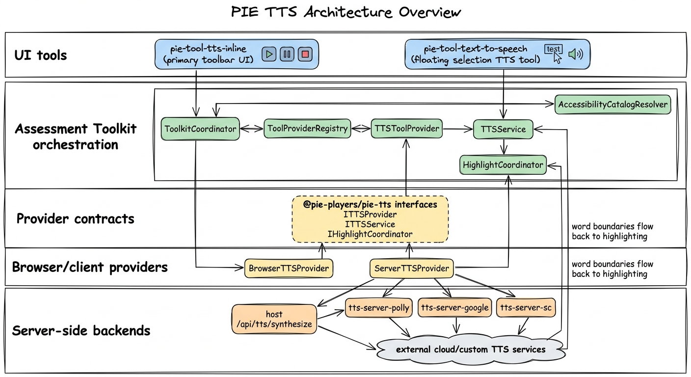
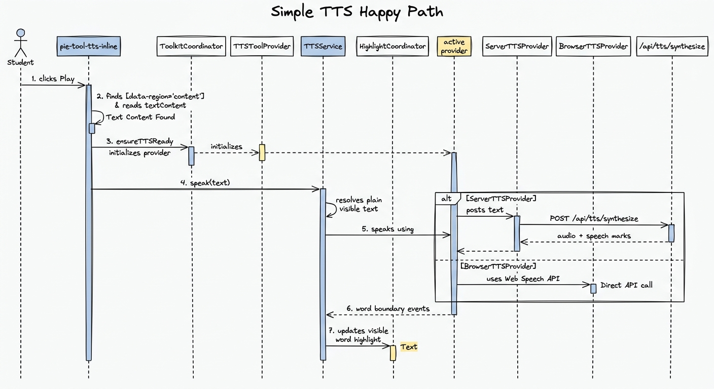
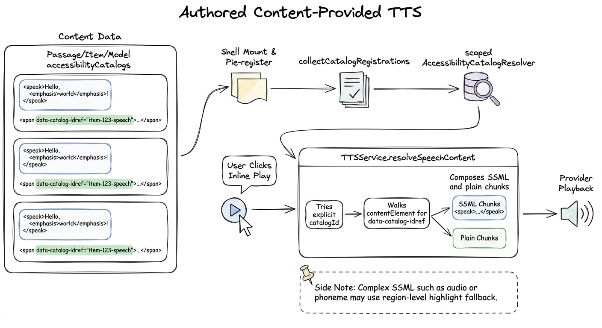
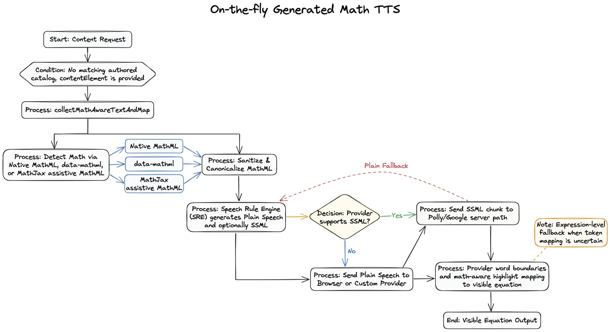

# TTS Deep Dive

<!-- markdownlint-disable MD013 MD022 MD031 MD032 MD036 MD040 -->

This document explains how text-to-speech (TTS) works across PIE Players at
runtime. It is intended for engineers who need the whole flow, from the button a
student presses through provider selection, authored spoken content, generated
Math speech, playback, and highlighting.

For package-level API reference, see [TTS Architecture](./tts-architecture.md).
For authoring patterns, see [TTS Authoring Guide](./tts-authoring-guide.md).

## Mental Model

TTS has four jobs, owned by different layers:

1. A UI tool decides what visible region the student wants read.
2. `TTSService` decides what should be spoken for that region.
3. The active provider decides how to turn speech text or SSML into audio.
4. Word boundaries or speech marks are mapped back to the visible DOM for
   highlighting.

The key point is that the UI does not synthesize speech itself. The inline tool
finds a reading target and calls the shared `TTSService`. `TTSService` then
chooses between authored spoken catalogs, generated Math speech, or plain visible
text.



## Packages And Ownership

`@pie-players/pie-tts` is the contract package. It defines the provider factory
and playback interfaces, configuration types, feature flags, capabilities, and
speech segment shape. It has no UI ownership.

`@pie-players/pie-assessment-toolkit` owns the runtime orchestration. The main
classes are:

- `ToolkitCoordinator`, which creates shared services and registers tool
  providers.
- `ToolProviderRegistry`, which stores provider factories by tool/provider id.
- `TTSToolProvider`, which chooses browser, Polly, Google, or generic server
  backed TTS.
- `TTSService`, which resolves speech content, owns playback state, calls the
  provider, and coordinates highlighting.
- `AccessibilityCatalogResolver`, which stores scoped spoken alternatives from
  assessment, passage, item, and model catalogs.
- `HighlightCoordinator`, which receives TTS highlight updates.

`@pie-players/pie-tool-tts-inline` is the primary runtime UI. It renders the
play/pause controls in item and passage toolbars, finds the readable content
region, and calls `ttsService.speak(...)`.

`@pie-players/pie-tool-text-to-speech` is a floating text-selection TTS tool.
Default section and item toolbars register `pie-tool-tts-inline`.

`@pie-players/tts-client-server` provides `ServerTTSProvider`, the browser-side
bridge to a host TTS API. It plays the returned audio in an `HTMLAudioElement`
and turns speech marks into boundary callbacks.

The `tts-server-*` packages are server-side helpers for host applications:
`tts-server-core`, `tts-server-polly`, `tts-server-google`, and `tts-server-sc`.
They do not run in the browser. A host API route wires them to the browser-side
`ServerTTSProvider`.

## Provider Setup

The toolkit configures TTS through the tool provider path rather than requiring
each UI component to construct its own provider.

At coordinator startup, `ToolkitCoordinator` creates shared services:

- `ToolCoordinator`
- `HighlightCoordinator`
- `AccessibilityCatalogResolver`
- `ToolProviderRegistry`
- `TTSService`

Tool registration then contributes a TTS provider descriptor. When TTS is needed,
the registry creates a `TTSToolProvider`, and that provider creates one concrete
TTS provider:

- `BrowserTTSProvider` for `backend: "browser"`
- `ServerTTSProvider` for `backend: "server"`, `"polly"`, or `"google"`

The server path dynamically imports `@pie-players/tts-client-server`, so
browser-only deployments do not eagerly load that package.

If server-backed initialization fails, the toolkit can fall back to browser TTS.
Browser TTS is the resilience path because it uses the platform Web Speech API
and does not require a network service.

## Simple Happy Path

This is the simplest useful path: no authored spoken catalogs and no special Math
generation. The system reads visible text with the active provider.



### Simple Path Walkthrough

1. The section or item UI renders a toolbar. The TTS tool registration lazy-loads
   `pie-tool-tts-inline`.
2. The student clicks the inline play button.
3. `pie-tool-tts-inline` resolves the reading target. It prefers the nearest
   `[data-region='content']` inside the current shell scope and falls back to the
   shell element itself.
4. The tool reads the target's `textContent`, sets the shared
   `HighlightCoordinator` on `TTSService`, and calls:

   ```ts
   ttsService.speak(text, {
     catalogId,
     catalogContext,
     language,
     contentElement: readingTarget,
   });
   ```

5. Before playback, `ToolkitCoordinator.ensureTTSReady()` makes sure a provider
   exists. The registry initializes `TTSToolProvider`, which chooses browser or
   server-backed TTS from host config.
6. `TTSService.speak()` normalizes the input text and calls
   `resolveSpeechContent(...)`.
7. If no authored spoken catalog applies and no generated speech is needed,
   `TTSService` speaks normalized visible text.
8. `BrowserTTSProvider` uses `SpeechSynthesisUtterance`. `ServerTTSProvider`
   posts to the host API, receives audio and speech marks, then plays audio with
   an `HTMLAudioElement`.
9. Boundary events flow back to `TTSService`, which asks `HighlightCoordinator`
   to update the visible word highlight.

### Browser Provider

The browser provider is direct:

```text
TTSService -> BrowserTTSProvider -> Web Speech API -> boundary events
```

It does not support SSML. When generated Math speech is used with the browser
provider, the toolkit sends plain speech text rather than `<speak>...</speak>`.

### Server Provider

The server-backed provider uses a host API:

```text
TTSService -> ServerTTSProvider -> /api/tts/synthesize -> server provider
```

For the standard PIE transport, the host route returns audio plus speech marks.
For custom transports such as SchoolCity-style integrations, the provider can
fetch URL-based audio and word mark assets with origin/SSRF protections.

## How TTS Chooses What To Speak

The current `TTSService.resolveSpeechContent(...)` priority is:

1. If `ignoreCatalogs` is set, speak normalized input text.
2. If an explicit `catalogId` resolves to a spoken catalog, use that catalog.
3. If a `contentElement` contains `data-catalog-idref` regions, compose speech
   chunks from those catalogs plus visible interstitial text.
4. If a `contentElement` contains Math or Math-like markup, generate speech from
   the DOM with Speech Rule Engine.
5. Otherwise, speak normalized input text.

That priority is the backbone for the rest of this document.

## Authored Content-Provided TTS

Content-provided TTS means the content itself supplies the spoken alternative.
In this project, the runtime shape is QTI/APIP-style accessibility catalogs:

```ts
interface AccessibilityCatalog {
  identifier: string;
  cards: CatalogCard[];
}

interface CatalogCard {
  catalog: string; // "spoken" for TTS
  language?: string;
  content: string; // often SSML
}
```

Visible markup points to catalog entries with `data-catalog-idref`:

```html
<span data-catalog-idref="equation-1">
  <math>...</math>
</span>
```

The runtime attribute is `data-catalog-idref`. Older examples that use
`data-catalog-id` are stale for this code path.



### Where Catalogs Can Live

Catalogs can be registered from:

- assessment-level accessibility config
- passage `accessibilityCatalogs`
- item `accessibilityCatalogs`
- model-level `accessibilityCatalogs`
- `config.extractedCatalogs`, if a preprocessing step has populated it

The runtime scopes catalogs by owner context. Passage catalogs are registered
with a passage context. Item and model catalogs are registered with item/model
context. This lets different content owners reuse catalog identifiers without
turning every catalog id into a global key.

### Authored Catalog Walkthrough

1. The assessment, passage, item, or model data includes `accessibilityCatalogs`.
   For TTS, the important cards use `catalog: "spoken"` and usually contain
   SSML.
2. Visible markup includes elements whose `data-catalog-idref` matches catalog
   identifiers.
3. When a passage or item shell mounts, it dispatches registration details.
4. The toolkit calls `collectCatalogRegistrations(...)`, which gathers catalogs
   from the entity and its config/model fields.
5. `AccessibilityCatalogResolver.registerCatalogs(...)` stores those catalogs
   under the scoped owner context.
6. The student clicks play in `pie-tool-tts-inline`.
7. The inline tool passes both `catalogContext` and `contentElement` to
   `TTSService.speak(...)`.
8. `TTSService` first tries an explicit `catalogId`, if one was provided.
9. If that does not resolve, `TTSService` walks the `contentElement` and looks
   for `data-catalog-idref`.
10. Each matching element becomes a speech chunk using the authored catalog
    content. Text between catalog-marked regions becomes plain speech chunks.
11. Playback runs chunk by chunk through the active provider.
12. Highlighting uses alignment between spoken SSML text and visible DOM. If the
    SSML contains semantics that cannot be mapped reliably, such as `<audio>` or
    complex `<phoneme>` behavior, highlighting can fall back to the containing
    region instead of word-by-word highlighting.

### Why Explicit `catalogId` Is Not The Whole Story

The inline tool may pass a `catalogId` such as an item or passage id. That id
does not necessarily match each fine-grained spoken catalog id inside the
content. For multi-region content, the important path is often DOM composition:
`TTSService` walks the reading target and resolves each `data-catalog-idref`
region.

### About Embedded `<speak>`

`SSMLExtractor` exists and can convert embedded `<speak>` markup into cleaned
content plus `extractedCatalogs`. The runtime registration code will register
`config.extractedCatalogs` if they are already present.

The current production runtime path documented here does not automatically call
`SSMLExtractor` during shell registration. Treat embedded extraction as a
preprocessing/integration capability unless the render path you are using
explicitly invokes it.

## On-The-Fly Generated Math TTS

Generated Math TTS is the fallback for content that has Math in the DOM but no
matching authored spoken catalog. It turns rendered Math into speech at runtime.



### Generated Math Walkthrough

1. The student clicks play in `pie-tool-tts-inline`.
2. The inline tool passes `contentElement` to `TTSService.speak(...)`.
3. No explicit spoken catalog resolves.
4. No `data-catalog-idref` composition applies, or the uncovered content still
   needs generated speech.
5. `TTSService.resolveGeneratedSpeechContent(...)` calls
   `buildGeneratedSpeechFromRoot(...)`.
6. The DOM adapter calls `collectMathAwareTextAndMap(...)` to walk visible text
   and Math.
7. Math can be detected from native `<math>`, a `data-mathml` attribute,
   MathJax containers, or MathJax assistive MathML.
8. MathML is canonicalized and sanitized before speech generation.
9. `assembleGeneratedSpeech(...)` calls the memoized Math speech resolver.
10. `math-speech.ts` lazily imports Speech Rule Engine and converts each Math
    chunk into plain speech. If the active provider can handle SSML, it can also
    request SRE SSML.
11. `TTSService` checks provider capabilities:
    - browser TTS always gets plain speech
    - Polly/Google-style server providers can get SSML
    - custom transports stay plain unless they report reliable SSML support
12. Generated Math chunks carry a plain fallback. If an SSML-capable provider
    rejects a generated SSML chunk, playback retries that chunk with plain
    speech.
13. Boundary callbacks feed the highlight pipeline. Math highlighting maps
    spoken boundaries back to MathJax/native Math tokens only when the mapping is
    reliable. Otherwise the full expression or nearest readable region is
    highlighted.

### What SRE Receives

The generated path does not rely on `aria-label` or image `alt` text. It is based
on visible text plus MathML sources:

- native `<math>`
- `data-mathml`
- MathJax assistive MathML

Visible fallback text is still collected. If SRE fails or returns nothing, the
system can speak the visible/fallback Math text rather than stopping playback.

### Plain Versus SSML Generated Math

The browser Web Speech API speaks SSML tags literally, so generated Math is plain
text for the browser provider.

Server providers that support SSML can receive generated `<speak>...</speak>`
chunks. That lets SRE preserve useful speech markup, such as character-level
pronunciation. The aggregate speech plan remains plain for seeking and structural
pause logic; SSML is applied per playback chunk.

## Comparison Of The Three Scenarios

| Scenario | Trigger | Spoken Source | Provider Payload | Highlighting |
| --- | --- | --- | --- | --- |
| Simple happy path | No matching catalog and no generated Math needed | normalized visible text | plain text | word boundaries against visible text |
| Authored content-provided TTS | explicit catalog or `data-catalog-idref` regions | `spoken` catalog card content | SSML or plain catalog content | aligned to visible DOM, with region fallback for complex SSML |
| On-the-fly Math TTS | `contentElement` contains Math and no authored speech wins | SRE generated Math speech plus visible prose | plain or SSML per provider capability | math-aware token mapping, with expression fallback |

## Current-State Notes

- `pie-tool-tts-inline` is the primary toolbar UI path.
- `pie-tool-text-to-speech` is a floating text-selection tool outside the
  default inline toolbar path.
- `data-catalog-idref` is the runtime catalog reference attribute.
- `SSMLExtractor` is available, and `extractedCatalogs` are registered when
  present, but automatic extraction is not part of the shell registration path
  described here.
- Browser TTS is the always-available fallback, but it is not SSML-capable.
- Server-backed TTS is preferred when high-quality voices, SSML, and speech marks
  are required.
- Generated Math speech requires a live `contentElement`; callers that only pass
  a string cannot get the DOM-aware Math path.
- The highlight pipeline is intentionally conservative around Math. It prefers a
  stable expression-level highlight over a wrong token-level highlight.

## File Map

- Provider contracts:
  [`packages/tts/src/provider-interface.ts`](../../packages/tts/src/provider-interface.ts)
- Toolkit startup:
  [`packages/assessment-toolkit/src/services/ToolkitCoordinator.ts`](../../packages/assessment-toolkit/src/services/ToolkitCoordinator.ts)
- TTS provider factory:
  [`packages/assessment-toolkit/src/services/tool-providers/TTSToolProvider.ts`](../../packages/assessment-toolkit/src/services/tool-providers/TTSToolProvider.ts)
- Speech resolution and playback:
  [`packages/assessment-toolkit/src/services/TTSService.ts`](../../packages/assessment-toolkit/src/services/TTSService.ts)
- Inline TTS UI package:
  `@pie-players/pie-tool-tts-inline` (registration entrypoint consumed through
  package exports); source:
  [`packages/tool-tts-inline/tool-tts-inline.svelte`](../../packages/tool-tts-inline/tool-tts-inline.svelte)
- Catalog registration:
  [`packages/assessment-toolkit/src/runtime/catalog-registration.ts`](../../packages/assessment-toolkit/src/runtime/catalog-registration.ts)
- Catalog resolution:
  [`packages/assessment-toolkit/src/services/AccessibilityCatalogResolver.ts`](../../packages/assessment-toolkit/src/services/AccessibilityCatalogResolver.ts)
- Math-aware DOM extraction:
  [`packages/assessment-toolkit/src/services/tts/math-aware-text-processing.ts`](../../packages/assessment-toolkit/src/services/tts/math-aware-text-processing.ts)
- Generated speech planner:
  [`packages/assessment-toolkit/src/services/tts/generated-speech/`](../../packages/assessment-toolkit/src/services/tts/generated-speech/)
- SRE integration:
  [`packages/assessment-toolkit/src/services/tts/math-speech.ts`](../../packages/assessment-toolkit/src/services/tts/math-speech.ts)
- Server TTS client:
  [`packages/tts-client-server/src/ServerTTSProvider.ts`](../../packages/tts-client-server/src/ServerTTSProvider.ts)
