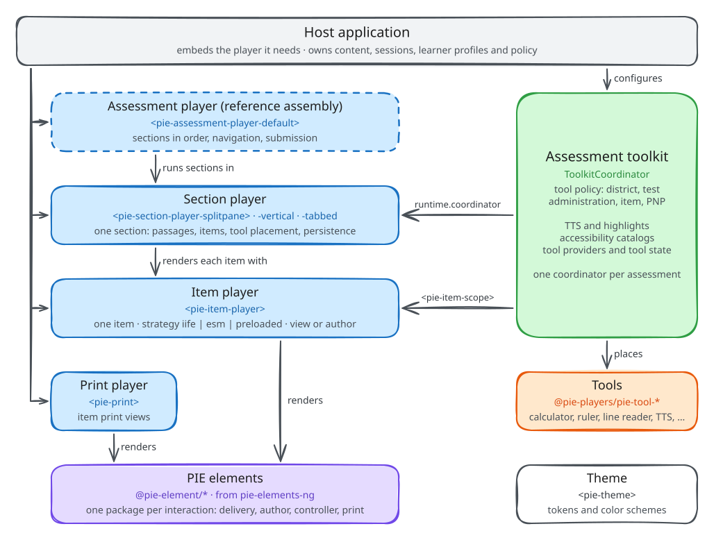
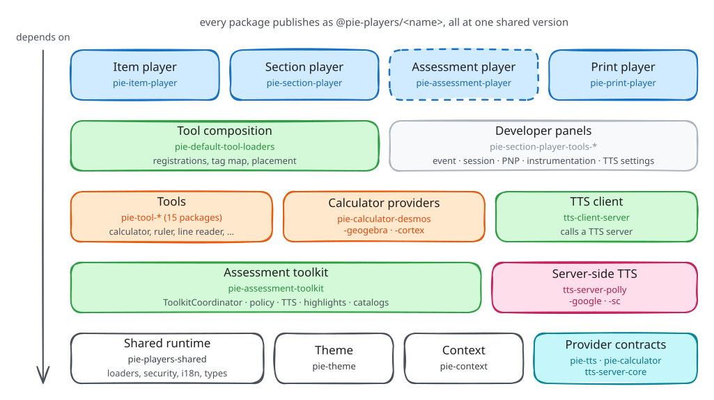
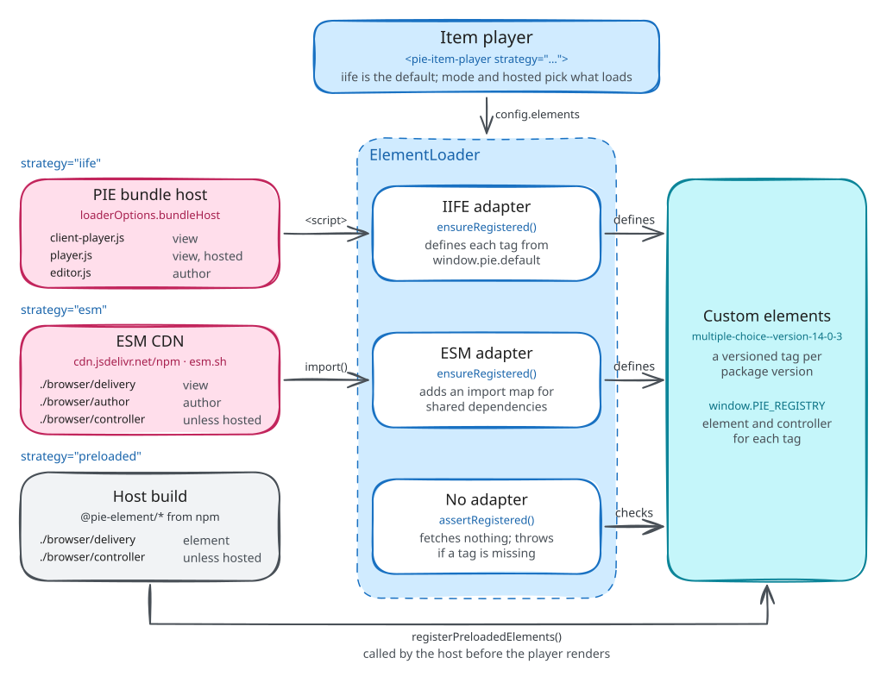
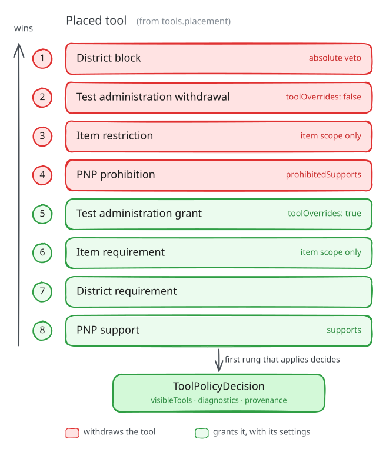
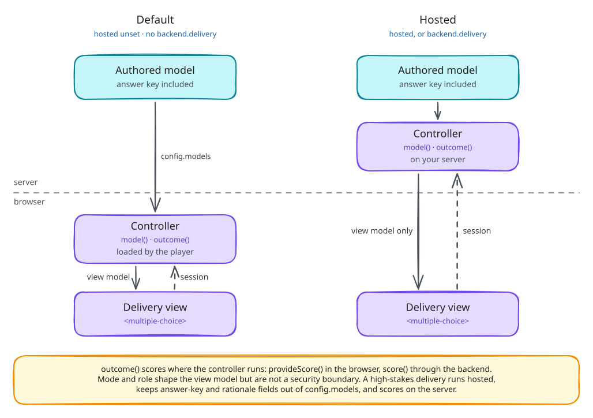

# PIE Players architecture

PIE Players renders PIE (Portable Interactions and Elements) assessment content in the browser. A PIE item is HTML markup plus one model per interaction, and each interaction is a PIE element: a custom element published from [pie-elements-ng](https://github.com/pie-framework/pie-elements-ng). This repository supplies the players that load and render those elements, the assessment toolkit that coordinates tools and accommodations around them, the tools themselves, a print player and a theme. Every player is a custom element that bundles its UI runtime, so it runs in any page, with any framework or none.

## Product scope

PIE Players ships building blocks, and each host assembles its production assessment player from them. The building blocks are the item player, the section player and its layouts, the assessment toolkit (coordinator, tool policy, text-to-speech, accessibility catalogs, assessment-session helpers), the tools and their default loaders, the print player and the theme, each with seams for persistence and delivery. PIE ships no backend, content store, identity or durable attempt store, and navigation, timing, persistence and submission policy differ per product, so the multi-section shell is [product-completing work](./framework-completing-work.md) that each host builds.

`@pie-players/pie-assessment-player` and `apps/assessment-demos` are a reference assembly: a basic multi-section player and the demos around it. They use only the building blocks' public exports, so a custom player can reproduce anything they do; `AssessmentController` is not exported and serves as a pattern to read. The reference assembly changes without a compatibility period and waits for no host evidence.

The building blocks carry the production bar: compatibility across hosts and host evidence for contract choices. A gap a custom player hits in a building block outranks the same gap in the reference player, and behavior the reference player needs that a custom player would also need lands in a building block, where every host gets it.

## System context

The host application owns the page, the content and the learner record. It embeds a player, sets its item config, environment, session and tool policy, and stores the sessions the player reports. The player's `strategy` decides where element code comes from:

- **The PIE bundle host** (`proxy.pie-api.com/bundles`) builds and serves IIFE bundles for any published element version: the default `iife` strategy.
- **An npm CDN**, jsDelivr by default or esm.sh, serves the browser ESM builds that pie-elements-ng publishes: `esm`.
- **The host's own build** bundles the elements, and the player fetches none: `preloaded`.

Two servers are optional. A text-to-speech server, run by the host from the `@pie-players/tts-server-*` packages, supplies speech and word timings for server voices. The item player's `backend` property connects delivery and authoring to a server that loads item config and sessions, saves sessions and scores responses; its built-in JSON client targets the PIE API service, and a host supplies its own `client` for any other backend ([backend support](../item-player/backend-support.md)).

## Building blocks

| Building block | Custom elements | Responsibility |
| --- | --- | --- |
| Item player | `<pie-item-player>` | One item for delivery, evaluation or authoring: loads its elements, keeps its session, scores it |
| Section player | `<pie-section-player-splitpane>`, `-vertical`, `-tabbed`, `-kernel-host` | One section: passages and items in a layout, item and passage toolbars, navigation within the section, section session state |
| Assessment toolkit | `<pie-assessment-toolkit>`, `<pie-item-scope>`, `<pie-item-toolbar>`, `<pie-section-toolbar>` | A coordinator, shared across an assessment's sections when the host supplies one and created per toolkit element otherwise: tool policy, placement and stacking, text-to-speech, highlights, accessibility catalogs, tool state |
| Tools | `<pie-tool-*>` | Calculators, ruler, protractor, line reader, answer eliminator, annotation, dictionaries, graph, periodic table, color schemes, sign language video, inline read-aloud |
| Print player | `<pie-print>` | Items for paper and answer keys, from the elements' print views |
| Theme | `<pie-theme>` | Design tokens and color schemes |
| Assessment player | `<pie-assessment-player-default>` | The reference assembly: sections in order, navigation, progress, submission |

## Packages

The repository publishes 40 packages under `@pie-players/` released together at one version, so a host picks one version and upgrades everything at once; the preloaded player, built per element set, is versioned on its own ([versioning](../install/versioning.md)). A host installs the player it embeds and gets the rest through its dependencies: the item player needs only `pie-players-shared` (element loaders, markup sanitization, interface strings, shared types); the section player brings the item player, the assessment toolkit and the packaged tools through `pie-default-tool-loaders`; the assessment player brings the section player. The calculator and TTS providers implement the contracts in `pie-calculator` and `pie-tts`, the `tts-server-*` packages run on the host's server, and the `pie-section-player-tools-*` packages are developer panels for events, sessions, tool policy, instrumentation and TTS settings. [Packages and entry points](../install/packages.md) lists every package and which entry points run in Node.js, raw in a browser or through a bundler.

## Elements

An item config has three parts. `elements` maps each tag in the markup to an exact element package version, `models` holds one model per interaction, and `markup` places the interactions in HTML. The player loads each package version and registers its views under a versioned tag such as `multiple-choice--version-14-0-3`, so two versions of one element can share a page.

The player sets `model` and `session` on each delivery element and listens for its `session-changed`. In author mode it renders `<tag>-config` with `model` and `configuration`, and re-emits the element's `model.updated` as `model-updated`. Controllers are plain functions: `model()` derives the view model the element renders for the current `env`, and `outcome()` scores a session. `env.mode` is `gather` (take responses), `view` (read-only) or `evaluate` (marked); `env.role` is `student` or `instructor`. The [element contract](https://github.com/pie-framework/pie-elements-ng/blob/develop/docs/PIE_ELEMENT_CONTRACT.md) defines the package shape.

## Item player

The `strategy` attribute picks where element code comes from: `iife` (the default) loads IIFE bundles of any published element version from the PIE bundle host, or from the host `loaderOptions.bundleHost` names; `esm` imports the browser ESM builds pie-elements-ng publishes from an npm CDN; `preloaded` checks that the host bundled and registered the elements with `registerPreloadedElements`, and fetches nothing.

`esm` imports element modules by full CDN URL (`moduleResolution: "url"`, the default) or through generated import-map entries (`"import-map"`); in both modes the player injects an import map for shared dependencies such as React. Each strategy loads one view per element: `delivery`, `author` or `print`. [Loading strategies](../item-player/loading-strategies.md) compares the three, and [math rendering](../item-player/math-rendering.md) covers MathJax under each.

The player owns the item session: `{ id, data }`, with one `data` entry per element. It emits `load-complete` when the item is ready, `session-changed` with the whole session when a response changes, and `player-error` on failure. `provideScore()` runs the element controllers in the browser; `score()` asks the delivery backend. `mode="author"` renders the same item's authoring views. The [item player overview](../item-player/overview.md) covers the API, and [scoring and rubrics](../item-player/scoring-and-rubrics.md) covers scoring.

### Print player

`<pie-print>` renders an item for paper. It loads each element's print view through the shared ESM loader, replaces the interactive tags in the markup with print tags under generated names, and renders a student worksheet or, for the `instructor` role, an answer key. Print views are optional: 12 of the 31 pie-elements-ng packages publish one. The print player is built with Lit 3 ([print player](../../packages/print-player/README.md)).

## Section player

A section is a set of passages and items with its own navigation and session. The section player renders one in a layout: `<pie-section-player-splitpane>` puts passages beside items, `-vertical` above them, and `-tabbed` in tabs, while `<pie-section-player-kernel-host>` runs the section and leaves the arrangement to the host, which places the passages and items panes in its own markup ([custom layouts](../section-player/custom-layouts.md)). All four render the same panes, cards and toolbars, and every item renders in a `<pie-item-player>`.

Before items mount, the section player validates every item config, aggregates the element versions of all its items and passages, and loads each version once; a failure keeps the items unmounted and reports one section-level error. Every layout runs inside an assessment toolkit: the host passes its own `ToolkitCoordinator` as `runtime.coordinator`, or the layout builds one from `runtime`. A `SectionController` per section and attempt keeps the section session (current item, visited items, item sessions). `@pie-players/pie-section-player/item-section` wraps a single item config as a one-item section. The [section player integration guide](../section-player/integration-guide.md) walks through an integration.

## Assessment toolkit

The toolkit gives every tool on an assessment screen one runtime model. A host constructs one `ToolkitCoordinator` per assessment, from a tool registry (`createPackagedToolRegistry()` or its own) and the assessment's tool configuration, and hands it to the section player as `runtime.coordinator` or to `<pie-assessment-toolkit>`. Given none, `<pie-assessment-toolkit>`, which every section layout renders, builds one from its inputs, without hooks. The coordinator owns six services as public properties:

| Service | Property | Responsibility |
| --- | --- | --- |
| `ToolCoordinator` | `toolCoordinator` | Tool visibility and z-index layers |
| `HighlightCoordinator` | `highlightCoordinator` | Read-aloud word highlights and annotations, drawn with the CSS Custom Highlight API without changing the DOM |
| `TTSService` | `ttsService` | Read-aloud with browser or server voices, synchronized with highlights |
| `AccessibilityCatalogResolver` | `catalogResolver` | QTI 3.0 accessibility catalogs: spoken text, audio, sign language video, braille |
| `ElementToolStateStore` | `elementToolStateStore` | Tool state per PIE element, such as answer eliminations, kept out of the item session |
| `ToolProviderRegistry` | `toolProviderRegistry` | Lazy initialization and authentication of the providers behind tools, such as calculator and TTS backends |

The coordinator holds its `ToolPolicyEngine` privately and answers policy questions through `decideToolPolicy(...)` and `decideFeaturePolicy(...)`; `@pie-players/pie-assessment-toolkit/policy/engine` exports the engine itself. The [assessment toolkit README](../../packages/assessment-toolkit/README.md) documents the API.

`ToolCoordinator` stacks tool surfaces in fixed z-index layers: 0–999 for PIE content and player chrome, 1000–1999 for floating tools and their windows (the default for every tool), 2000–2999 for modal tool surfaces, 3000–3999 for drag and resize handles, and 4000–4999 for highlight infrastructure. `ElementToolStateStore` keys state as `assessmentId:sectionId:attemptId:itemId:elementId`, each part escaped (`%` as `%25`, `:` as `%3A`), so two attempts at one section never share a key. The store lives in memory, and a host persists it through the coordinator's `loadToolState` and `saveToolState` hooks.

### Tool policy

Placement and policy are separate steps. The host places tools at section, passage and item level (`tools.placement`); the policy engine then decides which placed tools a learner receives, from district settings, test-administration settings, item settings and the learner's Personal Needs and Preferences (PNP) profile, which follows [AfA PNP 3.0](https://www.imsglobal.org/spec/afa/v3p0/info). A PNP support id is the id of the tool it grants. A grant protects a placed tool from relevance filtering and carries its settings; it never places a tool. Host gates apply first: a disabled provider, `tools.policy.allowed` and `tools.policy.blocked` remove tools before the ladder runs, and policy sources a host registers with `registerPolicySource` can only narrow its result. On the ladder, the first rung that applies decides:

1. District block, an absolute veto
2. Test-administration withdrawal (`toolOverrides` set to `false`)
3. Item restriction
4. PNP prohibition (`prohibitedSupports`)
5. Test-administration grant (`toolOverrides` set to `true`)
6. Item requirement
7. District requirement
8. PNP support

Rungs 3 and 6 apply only to decisions scoped to an item (its item toolbar and its content's features), with that item's `restrictedTools` and `requiredTools`. A section, passage or assessment toolbar skips them and raises `tool-policy.itemSettingNotApplied` for each tool on it that a mounted item restricts or requires. A restriction or prohibition that withdraws a tool a `true` override grants raises `tool-policy.overrideBlocked`. [Tools and accommodations](../tools-and-accomodations/architecture.md) sets out the full model, and [PNP configuration](../../packages/assessment-toolkit/docs/PNP_CONFIGURATION.md#precedence) gives each rung's field.

The assessment model follows QTI 3.0 where the two meet: PNP profiles, accessibility catalogs and the assessment and section structure. The assessment type also carries QTI 3.0 `contextDeclarations`, and the assessment session a `contextVariables` slot; no player or toolkit service reads either, so neither reaches an item.

### Tools

`createPackagedToolRegistry()` from `@pie-players/pie-default-tool-loaders` registers 15 tools: text-to-speech, calculator (Desmos, GeoGebra, or the bundled open-source Cortex, which needs no key), ruler, protractor, line reader, answer eliminator, annotation toolbar, the color-scheme tool (`theme`), graph, periodic table, English and Spanish dictionaries and picture dictionaries, and the audio transcript, a content region without a toolbar button. Sign language video ships as its own package that a deployment registers. A host can assemble its own registry from the same registrations. [Tool registry](../../packages/assessment-toolkit/docs/TOOL_REGISTRY.md) and [calculator providers](../../packages/default-tool-loaders/src/calculator-providers/README.md) cover tool development.

### Text-to-speech and accessibility catalogs

`TTSService` reads content aloud through the active provider. `BrowserTTSProvider` uses the platform's voices through the Web Speech API; `ServerTTSProvider` (`@pie-players/tts-client-server`) plays audio and speech marks from a host-run server built on `tts-server-polly`, `tts-server-google` or `tts-server-sc`. Before speaking, the service asks the `AccessibilityCatalogResolver` for an authored spoken alternative. An item's own catalogs win over the catalogs a preprocessing step extracted from embedded SSML (`config.extractedCatalogs`; the players extract nothing themselves), and item-level catalogs win over assessment-level ones. The `HighlightCoordinator` highlights what is being spoken: the sentence by default with browser voices, the word with server voices, which carry word timings. [TTS architecture](../accessibility/tts-architecture.md) has the detail.

## Sessions and persistence

Each layer owns the session it produces, and the host owns durable storage.

| Layer | Session | Owner | Persistence |
| --- | --- | --- | --- |
| Item | `{ id, data }`, one entry per element | `<pie-item-player>` | `session-changed` to the host; optional autosave through the delivery backend |
| Section | Current item, visited items, item sessions | `SectionController`, one per section and attempt | Restored through the layout's `session` property and saved by the host on `session-changed` or from `getSession()`; or a persistence strategy, set with the controller's `configureSessionPersistence` or a host-built coordinator's `createSectionSessionPersistence` hook |
| Assessment | Section sessions and the current position | The host, with `createNewAssessmentSession`, `upsertSectionSession` and `setCurrentSectionPosition` | The host's backend; the reference player's `createAssessmentSessionPersistence` hook |

The section and assessment layers default to `localStorage`, keyed per attempt and inactive without an attempt id. That restores an attempt on the same device and nothing more; a host replaces it through the hook or the controller's strategy. Element tool state stays out of these sessions.

## Security model

By default the whole item config reaches the browser, answer keys included, and the element controllers run there. That fits practice and formative delivery. Graded delivery needs three things together:

- **Hosted mode** (`hosted`, or a delivery backend): the player loads elements without their controllers and renders the view models a server computes.
- **Stripped models**: the host removes answer keys and rationales from the models on its server, because the players pass models through as they receive them.
- **Host-computed outcomes**: the host's backend scores the response.

`env.role` and `env.mode` shape what an element shows and are no security boundary. [Security](../security/readme.md) sets out the trust boundaries.

## Theming and internationalization

`<pie-theme>` computes PIE's `--pie-*` color tokens for the active color scheme and writes them onto itself, or onto the document element with `scope="document"`, from which they inherit into item content and player chrome, shadow DOM included. `@pie-players/pie-theme/token-registry.json` lists every registered token with its owner, scope and scheme participation; a token is registered when a host sets it. [How theming works](../theming/how-theming-works.md).

Interface strings (toolbar labels, tool panels, status and error text, `aria-label`s) come from message catalogs in `@pie-players/pie-players-shared`, in `en-US` and `nl-NL`. A host sets the `locale` attribute on a player, a section layout or `<pie-assessment-toolkit>`; unset, the players render English and never detect the locale from the browser. Content language and in-item alternates are separate concerns ([internationalization](./internationalization.md)).

## Accessibility

The players and tools target WCAG 2.2 AA. The [WCAG 2.2 AA baseline](../wcag/wcag-2.2-aa-baseline.md) maps the criteria that matter for players, floating tools, dialogs and assessment layouts, and the item, section and assessment player end-to-end suites run axe checks against their demos. [Accessibility](../accessibility/README.md) covers text-to-speech, catalogs and accommodations.

## Instrumentation

Every layer reports through one provider-agnostic `InstrumentationProvider` contract, in three streams:

- **Toolkit telemetry** (`pie-toolkit-*`, `pie-tool-*`): coordinator and provider readiness, tool state and configuration, section controller lifecycle, text-to-speech initialization and playback, and tool initialization, backend calls and library loads, forwarded by `<pie-assessment-toolkit>`.
- **Bridged public events** (`pie-toolkit-*`, `pie-section-*`, `pie-item-*`, `pie-assessment-*`): each layer maps a fixed set of its own DOM events, so no event reaches a provider twice. The item player maps only `correct-responses-populated`, which keeps the learner responses in `session-changed` away from telemetry unless the host forwards them, and reports runtime errors through `trackError`.
- **Loader and resource events**, sent when `trackPageActions` is on: resource loads and retries, bundle retries, and shared-dependency and MathJax conflicts.

PIE ships a New Relic adapter and console, debug-panel and composite providers, so production telemetry and a debug panel can receive the same events; a host writes its own adapter for any other agent. [Instrumentation providers](./instrumentation-providers.md) lists every event and how an unset or invalid provider resolves.

## Technology

- **Custom elements** built with Svelte 5, each bundling its runtime; the print player uses Lit 3.
- **TypeScript** throughout, with Bun for installs, scripts and unit tests, Turbo for monorepo tasks, Vite for builds, Biome for linting, Playwright for end-to-end tests and Changesets for the lockstep release.
- **Web platform**: custom elements, ES modules and import maps, the CSS Custom Highlight API and the Web Speech API, in evergreen browsers.

## Integration patterns

| Pattern | Assembly | Fits |
| --- | --- | --- |
| Item player | `<pie-item-player>` alone | One item in a page: authoring, previews, practice |
| Item player with toolkit | `<pie-assessment-toolkit>` around a `<pie-item-scope>` per item, with `<pie-item-toolbar>` | Items rendered one at a time, with tools and accommodations |
| Section player | A layout element with `runtime` and `section` | A section screen: passages, items, section tools, section session |
| Custom assessment player | Section players, one coordinator per assessment, the assessment-session helpers | Multi-section delivery with the host's routing, persistence and submission |

Without a section player, per-item inputs ride on `<pie-item-scope>`: it registers the item and its settings with the coordinator that `<pie-assessment-toolkit>` builds from its properties, and the item player's events pass through it unchanged ([without a section player](../../packages/assessment-toolkit/README.md#without-a-section-player)). A custom assessment player mounts a section player per section with the assessment's coordinator, keeps the attempt in an `AssessmentSession`, and persists through the coordinator's hook or its own snapshot against the host backend. The [multi-section player guide](../assessment-player/integration-guide.md) builds one from the toolkit's assessment-session helpers, with `@pie-players/pie-assessment-player` as the reference assembly.

## Related documentation

- [Getting started](../getting-started.md): a first item in a page
- [The case for a new player project](../why-a-new-project.md): what PIE Players changes from the legacy player
- [Domain language](../../CONTEXT.md): the shared vocabulary
- [All documentation](../readme.md)
- Standards: [QTI 3.0](https://www.imsglobal.org/spec/qti/v3p0), [AfA PNP 3.0](https://www.imsglobal.org/spec/afa/v3p0/info), [WCAG 2.2](https://www.w3.org/WAI/WCAG22/quickref/), [CSS Custom Highlight API](https://developer.mozilla.org/en-US/docs/Web/API/CSS_Custom_Highlight_API), [Web Speech API](https://developer.mozilla.org/en-US/docs/Web/API/Web_Speech_API)
- PIE: [pie-framework.org](https://pie-framework.org), [pie-elements-ng](https://github.com/pie-framework/pie-elements-ng), [element demos](https://elements.pie-framework.org)
