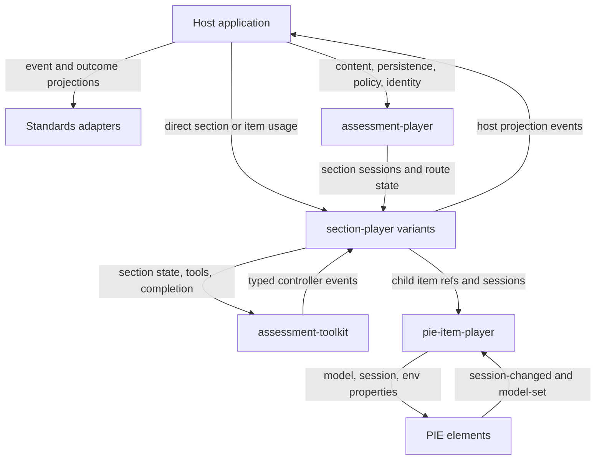

# P0 Shared Contracts Architecture

Status: Architecture proposal / pre-PRD direction. This note captures the intended shape of shared PIE contracts that unblock timed media, branching, simulations, learner evidence, score aggregation, and standards adapters. It is not an accepted implementation contract; later PRDs own exact TypeScript names, exports, wire fields, and migration details.

## Context

The PIE gap analysis identifies shared contracts as P0 work because several higher-value capabilities need the same building blocks:

- video-linked and timed-media assessment;
- section and assessment outcome rollups;
- branching scenarios and role-play;
- simulations and process-capture workflows;
- learner evidence capture;
- adapter-friendly outputs for QTI/PCI, LTI, SCORM, xAPI, and Caliper.

The goal is not to turn PIE into a complete assessment platform. PIE should provide stable interactions, player/container behavior, sessions, outcomes, accessibility behavior, and event projections that host systems can consume. Host systems still own item banks, content workflow, storage, identity, privacy, scheduling, reporting, gradebooks, standards certification, and product policy.

## Goals

- Preserve current PIE element and item-player contracts.
- Reuse existing `pie-players` session, completion, and scoring primitives before adding new shapes.
- Define additive shared contracts that make host-built assessment systems possible without requiring them to use a complete PIE assessment-player solution.
- Establish enough vocabulary and boundaries for future PRDs to implement timed media, branching, simulations, evidence capture, and score rollups consistently.
- Keep standards language adapter-oriented until a tested adapter claims conformance.

## Non-Goals

- No changes to the PIE element runtime/controller interfaces.
- No changes to the `pie-item-player` host-facing interface.
- No item bank, media repository, catalog, workflow, rostering, scheduling, gradebook, reporting, evidence review, or backend storage contract.
- No new full assessment-player product surface.
- No generic untyped persistence bag for future section behavior.
- No new production names based on planning labels such as `P0*`, `*V1`, or proposal wording such as `Normalized*` as the primary public contract name.

## Compatibility Rules

P0 shared contracts should be additive by default.

| Surface | Rule |
| --- | --- |
| PIE elements | Keep model/session/environment/controller APIs as defined by `pie-elements-ng/docs/PIE_ELEMENT_CONTRACT.md`. |
| Element events | Preserve canonical `session-changed` and `model-set` events from `@pie-element/shared-player-events`. |
| `pie-item-player` | Keep existing properties, events, and imperative APIs. Richer host/adapter projections observe this surface; they do not replace it. |
| `section-player` | Additive extensions are acceptable. Breaking changes require a later PRD to prove urgent need. |
| `assessment-player` | Use it as one possible host/runtime layer, not the required foundation for every consumer of PIE building blocks. |
| Naming | Use durable domain names in code. Put versioning in wire/schema fields or package semver, not in exported interface names. |

## Layer Ownership



| Layer | Owns | Does not own |
| --- | --- | --- |
| Host application | durable persistence, identity, policy, storage, standards mapping, reporting, privacy, product workflow | element internals or section runtime mechanics |
| Standards adapters | mapping PIE projections into QTI/PCI, LTI, SCORM, xAPI, Caliper, or product analytics | PIE runtime state ownership or certification claims without testing |
| `assessment-player` | assessment routing, section session rollup, submission state for consumers that choose it | item scoring, section-specific orchestration, backend reporting |
| `section-player` variants | section layout, child item orchestration, section completion, profile-specific section behavior | leaf element contracts, backend persistence, product policy |
| `assessment-toolkit` | section controller contracts, attempt/session helpers, tools and accommodation coordination | complete assessment product behavior |
| `pie-item-player` | item rendering, element loading, item session forwarding, local per-element scoring preview | section/assessment rollups, standards mapping |
| PIE elements | authored model, learner session, view model, element outcome, accessibility metadata | assessment routing, child item aggregation, media cue orchestration |

## Existing Contracts To Reuse

P0 should start from the contracts already present in the repositories.

| Concern | Existing contract |
| --- | --- |
| Element runtime | `PIE_ELEMENT_CONTRACT.md`: model, session, environment, controller helpers, custom element property API |
| Element events | `SessionChangedEvent` and `ModelSetEvent` in `@pie-element/shared-player-events` |
| Leaf outcome | `OutcomeResult` in `pie-elements-ng`, `OutcomeResponse` in `@pie-players/pie-players-shared/types` |
| Local item scoring | `scorePieItem(...)` in `players-shared/src/pie/scoring.ts` and `pie-item-player.provideScore()` |
| Backend-style scoring prior art | `SessionScore`, `SessionAutoScore`, `SessionManualScore`, `ScoreResponse` |
| Item session normalization | `ItemSessionContainer`, `NormalizedItemSessionChange`, `normalizeItemSessionChange(...)` |
| Section attempt state | `TestAttemptSession`, `TestAttemptItemSession`, `upsertItemSessionFromPieSessionChange(...)` |
| Section persistence snapshot | `SectionControllerSessionState` |
| Section runtime completion | `SectionControllerRuntimeState`, `item-complete-changed`, `section-items-complete-changed` |
| Assessment session rollup | toolkit `AssessmentSession`, `AssessmentSectionSessionState`, `upsertSectionSession(...)` |

Important current limits:

- `pie-item-player.provideScore()` and `scorePieItem(...)` return per-element outcomes, not an accepted rolled-up item score.
- Item and section completion aggregation exist today. Assessment-player exposes routing, progress, submission state, and per-section snapshots, but not an accepted assessment-completion or assessment-score rollup.
- Section and assessment session snapshots carry responses and navigation/completion-related state, not score summaries.
- Assessment session types currently exist in both `assessment-toolkit` and `assessment-player`; a later implementation PRD should choose or consolidate the canonical type home before adding assessment-level fields.

## Contract Families

### Event Projection

The P0 event work is a host/adapter projection over existing runtime events. It must not rename or replace:

- element `session-changed`;
- element `model-set`;
- `pie-item-player` events or methods;
- `SectionControllerEvent`;
- assessment-player controller/public events.

The projection should make existing runtime behavior easier for hosts and standards adapters to consume. It can be produced by a host adapter, section runtime adapter, assessment-player adapter, analytics bridge, or standards bridge.

Event projections need stable source references:

- assessment;
- section;
- item;
- element;
- media asset;
- cue;
- tool;
- scenario;
- branch;
- simulation;
- step;
- evidence;
- rubric.

Event projections should separate state-bearing events from analytics-only events. Hosts can then decide what belongs in durable attempt state, what belongs in telemetry, and what should be dropped for privacy or policy reasons.

Branching, simulations, and replay/debug need a small process vocabulary:

- attempt and run identifiers;
- parent-child causality between events;
- decision and path events;
- ordered process steps;
- resumability markers;
- externally graded outcome references.

Final event PRDs should use typed, discriminated payloads per event family. Generic `Record<string, unknown>` payloads may be acceptable for telemetry extension points, but they should not become the primary public event API.

Documentation sketch only:

```ts
interface InteractionEventProjection {
  version: 1;
  id: string;
  type: string;
  timestamp: number;
  source: InteractionSourceRef;
  category: "state" | "analytics" | "debug";
  payload?: TypedEventPayload;
  scoreComponents?: ScoreComponent[];
}
```

This sketch is not an implementation naming recommendation.

### Session And Completion

The existing section snapshot shape remains the base:

```ts
interface SectionControllerSessionState {
  currentItemIndex?: number;
  visitedItemIdentifiers?: string[];
  itemSessions: Record<string, unknown>;
}
```

Future section profiles may add named, typed slices only when their PRDs ratify them. Examples:

- `timedMedia` for media progress and cue state;
- `branching` for path state and reachable item/step state;
- `simulation` for process state or externally graded checkpoints.

There should not be a universal `profileState` bag. Each slice needs:

- a named owner PRD;
- explicit merge and replace semantics;
- clear persistence expectations;
- compatibility behavior for hosts that do not know that profile;
- a statement of whether the slice is scoring state, delivery state, or telemetry.

Documentation sketch only:

```ts
interface TimedMediaSectionState {
  mediaCurrentTime: number;
  mediaCompleted: boolean;
  visitedCueIdentifiers: string[];
}

interface ExtendedSectionSessionSnapshot {
  currentItemIndex?: number;
  visitedItemIdentifiers?: string[];
  itemSessions: Record<string, unknown>;
  timedMedia?: TimedMediaSectionState;
}
```

This sketch illustrates additive typed slices, not final names.

### Score And Outcome Projection

P0 should define the missing section/assessment score projection without changing leaf scoring.

Leaf scoring remains element-owned:

- element controllers return `OutcomeResult` / `OutcomeResponse`;
- multi-element items can produce multiple leaf outcomes;
- rubric/manual-scored items may not have meaningful auto-score outcomes;
- partial scoring is governed by element model and environment rules;
- server-side scoring may remain authoritative for persisted Renaissance attempts.

The score projection should wrap existing leaf outcomes and optional aggregate fields. It should not add score fields to existing session snapshots unless a later PRD explicitly ratifies that additive change.

Documentation sketch only:

```ts
type LeafOutcome = OutcomeResponse;

interface ScoreComponent {
  source: InteractionSourceRef;
  outcome?: LeafOutcome;
  points?: number;
  max?: number;
}
```

Rules for later PRDs:

- `OutcomeResponse` is the leaf source.
- `points` and `max` are aggregate/projection fields mapped from existing scoring vocabulary.
- A section rollup must state its aggregation policy, such as sum, average, weighted, all-required-complete, or host-defined.
- Watch completion, cue completion, branch completion, and child correctness must remain distinguishable.
- Persisted score storage remains host-owned unless a specific player PRD introduces an additive score snapshot field.

### Media Asset Metadata

Stimulus media needs a shared metadata vocabulary that is broader than video but sufficient for the future `video-stimulus` element.

Expected fields for later PRDs:

- media kind: image, audio, video, or other;
- one or more source URLs with MIME type;
- poster or thumbnail where relevant;
- duration when known;
- captions or subtitles, preferably WebVTT when browser playback is involved;
- transcript reference or inline transcript;
- accessible label or description;
- language and track metadata.

Host responsibilities:

- asset storage;
- signed URLs;
- CDN and CSP policy;
- virus scanning;
- authorization;
- retention;
- privacy and consent;
- transcoding;
- availability guarantees.

### Learner Evidence Metadata

Learner-submitted evidence is separate from stimulus media. PIE may provide a thin capture or reference UI later, but host systems own the hard parts.

P0 should reserve vocabulary for:

- modality: audio, video, image, file, or mixed;
- captured asset reference;
- MIME type;
- size;
- duration;
- transcript or caption metadata when available;
- rubric or scoring-context linkage;
- source item, section, step, branch, simulation, or scenario reference.

Host systems own:

- upload;
- malware scanning;
- signed URLs;
- retention;
- permissions;
- privacy;
- review workflow;
- audit logs;
- reviewer identity and comments.

### Adapter-Friendly Hooks

PIE should expose stable source data that adapters can map to standards. PIE should not claim standards conformance until a concrete adapter is tested.

| Standard / ecosystem | P0 contribution | Host or adapter responsibility |
| --- | --- | --- |
| QTI / PCI | stable section, item, element, outcome, media, and profile references | exact XML/profile mapping and validation |
| LTI | outcome and completion projections | launch, identity, grade passback, AGS mapping |
| SCORM | summary completion and score projection | package/runtime mapping and LMS integration |
| xAPI | event projection with source refs and process vocabulary | actor, verb/object mapping, statement authority, LRS policy |
| Caliper | event projection with assessment context | sensor mapping, entity normalization, event certification |

Adapter-facing contracts should be precise enough to avoid lossy mappings, but not so standards-specific that PIE runtime code becomes coupled to one reporting system.

### Accessibility Runtime Patterns

P0 should capture reusable accessibility expectations for cross-cutting player behavior:

- predictable focus handoff when new child content appears;
- keyboard completion paths for media controls, overlays, toolbars, and child items;
- screen-reader announcements for cue, branch, pause, completion, and error states;
- captions and transcripts as first-class media metadata;
- overlay safety so questions do not obscure captions or essential media;
- side-panel options for longer prompts and assistive technology workflows;
- seek or navigation restrictions that allow accommodation overrides;
- TTS/media handoff rules so speech tools and media audio do not compete unexpectedly;
- high-contrast, zoom, and reduced-motion behavior;
- non-video alternatives where video itself is not an accessible source.

These patterns should reuse existing assessment-toolkit and accessibility catalog infrastructure where possible.

## Timed-Media Alignment

The timed-media section architecture should consume P0 contracts instead of redefining them.

| Timed-media need | P0 shared contract |
| --- | --- |
| `media.*` and `cue.*` events | event projection source refs and typed event families |
| media progress and cue state | named `timedMedia` section slice |
| cue-linked child questions | existing `itemSessions` and future score projections |
| playback completion versus correctness | score/outcome projection rules that keep completion and correctness separate |
| video sources, captions, transcripts | media asset metadata |
| forced pauses and focus handoff | accessibility runtime patterns |
| xAPI/Caliper media analytics | adapter-friendly event projection without conformance claims |

The `video-stimulus` element remains a media stimulus. Cue-to-question orchestration, child item sessions, playback policy, and section completion belong to a timed-media section-player variant.

## How Hosts Build On This

P0 should make these host patterns possible:

1. A host can use only `pie-item-player` and still receive the current item-level events and per-element score preview behavior.
2. A host can use `section-player` and receive existing section session/completion state without adopting assessment-player.
3. A host can use `assessment-player` and receive routing, submission, and per-section session rollup.
4. A host can add an adapter that observes existing runtime events and emits product analytics, standards statements, or score projections.
5. A host can implement custom section-player variants, such as timed media or branching, using typed additive section slices.

This keeps PIE useful as a toolkit without making the built-in assessment-player the only supported architecture.

## Future PRDs

Recommended PRD split:

1. `interaction-event-contract`
   - Event projection vocabulary, source refs, typed event families, privacy/telemetry rules, process/path fields.
2. `score-components-and-section-outcomes`
   - Alignment to `OutcomeResponse`, `SessionScore`, item completion, `TestAttemptSession`, `SectionControllerSessionState`, and `AssessmentSession`; missing section/assessment rollup projection.
3. `media-asset-contract`
   - Stimulus media sources, captions, transcripts, poster, accessibility metadata, and host storage boundary.
4. `branching-and-process-events`
   - Branching, simulations, replay/debug, resumability, externally graded outcomes, and path state.
5. `evidence-capture-metadata`
   - Learner evidence metadata and host-owned storage/review/audit responsibilities.
6. `accessibility-runtime-patterns`
   - Focus handoff, media/tool/TTS coordination, overlays, keyboard behavior, accommodation overrides.
7. Timed-media implementation PRDs
   - Consume the above contracts for `video-stimulus`, timed-media section data, timed-media section-player behavior, and composition authoring.

## Open Questions

- Which package should own the eventual public event projection types?
- Should toolkit `AssessmentSession` become the canonical assessment session type for assessment-player too?
- Should section score projections be controller methods, helper functions, host adapters, or a separate package?
- Which score aggregation defaults, if any, should PIE provide?
- How should profile slices be preserved by unknown hosts without creating an untyped persistence bag?
- Which media metadata belongs in shared contracts versus individual element models?
- What is the minimum useful evidence metadata contract that does not imply storage ownership?
- Which accessibility patterns belong in toolkit services versus section-player variants?
