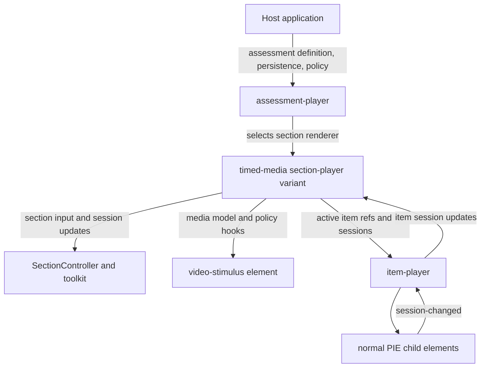

# Timed Media Section Architecture

Status: Architecture proposal / pre-PRD direction. This note captures the intended shape of timed-media assessment in PIE. It is not an accepted implementation contract; later PRDs own the ratified model, session, event, and authoring surfaces.

## Context

PIE already has strong primitives for individual interactive questions, shared passages, section composition, and assessment-level routing. A video-linked assessment stretches those primitives in a useful way: one static media stimulus is paired with multiple normal PIE items, and timestamp cues control when those items appear, pause playback, gate progression, and contribute to an aggregate section outcome.

This is not currently a Renaissance deployment requirement. It is a boundary test for how PIE should grow and a likely gap for users outside Renaissance, such as higher education, online courses, vocational training, HR/compliance training, and other scored/evaluated learning interactions.

## Goals

- Treat video-linked assessment as section-level composition, not as one large opaque element.
- Keep child questions as normal PIE items/elements with normal item sessions and outcomes.
- Introduce a reusable `video-stimulus` element in `pie-elements-ng` for media playback, captions, transcript, and player control APIs.
- Introduce a timed-media section contract and section-player variant in `pie-players`.
- Define enough vocabulary, responsibility boundaries, and proposed data shape to support later implementation PRDs without relying on this discussion.

## Non-Goals

- No item bank, media asset repository, catalog management, rostering, scheduling, workflow, gradebook, or backend reporting. Those remain host-system responsibilities.
- No full replacement for `assessment-player`; assessment-player still chooses which section is active and owns assessment-level navigation/session state.
- No attempt to force the timed-media container into a leaf PIE element.
- No opaque PCI/custom-item wrapper that hides child questions from normal PIE item/session/outcome contracts.
- No commitment that the field names in this note are final. They are proposed handoff names for PRDs to ratify or revise.

## Glossary

| Term | Meaning in this note | Relationship to current PIE language |
| --- | --- | --- |
| Stimulus | Shared non-response content that frames one or more items. | Broader architecture term. In QTI contexts, "stimulus" is common. |
| Passage | The current PIE player term for shared reading or visual context rendered alongside items. | `pie-elements-ng/UBIQUITOUS_LANGUAGE.md` treats "passage" as canonical and "stimulus" as a QTI alias to avoid for current element work. |
| Video stimulus | A new shared media stimulus package, likely `@pie-element/video-stimulus`. It renders media and exposes playback APIs. | A sibling to, not an extension of, `@pie-element/passage`; cue-to-question orchestration does not belong inside it. |
| Section | A QTI-like grouping of item refs, shared content, tools, and section session state. | Existing `AssessmentSection` in `@pie-players/pie-players-shared`. |
| Timed-media section | A section whose shared media timeline controls child item visibility/progression through cue metadata. | A new section flavor, not a new assessment layer. |
| Cue | A timestamp or time range that activates one or more item refs and optional policy. | New timed-media section concept. |
| Child item | A normal `assessmentItemRef` rendered by item-player and backed by normal PIE elements. | Existing section-player item composition. |
| Composition authoring | Authoring of section-level composition: stimulus, item refs, cue bindings, layout, playback policy, scoring policy. | New authoring category between element authoring and assessment authoring. |
| Assessment authoring | Assembly of sections into a test, activity, or larger assessment definition. | Assessment-player / host-level concern. |

The terminology tension is intentional: current element docs should continue to use **Passage** where they describe today's passage+item pattern. This proposal uses **stimulus** as the broader architecture category because video, audio, and future simulations are not naturally "passages." A later PRD should decide whether to update the ubiquitous language with a hierarchy such as "Stimulus is the broad category; Passage is the text/reading flavor."

## Layer Ownership



| Layer | Owns | Does not own |
| --- | --- | --- |
| Host application | Media hosting/CDN, CSP, item lookup/storage, durable attempt persistence, authorization, telemetry sinks, product workflow, backend policy. | Internal section runtime mechanics or child element behavior. |
| `assessment-player` | Active section selection, assessment-level navigation, assessment session abstraction over section sessions. | Timed cue orchestration or media playback internals. |
| Timed-media section-player variant | Media layout, cue activation, item reveal/selection, pause/resume policy, section-level completion view, bridge between media state and child item sessions. | Child element internals, backend storage, assessment-level routing. |
| `SectionController` / toolkit | Aggregate section state, item-session map, persistence snapshot shape, tools/TTS/accessibility service coordination. | Direct per-item controller instantiation, product policy, durable storage. |
| `video-stimulus` | Media rendering and stable playback API: sources, captions, transcript, time, play/pause/seek, media events. | Cue-to-item bindings, scoring, child item sessions. |
| `item-player` | Rendering normal item content and propagating item sessions/outcomes. | Media timeline policy or section-level aggregation policy. |
| Child PIE elements | Their own model/session/environment, authoring surface, session-changed events, controller outcomes. | Section composition, media state, persistence. |

## Why a Section-Player Variant

Timed media is expressed as both:

- a data discriminator on section data, proposed as `sectionType: "timed-media"`; and
- a section-player layout/custom element, for example `pie-section-player-timed-media`, selected by assessment-player or direct host logic.

This extends the section-player family. It does not create a new item-player or assessment-player layer.

Existing section-player custom elements are layout-specific:

- `pie-section-player-splitpane`
- `pie-section-player-vertical`
- `pie-section-player-tabbed`
- `pie-section-player-kernel-host`

The current package architecture already distinguishes layout custom elements from runtime/controller plumbing. `SectionController` owns aggregate section state; custom elements are transport/layout adapters. A timed-media variant fits that pattern: it is a specialized layout/orchestration adapter around the same section-level runtime concepts.

## Normal Passage Section vs Timed-Media Section

| Concern | Normal passage+items section | Timed-media section |
| --- | --- | --- |
| Shared content | Passage rendered beside or above items. | Video/media stimulus rendered with timeline controls. |
| Child questions | Normal `assessmentItemRefs`. | Normal `assessmentItemRefs`. |
| Visibility | Items are all visible or navigable according to section layout. | Cue policy reveals/selects/gates items based on media time. |
| Progression | Section navigation or page-mode behavior. | Media playback plus cue completion policy. |
| Session storage | Item sessions in section item-session map, plus navigation state. | Same item-session map, plus media progress and cue state. |
| Tools/accommodations | Section/player tool placement, passage/item TTS, highlights. | Same services, plus media-control accessibility, captions, transcript, cue announcements, and playback-lock focus handling. |

The video stimulus is "passage-like" because it is shared context, but it is not only a passage. The timed-media section adds timeline-driven orchestration that a plain passage renderer should not own.

## Proposed Section Data

This sketch is QTI-like JSON, not a ratified TypeScript interface.

```ts
const section = {
  identifier: "video-section-1",
  title: "Lab safety video check",
  sectionType: "timed-media",
  keepTogether: true,
  rubricBlocks: [
    {
      identifier: "video-stimulus-1",
      class: "stimulus",
      view: ["candidate"],
      // PRD decision: embed a Passage-like entity, reference a stimulus entity,
      // or keep media inside timedMedia.media.
    },
  ],
  assessmentItemRefs: [
    { identifier: "q-eye-protection", itemVId: "item-eye-protection" },
    { identifier: "q-spill-response", itemVId: "item-spill-response" },
  ],
  timedMedia: {
    stimulusRef: "video-stimulus-1",
    media: {
      kind: "video",
      sources: [{ src: "https://cdn.example/lab-safety.mp4", type: "video/mp4" }],
      poster: "https://cdn.example/lab-safety.jpg",
      captions: [
        { src: "https://cdn.example/lab-safety.en.vtt", lang: "en", label: "English" },
      ],
      transcript: { src: "https://cdn.example/lab-safety-transcript.html" },
    },
    cues: [
      {
        identifier: "cue-eye-protection",
        startTime: 42.5,
        itemRefs: ["q-eye-protection"],
        policy: { activation: "pause-and-require-response" },
      },
      {
        identifier: "cue-spill-response",
        startTime: 118,
        itemRefs: ["q-spill-response"],
        policy: { activation: "reveal", allowResumeBeforeResponse: true },
      },
    ],
    playbackPolicy: {
      allowSeekAhead: false,
      pauseOnRequiredCue: true,
      requireMediaCompletion: true,
    },
    scoringPolicy: {
      strategy: "sum-child-outcomes",
    },
  },
};
```

### Video Stimulus Mapping

The final storage location for media metadata needs PRD review. Viable options:

1. Embed/reference a video stimulus through existing `rubricBlocks` with `class: "stimulus"`, keeping the conceptual link to shared content.
2. Add a future renderable flavor beyond today's `item | passage | rubric`.
3. Keep media metadata inside `timedMedia.media` and treat the stimulus as a section-local media resource rather than a generic passage entity.

The durable decision should preserve this invariant: the video stimulus renders media and exposes playback APIs, but it does not know which question appears at which cue and does not own child sessions.

## Cue Semantics

A cue is a timestamp or time range that activates one or more item refs and optional policy.

Candidate cue patterns:

- `reveal`: the item becomes visible or selected when the media reaches the cue.
- `pause-and-require-response`: playback pauses, focus moves to the item region, and playback can resume only after the required item session is complete.
- `metadata`: the cue emits state/events for analytics or author-visible timeline markers without gating the learner.
- `multi-item`: one cue activates several item refs, either together or as a local item group.

Cue policy is section behavior. It should not be encoded inside child item models, and it should not be encoded as private behavior of the video stimulus.

## Worked Example

1. The host loads an assessment whose active section has `sectionType: "timed-media"`.
2. Assessment-player chooses `pie-section-player-timed-media` for this section.
3. The timed-media section player renders `video-stimulus` and preloads normal child item refs through item-player.
4. The learner starts the video.
5. At `42.5s`, `cue-eye-protection` fires.
6. The section player pauses the video, reveals `q-eye-protection`, and moves focus to the item region with an accessible cue announcement.
7. The child multiple-choice element updates its own session and emits `session-changed` through item-player.
8. The section player records the updated item session in the existing section item-session map and marks `cue-eye-protection` complete.
9. Playback resumes according to cue policy.
10. When required cues and media completion conditions are satisfied, the section aggregate completion becomes true. Scoring is derived from child item outcomes according to the section scoring policy.

## Stimulus API Expectations

`@pie-element/video-stimulus` should be authored in `pie-elements-ng`, preferably as a Svelte-based element that exports a web component class and follows the PIE element packaging contract.

The public API should be PIE-owned and independent of the underlying video library:

```ts
interface VideoStimulusModel {
  id: string;
  element: "@pie-element/video-stimulus";
  sources: Array<{ src: string; type?: string }>;
  poster?: string;
  captions?: Array<{ src: string; lang: string; label: string; default?: boolean }>;
  transcript?: { src?: string; html?: string; plainText?: string };
  accessibilityLabel?: string;
}

interface VideoStimulusHandle {
  readonly currentTime: number;
  readonly duration: number;
  readonly paused: boolean;
  play(): Promise<void>;
  pause(): void;
  seekTo(seconds: number): void;
}
```

Expected events:

- `media-ready`
- `media-time-changed`
- `media-play`
- `media-pause`
- `media-seeked`
- `media-ended`
- `media-track-changed`
- `media-error`

Expected policy hooks from the section player:

- allowed seek range / seek-ahead gating
- disabled controls during required cue response
- caption/transcript requirements
- focus handoff when cue-linked items appear

## Session, Scoring, and Persistence

Child item sessions stay in the existing section item-session map. Timed-media adds section-level media and cue state. Proposed shape:

```ts
interface TimedMediaSectionSession {
  currentItemIndex?: number;
  visitedItemIdentifiers?: string[];
  itemSessions: Record<string, unknown>;
  timedMedia?: {
    mediaCurrentTime: number;
    mediaCompleted: boolean;
    visitedCueIdentifiers: string[];
    completedCueIdentifiers: string[];
    activeCueIdentifier?: string;
    playbackAttempts?: Array<{
      startedAt: string;
      endedAt?: string;
      maxPositionSeconds: number;
    }>;
    aggregateComplete?: boolean;
  };
}
```

Fixed intent:

- child responses remain child item sessions;
- media progress and cue state are section state;
- durable persistence is host-owned;
- section runtime emits canonical section events from the layout host.

PRD-open decisions:

- exact field names;
- whether `timedMedia` extends the existing section persistence snapshot or is a sibling slice normalized by assessment-player;
- how much playback-attempt detail is required versus telemetry-only;
- whether section scoring returns a formal aggregate outcome or only completion and child outcome aggregation.

Scoring aggregation candidates:

- `sum-child-outcomes`
- `average-child-outcomes`
- `weighted-child-outcomes`
- `all-required-cues-complete`
- `host-defined`

## Authoring Model

Timed media introduces a new authoring category: composition authoring.

| Authoring layer | Author edits | Likely owner |
| --- | --- | --- |
| Element authoring | One element model, such as a multiple-choice question or video stimulus media metadata. | `pie-elements-ng` element packages. |
| Item authoring | Markup/models for a normal PIE item, possibly with multiple elements. | Existing item authoring hosts / product tooling. |
| Composition authoring | Section-level stimulus, item refs, cue timestamps, cue-to-item bindings, playback policy, scoring policy, layout preview. | New section-level authoring surface, likely in `pie-players` or a companion authoring package. |
| Assessment authoring | Assembly of sections into a test, activity, or larger assessment definition. | Host/product or assessment authoring system. |

The video stimulus authoring UI edits sources, poster, captions, transcript, and media accessibility metadata. It does not edit cue bindings.

The timed-media composition authoring UI edits cue points, binds cues to existing or newly-created item refs, configures playback/scoring policy, and previews the timeline. It may invoke normal item authoring surfaces for child questions, but it should not own child item internals.

Host products remain responsible for item banks, media asset storage, content workflow, permissions, review, publishing, and durable persistence.

## QTI 3 Mapping

QTI 3 supports many ingredients for this shape, but not the full section-level timestamp-to-item orchestration as a native primitive.

| QTI 3 concept | PIE field / concept | Gap or profile need |
| --- | --- | --- |
| `qti-assessment-section` | `AssessmentSection` | Good fit for grouping child item refs and shared context. |
| `qti-assessment-item-ref` | `assessmentItemRefs` | Good fit for normal child questions. |
| `qti-rubric-block` / shared stimulus | `rubricBlocks` / stimulus reference | Can represent shared context, but not cue orchestration by itself. |
| `qti-media-interaction` | Item-level media interaction | Useful for media as an item interaction; not enough for section-level cue-to-item behavior. |
| `qti-time-limits`, item session control, branching | Section/test controls | Related but not expressive enough for media timeline cue semantics. |
| PCI / custom interaction | Opaque custom item wrapper | Can wrap the whole experience, but hides normal child item/session/outcome structure. Not preferred. |
| PIE timed-media profile | `sectionType: "timed-media"` and `timedMedia` | Needed to preserve timestamp cues, playback policy, child item bindings, and aggregate behavior in import/export. |

PIE should use QTI-like section data as the base and carry timed-media behavior as a PIE profile/extension during QTI import/export.

## Accessibility and Toolkit Implications

Timed-media delivery must satisfy WCAG 2.2 AA expectations and work with section tools/accommodations:

- captions/subtitles are first-class model fields, not optional decorations;
- transcripts must be available for video content when required by policy;
- all media controls must be keyboard accessible and expose clear labels;
- cue activation must be announced to assistive technology;
- focus must move predictably when playback pauses and an item appears;
- reduced-motion and autoplay preferences must be respected;
- TTS must not conflict with media playback; handoff rules are needed when reading tools and video audio compete;
- captions/transcripts should remain available during paused cue questions;
- seek-lock policy must not trap keyboard or assistive-technology users;
- high-contrast and zoom layouts must support the video, cue list, transcript, and child item region.

Toolkit placement needs later PRD detail. At minimum, the timed-media section variant should reuse section-level tool coordination rather than inventing a parallel tool system.

## Video Player Dependency Decision

Use Video.js v10 as the strategic target for the underlying media player, wrapped behind PIE's own `video-stimulus` API.

Rationale:

- Video.js v10 is a modern rewrite focused on modular state, media, and UI components.
- It supports HTML custom elements through `@videojs/html`, which fits PIE's framework-agnostic web component direction.
- It is TypeScript/ESM oriented and suitable for modern browser delivery.
- Vidstack, Media Chrome, and Plyr are converging into the Video.js v10 effort, making v10 the strongest long-term ecosystem bet.
- The project is not targeting immediate deployment, so a beta dependency can be evaluated strategically rather than avoided only for schedule risk.

Links:

- [Vidstack, Media Chrome, and Plyr are merging forces](https://github.com/vidstack/player/discussions/1747)
- [Video.js v10 Beta: Hello, World (again)](https://videojs.org/blog/videojs-v10-beta-hello-world-again)
- [`@videojs/html` package](https://www.npmjs.com/package/@videojs/html)

Current license context: Video.js and `@videojs/html` are reported as Apache-2.0. A future implementation PRD must verify the exact package license, version maturity, package size, browser support, and API stability before adding the dependency.

Fallback context:

- Vidstack is MIT licensed, accessible, ESM-oriented, and web-component/Svelte friendly. It is a strong near-term fallback if Video.js v10 is not ready.
- Media Chrome is MIT licensed and web-component native. It is a strong lower level control-layer fallback if PIE needs to stay close to the native media element API.

The key architectural rule is dependency isolation: the timed-media section player talks to the PIE-owned `video-stimulus` API, not directly to Video.js.

## Rejected Alternatives

- **Leaf element container:** rejected because cue orchestration, child item sessions, section tools, and aggregate completion are section concerns.
- **Only a passage:** rejected because a plain passage does not own playback policy, cue-triggered item reveal, seeking rules, or child session aggregation.
- **Full assessment player:** rejected because the unit is still one section with one shared media stimulus and child items; assessment-level routing stays above it.
- **Opaque PCI/custom item:** rejected because it would hide normal PIE child questions and make scoring/session reuse harder.
- **`settings` escape hatch:** rejected for core composition data. Rendering knobs may live in settings, but cue-to-item bindings and playback/scoring policy should be typed section contract fields.

## Future PRDs and Workstreams

Recommended order:

1. `pie-elements-ng/docs/prds/video-stimulus/PRD.md`
   - Ratify the video stimulus model, public API, Svelte/web component package shape, accessibility requirements, and Video.js v10 integration boundary.
2. `pie-players` timed-media section contract/player PRD
   - Ratify `sectionType`, `timedMedia`, cue policy, session shape, assessment-player renderer selection, and section-player variant behavior.
3. Composition-authoring PRD
   - Ratify section-level authoring surfaces for cue timelines, item bindings, playback policy, preview, and child item authoring invocation.
4. QTI import/export profile notes
   - Define how the PIE timed-media profile is serialized alongside QTI-like section, item-ref, and stimulus data.

Dependency order:

- settle the video stimulus API before timed-media player implementation plans;
- settle the section contract before composition-authoring implementation plans;
- keep QTI mapping aligned with the ratified section contract.

Open questions for those PRDs:

- exact `AssessmentSection` type extension and ownership in `@pie-players/pie-players-shared`;
- whether video stimulus is represented through `rubricBlocks`, a new renderable flavor, or `timedMedia.media`;
- exact session field names and persistence snapshot shape;
- scoring aggregation defaults;
- cue timeline authoring MVP versus full visual editor;
- Video.js v10 maturity, package size, license verification, and browser support;
- print/export behavior for timed-media sections;
- scorer/proctor/review views for cue-linked child items.
