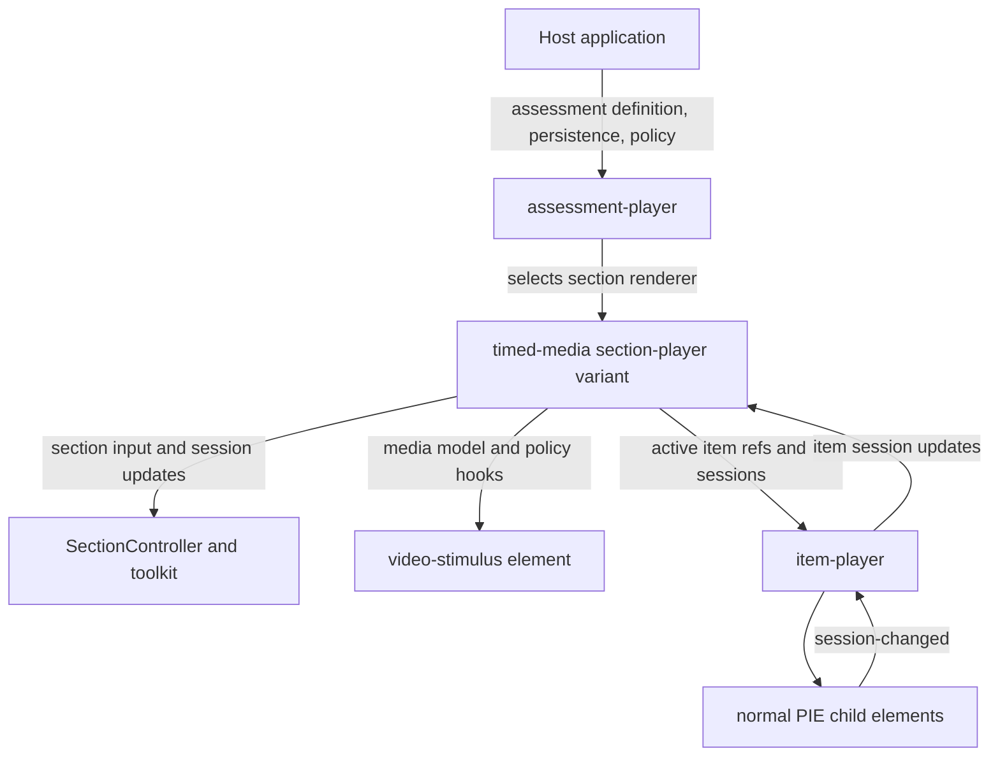

# Timed Media Section Architecture

Status: Architecture proposal / pre-PRD direction. This note captures the intended shape of timed-media assessment in PIE. It is not an accepted implementation contract; later PRDs own the ratified model, session, event, and authoring surfaces.

Tracking: this workstream is deliberately not tracked in an issue tracker. This note and the PRDs under [`../prds/`](../prds/) are the record. The `Status:` line here and in each PRD, plus the review sequence in [`../prds/shared-contracts/README.md`](../prds/shared-contracts/README.md), carry the current state. Nothing is stalled waiting on a ticket.

## Current State

Last written 2026-06-27. Revalidated against `develop` on 2026-08-05: no code has been written, and the core assumptions still hold — `sectionType` does not exist anywhere in `packages/`, so the additive section sketch below still lands cleanly; the four layout custom elements still exist; and the proposed owning packages (`@pie-players/pie-players-shared`, `@pie-players/pie-assessment-toolkit`) are still the right homes by name. Re-checked 2026-08-09 after the sign-language work: all four of those still hold, `sectionType` still has no occurrence in `packages/`, and no timed-media code exists. What changed is underneath, in shared media vocabulary and in shipped media-rendering precedent — see [Revalidation, 2026-08-09](#revalidation-2026-08-09).

Four things changed underneath this note as of 2026-08-05. They are open decisions, not corrections to the direction.

**1. Assessment-player has no data-driven renderer selection.** The worked example below assumes assessment-player reads the section and chooses `pie-section-player-timed-media`. That seam does not exist. `AssessmentPlayerDefaultElement` takes a hardcoded `sectionPlayerLayout: "splitpane" | "vertical"` attribute and imports only those two layouts; tabbed and kernel-host are not reachable through assessment-player at all, and nothing dispatches on section data. Either a `sectionType`-driven dispatch is a prerequisite for the worked example, or timed media targets the standalone section-player path where the host picks the tag directly — which works today. A PRD should choose deliberately rather than inherit the assumption.

**2. `RubricBlock` is now explicitly passage-typed**, which weakens option 1 in [Video Stimulus Mapping](#video-stimulus-mapping). See that section.

**3. `assessment-toolkit` grew a policy and runtime engine layer** that is a better fit for cue and playback policy than this note assumes. It now owns `SectionRuntimeEngine`, `SectionEngineCore`, engine state/transition/stage-derivation, `RuntimeRegistry`, `SectionEngineAdapter`, an instrumentation bridge, and a `ToolPolicyEngine` with `PolicySource`, `compose-decision`, and provenance tracking. This note puts cue orchestration in the layout custom element and treats the toolkit as tool/service coordination only. Cue policy and playback policy are closer in shape to composed policy decisions than to layout internals. `SectionController` still lives in `section-player`. The layer-ownership table below should be re-derived against the engine before the section PRD hardens.

**4. Do not reuse the canonical `Stage` vocabulary for cue gating.** `players-shared/src/pie/stages.ts` is a lifecycle list — `composed`, `engine-ready`, `interactive`, `disposed` — deliberately narrowed in the M6 retro after earlier readiness-event drift was removed. Progression and cue gating are not in it and should not be added to it.

Two smaller notes for whoever picks this up:

- The interaction-event shared-contract PRD is now behind its own implementation. `players-shared/src/instrumentation/` ships typed events with DebugPanel, NewRelic, and Composite providers plus an event bridge. That PRD should be rewritten to align with what shipped rather than to design from scratch, which also changes its position in the shared-contracts review sequence.
- `video-stimulus` will not be a code sibling of the passage element. `passage` lives in `pie-elements-ng/packages/elements-react/`; `elements-svelte/` currently holds three elements. A Svelte video-stimulus shares no framework or code with `passage` — the sibling framing in this note is conceptual only.

Two workstreams landed since this note was written that a video stimulus surface must consume rather than re-invent: the broad theming contract (`../prds/pie-727-broad-theming-contract.md` and the token inventory) for media control styling, and the line-reader window view plus inline TTS work for media-control focus and reading-tool coordination. Both postdate [`../prds/shared-contracts/accessibility-runtime-patterns.md`](../prds/shared-contracts/accessibility-runtime-patterns.md).

Added 2026-08-07: sign-language (ASL) video came up as a candidate use for this section flavor and was scoped out into its own contract. Section-player is still the runtime host for signing — via the existing accessibility-catalog rail, not a new section flavor. See [Sign Language Is Not This Section Flavor](#sign-language-is-not-this-section-flavor) and [`../prds/sign-language-asl-support.md`](../prds/sign-language-asl-support.md).

### Revalidation, 2026-08-09

The sign-language work (PIE-880 in `pie-players`, PIE-881 in `pie-api-aws`) left this note's direction intact — the fence in [Sign Language Is Not This Section Flavor](#sign-language-is-not-this-section-flavor) held, and signing shipped through the catalog rail rather than as a section flavor. It moved four things this note describes, none of them a reversal.

**1. The media vocabulary is ratified, and has two shipped consumers rather than one.** [`../prds/shared-contracts/media-asset-contract.md`](../prds/shared-contracts/media-asset-contract.md) is `Ready` as of 2026-08-09, ratified against this note's own proposed shapes before the release that first publishes the types. Two results bind this side: a cue range is `MediaFragmentRange { startSeconds, endSeconds? }` carried beside the asset, and `video-stimulus` needs nothing `MediaAssetRef` lacks — every field of [`VideoStimulusModel`](#stimulus-api-expectations) below maps onto a shipped one. The second consumer is `SpokenAudioCardPayload`, recorded audio as a `spoken` alternate, which exercised the same shape for `kind: "audio"` without a field change. So the media half of this workstream is inheritance, not design. What remains for the section contract is to say what a cue range *means* — the range type deliberately carries no playback semantics, and a cue's "window in which this cue is active" is not the signing consumer's "play only this slice".

**2. A shared media validation layer exists and must be consumed, not re-implemented.** `assessment-toolkit/src/services/catalog-media.ts` holds the source-scheme allow-list, source normalization, dedupe by `src`, and fragment normalization, extracted when the second media consumer arrived. Authored media URLs are wire-facing and untrusted; `video-stimulus` gets its validation from here rather than writing a second allow-list.

**3. PIE now ships a media player, which changes what the Video.js v10 decision argues against.** Signing renders through a deliberately minimal native `<video controls>` wrapper in `section-player/src/components/shared/SectionItemMediaRegion.svelte`, chosen because the clips are seconds long and a dependency on an unbuilt element buys nothing. That is not a reversal of v10 as the target for a real stimulus player — a section-scale stimulus needs seek gating, caption UI, and playback policy that a bare `<video>` does not give. It does mean [Video Player Dependency Decision](#video-player-dependency-decision) no longer argues against nothing: the dependency has to beat a working native baseline, and the two must not both end up rendering learner-facing media on different stacks without a stated reason.

**4. Three accessibility requirements below have shipped answers, and one has a shipped refusal.** See [Accessibility and Toolkit Implications](#accessibility-and-toolkit-implications), where each is now attributed. The refusal is the useful one for this side: signing has no equivalent of `data-tts-suppress` and none should be added, because suppression is per content node while a signed alternate is one video per item. Cue-scoped suppression, if it ever comes up here, inherits that reasoning rather than the read-aloud precedent.

One addition, not a correction: the vocabulary now has a **producer**. The `pie-api-aws` Learnosity importer writes `accessibilityCatalogs` carrying `MediaAssetRef`-shaped media, which has already constrained the contract once — `transcript` had to join the known catalog types because the importer emits it. [QTI 3 Mapping](#qti-3-mapping) should be read with a live import path in mind rather than as a purely prospective concern.

## Context

PIE already has strong primitives for individual interactive questions, shared passages, section composition, and assessment-level routing. A video-linked assessment stretches those primitives in a useful way: one static media stimulus is paired with multiple normal PIE items, and timestamp cues control when those items appear, pause playback, gate progression, and contribute to an aggregate section outcome.

This is not currently a Renaissance deployment requirement. It is a boundary test for how PIE should grow and a likely gap for users outside Renaissance, such as higher education, online courses, vocational training, HR/compliance training, and other scored/evaluated learning interactions.

## Goals

- Treat video-linked assessment as section-level composition, not as one large opaque element.
- Keep child questions as normal PIE items/elements with normal item sessions and outcomes.
- Introduce a reusable `video-stimulus` element in `pie-elements-ng` for media playback, captions, transcript, and player control APIs.
- Introduce a timed-media section contract and section-player variant in `pie-players`.
- Define enough vocabulary, responsibility boundaries, and proposed data shape to support later implementation PRDs without relying on this discussion.

## Non-Goals

- No item bank, media asset repository, catalog management, rostering, scheduling, workflow, gradebook, or backend reporting. Those remain host-system responsibilities.
- No full replacement for `assessment-player`; assessment-player still chooses which section is active and owns assessment-level navigation/session state.
- No attempt to force the timed-media container into a leaf PIE element.
- No opaque PCI/custom-item wrapper that hides child questions from normal PIE item/session/outcome contracts.
- No commitment that the field names in this note are final. They are proposed handoff names for PRDs to ratify or revise.
- No sign-language/ASL delivery as a *section flavor*. Section-player renders signing through the existing accessibility-catalog rail (item-level, cue-free), specified in [`../prds/sign-language-asl-support.md`](../prds/sign-language-asl-support.md); it is not a `sectionType` and not a new layout.

## Glossary

| Term | Meaning in this note | Relationship to current PIE language |
| --- | --- | --- |
| Stimulus | Shared non-response content that frames one or more items. | Broader architecture term. In QTI contexts, "stimulus" is common. |
| Passage | The current PIE player term for shared reading or visual context rendered alongside items. | `pie-elements-ng/UBIQUITOUS_LANGUAGE.md` treats "passage" as canonical and "stimulus" as a QTI alias to avoid for current element work. |
| Video stimulus | A new shared media stimulus package, likely `@pie-element/video-stimulus`. It renders media and exposes playback APIs. | A sibling to, not an extension of, `@pie-element/passage`; cue-to-question orchestration does not belong inside it. |
| Section | A QTI-like grouping of item refs, shared content, tools, and section session state. | Existing `AssessmentSection` in `@pie-players/pie-players-shared`. |
| Timed-media section | A section whose shared media timeline controls child item visibility/progression through cue metadata. | A new section flavor, not a new assessment layer. |
| Cue | A timestamp or time range that activates one or more item refs and optional policy. | New timed-media section concept. |
| Child item | A normal `assessmentItemRef` rendered by item-player and backed by normal PIE elements. | Existing section-player item composition. |
| Composition authoring | Authoring of section-level composition: stimulus, item refs, cue bindings, layout, playback policy, scoring policy. | New authoring category between element authoring and assessment authoring. |
| Assessment authoring | Assembly of sections into a test, activity, or larger assessment definition. | Assessment-player / host-level concern. |

The terminology tension is intentional: current element docs should continue to use **Passage** where they describe today's passage+item pattern. This proposal uses **stimulus** as the broader architecture category because video, audio, and future simulations are not naturally "passages." A later PRD should decide whether to update the ubiquitous language with a hierarchy such as "Stimulus is the broad category; Passage is the text/reading flavor."

One cross-vendor trap, recorded 2026-08-07: **Learnosity's "stimulus" is not this note's "stimulus."** In Learnosity's item model, `stimulus` corresponds to what PIE calls **prompt** — per-item question language, not shared content framing several items. Do not treat a Learnosity `stimulus` field as a PIE passage or as a timed-media stimulus during import mapping; the resemblance is in the word only.

## Layer Ownership


```mermaid
flowchart TD
  hostApp["Host application"]
  assessmentPlayer["assessment-player"]
  timedSectionPlayer["timed-media section-player variant"]
  sectionController["SectionController and toolkit"]
  videoStimulus["video-stimulus element"]
  itemPlayer["item-player"]
  childElements["normal PIE child elements"]

  hostApp -->|"assessment definition, persistence, policy"| assessmentPlayer
  assessmentPlayer -->|"selects section renderer"| timedSectionPlayer
  timedSectionPlayer -->|"section input and session updates"| sectionController
  timedSectionPlayer -->|"media model and policy hooks"| videoStimulus
  timedSectionPlayer -->|"active item refs and sessions"| itemPlayer
  itemPlayer --> childElements
  childElements -->|"session-changed"| itemPlayer
  itemPlayer -->|"item session updates"| timedSectionPlayer
```

| Layer | Owns | Does not own |
| --- | --- | --- |
| Host application | Media hosting/CDN, CSP, item lookup/storage, durable attempt persistence, authorization, telemetry sinks, product workflow, backend policy. | Internal section runtime mechanics or child element behavior. |
| `assessment-player` | Active section selection, assessment-level navigation, assessment session abstraction over section sessions. | Timed cue orchestration or media playback internals. |
| Timed-media section-player variant | Media layout, cue activation, item reveal/selection, pause/resume policy, section-level completion view, bridge between media state and child item sessions. | Child element internals, backend storage, assessment-level routing. |
| `SectionController` / toolkit | Aggregate section state, item-session map, persistence snapshot shape, tools/TTS/accessibility service coordination. | Direct per-item controller instantiation, product policy, durable storage. |
| `video-stimulus` | Media rendering and stable playback API: sources, captions, transcript, time, play/pause/seek, media events. | Cue-to-item bindings, scoring, child item sessions. |
| `item-player` | Rendering normal item content and propagating item sessions/outcomes. | Media timeline policy or section-level aggregation policy. |
| Child PIE elements | Their own model/session/environment, authoring surface, session-changed events, controller outcomes. | Section composition, media state, persistence. |

## Why a Section-Player Variant

Timed media is expressed as both:

- a data discriminator on section data, proposed as `sectionType: "timed-media"`; and
- a section-player layout/custom element, for example `pie-section-player-timed-media`, selected by assessment-player or direct host logic.

This extends the section-player family. It does not create a new item-player or assessment-player layer.

Existing section-player custom elements are layout-specific:

- `pie-section-player-splitpane`
- `pie-section-player-vertical`
- `pie-section-player-tabbed`
- `pie-section-player-kernel-host`

The current package architecture already distinguishes layout custom elements from runtime/controller plumbing. `SectionController` owns aggregate section state; custom elements are transport/layout adapters. A timed-media variant fits that pattern: it is a specialized layout/orchestration adapter around the same section-level runtime concepts.

Two caveats added 2026-08-05. First, the `sectionType` discriminator has no consumer today — assessment-player selects a layout from an attribute, not from section data, so the discriminator only pays off if that dispatch is built (see [Current State](#current-state), item 1). Second, "specialized layout/orchestration adapter" bundles two responsibilities that the codebase now separates: layout belongs in the custom element, but cue and playback *policy* may belong in the toolkit's policy engine (item 3). The variant may end up thinner than this section implies.

## Normal Passage Section vs Timed-Media Section

| Concern | Normal passage+items section | Timed-media section |
| --- | --- | --- |
| Shared content | Passage rendered beside or above items. | Video/media stimulus rendered with timeline controls. |
| Child questions | Normal `assessmentItemRefs`. | Normal `assessmentItemRefs`. |
| Visibility | Items are all visible or navigable according to section layout. | Cue policy reveals/selects/gates items based on media time. |
| Progression | Section navigation or page-mode behavior. | Media playback plus cue completion policy. |
| Session storage | Item sessions in section item-session map, plus navigation state. | Same item-session map, plus media progress and cue state. |
| Tools/accommodations | Section/player tool placement, passage/item TTS, highlights. | Same services, plus media-control accessibility, captions, transcript, cue announcements, and playback-lock focus handling. |

The video stimulus is "passage-like" because it is shared context, but it is not only a passage. The timed-media section adds timeline-driven orchestration that a plain passage renderer should not own.

## Proposed Section Data

This sketch is QTI-like JSON, not a ratified TypeScript interface.

```ts
const section = {
  identifier: "video-section-1",
  title: "Lab safety video check",
  sectionType: "timed-media",
  keepTogether: true,
  rubricBlocks: [
    {
      identifier: "video-stimulus-1",
      class: "stimulus",
      view: ["candidate"],
      // PRD decision: embed a Passage-like entity, reference a stimulus entity,
      // or keep media inside timedMedia.media.
    },
  ],
  assessmentItemRefs: [
    { identifier: "q-eye-protection", itemVId: "item-eye-protection" },
    { identifier: "q-spill-response", itemVId: "item-spill-response" },
  ],
  timedMedia: {
    stimulusRef: "video-stimulus-1",
    media: {
      kind: "video",
      sources: [{ src: "https://cdn.example/lab-safety.mp4", type: "video/mp4" }],
      poster: "https://cdn.example/lab-safety.jpg",
      captions: [
        { src: "https://cdn.example/lab-safety.en.vtt", lang: "en", label: "English" },
      ],
      transcript: { src: "https://cdn.example/lab-safety-transcript.html" },
    },
    cues: [
      {
        identifier: "cue-eye-protection",
        startTime: 42.5,
        itemRefs: ["q-eye-protection"],
        policy: { activation: "pause-and-require-response" },
      },
      {
        identifier: "cue-spill-response",
        startTime: 118,
        itemRefs: ["q-spill-response"],
        policy: { activation: "reveal", allowResumeBeforeResponse: true },
      },
    ],
    playbackPolicy: {
      allowSeekAhead: false,
      pauseOnRequiredCue: true,
      requireMediaCompletion: true,
    },
    scoringPolicy: {
      strategy: "sum-child-outcomes",
    },
  },
};
```

### Video Stimulus Mapping

The final storage location for media metadata needs PRD review. Options, revised 2026-08-05 against the current `RubricBlock` type in `players-shared`:

1. Embed/reference a video stimulus through existing `rubricBlocks` with `class: "stimulus"`, keeping the conceptual link to shared content. **Weaker than it looked in June.** `RubricBlock` now carries `class: "stimulus" | "instructions" | "rubric"` alongside `passageVId?: string`, an embedded `passage?: PassageEntity`, and a plain `content?: string`. The `class: "stimulus"` slot is real, but every payload field on it is passage-typed or raw HTML. Taking this option means widening passage-specific fields to carry media, or adding a media-shaped sibling field to a type whose other flavors are text.
2. Add a new renderable flavor. **The premise needs restating:** there is no `item | passage | rubric` union in `players-shared` to extend. The flavor is expressed by `RubricBlock.class` plus separate item and passage shell elements in `section-player`. A media flavor therefore means a new `class` value *and* a new shell, not one union member.
3. Keep media metadata inside `timedMedia.media` and treat the stimulus as a section-local media resource rather than a generic passage entity. **Currently the cheapest and least invasive**, at the cost of media not being reusable as shared content across sections.

The durable decision should preserve this invariant: the video stimulus renders media and exposes playback APIs, but it does not know which question appears at which cue and does not own child sessions.

Note that options 1 and 3 differ on more than field placement: option 1 implies media is a first-class shared-content entity that a host can reference from several sections, and option 3 implies it is section-local. That reuse question should drive the choice.

## Cue Semantics

A cue is a timestamp or time range that activates one or more item refs and optional policy.

Candidate cue patterns:

- `reveal`: the item becomes visible or selected when the media reaches the cue.
- `pause-and-require-response`: playback pauses, focus moves to the item region, and playback can resume only after the required item session is complete.
- `metadata`: the cue emits state/events for analytics or author-visible timeline markers without gating the learner.
- `multi-item`: one cue activates several item refs, either together or as a local item group.

Cue policy is section behavior. It should not be encoded inside child item models, and it should not be encoded as private behavior of the video stimulus.

## Worked Example

1. The host loads an assessment whose active section has `sectionType: "timed-media"`.
2. Assessment-player chooses `pie-section-player-timed-media` for this section. (No such dispatch exists today; see [Current State](#current-state), item 1.)
3. The timed-media section player renders `video-stimulus` and preloads normal child item refs through item-player.
4. The learner starts the video.
5. At `42.5s`, `cue-eye-protection` fires.
6. The section player pauses the video, reveals `q-eye-protection`, and moves focus to the item region with an accessible cue announcement.
7. The child multiple-choice element updates its own session and emits `session-changed` through item-player.
8. The section player records the updated item session in the existing section item-session map and marks `cue-eye-protection` complete.
9. Playback resumes according to cue policy.
10. When required cues and media completion conditions are satisfied, the section aggregate completion becomes true. Scoring is derived from child item outcomes according to the section scoring policy.

## Stimulus API Expectations

`@pie-element/video-stimulus` should be authored in `pie-elements-ng`, preferably as a Svelte-based element that exports a web component class and follows the PIE element packaging contract.

The public API should be PIE-owned and independent of the underlying video library:

```ts
interface VideoStimulusModel {
  id: string;
  element: "@pie-element/video-stimulus";
  sources: Array<{ src: string; type?: string }>;
  poster?: string;
  captions?: Array<{ src: string; lang: string; label: string; default?: boolean }>;
  transcript?: { src?: string; html?: string; plainText?: string };
  accessibilityLabel?: string;
}

interface VideoStimulusHandle {
  readonly currentTime: number;
  readonly duration: number;
  readonly paused: boolean;
  play(): Promise<void>;
  pause(): void;
  seekTo(seconds: number): void;
}
```

Expected events:

- `media-ready`
- `media-time-changed`
- `media-play`
- `media-pause`
- `media-seeked`
- `media-ended`
- `media-track-changed`
- `media-error`

Expected policy hooks from the section player:

- allowed seek range / seek-ahead gating
- disabled controls during required cue response
- caption/transcript requirements
- focus handoff when cue-linked items appear

## Session, Scoring, and Persistence

Child item sessions stay in the existing section item-session map. Timed-media adds section-level media and cue state. Proposed shape:

```ts
interface TimedMediaSectionSession {
  currentItemIndex?: number;
  visitedItemIdentifiers?: string[];
  itemSessions: Record<string, unknown>;
  timedMedia?: {
    mediaCurrentTime: number;
    mediaCompleted: boolean;
    visitedCueIdentifiers: string[];
    completedCueIdentifiers: string[];
    activeCueIdentifier?: string;
    playbackAttempts?: Array<{
      startedAt: string;
      endedAt?: string;
      maxPositionSeconds: number;
    }>;
    aggregateComplete?: boolean;
  };
}
```

Fixed intent:

- child responses remain child item sessions;
- media progress and cue state are section state;
- durable persistence is host-owned;
- section runtime emits canonical section events from the layout host.

PRD-open decisions:

- exact field names;
- whether `timedMedia` extends the existing section persistence snapshot or is a sibling slice normalized by assessment-player;
- how much playback-attempt detail is required versus telemetry-only;
- whether section scoring returns a formal aggregate outcome or only completion and child outcome aggregation.

Scoring aggregation candidates:

- `sum-child-outcomes`
- `average-child-outcomes`
- `weighted-child-outcomes`
- `all-required-cues-complete`
- `host-defined`

## Authoring Model

Timed media introduces a new authoring category: composition authoring.

| Authoring layer | Author edits | Likely owner |
| --- | --- | --- |
| Element authoring | One element model, such as a multiple-choice question or video stimulus media metadata. | `pie-elements-ng` element packages. |
| Item authoring | Markup/models for a normal PIE item, possibly with multiple elements. | Existing item authoring hosts / product tooling. |
| Composition authoring | Section-level stimulus, item refs, cue timestamps, cue-to-item bindings, playback policy, scoring policy, layout preview. | New section-level authoring surface, likely in `pie-players` or a companion authoring package. |
| Assessment authoring | Assembly of sections into a test, activity, or larger assessment definition. | Host/product or assessment authoring system. |

The video stimulus authoring UI edits sources, poster, captions, transcript, and media accessibility metadata. It does not edit cue bindings.

The timed-media composition authoring UI edits cue points, binds cues to existing or newly-created item refs, configures playback/scoring policy, and previews the timeline. It may invoke normal item authoring surfaces for child questions, but it should not own child item internals.

Host products remain responsible for item banks, media asset storage, content workflow, permissions, review, publishing, and durable persistence.

## QTI 3 Mapping

QTI 3 supports many ingredients for this shape, but not the full section-level timestamp-to-item orchestration as a native primitive.

| QTI 3 concept | PIE field / concept | Gap or profile need |
| --- | --- | --- |
| `qti-assessment-section` | `AssessmentSection` | Good fit for grouping child item refs and shared context. |
| `qti-assessment-item-ref` | `assessmentItemRefs` | Good fit for normal child questions. |
| `qti-rubric-block` / shared stimulus | `rubricBlocks` / stimulus reference | Can represent shared context, but not cue orchestration by itself. |
| `qti-media-interaction` | Item-level media interaction | Useful for media as an item interaction; not enough for section-level cue-to-item behavior. |
| `qti-time-limits`, item session control, branching | Section/test controls | Related but not expressive enough for media timeline cue semantics. |
| PCI / custom interaction | Opaque custom item wrapper | Can wrap the whole experience, but hides normal child item/session/outcome structure. Not preferred. |
| PIE timed-media profile | `sectionType: "timed-media"` and `timedMedia` | Needed to preserve timestamp cues, playback policy, child item bindings, and aggregate behavior in import/export. |

PIE should use QTI-like section data as the base and carry timed-media behavior as a PIE profile/extension during QTI import/export.

## Accessibility and Toolkit Implications

Timed-media delivery must satisfy WCAG 2.2 AA expectations and work with section tools/accommodations:

- captions/subtitles are first-class model fields, not optional decorations;
- transcripts must be available for video content when required by policy;
- all media controls must be keyboard accessible and expose clear labels;
- cue activation must be announced to assistive technology;
- focus must move predictably when playback pauses and an item appears;
- reduced-motion and autoplay preferences must be respected;
- TTS must not conflict with media playback; handoff rules are needed when reading tools and video audio compete;
- captions/transcripts should remain available during paused cue questions;
- seek-lock policy must not trap keyboard or assistive-technology users;
- high-contrast and zoom layouts must support the video, cue list, transcript, and child item region.

Four of these have answers as of 2026-08-09, from the signing and recorded-audio work rather than from this workstream. Adopt them rather than re-deciding them:

- **TTS versus media playback.** The action the learner just took wins: starting one pauses the other. Settled in [`../prds/sign-language-asl-support.md`](../prds/sign-language-asl-support.md) and implemented for both catalog media paths.
- **Media control styling.** Comes from the broad theming contract through three `--pie-section-player-item-media-*` tokens; the region stacks and its divider withdraws below a 560px card width. A timed-media stimulus is a different scale and will need its own tokens, but the token family and the naming pattern already exist.
- **Playback failure.** A clip that will not play degrades to the docked node's `content` card. The general rule this establishes — a media accommodation falls back to its text equivalent rather than failing silently — applies to a stimulus that will not load, though a stimulus has no `content` card to fall back to and this note owes that case an answer.
- **Suppression.** There is no signing equivalent of `data-tts-suppress`, deliberately: suppression is per content node, a signed alternate is one video per item, and the only available rule would withhold a deaf candidate's whole translation over one word. Read-aloud suppression itself did ship, as `data-tts-suppress` on the content element, mapping QTI's `data-qti-suppress-tts`. If cue-scoped suppression comes up here, the signing reasoning is the closer precedent.

Toolkit placement needs later PRD detail. At minimum, the timed-media section variant should reuse section-level tool coordination rather than inventing a parallel tool system.

## Video Player Dependency Decision

Use Video.js v10 as the strategic target for the underlying media player, wrapped behind PIE's own `video-stimulus` API.

Rationale:

- Video.js v10 is a modern rewrite focused on modular state, media, and UI components.
- It supports HTML custom elements through `@videojs/html`, which fits PIE's framework-agnostic web component direction.
- It is TypeScript/ESM oriented and suitable for modern browser delivery.
- Vidstack, Media Chrome, and Plyr are converging into the Video.js v10 effort, making v10 the strongest long-term ecosystem bet.
- The project is not targeting immediate deployment, so a beta dependency can be evaluated strategically rather than avoided only for schedule risk.

Links:

- [Vidstack, Media Chrome, and Plyr are merging forces](https://github.com/vidstack/player/discussions/1747)
- [Video.js v10 Beta: Hello, World (again)](https://videojs.org/blog/videojs-v10-beta-hello-world-again)
- [`@videojs/html` package](https://www.npmjs.com/package/@videojs/html)

Current license context: Video.js and `@videojs/html` are reported as Apache-2.0. A future implementation PRD must verify the exact package license, version maturity, package size, browser support, and API stability before adding the dependency.

Fallback context:

- Vidstack is MIT licensed, accessible, ESM-oriented, and web-component/Svelte friendly. It is a strong near-term fallback if Video.js v10 is not ready.
- Media Chrome is MIT licensed and web-component native. It is a strong lower level control-layer fallback if PIE needs to stay close to the native media element API.

The key architectural rule is dependency isolation: the timed-media section player talks to the PIE-owned `video-stimulus` API, not directly to Video.js.

Revised 2026-08-09: **PIE now ships learner-facing media on a native `<video>` element**, so this decision has a baseline to beat. The signing region (`SectionItemMediaRegion.svelte`) is a deliberately minimal native wrapper with `controls`, chosen because the clips are seconds long and depending on an unbuilt element bought nothing; the reasoning is recorded in [`../prds/sign-language-asl-support.md`](../prds/sign-language-asl-support.md). Two things follow. The v10 evaluation must be argued against native-plus-custom-controls rather than against nothing, and the features that justify it are the ones a stimulus needs and a signing clip does not: seek-range gating, caption and transcript UI, quality/track selection, and a control surface a playback policy can disable. And if v10 lands, the two paths should not silently diverge — either the signing region stays native by stated decision, or it migrates; what should not happen is two media stacks in one player because nobody revisited the question.

## Sign Language Is Not This Section Flavor

Sign-language (ASL) delivery looks adjacent to this note — it is video, it is accessibility-driven, and it needs a media player — and it is a different contract. Recorded 2026-08-07 after review of real ASL-bearing content; the full contract is [`../prds/sign-language-asl-support.md`](../prds/sign-language-asl-support.md).

**Section-player is still the runtime host** — same as it already is for spoken/TTS catalogs, and for the same reason: the accessibility catalog resolver lives in `assessment-toolkit`, which section-player consumes. What's ruled out is a *different* framing that came up first: modeling the ASL video as a passage and building a specialized ASL section layout for it. That framing fails on two counts:

1. **A signing video translates the prompt, not the passage.** It is per-item question language rendered in another language, not shared content framing several items. Nothing about it is section-scoped, so a section flavor buys nothing.
2. **ASL coexists with written English rather than replacing it.** Spanish translation produces a separate item with its own id, entirely in Spanish. ASL cannot follow that pattern, because ASL is not written down in everyday practice, and deaf learners in the US typically use both languages with differing fluency in each. The signed alternate has to sit alongside the English content in the same item.

So signing is an **item-level alternate representation** — many short recordings, each docked to one content node, played on learner demand, gating nothing — rendered by section-player through the existing accessibility-catalog rail (`sign-language` catalog cards docked via `data-catalog-idref`, gated by the `signLanguage` PNP support). It is not a `sectionType`, not a passage, and not a specialized layout.

| | Timed media | Sign language |
| --- | --- | --- |
| Scope | Section | Content node inside an item |
| Media count | One shared stimulus | Many short recordings |
| Purpose | Orchestrates items | Translates language |
| Timeline role | Reveals, gates, sequences items | None |
| Trigger | Playback position | Learner demand |
| Granularity | Item refs | Prompt, and plausibly answer choices |
| New section flavor? | Yes | No |
| Runtime host | Section-player (timed-media variant) | Section-player (existing catalog rail) |

Two things genuinely are shared and should not be duplicated: the [media asset contract](../prds/shared-contracts/media-asset-contract.md), and time-ranged playback. QTI 3 expresses signing time slices with Media Fragments URIs so one recording can serve several content nodes — the same "video plus timestamps" primitive this note needs, minus all the cue policy. If both contracts land, share that primitive rather than writing it twice.

Updated 2026-08-08: signing landed first, so both are now in code rather than pending — `MediaAssetRef` and friends in `@pie-players/pie-players-shared/types`, with the time range as a separate `MediaFragmentRange` carried beside the asset rather than inside it, since a range describes one *use* of a recording. Cue ranges should reuse it in that position. The sequencing worry in the shared-contracts note has partly resolved itself: the vocabulary exists, and this side's job is to ratify or extend it, not to write a second one.

Updated 2026-08-09: that ratification happened, and the answer was to inherit unchanged. [`../prds/shared-contracts/media-asset-contract.md`](../prds/shared-contracts/media-asset-contract.md) is `Ready`, checked against this note's proposed `VideoStimulusModel` and `cues[].startTime` shapes; a cue range fits `MediaFragmentRange` in both its point and ranged forms, and a stimulus needs no field `MediaAssetRef` lacks. A second catalog consumer arrived in the meantime — recorded audio as a `spoken` alternate — so the shape has carried two media kinds and two accommodations without changing. This side no longer has a media-vocabulary decision to make; it has a cue-semantics one, since the range type carries no playback meaning and a cue's activation window is not a slice to play.

## Rejected Alternatives

- **Leaf element container:** rejected because cue orchestration, child item sessions, section tools, and aggregate completion are section concerns.
- **Only a passage:** rejected because a plain passage does not own playback policy, cue-triggered item reveal, seeking rules, or child session aggregation.
- **Full assessment player:** rejected because the unit is still one section with one shared media stimulus and child items; assessment-level routing stays above it.
- **Opaque PCI/custom item:** rejected because it would hide normal PIE child questions and make scoring/session reuse harder.
- **`settings` escape hatch:** rejected for core composition data. Rendering knobs may live in settings, but cue-to-item bindings and playback/scoring policy should be typed section contract fields.

## Future PRDs and Workstreams

Recommended order:

1. `pie-elements-ng/docs/prds/video-stimulus/PRD.md`
   - Ratify the video stimulus model, public API, Svelte/web component package shape, accessibility requirements, and Video.js v10 integration boundary.
2. `pie-players` timed-media section contract/player PRD
   - Ratify `sectionType`, `timedMedia`, cue policy, session shape, assessment-player renderer selection, and section-player variant behavior.
3. Composition-authoring PRD
   - Ratify section-level authoring surfaces for cue timelines, item bindings, playback policy, preview, and child item authoring invocation.
4. QTI import/export profile notes
   - Define how the PIE timed-media profile is serialized alongside QTI-like section, item-ref, and stimulus data.

Dependency order:

- settle the video stimulus API before timed-media player implementation plans;
- settle the section contract before composition-authoring implementation plans;
- keep QTI mapping aligned with the ratified section contract.

Open questions for those PRDs:

- exact `AssessmentSection` type extension and ownership in `@pie-players/pie-players-shared`;
- whether video stimulus is represented through `rubricBlocks`, a new `RubricBlock.class` value plus shell, or `timedMedia.media` — driven by whether media must be reusable shared content across sections;
- whether assessment-player gains `sectionType`-driven renderer dispatch, or timed media targets the standalone section-player path where the host selects the tag;
- whether cue and playback policy live in the timed-media layout custom element or in the `assessment-toolkit` policy engine;
- exact session field names and persistence snapshot shape;
- scoring aggregation defaults;
- cue timeline authoring MVP versus full visual editor;
- Video.js v10 maturity, package size, license verification, and browser support;
- print/export behavior for timed-media sections;
- scorer/proctor/review views for cue-linked child items.
