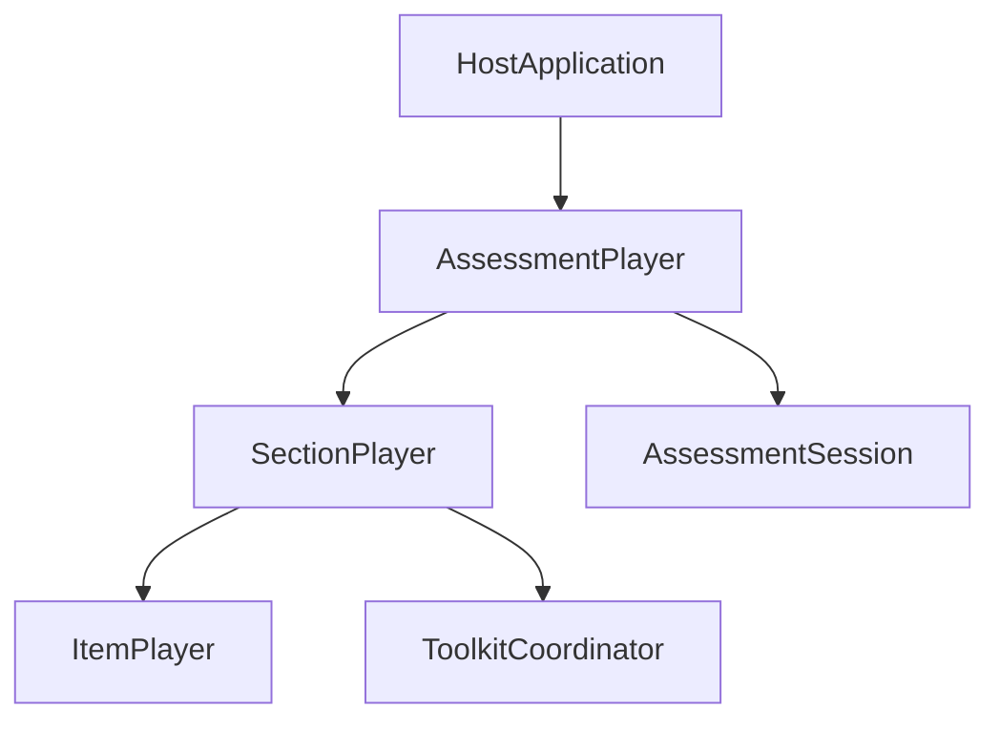

# Assessment Player Architecture

This document defines the intended architecture for the assessment player before implementation. It is the primary boundary reference for building and reviewing the first version of `@pie-players/pie-assessment-player`.

## Purpose

The assessment player is an orchestration layer above section player:

- `item-player` renders item content.
- `section-player` renders a section and aggregates item/session behavior.
- `assessment-player` coordinates which section is active and how assessment-level state evolves.

The assessment player is intentionally not a second rendering engine and not a replacement for `ToolkitCoordinator`.

## Layering And Ownership

- **Host application owns policy**: timing, navigation gating, submission confirmation, URL policy, analytics policy.
- **Assessment player owns mechanics**: active section selection, controller lifecycle, section switching, assessment session abstraction over section sessions.
- **Section player owns section runtime**: item composition, section navigation, section controller session semantics.
- **Toolkit coordinator owns shared services**: tools, TTS, accessibility, section-controller provisioning lifecycle.

## Interface Model

The interface model should mirror section-player patterns:

- At least one built-in layout CE out of the box.
- A custom layout composition path using shared primitives and host-authored UI.
- CE-first configuration for baseline usage.
- Richer JS API through runtime host contract and controller handle.

### Built-In Layout (First Pass)

First built-in layout should be minimal:

- Render current section via section-player.
- Show current position in assessment navigation.
- Provide `Back` and `Next` controls.
- Disable `Back` on first section.
- Disable `Next` when no following section exists.

The first UX shape is inspired by the navigation region shown in `docs/img/schoolcity-1.png`, but the package must avoid coupling to a product-specific full assessment chrome.

### Custom Layout Composition

Clients must be able to compose their own assessment UI with:

- Assessment-player custom elements.
- Shared shell/runtime primitives.
- Host-authored controls around the current section player.
- Runtime host contract selectors and commands.
- Public events and controller access.

## Runtime Contracts

### Runtime Host Contract (CE-facing)

First-pass compact contract should include:

- `getSnapshot()`
- `selectNavigation()`
- `selectReadiness()`
- `selectProgress()`
- `navigateTo(indexOrIdentifier)`
- `navigateNext()`
- `navigatePrevious()`
- `getAssessmentController()`
- `waitForAssessmentController(timeoutMs?)`

### Assessment Controller Handle (JS-facing)

First-pass controller should include:

- `initialize()`
- `hydrate()`
- `persist()`
- `getSession()`
- `getRuntimeState()`
- `navigateTo()`
- `navigateNext()`
- `navigatePrevious()`
- `submit()`
- `subscribe(listener)`

`getSession()` is the persistence payload. `getRuntimeState()` is observability/diagnostics state.

## Session Abstraction

Session layering must stay recursive:

- Item session (item runtime)
- Section session (`SectionControllerSessionState`)
- Assessment session (`AssessmentSession`)

Assessment session stores section snapshots as exact section-session payloads, not a parallel transformed format.

## Hooks And Events

Keep extensibility small and naming consistent with existing toolkit hooks.

### Hook Naming Convention

- `create*` for factories/override points.
- `onBefore*` for pre-lifecycle notifications.
- `on*` for lifecycle callbacks, readiness, telemetry, and errors.

Avoid a separate naming dialect.

### Candidate Hooks (First Pass)

- `createAssessmentDeliveryPlan`
- `createAssessmentSessionPersistence`
- `onAssessmentControllerReady`
- `onAssessmentControllerDispose`
- `onBeforeAssessmentHydrate`
- `onBeforeAssessmentPersist`
- `onError`
- `onTelemetry`

Prefer request events and host-side controller logic over large policy-specific hook sets.

### Candidate Public Events (First Pass)

- `assessment-controller-ready`
- `assessment-navigation-requested`
- `assessment-submit-requested`
- `assessment-route-changed`
- `assessment-session-applied`
- `assessment-session-changed`
- `assessment-progress-changed`
- `assessment-submission-state-changed`
- `assessment-error`

## Policy Boundary

The framework should expose state and lifecycle, not prescribe most product policy.

Host-owned by default:

- Timing behavior.
- Stage progression policy.
- Navigation gating/unlock rules.
- Review and revisit policy.
- Submission confirmation policy.
- Routing/URL policy.
- Persistence cadence.
- Telemetry/error presentation policy.

Framework-owned:

- Delivery realization mechanics.
- Active section orchestration.
- Session and lifecycle plumbing.
- Stable events and host/runtime contracts.

## Design Guardrails

- Do not move assessment navigation/timing/progress concerns into `ToolkitCoordinator`.
- Do not bypass section-player to render items directly.
- Keep API naming neutral (QTI-inspired internals are fine, QTI-prefixed public names are not required).
- Keep hooks/events minimal and composable rather than policy-heavy.
- Keep one packaged layout plus custom composition path as a first-class requirement.
