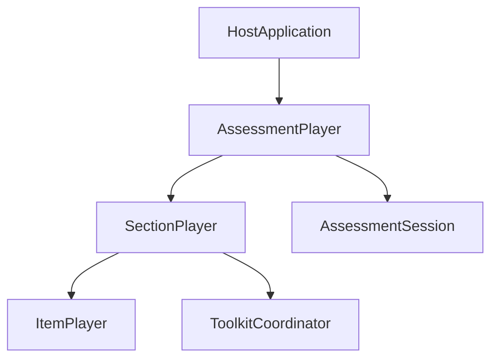

# Assessment Player — Client Integration Guide

This guide is for teams integrating `@pie-players/pie-assessment-player` into real assessment applications. It explains the architectural model, CE-first and JS-first integration patterns, hooks/events philosophy, and boundary ownership between assessment-player, section-player, assessment-toolkit, and the host application.

This is intentionally an architecture and integration guide, not a quickstart. It assumes familiarity with custom elements, TypeScript, and host-managed persistence/lifecycle in browser applications.

---

## 1. Why an Assessment Player?

`item-player` and `section-player` already solve rendering and section-scoped runtime concerns very well. But assessment delivery has additional orchestration concerns above a single section:

- routing between sections
- assessment-level progress and position
- assessment-level session continuity
- delivery-stage behavior and submission workflow
- integration with host application policy

The assessment-player exists to coordinate those concerns **without replacing section-player as the rendering workhorse**.

At a high level:

- `item-player` renders items
- `section-player` renders one section and coordinates section/item runtime behavior
- `assessment-player` orchestrates which section is active and how assessment-level state evolves

The visual shape often includes assessment-level navigation like the example below:


---

## 2. Philosophy: Small Core, Host-Owned Policy

The core philosophy for assessment-player is:

- framework owns canonical runtime mechanics
- host owns product policy and outer-app concerns

In practice, this means the framework should provide strong primitives:

- controller contracts
- stable snapshots/selectors
- hooks for factories and lifecycle interception
- request/fact events around key transitions

and avoid over-prescribing behavior for policies that vary heavily by product:

- timing rules
- navigation gating/unlock behavior
- review and revisit policy
- stage progression policy
- submission confirmation rules
- URL synchronization policy
- telemetry and UX error presentation policy

This is especially important because assessment-level integrations usually sit inside larger applications that also own concerns that are explicitly out-of-scope for this framework:

- user profile and permissions
- authentication/authorization
- app shell and broader route navigation
- product-level workflow and compliance rules

The design target is not “framework everything.” It is “provide a stable orchestration kernel that hosts can shape.”

---

## 3. Layer Model and Ownership



### Ownership boundaries

#### Assessment Player

- active section orchestration
- assessment session abstraction over section sessions
- assessment controller lifecycle
- assessment-level events/snapshots/contracts

#### Section Player

- section rendering
- section-level navigation/composition
- section session semantics and item aggregation

#### Toolkit Coordinator

- tool, accessibility, TTS, and service coordination
- section-controller provisioning/lifecycle support

#### Host Application

- durable persistence policy
- timing and business workflow policy
- auth/profile/app-shell concerns
- overall route and submission behavior

---

## 4. Integration Modes

Assessment-player supports the same broad integration approach as section-player:

- CE-first for straightforward host wiring
- JS/controller-first for advanced orchestration control

### CE-first mode

For baseline integration, mount the default element and pass assessment data directly:

```html
<pie-assessment-player-default
  assessment-id="assessment-001"
  attempt-id="attempt-abc"
  section-player-layout="splitpane"
  show-navigation="true"
></pie-assessment-player-default>
```

Then set object props from host code:

```ts
playerEl.assessment = assessmentDefinition;
playerEl.hooks = hooks;
playerEl.env = { mode: "gather", role: "student" };
```

### JS/controller-first mode

For stronger host control, wait for controller readiness and drive orchestration through the runtime contract:

```ts
const controller = await playerEl.waitForAssessmentController(5000);
if (!controller) throw new Error("Assessment controller not ready");

const runtime = controller.getRuntimeState();
if (runtime.canNext) {
  controller.navigateNext();
}
```

Use this mode when host policy (workflow/timing/gating/routing) is complex and tightly coupled to broader app state.

---

## 5. Runtime Host Contract

The assessment runtime host contract intentionally stays compact and selector-oriented:

- `getSnapshot()`
- `selectNavigation()`
- `selectReadiness()`
- `selectProgress()`
- `navigateTo(indexOrIdentifier)`
- `navigateNext()`
- `navigatePrevious()`
- `getAssessmentController()`
- `waitForAssessmentController(timeoutMs?)`

Key snapshot concerns:

- `currentIndex`, `totalSections`
- `canNext`, `canPrevious`
- `currentSectionId`
- readiness phase
- coarse progress (`visitedSections`, `totalSections`)

This keeps the public API small while still giving hosts enough information to implement custom policy and UI.

---

## 6. Assessment Controller Contract

`AssessmentControllerHandle` is the orchestration API behind the element surface:

- `initialize()`
- `hydrate()`
- `persist()`
- `getSession()`
- `getRuntimeState()`
- `navigateTo()`
- `navigateNext()`
- `navigatePrevious()`
- `submit()`
- `subscribe(listener)`

The same persistence rule as section-player applies:

- `getSession()` is the persistence payload
- `getRuntimeState()` is observability/runtime state and should not be treated as backend canonical storage

---

## 7. Hooks and Events: Extensibility Surface

Hook naming is intentionally aligned with toolkit conventions:

- `create*` for structural factories
- `onBefore*` for pre-lifecycle interception
- `on*` for lifecycle callbacks, telemetry, and errors

Current hook surface includes:

- `createAssessmentDeliveryPlan`
- `createAssessmentSessionPersistence`
- `onBeforeAssessmentHydrate`
- `onBeforeAssessmentPersist`
- `onAssessmentControllerReady`
- `onAssessmentControllerDispose`
- `onError`
- `onTelemetry`

Current public event contract includes:

- `assessment-controller-ready`
- `assessment-navigation-requested` (cancelable request event)
- `assessment-submit-requested`
- `assessment-route-changed`
- `assessment-session-applied`
- `assessment-session-changed`
- `assessment-progress-changed`
- `assessment-submission-state-changed`
- `assessment-error`

Request events are preferred for host policy interception; fact events communicate state transitions after they happen.

---

## 8. Session Model and Persistence Layering

Assessment-player uses recursive session layering:

- item sessions live inside section session snapshots
- section snapshots live inside `AssessmentSession.sectionSessions`
- assessment session is the outer aggregate in assessment mode

`AssessmentSession` tracks:

- assessment/session identifiers
- navigation state (`currentSectionIndex`, visited section IDs)
- realization metadata (`seed`, section identifiers)
- section snapshot map keyed by section identifier

Default persistence strategy is localStorage-backed and host-overridable via `createAssessmentSessionPersistence`. Production systems should provide their own backend strategy.

Hydration and persistence lifecycle should be host-aware:

- call `hydrate()` during assessment startup flow
- call `persist()` at policy-appropriate checkpoints
- use host lifecycle boundaries for durable save cadence, not only raw UI events

---

## 9. Layout and Composition Model

Assessment-player mirrors section-player’s approach:

- at least one built-in layout for common use (`pie-assessment-player-default`)
- a composition primitive for custom host UI (`pie-assessment-player-shell`)
- CE-first usage with richer JS/controller escape hatches

Default built-in layout responsibilities:

- mount current section via section-player (`splitpane` or `vertical`)
- render current position in sequence
- render Back/Next controls
- disable Back on first section
- disable Next on final section

Custom host composition remains first-class: host can render additional assessment chrome, policy UI, timers, and workflow controls around these primitives.

---

## 10. Guardrails for Production Integrations

**Do not over-framework policy.** Timing, review rules, and workflow gating should remain host-owned unless repeated use proves a shared contract.

**Do not bypass section-player rendering.** Assessment-player should orchestrate sections, not render items directly.

**Keep hooks/events minimal and generic.** Prefer request/fact events and host controller logic over many specialized policy hooks.

**Treat outer-app concerns as host responsibilities.** Auth/profile/app navigation should not leak into player runtime concerns.

**Persist session payloads, not diagnostics.** Store assessment session snapshots as canonical data; treat runtime diagnostics as ephemeral.
