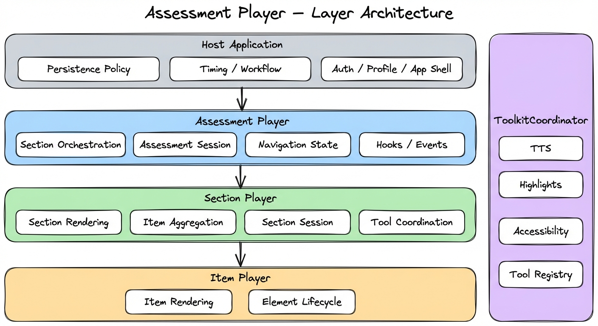
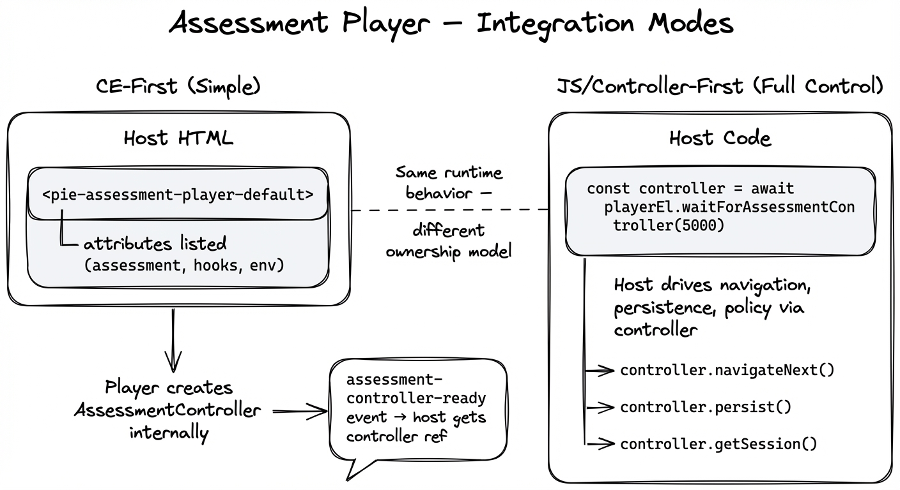
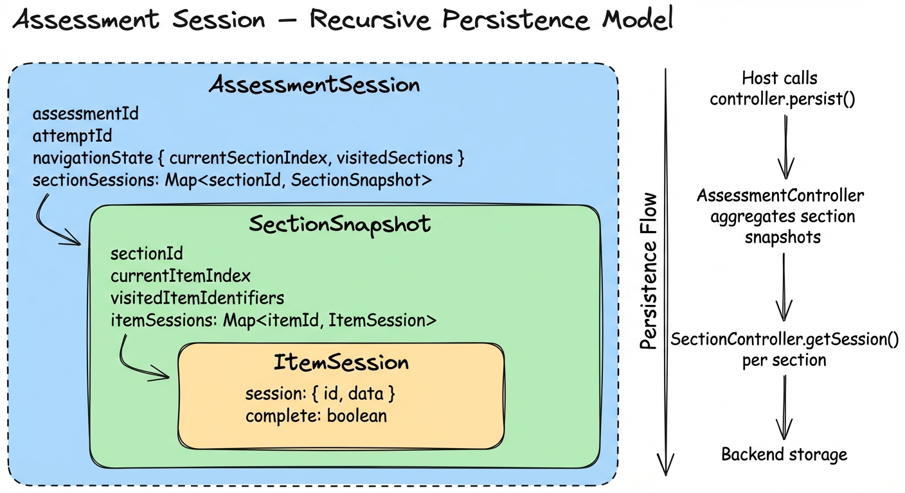
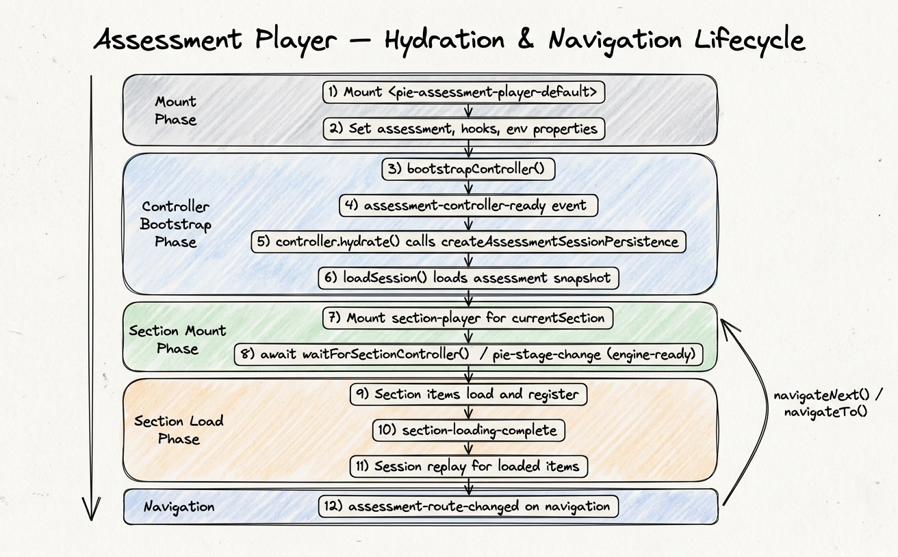

# Assessment Player — Client Integration Guide

This guide is for teams integrating `@pie-players/pie-assessment-player` into real assessment applications. It covers the architectural model, both CE-first and JS API integration patterns, hooks/events philosophy, session persistence, and the boundary ownership between assessment-player, section-player, assessment-toolkit, and the host application.

This is intentionally an architecture and integration guide, not a quickstart. It assumes familiarity with custom elements, TypeScript, and host-managed persistence/lifecycle in browser applications.

---

## 1. Why an Assessment Player?

`item-player` and `section-player` already solve rendering and section-scoped runtime concerns well. A section is the natural rendering unit: one section fills one browser page, with its items, passages, tools, and accommodations composed into a single view. But assessment delivery has orchestration concerns above a single section:

- routing between sections
- assessment-level progress and position tracking
- assessment-level session continuity across sections
- delivery-stage behavior and submission workflow
- integration with host application policy

The assessment-player exists to coordinate those concerns **without replacing section-player as the rendering workhorse**.

At a high level:

- `item-player` renders items
- `section-player` renders one section and coordinates section/item runtime behavior
- `assessment-player` orchestrates which section is active and how assessment-level state evolves

The visual shape often includes assessment-level navigation like the example below:


Every team that builds beyond the section level ends up re-solving section routing, assessment session aggregation, and navigation state. The assessment player provides that layer as a tested foundation — so integration teams can focus on their product's unique concerns rather than rebuilding orchestration plumbing.

---

## 2. Philosophy: Small Core, Host-Owned Policy

The core philosophy for assessment-player is:

- **framework owns canonical runtime mechanics**
- **host owns product policy and outer-app concerns**

This is especially important because assessment-level integrations usually sit inside larger applications with concerns that are explicitly out-of-scope for this framework:

- user profile and permissions
- authentication/authorization
- app shell and broader route navigation
- product-level workflow and compliance rules

In practice, the framework provides strong primitives:

- controller contracts
- stable snapshots/selectors
- hooks for factories and lifecycle interception
- request/fact events around key transitions

And avoids over-prescribing behavior for policies that vary heavily by product:

- timing rules
- navigation gating/unlock behavior
- review and revisit policy
- stage progression policy
- submission confirmation rules
- URL synchronization policy
- telemetry and UX error presentation policy

The design target is not "framework everything." It is "provide a stable orchestration kernel that hosts can shape." Each host will bring its own spin — delivery workflows, time policies, navigation constraints, review modes — and the framework should make that natural rather than fighting against built-in assumptions.

---

## 3. Layer Model and Ownership



The system is built around four layers with well-defined ownership boundaries. Getting these boundaries right is the most important architectural decision your integration has to make.

### Assessment Player

- active section orchestration (which section is mounted, when to transition)
- assessment session abstraction over section sessions
- assessment controller lifecycle (`initialize`, `hydrate`, `persist`)
- assessment-level events/snapshots/contracts
- navigation state tracking (`currentSectionIndex`, visited sections)

### Section Player

- section rendering (items, passages, toolbars, layout composition)
- section-level navigation within items
- section session semantics and item aggregation
- tool coordination via `ToolkitCoordinator`

### Toolkit Coordinator

- tool, accessibility, TTS, and highlight coordination
- section-controller provisioning and lifecycle support
- per-assessment-context service hub (one coordinator per assessment context)

### Host Application

- durable persistence policy (where and when to save)
- timing, workflow, and business policy
- auth/profile/app-shell concerns
- overall route, submission, and result behavior

The rule is: **player handles runtime mechanics, host handles durable data and policy.** Violations of this — for instance, storing `getRuntimeState()` blobs to your backend, or letting the player control navigation without host involvement — lead to brittle integrations.

---

## 4. Integration Modes

Assessment-player supports the same broad integration approach as section-player. The two modes produce identical runtime behavior; the difference is where the `AssessmentController` is constructed and who owns its lifecycle.



### CE-First (simple)

For baseline integration, mount the default element and pass assessment data directly:

```html
<pie-assessment-player-default
  assessment-id="assessment-001"
  attempt-id="attempt-abc"
  section-player-layout="splitpane"
  show-navigation="true"
  player-type="iife"
></pie-assessment-player-default>
```

Then set object props from host code:

```ts
const playerEl = document.querySelector('pie-assessment-player-default');
playerEl.assessment = assessmentDefinition;
playerEl.hooks = hooks;
playerEl.env = { mode: 'gather', role: 'student' };
```

Key attributes/properties on `pie-assessment-player-default`:

| Attribute | Type | Purpose |
| --- | --- | --- |
| `assessment-id` | `string` | Identifies the assessment |
| `attempt-id` | `string` | Identifies the attempt (host-owned) |
| `section-player-layout` | `'splitpane' \| 'vertical'` | Which section player layout to use |
| `show-navigation` | `boolean` | Whether to render built-in Back/Next navigation |
| `debug` | `boolean` | Verbose logging control (`true` to enable, `false`/`0` to disable) |
| `player-type` | `'iife' \| 'esm' \| 'preloaded'` | Item element loading strategy |
| `assessment` | `object` | Assessment definition (sections, test parts) |
| `hooks` | `object` | Assessment player hooks (see §7) |
| `env` | `object` | `{ mode: 'gather'/'view'/'evaluate', role: 'student'/'instructor' }` |
| `coordinator` | `ToolkitCoordinator` | Pass-through coordinator for tools/TTS/accessibility |
| `sectionPlayerRuntime` | `object` | Optional pass-through runtime object applied to each mounted section-player |

To obtain the controller after bootstrap:

```ts
playerEl.addEventListener('assessment-controller-ready', (e) => {
  const controller = e.detail.controller;
  // controller is now available for programmatic access
});
```

### JS/Controller-First (full control)

For stronger host control, wait for controller readiness and drive orchestration through the runtime contract:

```ts
const controller = await playerEl.waitForAssessmentController(5000);
if (!controller) throw new Error('Assessment controller not ready');

const runtime = controller.getRuntimeState();
if (runtime.canNext) {
  controller.navigateNext();
}
```

Use this mode when host policy (workflow/timing/gating/routing) is complex and tightly coupled to broader app state.

### Passing a coordinator through

When the host constructs a `ToolkitCoordinator` for tool and TTS configuration, pass it to the assessment player element as a property. The assessment player forwards it to each section player it mounts internally:

```ts
import { ToolkitCoordinator } from '@pie-players/pie-assessment-toolkit';

const coordinator = new ToolkitCoordinator({
  assessmentId: 'assessment-001',
  tools: { /* placement, providers */ },
  hooks: { /* persistence, error handling */ },
});

playerEl.coordinator = coordinator;
```

This keeps one coordinator per assessment context — the same instance drives TTS, highlights, tool state, and section controller lifecycle across all sections. Creating multiple coordinators for the same assessment is a bug.

### Item-level observability through assessment-player

When using `pie-assessment-player-default`, pass section-level player observability overrides
through `sectionPlayerRuntime.player`:

```ts
import { ConsoleInstrumentationProvider } from '@pie-players/pie-players-shared';

const provider = new ConsoleInstrumentationProvider({ useColors: true });
await provider.initialize({ debug: true });

playerEl.sectionPlayerRuntime = {
  player: {
    loaderConfig: {
      trackPageActions: true,
      instrumentationProvider: provider,
      maxResourceRetries: 3,
      resourceRetryDelay: 500,
    },
  },
};
```

Notes:

- `sectionPlayerRuntime` is a JS property, not a serialized attribute.
- For observability providers, prefer object property assignment to preserve provider instance references.
- Assessment-level public events (for example `assessment-navigation-requested`, `assessment-route-changed`, `assessment-session-changed`) are instrumented through the same generic provider contract. They are not New Relic-specific hooks.
- Use `loaderConfig.instrumentationProvider` as the canonical injection point; New Relic is one possible provider implementation.
- With `trackPageActions: true`, missing/`undefined` `instrumentationProvider` uses the default New Relic provider path.
- `instrumentationProvider: null` is an explicit no-op opt-out.
- Ownership model: assessment-player instrumentation owns assessment events; section-player owns section events; toolkit owns toolkit lifecycle events. This keeps event streams clean and non-overlapping.

### Instrumentation (dedicated)

Assessment-player instrumentation is generic and provider-agnostic. It uses the same `InstrumentationProvider` contract as item-player and section-player.

Canonical provider injection paths:

- `sectionPlayerRuntime.player.loaderConfig.instrumentationProvider`

Provider semantics:

- With `trackPageActions: true`, missing/`undefined` provider values use the default New Relic provider path.
- `provider: null` explicitly disables instrumentation.
- Invalid provider objects are ignored (optional debug warning), also no-op.
- Post-connect provider updates are supported: the bridge rebinds when provider-bearing properties change.
- Toolkit telemetry forwarding uses the same provider instance, so tool/backend operations are visible in the same stream as assessment/section events.

Assessment-player owned canonical event stream:

- `pie-assessment-controller-ready`
- `pie-assessment-navigation-requested`
- `pie-assessment-route-changed`
- `pie-assessment-session-applied`
- `pie-assessment-session-changed`
- `pie-assessment-progress-changed`
- `pie-assessment-submission-state-changed`
- `pie-assessment-error`

Ownership rule: assessment-player does not claim section/toolkit semantics. Keep streams independent, and rely on bridge dedupe only as a defensive safety net.

Toolkit tool/backend operational events (visible through assessment-player when toolkit is mounted) include:

- `pie-tool-init-start|success|error`
- `pie-tool-backend-call-start|success|error`
- `pie-tool-library-load-start|success|error`

---

## 5. Content and Loading

The assessment player does not load content directly. It orchestrates which section is active; the section player handles rendering.

Content flows through the `assessment` property — an `AssessmentDefinition` containing either a flat `sections` array or nested `testParts[].sections`. The assessment controller flattens test parts into a linear `AssessmentDeliveryPlan` (customizable via the `createAssessmentDeliveryPlan` hook) and navigates by index through that plan.

```ts
const assessment = {
  identifier: 'colonial-history-se-asia',
  title: 'Colonial History in Southeast Asia',
  sections: [
    { identifier: 'section-1', /* items, rubricBlocks, etc. */ },
    { identifier: 'section-2', /* ... */ },
    { identifier: 'section-3', /* ... */ },
  ],
};

playerEl.assessment = assessment;
```

Each section is passed to a `pie-section-player-splitpane` or `pie-section-player-vertical` element when it becomes active. Item element loading (IIFE/ESM/preloaded), bundle resolution, and registration tracking all happen at the section player level — assessment-player forwards `player-type` plus optional `sectionPlayerRuntime` pass-through overrides. See the [section player integration guide](../section-player/client-architecture-tutorial.md) §4 for full coverage of content loading strategies.

---

## 6. Tool and Theme Configuration

Tools, TTS, accessibility, and theming are configured at the `ToolkitCoordinator` level — not the assessment player. The assessment player's role is to pass the coordinator through to each section player it mounts.

```ts
const coordinator = new ToolkitCoordinator({
  assessmentId: 'assessment-001',
  tools: {
    placement: {
      section: ['theme', 'graph', 'periodicTable', 'lineReader'],
      item: ['calculator', 'textToSpeech', 'annotationToolbar'],
      passage: ['textToSpeech', 'annotationToolbar'],
    },
    providers: {
      textToSpeech: {
        backend: 'polly',
        serverProvider: 'polly',
      },
      calculator: {
        authFetcher: async () => {
          const r = await fetch('/api/tools/desmos/auth');
          return r.json();
        },
      },
    },
  },
});

playerEl.coordinator = coordinator;
```

The same coordinator instance is reused across section transitions. When the user navigates from section 1 to section 2, the assessment player unmounts the old section player and mounts a new one with the same coordinator — TTS playback state, tool state, and highlight layers reset per-section, but the coordinator's configuration and service instances persist.

For full coverage of tool placement levels, provider configuration, theming, and color schemes, see the [section player integration guide](../section-player/client-architecture-tutorial.md) §5–§6.

---

## 7. Hooks and Events: Extensibility Surface

Hook naming is intentionally aligned with toolkit conventions:

- `create*` — structural factories, called once to produce a strategy or plan
- `onBefore*` — pre-lifecycle interception, opportunity to modify or block
- `on*` — lifecycle callbacks for telemetry, logging, and error handling

### Assessment Player Hooks

```ts
const hooks: AssessmentPlayerHooks = {
  // Factory: produce the delivery plan (section ordering/filtering)
  createAssessmentDeliveryPlan(context, defaults) {
    // context: { assessmentId, attemptId, assessment }
    // defaults.createDefaultDeliveryPlan() flattens testParts → linear section list
    return defaults.createDefaultDeliveryPlan();
  },

  // Factory: produce the persistence strategy (see §8)
  createAssessmentSessionPersistence(context, defaults) {
    return buildBackendPersistenceStrategy(context);
  },

  // Pre-lifecycle: intercept before hydration
  onBeforeAssessmentHydrate(context) {
    console.log('About to hydrate', context.assessmentId);
  },

  // Pre-lifecycle: intercept before persist (inspect/transform session)
  onBeforeAssessmentPersist(context, session) {
    console.log('About to persist', session?.updatedAt);
  },

  // Lifecycle: controller is ready and initialized
  onAssessmentControllerReady(controller) {
    console.log('Controller ready');
  },

  // Lifecycle: controller is being disposed
  onAssessmentControllerDispose(controller) {
    console.log('Controller disposed');
  },

  // Error handling: all assessment-level errors route here
  onError(error, context) {
    console.error(`[${context.phase}]`, error.message, context.details);
  },

  // Telemetry: assessment-level events for analytics
  onTelemetry(eventName, payload) {
    analytics.track(eventName, payload);
  },
};
```

### Public DOM Events

The element dispatches a focused set of DOM `CustomEvent`s for host-facing integration:

| Event name | Detail | Cancelable | When |
| --- | --- | --- | --- |
| `assessment-controller-ready` | `{ controller }` | No | Controller initialized and ready |
| `assessment-navigation-requested` | `{ fromIndex, toIndex, fromSectionId, toSectionId, reason }` | **Yes** | Before navigation — call `event.preventDefault()` to block |
| `assessment-route-changed` | `{ currentSectionIndex, totalSections, currentSectionId, previousSectionId, canNext, canPrevious }` | No | After section transition |
| `assessment-session-applied` | `{ timestamp }` | No | After session hydration |
| `assessment-session-changed` | `{ timestamp }` | No | After session mutation (navigation, section update) |
| `assessment-progress-changed` | `{ visitedSectionCount, totalSections }` | No | After visited section set changes |
| `assessment-submission-state-changed` | `{ submitted }` | No | After submission |
| `assessment-error` | `{ error }` | No | On assessment-level errors |

**Request events** (`assessment-navigation-requested`) are the primary mechanism for host policy interception. Cancel them to implement navigation gating:

```ts
playerEl.addEventListener('assessment-navigation-requested', (e) => {
  const detail = e.detail;
  if (!isNavigationAllowed(detail.fromSectionId, detail.toSectionId)) {
    e.preventDefault();
    showNavigationBlockedMessage();
  }
});
```

**Fact events** communicate state transitions after they happen — use them for UI updates, analytics, and autosave triggers.

### Controller Subscription

For finer-grained event access, subscribe directly on the controller handle:

```ts
const controller = await playerEl.waitForAssessmentController(5000);

const unsub = controller.subscribe((event) => {
  switch (event.type) {
    case 'assessment-route-changed':
      updateBreadcrumb(event.currentSectionIndex, event.totalSections);
      break;
    case 'assessment-session-changed':
      void controller.persist();
      break;
    case 'assessment-progress-changed':
      updateProgressBar(event.visitedSectionCount, event.totalSections);
      break;
  }
});

// Clean up on route teardown
unsub();
```

---

## 8. Runtime Host Contract

The `AssessmentPlayerRuntimeHostContract` is the public API surface on the element itself. It stays compact and selector-oriented:

```ts
interface AssessmentPlayerRuntimeHostContract {
  getSnapshot(): AssessmentPlayerSnapshot;
  selectNavigation(): AssessmentPlayerNavigationSnapshot;
  selectReadiness(): { phase: AssessmentPlayerReadinessPhase };
  selectProgress(): AssessmentPlayerProgressSnapshot;
  navigateTo(indexOrIdentifier: number | string): boolean;
  navigateNext(): boolean;
  navigatePrevious(): boolean;
  getAssessmentController(): AssessmentControllerHandle | null;
  waitForAssessmentController(timeoutMs?: number): Promise<AssessmentControllerHandle | null>;
}
```

The snapshot structure:

```ts
{
  readiness: { phase: 'bootstrapping' | 'hydrating' | 'ready' | 'error' },
  navigation: {
    currentIndex: number,
    totalSections: number,
    canNext: boolean,
    canPrevious: boolean,
    currentSectionId?: string,
  },
  progress: {
    visitedSections: number,
    totalSections: number,
  },
}
```

This keeps the public API small while giving hosts enough information to implement custom policy and UI.

---

## 9. Assessment Controller Contract

`AssessmentControllerHandle` is the orchestration API behind the element surface:

```ts
interface AssessmentControllerHandle {
  initialize(): Promise<void>;
  hydrate(): Promise<void>;
  persist(): Promise<void>;
  getSession(): AssessmentSession | null;
  getRuntimeState(): AssessmentControllerRuntimeState;
  navigateTo(indexOrIdentifier: number | string): boolean;
  navigateNext(): boolean;
  navigatePrevious(): boolean;
  submit(): Promise<void>;
  subscribe(listener: (event: AssessmentControllerEvent) => void): () => void;
  getCurrentSection(): AssessmentSectionInstance | null;
  getSectionAt(index: number): AssessmentSectionInstance | null;
  getSectionSession(sectionId: string): SectionSessionSnapshot | null;
  updateSectionSession(sectionId: string, session: SectionSessionSnapshot | null): void;
}
```

### Reading state

```ts
// Serialization-safe assessment session — the persistence payload
const session = controller.getSession();
// { assessmentAttemptSessionIdentifier, navigationState, sectionSessions, ... }

// Ephemeral runtime state — for diagnostics/observability only
const runtime = controller.getRuntimeState();
// { readiness, currentSectionIndex, totalSections, canNext, canPrevious, ... }
```

**Critical distinction**: `getSession()` produces the only serialization-safe snapshot — it is what the persistence strategy passes to your backend. `getRuntimeState()` contains derived and ephemeral fields and is not a stability-guaranteed payload; use it only for diagnostics, UI rendering, and observability.

### Section session access

The controller provides direct access to individual section session data:

```ts
// Read a specific section's session snapshot
const sectionSession = controller.getSectionSession('section-1');
// { currentItemIndex, visitedItemIdentifiers, itemSessions }

// Programmatically update a section's session
controller.updateSectionSession('section-1', modifiedSnapshot);
```

The default element automatically syncs the active section player's session into the assessment session on navigation transitions and on `session-changed` / `item-session-changed` events from the section player.

---

## 10. Session Model and Persistence Layering

Assessment-player uses recursive session layering:



- item sessions live inside section session snapshots
- section snapshots live inside `AssessmentSession.sectionSessions`
- the assessment session is the outer aggregate

### AssessmentSession structure

```ts
interface AssessmentSession {
  version: 1;
  assessmentAttemptSessionIdentifier: string;
  assessmentId: string;
  startedAt: string;
  updatedAt: string;
  completedAt?: string;
  navigationState: {
    currentSectionIndex: number;
    visitedSectionIdentifiers: string[];
    currentSectionIdentifier?: string;
  };
  realization: {
    seed: string;
    sectionIdentifiers: string[];
  };
  sectionSessions: Record<string, {
    sectionIdentifier: string;
    updatedAt: string;
    session: SectionSessionSnapshot | null;
  }>;
  contextVariables?: Record<string, unknown>;
}
```

### Wiring the persistence strategy

Session persistence is wired through the `createAssessmentSessionPersistence` hook. This hook is called once per assessment context — the return value is cached for the lifetime of that controller.

```ts
const hooks: AssessmentPlayerHooks = {
  async createAssessmentSessionPersistence(context, defaults) {
    const { assessmentId, attemptId } = context;

    return {
      async loadSession(ctx) {
        const snapshot = await api.assessmentSessions.load({
          assessmentId,
          attemptId,
        });
        return snapshot ?? null;
      },

      async saveSession(ctx, session) {
        await api.assessmentSessions.save({
          assessmentId,
          attemptId,
          snapshot: session,
        });
      },

      async clearSession(ctx) {
        await api.assessmentSessions.delete({ assessmentId, attemptId });
      },
    };
  },
};
```

The hook receives `context` (containing `assessmentId` and `attemptId`) and `defaults`, which provides a `createDefaultPersistence()` factory. The default strategy uses `localStorage` keyed as `pie:assessment-controller:v1:{assessmentId}:{attemptId}`. For production, always supply your own strategy backed by a real backend.

### Triggering persistence

The assessment player automatically calls `persist()` after successful navigation transitions. For additional save points, subscribe to controller events:

```ts
let lastFingerprint: string | null = null;

controller.subscribe((event) => {
  if (event.type !== 'assessment-session-changed') return;

  const session = controller.getSession();
  const fingerprint = JSON.stringify(session);
  if (fingerprint === lastFingerprint) return;

  lastFingerprint = fingerprint;
  void controller.persist();
});
```

### The hydration sequence



The typical page-load sequence is:

1. Mount `<pie-assessment-player-default>` with `assessment-id`, `attempt-id`, and `assessment`.
2. Set object props (`hooks`, `env`, `coordinator`).
3. Player calls `bootstrapController()` — creates the `AssessmentController`.
4. Controller creates the delivery plan (`createAssessmentDeliveryPlan` hook or default flattening).
5. Controller calls `hydrate()` — resolves persistence strategy via `createAssessmentSessionPersistence`.
6. `loadSession()` loads the assessment snapshot and applies it (emits `assessment-session-applied`).
7. Controller transitions to `ready` — emits `assessment-controller-ready`.
8. Player renders the current section by mounting a `pie-section-player-*` element.
9. Section player bootstraps, emits `section-controller-ready`.
10. Section items load and register; `section-loading-complete` fires.
11. Session replay applies the restored section session to all loaded items.

On navigation (`navigateNext()`, `navigatePrevious()`, `navigateTo()`):

12. The element dispatches `assessment-navigation-requested` (cancelable).
13. If not canceled, the current section's session is synced into the assessment session.
14. The controller updates navigation state and emits `assessment-route-changed`.
15. The player unmounts the old section player and mounts the new one (steps 8–11 repeat).
16. `persist()` is called automatically.

### Backend storage patterns

In production, the assessment session can be stored monolithically (one JSON blob per attempt) or normalized into relational tables. The assessment demos use a normalized pattern:

- `attempt_sessions` — one row per attempt, storing navigation state columns
- `section_sessions` — one row per section per attempt
- `item_sessions` — one row per item per attempt

The persistence strategy's `loadSession` and `saveSession` implementations handle the mapping between the `AssessmentSession` aggregate and whatever backend schema you use.

---

## 11. Layout and Composition Model

Assessment-player mirrors section-player's approach:

- **`pie-assessment-player-default`** — built-in layout with section rendering and Back/Next navigation
- **`pie-assessment-player-shell`** — composition primitive for custom host UI via slots

### Default layout

`pie-assessment-player-default` handles the common case:

- mounts the current section via a section player (`splitpane` or `vertical`)
- renders current position label ("Section 2 of 3")
- renders Back/Next controls
- disables Back on first section, Next on last section

### Shell element for custom composition

For hosts that need full control over the assessment chrome (custom navigation, progress bars, timers, workflow buttons), the shell element provides named slots:

```html
<pie-assessment-player-shell>
  <div slot="navigation">
    <!-- Host-rendered assessment navigation -->
    <my-assessment-nav></my-assessment-nav>
  </div>
  <!-- Default slot: host-rendered section player + additional UI -->
  <pie-section-player-splitpane ...></pie-section-player-splitpane>
  <my-timer-widget></my-timer-widget>
</pie-assessment-player-shell>
```

In shell mode, the host is responsible for mounting section players, wiring navigation, and driving the controller — the shell provides structural scaffolding only.

---

## 12. Reset Flow

In most production deployments, attempt lifecycle is managed server-side. The host navigates the student to a new attempt URL with a backend-minted `attemptId`, and the assessment player mounts fresh — no client-side reset needed.

Client-side reset is relevant in demo and test apps, authoring/preview tools, or proctoring tools that need to invalidate an in-progress attempt without a full page navigation.

Resetting requires coordination between the controller and your host state:

```ts
async function resetAssessmentAttempt(currentAttemptId: string) {
  // 1. Get the persistence strategy and clear stored data
  const controller = playerEl.getAssessmentController();
  if (controller) {
    // Persist nothing, then clear
    await controller.persist();  // optional: save final state before clearing
  }

  // 2. Clear backend/local persistence
  await api.assessmentSessions.delete({
    assessmentId,
    attemptId: currentAttemptId,
  });

  // 3. Remount with a new attempt ID (host owns this)
  const nextAttemptId = generateAttemptId();
  playerEl.attemptId = nextAttemptId;
  // Player re-bootstraps with clean state
}
```

Key rules:

- Prefer a new `attemptId` for full resets — it is the clearest signal of intent.
- Always coordinate with your backend persistence. If the assessment session is stored server-side, clearing local state alone leaves orphaned data.
- If using the `createAssessmentSessionPersistence` hook, implement `clearSession()` so reset flows can invoke it.

---

## 13. Relationship to Section Player

The assessment player is an orchestrator, not a renderer. Understanding the boundary is important for correct integration:

**Assessment player drives:**
- which section is active (index-based navigation)
- assessment session lifecycle (aggregate of section sessions)
- assessment-level events and hooks
- section player mounting/unmounting on navigation

**Section player drives:**
- section composition and rendering (items, passages, toolbars)
- section session semantics (item aggregation, `getSession()`, `applySession()`)
- tool coordination via `ToolkitCoordinator`
- item element loading and readiness tracking

**Cross-layer session sync:**
When the active section player emits `session-changed` or `item-session-changed`, the default element captures the section controller's `getSession()` output and writes it into the assessment session via `controller.updateSectionSession()`. When navigating to a previously visited section, the assessment player reads the stored section session from `controller.getSectionSession()` and applies it to the newly mounted section player via `applySession({ mode: 'replace' })`.

This means item-level persistence can be fully handled by the assessment controller — the section player's own `createSectionSessionPersistence` hook can return a no-op strategy when the assessment player is the sole persistence owner.

For full section-player integration details, see the [Section Player Client Integration Guide](../section-player/client-architecture-tutorial.md).

---

## 14. Production Guardrails

**One coordinator per assessment context.** Create one `ToolkitCoordinator` and pass it through the assessment player to all section players. Dual coordinator references drift in lifecycle timing and produce ambiguous event streams.

**Gate on controller readiness.** Use `waitForAssessmentController()` rather than polling. Never assume the controller is available synchronously after mounting the element.

**Persist `getSession()`, never `getRuntimeState()`.** The runtime state contains ephemeral fields and computed values. Only the assessment session from `getSession()` is a stable persistence payload.

**Fingerprint before saving.** Use content-based deduplication before calling `persist()` on every event to avoid redundant backend writes. See the fingerprint pattern in §10.

**Handle cancelable navigation.** `assessment-navigation-requested` is the only cancelable event. Use it for navigation gating, not `assessment-route-changed` (which fires after the transition).

**Scope subscriptions.** When subscribing to controller events, always clean up the unsubscribe function on route teardown. Orphaned subscriptions leak memory and produce ghost event handlers.

**Let the assessment controller own persistence when present.** When using the assessment player, the section player's `createSectionSessionPersistence` hook should typically return a no-op. The assessment controller aggregates section sessions and persists them as part of the assessment session. Dual persistence (both section and assessment writing to backends independently) creates race conditions and inconsistencies.

**`attemptId` is owned by the host.** In standalone deployments, reflect `attemptId` in the URL so page refresh and back-navigation restore the correct attempt context. In embedded integrations where an outer layer manages routing, the outer layer owns `attemptId` persistence — the assessment player should receive it as a prop.

**Dispose intentionally.** On route unmount, clean up controller subscriptions and ensure a final `persist()` if needed. Don't let controllers garbage-collect silently with unsaved state.
