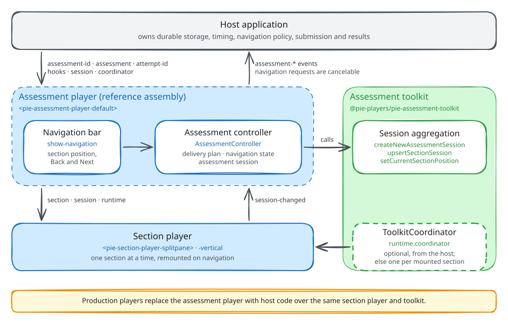
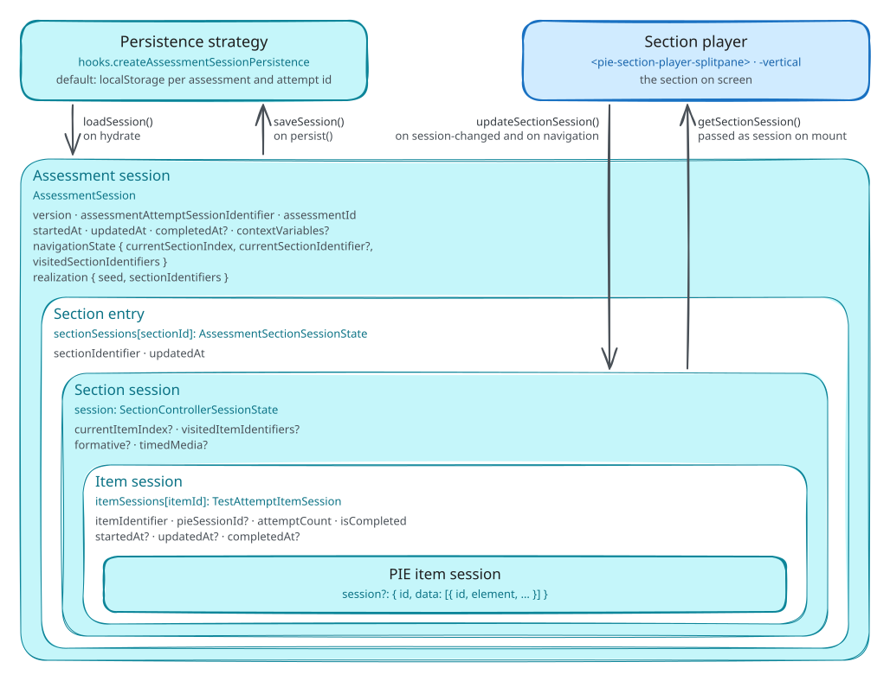
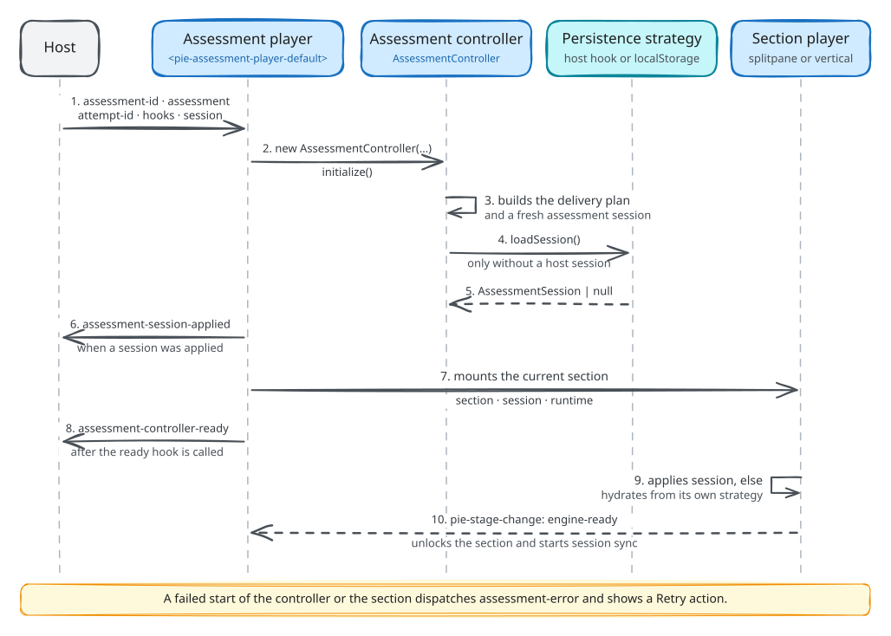
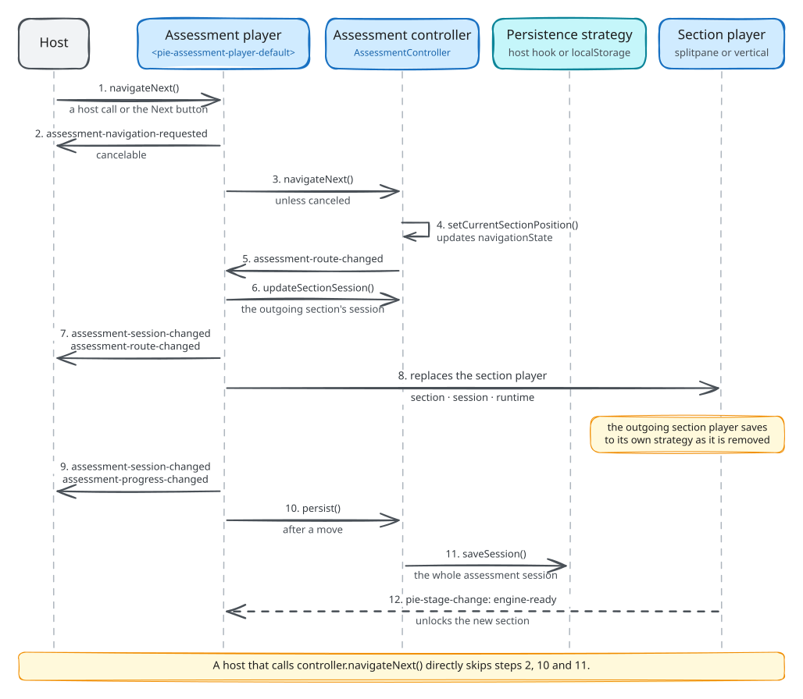

# Building a Multi-Section Player

A multi-section player runs an assessment's sections one at a time: it mounts a
section player for the current section, moves between sections and keeps the
attempt in one `AssessmentSession`. PIE supplies the parts: the section player
renders a section, and `@pie-players/pie-assessment-toolkit` supplies the
`ToolkitCoordinator` and three assessment-session helpers. The player that
assembles them is host-built, because PIE ships no backend, CMS or attempt
store and multi-section policy is product policy
([product scope](../architecture/architecture.md#product-scope)).

This guide is for teams building that player. It builds one from the toolkit
helpers, then uses `<pie-assessment-player-default>` from
`@pie-players/pie-assessment-player` as the worked example. That element is a
reference assembly with no production users: it serves prototypes and demos,
and it changes without a compatibility period. Its
[package README](../../packages/assessment-player/README.md) is the API
reference. The guide assumes custom elements, TypeScript and the
[section player integration guide](../section-player/integration-guide.md).

---

## The multi-section layer

A section is the rendering unit: one section fills one view, with its items,
passages, tools and accommodations composed together.


Delivery above one section needs routing between sections, an assessment-level
position and progress, a session that spans sections, submission, and the
host's policy over all of these. `<pie-item-player>` renders items and the
section player renders one section and runs its section controller; the
multi-section layer decides which section is mounted and aggregates the section
sessions. The toolkit's helpers do the aggregation. Routing, chrome and policy
are the host's.

## Host-owned policy

PIE owns runtime mechanics; the host owns product policy and the application
around the player: user profile and permissions, authentication, the app shell
and its routes, and workflow and compliance rules.

The mechanics PIE supplies are the assessment-session helpers, the section
controller, snapshots and selectors, hooks, and events around each transition.
Policies that vary by product stay with the host: timing, navigation gating,
review and revisit, stage progression, submission confirmation, URL
synchronization, and how telemetry and errors are presented. A host builds its
delivery workflow, time policy and navigation constraints on those mechanics.

## Layer model



| Layer | Owns |
| --- | --- |
| Multi-section player | Which section is mounted and when it changes; the `AssessmentSession` over the section sessions; the position and visited sections; assessment-level events |
| Section player | Section rendering; navigation between items; the section session and its item sessions, kept by the section controller |
| `ToolkitCoordinator` | Tools, accessibility settings, text-to-speech (TTS) and highlighting; section controller provisioning; the section persistence hook |
| Host application | Durable persistence; timing, workflow and business policy; authentication, profile and app shell; routing, submission and results |

One coordinator spans the assessment when the host passes the same instance to
every section player. A section player given none builds its own, without
hooks, and disposes it with the section, so tool state, TTS and section
persistence hooks do not carry across sections.

The player runs the mechanics and the host owns durable data and policy: persist
`getSession()`, never `getRuntimeState()`, and keep navigation decisions in host
policy.

## The assessment session

An `AssessmentSession` nests the other sessions: item sessions live in section
snapshots, and section snapshots live in `sectionSessions`.



```ts
interface AssessmentSession {
  version: 1;
  assessmentAttemptSessionIdentifier: string;
  assessmentId: string;
  startedAt: string;
  updatedAt: string;
  completedAt?: string;
  navigationState: {
    currentSectionIndex: number;
    visitedSectionIdentifiers: string[];
    currentSectionIdentifier?: string;
  };
  realization: {
    seed: string;
    sectionIdentifiers: string[];
  };
  sectionSessions: Record<string, {
    sectionIdentifier: string;
    updatedAt: string;
    // currentItemIndex, visitedItemIdentifiers, itemSessions, and formative
    // and timedMedia when the section uses them
    session: SectionControllerSessionState | null;
  }>;
  contextVariables?: Record<string, unknown>;
}
```

The toolkit exports three helpers over it. Each returns a new session and leaves
its argument unchanged.

| Helper | Effect |
| --- | --- |
| `createNewAssessmentSession({ assessmentAttemptSessionIdentifier, assessmentId, seed, sectionIdentifiers })` | A fresh session at the first section, which it marks visited; `realization` records the seed and section order |
| `upsertSectionSession(session, { sectionIdentifier, sectionSession })` | Writes one section's snapshot and stamps `updatedAt` on the entry and the session |
| `setCurrentSectionPosition(session, { currentSectionIndex, currentSectionIdentifier })` | Moves the position and adds the section to the visited list; `updatedAt` is unchanged |

## A player from the toolkit helpers

This player mounts a fresh section player per section, keeps the attempt in one
`AssessmentSession` and saves it after every move:

```ts
import "@pie-players/pie-section-player";
import {
  ToolkitCoordinator,
  createNewAssessmentSession,
  setCurrentSectionPosition,
  upsertSectionSession,
} from "@pie-players/pie-assessment-toolkit";
import type { AssessmentSession } from "@pie-players/pie-assessment-toolkit";
import type { SectionPlayerRuntimeHostContract } from "@pie-players/pie-section-player";

type SectionPlayerElement = HTMLElement & SectionPlayerRuntimeHostContract;

declare const sections: Array<{ identifier: string }>;
declare const container: HTMLElement;
declare function loadAttempt(attemptId: string): Promise<AssessmentSession | null>;
declare function saveAttempt(attemptId: string, session: AssessmentSession): Promise<void>;

const assessmentId = "algebra-unit-1";
const attemptId = "attempt-42";

// One coordinator for every section. Its section strategy stores nothing, so
// the assessment session is the one store.
const coordinator = new ToolkitCoordinator({
  assessmentId,
  hooks: {
    createSectionSessionPersistence: () => ({
      async loadSession() {
        return null;
      },
      async saveSession() {},
    }),
  },
});

let session: AssessmentSession;
let current: { element: SectionPlayerElement; sectionId: string; ready: boolean } | null = null;

function capture(): void {
  if (!current?.ready) return;
  const sectionSession = current.element.getSectionController()?.getSession?.() ?? null;
  session = upsertSectionSession(session, {
    sectionIdentifier: current.sectionId,
    sectionSession: structuredClone(sectionSession),
  });
}

function mount(index: number): void {
  const section = sections[index];
  session = setCurrentSectionPosition(session, {
    currentSectionIndex: index,
    currentSectionIdentifier: section.identifier,
  });
  const element = document.createElement("pie-section-player-splitpane") as SectionPlayerElement;
  const entry = { element, sectionId: section.identifier, ready: false };
  element.setAttribute("section-id", section.identifier);
  element.setAttribute("attempt-id", attemptId);
  element.section = section;
  const saved = session.sectionSessions[section.identifier]?.session;
  if (saved) element.session = structuredClone(saved);
  element.runtime = { assessmentId, coordinator, playerType: "iife" };
  element.addEventListener("pie-stage-change", (event) => {
    const { stage, status } = (event as CustomEvent).detail;
    if (event.target === element && stage === "engine-ready" && status !== "failed") {
      entry.ready = true;
    }
  });
  element.addEventListener("session-changed", () => {
    if (current === entry) capture();
  });
  current = entry;
  container.replaceChildren(element);
}

async function navigate(index: number): Promise<void> {
  // persist() commits responses an element has not yet reported.
  await current?.element.getSectionController()?.persist?.();
  capture();
  mount(index);
  await saveAttempt(attemptId, session);
}

async function start(): Promise<void> {
  session =
    (await loadAttempt(attemptId)) ??
    createNewAssessmentSession({
      assessmentAttemptSessionIdentifier: `${assessmentId}:${attemptId}`,
      assessmentId,
      seed: attemptId,
      sectionIdentifiers: sections.map((section) => section.identifier),
    });
  mount(session.navigationState.currentSectionIndex);
}
```

The steps follow these rules:

- **A fresh section player per section.** The outgoing player is replaced, and
  its controller is disposed with it.
- **Restore through `session`.** The saved snapshot is set before the element
  connects, and only when the assessment session holds one; the section
  controller applies it before `engine-ready`
  ([Session lifecycle](../../packages/section-player/README.md#session-lifecycle)).
  A section without a snapshot hydrates from the section strategy.
- **Capture only after `engine-ready`.** A section that failed to restore holds
  empty item sessions, and capturing them would overwrite the saved snapshot.
- **Capture on the toolkit's `session-changed`.** It follows every item session
  change the section controller records, and it bubbles from the section player.
- **Commit before leaving.** A delivery element coalesces its own
  `session-changed`, so the last response can still be pending when navigation
  starts. The section controller's `persist()` commits it first
  ([Commit at a section boundary](../../packages/section-player/README.md#commit-at-a-section-boundary)).
- **Save at the host's cadence.** This player saves after each move; a host that
  must not lose answers saves on `session-changed` as well.

## The reference player

`<pie-assessment-player-default>` builds on the same helpers and adds an
`AssessmentController` with a delivery plan, hooks, a persistence strategy and a
save queue, a cancelable navigation request, Back and Next chrome with focus
handling and announcements, and error states with Retry. The
[assessment demos](../../apps/assessment-demos/README.md) run it.

### Integration modes

The element constructs and owns its `AssessmentController` in both modes; they
differ in how the host drives it. In the custom-element-first mode the host sets
inputs and listens to DOM events:

```html
<pie-assessment-player-default
  assessment-id="assessment-001"
  attempt-id="attempt-abc"
  section-player-layout="splitpane"
></pie-assessment-player-default>
```

```ts
const playerEl = document.querySelector("pie-assessment-player-default");
playerEl.assessment = assessmentDefinition;
playerEl.hooks = hooks;
playerEl.env = { mode: "gather", role: "student" };
playerEl.addEventListener("assessment-controller-ready", (event) => {
  const { controller } = (event as CustomEvent).detail;
});
```

Inputs assigned in the same turn are batched, before or after connecting.
Changing `assessmentId`, `attemptId`, `assessment`, `hooks` or `session`
rebuilds the controller; assign a new object, since mutating one in place
signals nothing. The locale, navigation visibility and runtime inputs reach the
mounted section without a rebuild. The README's
[Inputs](../../packages/assessment-player/README.md#inputs) table covers each
one.

In the controller-first mode the host obtains the handle and drives navigation
and persistence through it:

```ts
const controller = await playerEl.waitForAssessmentController(5000);
if (!controller) throw new Error("Assessment controller not ready");

if (controller.getRuntimeState().canNext) {
  controller.navigateNext();
}
```

The handle is available once initialization and hydration succeed, and only the
newest connected initialization publishes one
([Obtaining the handle](../../packages/assessment-player/README.md#obtaining-the-handle)).
Navigation through the handle skips the element's cancelable
`assessment-navigation-requested` and its save after the move, so a host on
this path calls `persist()` itself. The controller-first mode suits a host
whose workflow, timing or routing policy is tied to wider application state.

### Coordinator and tools

Tools, TTS and accessibility settings are configured on a `ToolkitCoordinator`,
which the element passes to every section player it mounts:

```ts
import { ToolkitCoordinator } from "@pie-players/pie-assessment-toolkit";
import { createPackagedToolRegistry } from "@pie-players/pie-default-tool-loaders";

declare const playerEl: HTMLElement;

const toolRegistry = createPackagedToolRegistry();
const coordinator = new ToolkitCoordinator({
  assessmentId: "assessment-001",
  toolRegistry,
  tools: {
    placement: {
      section: ["theme", "graph", "periodicTable", "lineReader"],
      item: ["calculator", "textToSpeech", "annotationToolbar"],
      passage: ["textToSpeech", "annotationToolbar"],
    },
    providers: {
      textToSpeech: {
        backend: "server",
        serverProvider: "polly",
      },
      calculator: {
        provider: {
          runtime: {
            authFetcher: async () => {
              const response = await fetch("/api/tools/desmos/auth");
              return response.json();
            },
          },
        },
      },
    },
  },
});

playerEl.coordinator = coordinator;
```

The coordinator places the color-scheme tool (`theme`) with the other tools;
theme tokens come from `<pie-theme>` ([theme package README](../../packages/theme/README.md)).
Desmos is the default calculator, and a licensed deployment supplies its key
through `authFetcher`
([calculator with host auth](../tools-and-accomodations/tool_provider_system.md#calculator-with-host-auth)).
Desmos's documented browser integration puts the key in the script URL, so
runtime delivery keeps it out of the static bundle without making it secret.
Use a key whose Trial or Commercial Tier covers the deployment; see the
[Desmos API Terms](https://www.desmos.com/api-terms).

The same coordinator serves every section. On a section change the element
replaces the section player and stops TTS playback; the coordinator's
configuration and services carry over. Tool placement and providers are covered
in the section player guide's
[tool configuration](../section-player/integration-guide.md#5-tool-configuration),
and element loading in its
[content loading](../section-player/integration-guide.md#4-content-loading).

### Content and delivery plan

The `assessment` property takes an `AssessmentDefinition` whose sections sit in
`sections` or in `testParts[].sections`. The controller flattens them into a
linear delivery plan, which the `createAssessmentDeliveryPlan` hook replaces,
and navigates by index through it. The element maps `player-type`, the
coordinator, `env` and `sectionPlayerRuntime` into each section player's
`runtime` ([Section runtime](../../packages/assessment-player/README.md#section-runtime)).

```ts
const assessment = {
  identifier: "colonial-history-se-asia",
  title: "Colonial History in Southeast Asia",
  sections: [
    { identifier: "section-1" /* items, rubricBlocks */ },
    { identifier: "section-2" },
    { identifier: "section-3" },
  ],
};

playerEl.assessment = assessment;
```

### Observability

Item, section and assessment events reach one `InstrumentationProvider`, set on
`sectionPlayerRuntime.player.loaderConfig.instrumentationProvider`. Assign the
provider instance as a property:

```ts
import { ConsoleInstrumentationProvider } from "@pie-players/pie-players-shared";

declare const playerEl: HTMLElement;

const provider = new ConsoleInstrumentationProvider({ useColors: true });
await provider.initialize({ debug: true });

playerEl.sectionPlayerRuntime = {
  player: {
    loaderConfig: {
      trackPageActions: true,
      instrumentationProvider: provider,
      maxResourceRetries: 3,
      resourceRetryDelay: 500,
    },
  },
};
```

Each layer reports its own events: the element its `assessment-*` events, the
section player and toolkit theirs. The README's
[Instrumentation](../../packages/assessment-player/README.md#instrumentation)
lists the forwarded names.

### Hydration



On page load:

1. The host mounts the element and sets `assessment-id`, `attempt-id`,
   `assessment`, and `hooks`, `env`, `coordinator` and `session` as needed.
2. The element creates an `AssessmentController` and subscribes to it.
3. The controller builds the delivery plan, through `createAssessmentDeliveryPlan`
   or the default flattening, and a fresh session at the first section.
4. `hydrate()` awaits `onBeforeAssessmentHydrate`, then resolves the persistence
   strategy through `createAssessmentSessionPersistence`.
5. An assigned `session` replaces the fresh one; without one the controller
   calls `loadSession()` and applies what it returns.
6. When a session was assigned or loaded, the controller emits
   `assessment-session-applied`. A hydrate failure instead shows the error state
   with Retry and dispatches `assessment-error`.
7. The element publishes the controller and mounts the current section player
   with `section`, `runtime` and, when the assessment session holds the
   section's snapshot, `session`.
8. It calls `onAssessmentControllerReady`, without awaiting it, and dispatches
   `assessment-controller-ready`.
9. The section's controller applies the passed snapshot in place of hydrating;
   a section without one hydrates from the section strategy.
10. Until the section reaches `engine-ready`, for up to 5 seconds, the section is
    inert and its region `aria-busy`. The element then unlocks it and copies
    the section session into the assessment session on each `session-changed`.

### Navigation



When the learner presses Next, or the host calls the element's
`navigateNext()`:

1. The element dispatches the cancelable `assessment-navigation-requested`;
   a canceled request ends here.
2. It calls the controller's `navigateNext()`, which applies
   `setCurrentSectionPosition`.
3. The controller emits `assessment-route-changed`.
4. On that event the element copies the outgoing section's session into the
   assessment session through `updateSectionSession`, which emits
   `assessment-session-changed`.
5. It stops TTS playback and dispatches `assessment-route-changed` to the host.
6. It replaces the section player. The coordinator saves the outgoing section
   through the section strategy as it disposes its controller.
7. The controller emits `assessment-session-changed` for the position, then
   `assessment-progress-changed`.
8. The element calls `persist()`, and the strategy's `saveSession` stores the
   session.
9. The new section reaches `engine-ready` and unlocks, as in hydration.

A host therefore receives `assessment-session-changed`,
`assessment-route-changed`, `assessment-session-changed`, then
`assessment-progress-changed`. A call to the controller's own `navigateNext()`
runs steps 3 to 7 and 9, skipping the request and the save.

### Session persistence

`createAssessmentSessionPersistence` returns the strategy. It is called once per
controller, at the first hydrate or save, and cached:

```ts
import type { AssessmentPlayerHooks } from "@pie-players/pie-assessment-player";

declare const api: any;

const hooks: AssessmentPlayerHooks = {
  createAssessmentSessionPersistence({ assessmentId, attemptId }) {
    return {
      async loadSession() {
        return (await api.assessmentSessions.load({ assessmentId, attemptId })) ?? null;
      },
      async saveSession(_context, session) {
        await api.assessmentSessions.save({ assessmentId, attemptId, snapshot: session });
      },
      async clearSession() {
        await api.assessmentSessions.delete({ assessmentId, attemptId });
      },
    };
  },
};
```

`defaults.createDefaultPersistence()` returns the `localStorage` strategy under
`pie:assessment-controller:v1:{assessmentId}:{attemptId}`, which neither reads
nor writes without an attempt id. Production players supply a strategy backed
by their own store. The element saves after its own moves; a host that saves on
every change subscribes and skips a session it has already saved:

```ts
let lastFingerprint: string | null = null;

controller.subscribe((event) => {
  if (event.type !== "assessment-session-changed") return;
  const fingerprint = JSON.stringify(controller.getSession());
  if (fingerprint === lastFingerprint) return;
  lastFingerprint = fingerprint;
  void controller.persist();
});
```

Saves run in call order. `submit()` saves, then marks the assessment submitted
in memory only
([Session persistence and submission](../../packages/assessment-player/README.md#session-persistence-and-submission)).

A strategy can store the session as one document per attempt or normalize it.
The assessment demos' `session-hydrate-db` demo uses three SQLite tables:
`attempt_sessions` with the navigation state, `section_sessions` with one row
per section per attempt, and `item_sessions` with one row per item per attempt.
The strategy maps between those rows and the `AssessmentSession` aggregate.

### Layout and composition

The element mounts the current section in a splitpane or vertical section
player and renders a position label ("Section 2 of 3") with Back and Next,
disabled at the first and last section. With `show-navigation="false"` the host
renders its own chrome and calls the element's navigation methods; it then also
announces the section change, which the element announces only when focus was
inside it ([Navigation chrome](../../packages/assessment-player/README.md#navigation-chrome)).

`<pie-assessment-player-shell>` deletes the children a host gives it and cannot
compose custom chrome ([Shell element](../../packages/assessment-player/README.md#shell-element)).
A host that needs timers, progress bars or workflow buttons around the section
builds its player from the toolkit helpers, as above.

## Attempt reset

Most deployments manage attempts on the server: the host routes the learner to
a new attempt with a backend-issued `attemptId`, and the player mounts fresh.
Client-side reset serves demo and test apps, authoring previews, and proctoring
tools that end an attempt in progress without a page load. It coordinates the
controller with host state:

```ts
async function resetAssessmentAttempt(currentAttemptId: string) {
  // Save the final state, when the host keeps it.
  await playerEl.getAssessmentController()?.persist();

  // Clear the stored attempt.
  await api.assessmentSessions.delete({ assessmentId, attemptId: currentAttemptId });

  // A new attempt id rebuilds the controller with a fresh session.
  playerEl.attemptId = generateAttemptId();
}
```

A new `attemptId` is the clearest reset. Clear server-side storage too, since
clearing local state alone leaves the stored attempt behind, and implement
`clearSession()` on a custom strategy so reset flows can call it.

## Relationship to the section player

The multi-section player decides which section is active, owns the assessment
session over the section sessions, raises assessment-level events and hooks, and
mounts and replaces section players. The section player composes and renders the
section, owns the section session (`getSession()`, `applySession()`), coordinates
tools through the `ToolkitCoordinator`, and loads item elements and tracks their
readiness.

When the active section emits `session-changed`, the reference element writes the
section controller's `getSession()` into the assessment session through
`controller.updateSectionSession()`. On a return to a visited section it reads the
snapshot with `controller.getSectionSession()` and sets it as the new section
player's `session`, which the section controller applies in replace mode as it is
created.

The section layer persists as well unless the host turns it off. A section
mounted without a snapshot hydrates from the coordinator's section strategy, by
default `localStorage` under
`pie:section-controller:v1:{assessmentId}:{sectionId}:{attemptId}` and only with
an attempt id, and the coordinator saves the section there before disposing its
controller. To make the assessment controller the one persistence owner, pass a
coordinator whose `hooks.createSectionSessionPersistence` returns a strategy that
loads and saves nothing; a hook that returns no strategy gets the default.

The [section player integration guide](../section-player/integration-guide.md)
covers the section side.

## Guardrails

These hold for the reference player and for a custom player alike.

**One coordinator per assessment.** Pass one `ToolkitCoordinator` to every
section player. A section player given none builds its own per section, so tool
state, TTS and section persistence hooks reset at each section change.

**Gate on controller readiness.** Await `waitForAssessmentController()` rather
than polling, and never assume a controller right after mounting the element.

**Persist `getSession()`, never `getRuntimeState()`.** The runtime state holds
derived fields with no stability guarantee; the assessment session is the
persistence payload.

**Fingerprint before saving.** Skip a save whose session content matches the last
one, as in [Session persistence](#session-persistence).

**Gate navigation on the request event.** `assessment-navigation-requested` is the
only cancelable event, and it fires for the element's navigation methods and
buttons only. `assessment-route-changed` fires after the move, and navigation
through the controller handle sends no request.

**Scope subscriptions.** Call the function `subscribe()` returns when the host
route tears down.

**One persistence owner.** By default both layers persist under the attempt id:
the assessment controller under
`pie:assessment-controller:v1:{assessmentId}:{attemptId}`, and each section
controller in its own `localStorage` entry, which it hydrates from whenever the
assessment session holds no snapshot for that section. Two layers writing
independently race, and such a section comes back with whatever the section
strategy stored. The assessment session already aggregates the section sessions,
so give the coordinator a section strategy that stores nothing.

**The host owns `attemptId`.** A standalone deployment reflects it in the URL, so
a refresh or back navigation restores the same attempt. In an embedded
integration the outer layer that owns routing owns the attempt id and passes it
to the player.

**Dispose deliberately.** On route unmount, remove controller subscriptions and
save a final time when the host needs one.
