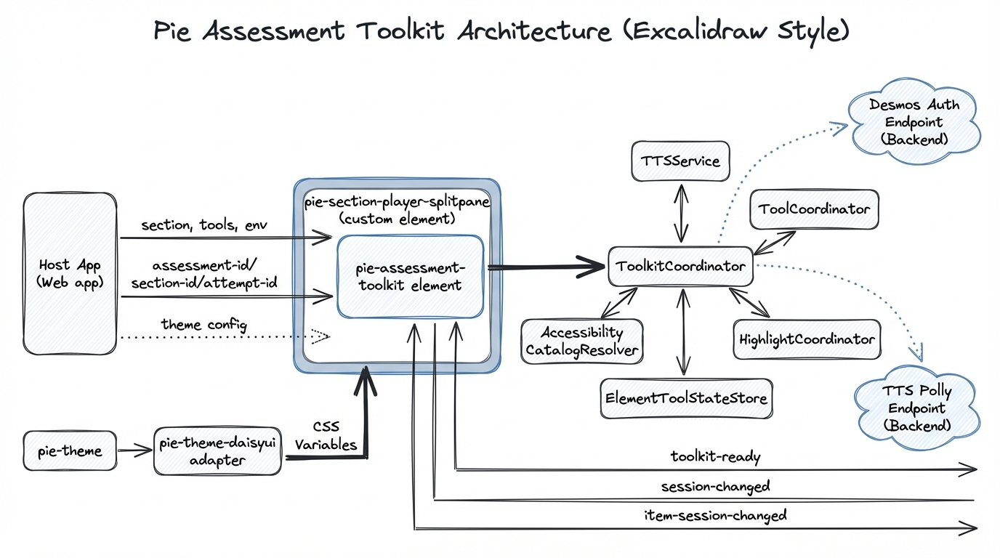

# Assessment Toolkit + Section Player: Getting Started

This guide is for engineers integrating `@pie-players/pie-assessment-toolkit` with `@pie-players/pie-section-player` using `pie-section-player-splitpane`.

## 1) Assessment Toolkit Overview

### What it gives you

- A single orchestration surface (`ToolkitCoordinator`) for tools and runtime services.
- Centralized tool configuration (`policy`, `placement`, `providers`).
- Section-level and content-level tool support (for example calculator vs. answer eliminator).
- Shared runtime services:
  - `TTSService`
  - `ToolCoordinator`
  - `HighlightCoordinator`
  - `ElementToolStateStore`
  - `AccessibilityCatalogResolver`
- Event-driven host integration (toolkit readiness + session changes).

### Architecture (brief)



At runtime, your host app passes section content + runtime config to `pie-section-player-splitpane`, which delegates orchestration to `pie-assessment-toolkit` and `ToolkitCoordinator`. The coordinator manages tool services and optional backend hooks (Desmos auth, Polly TTS), while emitting session events back to the host.

---

## 2) Use a Section Player (`pie-section-player-splitpane`)

### Data layout

The splitpane expects a QTI-aligned `AssessmentSection` object with:

- `identifier`, `title`, optional metadata
- `rubricBlocks` (often where passages/stimuli live)
- `assessmentItemRefs` (items/questions to render)
- optional per-item settings via `assessmentItemRefs[].settings`

Minimal shape:

```ts
const section = {
  identifier: "section-1",
  title: "Reading Section",
  keepTogether: true,
  rubricBlocks: [
    {
      identifier: "passage-1",
      class: "stimulus",
      passage: {
        id: "passage-1",
        config: {
          markup: "<div>Passage content...</div>",
          elements: {},
          models: []
        }
      }
    }
  ],
  assessmentItemRefs: [
    {
      identifier: "item-1",
      item: {
        id: "item-1",
        config: {
          markup: "<multiple-choice id='q1'></multiple-choice>",
          elements: {
            "multiple-choice": "@pie-element/multiple-choice@latest"
          },
          models: [{ id: "q1", element: "multiple-choice", prompt: "..." }]
        }
      }
    }
  ]
};
```

### Setting up toolkit + splitpane

Import the custom element registration entrypoint and set complex values as JS properties.

```ts
import "@pie-players/pie-section-player/components/section-player-splitpane-element";
```

### Runtime package expectations

`@pie-players/pie-section-player` no longer hard-bundles optional tool custom elements.
Install the tool packages you actually enable in `tools.placement` / `tools.providers`.

Import policy in this stack:

- Core framework modules (`pie-assessment-toolkit`, `pie-section-player`, `pie-item-player`) are loaded statically.
- Optional modules (tool elements and optional provider backends such as server TTS/Desmos provider) are loaded dynamically by toolkit/provider wiring.
- Hosts install optional modules explicitly based on enabled tools/backends, so unused features are not forced into every integration.

Minimal host dependencies for calculator + TTS support:

```ts
// Core orchestration + section renderer
"@pie-players/pie-assessment-toolkit"
"@pie-players/pie-section-player"

// Optional tools used by this host
"@pie-players/pie-tool-calculator-desmos"
"@pie-players/pie-tool-text-to-speech"
```

For Polly-backed TTS, keep server-side synthesis in your host backend (for example with `@pie-api-aws/polly`) and point toolkit TTS provider config to your API endpoint.

```html
<pie-section-player-splitpane id="player"></pie-section-player-splitpane>
```

```ts
const player = document.getElementById("player");

player.setAttribute("assessment-id", "assessment-2026");
player.setAttribute("section-id", "section-1");
player.setAttribute("attempt-id", "attempt-abc123");
player.setAttribute("player-type", "esm");
player.setAttribute("toolbar-position", "right");
player.setAttribute("show-toolbar", "true");

player.section = section;
player.env = { mode: "gather", role: "student" };
player.tools = {
  placement: {
    section: ["theme", "graph", "periodicTable", "protractor", "lineReader", "ruler"],
    item: ["calculator", "textToSpeech", "answerEliminator"],
    passage: ["textToSpeech"]
  },
  providers: {
    calculator: {
      authFetcher: async () => {
        const res = await fetch("/api/tools/desmos/auth");
        if (!res.ok) throw new Error(`Desmos auth failed: ${res.status}`);
        const payload = await res.json();
        return payload?.apiKey ? { apiKey: payload.apiKey } : {};
      }
    },
    tts: {
      enabled: true,
      backend: "browser" // or "polly"
    }
  }
};
```

### Working with section sessions and player events

Use toolkit/player events to synchronize host persistence and analytics.

```ts
const player = document.getElementById("player");

player.addEventListener("toolkit-ready", (e) => {
  const { coordinator, runtimeId, sectionId } = e.detail;
  console.log("Toolkit ready:", { runtimeId, sectionId, coordinator });
});

player.addEventListener("session-changed", (e) => {
  // Aggregated/normalized session update from toolkit runtime
  // Persist to backend, debounce, or checkpoint based on your policy
  queueSessionPatch(e.detail);
});

// Item-level session updates are emitted as item-session-changed
player.addEventListener("item-session-changed", (e) => {
  const { itemId, canonicalItemId, session } = e.detail;
  console.log("Item session changed:", { itemId, canonicalItemId, session });
});
```

Recommended persistence model:

- Host owns backend I/O.
- Use `session-changed` as canonical persistence trigger.
- Optionally listen to `item-session-changed` for fine-grained telemetry.

---

## 3) Configuring and Customizing

### Tool availability

Use `tools.placement` for location and scope, and `tools.policy` for allow/block gates.

#### Section level

Use for global, persistent tools across item navigation:

```ts
tools: {
  placement: {
    section: ["theme", "graph", "periodicTable", "ruler"]
  }
}
```

#### Content level

Use for context-bound tools:

```ts
tools: {
  placement: {
    item: ["calculator", "textToSpeech", "answerEliminator"],
    passage: ["textToSpeech"]
  }
}
```

Optional policy gates:

```ts
tools: {
  policy: {
    allowed: ["calculator", "textToSpeech", "answerEliminator", "theme"],
    blocked: ["graph"]
  }
}
```

### Backend hooks (Desmos + TTS Polly)

#### Desmos

- Configure `providers.calculator.provider = "desmos"`.
- Provide `authFetcher` that returns runtime auth payload (typically API key or tokenized payload from your backend).
- Keep secrets server-side; do not hardcode production keys in frontend bundles.

#### Polly (server TTS)

- Set `providers.tts.backend = "polly"`.
- Implement host/backend endpoint(s) that your TTS layer calls for synthesis.
- Keep AWS credentials in server environment only.
- Start with browser TTS locally, then switch to Polly in integration/staging.

### Theming support

#### Theme tool

- Include `theme` in section-level tools to expose runtime theme controls.
- Wrap player with `pie-theme` to establish `--pie-*` variables.

```ts
import "@pie-players/pie-theme";
import "@pie-players/pie-theme/tokens.css";
import "@pie-players/pie-theme/color-schemes.css";
import "@pie-players/pie-theme/font-sizes.css";
```

```html
<pie-theme scope="document" theme="auto" scheme="default">
  <pie-section-player-splitpane id="player"></pie-section-player-splitpane>
</pie-theme>
```

#### Adapters (DaisyUI)

If your app uses DaisyUI tokens, add the bridge adapter:

```ts
import "@pie-players/pie-theme-daisyui/bridge.css";
// Optional explicit registration:
// import { registerDaisyThemeProvider } from "@pie-players/pie-theme-daisyui";
// registerDaisyThemeProvider();
```

This maps DaisyUI tokens into PIE `--pie-*` variables so section player/tools inherit your app theme consistently.

---

## Practical Next Steps

1. Wire `pie-section-player-splitpane` with `section`, `tools`, and `env`.
2. Add host listeners for `toolkit-ready` and `session-changed`.
3. Add Desmos `authFetcher` + TTS backend strategy (browser first, Polly later).
4. Wrap with `pie-theme`, then layer DaisyUI bridge if needed.
