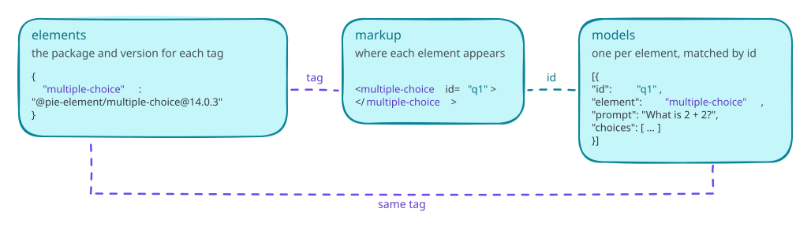

# Getting started

PIE players render assessment content in a web page. The content is PIE items: HTML markup plus a model for each interaction, where each interaction is a PIE element such as multiple choice or an extended text response. The elements come from [pie-elements-ng](https://github.com/pie-framework/pie-elements-ng); the players, the assessment toolkit and the tools come from this repository. Every player is a custom element and bundles its own runtime, so the host page needs no framework.

This page renders one item, saves the learner's response and scores it. [Architecture](architecture/architecture.md) shows how the pieces fit together.

## Install

```bash
npm install @pie-players/pie-item-player
```

```ts
import "@pie-players/pie-item-player";
```

The import registers `<pie-item-player>`. A page without a build step loads the same entry from a CDN as a module script:

```html
<script
  type="module"
  src="https://cdn.jsdelivr.net/npm/@pie-players/pie-item-player@x.y.z/dist/pie-item-player.js"
></script>
```

The `@pie-players/*` packages release together under one version number, written `x.y.z` in these docs. Pin it exactly: a `0.x` release can break, and a range or `@latest` URL changes the page without a deploy ([versioning](install/versioning.md#pinning)). [Packages and entry points](install/packages.md) lists the other packages.

## Render an item

```html
<pie-item-player id="player"></pie-item-player>

<script type="module">
  const player = document.getElementById("player");

  player.config = {
    elements: { "multiple-choice": "@pie-element/multiple-choice@14.0.3" },
    models: [
      {
        id: "q1",
        element: "multiple-choice",
        prompt: "Which city is the capital of France?",
        choiceMode: "radio",
        choices: [
          { label: "Paris", value: "paris", correct: true },
          { label: "London", value: "london" },
          { label: "Madrid", value: "madrid" },
        ],
      },
    ],
    markup: '<multiple-choice id="q1"></multiple-choice>',
  };
  player.env = { mode: "gather", role: "student" };
  player.session = { id: "session-1", data: [] };
</script>
```



The item config has three parts that refer to each other:

- `elements` maps each tag in the markup to an exact element package version. The player loads that version and registers it under a versioned tag, so two versions of one element can share a page.
- `models` holds one model per interaction. A model's `element` names its tag, and its `id` matches the `id` of its tag in the markup.
- `markup` is the item's HTML, with one element tag per model.

`env.mode` sets what the learner sees: `gather` takes responses, `view` shows them read-only, and `evaluate` marks them. `env.role` is `student` or `instructor`. The default is `{ mode: "gather", role: "student" }`. Neither setting is a security boundary; see [answer keys](#answer-keys).

`config`, `env` and `session` are properties. Set as attributes, they take JSON.

## Save the response

```js
player.addEventListener("session-changed", (event) => {
  const { session } = event.detail;
  if (session) saveSession(session);
});
```

`event.detail.session` is the whole item session: `{ id, data }`, with one `data` entry per element. Store it as it is, and assign it back to `player.session` to resume the attempt. The detail also names the element that changed (`component`) and whether it counts as answered (`complete`). A change to metadata alone carries `session: null`.

## Score

```js
const results = await player.provideScore();
```

`provideScore()` runs each element's scoring controller in the browser and returns one result per scored model, or `false` when the item has no models. [Scoring and rubrics](item-player/scoring-and-rubrics.md) covers partial credit, rubrics and server-side scoring.

## Answer keys

By default the full model reaches the browser, answer key included, and scoring runs there. That suits practice and formative use. Graded delivery needs three things together: hosted mode, models stripped of answer keys on the server, and outcomes computed by the host's backend. [Security](security/readme.md) sets out the model.

## Loading strategies

The `strategy` attribute sets where the player gets element code. The default, `iife`, loads pre-built bundles of any published element version from the PIE bundle host; `esm` loads the browser builds pie-elements-ng publishes from a CDN; `preloaded` uses elements the host bundled itself. [Loading strategies](item-player/loading-strategies.md) compares the three.

## Next steps

- A passage and its items in one layout, with tools and a saved section session: [a section with tools](getting-started-section.md), then the [section player integration guide](section-player/integration-guide.md).
- Calculators, text-to-speech, the line reader and other tools: the [assessment toolkit](../packages/assessment-toolkit/README.md), and [tools and accommodations](tools-and-accomodations/architecture.md) for which tools each learner receives.
- Colors, fonts and dark mode: [theming](theming/how-theming-works.md).
- Authoring: `mode="author"` on the same player renders each element's configuration UI and emits `model-updated` as the author edits; see [authoring configuration](../packages/item-player/README.md#authoring-configuration).
- Moving from `@pie-framework/pie-player-components`: the [migration guide](item-player/migration-from-pie-player-components.md).
