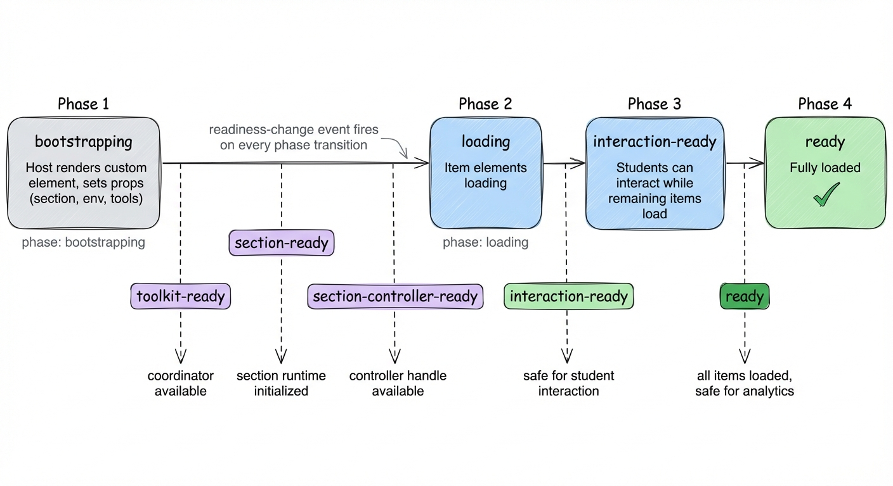
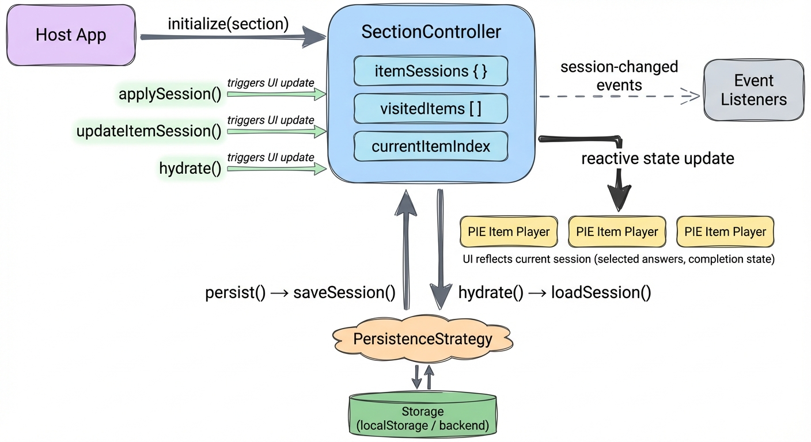
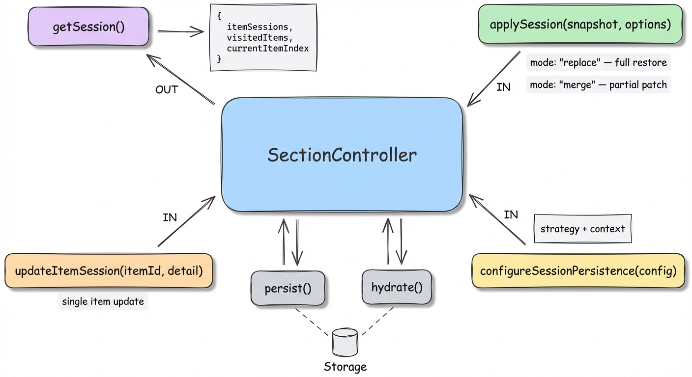
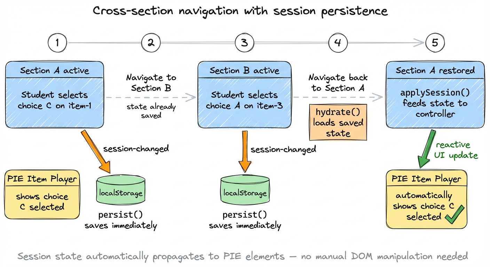

# Section Player Integration Guide

<!-- markdownlint-disable MD031 MD032 MD040 MD060 -->

A comprehensive guide for developers integrating the PIE section player into a host application. Covers installation, configuration, tools (TTS, calculator), the section controller, events, and state management.

For a quick-start walkthrough with data layout and theming, see [assessment-toolkit-section-player-getting-started.md](./assessment-toolkit-section-player-getting-started.md).

---

## Table of Contents

1. [Overview](#overview)
2. [Installation](#installation)
3. [Custom Elements](#custom-elements)
4. [Basic Setup](#basic-setup)
5. [Section Data Shape](#section-data-shape)
6. [Runtime Configuration](#runtime-configuration)
7. [Tool Configuration](#tool-configuration)
   - [Tool Placement and Policy](#tool-placement-and-policy)
   - [TTS (Text-to-Speech)](#tts-text-to-speech)
   - [Calculator (Desmos)](#calculator-desmos)
   - [Theme (Color Scheme and Accessibility)](#theme-color-scheme-and-accessibility)
   - [Other Tools](#other-tools)
8. [The Section Controller](#the-section-controller)
   - [What It Is](#what-it-is)
   - [Obtaining a Controller Handle](#obtaining-a-controller-handle)
   - [Subscribing to Events](#subscribing-to-events)
   - [Controller Event Types](#controller-event-types)
   - [Pulling State](#pulling-state)
9. [Custom Element Events](#custom-element-events)
10. [Readiness Lifecycle](#readiness-lifecycle)
11. [Navigation](#navigation)
12. [Multi-Section Assessments](#multi-section-assessments)
13. [Session Persistence](#session-persistence)
14. [Lifecycle Hooks](#lifecycle-hooks)
15. [Angular Integration Example](#angular-integration-example)
16. [SvelteKit Integration Example](#sveltekit-integration-example)
17. [Vanilla JS / Framework-Agnostic Example](#vanilla-js--framework-agnostic-example)
18. [CSS / Layout Requirements](#css--layout-requirements)
19. [Troubleshooting](#troubleshooting)

---

## Overview

The PIE section player renders a QTI-inspired assessment section (passages + items) inside a web component. It orchestrates item rendering, tool services (TTS, calculators, highlighters, etc.), and session state through a central `ToolkitCoordinator` and per-section `SectionController`.

**Architecture at a glance:**

```
Host Application
  └─ <pie-section-player-splitpane>        ← custom element
       └─ pie-assessment-toolkit           ← orchestrates coordinator + controller
            ├─ ToolkitCoordinator           ← tool services, TTS, provider registry
            └─ SectionController            ← section state, session, events
                 └─ ItemShell → pie-item-player  ← renders individual items
```

The host app:
- Provides section content and configuration
- Listens for events (session changes, readiness, errors)
- Optionally pulls state snapshots from the controller
- Owns backend persistence (the framework does not auto-save to a server)

---

## Installation

Core packages:

```bash
npm install @pie-players/pie-assessment-toolkit @pie-players/pie-section-player
```

Optional tool packages (install only the tools you enable):

```bash
# Calculator (Desmos-powered)
npm install @pie-players/pie-tool-calculator-desmos @pie-players/pie-calculator-desmos

# Text-to-Speech
npm install @pie-players/pie-tool-text-to-speech

# Theming
npm install @pie-players/pie-theme

# DaisyUI theme bridge (if your app uses DaisyUI)
npm install @pie-players/pie-theme-daisyui

# Debug tools (development only)
npm install @pie-players/pie-section-player-tools-event-debugger
npm install @pie-players/pie-section-player-tools-session-debugger
```

---

## Custom Elements

Register the custom element you want in your application entry point:

```ts
// Split-pane layout (passage left, item right)
import '@pie-players/pie-section-player/components/section-player-splitpane-element';

// Vertical stacked layout
import '@pie-players/pie-section-player/components/section-player-vertical-element';
```

Both elements expose the same props, events, and JS API.

---

## Basic Setup

### HTML

```html
<pie-section-player-splitpane
  assessment-id="my-assessment"
  section-id="section-1"
  attempt-id="attempt-abc"
  player-type="iife"
  show-toolbar="true"
  toolbar-position="right"
></pie-section-player-splitpane>
```

### JavaScript

Set complex values as JS properties (not attributes):

```ts
const player = document.querySelector('pie-section-player-splitpane');

player.section = assessmentSectionObject;

player.env = {
  mode: 'gather',    // host/runtime mode string (default is gather)
  role: 'student'    // host/runtime role string (default is student)
};

player.tools = {
  placement: {
    section: ['theme'],
    item: ['calculator', 'textToSpeech'],
    passage: ['textToSpeech']
  },
  providers: {
    calculator: {
      provider: {
        runtime: {
          authFetcher: async () => {
            const res = await fetch('/api/tools/desmos/auth');
            return res.json();
          }
        }
      }
    },
    tts: { enabled: true, backend: 'browser' }
  }
};
```

---

## Section Data Shape

The `section` property accepts an `AssessmentSection` object. This is the data contract your backend must produce.

### AssessmentSection

| Field | Required | Description |
|---|---|---|
| `identifier` | **Yes** | Unique section identifier (used for session keys and navigation) |
| `title` | No | Display title |
| `keepTogether` | No | `true` = page mode (all items visible at once), `false` or omitted = item-by-item navigation |
| `assessmentItemRefs` | No | Array of item references (defaults to `[]`) |
| `rubricBlocks` | No | Passages, instructions, and rubrics (defaults to `[]`) |

### AssessmentItemRef (each item in the section)

| Field | Required | Description |
|---|---|---|
| `identifier` | **Yes** | Unique item identifier within the section |
| `item` | **Yes** (to render) | Resolved `ItemEntity` with its PIE config — refs without `item` are skipped |
| `title` | No | Display title |
| `required` | No | Whether the item is required |
| `settings` | No | Item-level tool settings |

### ItemEntity / PassageEntity

Both items and passages carry a `config` object with the PIE rendering payload:

| Field | Required | Description |
|---|---|---|
| `config.markup` | **Yes** | HTML markup with PIE element tags (e.g. `<multiple-choice id="q1">`) |
| `config.elements` | **Yes** | Map of element tag names to PIE element packages |
| `config.models` | **Yes** | Array of model objects that configure each element |
| `id` | No | Entity identifier (synthesized if missing) |
| `name` | No | Human-readable name |

### RubricBlock (passages and instructions)

| Field | Required | Description |
|---|---|---|
| `view` | **Yes** | Must match the player view — typically `"candidate"` for student-facing content |
| `class` | No | `"stimulus"` for passages, `"instructions"` for instructions, `"rubric"` for rubrics |
| `passage` | No | `PassageEntity` with a PIE config (for rich passage content) |
| `content` | No | Simple HTML string (alternative to `passage`) |
| `identifier` | No | Block identifier |

### Minimal example: one item

```ts
player.section = {
  identifier: 'section-1',
  assessmentItemRefs: [
    {
      identifier: 'item-1',
      item: {
        id: 'item-1',
        config: {
          markup: '<multiple-choice id="q1"></multiple-choice>',
          elements: {
            'multiple-choice': '@pie-element/multiple-choice@latest',
          },
          models: [
            {
              id: 'q1',
              element: 'multiple-choice',
              prompt: 'Which planet is closest to the Sun?',
              choiceMode: 'radio',
              choices: [
                { label: 'Mercury', value: 'A' },
                { label: 'Venus', value: 'B' },
                { label: 'Earth', value: 'C' },
              ],
            },
          ],
        },
      },
    },
  ],
};
```

### Example with passage and item

```ts
player.section = {
  identifier: 'reading-section',
  title: 'Reading Comprehension',
  keepTogether: true,
  rubricBlocks: [
    {
      identifier: 'passage-1',
      view: 'candidate',
      class: 'stimulus',
      passage: {
        id: 'passage-1',
        name: 'The Water Cycle',
        config: {
          markup: '<div class="passage-content"><h2>The Water Cycle</h2><p>Water evaporates...</p></div>',
          elements: {},
          models: [],
        },
      },
    },
  ],
  assessmentItemRefs: [
    {
      identifier: 'item-1',
      item: {
        id: 'item-1',
        config: {
          markup: '<multiple-choice id="q1"></multiple-choice>',
          elements: { 'multiple-choice': '@pie-element/multiple-choice@latest' },
          models: [{ id: 'q1', element: 'multiple-choice', prompt: '...' }],
        },
      },
    },
  ],
};
```

For a full walkthrough of data layout, see the [getting-started guide](./assessment-toolkit-section-player-getting-started.md).

---

## Runtime Configuration

All configuration can be passed as individual props **or** bundled into a single `runtime` object. When `runtime` is set, its fields take precedence over individual props.

### Individual props

| Attribute / Property | Type | Description |
|---|---|---|
| `assessment-id` | `string` | Assessment identifier (scopes tool state) |
| `section-id` | `string` | Section identifier |
| `attempt-id` | `string` | Attempt identifier (optional, enables multi-attempt isolation) |
| `section` | `object` | `AssessmentSection` payload (JS property) |
| `env` | `object` | `{ mode, role }` — controls rendering behavior (JS property, see below) |
| `tools` | `object` | Tool config (JS property, see below) |
| `player-type` | `string` | `"iife"` (default), `"esm"`, or `"preloaded"` |
| `lazy-init` | `boolean` | Defer async service init until needed (default `true`) |
| `show-toolbar` | `boolean \| string` | Boolean-like value (`true/false/1/0/on/off/yes/no`) |
| `toolbar-position` | `string` | `"top"`, `"right"`, `"bottom"`, `"left"`, `"none"` |
| `enabled-tools` | `string` | Comma-separated section-level tool IDs |
| `item-toolbar-tools` | `string` | Comma-separated item-level tool IDs |
| `passage-toolbar-tools` | `string` | Comma-separated passage-level tool IDs |
| `coordinator` | `object` | Pre-created `ToolkitCoordinator` (advanced, JS property) |
| `isolation` | `string` | `"inherit"` (default) or `"force"` |

### Bundled `runtime` object

```ts
player.runtime = {
  assessmentId: 'my-assessment',
  playerType: 'iife',
  lazyInit: true,
  tools: { /* ... */ },
  accessibility: { catalogs: [], language: 'en-US' },
  env: { mode: 'gather', role: 'student' },
};
```

### Environment: mode and role

The `env` object controls how items are rendered and what features are available.

**`mode`** — determines the rendering mode for item players:

| Value | Description |
|---|---|
| `"gather"` | Default. Student answers items interactively. |
| `"view"` | Read-only review of submitted answers. |
| `"evaluate"` | Scored view showing correctness feedback. |
| `"browse"` | Browse-only preview (no session changes recorded). |
| `"author"` | Authoring mode (switches to authoring-specific UI). |

**`role`** — determines the viewer's role:

| Value | Description |
|---|---|
| `"student"` | Default. Standard student/candidate view. |
| `"instructor"` | Enables correct response display and switches to scorer view. |

**Behavioral effects:**

- `mode` + `role` determine the section view: `"candidate"` (student), `"scorer"` (instructor), or `"author"`.
- `mode === "author"` switches item players to their authoring view.
- `role === "instructor"` resolves the section view to `"scorer"`, which individual PIE element controllers may use to enable correct response display.
- `mode === "evaluate"` enables scored feedback UI on items.

```ts
// Student taking a test (default)
player.env = { mode: 'gather', role: 'student' };

// Teacher reviewing student answers with correct responses shown
player.env = { mode: 'view', role: 'instructor' };

// Scored review
player.env = { mode: 'evaluate', role: 'student' };
```

---

## Tool Configuration

### Tool Placement and Policy

Tools are organized by **placement level** and gated by **policy**:

```ts
tools: {
  // Where tools appear
  placement: {
    section: ['theme', 'graph', 'periodicTable', 'protractor', 'lineReader', 'ruler'],
    item: ['calculator', 'textToSpeech', 'answerEliminator', 'annotationToolbar'],
    passage: ['textToSpeech', 'annotationToolbar']
  },

  // Optional allow/block gates
  policy: {
    allowed: [],   // empty = all placement tools allowed
    blocked: []    // always removes listed tools
  },

  // Per-tool provider configuration
  providers: { /* ... */ }
}
```

**Resolution rules:**
- If `policy.allowed` is empty, all tools listed in `placement` are available.
- If `policy.allowed` is set, only placement tools also in `allowed` are used.
- `policy.blocked` always removes tools, regardless of other settings.

### Available Tool IDs

| Tool ID | Placement | Description |
|---|---|---|
| `calculator` | item | Desmos calculator (basic/scientific/graphing) |
| `textToSpeech` | section, item, passage | Text-to-speech read-aloud |
| `graph` | section | Graphing tool |
| `answerEliminator` | item | Strike through answer choices |
| `annotationToolbar` | item, passage | Highlighting and annotation |
| `lineReader` | passage | Reading mask / guide |
| `theme` | section | Color scheme and font size controls |
| `periodicTable` | section | Chemistry periodic table reference |
| `ruler` | item | On-screen ruler |
| `protractor` | item | On-screen protractor |

Aliases: `tts` → `textToSpeech`, `colorScheme` → `theme`.

### TTS (Text-to-Speech)

```ts
providers: {
  tts: {
    enabled: true,

    // Backend strategy
    backend: 'browser',     // 'browser' | 'polly' | 'google' | 'server'

    // Voice / speech settings
    defaultVoice: 'en-US',
    rate: 1.0,              // 0.25–4.0
    pitch: 1.0,             // 0–2

    // Server-backed TTS (Polly/Google)
    provider: 'polly',          // server-side provider
    engine: 'neural',           // 'standard' | 'neural' (Polly)
    apiEndpoint: '/api/tts/synthesize',
    language: 'en-US',

    // Auth for server providers
    provider: {
      runtime: {
        authFetcher: async () => {
          const res = await fetch('/api/tools/tts/credentials');
          return res.json();
        }
      }
    }
  }
}
```

**Recommended approach:**
- Start with `backend: 'browser'` for development (zero setup, uses Web Speech API).
- Switch to `'polly'` or `'google'` in staging/production for higher quality voices.
- Keep AWS/Google credentials server-side; expose only a token endpoint via `authFetcher` or `apiEndpoint`.

### Calculator (Desmos)

```ts
providers: {
  calculator: {
    enabled: true,
    provider: {
      runtime: {
        authFetcher: async () => {
          const res = await fetch('/api/tools/desmos/auth');
          if (!res.ok) throw new Error(`Desmos auth failed: ${res.status}`);
          return res.json(); // { apiKey: '...' }
        }
      }
    }
  }
}
```

Your backend endpoint should return a JSON object with the Desmos API key:

```ts
// Express example
app.get('/api/tools/desmos/auth', (req, res) => {
  res.json({ apiKey: process.env.DESMOS_API_KEY });
});
```

**Security:** Never embed API keys in frontend bundles. Use `authFetcher` to fetch keys from your backend at runtime. For development, a direct `apiKey` field exists but must not be used in production.

If no `authFetcher` is provided, the toolkit attempts `GET /api/tools/desmos/auth` by default.

### Theme (Color Scheme and Accessibility)

The theme tool provides an accessibility-focused color scheme picker (WCAG 2.1 Level AA) and font size scaling.

**Host setup:** Wrap the section player with a `<pie-theme>` element and import the theme CSS:

```ts
import '@pie-players/pie-theme';
import '@pie-players/pie-theme/tokens.css';
import '@pie-players/pie-theme/color-schemes.css';
import '@pie-players/pie-theme/font-sizes.css';
```

```html
<pie-theme scope="document" theme="auto" scheme="default">
  <pie-section-player-splitpane ...></pie-section-player-splitpane>
</pie-theme>
```

The `<pie-theme>` element resolves `--pie-*` CSS custom properties in order: base theme (`"light"`, `"dark"`, `"auto"`), provider adapter, selected scheme, then explicit `variables` overrides.

**Built-in color schemes:** Black on White, White on Black, Rose on Green, Yellow on Blue, and other high-contrast options. The student selects a scheme from the tool dropdown; the selection persists in `localStorage`.

**Font size scaling:** Set the `data-font-size` attribute on any ancestor element (e.g. `<pie-theme>`, the document root, or a wrapper div) to `"normal"`, `"large"`, `"xlarge"`, or `"xxlarge"`. The theme CSS uses `[data-font-size]` selectors to adjust `--pie-font-scale` (1, 1.25, 1.5, 1.75).

**Custom color schemes:**

```ts
import { registerPieColorSchemes } from '@pie-players/pie-theme';

registerPieColorSchemes([
  {
    id: 'corporate-dark',
    name: 'Corporate Dark',
    variables: {
      '--pie-background': '#1a1a2e',
      '--pie-text': '#e0e0e0',
      '--pie-primary': '#0f3460',
    },
  },
]);
```

**DaisyUI bridge:** If your host app uses DaisyUI, install `@pie-players/pie-theme-daisyui` to automatically map DaisyUI tokens to `--pie-*` variables.

**Key CSS custom properties:** `--pie-text`, `--pie-background`, `--pie-primary`, `--pie-border`, `--pie-correct`, `--pie-incorrect`, `--pie-font-scale`, and many more. See the `tokens.css` file for the full list.

### Other Tools

Most other tools (annotation toolbar, answer eliminator, line reader, ruler, protractor) work out of the box with just placement configuration — no provider config needed. Simply include them in the relevant `placement` array and install any required packages.

---

## The Section Controller

### What It Is

The `SectionController` is the authoritative owner of section-level state: item navigation, session data (student answers), completion tracking, and loading lifecycle. It is the **primary API surface** for host applications that need to react to student interactions or query section state.

Each section + attempt combination gets its own controller instance, managed by the `ToolkitCoordinator`.

### Obtaining a Controller Handle

There are three ways to get a `SectionControllerHandle`:

#### 1. From the custom element (recommended for most hosts)

```ts
const player = document.querySelector('pie-section-player-splitpane');

// Async — waits up to 5 seconds for the controller to be ready
const controller = await player.waitForSectionController(5000);

// Sync — returns null if not ready yet
const controller = player.getSectionController();
```

#### 2. From the `section-controller-ready` event

```ts
player.addEventListener('section-controller-ready', (e) => {
  const { sectionId, attemptId, controller } = e.detail;
  // controller is ready to use
});
```

#### 3. From the `ToolkitCoordinator` (when you capture it from `toolkit-ready`)

```ts
player.addEventListener('toolkit-ready', (e) => {
  const coordinator = e.detail.coordinator;

  const controller = coordinator.getSectionController({
    sectionId: 'section-1',
    attemptId: 'attempt-abc'
  });
});
```

### Subscribing to Events

The controller emits a typed event stream for all state changes. There are two subscription mechanisms:

#### Direct controller subscription

```ts
const controller = await player.waitForSectionController(5000);

const unsubscribe = controller.subscribe((event) => {
  switch (event.type) {
    case 'item-session-data-changed':
      // Student provided or changed an answer
      console.log('Answer changed:', event.itemId, event.session);
      persistAnswer(event.canonicalItemId, event.session);
      break;

    case 'item-complete-changed':
      console.log('Item completion:', event.itemId, event.complete);
      break;

    case 'section-items-complete-changed':
      console.log('All items complete:', event.complete,
        `${event.completedCount}/${event.totalItems}`);
      break;

    case 'item-selected':
      console.log('Navigated to:', event.currentItemId,
        `(${event.itemIndex + 1}/${event.totalItems})`);
      break;

    case 'section-loading-complete':
      console.log('Section fully loaded');
      break;
  }
});

// Clean up when done
unsubscribe();
```

#### Via ToolkitCoordinator (helper-first pattern)

Use helper subscriptions for the common cases:

- `subscribeItemEvents(...)` for item-scoped events (`item-selected`, session changes, item completion, content loaded, item player errors)
- `subscribeSectionLifecycleEvents(...)` for section-scoped events (`section-loading-complete`, `section-items-complete-changed`, `section-navigation-change`, `section-error`)

Use `subscribeSectionEvents(...)` only for advanced/custom filtering mixes.

**Target resolution rules (fail-hard):**
- Prefer passing explicit `sectionId` (and `attemptId` when relevant).
- `sectionId` may be omitted only when exactly one active section controller exists for the coordinator.
- `attemptId` without `sectionId` is invalid and throws.
- If no controller matches, or resolution is ambiguous, the subscription helpers throw an `Error` (they do not silently no-op).
- Late `subscribeSectionLifecycleEvents(...)` subscribers receive an immediate synthetic `section-loading-complete` event when the resolved controller runtime already reports `loadingComplete: true`.

```ts
player.addEventListener('toolkit-ready', (e) => {
  const coordinator = e.detail.coordinator;

  const unsubscribeItem = coordinator.subscribeItemEvents({
    sectionId: 'section-1',
    attemptId: 'attempt-abc',
    itemIds: ['item-1', 'item-2'],
    listener: (event) => {
      handleItemEvent(event);
    }
  });

  const unsubscribeSection = coordinator.subscribeSectionLifecycleEvents({
    sectionId: 'section-1',
    attemptId: 'attempt-abc',
    listener: (event) => {
      handleSectionLifecycleEvent(event);
    }
  });

  const unsubscribe = () => {
    unsubscribeItem?.();
    unsubscribeSection?.();
  };
});
```

> `itemIds` filtering is item-scoped only. Section-scoped events like `section-loading-complete` should be subscribed through `subscribeSectionLifecycleEvents(...)` (or a generic subscription without `itemIds`).  
> For deterministic behavior in multi-attempt hosts, pass both `sectionId` and `attemptId` when subscribing.

### Controller Event Types

| Event type | When it fires | Key fields |
|---|---|---|
| `item-session-data-changed` | Student provides or changes an answer | `itemId`, `canonicalItemId`, `session`, `intent`, `complete`, `component` |
| `item-session-meta-changed` | Metadata-only session update (no answer data) | `itemId`, `canonicalItemId`, `complete`, `component` |
| `item-selected` | Navigation within the section (item changed) | `previousItemId`, `currentItemId`, `itemIndex`, `totalItems` |
| `item-complete-changed` | An item's completion state flipped | `itemId`, `canonicalItemId`, `complete`, `previousComplete` |
| `section-items-complete-changed` | Aggregate completion state changed (all items done or not) | `complete`, `completedCount`, `totalItems` |
| `content-loaded` | An item/passage finished loading | `contentKind`, `itemId`, `canonicalItemId` |
| `section-loading-complete` | All registered content finished loading | `totalRegistered`, `totalLoaded` |
| `section-navigation-change` | Section-level navigation (section switched) | `previousSectionId`, `currentSectionId`, `reason` |
| `item-player-error` | An item player reported an error | `itemId`, `error`, `contentKind` |
| `section-error` | Section-level error | `source`, `error`, `itemId?` |

All controller events include `type` and `timestamp`. Most item-scoped events include `currentItemIndex`; `section-navigation-change` is section-scoped and does not.

### Pulling State

The controller offers several state-reading methods for on-demand snapshots:

#### Runtime state (live diagnostics)

```ts
const state = controller.getRuntimeState();
// {
//   sectionId: 'section-1',
//   currentItemIndex: 2,
//   currentItemId: 'item-3',
//   itemIdentifiers: ['item-1', 'item-2', 'item-3'],
//   visitedItemIdentifiers: ['item-1', 'item-2', 'item-3'],
//   itemSessions: { 'item-1': { ... }, 'item-2': { ... } },
//   loadingComplete: true,
//   totalRegistered: 3,
//   totalLoaded: 3,
//   itemsComplete: false,
//   completedCount: 1,
//   totalItems: 3
// }
```

#### Session state (for persistence)

```ts
const session = controller.getSession();
// {
//   currentItemIndex: 2,
//   visitedItemIdentifiers: ['item-1', 'item-2', 'item-3'],
//   itemSessions: { 'item-1': { ... }, 'item-2': { ... } }
// }
```

#### Navigation state

```ts
const nav = controller.getNavigationState();
// { currentIndex: 2, totalItems: 3, canNext: false, canPrevious: true, isLoading: false }
```

#### Item sessions by ID

```ts
const sessions = controller.getItemSessionsByItemId();
// { 'item-1': { id: '...', data: [...], complete: true }, ... }
```

---

## Custom Element Events

The section player custom element emits a documented public event surface (contract-level) and forwards some toolkit runtime events. These events bubble/cross boundaries and are useful when you don't need the full controller API.

**Integration guidance:** treat DOM events as host-bridge/lifecycle signals. For product/client logic (answer processing, progress rules, analytics, persistence), prefer `SectionController`/`ToolkitCoordinator` event APIs. Whether an update was emitted directly or forwarded through DOM should be considered an implementation detail of the web-component layer.

### Section player public events (contract-level)

| Event | Detail | Description |
|---|---|---|
| `session-changed` | `{ itemId, canonicalItemId, session, timestamp, ... }` | Normalized session update from the runtime |
| `section-controller-ready` | `{ sectionId, attemptId, controller }` | SectionController is ready |
| `composition-changed` | `{ composition }` | Section composition model changed |
| `readiness-change` | `{ phase, interactionReady, allLoadingComplete, reason? }` | Player readiness phase changed |
| `interaction-ready` | (same as readiness-change) | First interaction-ready moment |
| `ready` | (same as readiness-change) | All loading complete |
| `runtime-error` | `{ runtimeId, error }` | Runtime error |
| `runtime-owned` | `{ runtimeId }` | This element owns its runtime |
| `runtime-inherited` | `{ runtimeId, parentRuntimeId }` | Runtime inherited from parent |

### Forwarded toolkit runtime events (available in practice)

| Event | Detail | Description |
|---|---|---|
| `toolkit-ready` | `{ coordinator, runtimeId, assessmentId, sectionId }` | ToolkitCoordinator is initialized |
| `section-ready` | `{ sectionId }` | Toolkit section runtime initialization completed |

**`session-changed` vs. controller events:** The `session-changed` DOM event is a convenience surface — it contains the same answer data as `item-session-data-changed` from the controller. For stable client integrations, type filtering, and item-scoped subscriptions, prefer the controller/coordinator event stream.

### Recommended integration pattern

```ts
const player = document.querySelector('pie-section-player-splitpane');
let unsubscribe = null;

// Use DOM event only for bootstrap/handshake.
player.addEventListener('toolkit-ready', (e) => {
  const coordinator = e.detail?.coordinator;
  if (!coordinator) return;

  // Use coordinator/controller helper subscriptions for ongoing client logic.
  unsubscribe?.();
  const unsubscribeItem = coordinator.subscribeItemEvents({
    sectionId: 'section-1',
    attemptId: 'attempt-abc',
    eventTypes: ['item-session-data-changed'],
    listener: (event) => {
      persistAnswer(event.canonicalItemId, event.session);
    },
  });
  const unsubscribeSection = coordinator.subscribeSectionLifecycleEvents({
    sectionId: 'section-1',
    attemptId: 'attempt-abc',
    eventTypes: ['section-items-complete-changed'],
    listener: (event) => {
      updateCompletion(event.complete, event.completedCount, event.totalItems);
    },
  });
  unsubscribe = () => {
    unsubscribeItem?.();
    unsubscribeSection?.();
  };
});
```

If your host guarantees a single active controller, `sectionId` can be omitted intentionally for helpers as well:

```ts
unsubscribe = coordinator.subscribeItemEvents({
  eventTypes: ['item-session-data-changed'],
  listener: (event) => {
    persistAnswer(event.canonicalItemId, event.session);
  },
});
```

---

## Readiness Lifecycle

The section player goes through a sequence of readiness phases as it initializes. Understanding this sequence helps you decide when to show loading indicators, enable interaction, or start recording analytics.



### Phases

| Phase | Meaning |
|---|---|
| `bootstrapping` | Custom element mounted, waiting for toolkit initialization |
| `loading` | Toolkit and section runtime initialized, item elements loading |
| `interaction-ready` | Section runtime ready — safe for student interaction |
| `ready` | All item elements fully loaded — safe for analytics and complete rendering |
| `error` | A runtime error occurred |

### Events

| Event | Fires | Use for |
|---|---|---|
| `readiness-change` | Every phase transition | Driving a loading indicator or progress bar |
| `interaction-ready` | Once, when the section runtime is initialized | Hiding a loading spinner, enabling the student UI |
| `ready` | Once, when all item elements have loaded | Starting analytics, recording "assessment started" |

### Startup event order

When the player initializes, events fire in this order:

1. `toolkit-ready` — `ToolkitCoordinator` is available; capture it here
2. `section-ready` — section runtime initialized, controller created
3. `section-controller-ready` — `SectionControllerHandle` available
4. `readiness-change` (phase: `loading` -> `interaction-ready`)
5. `interaction-ready` — safe for student interaction
6. `readiness-change` (phase: `interaction-ready` -> `ready`)
7. `ready` — all content loaded

### Readiness modes

The player supports two readiness policies:

- **Progressive** (default): `interaction-ready` fires as soon as the section runtime is initialized, before all item elements have loaded. Students can start interacting while remaining items load in the background.
- **Strict**: `interaction-ready` is held until all item elements have loaded — both `interaction-ready` and `ready` fire together.

### Example: loading state management

```ts
const player = document.querySelector('pie-section-player-splitpane');

player.addEventListener('readiness-change', (e) => {
  const { phase, interactionReady, allLoadingComplete } = e.detail;
  updateLoadingUI(phase);
});

player.addEventListener('interaction-ready', () => {
  hideLoadingSpinner();
  enableStudentControls();
});

player.addEventListener('ready', () => {
  analytics.track('assessment-started');
});
```

---

## Navigation

### From the custom element JS API

```ts
const player = document.querySelector('pie-section-player-splitpane');

// Navigate programmatically
player.navigateNext();
player.navigatePrevious();
player.navigateTo(0); // go to first item

// Read navigation state
const nav = player.selectNavigation();
// { currentIndex, totalItems, canNext, canPrevious, currentItemId }

// Full snapshot
const snapshot = player.getSnapshot();
// { readiness, composition: { itemsCount, passagesCount }, navigation }
```

### From the controller

```ts
const controller = await player.waitForSectionController(5000);

// navigateToItem returns a NavigationResult or null
controller.navigateToItem(2);
```

### Implementing gated navigation

Use controller events to implement "must complete before advancing" policies:

```ts
let sectionComplete = false;

const unsubscribe = controller.subscribe((event) => {
  if (event.type === 'section-items-complete-changed') {
    sectionComplete = event.complete === true;
  }
});

function canAdvance() {
  const nav = player.selectNavigation();
  return nav?.canNext && sectionComplete;
}
```

---

## Multi-Section Assessments

When an assessment has multiple sections (e.g. a math section followed by a reading section), the host switches sections by updating props on the same player element — no destroy/recreate needed.

### Switching sections

Update `section-id` and `section` on the player. The framework handles the rest:

```ts
const player = document.querySelector('pie-section-player-splitpane');

async function loadSection(sectionId) {
  const sectionData = await fetch(`/api/sections/${sectionId}`).then(r => r.json());

  player.setAttribute('section-id', sectionId);
  player.section = sectionData;
}

// Navigate between sections
document.getElementById('next-section').onclick = () => loadSection('section-2');
document.getElementById('prev-section').onclick = () => loadSection('section-1');
```

### How it works internally

The `ToolkitCoordinator` caches controllers by `(assessmentId, sectionId, attemptId)`:

- **First visit to a section:** a new `SectionController` is created and cached.
- **Revisiting a section:** the cached controller is returned with its in-memory session intact. `updateInput()` is called to refresh the section content but preserves existing item answers and navigation state.
- **Disposal:** controllers stay cached until the player unmounts or you explicitly call `coordinator.disposeSectionController()`. Normal section switching does not require disposal.

### Resetting a section

To clear a section's controller and its persisted state (e.g. a "start over" button):

```ts
await coordinator.disposeSectionController({
  sectionId: 'section-1',
  attemptId: 'attempt-abc',
  clearPersistence: true,
  persistBeforeDispose: false,
});
```

---

## Session Persistence

The framework provides local persistence (localStorage) by default for development. For production, supply your own persistence strategy.

### How session persistence works

The `SectionController` holds all session state in memory — item answers, visited items, and the current navigation index. A pluggable persistence strategy connects this in-memory state to durable storage (localStorage by default, or your own backend). The controller's `persist()` and `hydrate()` methods delegate to the strategy's `saveSession()` and `loadSession()` calls.



### Session API at a glance

The controller exposes a focused set of public methods for reading and writing session state. Use `getSession()` to snapshot the current state, `applySession()` to restore or patch it, and `updateItemSession()` for targeted single-item updates. The `persist()`/`hydrate()` pair bridges to the configured storage strategy.



### Option 1: Listen to events and persist in your backend

```ts
player.addEventListener('session-changed', (e) => {
  debouncedPersist(e.detail);
});
```

### Option 2: Custom persistence strategy via hooks

The framework defines a `SectionSessionPersistenceStrategy` interface that any client can implement:

```ts
interface SectionSessionPersistenceStrategy {
  loadSession(context): SectionControllerSessionState | null | Promise<...>;
  saveSession(context, session): void | Promise<void>;
  clearSession?(context): void | Promise<void>;   // optional
}
```

The `context` carries a `key` with `assessmentId`, `sectionId`, and `attemptId` so your implementation can scope storage however it needs to. The session data flowing through these methods has this shape:

```ts
interface SectionControllerSessionState {
  currentItemIndex?: number;
  visitedItemIdentifiers?: string[];
  itemSessions: Record<string, unknown>;
}
```

Provide your implementation via the `createSectionSessionPersistence` coordinator hook. The hook receives a `defaults` parameter with `createDefaultPersistence()` in case you want to fall back to the built-in localStorage strategy for some cases.

```ts
coordinator.setHooks({
  createSectionSessionPersistence: (context, defaults) => ({
    async loadSession(ctx) {
      const { sectionId, attemptId } = ctx.key;
      const res = await fetch(`/api/sessions/${sectionId}/${attemptId}`);
      return res.ok ? res.json() : null;
    },
    async saveSession(ctx, session) {
      const { sectionId, attemptId } = ctx.key;
      await fetch(`/api/sessions/${sectionId}/${attemptId}`, {
        method: 'PUT',
        headers: { 'Content-Type': 'application/json' },
        body: JSON.stringify(session),
      });
    },
    async clearSession(ctx) {
      const { sectionId, attemptId } = ctx.key;
      await fetch(`/api/sessions/${sectionId}/${attemptId}`, {
        method: 'DELETE',
      });
    }
  })
});
```

### Option 3: Imperative persist

```ts
// Trigger a persist to the active strategy
await controller.persist();
```

Note: when the same section controller instance is reused (`sectionId` + `attemptId`), `updateInput()` preserves existing in-memory item sessions and navigation state.

### Option 4: Direct section session updates

Two methods cover different scopes:

- **`applySession(snapshot, options)`** — operates on the entire section. Pass a full `SectionControllerSessionState` to replace or merge all item sessions, visited items, and the current navigation index at once. Use this for resuming a saved session or bulk-seeding answers.
- **`updateItemSession(itemId, detail)`** — operates on a single item. Pass one item ID and its session detail for a targeted, incremental change. Use this for programmatically setting or correcting one answer.

Both trigger a reactive UI update — PIE item players immediately reflect the new state.

```ts
// Replace whole section snapshot (resume)
await controller.applySession(snapshotFromBackend, { mode: "replace" });

// Merge partial snapshot (adds/overwrites only provided fields)
await controller.applySession({ itemSessions: patch }, { mode: "merge" });

// Update one item session directly
await controller.updateItemSession("item-1", {
  session: {
    id: "item-1-session",
    data: [{ id: "response", value: "A" }]
  },
  complete: true
});
```

### Resuming a student session

When a student returns to a partially-completed assessment (page reload, new browser session, or navigating back from another page), load the saved session from your backend and apply it once the controller is ready:

```ts
const player = document.querySelector('pie-section-player-splitpane');

player.addEventListener('section-controller-ready', async (e) => {
  const controller = e.detail.controller;

  // Load saved session from your backend
  const savedSession = await fetch(
    `/api/sessions/${e.detail.sectionId}/${e.detail.attemptId}`
  ).then(r => r.ok ? r.json() : null);

  if (savedSession) {
    // Restore answers, navigation position, and visited items
    await controller.applySession(savedSession, { mode: 'replace' });
    // PIE elements automatically reflect the restored answers
  }
});
```

If you use a custom persistence strategy (Option 2), `hydrate()` handles this automatically — the controller calls your strategy's `loadSession()` during initialization.

### Cross-section navigation

When an assessment has multiple sections, the persistence strategy preserves student progress as they navigate between them. The typical pattern is to call `persist()` on every `session-changed` event so that storage is always current. When navigating back to a previously visited section, `hydrate()` restores the saved state from storage.



### Integration style guide

Use whichever style matches your host ownership model:

- **Persistence-strategy-led**: rely on `persist()`/`hydrate()` and a strategy hook for load/save orchestration.
- **Host-managed direct updates**: treat controller session APIs (`getSession`/`applySession`/`updateItemSession`) as the source of truth and push session updates from host workflows.

See demo route `/demo/session-persistence` for both patterns in one flow, including host-side session controls that update rendered items without direct item interaction events.

---

## Lifecycle Hooks

The `ToolkitCoordinator` supports hooks for runtime customization:

```ts
player.addEventListener('toolkit-ready', (e) => {
  const coordinator = e.detail.coordinator;

  coordinator.setHooks({
    // Error handling
    onError: (error, context) => {
      reportToMonitoring(error, context.phase);
    },

    // Controller lifecycle
    onSectionControllerReady: (context, controller) => {
      console.log('Controller ready for', context.key.sectionId);
    },
    onSectionControllerDispose: (context, controller) => {
      console.log('Controller disposed for', context.key.sectionId);
    },

    // Custom controller factory (advanced)
    createSectionController: (context, defaults) => {
      // Return a custom controller or use the default
      return defaults.createDefaultController();
    },

    // Telemetry
    onTelemetry: (eventName, payload) => {
      analytics.track(eventName, payload);
    },

    // Tool state persistence
    loadToolState: async () => {
      return await loadToolStateFromBackend();
    },
    saveToolState: async (state) => {
      await saveToolStateToBackend(state);
    }
  });
});
```

---

## Angular Integration Example

Based on real-world usage in Angular applications:

### Module setup

```ts
import { CUSTOM_ELEMENTS_SCHEMA, NgModule } from '@angular/core';

@NgModule({
  schemas: [CUSTOM_ELEMENTS_SCHEMA]
})
export class AppModule {}
```

### Component

```ts
import '@pie-players/pie-section-player/components/section-player-splitpane-element';
import { Component, OnDestroy } from '@angular/core';

@Component({
  selector: 'app-assessment-page',
  template: `
    <pie-section-player-splitpane
      [runtime]="sectionPlayerRuntime"
      [section]="section"
      [attr.section-id]="sectionId"
      [attr.attempt-id]="attemptId"
      show-toolbar="true"
      toolbar-position="right"
      (toolkit-ready)="handleToolkitReady($event)"
      (session-changed)="handleSessionChanged($event)"
    ></pie-section-player-splitpane>
  `,
  styles: [`
    pie-section-player-splitpane {
      display: flex;
      flex: 1;
      height: 100%;
      min-height: 0;
      overflow: hidden;
    }
  `]
})
export class AssessmentPageComponent implements OnDestroy {
  readonly assessmentId = 'my-assessment';
  readonly sectionId = 'section-1';
  readonly attemptId = 'attempt-abc';

  section = loadSection(); // your section data

  private controllerUnsubscribe?: () => void;

  readonly sectionPlayerRuntime = {
    assessmentId: this.assessmentId,
    tools: {
      providers: {
        calculator: {
          provider: {
            runtime: {
              authFetcher: async () => {
                const res = await fetch('/api/tools/desmos/auth');
                return res.json();
              }
            }
          }
        },
        tts: { backend: 'browser' }
      },
      placement: {
        item: ['calculator', 'textToSpeech'],
        passage: ['textToSpeech']
      }
    }
  };

  handleToolkitReady(event: Event): void {
    const coordinator = (event as CustomEvent).detail?.coordinator;
    if (!coordinator) return;

    this.controllerUnsubscribe?.();
    const unsubscribeItem = coordinator.subscribeItemEvents({
      sectionId: this.sectionId,
      attemptId: this.attemptId,
      eventTypes: ['item-session-data-changed'],
      listener: (event: unknown) => {
        const typed = event as { type?: string };
        console.log('[assessment] controller event:', typed.type, event);
      }
    }) || undefined;
    const unsubscribeSection = coordinator.subscribeSectionLifecycleEvents({
      sectionId: this.sectionId,
      attemptId: this.attemptId,
      eventTypes: ['section-items-complete-changed', 'section-loading-complete'],
      listener: (event: unknown) => {
        const typed = event as { type?: string };
        console.log('[assessment] controller event:', typed.type, event);
      }
    }) || undefined;
    this.controllerUnsubscribe = () => {
      unsubscribeItem?.();
      unsubscribeSection?.();
    };
  }

  handleSessionChanged(event: Event): void {
    const detail = (event as CustomEvent).detail;
    console.log('[assessment] session changed:', detail);
  }

  ngOnDestroy(): void {
    this.controllerUnsubscribe?.();
  }
}
```

---

## SvelteKit Integration Example

SvelteKit apps can bind to CE properties directly and use Svelte 5 reactivity for controller subscriptions. Since Svelte compiles custom element attributes to properties when the tag is unknown, complex objects (section, tools, env) work as props out of the box.

### Route page (`+page.svelte`)

```svelte
<script lang="ts">
  import { browser } from '$app/environment';
  import { onDestroy } from 'svelte';
  import type { ToolkitCoordinatorHooks } from '@pie-players/pie-assessment-toolkit';
  import '@pie-players/pie-section-player/components/section-player-splitpane-element';

  // Section data — loaded from your API, CMS, or static content
  let { data }: { data: { section: any } } = $props();

  const ASSESSMENT_ID = 'my-assessment';
  const SECTION_ID = data.section?.identifier || 'section-1';
  const ATTEMPT_ID = `attempt-${Date.now().toString(36)}`;

  // Tool configuration
  const toolsConfig = {
    providers: {
      calculator: {
        provider: {
          runtime: {
            authFetcher: async () => {
              const res = await fetch('/api/tools/desmos/auth');
              if (!res.ok) throw new Error(`Desmos auth failed: ${res.status}`);
              return res.json();
            }
          }
        }
      },
      tts: { enabled: true, backend: 'browser' }
    },
    placement: {
      section: ['theme'],
      item: ['calculator', 'textToSpeech', 'answerEliminator'],
      passage: ['textToSpeech']
    }
  };

  const env = $derived({
    mode: 'gather' as const,
    role: 'student' as const
  });

  // Coordinator and controller state
  let coordinator: any = $state(null);
  let controllerUnsubscribe: (() => void) | null = null;
  let sectionComplete = $state(false);
  let completionProgress = $state({ completed: 0, total: 0 });

  function handleToolkitReady(event: Event) {
    const detail = (event as CustomEvent).detail;
    coordinator = detail?.coordinator || null;

    coordinator?.setHooks?.({
      onError: (error: Error, context: { phase: string }) => {
        console.error('[Assessment] toolkit error:', context.phase, error);
      }
    } satisfies ToolkitCoordinatorHooks);

    // Subscribe to controller events via coordinator helpers
    controllerUnsubscribe?.();
    const unsubscribeItem = coordinator?.subscribeItemEvents?.({
      sectionId: SECTION_ID,
      attemptId: ATTEMPT_ID,
      eventTypes: ['item-session-data-changed'],
      listener: (event: any) => {
        persistAnswer(event.canonicalItemId, event.session);
      }
    }) ?? null;
    const unsubscribeSection = coordinator?.subscribeSectionLifecycleEvents?.({
      sectionId: SECTION_ID,
      attemptId: ATTEMPT_ID,
      eventTypes: ['section-items-complete-changed', 'section-loading-complete'],
      listener: (event: any) => {
        switch (event.type) {
          case 'section-items-complete-changed':
            sectionComplete = event.complete === true;
            completionProgress = {
              completed: event.completedCount,
              total: event.totalItems
            };
            break;
          case 'section-loading-complete':
            console.log('Section loaded:', event.totalLoaded, 'items');
            break;
        }
      }
    }) ?? null;
    controllerUnsubscribe = () => {
      unsubscribeItem?.();
      unsubscribeSection?.();
    };
  }

  async function persistAnswer(itemId: string, session: unknown) {
    try {
      await fetch('/api/sessions', {
        method: 'PATCH',
        headers: { 'Content-Type': 'application/json' },
        body: JSON.stringify({ itemId, session })
      });
    } catch (err) {
      console.error('Failed to persist answer:', err);
    }
  }

  // Navigation helpers (bind to the CE element)
  let playerElement: HTMLElement | undefined = $state();

  function navigateNext() {
    (playerElement as any)?.navigateNext?.();
  }
  function navigatePrevious() {
    (playerElement as any)?.navigatePrevious?.();
  }

  onDestroy(() => {
    controllerUnsubscribe?.();
  });
</script>

<div class="assessment-page">
  <header class="assessment-header">
    <h1>Assessment</h1>
    <span>
      {completionProgress.completed}/{completionProgress.total} complete
    </span>
  </header>

  <pie-section-player-splitpane
    bind:this={playerElement}
    assessment-id={ASSESSMENT_ID}
    section-id={SECTION_ID}
    attempt-id={ATTEMPT_ID}
    player-type="iife"
    lazy-init={true}
    tools={toolsConfig}
    section={data.section}
    env={env}
    show-toolbar="true"
    toolbar-position="right"
    ontoolkit-ready={handleToolkitReady}
  ></pie-section-player-splitpane>

  <footer class="assessment-footer">
    <button onclick={navigatePrevious}>Previous</button>
    <button onclick={navigateNext} disabled={sectionComplete}>
      {sectionComplete ? 'Complete' : 'Next'}
    </button>
  </footer>
</div>

<style>
  .assessment-page {
    display: flex;
    flex-direction: column;
    height: 100dvh;
    min-height: 0;
    overflow: hidden;
  }

  .assessment-header {
    display: flex;
    justify-content: space-between;
    align-items: center;
    padding: 0.5rem 1rem;
  }

  :global(pie-section-player-splitpane) {
    display: flex;
    flex: 1;
    height: 100%;
    min-height: 0;
    overflow: hidden;
  }

  .assessment-footer {
    display: flex;
    justify-content: space-between;
    padding: 0.5rem 1rem;
  }
</style>
```

### Server route for Desmos auth (`+server.ts`)

```ts
// src/routes/api/tools/desmos/auth/+server.ts
import { json } from '@sveltejs/kit';
import { DESMOS_API_KEY } from '$env/static/private';

export function GET() {
  return json(DESMOS_API_KEY ? { apiKey: DESMOS_API_KEY } : {});
}
```

### Notes for SvelteKit

- **SSR:** The section player is a client-side custom element. Guard browser-only code with `import { browser } from '$app/environment'` and ensure CE imports happen at the top level of `<script>` (Svelte tree-shakes them to client-only automatically).
- **Event binding:** Svelte 5 supports `ontoolkit-ready={handler}` for custom element events directly. For Svelte 4, use `on:toolkit-ready={handler}`.
- **Property binding:** Complex objects (`section`, `tools`, `env`) are set as properties, not attributes. Svelte handles this automatically for custom elements.
- **`bind:this`:** Use it on the CE to call imperative methods like `navigateNext()`, `selectNavigation()`, and `waitForSectionController()`.

---

## Vanilla JS / Framework-Agnostic Example

```html
<!DOCTYPE html>
<html>
<head>
  <script type="module">
    import '@pie-players/pie-section-player/components/section-player-splitpane-element';
  </script>
</head>
<body>
  <pie-section-player-splitpane
    id="player"
    assessment-id="demo"
    section-id="section-1"
    attempt-id="attempt-1"
    player-type="iife"
    show-toolbar="true"
    toolbar-position="right"
  ></pie-section-player-splitpane>

  <div id="status"></div>
  <button id="prev" disabled>Previous</button>
  <button id="next">Next</button>

  <script type="module">
    const player = document.getElementById('player');
    let coordinator = null;
    let controllerUnsub = null;

    // Set section content (your data)
    player.section = window.SECTION_DATA;
    player.env = { mode: 'gather', role: 'student' };
    player.tools = {
      placement: {
        item: ['calculator', 'textToSpeech'],
        passage: ['textToSpeech']
      },
      providers: {
        tts: { enabled: true, backend: 'browser' },
        calculator: {
          provider: {
            runtime: {
              authFetcher: () => fetch('/api/tools/desmos/auth').then(r => r.json())
            }
          }
        }
      }
    };

    // Capture the coordinator
    player.addEventListener('toolkit-ready', (e) => {
      coordinator = e.detail.coordinator;
    });

    // Subscribe to controller events once ready
    player.addEventListener('section-controller-ready', (e) => {
      const controller = e.detail.controller;

      controllerUnsub?.();
      controllerUnsub = controller.subscribe((event) => {
        if (event.type === 'item-session-data-changed') {
          document.getElementById('status').textContent =
            `Answer updated: ${event.canonicalItemId}`;
          // Persist to your backend
          fetch('/api/sessions', {
            method: 'PATCH',
            headers: { 'Content-Type': 'application/json' },
            body: JSON.stringify({
              itemId: event.canonicalItemId,
              session: event.session
            })
          });
        }

        if (event.type === 'item-selected') {
          updateNavButtons();
        }
      });

      updateNavButtons();
    });

    function updateNavButtons() {
      const nav = player.selectNavigation();
      document.getElementById('prev').disabled = !nav?.canPrevious;
      document.getElementById('next').disabled = !nav?.canNext;
    }

    document.getElementById('prev').onclick = () => player.navigatePrevious();
    document.getElementById('next').onclick = () => player.navigateNext();
  </script>
</body>
</html>
```

---

## CSS / Layout Requirements

The section player needs a sized container. Without explicit height, the split pane will collapse:

```css
pie-section-player-splitpane,
pie-section-player-vertical {
  display: flex;
  flex: 1;
  height: 100%;
  min-height: 0;
  overflow: hidden;
}
```

For split-pane scrolling to work correctly:
- Parent containers must have `height: 100%` and `overflow: hidden`.
- Avoid broad responsive overrides that switch pane overflow to `visible`.
- See the [custom-elements-boundaries rule](../.cursor/rules/custom-elements-boundaries.mdc) for detailed constraints.

---

## Troubleshooting

### Tools don't appear

1. Verify the tool is listed in the correct `placement` level.
2. Check `policy.blocked` doesn't include it.
3. Ensure the tool's optional package is installed (e.g. `@pie-players/pie-tool-calculator-desmos`).
4. For calculator: ensure your `/api/tools/desmos/auth` endpoint returns a valid `{ apiKey }` response.

### Session events not firing

1. Make sure your runtime is using a delivery-style session flow (`env.mode` and role aligned with your product integration), and confirm your item player emits session updates.
2. Check that `section-id` and `attempt-id` match between the player and your subscription call.
3. Use the debug tools during development:
   ```ts
   import '@pie-players/pie-section-player-tools-event-debugger';
   import '@pie-players/pie-section-player-tools-session-debugger';
   ```

### Controller is null

`waitForSectionController()` resolves once the toolkit has finished initializing. If it returns `null`:
1. Ensure `assessment-id` and `section-id` are set.
2. Ensure valid `section` data is provided.
3. Check for `runtime-error` events.

### Stale behavior after code changes

If you're developing against local package sources, remember that consumer apps import from `dist` output. Rebuild the package after source changes:

```bash
bun run --cwd packages/section-player build
bun run --cwd packages/assessment-toolkit build
```
