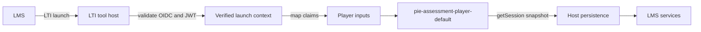

# Launching PIE Players From LTI

This guide describes how an LTI tool host can launch `pie-players` after the
LTI protocol work has already completed.

The important boundary is:

- The LTI tool host owns OIDC login, JWT/JWKS validation, platform
  registration, deployment lookup, Deep Linking, Assignment and Grade Services,
  user identity, permissions, and LMS-specific policy.
- `pie-players` owns browser-side rendering, controller lifecycle, navigation
  mechanics, and the stable assessment/session snapshots that the host persists.

Do not put LTI launch validation inside the player custom elements. Treat the
players as the rendering layer inside the page your LTI tool serves.

## Launch Flow



After the host validates the launch, it should create a small launch context
for the browser page. That context is not a raw `id_token`; it is the
server-approved subset the page needs to render the attempt.

```ts
interface VerifiedLtiLaunchContext {
  platformIssuer: string;
  deploymentId: string;
  contextId: string;
  resourceLinkId: string;
  userId: string;
  roles: string[];
  assessmentId: string;
  attemptId: string;
}
```

Typical claim mapping:

| LTI / host value | Player use |
| --- | --- |
| Platform issuer + deployment ID | Tenant/platform lookup and persistence partition |
| Context ID | Course/class context for host policy |
| Resource link ID or custom activity claim | Assessment/content lookup |
| User subject | Attempt ownership and persistence partition |
| Roles | `env.role` and host authorization |
| Host-minted attempt ID | `attempt-id` and persistence key |

## Assessment Player Wiring

The LTI host should mount the assessment player after it has loaded content and
resolved the attempt context:

```ts
import { ToolkitCoordinator } from "@pie-players/pie-assessment-toolkit";
import "@pie-players/pie-assessment-player/components/assessment-player-default-element";

const launch = await fetch("/api/lti/launch-context").then((r) => r.json());
const assessment = await fetch(`/api/assessments/${launch.assessmentId}`).then((r) =>
  r.json(),
);

const coordinator = new ToolkitCoordinator({
  assessmentId: launch.assessmentId,
  hooks: {
    async createSectionSessionPersistence() {
      // Assessment-player owns the aggregate snapshot in this integration.
      return {
        async loadSession() {
          return null;
        },
        async saveSession() {},
        async clearSession() {},
      };
    },
  },
});

const player = document.querySelector("pie-assessment-player-default") as any;
player.assessmentId = launch.assessmentId;
player.attemptId = launch.attemptId;
player.assessment = assessment;
player.env = {
  mode: "gather",
  role: launch.roles.includes("Instructor") ? "instructor" : "student",
};
player.coordinator = coordinator;
player.hooks = {
  async createAssessmentSessionPersistence() {
    return {
      async loadSession() {
        return fetch(
          `/api/lti/sessions/${launch.assessmentId}/${launch.attemptId}`,
        ).then((r) => (r.ok ? r.json() : null));
      },
      async saveSession(_context, session) {
        await fetch(`/api/lti/sessions/${launch.assessmentId}/${launch.attemptId}`, {
          method: "PUT",
          headers: { "content-type": "application/json" },
          body: JSON.stringify(session),
        });
      },
      async clearSession() {
        await fetch(`/api/lti/sessions/${launch.assessmentId}/${launch.attemptId}`, {
          method: "DELETE",
        });
      },
    };
  },
};
player.bootstrapController?.();
```

Persist the assessment controller snapshot from `getSession()`. Do not persist
`getRuntimeState()`; it contains derived and ephemeral runtime fields.

## Iframe And LMS Checklist

Most LTI launches render inside an LMS iframe. Plan for that environment:

- Use server-backed session persistence. The default demo/local persistence is
  not a production attempt store.
- If the browser page depends on cookies inside a third-party iframe, set them
  as `SameSite=None; Secure` and test in browsers with storage partitioning.
- Prefer short-lived, server-minted fetch credentials for browser API calls
  rather than exposing raw LTI launch tokens to JavaScript.
- Set `Content-Security-Policy` intentionally. Include only trusted PIE bundle
  origins in `script-src` and any needed API origins in `connect-src`.
- Set `frame-ancestors` to the LMS/platform origins that may embed the tool.
- Validate item element registries and bundle/CDN origins before passing content
  to the player.
- Keep `trust-markup` off unless the host has already validated all item and
  passage markup through a trusted content pipeline.

## What The Demo Proves

`apps/lti-demos` demonstrates the recommended boundary with a mock verified
launch context:

1. A server route returns a sanitized launch context as if LTI validation had
   already completed.
2. The page maps that context to `assessment-id`, `attempt-id`, `env`, content,
   and persistence keys.
3. The assessment player renders normally.
4. The host persists assessment sessions server-side, so reloads hydrate from
   host persistence rather than browser `localStorage`.

The demo intentionally does not implement real LTI 1.3/OIDC/JWT validation,
Deep Linking, Assignment and Grade Services, or LMS-specific adapters. Those
belong in a tool host or a separate reference implementation.
