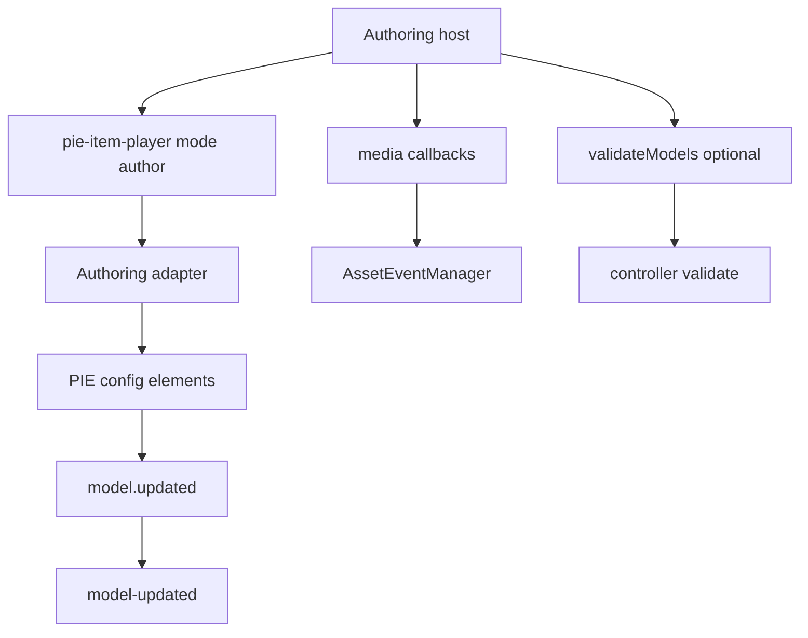

# Authoring Player Plan

This plan covers the current `<pie-item-player mode="author">` path and how it
should evolve relative to the open-source legacy
`@pie-framework/pie-player-components` `<pie-author>`.

The legacy KDS API author/player stack is not the target of this plan. Any
API-backed redesign that depends on `../../kds/pie-api-components` is deferred
to PD-5844.

## Goal

Authoring does not need the same exact drop-in parity guarantee as the
student/teacher-facing player. The goal is to provide a stable, coherent
authoring API that supports current host needs while avoiding unnecessary
legacy branches.

The default direction should be **parity-informed redesign**:

- keep exact parity when it protects a real host contract or avoids needless
  migration risk,
- prefer cleaner current APIs when legacy behavior was Stencil-specific,
  deprecated, or tied to old API-author workflows,
- document intentional differences clearly.

## Current State

Current files:

- `packages/item-player/src/PieItemPlayer.svelte`
- `packages/players-shared/src/components/PieItemPlayer.svelte`
- `packages/players-shared/src/pie/configure-initialization.ts`
- `packages/players-shared/src/pie/asset-handler.ts`
- `apps/item-demos/src/routes/demo/[[id]]/author/+page.svelte`

The current authoring player:

- uses the same `<pie-item-player>` tag with `mode="author"`,
- loads editor/config custom elements,
- rewrites delivery tags to `-config` tags internally,
- sets `model` and `configuration` on configure elements,
- forwards `model.updated` as `model-updated`,
- supports explicit media callbacks:
  - `onInsertImage`
  - `onDeleteImage`
  - `onInsertSound`
  - `onDeleteSound`
- supports `authoring-backend="demo"` and `authoring-backend="required"`.

Missing or different from legacy `<pie-author>`:

- `validateModels()`
- `modelLoaded`
- legacy `modelUpdated` event spelling
- `configSettings` naming
- `addPreview`
- `addRubric`
- `addRubricToConfig()`
- `addMultiTraitRubricToConfig()`
- `defaultComplexRubricModel`
- `imageSupport`
- `uploadSoundSupport`
- complex-rubric add/remove orchestration
- `canWatchConfigSettings`
- `isInsidePieApiAuthor`

## Recommended Direction

Use three buckets instead of copying every legacy API blindly.

### Bucket 1: Keep Or Add As Stable Authoring Contract

These APIs are likely worth supporting because they are core authoring
capabilities rather than historical implementation detail:

- `configuration` as the canonical replacement for `configSettings`.
- `model-updated` as the canonical event for edited model data.
- `validateModels()` as a host method, if hosts need pre-save validation.
- `model-loaded` as a lifecycle event, if hosts need to know configure models
  were assigned.
- media hooks as explicit callback properties:
  - `onInsertImage`
  - `onDeleteImage`
  - `onInsertSound`
  - `onDeleteSound`

For this bucket, prefer the current API names and add compatibility aliases only
when there is a known host requirement.

### Bucket 2: Redesign Rather Than Preserve Exactly

These legacy behaviors should be redesigned around the current player instead
of preserved as-is:

- `addPreview`: current demos already use separate delivery/source/author
  routes. Preview composition should probably live in the host app or a new
  explicit preview component, not inside the authoring custom element.
- `imageSupport` / `uploadSoundSupport`: the current callback-based media API is
  clearer and easier for hosts to implement than legacy support objects.
- `canWatchConfigSettings`: current Svelte property updates should drive
  reconfiguration without a legacy watch flag.
- `isInsidePieApiAuthor`: API-author coupling belongs to PD-5844.

### Bucket 3: Park Or Remove Unless Proven Needed

These are legacy/API-author-specific enough that they should not be implemented
without a concrete host requirement:

- `addRubric` as a deprecated prop.
- `addRubricToConfig()`.
- `addMultiTraitRubricToConfig()`.
- `defaultComplexRubricModel`.
- automatic complex-rubric add/remove behavior keyed to API-author workflows.
- legacy `modelUpdated` camelCase duplicate event, unless a host contract
  requires it.

If any item in this bucket is later required for the `pie-item` client
contract, implement it with an explicit compatibility comment and tests.

## Proposed Architecture

Keep authoring as a mode of `<pie-item-player>`, but separate authoring logic
inside shared code so delivery parity work does not make authoring harder to
reason about.

The authoring adapter should own:

- model/configuration assignment,
- model lifecycle events,
- validation calls,
- media event bridging,
- optional rubric helper utilities if they are accepted into scope.

## Implementation Steps

1. **Define the public authoring contract**
   - Update docs to name canonical APIs:
     - `mode="author"`
     - `configuration`
     - `model-updated`
     - media callbacks
     - optional `validateModels()`
     - optional `model-loaded`
   - Mark API-author-specific behavior as PD-5844/out of scope.

2. **Introduce an authoring adapter boundary**
   - Extract authoring setup from
     `packages/players-shared/src/components/PieItemPlayer.svelte` into a
     small helper module if the implementation starts to grow.
   - Keep event names and payload shape centralized.

3. **Add validation if accepted**
   - Implement `validateModels()` by iterating rendered configure elements,
     finding matching models by `id` / `pie-id`, resolving controllers, and
     calling `controller.validate(model, configurationForPackage)`.
   - Return a structured result compatible enough with legacy:
     `{ hasErrors, validatedModels }`.
   - Update models with validation errors only if needed to avoid feedback
     loops.

4. **Add `model-loaded` if accepted**
   - Emit once after configure elements receive models and configuration.
   - Include the normalized authoring config in the event detail.
   - Avoid duplicate event names unless there is a proven host need for legacy
     `modelLoaded`.

5. **Keep media callbacks as canonical**
   - Retain `authoring-backend="required"` to prevent accidental demo behavior
     in production.
   - Document how to adapt legacy `imageSupport` / `uploadSoundSupport` objects
     in host code rather than embedding those objects as a second API.

6. **Decide rubric strategy explicitly**
   - Recommended default: do not port legacy rubric mutation helpers in the
     first authoring pass.
   - If author hosts need rubric insertion, prefer exported pure helpers from
     `@pie-players/pie-players-shared` over imperative custom-element methods.
   - If exact helper parity is required, add it as a later phase with tests for
     simple rubric, multi-trait rubric, and complex-rubric toggling.

7. **Document intentional non-parity**
   - Add an authoring migration section that explains:
     - `configSettings` -> `configuration`
     - `modelUpdated` -> `model-updated`
     - support objects -> explicit media callbacks
     - `addPreview` -> host-composed preview
     - API-author behaviors -> PD-5844

## Test Plan

Add tests around host-visible authoring behavior:

- `mode="author"` loads configure elements for IIFE and preloaded strategies.
- `configuration` is passed by package name, package base name, and element tag
  where currently supported.
- `model-updated` fires with expected detail when a configure element updates.
- `model-loaded` fires once if added.
- `validateModels()` returns `{ hasErrors, validatedModels }` if added.
- Missing media callbacks with `authoring-backend="required"` emit
  `player-error` and block authoring UI.
- Provided media callbacks are called for image and sound insert/delete.
- No duplicate legacy event names are emitted unless explicitly accepted.
- Versioned tags and `id` attributes remain unchanged.

## Acceptance Criteria

- The authoring player has a documented, coherent host API.
- Current authoring demos continue to work.
- Any legacy parity that is added has a clear host reason and covering tests.
- API-author-specific behavior is not pulled into the current player before
  PD-5844.
- The implementation avoids parallel legacy and current authoring paths.
