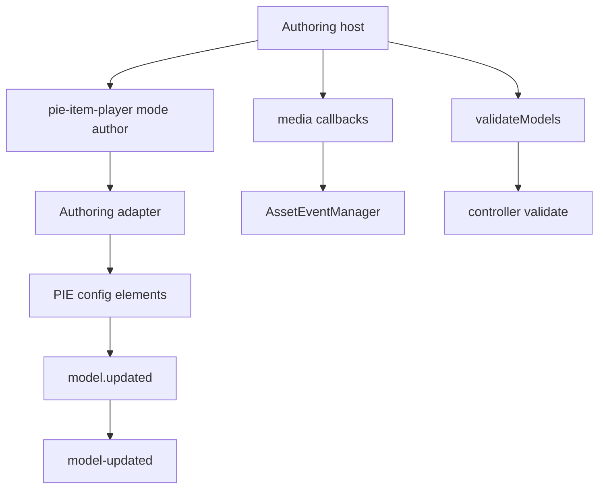

# Authoring Player Plan

This plan covers the current `<pie-item-player mode="author">` path and how it
should evolve relative to the open-source legacy
`@pie-framework/pie-player-components` `<pie-author>`.

The legacy KDS API author/player stack is not the target of this plan. Any
API-backed redesign that depends on `../../kds/pie-api-components` is deferred
to PIE-532.

## Goal

Authoring should be kept **functionally equivalent** to the legacy authoring
contract for supported host capabilities. It does not need exact drop-in API
parity with legacy property/event names, and it does not need to share the same
configuration surface as the student-facing delivery player. The goal is to
provide a stable, coherent authoring API that can replace legacy authoring
behavior without carrying unnecessary legacy implementation branches.

The default direction should be **functional equivalence with authoring-specific
API shape**:

- preserve legacy authoring capabilities unless there is a strong, overriding
  reason to drop or defer them,
- do not break or reinterpret the existing delivery/student-facing
  `<pie-item-player>` API,
- allow naming differences when the current API is clearer, provided the
  equivalent capability is documented,
- namespace authoring-only configuration instead of mixing it into the regular
  delivery/student-facing configuration surface,
- prefer cleaner current APIs when legacy behavior was Stencil-specific,
  deprecated, or tied to old API-author workflows,
- document intentional differences clearly, including how the equivalent
  capability is exposed or why it is deferred.

## Current State

Current files:

- `packages/item-player/src/PieItemPlayer.svelte`
- `packages/players-shared/src/components/PieItemPlayer.svelte`
- `packages/players-shared/src/pie/configure-initialization.ts`
- `packages/players-shared/src/pie/asset-handler.ts`
- `apps/item-demos/src/routes/demo/[[id]]/author/+page.svelte`

The current authoring player:

- uses the same `<pie-item-player>` tag with `mode="author"`,
- loads editor/config custom elements,
- rewrites delivery tags to `-config` tags internally,
- sets `model` and `configuration` on configure elements,
- forwards `model.updated` as `model-updated`,
- supports explicit media callbacks:
  - `onInsertImage`
  - `onDeleteImage`
  - `onInsertSound`
  - `onDeleteSound`
- supports `authoring-backend="demo"` and `authoring-backend="required"`.

Missing or different from legacy `<pie-author>`:

- `validateModels()`
- `modelLoaded`
- legacy `modelUpdated` event spelling
- `configSettings` naming
- `addPreview`
- `addRubric`
- `addRubricToConfig()`
- `addMultiTraitRubricToConfig()`
- `defaultComplexRubricModel`
- `imageSupport`
- `uploadSoundSupport`
- complex-rubric add/remove orchestration
- `canWatchConfigSettings`
- `isInsidePieApiAuthor`

## Recommended Direction

Use three buckets instead of copying every legacy API shape blindly.

### Bucket 1: Keep Functional Equivalence As Stable Authoring Contract

These APIs are likely worth supporting because they are core authoring
capabilities rather than historical implementation detail:

- `configuration` as the canonical replacement for `configSettings`, with
  authoring-only settings under an explicit authoring namespace rather than the
  regular delivery configuration surface.
- `model-updated` as the canonical event for edited model data.
- `validateModels()` as a host method for pre-save validation.
- `model-loaded` as a lifecycle event so hosts can know configure models were
  assigned.
- media hooks as explicit callback properties:
  - `onInsertImage`
  - `onDeleteImage`
  - `onInsertSound`
  - `onDeleteSound`

For this bucket, the requirement is equivalent behavior, not exact spelling.
Prefer current API names when they make the authoring contract clearer, but make
the migration from each legacy capability obvious in docs and tests.

Authoring-specific settings should not be mixed into the same namespace used by
delivery/student-facing configuration. Use `configuration.authoring` as the
canonical home for authoring-only settings. Within that namespace, settings can
still be keyed by package name, package base name, or full versioned PIE tag
when needed, but full versioned PIE tag names must be preserved whenever tag
keys are used.

When resolving configuration for a configure element, keep the current delivery
configuration semantics intact and layer authoring settings only for authoring
mode. If multiple authoring namespace keys match, prefer the most specific key:
full versioned PIE tag, then package name, then package base name.

### Bucket 2: Provide Equivalent Capability With Current Shape

These legacy behaviors should not be copied 1:1, but the current player should
provide an equivalent host capability when that capability is part of normal
authoring:

- `addPreview`: current demos already use separate delivery/source/author
  routes. Preview composition should live in the host app or a new explicit
  preview component, not inside the authoring custom element.
- `imageSupport` / `uploadSoundSupport`: the current callback-based media API is
  the equivalent capability and is clearer for hosts than legacy support
  objects.
- `canWatchConfigSettings`: current Svelte property updates should drive
  reconfiguration without a legacy watch flag; the equivalent capability is
  automatic reaction to property reassignment.
- `isInsidePieApiAuthor`: API-author coupling belongs to PIE-532.

### Bucket 3: Park Or Remove Unless Proven Needed

These are legacy/API-author-specific enough that they should not be implemented
in the current authoring player unless they are required for functional
equivalence in a non-KDS authoring host:

- `addRubric` as a deprecated prop.
- `addRubricToConfig()`.
- `addMultiTraitRubricToConfig()`.
- `defaultComplexRubricModel`.
- automatic complex-rubric add/remove behavior keyed to API-author workflows.
- legacy `modelUpdated` camelCase duplicate event, unless a host contract
  requires it.

If any item in this bucket is later required for the `pie-item` client
contract, implement it with an explicit compatibility comment and tests.

## Proposed Architecture

Keep authoring as a mode of `<pie-item-player>`, but separate authoring logic
inside shared code so delivery work does not make authoring harder to reason
about. Authoring-specific behavior should be gated by `mode="author"` and must
not change delivery initialization, delivery configuration resolution,
student-facing events, session updates, scoring APIs, or existing host-facing
delivery props/methods.

The authoring adapter should own:

- model/configuration assignment,
- model lifecycle events,
- validation calls,
- media event bridging,
- optional rubric helper utilities if they are accepted into scope.

## Implementation Steps

1. **Define the public authoring contract**
   - Update docs to name canonical APIs:
     - `mode="author"`
     - `configuration`
     - `configuration.authoring` for authoring-only settings
     - `model-updated`
     - media callbacks
     - `validateModels()`
     - `model-loaded`
   - Explain where the API is functionally equivalent to legacy authoring and
     where naming or namespace differs.
   - Mark API-author-specific behavior as PIE-532/out of scope.

2. **Introduce an authoring adapter boundary**
   - Extract authoring setup from
     `packages/players-shared/src/components/PieItemPlayer.svelte` into a
     small helper module before adding validation or lifecycle behavior.
   - Keep event names and payload shape centralized.

3. **Add validation**
   - Implement `validateModels()` by iterating rendered configure elements,
     matching configure element `id` to model `id`, resolving controllers from
     the current loaded package/controller registry, and calling
     `controller.validate(model, configurationForPackage)`.
   - Return a structured result compatible enough with legacy:
     `{ hasErrors, validatedModels }`.
   - Update models with validation errors only if needed to avoid feedback
     loops.

4. **Add `model-loaded`**
   - Emit once per renderer initialization after configure elements receive
     models and configuration.
   - Include the normalized authoring config in the event detail.
   - Prefer the canonical `model-loaded` spelling; only add legacy `modelLoaded`
     as a `pie-item` contract compatibility exception with a covering test.

5. **Keep media callbacks as canonical**
   - Retain `authoring-backend="required"` to prevent accidental demo behavior
     in production.
   - Document how to adapt legacy `imageSupport` / `uploadSoundSupport` objects
     in host code rather than embedding those objects as a second API.

6. **Decide rubric strategy explicitly**
   - Recommended default: do not expose legacy rubric mutation helpers directly
     in the first authoring pass.
   - If author hosts need rubric insertion, prefer exported pure helpers from
     `@pie-players/pie-players-shared` over imperative custom-element methods.
   - If functional equivalence for rubric insertion is required, add it as a
     later phase with tests for simple rubric, multi-trait rubric, and
     complex-rubric toggling.

7. **Document Functional Equivalence And Intentional API Shape Differences**
   - Add an authoring migration section that explains:
     - `configSettings` -> `configuration`
     - authoring-only `configSettings` entries ->
       `configuration.authoring`
     - `modelUpdated` -> `model-updated`
     - support objects -> explicit media callbacks
     - `addPreview` -> host-composed preview
     - API-author behaviors -> PIE-532

8. **Add dedicated authoring demos**
   - Add focused authoring demo routes in `apps/item-demos` instead of relying
     only on generic/manual demo coverage.
   - Include demos for the core authoring contract:
     - namespaced `configuration.authoring` settings,
     - `model-updated`,
     - `model-loaded`,
     - `validateModels()`,
     - image and sound media callbacks,
     - `authoring-backend="required"` error handling.
   - Keep the demos small and deterministic so they can double as stable e2e
     fixtures.

## Test Plan

Add tests around host-visible authoring behavior:

- `mode="author"` loads configure elements for IIFE and preloaded strategies.
- `configuration` is passed by package name, package base name, and element tag
  where currently supported.
- Authoring-only settings are resolved from `configuration.authoring` without
  changing delivery/student-facing configuration semantics.
- Matching authoring keys resolve by specificity: full versioned PIE tag,
  package name, then package base name.
- `model-updated` fires with expected detail when a configure element updates.
- `model-loaded` fires once per renderer initialization.
- `validateModels()` returns `{ hasErrors, validatedModels }`.
- Missing media callbacks with `authoring-backend="required"` emit
  `player-error` and block authoring UI.
- Provided media callbacks are called for image and sound insert/delete.
- No duplicate legacy event names are emitted unless explicitly accepted.
- Versioned tags and `id` attributes remain unchanged.

Add Playwright e2e tests against the dedicated `apps/item-demos` authoring demo
routes:

- load each focused authoring demo route and verify the relevant host-visible
  behavior from the browser,
- assert `model-updated` and `model-loaded` event details,
- call `validateModels()` through the demo page and assert the rendered result,
- exercise media callback buttons/flows and assert the demo recorded the calls,
- verify missing required callbacks surface `player-error` and block authoring
  UI,
- assert authoring-only settings come from `configuration.authoring` without
  mutating delivery configuration.

Keep delivery/student-facing regression coverage in the same validation path:

- existing delivery demo routes still load,
- `session-changed`, `provideScore()`, and `updateElementModel()` keep their
  current behavior,
- delivery configuration keys are resolved exactly as before,
- authoring-only `configuration.authoring` entries have no effect in delivery
  mode.

## Acceptance Criteria

- The authoring player has a documented, coherent host API.
- Supported legacy authoring capabilities are functionally equivalent even where
  names or namespaces differ.
- The current delivery/student-facing `<pie-item-player>` API is unchanged.
- Current authoring demos continue to work.
- Dedicated `apps/item-demos` authoring demos cover the core host contract and
  are used as e2e fixtures.
- Playwright e2e coverage exercises the dedicated authoring demo routes.
- Any unsupported legacy capability has a clear deferral/removal reason.
- API-author-specific behavior is not pulled into the current player before
  PIE-532.
- The implementation avoids parallel legacy and current authoring paths.
