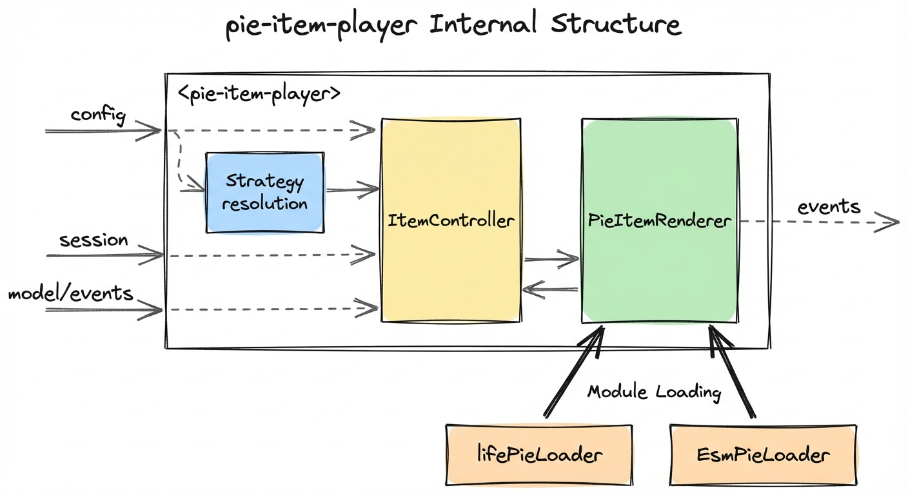
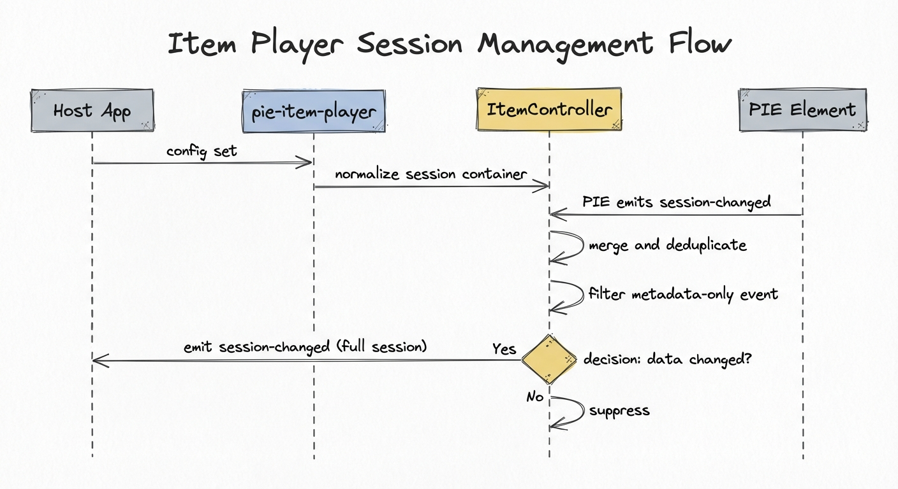

# Item Player Architecture

The item player is the primary runtime element in pie-players. It renders a single PIE assessment item -- loading the required PIE element bundles, managing session state, and forwarding events to the host application. Most PIE integrations use the item player directly, without the section player.

## Custom element

```html
<pie-item-player
  strategy="iife"
  config="..."
  env='{"mode":"gather","role":"student"}'
  session='{"id":"s1","data":[]}'
></pie-item-player>
```

The element is defined in `packages/item-player/src/PieItemPlayer.svelte` (Svelte 5 custom element, light DOM) and auto-registered by the package entrypoint (`packages/item-player/src/pie-item-player.ts`).

For the full attribute/property/event reference, see the [package README](../../packages/item-player/README.md).

## Internal structure



### Key components

All loader, controller, and type code lives in `@pie-players/pie-players-shared` (`packages/players-shared`); the item-player package composes them.

**PieItemPlayer.svelte** -- The outer custom element. Parses the `config` prop, then drives a linear pipeline over the `ElementLoader` primitive (selecting the IIFE, ESM, or preloaded path based on `strategy`) to register PIE element bundles, and delegates rendering to `PieItemRenderer`. Manages the config-load lifecycle (loading spinner, error display, loaded state) and exposes host methods such as `provideScore()`, `updateElementModel()`, and authoring `validateModels()`.

**ItemController** (`players-shared/src/pie/item-controller.ts`) -- Manages the session container (`{ id, data }`) in memory. The player creates one controller per item and uses it to deduplicate and normalize `session-changed` events from PIE elements, preventing metadata-only events from overwriting real responses.

**PieItemRenderer** (`players-shared/src/components/PieItemPlayer.svelte`) -- A Svelte component that takes a loaded `ConfigEntity`, renders the item markup, binds models and sessions to PIE custom elements, and forwards lifecycle events (`load-complete`, `session-changed`, `player-error`, `model-updated`, `model-loaded`). In authoring mode it delegates configure initialization, validation, and media event wiring to shared authoring helpers.

**ElementLoader primitive** (`players-shared/src/loaders/element-loader.ts`) -- The single entry point for registering PIE custom elements. Exposes `ensureRegistered(elements, { backend, ... })` (async, truthful-promise contract: resolves iff every requested tag is in `customElements`) and `assertRegistered(tags)` (sync, throws `ElementAssertionError` with a diagnostic message if any tag is missing). The primitive owns the post-load `customElements.whenDefined` verification pass; backends cannot silently under-register.

**IIFE backend** (`players-shared/src/loaders/iife-adapter.ts`) -- Loads IIFE bundles from a bundle host by injecting `<script>` tags. Supports bundle types `player` (elements only, hosted mode), `clientPlayer` (elements + controllers), and `editor` (authoring elements). Registers loaded elements in the global `window.PIE_REGISTRY`. Includes a configurable retry policy (`bundleRetry`, `onBundleRetryStatus`) for the bundle service's "still building" lifecycle.

**ESM backend** (`players-shared/src/loaders/esm-adapter.ts`) -- Loads ESM modules from a CDN using either fully-qualified URLs or an injected import map plus dynamic `import()`. Supports views `delivery`, `author`, and `print` via module subpath conventions.

## Modes

The `mode` attribute on the custom element accepts `"view"` or `"author"`:

- **`mode="view"`** (default) -- Delivery mode. Loads delivery/client-player bundles. The `env.mode` property passed to PIE elements can be `gather`, `view`, or `evaluate`, controlling whether the student can interact, see read-only output, or see scored feedback.
- **`mode="author"`** -- Authoring mode. Loads editor bundles and renders `-config` suffixed authoring elements. It initializes configure elements with models plus resolved `configuration`, emits `model-loaded` once per renderer initialization, forwards configure `model.updated` events as `model-updated`, exposes `validateModels()`, and enables authoring backend hooks for image/sound upload and deletion.

## Authoring contract

Authoring keeps the delivery/student-facing API unchanged. Authoring-specific
settings live under `configuration.authoring`, while shared delivery settings
remain at the top level of `configuration`.

For each configure element, the renderer resolves configuration in two layers:

1. Top-level shared settings keyed by package spec, package name, or element tag.
2. Authoring-only settings under `configuration.authoring`, keyed by full
   versioned PIE tag, package spec, package name, or package base name.

The merged result is assigned to the configure element's `configuration`
property. Authoring-only settings do not apply in delivery mode.

Hosts can listen for:

- `model-loaded` after configure elements receive their model/configuration.
- `model-updated` when a configure element emits `model.updated`.
- `player-error` for authoring setup errors such as missing required media
  callbacks.

Hosts can call `validateModels()` on the `<pie-item-player>` element to run each
rendered configure element's controller `validate(model, configuration)` method.
The method returns `{ hasErrors, validatedModels }`.

For media, `authoring-backend="demo"` installs demo handlers. Use
`authoring-backend="required"` when production hosts must provide all four
callback properties: `onInsertImage`, `onDeleteImage`, `onInsertSound`, and
`onDeleteSound`.

## Backend Contract

Backend support is an optional JS-only namespace on `<pie-item-player>`. It does
not replace the existing render contract; instead, it can load and persist the
same `config` and `session` data the player already consumes.

```ts
player.backend = {
  delivery: {
    enabled: true,
    provider: "pie-api",
    itemId: "item-1",
    sessionId: "session-1",
    autosave: { enabled: true },
  },
};
```

Delivery backend support owns networking concerns: item/session load, autosave,
explicit `saveSession()`, and server-backed `score()`. Existing inputs such as
`env`, `strategy`, `loaderOptions`, `bundleEndpoints`, `renderStimulus`, and
styling props stay on the player itself. Local browser scoring remains
`provideScore()` and is intentionally separate from server scoring.

For details, see [Backend Support](./backend-support.md).

## Session management

The player manages session state through `ItemController`:



1. When `config` is set, the player creates (or reuses) an `ItemController` for the item.
2. The session prop is normalized into `{ id: string, data: Array<{ id, element, ... }> }`.
3. When a PIE element emits `session-changed`, the controller merges the update, deduplicates against the current state, and only forwards a `session-changed` event to the host if the data actually changed.
4. Metadata-only events (no response values) are filtered out to prevent overwrite loops.

Hosts receive a single `session-changed` event on the `<pie-item-player>` element with the full updated session container.

## External styles

The player supports two external style mechanisms:

- **`external-style-urls`** attribute -- comma-separated CSS URLs fetched at runtime, scoped to `.pie-item-player.{scopeClass}`, and injected into `<head>`.
- **`config.resources.stylesheets`** -- stylesheet resources declared in the item config, loaded the same way.

Both are scoped to the player instance using a generated or custom class name to avoid style leakage between items.

## Debug support

Set the `debug` attribute or `window.PIE_DEBUG = true` to enable verbose logging. The player uses `createPieLogger` for structured, namespaced console output.

To disable verbose debug logging explicitly:

- Set `debug="false"` (or `debug="0"`) on `<pie-item-player>`.
- Or set `window.PIE_DEBUG = false` in the browser console.

If the `debug` attribute is present, that local value takes precedence for that player instance.

## Session debugger

An auxiliary `<pie-item-player-session-debugger>` element provides a floating, draggable panel that displays live session data, environment state, and controller-filtered models. Import it separately:

```ts
import "@pie-players/pie-item-player/components/item-session-debugger-element";
```

## Relationship to section player

The section player (`@pie-players/pie-section-player`) orchestrates multiple items within QTI assessment sections. It renders each item via `<pie-item-player>`, passing the appropriate strategy, config, session, and environment. The section player's `player-type` attribute maps directly to the item player's `strategy`.

For section-level concerns (navigation, layout, controller integration, passage and item composition), see the [section-player client guide](../section-player/client-architecture-tutorial.md).
