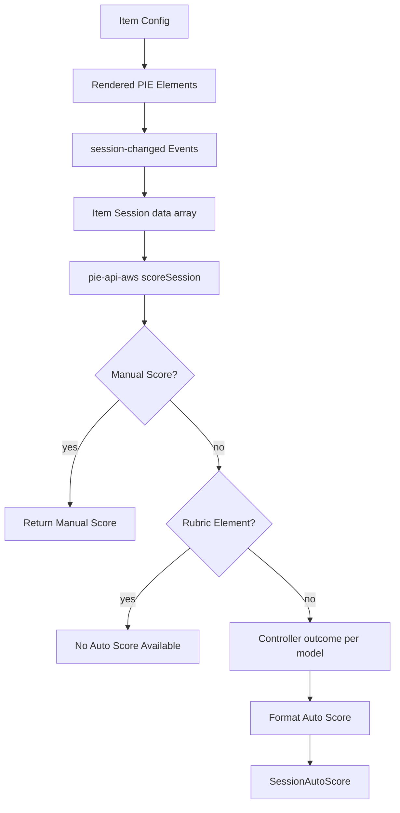

# Item Scoring, Multi-Element Items, EBSR, and Rubrics

This note summarizes how PIE item scoring works across the current `pie-players`
repo, the element implementations in `../pie-elements-ng`, the legacy player in
`../pie-player-components`, and the persisted scoring APIs in
`../../kds/pie-api-components` / `../../kds/pie-api-aws`.

The short version:

- PIE elements own interaction-specific scoring through controller `outcome(...)`
  functions.
- A multi-element item is usually represented as multiple `config.models[]`
  entries and multiple rows in `session.data[]`.
- The legacy player returns per-element outcomes and leaves aggregation to the
  caller.
- The current `pie-players` item runtime primarily gathers and forwards session
  state; it does not expose a built-in rolled-up score on `<pie-item-player>`.
- `pie-api-aws` is the clearest authoritative score aggregator for persisted
  sessions.
- The two-part choice element is spelled `EBSR` in the codebase, not `ESBR`.
- Rubric-style elements describe manual scoring surfaces; they are not
  auto-scored student interactions.

## Key Concepts

### Item Config

A PIE item config maps DOM tags to packages and models:

```ts
{
  markup: "<multiple-choice id=\"mc1\"></multiple-choice>",
  elements: {
    "multiple-choice": "@pie-element/multiple-choice@..."
  },
  models: [
    { id: "mc1", element: "multiple-choice", ... }
  ]
}
```

Each `models[]` row is the authored model for one PIE element instance. The
`id` ties the authored model, rendered custom element, and session row together.

### Session Data

Runtime session state is an item-level container:

```ts
{
  id: "session-id",
  data: [
    { id: "mc1", element: "multiple-choice", value: ["choice-a"] },
    { id: "match1", element: "match", answers: [...] }
  ]
}
```

There is no universal response shape inside each row. Every element defines its
own session contract: `value`, `answers`, `selectedTokens`, nested `partA` /
`partB`, and so on.

### Controller Boundary

PIE element controllers normally expose:

- `model(model, session, env, updateSession?)` to build the delivery model.
- `outcome(model, session, env)` to evaluate a response.
- `createCorrectResponseSession(model, env)` for instructor preview flows.
- `validate(model, config)` for authoring validation.

Most scoring paths use `outcome(...)`. The `score(...)` function exists in some
types but is not the normal runtime path in these repos.

## Current `pie-players`

The current item player focuses on loading elements, applying controller
`model(...)`, gathering session updates, and forwarding events.

Important files:

- `packages/item-player/src/PieItemPlayer.svelte`
- `packages/players-shared/src/components/PieItemPlayer.svelte`
- `packages/players-shared/src/pie/updates.ts`
- `packages/players-shared/src/pie/item-controller.ts`
- `packages/players-shared/src/pie/item-session-contract.ts`
- `packages/players-shared/src/pie/scoring.ts`

The render/update path works like this:

1. `makeUniqueTags(...)` versions the PIE custom element tags in `markup`,
   `elements`, and `models`.
2. The loader registers the required custom elements and controllers.
3. `updatePieElements(...)` iterates `config.elements`, finds rendered DOM nodes,
   matches each node to `config.models[]` by strict `model.id === element.id`,
   finds or creates a matching session row, and calls controller `model(...)`.
4. PIE elements emit `session-changed` events when the student interacts.
5. `ItemController` normalizes and deduplicates the resulting item session
   container before `<pie-item-player>` forwards it to the host.

The exported `scorePieItem(...)` helper in
`packages/players-shared/src/pie/scoring.ts` iterates `config.models[]` and
returns `{ results: OutcomeResponse[] }`. It is not currently wired into
`<pie-item-player>` or the section/assessment runtimes, and it does not produce a
single item score. Also note that this helper uses a different call shape than
the element controllers and server executor that pass `(model, session, env)`, so
it should not be treated as the authoritative scoring implementation without
additional verification.

In the current player stack, a host that needs a single score should generally
use server-side scoring or implement an explicit aggregation step over element
outcomes.

## Legacy `pie-player-components`

The legacy Stencil player has an imperative scoring method:

- `src/components/pie-player/pie-player.tsx`
- `src/pie-loader.ts`
- `src/interface.d.ts`

`provideScore()`:

1. Selects the models to score. For stimulus items, it scores
   `stimulusItemModel.pie.models`; for regular items, it scores
   `pieContentModel.models`.
2. Finds each rendered element by `id` or `pie-id`.
3. Looks up the controller by `pieEl.localName`.
4. Calls `controller.outcome(model, session, { mode: "evaluate",
   partialScoring: this.env.partialScoring })`.
5. Returns a `Promise` of an array of per-model results.

The legacy player does not roll those results up into a total item score. A
multi-element item gets one returned outcome per model, with undefined slots
possible when an element/controller/outcome is missing.

Rubric and complex-rubric support in the legacy player is mostly config and
markup orchestration. Rubric models are still ordinary `models[]` entries as far
as `provideScore()` is concerned.

## Persisted API Scoring

The authoritative persisted scoring path is in `pie-api-aws`:

- `../../kds/pie-api-aws/packages/services/src/services/Player.service.ts`
- `../../kds/pie-api-aws/packages/services/src/services/SessionEvent.service.ts`
- `../../kds/pie-api-aws/packages/services/src/controller/PieController.service.ts`
- `../../kds/pie-api-aws/packages/services/src/controller/PieControllerExecutor.ts`

`pie-api-components` delegates to that service:

- `../../kds/pie-api-components/src/components/pie-api-player/pie-api-player.tsx`
- `../../kds/pie-api-components/src/clients/player.ts`

The API score flow:

1. Save events are flattened into a current `session.data[]`.
2. Manual score events take precedence if present.
3. Cached auto scores are reused when their `partialScoring` mode matches,
   unless the caller requests `skipCached`.
4. Any item whose config contains a rubric element is not auto-scored; without a
   manual score, the service returns a "No manual score available" result.
5. Otherwise, the service forces `env.mode = "evaluate"` and calls each matching
   element controller's `outcome(model, sessionRow, env)`.
6. The raw element outcomes are formatted into a `SessionAutoScore`.

Default aggregation for multiple scored elements:

- If there is exactly one scored outcome, use that outcome directly:
  `points = score`, `max = max ?? 1`.
- If there are multiple scored outcomes, average normalized fractions:
  `sum(score / max) / count`, with final `max = 1`.
- If `env.partialScoring` is false, collapse the averaged result to `1` only
  when it is exactly full credit; otherwise return `0`.
- If `env.partialScoring` is true, preserve the averaged fraction.

Example: two auto-scored elements, one full-credit and one zero-credit:

```ts
// partialScoring: true
{ points: 0.5, max: 1, type: "auto" }

// partialScoring: false
{ points: 0, max: 1, type: "auto" }
```

There is a KDS-specific MPI exception when partial scoring is disabled. MPI
items can use `formatScoreMax(...)`, where grouped parts can produce `max: N`
and `points: M` instead of a normalized `max: 1` score.

## EBSR

The two-part selected-response element is `@pie-element/ebsr`; the codebase uses
`EBSR`, not `ESBR`.

Important files:

- `../pie-elements-ng/packages/elements-react/ebsr/src/controller/index.ts`
- `../pie-elements-ng/packages/elements-react/ebsr/src/controller/utils.ts`
- `../pie-elements-ng/packages/elements-react/ebsr/src/delivery/index.tsx`

Although EBSR renders two internal multiple-choice-like parts, it is one PIE
model and one rendered custom element. Its session shape is nested:

```ts
{
  id: "ebsr1",
  element: "ebsr",
  value: {
    partA: { id: "partA", value: ["..."] },
    partB: { id: "partB", value: ["..."] }
  }
}
```

The controller computes `scoreA` and `scoreB` internally, then returns one
outcome for the whole EBSR model.

When partial scoring is disabled:

- The item is worth `max: 1`.
- Score is `1` only if Part A and Part B are both fully correct.
- Any other combination scores `0`.

When partial scoring is enabled:

- The item is worth `max: 2`.
- Part A gates all credit.
- Part A correct and Part B correct returns `score: 2, max: 2`.
- Part A correct and Part B not fully correct returns `score: 1, max: 2`.
- Part A not fully correct returns `score: 0, max: 2`, regardless of Part B.

This is different from a generic two-element item. EBSR has its own
domain-specific aggregation inside the element controller.

## Rubric-Style Elements

Rubric elements describe manual scoring criteria and visibility, not automatic
student-response scoring.

Important files:

- `../pie-elements-ng/packages/elements-react/rubric/src/controller/index.ts`
- `../pie-elements-ng/packages/elements-react/multi-trait-rubric/src/controller/index.ts`
- `../pie-elements-ng/packages/elements-react/complex-rubric/src/controller/index.ts`
- `../../kds/pie-api-aws/packages/services/src/services/Item.service.ts`
- `../../kds/pie-api-aws/packages/services/src/services/SessionEvent.service.ts`

### Simple Rubric

The simple rubric controller exposes `model(...)` and `validate(...)`. Instructors
receive the normalized rubric model; students receive an empty model. The
controller validates point descriptors but does not provide a meaningful
auto-scoring `outcome(...)`.

### Multi-Trait Rubric

The multi-trait rubric controller prepares scale and trait display data and
controls whether the rubric is visible to students. Its scoring functions are
stubs:

```ts
getScore() // 0
outcome() // { score: 0, empty: true }
```

### Complex Rubric

The complex rubric wraps three rubric modes:

- `simpleRubric`
- `multiTraitRubric`
- `rubricless`

It switches model shape and visibility based on `rubricType`, but its scoring is
also a stub:

```ts
getScore() // 0
outcome() // { score: 0, empty: true }
```

On the API side, the rule is broader: `ItemService.isRubric(...)` treats an item
as rubric-based when any model element includes `rubric`. `SessionEventService`
then skips auto-scoring and returns no auto score unless there is a manual score.

## Partial Scoring

Many element controllers use the shared helper:

- `../pie-elements-ng/packages/shared/controller-utils/src/partial-scoring.ts`

The rule is:

- If `model.partialScoring === false`, partial scoring is disabled.
- If `env.partialScoring === false`, partial scoring is disabled.
- Otherwise partial scoring defaults to the element's requested default, or
  `true` when no explicit default is provided.

Element-specific details still matter. Multiple-choice radio mode is effectively
dichotomous, EBSR has a Part A gate, and some elements return `0` because they
require manual scoring.

In `pie-api-aws`, `ItemService.isPartialScoringDisabled(...)` also forces
`env.partialScoring = false` when every model in the item explicitly has
`partialScoring: false`.

## Practical Guidance

Use these rules when deciding where to score:

- For persisted student attempts, use `pie-api-aws` scoring. It knows about save
  events, manual scores, cached auto scores, rubric blocking, partial scoring
  mode, and KDS-specific MPI formatting.
- For local demos or lightweight previews, call element `outcome(...)` directly
  or use the legacy `provideScore()` style, but expect per-element outcomes.
- For multi-element items, do not assume the player will sum scores. Define the
  aggregation rule explicitly.
- For EBSR, do not split Part A and Part B into generic item-level aggregation.
  The controller's internal rule is the scoring contract.
- For rubric, multi-trait-rubric, complex-rubric, drawing-response, and similar
  manually scored interactions, expect a manual score path rather than
  auto-scoring.

## Summary Flow


