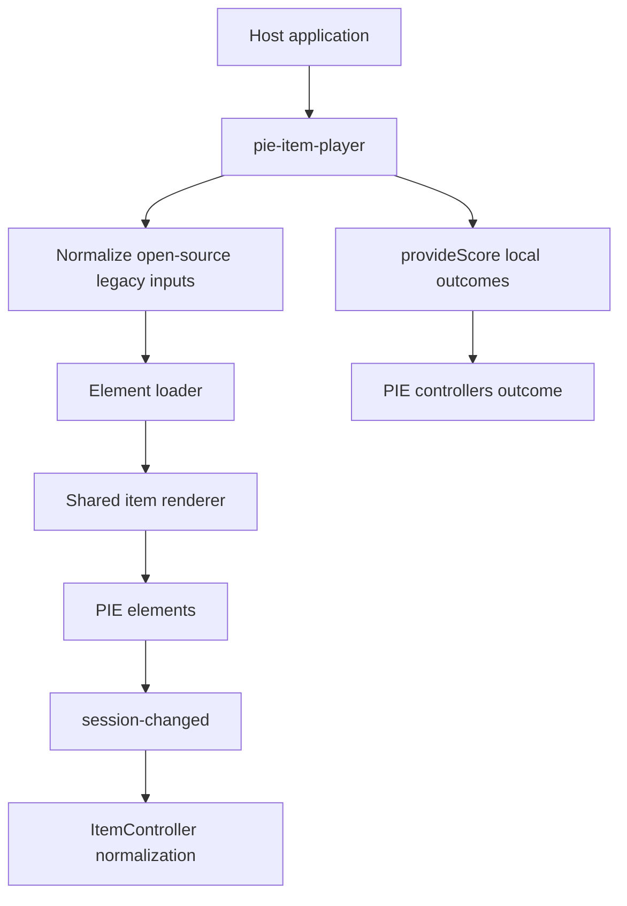

# Student And Teacher Player Parity Plan

This plan covers host-facing parity between the current
`@pie-players/pie-item-player` `<pie-item-player>` and the open-source legacy
`@pie-framework/pie-player-components` `<pie-player>`.

The legacy KDS API player (`../../kds/pie-api-components` / `<pie-api-player>`)
is out of scope here. API-backed loading, autosave, persisted scoring, manual
score precedence, cached auto scores, and API aggregation belong to the PD-5844
redesign track.

## Goal

The student/teacher-facing player should be a functional and API-compatible
replacement for the open-source legacy `<pie-player>` from the host's point of
view.

This means exact parity for delivery/evaluation host APIs unless a behavior is:

- demonstrably unused by the `pie-item` client contract,
- unsafe under the custom-element tag/id contract, or
- explicitly assigned to the PD-5844 API-player redesign.

Allowed compatibility exceptions must carry the inline comment required by the
repo rules:

```ts
// pie-item contract compatibility: <reason>
```

and must have a covering test.

## Scope

In scope:

- Student delivery mode (`env.mode = "gather"`, `role = "student"`).
- Teacher/scorer/evaluate mode (`env.mode = "evaluate"`, typically
  `role = "instructor"`).
- Browser-local controller `model(...)`, `createCorrectResponseSession(...)`,
  and `outcome(...)` behavior.
- Open-source legacy `<pie-player>` props, methods, and events that hosts can
  observe or call.
- Stimulus item rendering parity for open-source legacy `{ pie, passage }`
  configs.

Out of scope:

- `<pie-api-player>.score()` and persisted score aggregation.
- API autosave / `sessionSaved` / `saveSessionError`.
- Server-side sanctioned-version resolution beyond the current loader/versioned
  tag contract.
- API-player-specific New Relic, retry, token, assignment, and session-loading
  props.

## Target Compatibility Surface

The current `<pie-item-player>` already covers the core render/event contract:

- `config`
- `session`
- `env`
- `hosted`
- `add-correct-response`
- `show-bottom-border`
- `external-style-urls`
- `container-class`
- `load-complete`
- `session-changed`
- `player-error`

The parity work should add or verify:

- `provideScore(): Promise<false | any[]>`
- `updateElementModel(update)`
- advanced/stimulus config support for `{ pie, passage }`
- `renderStimulus`
- `allowedResize`
- `passageContainerClass`
- `baseHeadingLevel`
- compatibility mapping for legacy loader inputs:
  - `bundleHost`
  - `bundleEndpoints`
  - `disableBundler`
  - `reFetchBundle`
- compatibility mapping for `customClassname`
- legacy-style `session-changed` completion semantics where required by hosts,
  without weakening the current normalized session event contract.

## Proposed Architecture

Keep one canonical implementation path in the current item player and avoid
parallel legacy-only render paths.



The compatibility layer should translate host inputs at the boundary, then feed
the existing `makeUniqueTags`, loader, renderer, and `ItemController` pipeline.
Do not add duplicate rendering or session-dispatch implementations.

## Implementation Steps

1. **Inventory and freeze the parity contract**
   - Convert the open-source legacy player findings in
     `docs/item-player/legacy-host-api-parity.md` into a test checklist.
   - Mark API-player-only behaviors as PD-5844/out of scope.

2. **Add host-scoped local scoring**
   - Add `provideScore()` to
     `packages/item-player/src/PieItemPlayer.svelte`.
   - Use the currently loaded, versioned `itemConfig`.
   - Query only within the current custom element host.
   - Select stimulus `pie.models` when the original input is an advanced item
     config.
   - Call controllers with the legacy/open-source shape:
     `controller.outcome(model, sessionRow, { mode: "evaluate",
     partialScoring: env.partialScoring })`.
   - Preserve the legacy return shape: `false` when no models are available,
     otherwise an array aligned to the models being scored.
   - Update `packages/item-player/src/types.ts` and generated declarations.

3. **Fix or replace `scorePieItem()`**
   - The current shared helper is not a drop-in legacy scorer because it queries
     `document` globally and uses the wrong controller call shape.
   - Either make it an internal helper that accepts a host/root element and
     calls `(model, session, env)`, or avoid it and keep scoring inside the
     custom element.

4. **Support advanced/stimulus configs**
   - Accept open-source legacy `{ pie, passage }` item configs at the
     `<pie-item-player>` boundary.
   - Normalize them into separate item and passage configs before the existing
     load pipeline.
   - Expose/pass `passageConfig` to the shared renderer.
   - Implement `renderStimulus` and `passageContainerClass`.
   - Decide whether `allowedResize` belongs in item-player itself or only in
     section layouts. If it is host-visible parity, implement the minimal
     legacy-compatible layout behavior and test it.

5. **Add `updateElementModel(update)`**
   - Update the loaded item config's matching model by `id`.
   - Re-run model/session binding through the existing update path.
   - Preserve versioned element names and strict `id` matching.

6. **Add compatibility aliases at the host boundary**
   - Map `bundleHost` to `loaderOptions.bundleHost`.
   - Map `customClassname` to `customClassName`.
   - Map `disableBundler=true` to the current `preloaded` assertion semantics
     where possible.
   - Decide whether `bundleEndpoints` and `reFetchBundle` need full behavior or
     documented non-support. If implemented, keep the mapping in the loader
     boundary, not scattered through rendering.

7. **Preserve current improvements where they do not break parity**
   - Keep versioned tag names.
   - Keep default-on markup sanitization.
   - Keep normalized `session-changed` with the full session container.
   - Only add legacy-shaped payload support if a host-contract test proves it is
     required.

## Test Plan

Add focused tests before broad e2e coverage:

- Unit/component tests for `provideScore()`:
  - no models returns `false`
  - single model returns one outcome
  - multi-model item returns per-model outcomes, not a rolled-up score
  - missing element/controller/outcome preserves legacy-compatible result shape
  - `partialScoring` is passed through
  - scoring is scoped to the current player instance, not `document`
- Stimulus tests:
  - `{ pie, passage }` renders both regions
  - `renderStimulus=false` renders only item content
  - passage and item styles/classes are applied
  - `provideScore()` scores only the item/pie models
- Host API tests:
  - `updateElementModel(update)` updates rendered model
  - `customClassname` maps to current class scoping
  - `bundleHost` maps to loader options
  - `disableBundler` maps to preloaded/asserted behavior or fails loudly with
    documented guidance
- Regression tests:
  - versioned tag suffixes remain intact
  - `id` attributes round-trip unchanged
  - metadata-only session events do not erase real responses

Before running e2e, rebuild affected packages and direct consumers per the repo
rules.

## Acceptance Criteria

- A host that used the open-source legacy `<pie-player>` for delivery/evaluate
  can migrate to `<pie-item-player>` without losing student/teacher-facing
  behavior.
- `provideScore()` returns open-source legacy-compatible per-model outcomes.
- No browser-local API claims to implement persisted/API-player scoring.
- All compatibility branches are covered by tests and limited to the `pie-item`
  client contract.
