# TTS Highlight Target Resolver

Status: Ready

Owner: PIE Players maintainers

Related architecture:

- [P0 shared contracts](../architecture/shared-contracts-p0.md)
- [Accessibility runtime patterns](./shared-contracts/accessibility-runtime-patterns.md)

## Problem

Text-to-speech highlighting is currently too tightly coupled to the native DOM
range that produced each speech mark. That works for ordinary visible text, but
breaks for projected or transformed content where the spoken range is not the
same node users see on screen.

The immediate downstream pressure is QTI section rendering, where readable TTS
projection can differ from visible interaction markup. `pie-qti` can map the
projection back to visible content, but today that requires monkey-patching
private `HighlightCoordinator` methods and maintaining local fallback highlight
state outside the PIE Players cleanup lifecycle.

## Goals

- Provide an additive, runtime-only TTS highlight target resolver API.
- Keep existing PIE Players TTS word and sentence highlighting behavior as the
  default identity path.
- Let host packages map spoken browser `Range` targets to visible `Range` or
  `HTMLElement` targets without importing or patching private coordinator
  internals.
- Keep QTI-specific projection extraction and mapping in `pie-qti`, not in
  PIE Players.
- Keep highlight painting, clearing, and lifecycle cleanup owned by PIE Players.
- Establish enough tests and release gates to migrate `pie-qti` away from its
  private highlight fallback.

## Non-Goals

- No QTI selectors, projection attributes, or QTI text normalization in PIE
  Players.
- No persisted model, session, assessment, tool configuration, or wire-schema
  changes.
- No new readable-content schema in this pass.
- No replacement of existing TTS speech mark generation.
- No export of `HighlightCoordinator` as a public API.
- No compatibility layer for arbitrary older toolkit internals. Compatibility is
  limited to preserving current TTS behavior for consumers that do not provide a
  resolver.

## Package And Export Ownership

Owning package: `@pie-players/pie-assessment-toolkit`.

Public type exports should be available from a toolkit-owned public path that
consumers can import without reaching into `src` or coordinator internals. The
implementation PR should choose the narrowest existing public export path that
matches local package conventions.

Consuming packages or apps:

- `@pie-players/pie-section-player` and section-player variants that create
  toolkit regions and TTS tools.
- `@pie-players/pie-tool-tts-inline` or the current inline TTS wiring package.
- `pie-qti`, as the first non-identity resolver consumer.
- Future hosts with projected, virtualized, or shadow-DOM-backed visible text.

The resolver is runtime-only. It must not be placed in serialized tool config,
`QtiSectionToolConfig.provider`, item models, sessions, assessment state, or
published QTI data.

## Proposed Contract

The implementation should add a small resolver contract around browser-native
highlight targets:

```ts
export interface TTSHighlightContext {
  scopeElement?: HTMLElement | null;
  itemId?: string;
  canonicalItemId?: string;
  kind?: string;
  contentKind?: string;
  regionPolicy?: string;
}

export interface TTSHighlightTargetResolver {
  resolveWordRange?(
    range: Range,
    context: TTSHighlightContext,
  ): Range | null | undefined;

  resolveSentenceRanges?(
    ranges: Range[],
    context: TTSHighlightContext,
  ): Array<Range | HTMLElement> | null | undefined;
}
```

The preferred runtime ingress is `assessmentToolkitRegionScopeContext`, because
it already represents the active section/tool DOM scope. If implementation
inspection shows a different toolkit-owned runtime context is the established
place for active tool scope, use that context and document the reason in the
implementation PR.

Resolver behavior:

- The resolver pipeline always runs. Its default implementation is identity:
  word ranges return the native word `Range`, and sentence ranges return the
  native sentence `Range[]`.
- A host-provided resolver may override target selection for a word or sentence
  before PIE Players paints it.
- Missing host resolver means the default identity resolver is used.
- Missing host resolver method means the default identity resolver is used for
  that highlight kind.
- Returning `undefined` or `null` means skip host remapping and continue with
  the default identity target.
- Throwing must fail open: catch the error, continue with the default identity
  target, and avoid breaking TTS playback.
- Returned targets must be validated enough to avoid painting detached or
  obviously out-of-scope content.
- Resolver lookup must be late-bound from the active runtime context so a
  coordinator created before mount can see a resolver after `scopeElement`
  becomes available or changes after rerender.

## Runtime Flow

```mermaid
flowchart LR
  speechMark["TTS speech mark"] --> nativeRange["Native Range"]
  nativeRange --> contextLookup["Late-bound runtime context lookup"]
  contextLookup --> resolverPipeline["Resolver pipeline"]
  resolverPipeline --> defaultResolver["Default identity resolver"]
  resolverPipeline --> hostResolver["Optional host resolver"]
  hostResolver -->|"valid remap"| visibleTarget["Visible Range or Element"]
  hostResolver -->|"missing, null, invalid, or throws"| defaultResolver
  defaultResolver --> nativeTarget["Native target"]
  nativeTarget --> painter["PIE Players painter"]
  visibleTarget --> painter
  painter --> cleanup["PIE Players cleanup lifecycle"]
```



PIE Players owns the full resolver, painter, and cleanup pipeline. The custom
resolver overrides only target selection; it does not replace the default
identity behavior, painting, or cleanup.

## Painting And Cleanup Requirements

PIE Players must support every target type allowed by the resolver contract:

- `Range` word and sentence targets use the existing range highlight path when
  available.
- `HTMLElement` sentence or block targets use toolkit-owned element marking and
  cleanup.
- If browser compatibility requires fallback overlays for a supported target,
  those overlays are created and cleared by PIE Players.

Cleanup must run when:

- a word highlight advances;
- sentence highlighting changes;
- TTS stops, ends, or errors;
- the TTS tool unmounts;
- the active region scope changes;
- the resolver target becomes invalid.

`pie-qti` must not keep separate TTS overlay painters, mutate
`ttsSentenceElementHighlights`, or maintain `__qtiSection*` highlight state
after adopting this API.

## Migration Requirements

`pie-qti` should replace its current highlight monkey-patch with a
`TTSHighlightTargetResolver` installed through runtime region context.

The resolver may reuse existing QTI readable-projection and
projection-to-visible mapping helpers, but QTI-specific logic must remain in
`pie-qti`.

After migration, `pie-qti` must not:

- assign to `highlightCoordinator.highlightTTSWord`;
- assign to `highlightCoordinator.highlightTTSSentence`;
- assign to `highlightCoordinator.clearTTSWord`;
- assign to `highlightCoordinator.clearTTS`;
- access `(coordinator as any).highlightCoordinator`;
- mutate `ttsSentenceElementHighlights`;
- depend on `data-pie-qti-tts-word-range-fallback` as the acceptance signal.

`pie-qti` must raise its minimum `@pie-players/*` dependency floor to the first
fixed lockstep version that contains the resolver. If older packages can still
be resolved through lockfiles or overrides during a transition, the downstream
PR must either feature-detect the resolver temporarily or clearly document that
the new version floor is required.

## Compatibility

This is an additive API. Consumers that do not provide a resolver must see the
same TTS highlight behavior they have today.

The resolver must not alter PIE element tag names, IDs, model IDs, session IDs,
slots, `data-*`, `aria-*`, `pie-*`, `config-*`, or `context-*` attributes.

No persisted data migration is required because the resolver is runtime-only.

## Accessibility

The implementation is accessibility-sensitive because TTS highlighting is a
visible reading aid and may be used with other accommodations.

Acceptance criteria:

- Word and sentence highlights remain perceivable at the same contrast and zoom
  expectations as current TTS highlights.
- Highlight remapping must not obscure captions, transcripts, media controls,
  or essential item content.
- TTS playback must continue when resolver logic fails.
- Keyboard and screen-reader operation of the TTS tool must not regress.
- Manual review should cover at least one remapped-content scenario where the
  spoken projection differs from visible content.

## Test Plan

Upstream PIE Players tests must cover:

- identity resolver behavior for existing word highlighting;
- identity resolver behavior for existing sentence highlighting;
- word resolver remapping from native `Range` to visible `Range`;
- sentence resolver remapping from native `Range[]` to visible `HTMLElement`
  blocks;
- resolver errors falling open to native highlighting;
- late-bound resolver lookup when `scopeElement` starts `null` and appears
  after mount;
- resolver updates after region rerender;
- clearing on word advance, sentence change, stop/end/error, unmount, and scope
  rerender.

An upstream integration test should prove propagation through the public runtime
surface:

```text
host runtime context -> toolbar/tool registration -> inline TTS wiring ->
TTS service/highlight coordinator -> painted highlight target
```

Downstream `pie-qti` tests must cover:

- visible TTS highlighting through the upstream resolver API;
- no duplicate QTI fallback overlays;
- no remaining private coordinator method replacement or private highlight
  state mutation;
- section-player unit, Svelte, and Playwright TTS tracking checks relevant to
  the migrated code.

Commands:

```sh
bun run typecheck
bun run test
bun run check:source-exports
bun run check:consumer-boundaries
bun run check:custom-elements
```

For Playwright-backed TTS checks, run outside the sandbox.

## Rollout And Release Notes

- Changeset required: yes, because this adds public TypeScript/runtime surface.
- Release bump: patch, following the repository lockstep release policy.
- Release verification must cover all publishable `@pie-players/*` packages in
  the fixed version set.
- `pie-qti` migration should verify once against the published or locally packed
  fixed version set, without local source linking.

Release notes should describe this as an additive TTS highlight target resolver
for projected or transformed content. They should not describe it as a
QTI-specific API.

## Open Questions

- Which existing public export path in `@pie-players/pie-assessment-toolkit`
  should own the resolver types?
- Does the current highlighter already support all required `Range` targets, or
  does the implementation need a small toolkit-owned fallback painter?
- What is the minimal validation rule for rejecting detached or out-of-scope
  resolver targets without breaking valid projected-content use cases?
