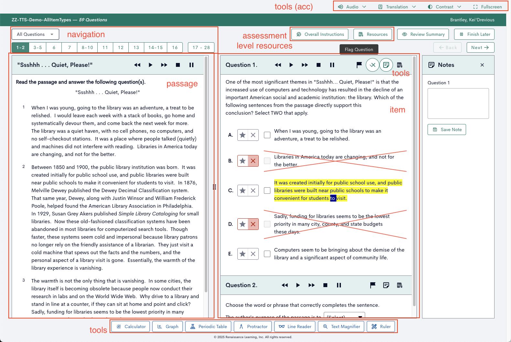
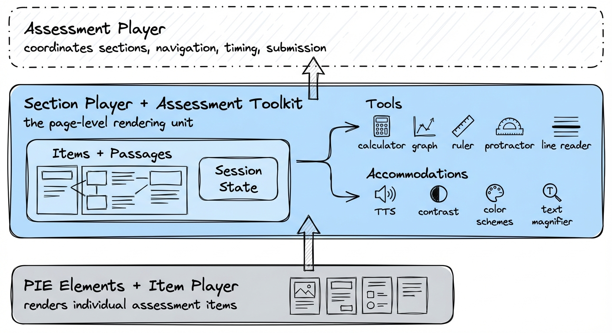
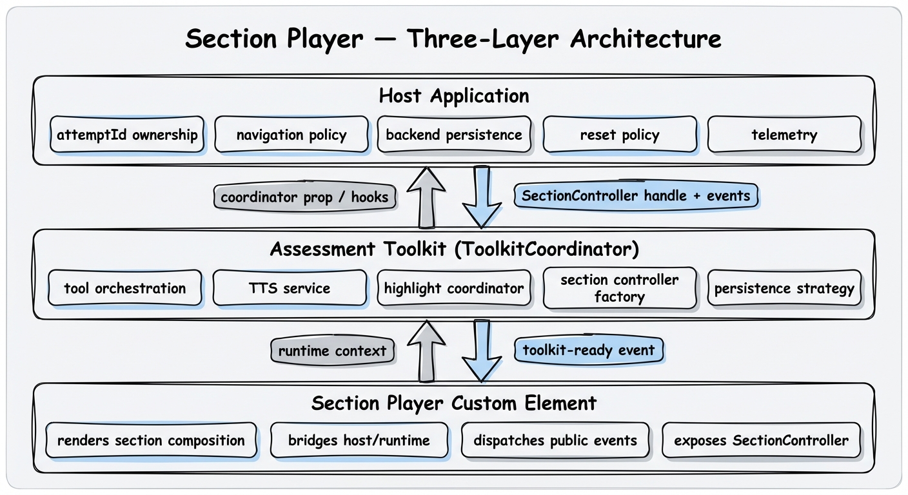
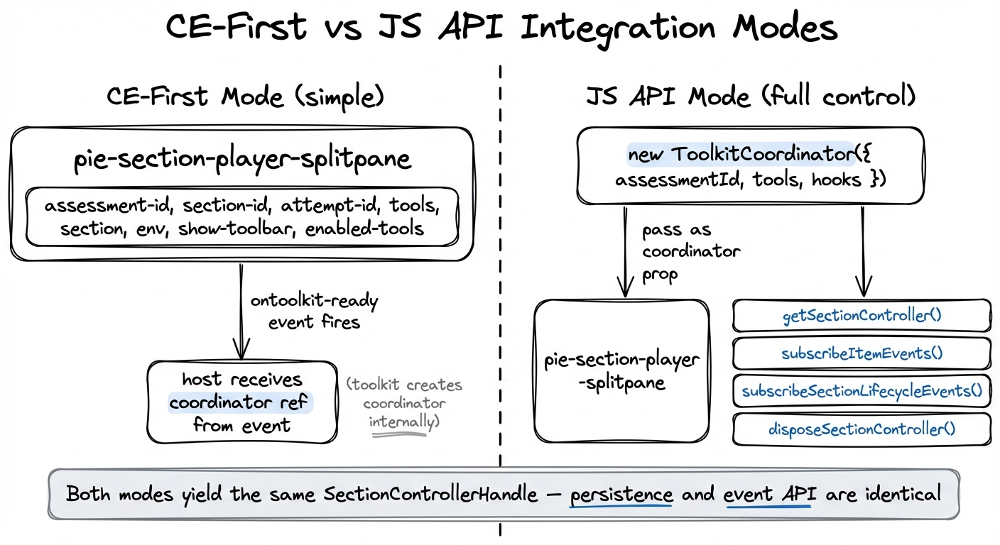
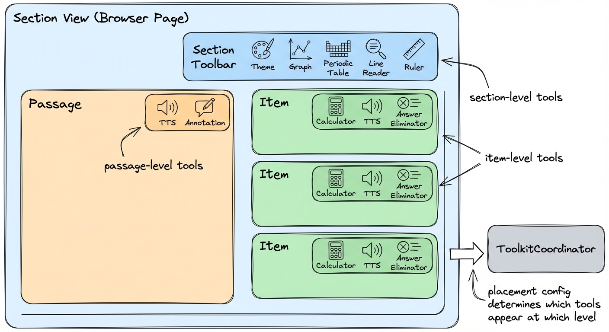
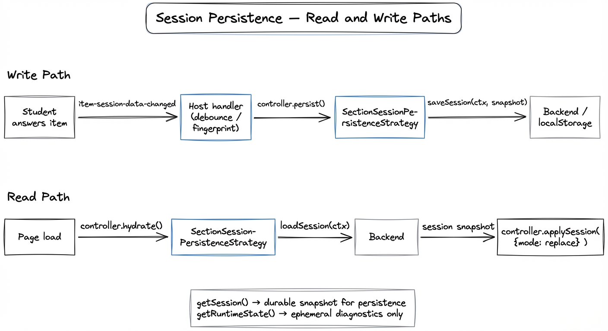
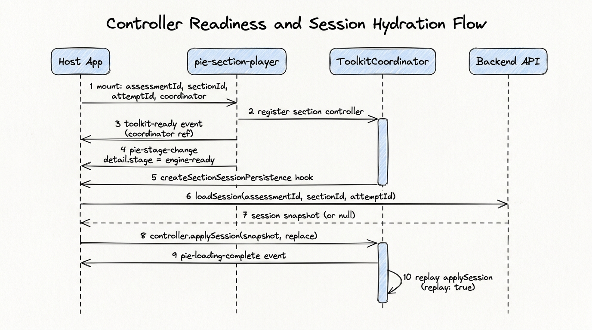

# Section Player & Assessment Toolkit — Client Integration Guide

This guide is for development teams integrating the section player into production systems. It covers the architectural model, both CE-first and full JS API integration patterns, tool configuration, and the complete lifecycle around content loading and session persistence. The focus is on mechanisms and architecture — how the pieces fit together and why. For exhaustive API details (full method signatures, option types, event payloads), refer to the TypeScript interfaces in `@pie-players/pie-assessment-toolkit` and the package-level READMEs.

This is not a getting-started guide — it assumes you understand web components, TypeScript, and async patterns in browser environments.

---

## 1. Why a Section Player?

PIE elements and the item player are the foundation of PIE's rendering stack. They handle individual assessment items — a multiple-choice question, a drag-and-drop interaction, a constructed response — and they're used directly by several production systems at Renaissance. Many integrations need nothing more: they embed item players, wire their own session handling, and build whatever composition layer their product requires. PIE is designed to be adopted incrementally, not consumed as a monolith.

But step back and look at what a real assessment screen looks like in practice:



There's a reading passage on the left paired with questions on the right. There are page-level navigation controls. Each item has its own controls — text-to-speech playback, flagging, notes. A toolbar at the bottom offers section-wide tools: calculator, graph, periodic table, protractor, line reader, ruler. Accommodation controls at the top manage audio, translation, contrast, and fullscreen mode. All of this needs coordination, shared state, and a coherent lifecycle.

Every team that builds beyond the item player level ends up rebuilding some version of this composition. The section player and assessment toolkit exist to provide that layer as a ready-made, well-tested foundation — so integration teams can focus on their product's unique concerns rather than re-solving passage-item layout, tool coordination, session persistence, and accessibility plumbing.

The key insight behind the section player's design is that **a section maps to a page, and a page is how we render things in a browser**. A section is the natural rendering unit for an assessment — it groups related content (a passage with its items, or a set of standalone items) into a single view with shared tools, shared session state, and a coherent navigation scope. One section fills one browser page. The section player bridges these two concepts.



Tools and accommodations belong at the section level. A calculator isn't scoped to a single question — it's available across the section. Text-to-speech needs to coordinate playback across items and passages. Highlights need to persist within the section scope. The section player is the natural home for all of this coordination.

In assessment terminology, "tools" (calculator, ruler, graph) and "accommodations" (text-to-speech, contrast modes, translation) are often treated as separate categories — tools are enabled per-assessment based on content requirements, while accommodations are assigned per-student based on accessibility needs. In practice the boundary is blurry: text-to-speech is an accommodation for a student with a reading disability but a general tool when enabled for all students; a line reader aids focus for students with attention difficulties and is also just a useful reading aid. The assessment toolkit treats all of these uniformly as tools at the framework level — same placement model, same provider configuration, same lifecycle. The *policy* distinction (which student sees which tools) is the host application's responsibility, not the player's. This keeps the framework simple and flexible: the toolkit doesn't need to know why a tool is enabled, only that it is.

Above the section layer, a full assessment or test player coordinates sections — navigation between them, timing, submission, progress tracking — but it is primarily an orchestrator. It routes between pages; it doesn't render them. The section player remains the rendering workhorse. This guide covers that rendering layer: how to integrate the section player and assessment toolkit into a host application.

---

## 2. Architectural Model

The system is built around three distinct layers with well-defined responsibilities. Getting these boundaries right is the most important architectural decision your integration has to make.



**Section Player custom element** (`pie-section-player-splitpane` / `pie-section-player-vertical`)
Renders the section composition — items, passages, toolbars — and bridges between the host runtime contracts and the internal rendering engine. It dispatches public lifecycle events and exposes a `SectionControllerHandle` for programmatic session access. The element is framework-agnostic; it works as a plain HTML custom element.

**Assessment Toolkit (`ToolkitCoordinator`)**
Orchestrates all toolkit services: tool availability, TTS, highlight coordination, accessibility catalogs, and section controller lifecycle. It is the single authoritative service hub for an assessment context. It does not own navigation state, timing, or progress — those live in your host.

**Host Application**
Owns everything with business meaning: the `attemptId`, navigation continuity across page loads, backend persistence, reset policy, and telemetry. The host wires the player and coordinator together, registers persistence strategies, and reacts to controller events. The host may itself be a larger assessment runtime — an outer player that manages routing, auth context, inter-section navigation, and result submission — with the section player embedded as a subsystem. The boundary still applies in that case: the section player and toolkit handle the section-level runtime mechanics; the outer layer handles all durable state and policy above that boundary.

The rule is: player/toolkit handle runtime mechanics, the host handles durable data and policy. Violations of this — for instance, storing `getRuntimeState()` blobs to your backend, or letting the player control navigation without host involvement — lead to brittle integrations.

---

## 3. Integration Modes

There are two ways to integrate the section player. They produce identical runtime behaviour; the difference is where the `ToolkitCoordinator` is constructed.



### CE-First (simple)

In CE-first mode, you pass tool and section configuration directly as element attributes/properties. The player creates the `ToolkitCoordinator` internally and hands you a reference via the `toolkit-ready` event. This is the right starting point for most integrations and is sufficient for many production use cases.

```html
<pie-section-player-splitpane
  assessment-id="my-assessment-001"
  section-id="section-a"
  attempt-id="attempt-xyz"
  show-toolbar="true"
  toolbar-position="right"
  enabled-tools="theme,graph,periodicTable,lineReader"
></pie-section-player-splitpane>
```

Key props you'll set via attributes:

| Attribute | Type | Purpose |
| --- | --- | --- |
| `assessment-id` | `string` | Scopes tool state across sections |
| `section-id` | `string` | Identifies this section |
| `attempt-id` | `string` | Identifies the attempt (host-owned) |
| `section` | `object` | Section content/composition model |
| `env` | `object` | `{ mode: 'gather'/'view'/'evaluate', role: 'student'/'instructor' }` |
| `tools` | `object` | Tool placement/provider config (see §5) |
| `debug` | `boolean` | Verbose logging control (`true` to enable, `false`/`0` to disable) |
| `show-toolbar` | `boolean` | Whether to render the section toolbar |
| `enabled-tools` | `string` | Comma-separated list of tool IDs for the toolbar |
| `player-type` | `string` | `'iife'` (default), `'esm'`, or `'preloaded'` |
| `lazy-init` | `boolean` | Defer toolkit initialization (default: `true`) |

To obtain the coordinator and attach any hooks:

```ts
playerEl.addEventListener('toolkit-ready', (e: CustomEvent) => {
  const coordinator = e.detail.coordinator;
  coordinator.setHooks({
    onError: (error, context) => console.error('[toolkit]', context, error),
  });
});
```

### JS API (full control)

When your host application needs to own the coordinator lifecycle — because it manages auth context, session infrastructure, or cross-section state — construct `ToolkitCoordinator` yourself and pass it to the element. This gives you full control over initialization order, hook wiring, and service access before the player mounts.

```ts
import { ToolkitCoordinator } from '@pie-players/pie-assessment-toolkit';

const coordinator = new ToolkitCoordinator({
  assessmentId: 'my-assessment-001',
  tools: {
    placement: {
      section: ['theme', 'graph', 'periodicTable'],
      item: ['calculator', 'textToSpeech', 'annotationToolbar'],
      passage: ['textToSpeech', 'annotationToolbar'],
    },
    providers: {
      calculator: { authFetcher: fetchDesmosCredentials },
    },
  },
  hooks: {
    onError: (error, context) => reportError(error, context),
    async createSectionSessionPersistence(context) {
      // See §8 for full treatment
      return buildPersistenceStrategy(context);
    },
  },
});

// Pass to the element — no ontoolkit-ready handler needed
playerEl.coordinator = coordinator;
```

The `coordinator` prop takes precedence over CE-generated coordinators. When you pass one, the `ontoolkit-ready` event still fires, but it carries the same coordinator reference you provided — use it for identity checks rather than initialization.

---

## 4. Content Loading

The section player expects a `section` object describing the composition — items, passages, and their relationships. You set this as the `section` property on the element.

Content items are rendered via `<pie-item-player>` elements. The `player-type` attribute on the section player maps directly to the item player's `strategy` and controls how PIE element bundles are fetched and registered.

- **`iife`** (default): Elements are loaded by injecting `<script>` tags that fetch IIFE bundles from a bundle host (default: `https://proxy.pie-api.com/bundles`). PIE was built during an era when IIFE was the most reliable cross-environment delivery format, and this remains the most widely deployed strategy. It is the safe default for any production system today.

- **`esm`**: Elements are loaded via dynamic `import()` from an ESM CDN (default: `https://cdn.jsdelivr.net/npm`). This is the intended future default — the PIE team is targeting ESM as the primary strategy by end of 2026. Compared to IIFE, ESM loading offers genuine architectural advantages: modules are fetched concurrently and cached by the browser's native module cache across loads (unlike IIFE script tags, which are re-executed every time), shared dependencies between elements can be deduplicated at the module graph level rather than being bundled redundantly into each IIFE, and the format supports standard toolchain features like tree-shaking and source maps. ESM also produces a better local development experience since modules integrate naturally with browser DevTools and bundlers. The PIE elements library is still being migrated to full ESM compatibility; the team is targeting full ESM support by end of 2026.

- **`preloaded`**: All required PIE custom elements are assumed to be already registered in the browser — no loading occurs at runtime. This strategy is used with the `@pie-players/pie-preloaded-player` package, which is a pre-built project dependency containing a fixed set of elements bundled at build time. Because the element set and versions are locked to your application's CI/CD cycle, this trades flexibility for zero-network-request rendering: useful for offline environments, strict performance budgets, or controlled test harnesses. The downside is that updating an element version or adding a new element requires a redeployment — you lose the ability to hot-swap element versions dynamically without a full release cycle.

For `loaderOptions` (custom bundle host URL, ESM CDN URL, import-map mode, etc.) see [docs/item-player/loading-strategies.md](./loading-strategies.md).

### Item-level observability wiring

Item-level resource observability is configured at the embedded `pie-item-player` level through
`loaderConfig`. In section-player integrations, the canonical path is:

- `runtime.player.loaderConfig.trackPageActions`
- `runtime.player.loaderConfig.instrumentationProvider`

Example:

```ts
import { ConsoleInstrumentationProvider } from '@pie-players/pie-players-shared';

const provider = new ConsoleInstrumentationProvider({ useColors: true });
await provider.initialize({ debug: true });

sectionPlayerEl.runtime = {
  playerType: 'esm',
  player: {
    loaderConfig: {
      trackPageActions: true,
      instrumentationProvider: provider,
      maxResourceRetries: 3,
      resourceRetryDelay: 500,
    },
    loaderOptions: {
      esmCdnUrl: 'https://cdn.jsdelivr.net/npm',
    },
  },
};
```

Notes:

- `loaderOptions` and `loaderConfig` are different concerns: loading strategy vs observability/retry behavior.
- For custom providers, pass object references as JS properties (`runtime`), not serialized string attributes.
- Higher-level section/toolkit instrumentation is also provider-generic. Section-player emits runtime/public events (for example `readiness-change`, `session-changed`, `composition-changed`) and those can be bridged to `InstrumentationProvider.trackEvent(...)` without coupling to New Relic-specific APIs.
- New Relic remains one provider implementation option; it is not the player contract.
- With `trackPageActions: true`, missing/`undefined` `instrumentationProvider` uses the default New Relic provider path.
- `instrumentationProvider: null` is an explicit no-op opt-out.
- Ownership model: section-player instrumentation owns section runtime/public events; toolkit instrumentation covers toolkit lifecycle events. This avoids semantic overlap and duplicate telemetry.

The player tracks loading through `totalRegistered` and `totalLoaded` counters (accessible via `getRuntimeState()`) and emits `pie-loading-complete` when all registered items have loaded. The canonical lifecycle stream is `pie-stage-change`, which carries the full transition sequence (`composed` → `engine-ready` → `interactive` → `disposed`) on a single typed event. The legacy `readiness-change` / `interaction-ready` / `ready` events still dual-emit through the current 0.x compatibility window — see §10 for the migration mapping.

### Instrumentation (dedicated)

Section player instrumentation is provider-agnostic and layered:

- **Item-level resource instrumentation**: forwarded to embedded `pie-item-player` via `runtime.player.loaderConfig`.
- **Section-level event instrumentation**: emitted from section-player runtime/public events and bridged to `InstrumentationProvider.trackEvent(...)`.
- **Toolkit-level event instrumentation** (when toolkit is mounted): emitted by toolkit-owned lifecycle events.
- **Toolkit tool/backend telemetry**: forwarded from toolkit runtime telemetry to provider events (for example TTS init/synthesize and calculator auth/script-load operations).

Canonical provider injection path:

- `runtime.player.loaderConfig.instrumentationProvider`

Provider semantics:

- With `trackPageActions: true`, missing/`undefined` provider values use the default New Relic provider path.
- `provider: null` explicitly disables instrumentation.
- Invalid provider objects are ignored (optional debug warning), also no-op.
- Existing `item-player` behavior remains the compatibility anchor.

Section-player owned canonical event stream:

- `pie-section-readiness-change`
- `pie-section-interaction-ready`
- `pie-section-ready`
- `pie-section-controller-ready`
- `pie-section-session-changed`
- `pie-section-composition-changed`
- `pie-section-framework-error`

Toolkit-owned canonical stream (when present) is separate and intentionally non-overlapping:

- `pie-toolkit-runtime-owned`
- `pie-toolkit-runtime-inherited`
- `pie-toolkit-ready`
- `pie-toolkit-section-ready`
- `pie-toolkit-framework-error`

Toolkit tool/backend operational stream (forwarded through the same provider path):

- `pie-tool-init-start|success|error`
- `pie-tool-backend-call-start|success|error`
- `pie-tool-library-load-start|success|error`

Ownership rule: section semantics stay in section streams, toolkit semantics stay in toolkit streams. Dedupe in the bridge is a safety net, not the primary correctness mechanism.

---

## 5. Tool Configuration

Tools are placed at three levels — section, item, and passage — each with its own toolbar scope. The `ToolkitCoordinator` drives which tools appear where based on the placement configuration.



Tool configuration flows through the `tools` property on `ToolkitCoordinator` (or directly on the element in CE-first mode). The structure normalizes to a `CanonicalToolsConfig` with three top-level keys:

```ts
tools: {
  // Which tools appear where
  placement: {
    section: string[];   // Section-level toolbar tools
    item: string[];      // Per-item toolbar tools
    passage: string[];   // Per-passage toolbar tools
  };

  // Per-tool provider config (auth, settings, feature flags)
  providers: {
    [toolId: string]: {
      enabled?: boolean;
      settings?: Record<string, unknown>;
      authFetcher?: () => Promise<Record<string, unknown>>;
      // ...tool-specific keys
    };
  };

  // Allow/block overrides (optional)
  policy: {
    allowed?: string[];
    blocked?: string[];
  };
}
```

Tool IDs (canonical aliases): `theme`, `graph`, `periodicTable`, `protractor`, `lineReader`, `ruler`, `calculator`, `textToSpeech`, `annotationToolbar`, `answerEliminator`, `colorScheme`.

A typical multi-tool configuration:

```ts
const tools = {
  placement: {
    section: ['theme', 'graph', 'periodicTable', 'lineReader', 'ruler'],
    item: ['calculator', 'textToSpeech', 'answerEliminator', 'annotationToolbar'],
    passage: ['textToSpeech', 'annotationToolbar'],
  },
  providers: {
    textToSpeech: {
      backend: 'browser',        // 'browser' | 'polly' | 'google' | 'server'
      defaultVoice: 'en-US',
    },
    calculator: {
      authFetcher: async () => {
        const r = await fetch('/api/tools/desmos/auth');
        const { apiKey } = await r.json();
        return { apiKey };
      },
    },
    annotationToolbar: { enabled: true },
  },
};
```

Tools are placed at the level specified in `placement`. A tool in `item` gets a toolbar button rendered inside each item card; a tool in `section` goes to the shared section toolbar. Tools not listed in any placement array are not visible but may still be registered internally if they have providers.

The `ToolkitCoordinator` also exposes its managed services directly for host code that needs to interact with them outside the player — for instance, wiring a standalone TTS control panel or annotation toolbar that your host renders separately from the player:

```ts
coordinator.ttsService           // TTSService — playback lifecycle, provider abstraction
coordinator.highlightCoordinator // HighlightCoordinator — TTS + annotation highlight layers
coordinator.elementToolStateStore // ephemeral per-element tool state
coordinator.catalogResolver      // QTI 3.0 accessibility catalog resolution
```

The TTS service uses a pluggable provider architecture (browser Web Speech API by default, with AWS Polly and Google TTS as built-in alternatives, or implement `ITTSProvider` for your own backend). The highlight coordinator manages two independent layers — TTS word/sentence tracking and student-created annotations — using the browser's CSS Custom Highlight API for zero DOM mutation. See the `@pie-players/tts` and assessment toolkit package documentation for the full service APIs.

### Custom TTS option (host-configured)

Custom transport is a host-owned integration pattern. Toolkit defaults still remain browser/standard unless your host explicitly sets a custom TTS provider in `tools.providers.textToSpeech`.

The following is a full client-side example showing:

- host `ToolkitCoordinator` custom TTS provider config
- section-player wiring with `tools` and `coordinator`
- optional TTS settings dialog custom tab (`customProviders`) with apply + preview hooks

```ts
import { ToolkitCoordinator } from "@pie-players/pie-assessment-toolkit";

const customTtsProvider = {
  enabled: true,
  backend: "server" as const,
  serverProvider: "custom" as const,
  transportMode: "custom" as const,
  endpointMode: "rootPost" as const,
  endpointValidationMode: "none" as const,
  apiEndpoint: "/api/tts/sc", // host proxy route
  lang_id: "en-US" as const,
  speedRate: "medium" as const,
  cache: true,
  includeAuthOnAssetFetch: false,
};

const tools = {
  placement: {
    section: ["theme", "graph", "periodicTable", "protractor", "lineReader", "ruler"],
    item: ["calculator", "textToSpeech", "answerEliminator", "annotationToolbar"],
    passage: ["textToSpeech", "annotationToolbar"],
  },
  providers: {
    textToSpeech: customTtsProvider,
    calculator: {
      authFetcher: async () => {
        const r = await fetch("/api/tools/desmos/auth");
        const payload = await r.json();
        return payload?.apiKey ? { apiKey: payload.apiKey } : {};
      },
    },
    annotationToolbar: { enabled: true },
  },
};

export const coordinator = new ToolkitCoordinator({
  assessmentId: "my-assessment-id",
  tools,
});
```

```svelte
<script lang="ts">
  import "@pie-players/pie-section-player/components/section-player-splitpane-element";
  import { coordinator } from "./coordinator";

  export let section: unknown;
  export let sectionId = "section-1";
  export let attemptId = "attempt-1";
</script>

<pie-section-player-splitpane
  assessment-id="my-assessment-id"
  section-id={sectionId}
  attempt-id={attemptId}
  tools={coordinator.config.tools}
  section={section}
  coordinator={coordinator}
  show-toolbar={true}
  enabled-tools="theme,graph,periodicTable,protractor,lineReader,ruler,annotationToolbar"
></pie-section-player-splitpane>
```

```ts
const customProviders = [
  {
    id: "demo-custom-provider",
    label: "Demo Custom",
    description: "Example custom provider tab wired through adapter mode.",
    mode: "adapter" as const,
    checkAvailability: async () => ({
      available: true,
      message: "Demo custom provider available.",
    }),
    buildApplyConfig: ({
      apiEndpoint,
      state,
    }: {
      apiEndpoint: string;
      state: Record<string, unknown>;
    }) => {
      const base = String(apiEndpoint || "/api/tts")
        .replace(/\/+$/, "")
        .replace(/\/synthesize\/?$/i, "");
      const customEndpoint = base.endsWith("/sc") ? base : `${base}/sc`;
      return {
        config: {
          backend: "server",
          serverProvider: "custom",
          transportMode: "custom",
          endpointMode: "rootPost",
          endpointValidationMode: "none",
          apiEndpoint: customEndpoint,
          lang_id: "en-US",
          speedRate: "medium",
          cache: true,
          includeAuthOnAssetFetch: false,
          providerOptions: { source: "host-app", ...state },
        },
      };
    },
    preview: async ({
      previewText,
    }: {
      previewText?: string;
    }) => {
      const text = String(previewText || "").trim() || "This is a custom provider preview.";
      const response = await fetch("/api/tts/sc", {
        method: "POST",
        headers: { "Content-Type": "application/json" },
        body: JSON.stringify({
          text,
          speedRate: "medium",
          lang_id: "en-US",
          cache: true,
        }),
      });
      const payload = await response.json();
      if (!response.ok) {
        throw new Error(String(payload?.message || payload?.error || "Preview failed"));
      }
      return {
        audioUrl: payload.audioContent,
        speechMarks: payload.speechMarks || [],
        trackingText: text,
      };
    },
  },
];
```

```svelte
<pie-section-player-tools-tts-settings
  toolkitCoordinator={coordinator}
  customProviders={customProviders}
></pie-section-player-tools-tts-settings>
```

Boundary rules for this setup:

- Browser calls only your local proxy route (for example `POST /api/tts/sc`).
- Tokens/secrets stay on the server route and are never sent to the browser.
- This is opt-in at host level; toolkit does not enable this mode by default.

---

## 6. Theming

PIE item elements and toolkit UI components use a shared set of CSS custom properties (`--pie-*`) for all colors, contrast states, and font scaling. You control those variables through the `<pie-theme>` custom element from `@pie-players/pie-theme`.

### Basic usage

Wrap the section player (and any toolkit UI) in a `<pie-theme>` element:

```html
<!-- Light theme, scoped to the element and its descendants -->
<pie-theme theme="light">
  <pie-section-player-splitpane ...></pie-section-player-splitpane>
</pie-theme>

<!-- Dark theme -->
<pie-theme theme="dark">...</pie-theme>

<!-- Follow the OS preference -->
<pie-theme theme="auto">...</pie-theme>
```

To apply the theme to the entire document rather than a subtree:

```html
<pie-theme theme="light" scope="document"></pie-theme>
```

### Attributes

| Attribute | Values | Purpose |
| --- | --- | --- |
| `theme` | `light` / `dark` / `auto` / named | Base theme. `auto` tracks `prefers-color-scheme`. Named values (e.g. DaisyUI theme names) use light base defaults while still driving provider resolution. |
| `scope` | `self` (default) / `document` | `self` applies variables to the element itself; `document` applies them to `<html>`. |
| `provider` | `auto` (default) / `daisyui` / custom id | How to read variables from an existing design system. `auto` tries all registered providers. |
| `scheme` | `default` / color scheme id | Applies a color scheme overlay on top of the base theme (see color schemes below). |
| `variables` | `Record<string, string>` | Direct CSS custom property overrides, applied last — highest specificity. |

### Adapting to an existing design system

The theme system uses a provider adapter model to read variables from an existing design system and map them to `--pie-*` properties. A DaisyUI adapter is built in — set `provider="daisyui"` (or leave it as `auto`) and the section player inherits your host's DaisyUI theme automatically. For other design systems, implement the `ThemeProviderAdapter` interface (`canRead`, `read`) and register it via `registerPieThemeProvider()` before mounting. For direct overrides, the `variables` property accepts a `Record<string, string>` of CSS custom properties applied with highest specificity.

### Color schemes and the theme tool

Color schemes are overlays on top of the base theme — sets of `--pie-*` variable overrides designed for accessibility needs like high contrast or inverted colors. PIE ships several built-in schemes and supports custom scheme registration via `registerPieColorSchemes()`. The `colorScheme` toolbar tool lets students pick their preferred scheme at runtime; the selection is stored in tool state managed by the coordinator.

Separately, the `theme` toolbar tool is a student-facing control for switching between light and dark mode. This is distinct from the `<pie-theme>` element, which is developer-controlled and set at integration time. Both layers compose: your baseline sets the default, the student's runtime selection overrides it.

---

## 7. The SectionController Handle

The `SectionControllerHandle` is the primary programmatic interface between your host and the section runtime. It lives inside the coordinator and is accessible once the player has bootstrapped.

### Accessing the controller

Never assume the controller is synchronously available after mounting. Two patterns are available:

**Async/await (preferred)** — `waitForSectionController` resolves once the controller is ready, or returns `null` after the timeout. This is the recommended entry point for imperative contexts (test harnesses, programmatic code running after mount) and integration code that wants a typed handle without juggling event-listener registration.

```ts
const controller = await playerEl.waitForSectionController(5000);
if (!controller) throw new Error('Section controller did not become ready');
```

**Stage-event filter** — listen for `pie-stage-change` and filter on `detail.stage === "engine-ready"` to obtain the controller via `coordinator.getSectionController(...)`. This fits naturally when your integration is already subscribed to `pie-stage-change` for other lifecycle gating.

```ts
playerEl.addEventListener('pie-stage-change', (event) => {
  if (event.detail.stage !== 'engine-ready') return;
  const controller = coordinator.getSectionController({ sectionId, attemptId });
});
```

The legacy `section-controller-ready` event is still dispatched on the layout host (by the kernel's Svelte `createEventDispatcher`, not the engine's `legacy-event-bridge`) during the current 0.x compatibility window, but it is `@deprecated since M6` and new host code should use one of the two patterns above.

### Reading state

```ts
// Serialization-safe snapshot — suitable as the persistence payload
// (use via the persistence strategy described in §8, not direct saves)
const session = controller.getSession();
// { currentItemIndex, visitedItemIdentifiers, itemSessions: Record<string, unknown> }

// Ephemeral runtime state — for diagnostics/observability only, do not persist
const runtime = controller.getRuntimeState();
// { loadingComplete, totalRegistered, totalLoaded, currentItemIndex,
//   itemIdentifiers, itemSessions, itemsComplete, completedCount, totalItems, ... }
```

**Critical distinction**: `getSession()` produces the only serialization-safe snapshot — it is what the persistence strategy (§8) passes to your backend. `getRuntimeState()` contains derived and ephemeral fields and is not a stability-guaranteed payload; use it only for diagnostics and observability.

### Mutating session state

```ts
// Restore a full snapshot from your backend (e.g., on page load)
await controller.applySession(snapshotFromBackend, { mode: 'replace' });

// Apply a partial overlay without overwriting unrelated items
await controller.applySession(partialSnapshot, { mode: 'merge' });

// Write a single item's session directly (e.g., from a custom event handler)
await controller.updateItemSession('item-q1', {
  session: { id: 'item-q1-session', data: [{ id: 'choice', value: 'b' }] },
  complete: true,
});
```

### Persistence lifecycle

```ts
// Load session from configured persistence strategy and apply it
await controller.hydrate();

// Save current getSession() snapshot via configured persistence strategy
await controller.persist();

// Dispose the controller, with optional save/clear behavior
await coordinator.disposeSectionController({
  sectionId,
  attemptId,
  persistBeforeDispose: true,   // call persist() before teardown
  clearPersistence: false,       // call clearSession() (for resets)
});
```

---

## 8. Session Persistence

Session persistence is wired through the `createSectionSessionPersistence` hook on `ToolkitCoordinator`. This hook is called once per `(assessmentId, sectionId, attemptId)` tuple — the return value is cached for the lifetime of that controller.



### Wiring the persistence strategy

```ts
const coordinator = new ToolkitCoordinator({
  assessmentId,
  tools,
  hooks: {
    async createSectionSessionPersistence(context, defaults) {
      const { assessmentId, sectionId, attemptId } = context.key;

      return {
        async loadSession(ctx) {
          const snapshot = await api.sessions.load({ assessmentId, sectionId, attemptId });
          return snapshot ?? null;
        },

        async saveSession(ctx, session) {
          await api.sessions.save({
            assessmentId,
            sectionId,
            attemptId,
            snapshot: session ?? { itemSessions: {} },
          });
        },

        async clearSession(ctx) {
          await api.sessions.delete({ assessmentId, sectionId, attemptId });
        },
      };
    },
  },
});
```

The hook receives two arguments: `context` (containing the `(assessmentId, sectionId, attemptId)` key) and `defaults`, which provides a `createDefaultPersistence()` factory. You can use this to wrap or fall back to the built-in localStorage strategy rather than replacing it entirely — useful for offline-first integrations that want localStorage as a local cache with a remote backend as the source of truth.

The default strategy (when the hook is not provided) uses `localStorage` keyed as `pie:section-controller:v1:{assessmentId}:{sectionId}:{attemptId}`. For production, always supply your own strategy backed by a real backend.

If your host uses different session identifiers than `assessmentId`/`sectionId`/`attemptId`, close over your own IDs from the surrounding scope rather than relying solely on `context.key`. The hook is called with the coordinator's view of the key, but your persistence implementation can use whatever identifiers your backend expects — the two don't need to match. The session snapshot itself (`getSession()` output) is what you store; the key is just how you address the storage slot.

### Triggering persistence

The preferred pattern is to trigger `controller.persist()` via the coordinator subscription API, with deduplication to avoid backend thrash:

```ts
let lastFingerprint: string | null = null;

coordinator.subscribeItemEvents({
  sectionId,
  attemptId,
  eventTypes: ['item-session-data-changed'],
  listener: () => {
    const controller = coordinator.getSectionController({ sectionId, attemptId });
    if (!controller?.persist) return;

    const snapshot = controller.getSession();
    const fingerprint = JSON.stringify(snapshot);
    if (fingerprint === lastFingerprint) return;  // no change, skip

    lastFingerprint = fingerprint;
    void controller.persist();
  },
});
```

You can also subscribe directly on the controller handle (see §9) and react to `item-session-data-changed` events — the approach is equivalent, but the coordinator helper handles scoping automatically.

### The hydration sequence



The typical page-load sequence is:

1. Mount the player element with `assessmentId`, `sectionId`, `attemptId`, and `coordinator`.
2. Player bootstraps, registers the section controller with the coordinator.
3. `toolkit-ready` event fires — by this point the coordinator is active.
4. `section-controller-ready` event fires — controller is now available.
5. The coordinator calls `createSectionSessionPersistence` to resolve the strategy.
6. On `controller.hydrate()`, the strategy's `loadSession` is called and the snapshot is applied via `applySession`.
7. Item elements register and load, emitting `section-loading-complete` when done.
8. After loading completes, the player **replays** `applySession` with `replay: true` to ensure all loaded items reflect the restored state.

Step 8 exists because of a timing gap: hydration (step 6) typically runs before item elements have registered — the bundles haven't loaded yet. `applySession` writes the snapshot into the controller's internal model, but an item element can only receive session data once it exists and is registered. The replay runs after `section-loading-complete`, when all elements are present, and re-applies the same snapshot against the now-complete item set. Without it, items that registered after hydration would render with no prior responses.

**Empty session semantics.** When `loadSession` returns `null` or an empty `itemSessions` map, the player treats this as a clean-slate session — items render with no prior responses. However, some PIE item runtimes expect an explicit empty response shape (e.g., `{ id: 'item-id', data: [] }`) rather than the absence of a key to visibly clear their UI on hydration. If you observe items that fail to clear visually after a reset, supply an explicit empty session shape per item in your `loadSession` return value rather than deleting the row or returning `null`. The exact shape is item-runtime-specific; check the element's session schema.

As a consequence, `section-session-applied` fires twice in a normal hydrated flow. Any host logic that reacts to this event (analytics, autosave triggers) must guard for idempotency:

```ts
coordinator.subscribeSectionLifecycleEvents({
  sectionId,
  attemptId,
  listener: (event) => {
    if (event.type === 'section-session-applied' && event.replay) {
      return;  // suppress duplicate side effects on replay
    }
    // handle initial apply
  },
});
```

---

## 9. Events and Subscriptions

The coordinator exposes two focused subscription helpers that filter the underlying controller event stream.

### Item events

Item events are tied to individual response interactions:

```ts
const unsub = coordinator.subscribeItemEvents({
  sectionId,
  attemptId,
  listener: (event) => {
    switch (event.type) {
      case 'item-session-data-changed':
        // event.itemId, event.session, event.complete, event.currentItemIndex
        break;
      case 'item-complete-changed':
        // event.itemId, event.complete, event.previousComplete
        break;
      case 'item-selected':
        // event.currentItemId, event.previousItemId, event.itemIndex
        break;
      case 'content-loaded':
        // event.itemId, event.contentKind ('item'|'passage'|'rubric')
        break;
      case 'item-session-meta-changed':
        // event.itemId — metadata (e.g. flagged state) changed
        break;
      case 'item-player-error':
        // event.itemId, event.error
        break;
    }
  },
});

// Clean up on route teardown
unsub();
```

You can also narrow by event type or specific item IDs:

```ts
coordinator.subscribeItemEvents({
  sectionId,
  attemptId,
  eventTypes: ['item-session-data-changed', 'item-complete-changed'],
  itemIds: ['item-q1', 'item-q2'],
  listener: handleSessionChange,
});
```

### Section lifecycle events

Section lifecycle events cover loading, completion state, and errors:

```ts
const unsub = coordinator.subscribeSectionLifecycleEvents({
  sectionId,
  attemptId,
  listener: (event) => {
    switch (event.type) {
      case 'section-loading-complete':
        // event.totalRegistered, event.totalLoaded
        break;
      case 'section-items-complete-changed':
        // event.complete, event.completedCount, event.totalItems
        break;
      case 'section-session-applied':
        // event.mode, event.replay, event.itemSessionCount
        break;
      case 'section-navigation-change':
        // event.currentIndex, event.previousIndex
        break;
      case 'section-error':
        // event.source, event.error
        break;
    }
  },
});
```

### Raw controller subscription

You can also subscribe directly on the controller handle for finer control:

```ts
const controller = await playerEl.waitForSectionController(5000);
const unsub = controller.subscribe?.((event) => {
  // receives all SectionControllerEvent types
});
```

### Always include both `sectionId` and `attemptId`

In multi-attempt or multi-section layouts, subscriptions without an explicit `attemptId` are ambiguous and will be silently ignored if multiple controllers exist for the same `sectionId`. Always scope subscriptions with both identifiers.

---

## 10. Player Element Lifecycle Events

For session data, loading state, and completion tracking, use the coordinator subscription API (§9) — not DOM events. The coordinator gives you typed, scoped, properly filtered access to the controller event stream and is the recommended integration surface for anything involving session state.

The player element does dispatch a small set of DOM `CustomEvent`s that are genuinely host-facing.

### Canonical readiness and error events (recommended)

These are the events to build host integrations against. They are dispatched on the layout custom element (`pie-section-player-splitpane` / `-vertical` / `-tabbed` / `-kernel-host`) by the section runtime engine, with stable typed payloads.

| Event name | Detail | Callback-prop mirror | When |
| --- | --- | --- | --- |
| `toolkit-ready` | `{ coordinator }` | — | Coordinator initialized — **CE-first only**: this is how you obtain the coordinator reference when you haven't constructed one yourself |
| `pie-stage-change` | `StageChangeDetail` (`{ stage, status, runtimeId, sectionId, attemptId, sourceCe, timestamp }`) | `onStageChange(detail)` | One typed transition stream covering the full lifecycle: `composed` → `engine-ready` → `interactive` → `disposed`. Replaces the legacy readiness vocabulary with a single subscription that correlates across wrapper depths. |
| `pie-loading-complete` | `LoadingCompleteDetail` (`{ runtimeId, sectionId, attemptId, itemCount, loadedCount, sourceCe, timestamp }`) | `onLoadingComplete(detail)` | Fires once per cohort when every item has finished loading (gated on `interactive`). |
| `framework-error` | `FrameworkErrorModel` | `onFrameworkError(model)` | Canonical error event for any failure crossing the framework boundary (coordinator init, runtime init, tool config, provider/TTS init, tool runtime). The callback prop and the package-internal `FrameworkErrorBus` deliver each error exactly once; the layout-host *DOM event* is dual-emitted while a toolkit is nested (see "Deprecated readiness events" note below). |

Callback-prop precedence: `runtime.<key>` (set on the layout CE's `runtime` object) wins over the top-level CE prop. Both fire at the same emit point as the DOM event so callback and event stay in lockstep across cohort changes.

Recommended host wiring:

- Gate "start test" UI on `pie-stage-change` with `detail.stage === "interactive"`, or subscribe to the engine via `engine.subscribe(output => { if (output.kind === "stage-change" && output.detail.stage === "interactive") { /* … */ } })` if you hold a programmatic engine reference.
- Show item-loading affordances until `pie-loading-complete` fires for the active cohort.
- Surface `framework-error` to your error UX via `onFrameworkError(model)` (single-fire) rather than the layout-host DOM event (dual-emitted while a toolkit is nested).

### Deprecated readiness events (compatibility window)

The following events still dual-emit alongside the canonical events through the current 0.x compatibility window. New host code should use the canonical event instead.

| Event name | Equivalent canonical event | Routed by |
| --- | --- | --- |
| `readiness-change` | `pie-stage-change` (full phase sequence; covered by `stage` + `status` discriminator) | engine `legacy-event-bridge` |
| `interaction-ready` | `pie-stage-change` with `detail.stage === "interactive"` | engine `legacy-event-bridge` |
| `ready` | `pie-loading-complete` | engine `legacy-event-bridge` |
| `section-controller-ready` | `pie-stage-change` with `detail.stage === "engine-ready"` (or `coordinator.waitForSectionController(...)` for a controller handle) | kernel's Svelte `createEventDispatcher`, forwarded by each layout CE wrapper — **not** the engine's `legacy-event-bridge` |

Note on `framework-error` dual-emit: while a `<pie-assessment-toolkit>` is nested inside a layout CE (the common case), the layout host receives **two** `framework-error` DOM events per error — one from the engine's `dom-event-bridge`, one bubbled up from the toolkit's inner emit. The dual-emit is pinned by `tests/section-player-framework-error-dual-emit.test.ts` and will be collapsed in a future release. The `onFrameworkError(model)` callback and the package-internal `FrameworkErrorBus` remain single-fire; consume those if you need exactly-once notification.

### Internal plumbing events (do not build host integrations against)

The player also dispatches `session-changed`, `composition-changed`, `runtime-owned`, and `runtime-inherited`. These are kernel-side Svelte forwards used by the player's own rendering pipeline; their shape is not part of the public host contract.

---

## 11. Reset Flow

In most production deployments, attempt lifecycle is managed server-side. The host navigates the student to a new attempt URL with a backend-minted `attemptId`, and the player mounts fresh — no client-side reset needed.

Client-side reset is relevant in specific cases: demo and test apps, authoring/preview tools where an author wants to clear responses interactively, or proctoring tools that need to invalidate an in-progress attempt without a full page navigation.

In those cases, resetting requires explicit coordination between the coordinator, controller, and your host state:

```ts
async function resetAttempt(sectionId: string, currentAttemptId: string) {
  // 1. Dispose the active controller, clearing persisted data
  await coordinator.disposeSectionController({
    sectionId,
    attemptId: currentAttemptId,
    persistBeforeDispose: false,  // don't save current state
    clearPersistence: true,        // call clearSession() on the strategy
  });

  // 2. Generate a new attempt ID (host owns this)
  const nextAttemptId = generateAttemptId();

  // 3. Re-mount the player with the new attempt ID
  // (typically by updating a key/reactive prop that triggers remount)
  playerEl.attemptId = nextAttemptId;
}
```

Key rules:

- For full attempt resets where the student starts fresh, prefer a new `attemptId` — it is the clearest signal of intent to the coordinator, the backend, and any observability tooling. Re-using the same `attemptId` after clearing persistence is valid if your backend explicitly supports it (e.g., clearing and re-hydrating on the same attempt key), but requires your persistence strategy to handle the cleared state correctly on the next `loadSession` call.
- Always dispose before remounting; orphaned controllers leak event subscriptions.
- The `clearPersistence: true` flag invokes `clearSession()` on your backend strategy, so implement it.

---

## 12. Production Guardrails

**One coordinator per assessment context.** Create one `ToolkitCoordinator` per page/route, not one per section. Pass the same instance to all section player elements and debug/observability tools. Dual coordinator references drift in lifecycle timing and produce ambiguous event streams.

**Gate on readiness.** Use `waitForSectionController()` rather than polling. Never assume the controller is available synchronously after mounting the element.

**Persist `getSession()`, never `getRuntimeState()`.** The runtime state contains ephemeral fields and computed values. Only the session snapshot from `getSession()` is a stable persistence payload.

**Fingerprint before saving.** Use content-based deduplication before calling `persist()` on every event to avoid redundant backend writes. See the fingerprint pattern in §8.

**Handle the replay.** `section-session-applied` fires twice in a normal hydration flow. Any autosave, analytics, or derived state that triggers on this event must check `event.replay` to avoid double-firing.

**Dispose intentionally.** On route unmount, call `coordinator.disposeSectionController()` with explicit `persistBeforeDispose`/`clearPersistence` flags. Don't let controllers garbage-collect silently.

**`attemptId` is owned by the host.** In standalone deployments, reflect `attemptId` in the URL so page refresh and back-navigation restore the correct attempt context. In embedded integrations where an outer player manages routing, the outer layer owns `attemptId` persistence — the section player should receive it as a prop rather than derive or store it independently.
