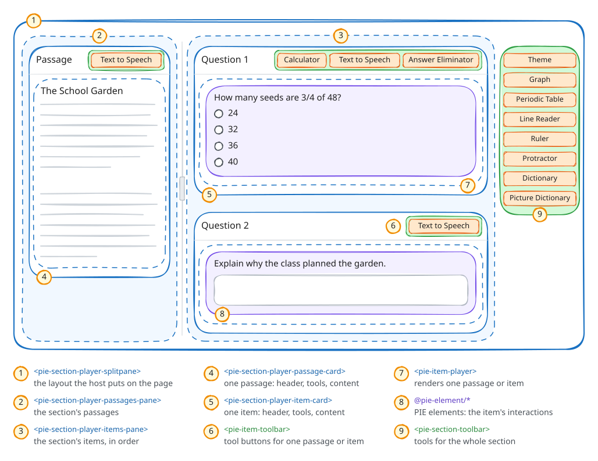
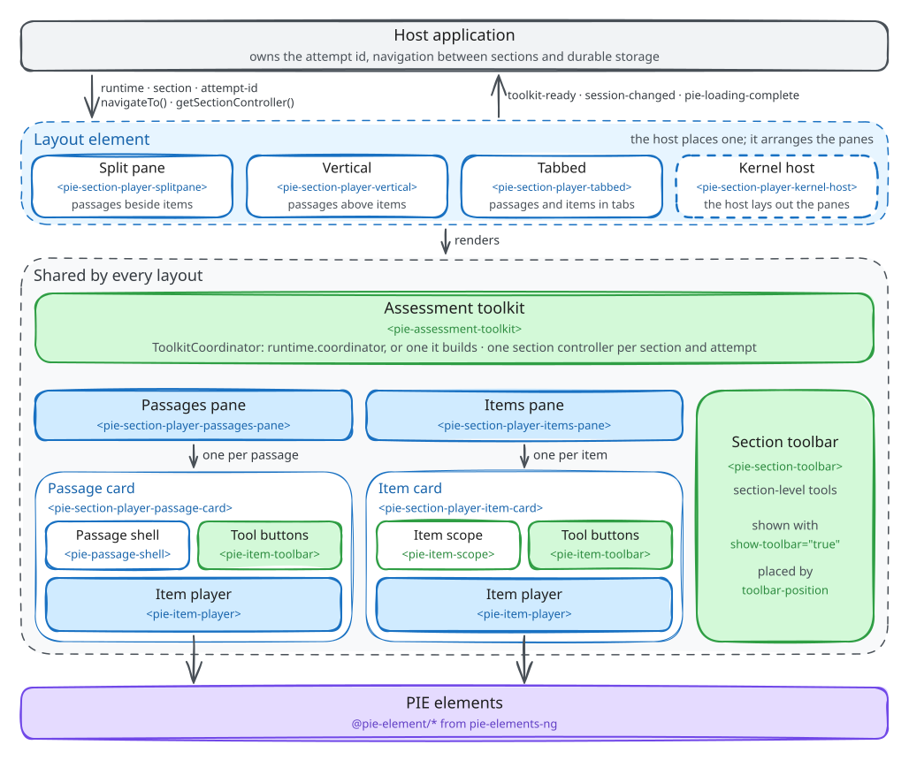
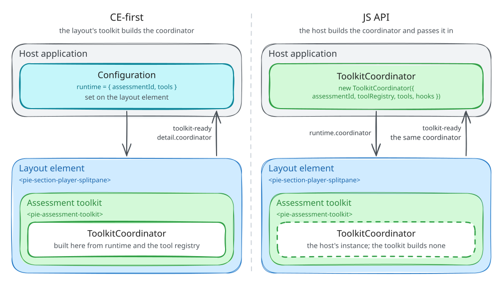
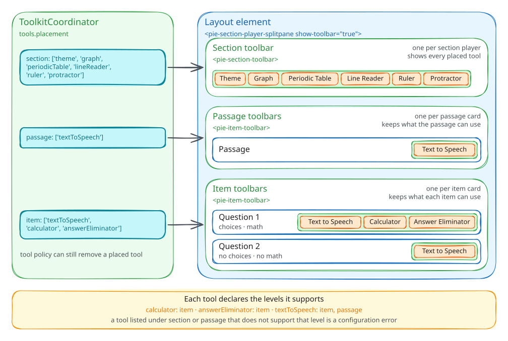
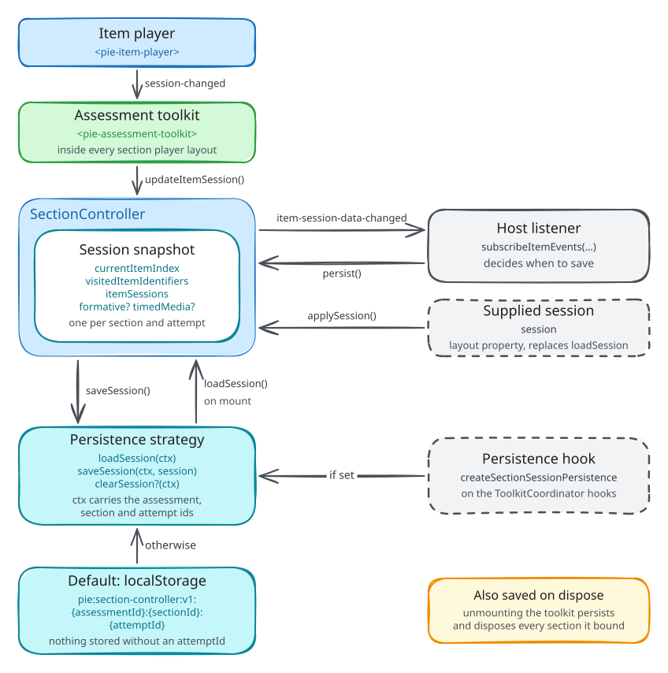
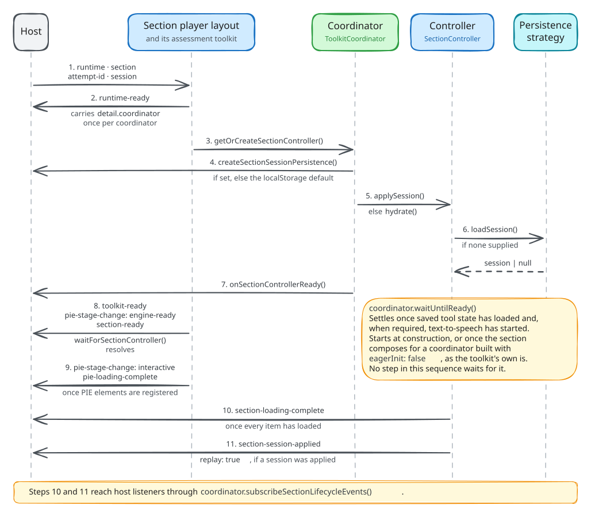

# Section Player Integration Guide

This guide is for developers integrating the section player and the assessment
toolkit into a host application. It assumes custom elements, TypeScript and
asynchronous browser code. It explains how the player, the toolkit and the host
divide the work, then covers the integration modes, content loading, tools,
theming, the section controller, session persistence, events and attempt reset.
The [section player README](../../packages/section-player/README.md) lists every
input, method and event, and the
[assessment toolkit README](../../packages/assessment-toolkit/README.md) the
coordinator's API.

---

## 1. Section Composition

PIE (Portable Interactions and Elements) elements and the item player render one
assessment item each: a multiple-choice question, a drag-and-drop interaction, a
constructed response. Several production systems embed item players directly,
handle sessions themselves and build their own composition layer; PIE is
adopted incrementally, one layer at a time.

An assessment screen composes more than one item:



A reading passage sits on the left and its questions on the right. Each card has
its own controls: read-aloud, calculator, answer eliminator. A toolbar on the
right edge holds the section-wide tools: the color-scheme tool (`theme`), graph,
periodic table, line reader, ruler, protractor and dictionaries. A production
host adds page navigation, flagging, notes and accommodation settings around it.
The section player and the assessment toolkit provide this composition layer:
passage and item layout, tool coordination, session persistence and the
accessibility plumbing.

A section maps to a page. It groups related content, a passage with its items or
a set of standalone items, into one view with shared tools, one session and its
own navigation scope, and one section fills one browser page.

The section is also where tools coordinate. Text-to-speech coordinates playback
across items and passages, the annotation overlay is mounted once per section,
and the section toolbar serves every item on the page. Each tool declares the
levels it supports: the calculator and the answer eliminator are item tools,
text-to-speech works on items and passages, and the line reader, ruler and
protractor work at section level too.

The toolkit treats tools and accommodations alike: text-to-speech is an
accommodation for one learner and a general tool for another, and both get the
same placement model, provider configuration and lifecycle. The host places
tools at section, passage and item level; the toolkit's policy engine then
decides which placed tools each learner receives, from district,
test-administration and item settings and the learner's Personal Needs and Preferences
(PNP) profile, which the host supplies as the `assessment` property
([tool policy](../architecture/architecture.md#tool-policy)).

Above the section layer, an assessment player routes between sections and owns
timing, submission and progress; the section player renders each page. The
[assessment player guide](../assessment-player/integration-guide.md)
builds that layer.

---

## 2. Architecture

The host places one layout element. Every layout renders its own assessment
toolkit, and the toolkit's `ToolkitCoordinator` creates one section controller
per cohort, the `(sectionId, attemptId)` pair.



**Layout element.** `<pie-section-player-splitpane>` puts passages beside items,
`<pie-section-player-vertical>` above them and `<pie-section-player-tabbed>` in
tabs; `<pie-section-player-kernel-host>` runs the section and leaves the
arrangement to the host ([custom layouts](./custom-layouts.md)). The layout
renders the composition, dispatches the public events and hands the host the
section controller. It is a framework-agnostic custom element.

**Assessment toolkit and coordinator.** The layout's `<pie-assessment-toolkit>`
uses the coordinator the host passes as `runtime.coordinator`, shares an
enclosing toolkit's, or builds one from `runtime`. The coordinator runs tool
availability and policy, text-to-speech, highlight coordination, accessibility
catalogs and the lifecycle of the section controllers. It holds no navigation
between sections, timing or progress. A host that did not build the coordinator
receives it from the `runtime-ready` and `toolkit-ready` events.

**Section controller.** The controller is the section's domain authority: it
owns navigation inside the section, the item sessions and the persistence
snapshot. The coordinator creates and caches it, and the layouts are transport
adapters around it
([controller ownership](../../packages/section-player/ARCHITECTURE.md#controller-ownership)).

**Host.** The host owns everything with business meaning: the `attemptId`,
navigation across sections and page loads, backend persistence, reset policy and
telemetry. It may itself be an outer assessment runtime that handles routing,
auth context and submission, with the section player embedded as a subsystem.

The player and toolkit run the section; durable data and navigation above it
stay with the host. A host stores `getSession()` snapshots and never
`getRuntimeState()` output, and the player never navigates between sections on
its own.

---

## 3. Integration Modes

A host integrates in one of two modes, which differ in who constructs the
`ToolkitCoordinator` and therefore in which coordinator hooks the host can
supply.



### CE-first

In CE-first (custom-element-first) mode the host sets the layout's attributes
and properties, and the toolkit builds the coordinator from `runtime`. Strings
and numbers are attributes; `runtime`, `section` and `session` are JavaScript
properties, and tools ride on `runtime.tools`. The
[inputs table](../../packages/section-player/README.md#inputs) lists every input.

```html
<pie-section-player-splitpane
  section-id="section-a"
  attempt-id="attempt-xyz"
  show-toolbar="true"
></pie-section-player-splitpane>
```

```ts
import "@pie-players/pie-section-player";
import { SECTION_PLAYER_PREFERRED_TOOL_PLACEMENT } from "@pie-players/pie-default-tool-loaders";
import type { SectionPlayerRuntimeHostContract } from "@pie-players/pie-section-player";

const player = document.querySelector<HTMLElement & SectionPlayerRuntimeHostContract>(
  "pie-section-player-splitpane",
);
if (player) {
  player.addEventListener("runtime-ready", (event) => {
    // Once per coordinator, before the first section starts.
    const { coordinator } = (event as CustomEvent).detail;
    hostServices.attach(coordinator);
  });
  player.runtime = {
    assessmentId: "assessment-1",
    tools: { placement: SECTION_PLAYER_PREFERRED_TOOL_PLACEMENT },
  };
  player.section = section;
}
```

The toolkit builds its coordinator without hooks, and no `runtime` field carries
any, so a CE-first host cannot install `createSectionSessionPersistence` before
the first controller exists. `setHooks()` from `toolkit-ready` is too late for
the first section: its strategy is already resolved and cached.
`runtime.createSectionController` is the one factory a CE-first host supplies in
time. Such a host restores through the `session` property and saves from
`session-changed` or `getSession()`, or sets a strategy on the controller with
`configureSessionPersistence()` ([Session persistence](#8-session-persistence)).

### JS API

In JS API mode the host constructs the coordinator and passes it as
`runtime.coordinator`. It controls initialization order and supplies every hook
at construction, `createSectionSessionPersistence` included. A host chooses this
mode when it owns auth context, session infrastructure or state across sections.

```ts
import { ToolkitCoordinator } from "@pie-players/pie-assessment-toolkit";
import { createPackagedToolRegistry } from "@pie-players/pie-default-tool-loaders";

const coordinator = new ToolkitCoordinator({
  assessmentId: "my-assessment-001",
  toolRegistry: createPackagedToolRegistry(),
  tools: {
    placement: {
      section: ["theme", "graph", "periodicTable"],
      item: ["calculator", "textToSpeech", "annotationToolbar"],
      passage: ["textToSpeech", "annotationToolbar"],
    },
    providers: {
      calculator: {
        provider: {
          runtime: { authFetcher: fetchDesmosCredentials },
        },
      },
    },
  },
  hooks: {
    onFrameworkError: (model) => reportError(model),
    createSectionSessionPersistence: (context) => buildPersistenceStrategy(context),
  },
});

playerEl.runtime = { ...(playerEl.runtime ?? {}), coordinator };
```

`toolkit-ready` still fires for each section and carries the host's own
coordinator, so it serves identity checks. A host that builds the coordinator
creates one per assessment context, a page or route, and passes the same
instance to every section player and debug panel on it; two coordinators for one
context drift in lifecycle timing and produce ambiguous event streams.

---

## 4. Content Loading

The host sets the section as the layout's `section` property, an
`AssessmentSection` that names its items, passages and rubric blocks. Each item
renders in a `<pie-item-player>`, and `runtime.playerType` selects that player's
loading strategy:

- **`iife`** (the default) injects `<script>` tags for IIFE bundles from the PIE
  bundle host, `https://proxy.pie-api.com/bundles/` unless
  `runtime.player.loaderOptions.bundleHost` names another host. It loads
  elements from both element repositories: legacy pie-elements packages load
  only this way.
- **`esm`** imports browser ESM builds from an npm CDN,
  `https://cdn.jsdelivr.net/npm` by default. Modules load concurrently, share the
  browser's module cache and deduplicate shared dependencies, and source maps
  work as for any ES module. pie-elements-ng packages serve it.
- **`preloaded`** loads no element code at run time. The host installs the
  pie-elements-ng packages the section needs, all from one release, and
  registers their ESM builds with `registerPreloadedElements`
  (`@pie-players/pie-item-player/preloaded`) before the section mounts, with the
  [asset root](../item-player/math-rendering.md#mathjax-assets) MathJax loads its
  fonts and speech data from. The trade: no element requests at run time, at the
  cost of a redeployment for every element version change. Generated
  `@pie-players/pie-preloaded-player` builds register the same way and are
  transitional ([preloaded player builds](../item-player/loading-strategies.md#preloaded-player-builds)).

[Loading strategies](../item-player/loading-strategies.md#loaderoptions) covers
`loaderOptions`: the bundle host, the ESM CDN and import-map mode.

Before the item cards mount, the section's **element pre-warm** validates every
item config and loads each element version the section's items and passages
name, once per version. Under `preloaded` it aligns authored versions with the
registered ones and asserts each registration. A failure leaves the items
unmounted and reports one `element-preload` framework error
([`strategy="preloaded"`](../item-player/loading-strategies.md#strategypreloaded)).

`pie-loading-complete` fires when the pre-warm resolves, before the items load.
The controller emits `section-loading-complete` once every registered item,
passage and rubric has loaded; `getRuntimeState()` exposes the `totalRegistered`
and `totalLoaded` counters behind it. `pie-stage-change` carries the lifecycle
(`composed`, `engine-ready`, `interactive`, `disposed`) as one typed event
([Player element events](#10-player-element-events)).

### Instrumentation

An `InstrumentationProvider` set at
`runtime.player.loaderConfig.instrumentationProvider` receives the item players'
resource events, the section player's `pie-section-*` stream, and the toolkit's
`pie-toolkit-*` stream with its tool and backend operational events. The streams
do not overlap. `loaderConfig` sets observability and retries; `loaderOptions`
sets loading. The learner responses in `session-changed` reach no provider by
default. The
[section player README](../../packages/section-player/README.md#instrumentation)
shows the wiring, the
[toolkit README](../../packages/assessment-toolkit/README.md#toolkit-owned-canonical-event-stream)
lists the toolkit stream, and
[Instrumentation providers](../architecture/instrumentation-providers.md#provider-resolution)
sets out how an unset, `null` or invalid provider resolves.

---

## 5. Tool Configuration

Tools are placed at three levels, section, item and passage, each with its own
toolbar.



Tool configuration is the coordinator's `tools`, or `runtime.tools` on a layout
whose toolkit builds the coordinator; the layouts have no `tools` property. It
normalizes to a `CanonicalToolsConfig`:

| Key | Holds |
| --- | --- |
| `placement` | `section`, `item` and `passage` arrays of tool ids. Placement is empty by default; `SECTION_PLAYER_PREFERRED_TOOL_PLACEMENT` from `@pie-players/pie-default-tool-loaders` is the packaged opt-in |
| `providers` | Per tool id: `enabled`, `provider` (`id` selects an implementation, `init` its settings, `runtime.authFetcher` fetches credentials from the host), and `settings` or tool-specific keys. `textToSpeech` and `calculator` take only the keys those tools read, so a misplaced key fails to compile |
| `policy` | `allowed` and `blocked`, host gates applied before the policy engine |
| `pnpEnforcement` | `"on"` or `"off"` overrides the automatic choice of whether toolbar decisions apply PNP policy |

`createPackagedToolRegistry()` registers fifteen tools. Fourteen are placeable
([canonical tool ids](../tools-and-accomodations/tool_provider_system.md#canonical-tool-ids));
the fifteenth, `transcript`, is a content region that validation rejects in any
placement. A tool placed at a level it does not support fails validation, which
throws under the default `tool-config-strictness` of `error`.

```ts
import type { ToolsConfigInput } from "@pie-players/pie-assessment-toolkit";

const tools: ToolsConfigInput = {
  placement: {
    section: ["theme", "graph", "periodicTable", "lineReader", "ruler"],
    item: ["calculator", "textToSpeech", "answerEliminator", "annotationToolbar"],
    passage: ["textToSpeech", "annotationToolbar"],
  },
  providers: {
    textToSpeech: {
      // "browser" or "server"; a server backend names its serverProvider.
      // Omit defaultVoice for automatic selection, or pin a voiceURI or name
      // from speechSynthesis.getVoices().
      backend: "browser",
    },
    calculator: {
      provider: {
        runtime: {
          authFetcher: async () => {
            const response = await fetch("/api/tools/desmos/auth");
            const { apiKey } = await response.json();
            return apiKey ? { apiKey } : {};
          },
        },
      },
    },
    annotationToolbar: { enabled: true },
  },
};
```

A tool in `item` gets a button in each item card, a tool in `passage` one in each
passage card, and a tool in `section` goes to the section toolbar, which renders
only when `show-toolbar` is set. A tool in no placement array is not shown, even
with provider configuration. `annotationToolbar` renders no button: placing it
admits the highlighter overlay the section mounts.

Desmos is the default calculator, and its adapter refuses to load Desmos without
an API key or a proxy endpoint. A licensed deployment supplies the key through
`provider.runtime.authFetcher`
([calculator with host auth](../tools-and-accomodations/tool_provider_system.md#calculator-with-host-auth)).
The documented browser integration puts the key in the script URL, so runtime
delivery keeps it out of the static bundle without making it secret; see the
[Desmos API Terms](https://www.desmos.com/api-terms).
`provider.id: "calculator-cortex"` selects a calculator that needs no key.

Once the section has initialized, a change to `runtime.tools`,
`runtime.assessmentId`, `runtime.accessibility`, `runtime.lazyInit`,
`tool-config-strictness` or `toolRegistry` does not reach a coordinator the
player built; `runtime.tools.pnpEnforcement` still applies. A host changes a
running coordinator with `updateToolConfig(...)` or `updateToolsPlacement(...)`
([usage](../../packages/section-player/README.md#usage)).

The coordinator exposes its services for host code that works outside the
player, such as a TTS control panel or annotation toolbar the host renders
itself:

```ts
coordinator.ttsService;            // TTSService: playback lifecycle, provider abstraction
coordinator.toolCoordinator;       // ToolCoordinator: tool visibility and stacking
coordinator.highlightCoordinator;  // HighlightCoordinator: TTS and annotation highlight layers
coordinator.elementToolStateStore; // ephemeral per-element tool state
coordinator.catalogResolver;       // QTI 3.0 accessibility catalog resolution
```

The TTS service speaks through the browser's Web Speech API by default, or
through a TTS server (`backend: "server"`, with `serverProvider` `polly`,
`google` or `custom`); a host implements `ITTSProvider` from `@pie-players/pie-tts`
for any other backend. The highlight coordinator keeps two independent layers,
TTS word and sentence tracking and learner annotations, in the browser's CSS
Custom Highlight API, which mutates no DOM. The
[toolkit README](../../packages/assessment-toolkit/README.md#service-apis) covers
the service APIs.

### Custom TTS transport

A host routes text-to-speech through its own server with
`serverProvider: "custom"` and `transportMode: "custom"` under
`tools.providers.textToSpeech`. The browser calls only the host's proxy route,
which holds the credentials and signs the upstream request, so no secret reaches
the browser. The toolkit enables this transport only when the host configures
it. The
[toolkit README](../../packages/assessment-toolkit/README.md#custom-transport-via-server-proxy-sc-style)
gives the configuration and the host boundary.

The `<pie-section-player-tools-tts-settings>` panel adds a tab per entry in its
`customProviders` property
([custom provider tabs](../../packages/section-player-tools-tts-settings/README.md#custom-provider-tabs)).
A tab's optional `preview(context)` plays sample audio: the context carries
`previewText` and `previewMode`, and the hook returns
`{ audioUrl, speechMarks, trackingText }` for the panel to play and track.

---

## 6. Theming

PIE item elements and toolkit UI read shared theme tokens (`--pie-*`) for
colors, contrast states and font scaling. The `<pie-theme>` custom element from
`@pie-players/pie-theme` resolves them for its subtree, or for the whole
document with `scope="document"`; importing `@pie-players/pie-theme` registers
it.

```html
<pie-theme theme="auto">
  <pie-section-player-splitpane ...></pie-section-player-splitpane>
</pie-theme>
```

The color-scheme tool (`theme`) is the learner's control: it writes the
learner's requested scheme to the nearest `<pie-theme>`. Attributes, provider
adapters (DaisyUI is built in), registered custom schemes and the
stylesheet-only path are in the
[theme package README](../../packages/theme/README.md);
[How theming works](../theming/how-theming-works.md) covers how they fit
together.

---

## 7. Section Controller Handle

`SectionControllerHandle` is the host's programmatic interface to the section
runtime. The coordinator creates the controller when the section starts, in
`getOrCreateSectionController`, and caches it per cohort. It builds it through
its own `hooks.createSectionController` when set, otherwise through the factory
the layout passes, `runtime.createSectionController` or the default
`SectionController`. The layout hands the controller to the host once it is
published.

### Access

The controller is never available synchronously after mounting.
`waitForSectionController(timeoutMs)` resolves once it is published, or with the
lookup result, possibly `null`, at the timeout:

```ts
const controller = await playerEl.waitForSectionController(5000);
if (!controller) throw new Error("Section controller did not become ready");
```

A host already listening to `pie-stage-change` reads it from the coordinator at
`engine-ready`:

```ts
playerEl.addEventListener("pie-stage-change", (event) => {
  if (event.detail.stage !== "engine-ready") return;
  const controller = coordinator.getSectionController({ sectionId, attemptId });
});
```

### Session state

```ts
// The serialization-safe snapshot: the persistence payload.
const session = controller.getSession();
// { currentItemIndex, visitedItemIdentifiers, itemSessions, formative?, timedMedia? }

// Introspection only: derived, ephemeral fields with no stability guarantee.
const runtime = controller.getRuntimeState();
// { loadingComplete, totalRegistered, totalLoaded, currentItemIndex,
//   itemIdentifiers, itemSessions, itemsComplete, completedCount, totalItems, ... }
```

`getSession()` is the only payload to persist; `formative` and `timedMedia`
appear when the section uses them. `getRuntimeState()` serves diagnostics.

```ts
// Restore a full snapshot, as on page load.
await controller.applySession(snapshotFromBackend, { mode: "replace" });

// Overlay a partial snapshot item by item.
await controller.applySession(partialSnapshot, { mode: "merge" });

// Write one item's session; synchronous.
controller.updateItemSession("item-q1", {
  session: { id: "item-q1-session", data: [{ id: "choice", value: "b" }] },
  complete: true,
});
```

### Persistence calls

```ts
// Load the session through the configured strategy and apply it.
await controller.hydrate();

// Save the current getSession() snapshot through the strategy.
await controller.persist();

// Dispose the controller.
await coordinator.disposeSectionController({
  sectionId,
  attemptId,
  persistBeforeDispose: true, // the default; false skips the save
  clearPersistence: false,    // true calls the strategy's clearSession()
});
```

`disposeSectionController` persists unless `persistBeforeDispose` is `false`,
disposes the controller, calls the coordinator's `onSectionControllerDispose`
hook, and then calls `clearSession()` when `clearPersistence` is set. Unmounting
the toolkit persists and disposes every section it bound; until then, the
controllers of sections the learner has left stay cached.

---

## 8. Session Persistence

A persistence strategy loads and saves a section's `getSession()` snapshot. The
coordinator resolves one per `(assessmentId, sectionId, attemptId)`, from its
`createSectionSessionPersistence` hook or the default, and caches it for the
lifetime of that controller.



The section player applies what its strategy stores. The default strategy keeps
the session in `localStorage` under
`pie:section-controller:v1:{assessmentId}:{sectionId}:{attemptId}`, and a
controller created without a `session` hydrates from it. Without an attempt id
it neither reads nor writes: nothing would then tell two learners on one device
apart. A host passes a per-learner `attempt-id` for a section to survive a
reload, and replaces the strategy through the coordinator's
`hooks.createSectionSessionPersistence` to store sessions in its own backend.
The [item player's session snapshots](../item-player/overview.md) are offered to
the host instead, and follow the same rule on identity.

### Strategy

```ts
import { ToolkitCoordinator } from "@pie-players/pie-assessment-toolkit";

const coordinator = new ToolkitCoordinator({
  assessmentId,
  toolRegistry,
  tools,
  hooks: {
    createSectionSessionPersistence(context, defaults) {
      const { assessmentId, sectionId, attemptId } = context.key;

      return {
        async loadSession() {
          return (await api.sessions.load({ assessmentId, sectionId, attemptId })) ?? null;
        },

        async saveSession(_ctx, session) {
          await api.sessions.save({
            assessmentId,
            sectionId,
            attemptId,
            snapshot: session ?? { itemSessions: {} },
          });
        },

        async clearSession() {
          await api.sessions.delete({ assessmentId, sectionId, attemptId });
        },
      };
    },
  },
});
```

The hook receives `context`, whose `key` holds `assessmentId`, `sectionId` and
`attemptId`, and `defaults`, whose `createDefaultPersistence()` builds the
`localStorage` strategy. An offline-first host wraps that strategy as a local
cache in front of its backend. A host with its own session identifiers closes
over them from the surrounding scope: the key addresses the storage slot, and the
snapshot is what the strategy stores.

### Supplying the session

A host that already holds the section's session sets it as the layout's
`session` property with `section`, and the strategy's `loadSession` is not called
for that controller:

```ts
playerEl.section = section;
playerEl.session = snapshotFromBackend; // a getSession() snapshot
```

The controller created for `section` applies the session in replace mode in
place of `hydrate()`. The strategy is still resolved and still receives every
`persist()`. A later assignment updates the published controller, and an echo of
`session-changed` is a no-op; the
[section player README](../../packages/section-player/README.md#session-lifecycle)
gives the rules.

### Saving

The host decides when to save. It calls `controller.persist()` from a
coordinator subscription; the subscription follows the active cohort across
navigation, so one listener serves every section. Saves run one at a time, in
call order, so an older write never lands after a newer one, and a fingerprint
skips writes that would store an unchanged snapshot:

```ts
let lastFingerprint: string | null = null;

coordinator.subscribeItemEvents({
  // item-selected carries navigation-only changes: currentItemIndex and visited items.
  eventTypes: ["item-session-data-changed", "item-selected"],
  listener: () => {
    const controller = coordinator.getSectionController({ sectionId, attemptId });
    if (!controller?.persist) return;

    const fingerprint = JSON.stringify(controller.getSession());
    if (fingerprint === lastFingerprint) return;

    lastFingerprint = fingerprint;
    void controller.persist();
  },
});
```

A listener on the controller handle's `subscribe()` works too, but stays bound
to that one controller ([Controller events](#9-controller-events-and-subscriptions)).

### Hydration sequence



A section starts in this order:

1. The host sets the layout's inputs: `runtime` (with `assessmentId`, and
   `coordinator` when the host built one), `section`, `section-id`,
   `attempt-id`, and `session` when it holds one. Once the composition
   resolves, the layout dispatches `pie-stage-change` with `composed`.
2. The toolkit dispatches `runtime-ready` with `detail.coordinator`, once per
   coordinator, before it requests the first controller.
3. The toolkit requests the section's controller from the coordinator.
4. The coordinator resolves the persistence strategy: the
   `createSectionSessionPersistence` hook's, else the `localStorage` default.
   It creates the controller and configures it with that strategy.
5. With a `session`, the controller applies it with
   `applySession(session, { mode: "replace" })`. Without one, `hydrate()` calls
   the strategy's `loadSession`.
6. `loadSession` returns the stored snapshot, which the controller applies, or
   `null`, which leaves the session empty.
7. The coordinator publishes the controller and calls its
   `onSectionControllerReady` hook.
8. `toolkit-ready` fires, then `pie-stage-change` with `engine-ready`, then
   `section-ready`. `waitForSectionController()` resolves here, and the
   controller already holds the restored session.
9. The element pre-warm resolves: `pie-stage-change` enters `interactive` and
   `pie-loading-complete` fires.
10. The item cards mount, and once every item has loaded the controller emits
    `section-loading-complete`.
11. If a session was applied in step 5 or 6, the controller announces it again
    as `section-session-applied` with `replay: true`.

The replay exists because the session is applied before any item element has
registered. `applySession` writes the snapshot into the controller's model, and
an element receives session data only once it exists. The replay runs after
`section-loading-complete`, when every element is present, and re-applies the
same snapshot to the complete item set. A fresh attempt with nothing stored gets
no replay.

The first apply runs before the controller is published, so no subscriber
receives its `section-session-applied`. A subscriber sees the replay
(`replay: true`) and each apply the host makes later (`replay: false`); a host
that reacts to restored state handles the replay.

`coordinator.waitUntilReady()` settles once saved tool state has loaded and,
when policy requires it, text-to-speech has started. It starts at construction,
or once the section composes for a coordinator built with `eagerInit: false`, as
the toolkit's own is. No step of the sequence waits for it.

**Empty sessions.** When `loadSession` returns `null` or an empty `itemSessions`
map, items render with no prior responses. Some PIE element runtimes clear their
UI only for an explicit empty response shape (for example
`{ id: "item-id", data: [] }`) and keep showing a response whose key is merely
absent. A host whose items fail to clear after a reset supplies that explicit
empty shape per item, in its `loadSession` result or the `session` property,
instead of deleting the row or returning `null`. The shape is element-specific;
the element's session schema defines it.

---

## 9. Controller Events and Subscriptions

The coordinator's subscription helpers filter the controller event stream and
follow the active cohort, the `(sectionId, attemptId)` pair, across section
changes. The
[section player README](../../packages/section-player/README.md#controller-events)
lists every event and its payload.

### Item events

Item events follow individual response interactions:

```ts
const unsubscribe = coordinator.subscribeItemEvents({
  listener: (event) => {
    switch (event.type) {
      case "item-session-data-changed":
        // event.itemId, event.session, event.complete, event.currentItemIndex
        break;
      case "item-complete-changed":
        // event.itemId, event.complete, event.previousComplete
        break;
      case "item-selected":
        // event.currentItemId, event.previousItemId, event.itemIndex
        break;
      case "content-loaded":
        // event.itemId, event.canonicalItemId,
        // event.contentKind ("item" | "passage" | "rubric" | "unknown")
        break;
      case "item-session-meta-changed":
        // event.itemId: session metadata changed
        break;
      case "item-player-error":
        // event.itemId, event.canonicalItemId, event.contentKind, event.error
        break;
    }
  },
});

// On route teardown.
unsubscribe();
```

When the active section changes, the listener moves to the new controller and
receives a snapshot replay in the order a fresh subscriber would have seen it:
`content-loaded` for each of the new section's renderables, then
`section-loading-complete`. A subscription narrows by event type and item id:

```ts
coordinator.subscribeItemEvents({
  eventTypes: ["item-session-data-changed", "item-complete-changed"],
  itemIds: ["item-q1", "item-q2"],
  listener: handleSessionChange,
});
```

### Section lifecycle events

Section lifecycle events cover loading, completion and errors:

```ts
const unsubscribe = coordinator.subscribeSectionLifecycleEvents({
  listener: (event) => {
    switch (event.type) {
      case "section-loading-complete":
        // event.totalRegistered, event.totalLoaded
        break;
      case "section-items-complete-changed":
        // event.complete, event.completedCount, event.totalItems
        break;
      case "section-session-applied":
        // event.mode, event.replay, event.itemSessionCount
        break;
      case "section-navigation-change":
        // event.previousSectionId, event.currentSectionId, event.attemptId,
        // event.reason ("input-change" | "runtime-transition")
        break;
      case "section-error":
        // event.source, event.error
        break;
    }
  },
});
```

The listener follows navigation the same way, and each move replays the new
cohort's `section-loading-complete` when it has fired. The defaults of both
helpers leave out the formative events and `timed-media-audio-started`;
`subscribeSectionEvents({ listener, eventTypes, itemIds })` names any event type.

### Controller subscription

```ts
const controller = await playerEl.waitForSectionController(5000);
const unsubscribe = controller?.subscribe?.((event) => {
  // every SectionControllerEvent
});
```

The handle's `subscribe()` stays bound to that one controller instance and ends
with it; it does not follow navigation.

### Subscription timing

A helper called before the coordinator's first `getOrCreateSectionController`
request throws ("requires an active section cohort"). `runtime-ready` fires
before that request, so a listener that subscribes inside `runtime-ready` throws
on the first section. A host subscribes from `toolkit-ready` or later, and one
subscription then survives all later navigation. A listener added while a
section is starting binds when that section becomes active.

---

## 10. Player Element Events

Session data, item loading and completion arrive through the controller events
([Controller events](#9-controller-events-and-subscriptions)), which are typed
and scoped. The layout element also dispatches DOM events, all bubbling and
composed, so a listener on the layout or on `document` receives them; the
[section player README](../../packages/section-player/README.md#dom-events)
lists their payloads.

| Event | `runtime` callback | Fires | Host use |
| --- | --- | --- | --- |
| `runtime-ready` | — | Once per coordinator, before the first section starts | The earliest point a host holds the coordinator |
| `toolkit-ready` | — | For each section the toolkit initializes, in both modes, with the coordinator in `detail.coordinator` | Read the coordinator, or check its identity |
| `section-ready` | — | After that section's `toolkit-ready` and its `engine-ready` stage, with the controller | Read the controller |
| `pie-stage-change` | `onStageChange(detail)` | Each stage entered: `composed`, `engine-ready`, `interactive`, `disposed` | Gate "start test" UI on `interactive` |
| `pie-loading-complete` | `onLoadingComplete(detail)` | Once per cohort, when the element pre-warm resolves and the item cards can mount | Mark the section's elements ready |
| `framework-error` | `onFrameworkError(model)` | Each failure that crosses the framework boundary, once | Error UX |

Each `runtime` callback fires at the same emit point as its DOM event, so the two
stay in step across cohort changes. A non-recoverable framework error or a
failed element pre-warm before `interactive` ends the stage chain: the first
stage the section did not reach is emitted as `failed` and any after it as
`skipped`, so a host waiting on `engine-ready` or `interactive` always gets an
answer.

- An item-loading indicator stays up until the controller's
  `section-loading-complete`; `pie-loading-complete` precedes the item loads.
- `framework-error` covers coordinator and runtime initialization, tool
  configuration, provider and TTS initialization, tool runtime and surface
  failures and the element pre-warm. The DOM event and `onFrameworkError` each
  deliver every error once; consume either. `recoverable` separates a warning
  that kept the assessment running, such as one optional tool surface failing,
  from an error that blocks readiness.

The layout also dispatches `session-changed`, `composition-changed`,
`runtime-owned` and `runtime-inherited`, each once through the layout element to
`document`. `session-changed` carries the normalized item session with `itemId`,
`canonicalItemId` and `sourceRuntimeId`; the controller events remain the typed,
scoped surface for session state.

---

## 11. Attempt Reset

The host owns the `attemptId`. A standalone deployment reflects it in the URL,
so a page refresh and back navigation restore the right attempt. In an embedded
integration the outer player owns it and passes it in as `attempt-id`; the
section player never derives or stores one.

Most deployments manage attempts on the server: the host sends the learner to a
new attempt with a backend-minted `attemptId`, and the player mounts fresh. A
client-side reset serves demo and test apps, authoring previews that clear
responses, and proctoring tools that invalidate an attempt in progress without
a page navigation:

```ts
async function resetAttempt(sectionId: string, currentAttemptId: string) {
  // Dispose the current controller without saving it, and clear its stored session.
  await coordinator.disposeSectionController({
    sectionId,
    attemptId: currentAttemptId,
    persistBeforeDispose: false,
    clearPersistence: true,
  });

  // Start the section again under a new attempt.
  playerEl.attemptId = generateAttemptId();
}
```

- A new `attemptId` signals a fresh start to the coordinator, the backend and
  any observability tooling. Reusing the same `attemptId` after clearing works
  when the backend supports it and the strategy's next `loadSession` handles the
  cleared state.
- The dispose comes first: without `persistBeforeDispose: false` the coordinator
  saves the session before disposing, and controllers of earlier attempts stay
  cached until the toolkit unmounts.
- `clearPersistence: true` calls the strategy's `clearSession()`, so a strategy
  that resets attempts implements it.
- On a route unmount without a reset, the toolkit persists and disposes its
  sections itself.
