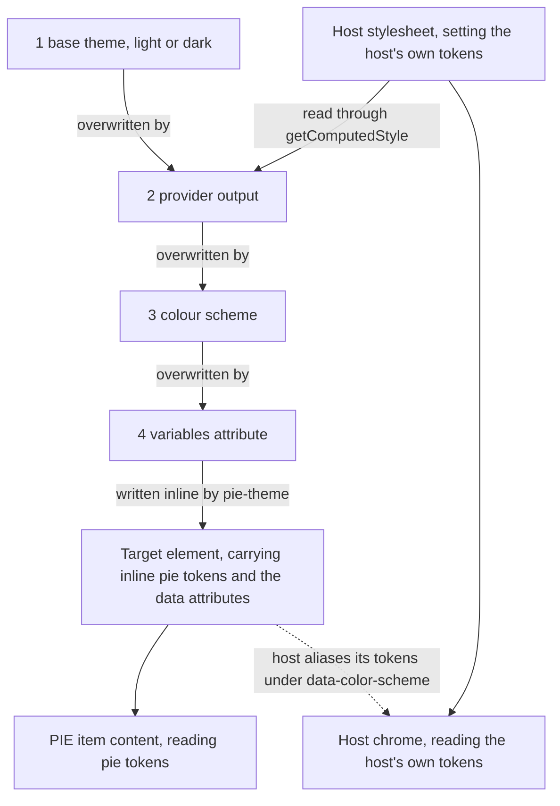

# How theming works

`<pie-theme>` computes PIE's colour tokens and writes them onto one element.
Everything below follows from two CSS rules and one namespace boundary.

For the element's attribute reference, the runtime API and the custom-scheme
contract, see [`../../packages/theme/README.md`](../../packages/theme/README.md).

## Custom properties

A custom property is a named value. `--pie-background: #ffffff` declares one;
`background: var(--pie-background)` reads it. CSS attaches no meaning to the
name, so a property does nothing until some rule reads it — PIE's element
bundles and player chrome read the `--pie-*` family, which is what makes them
themeable at all. `@pie-players/pie-theme/token-registry.json` lists every token
with its owner, scope, category and scheme participation.

Two rules about custom properties decide the rest of this document.

**They inherit.** Declared on `<html>`, a property is visible to every element
on the page, including inside shadow DOM. One write reaches item content the
host never renders itself.

**An inline declaration beats a stylesheet.** `style="--pie-background: red"` on
an element wins over any stylesheet rule targeting that element, at any
specificity, with no `!important` involved. `<pie-theme scope="document">` writes
inline, so a host stylesheet that declares `--pie-*` cannot compete with a
mounted element — not even one shipping the values pie-theme would have resolved
anyway. Host CSS declares `--pie-*` only in a stylesheet-only integration, where
no element is mounted and the normal cascade applies.

## Resolution order



Four overlays merge in order, each overwriting tokens the previous one set.

1. **Base theme.** `theme="light|dark|auto"`, where `auto` follows
   `prefers-color-scheme`. There are exactly two base palettes. Any other theme
   id — every DaisyUI name among them — resolves to the light base, while the
   string itself still reaches `data-theme` for the host's own stylesheet to
   match on.
2. **Provider output.** Colours derived from whatever palette the host page
   already has.
3. **Colour scheme.** A resolved accommodation, replacing the palette it
   participates in.
4. **`variables`.** A JSON object on the element, for deliberate per-instance
   overrides.

`scope="document"` writes the result onto `<html>`; `scope="self"` writes onto
the element, which scopes a palette to one subtree.

Alongside the values the element stamps selector hooks — `data-theme` carrying
the requested theme, `data-color-scheme` the requested scheme id — and sets the
`color-scheme` CSS property, but only from a resolved scheme. See
[The `color-scheme` collision](#the-color-scheme-collision).

## Provider adapters

`provider` decides where step 2's colours come from, which is the choice between
PIE content looking like PIE and looking like the host. Both are legitimate:
a vendor embedding items in its own branded app wants the second, and anyone
reviewing content, comparing two releases or printing wants the first, because a
canonical palette is the reproducible one.

- `none` resolves no adapter, leaving the base theme's own palette. Identical in
  every host.
- `auto`, the default, lets any registered adapter that can read the target win.
- A provider id names one explicitly.

One adapter ships: `daisyui`. It reads twelve DaisyUI slots off the target with
`getComputedStyle` and maps them onto 48 `--pie-*` tokens through
`DAISYUI_PIE_TOKEN_MAP`, which is the sole source for that mapping.

It corrects as it maps, and that is why the integration is an adapter rather
than a stylesheet. DaisyUI picks `--color-success` to sit legibly behind
`--color-success-content`, not against the page, so PIE painting it as text is
frequently unreadable. For those tokens the adapter measures the resolved colour
on a canvas and blends toward the ink until the pair clears 4.5:1, or 3:1 for a
control boundary. CSS cannot measure a colour, so a stylesheet can only apply a
fixed pessimistic blend to every slot whether it needs one or not.

`registerPieThemeProvider` is the extension point. A host on another token
vocabulary registers an adapter that reads `--acme-*` and returns `--pie-*`, and
`auto` finds it with no change to the markup.

## Token namespaces

pie-theme writes `--pie-*` and nothing else. It never writes `--color-*`, or any
other host prefix, in any mode.

That boundary decides two things. Switching a theme recolours PIE content and
leaves host chrome to the host, which is correct for presentation. And a host
that wants its own chrome to follow PIE aliases in its own stylesheet, in the
direction that works:

```css
[data-color-scheme] {
  --color-base-100: var(--pie-background);
  --color-base-content: var(--pie-text);
  --color-primary: var(--pie-primary);
  /* one line per slot the chrome reads */
}
```

No dependency, and it wins because pie-theme never touches `--color-*` — there
is nothing to lose the cascade to. The same shape serves any vocabulary, which
is what a non-DaisyUI design system needs regardless.

Gate that block on `[data-color-scheme]` rather than applying it always.
`<pie-theme>` stamps the attribute only for a scheme, and the default palette's
`--pie-background` ships transparent, so aliasing a chrome background to it
would strip that background on every ordinary page.

## Themes versus colour schemes

A theme is presentation. A colour scheme is an accommodation under WCAG 2.2 AA —
1.4.1, 1.4.3 and 1.4.11 — and the distinction is enforced rather than
conventional.

- A built-in scheme replaces every colour it participates in, rather than
  tinting an existing palette.
- Every built-in sets `--pie-fixed-hue-collapse: 100%`, folding a component's
  own fixed hues into the palette, because a two-colour palette cannot carry
  meaning in hue. A custom scheme keeps such an encoding by declaring `0%`
  itself.
- Registration validates each token against the registry's
  required/optional/excluded participation, atomically per entry, and the
  resolver contrast-measures the result and warns.
- A requested id that is not registered resolves to `unavailable`: the base and
  provider result stands, the id is retained on the element, and a scheme
  registered later takes effect.

## The `color-scheme` collision

`color-scheme` is a CSS property with a fixed meaning of its own, unrelated to
PIE's colour schemes: it tells the browser whether to paint its own widgets —
`select` text, scrollbars, checkboxes, native date pickers — light or dark.
Custom properties cannot reach those. Only this keyword can.

`<pie-theme>` sets it from a resolved scheme only, choosing the keyword by
whether black or white contrasts better against the resolved `--pie-background`.
A base theme leaves it alone, because a host stylesheet already declares the
polarity of its own themes, and restating that from PIE's palette would take the
decision away from every host that never asked for an accommodation. Clearing a
scheme restores the host's own declaration rather than deleting it. A background
the resolver cannot read as an opaque colour also leaves it alone.

The consequence for a host: driving `theme="dark"` into the element does not
darken native controls. That stays the host's own `color-scheme` declaration to
make.
