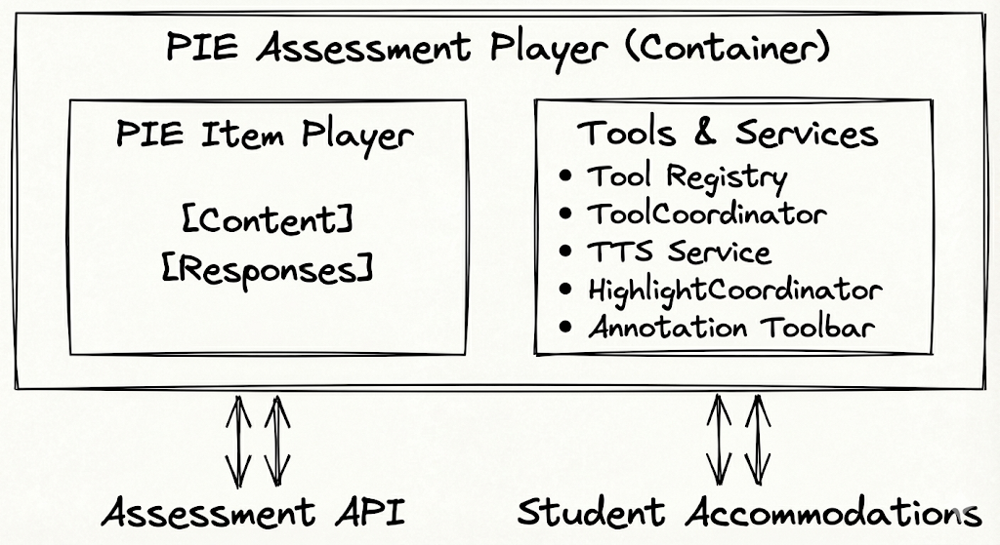
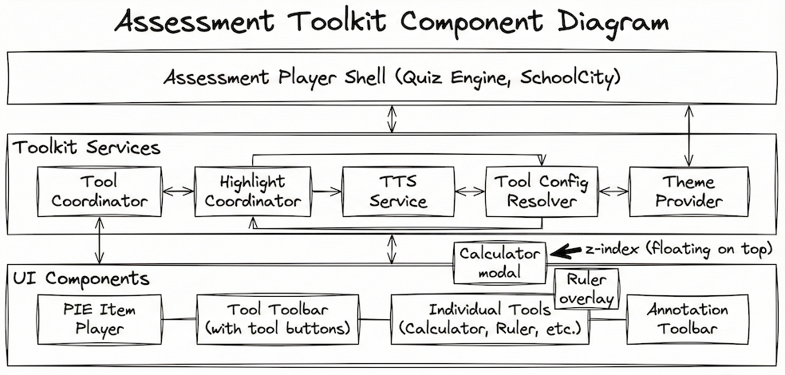
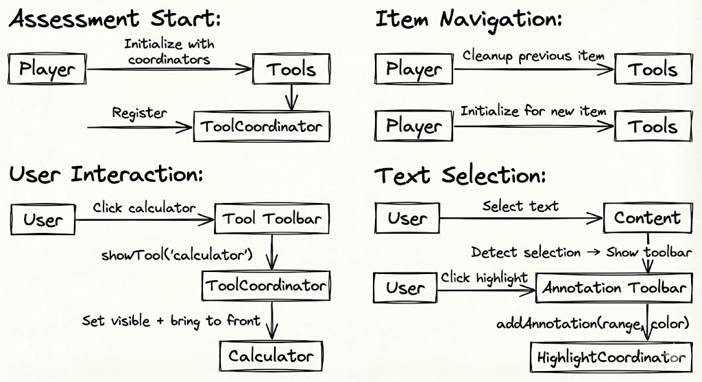
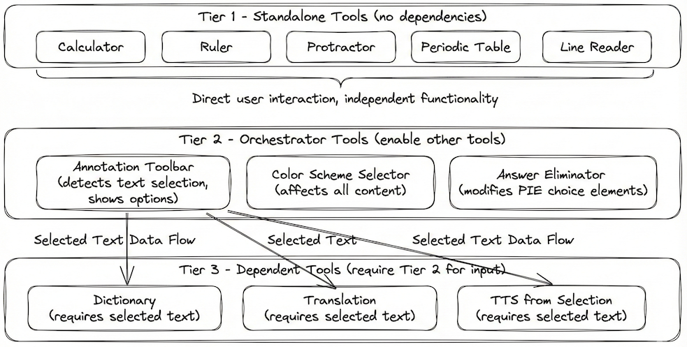

# PIE Assessment Tools & Accommodations Architecture

---

## Executive Summary

This document describes the architecture of the PIE assessment tools and accommodations system—a flexible, extensible toolkit that provides students with accessibility tools and accommodations during online assessments. The system supports essential accommodations such as text-to-speech, highlighting, calculators, rulers, and other assistive tools while aiming for WCAG 2.2 AA adherence.

The architecture leverages modern web standards (CSS Custom Highlight API, Web Components) to provide a framework-agnostic solution that integrates seamlessly with PIE-based assessment platforms.

---

## Table of Contents

1. [Architectural Principles](#architectural-principles)
2. [System Context](#system-context)
3. [Component Architecture](#component-architecture)
4. [Tool Hierarchy](#tool-hierarchy)
5. [Core Services](#core-services)
6. [Integration Patterns](#integration-patterns)
7. [Technology Stack](#technology-stack)
8. [Accessibility & Accommodations](#accessibility--accommodations)
9. [Production Status](#production-status)

---

## Architectural Principles

### Separation of Concerns

Tools are independent, self-contained components. Shared services (TTS, highlighting) are factored into reusable infrastructure. The player container orchestrates without coupling to tool internals.

**Benefit:** Tools can be developed, tested, and deployed independently. New tools can be added without modifying existing infrastructure.

### Modern Web Standards First

The architecture leverages native browser APIs that are now widely supported, reducing dependency on third-party libraries and enabling cleaner, more maintainable implementations.

**Key Standards Used:**
- **CSS Custom Highlight API** - Text highlighting without DOM mutation
- **Web Components** - Framework-agnostic custom elements
- **Web Speech API** - Browser-native text-to-speech
- **CSS Container Queries** - Responsive tool layouts

**Benefit:** Better performance, reduced bundle size, improved accessibility, and future-proof implementation.

### Framework Agnostic

Tools use the Web Components standard with internal implementation in Svelte 5. The public API surface is clean and consumable by any JavaScript framework.

**Benefit:** Assessment platforms using React, Vue, Angular, or vanilla JavaScript can integrate tools without friction.

### Zero DOM Mutation

Tools never modify PIE item content DOM directly. Visual effects use modern browser APIs (CSS Custom Highlight API) that work above the DOM layer.

**Benefit:** Preserves framework virtual DOM integrity, maintains screen reader compatibility, and eliminates security risks from innerHTML manipulation.

### Accessibility First

WCAG 2.2 AA adherence is the primary requirement. All tools support keyboard navigation and screen reader compatibility. The system supports accommodations required by IEP and 504 plans.

**Legal Context:** Public education agencies receiving federal funds must comply with Section 508 (ADA) and Section 504 (Rehabilitation Act). WCAG conformance is the standard for meeting these legal obligations.

---

## System Context

### Purpose

The PIE Assessment Tools system provides:

1. **Accessibility accommodations** for students with disabilities
2. **Testing tools** required by assessment content
3. **Assistive technology integration** for equitable access
4. **Reference materials** (periodic table, formula sheets)

### Stakeholders

- **Students** - Primary users requiring accommodations
- **Assessment Administrators** - Configure available tools per test
- **Content Authors** - Specify required tools per item
- **Platform Integrators** - Embed toolkit in assessment systems
- **Accessibility Coordinators** - Ensure compliance with accommodation plans

### System Boundary



**In Scope:**
- Tool implementations (calculator, ruler, protractor, etc.)
- Coordination services (z-index, highlighting, TTS)
- Annotation infrastructure (highlight, underline)
- Accommodation configuration

**Out of Scope:**
- Assessment content authoring
- Item response validation
- Session management and timing
- Score reporting

---

## Component Architecture



### High-Level Components

**Section Player Container** (Primary Interface)
- Renders QTI 3.0 sections with passages and items
- Automatic SSML extraction from embedded `<speak>` tags
- Manages accessibility catalog lifecycle
- Integrates toolkit services (TTS, tools, highlighting)
- Renders TTS tools inline in passage/item headers

**PIE Item Player**
- Renders individual assessment items
- Manages PIE element instances
- Collects and validates responses
- Provides content queries for tools

**Tool Registry & Toolbar**
- Central tool registry and launcher
- Manages tool button states
- Delegates to ToolCoordinator for visibility
- Tool configuration UI

**Individual Tools**
- Self-contained functionality (calculator, ruler, etc.)
- Manage own UI and state
- Register with ToolCoordinator
- Communicate via events/props

**Annotation Toolbar**
- Text selection detection
- Floating toolbar on selection
- Gateway to dictionary, translation, TTS
- Annotation creation (highlight/underline)

### Component Interactions



---

## Tool Hierarchy



### Three-Tier Architecture

Tools are organized into three tiers based on their dependencies:

#### Tier 1: Standalone Tools

**Characteristics:**
- No dependencies on other tools
- Direct user interaction
- Independent functionality
- Modal or floating UI

**Examples:**
- Calculator (basic, scientific, graphing)
- Ruler (metric/imperial)
- Protractor
- Periodic Table
- Graph Tool
- Line Reader (masking overlay)

#### Tier 2: Orchestrator Tools

**Characteristics:**
- Enable other tools
- Detect user intent or content state
- Coordinate multiple functions
- May have own UI

**Examples:**
- Annotation Toolbar (text selection gateway)
- Color Scheme Selector
- Answer Eliminator

**Why This Tier Matters:**
- Encapsulates complex selection logic once
- Provides consistent UX for text-based tools
- Centralizes accessibility implementation

#### Tier 3: Dependent Tools

**Characteristics:**
- Require Tier 2 orchestrator for input
- Cannot function standalone
- Receive data via props/events

**Examples:**
- Dictionary (requires selected text)
- Translation (requires selected text)
- TTS from selection

**Why This Tier Matters:**
- Tools focus on domain logic (definitions, translation)
- Avoids duplicated selection handling
- Simplifies testing with mock inputs

### Design Rationale

**Separation of Concerns:** Tier 2 tools encapsulate selection logic once. Tier 3 tools focus on their domain without duplicating infrastructure code.

**Maintainability:** Adding new Tier 3 tools is straightforward—implement the interface, receive text from orchestrator. No need to reimplement selection detection.

**Testing:** Tier 1 tools test in isolation. Tier 2 tools test selection detection. Tier 3 tools test with mock text input.

---

## Tool Scope Architecture: Item-Level vs Floating

In addition to the three-tier dependency hierarchy, tools are categorized by their **scope and lifecycle** within an assessment:

### Item-Level Tools

Tools that operate within the context of a specific question/item:

**Lifecycle:**
```
Section loaded
  ↓
Question 1 displayed → Item-level tools created (TTS, Answer Eliminator for Q1)
  ↓
User navigates to Question 2 → Q1 tools destroyed, Q2 tools created
  ↓
User returns to Question 1 → Q1 tools recreated, state restored from ElementToolStateStore
```

**Characteristics:**
- **Instance per item**: Each question has its own tool instances
- **DOM-scoped**: Tools query/interact with specific item's DOM subtree
- **State isolation**: Tool state tracked per-item (Q5 eliminations ≠ Q6 eliminations)
- **UI integration**: Rendered inline in question headers/toolbars
- **Compact footprint**: Small buttons appropriate for inline placement

**Examples:**
- **TTS (tool-tts-inline)**: Reads this question's text (not other questions)
- **Answer Eliminator**: Strikes through choices for this item only
- **Highlighter** (future): Highlights within this item's text

**State Management:**
```typescript
// State stored with item-specific ID
elementToolStateStore.setState(
  'assessment:section-1:question-5:mc1',
  'answerEliminator',
  { eliminatedChoices: ['choice-b', 'choice-d'] }
);

// When user returns to Q5, state is restored
const state = elementToolStateStore.getState('assessment:section-1:question-5:mc1', 'answerEliminator');
// { eliminatedChoices: ['choice-b', 'choice-d'] }
```

### Section-Level Floating Tools

Tools that float above the entire assessment and persist across navigation:

**Lifecycle:**
```
Section loaded → All floating tools initialized (calculator, graph, protractor, etc.)
  ↓
Question 1 displayed → Floating tools available
  ↓
User opens calculator, computes 45 × 12
  ↓
User navigates to Question 2 → Calculator remains open, history preserved
  ↓
User navigates to Question 7 → Calculator still shows previous computations
  ↓
Section complete → Floating tools destroyed
```

**Characteristics:**
- **Single instance per section**: One calculator, one graph, etc. for entire section
- **Global scope**: Not bound to specific item's DOM
- **Persistent state**: Calculator history, graph equations, tool positions maintained
- **UI pattern**: Draggable floating panels/overlays with z-index management
- **Rich UI**: Full-featured interfaces (can be large, user controls positioning)

**Examples:**
- **Calculator**: Computation history persists across questions
- **Graph**: Plot multiple functions, reference throughout test
- **Periodic Table**: Reference material available anytime
- **Protractor**: Measure angles in diagrams across items
- **Ruler**: Measure lengths in diagrams across items
- **Line Reader**: Reading guide overlay across all content
- **Magnifier**: Screen magnification across entire assessment
- **Color Scheme**: High-contrast mode affects all content

**State Management:**
```typescript
// Calculator state is global (not item-specific)
calculatorState = {
  history: [
    { expression: '45 * 12', result: 540 },
    { expression: 'sqrt(144)', result: 12 }
  ],
  position: { x: 100, y: 200 },
  size: { width: 300, height: 400 }
};

// State persists as user navigates between questions
```

### Configuration in ToolkitCoordinator

The configuration structure reflects this scope distinction:

```typescript
const coordinator = new ToolkitCoordinator({
  assessmentId: 'math-exam',

  // Item-level tools: scoped to each question
  tools: {
    tts: { enabled: true },
    answerEliminator: { enabled: true }
  },

  // Floating tools: shared across all questions in section
  floatingTools: {
    calculator: { enabled: true, provider: 'desmos' },
    graph: { enabled: true },
    periodicTable: { enabled: true },
    protractor: { enabled: true },
    ruler: { enabled: true },
    lineReader: { enabled: true },
    magnifier: { enabled: true },
    colorScheme: { enabled: true }
  }
});
```

### Why This Separation Matters

**1. Different Lifecycle Management**
- Item tools created/destroyed per navigation event
- Floating tools initialized once, persist throughout section

**2. Different Service Requirements**
- Floating tools may need providers (Desmos API, auth tokens)
- Item tools typically use simpler built-in services

**3. Different UI Patterns**
- Item tools: compact inline buttons (limited space in question headers)
- Floating tools: rich draggable panels (full-featured interfaces)

**4. Different State Models**
- Item tools: state per-question (which answers eliminated for Q5)
- Floating tools: global state (calculator equation history)

**5. Different PNP Mapping**
- QTI 3.0 accessibility features map to appropriate tool level
- Example: `ext:answer-masking` → item-level answerEliminator
- Example: `ext:calculator-scientific` → floating calculator

### Implementation Example

**Section Player Rendering:**

```svelte
<!-- Section-level: One toolbar for all questions -->
<section-tools-toolbar
  toolCoordinator={coordinator.toolCoordinator}
  enabledTools="calculator,graph,periodicTable,protractor,ruler"
/>

<!-- Item-level: New toolbar instance per question -->
{#each items as item}
  <div class="item-container">
    <!-- Question header with item-scoped tools -->
    <question-toolbar
      itemId={item.id}
      tools="tts,answerEliminator"
      toolCoordinator={coordinator.toolCoordinator}
      ttsService={coordinator.ttsService}
      scopeElement={itemElement}
    />

    <!-- Question content -->
    <pie-item-player item={item} />
  </div>
{/each}

<!-- Floating tool instances (outside item loop) -->
<tool-calculator visible={showCalculator} />
<tool-graph visible={showGraph} />
<!-- ... other floating tools ... -->
```

### Architecture Decision: Why Two Categories?

This separation emerged from real-world assessment platform analysis and reflects natural tool usage patterns:

**Educational Context:**
- Students need **contextual tools** (TTS, eliminator) that change per-question
- Students need **utility tools** (calculator, ruler) that remain available throughout

**Technical Benefits:**
- Clear lifecycle boundaries (when to create/destroy)
- Appropriate state management (per-item vs global)
- Natural UI patterns (inline vs floating)
- Simplified PNP resolution (features map to correct scope)

**User Experience:**
- Intuitive: contextual tools are scoped to their context
- Predictable: utility tools remain accessible and maintain state
- Efficient: compact inline tools don't clutter screen, floating tools can be positioned as needed

---

## Core Services

### ToolCoordinator

**Purpose:** Central service managing tool visibility and z-index layering.

**Responsibilities:**
- Register/unregister tools
- Show/hide tools
- Bring tool to front on interaction
- Maintain z-index layers
- Notify subscribers of state changes

**Z-Index Layers:**
```
0-999:     PIE content and player chrome
1000-1999: Non-modal tools (ruler, protractor, line reader)
2000-2999: Modal tools (calculator, dictionary)
3000-3999: Tool control handles (drag, resize)
4000-4999: Highlight infrastructure (TTS, annotations)
5000+:     Critical overlays (errors, notifications)
```

**Pattern:** Singleton service with listener-based subscriptions.

**Benefits:**
- No z-index conflicts between tools
- Consistent visual stacking
- Tools don't need to know about each other
- Easy "hide all tools" functionality
- Simplifies state persistence

### HighlightCoordinator

**Purpose:** Manages text highlighting for TTS and annotations using CSS Custom Highlight API.

**The Problem:** Both TTS (temporary word highlighting) and student annotations (persistent highlighting) need to highlight text simultaneously without interfering.

**The Solution:** HighlightCoordinator manages separate highlight registries for TTS vs annotations, using the browser's native CSS Custom Highlight API.

**Key Methods:**
```typescript
// TTS Highlights (temporary)
highlightTTSWord(textNode, startOffset, endOffset)
highlightTTSSentence(ranges)
clearTTS()

// Annotation Highlights (persistent)
addAnnotation(range, color) → annotationId
removeAnnotation(annotationId)
clearAnnotations()
```

**Technology: CSS Custom Highlight API**

Modern browser standard (Chrome 105+, Safari 17.2+, Firefox 128+) for highlighting text without DOM mutation:

```typescript
// NO DOM changes - virtual highlight layer
const range = new Range();
range.setStart(textNode, startOffset);
range.setEnd(textNode, endOffset);

const highlight = new Highlight(range);
CSS.highlights.set('highlight-name', highlight);
```

**Benefits vs Traditional Approach:**
- Zero DOM mutation (preserves React/Vue/Svelte virtual DOM)
- Framework-compatible
- Screen reader friendly (text structure unchanged)
- Multiple highlights overlap gracefully
- Better performance
- No security risks (no innerHTML)

**Browser Support:** ~85% global coverage (2025). Graceful degradation for older browsers.

### TTS Service

**Purpose:** Singleton service providing text-to-speech with word highlighting synchronization.

**Why TTS Matters:**
- Primary accommodation for students with reading disabilities
- Supports English Language Learners
- Required by IEP/504 plans
- Must work reliably across all content types

**Capabilities:**
- Read full question or selected text
- Pause, resume, stop playback
- Word-level highlighting synchronized with audio
- Voice selection and speed control
- State management (playing, paused, stopped)

**Provider Architecture:**

The service uses a pluggable provider pattern:
- **BrowserTTSProvider** - Uses Web Speech API (currently implemented)
- **AWS Polly Provider** - Cloud-based neural voices; client provides integration

**Integration with Highlighting:**
```
TTS Service
  ↓ triggers
HighlightCoordinator.highlightTTSWord()
  ↓ creates
CSS.highlights.set('tts-current-word', highlight)
  ↓ renders
Yellow highlight with border (::highlight CSS)
```

**QTI 3.0 Catalog Integration:** TTS integrates with AccessibilityCatalogResolver for SSML support. The section player automatically extracts embedded `<speak>` tags from content and generates accessibility catalogs at runtime.

**Multi-Level TTS Entry Points:**
- **Content-Level TTS** (`tool-tts-inline`): Speaker icons in passage/item headers with explicit catalog IDs
- **User-Selection TTS** (`tool-text-to-speech`): Triggered from annotation toolbar, detects nearest `data-catalog-id`

**Design Decision:** TTS is a singleton service, not a tool. Multiple entry points (global button, selection toolbar, content buttons) all use the same service to prevent conflicts. Catalog resolution ensures consistent pronunciation across all entry points.

---

## Integration Patterns

### Tool Registration Pattern

Tools register with ToolCoordinator on mount:

```typescript
onMount(() => {
  coordinator.registerTool(toolId, toolName, element, ZIndexLayer.MODAL);
  return () => coordinator.unregisterTool(toolId);
});
```

**Benefits:**
- Declarative lifecycle management
- Automatic cleanup on unmount
- Type-safe layer assignment

### Text Selection Pattern

Annotation Toolbar detects selection and provides gateway to text-based tools:

```
User selects text
  ↓
Annotation Toolbar detects (mouseup, keyup events)
  ↓
Extract range, validate (highlightable content)
  ↓
Show floating toolbar with options
  ↓
User clicks action → Emit event with text/range
  ↓
Tool receives event and displays with data
```

**Benefits:**
- Single implementation of selection logic
- Consistent UX across text tools
- Centralized accessibility handling
- Easy to add new text-based tools

### State Persistence Pattern

Tools save state per item using player container's storage API:

```typescript
// On item load
const state = await player.loadToolState(itemId, toolId);
if (state) loadState(state);

// On item unload or user action
const state = saveState();
await player.saveToolState(itemId, toolId, state);
```

**Storage Options:**
- sessionStorage (temporary, current session)
- IndexedDB (persistent, cross-session)

**Benefits:**
- State isolated per item
- Survives navigation
- Player container controls storage strategy
- Tools don't need storage logic

### PIE Element Integration

Tools query PIE content using data attributes:

```html
<!-- Highlighting -->
<p data-highlightable="true" data-highlight-group="passage">
  Content that students can highlight
</p>

<!-- TTS -->
<div data-readable="true"
     data-reading-order="1"
     data-content-type="question"
     lang="en">
  Question text to be read aloud
</div>

<!-- Answer Elimination -->
<button data-eliminatable="true" data-option-id="option-a">
  Option A
</button>
```

**Benefits:**
- Non-invasive (data- attributes ignored by screen readers)
- Tools query without tight coupling to PIE internals
- Content authors control tool behavior per element
- Clear contract between content and tools

---

## Technology Stack

### Core Technologies

**Web Components (Custom Elements)**
- Framework-agnostic standard
- Native browser support
- Encapsulation with shadow DOM (optional)
- Lifecycle hooks (connectedCallback, disconnectedCallback)

**Svelte 5**
- Internal tool implementation
- Reactive state management with runes ($state, $derived, $effect)
- Compiles to efficient vanilla JavaScript
- Small bundle size (~3KB per component)

**CSS Custom Highlight API**
- Native browser highlighting without DOM mutation
- Multiple overlapping highlights
- Screen reader compatible
- Better performance than span-based approaches

**Web Speech API**
- Browser-native text-to-speech
- Voice selection and rate control
- Word boundary events for highlighting
- No external dependencies

### Supporting Libraries

**Moveable.js**
- Drag, rotate, resize functionality
- Used by ruler and protractor tools
- Keyboard navigation support
- Accessible interactions

**Desmos API**
- Graphing calculator integration
- Scientific calculator modes
- LaTeX math expression support

**TI Calculator API**
- TI-84, TI-108, TI-34-MV emulators
- Native calculator interfaces
- Used for standardized testing

### Browser Support

**Target:** Modern evergreen browsers (Chrome, Edge, Firefox, Safari)

**Key API Support:**
- CSS Custom Highlight API: Chrome 105+, Safari 17.2+, Firefox 128+
- Web Components: Universal support
- Web Speech API: Universal support
- CSS Container Queries: Chrome 105+, Safari 16+, Firefox 110+

**Coverage:** ~85% global browser market (2025)

**Fallback Strategy:** Graceful degradation for highlighting (features work, visuals may be limited)

---

## Accessibility & Accommodations

### WCAG 2.2 AA Compliance

The toolkit meets WCAG 2.2 Level AA requirements:

**Keyboard Accessibility (2.1.1)**
- All tools fully keyboard navigable
- Tab/Shift+Tab for focus management
- Arrow keys for tool interactions
- Escape to close modals
- No keyboard traps

**Focus Management (2.4.3, 2.4.7)**
- Logical focus order
- Visible focus indicators
- Focus trapped in modals
- Focus returns on close

**Color Contrast (1.4.3)**
- 4.5:1 minimum for text
- 3:1 minimum for UI components
- Uses PIE color variables for consistency

**ARIA (4.1.2, 4.1.3)**
- Proper semantic HTML
- ARIA labels on all controls
- Role attributes (dialog, toolbar, button)
- Live regions for dynamic updates

**Screen Reader Support**
- Tested with JAWS, NVDA, VoiceOver
- Announces tool states
- Describes interactions
- Reading order preserved

### Accommodation Types

**Text-to-Speech**
- Reads question, passage, or selection
- Word highlighting synchronized with audio
- Speed and voice control
- Pause/resume capability

**Visual Accommodations**
- Color scheme adjustment (high contrast)
- Text highlighting (4 colors)
- Line reader (focus/masking)
- Magnification

**Calculation Support**
- Basic, scientific, graphing calculators
- TI calculator emulators
- History and memory functions

**Measurement Tools**
- Ruler (metric/imperial)
- Protractor (degree measurement)
- Reference materials (periodic table)

### Three-Tier Configuration

Accommodations are determined by merging three configuration levels:

```
Item Level (most specific):
  "This question requires scientific calculator"
      ↓
Roster/Test Level:
  "Calculator allowed, dictionary blocked"
      ↓
Student Level:
  "Student has TTS accommodation per IEP"
      ↓
Final Configuration:
  Scientific calculator (required) + TTS (enabled)
```

**Precedence Rules:**
1. Item requirements override student preferences
2. Roster blocks override accommodations
3. Student accommodations fill remaining gaps

---

## Production Status

### Implemented & Production Ready

✅ **Calculator Tool**
- Dual provider (Desmos + TI)
- Full featured with settings
- Tested and deployed

✅ **Ruler Tool**
- Drag, rotate, snap
- Metric/imperial units
- Keyboard accessible

✅ **Protractor Tool**
- 180° protractor with center origin
- Drag and rotate
- Snap to increments

✅ **Line Reader Tool**
- Highlight and masking modes
- Color and opacity control
- Resize handle

✅ **Annotation Toolbar**
- Text selection detection
- Highlight (4 colors) and underline
- TTS integration
- Dictionary/translation gateway

✅ **ToolCoordinator**
- Z-index management
- Tool visibility state
- Bring to front behavior

✅ **HighlightCoordinator**
- CSS Custom Highlight API
- TTS + annotation coexistence
- Dynamic color injection

✅ **TTS Service**
- Web Speech API provider
- Word highlighting
- Pause/resume/stop controls

### Partially Implemented

⚠️ **AWS Polly TTS Provider**
- Interface defined
- Implementation pending
- Web Speech API covers basic needs

⚠️ **Range Serialization**
- Basic path-based export implemented
- Complex restoration needs enhancement
- Works for simple cases

### Future Enhancements

🔮 **Accommodation Resolver**
- Three-tier merge logic
- Currently conceptual
- Manual configuration works

🔮 **Response Integration**
- Calculator-to-response insertion
- Capability-based discovery
- Manual copy/paste works

🔮 **Library Loader**
- Dynamic dependency loading
- Retry logic with fallbacks
- Static imports work

---

## Architecture Decisions

### Why CSS Custom Highlight API?

**Traditional Approach (legacy systems):**
```html
<span class="highlight-yellow">Selected text</span>
```

**Problems:**
- Breaks React/Vue/Svelte virtual DOM
- Security risk (innerHTML manipulation)
- Requires cleanup
- Interferes with screen readers
- Complex serialization

**Modern Approach (PIE):**
```typescript
const highlight = new Highlight(range);
CSS.highlights.set('annotation-yellow', highlight);
```

**Benefits:**
- Zero DOM changes
- Framework-compatible
- Screen reader friendly
- Better performance
- Simpler code (74% LOC reduction vs legacy TTS implementations)

### Why Singleton Services?

**ToolCoordinator, TTS Service, HighlightCoordinator are singletons.**

**Rationale:**
- Single source of truth for state
- Prevents conflicts (one TTS playback, one z-index manager)
- Simplifies tool implementation (no coordination needed)
- Easier testing (mock singleton instance)
- Matches player container lifecycle (one per session)

### Why Three-Tier Tool Hierarchy?

**Rationale:**
- **Tier 1:** Most tools are standalone (calculator, ruler, protractor)
- **Tier 2:** Selection logic is complex—implement once, reuse for all text tools
- **Tier 3:** Domain tools (dictionary, translation) focus on their function without selection code duplication

**Benefits:**
- Clear dependency boundaries
- Easy to add new text-based tools
- Testable in isolation
- Maintainable architecture

### Why Web Components?

**Rationale:**
- Framework-agnostic (works with React, Vue, Angular, vanilla JS)
- Native browser standard
- No build-time dependencies for consumers
- Clean public API surface
- Future-proof

**Trade-offs:**
- Slightly larger than pure Svelte (but still small)
- Shadow DOM optional (we use 'none' for simplicity)
- Requires compilation step (handled by Svelte)

---

## Conclusion

The PIE Assessment Tools & Accommodations architecture provides a modern, scalable foundation for assistive technology in online assessments. By leveraging native browser APIs and Web Components, the system achieves framework independence while maintaining excellent performance and accessibility.

The three-tier tool hierarchy, singleton coordination services, and zero DOM mutation design enable a clean separation of concerns that simplifies development, testing, and maintenance.

The architecture is production-ready for core functionality, with clear paths for enhancement as needed.

---

## References

### Standards & Specifications

- [WCAG 2.2 Guidelines](https://www.w3.org/WAI/WCAG22/quickref/)
- [CSS Custom Highlight API](https://developer.mozilla.org/en-US/docs/Web/API/CSS_Custom_Highlight_API)
- [Web Components](https://developer.mozilla.org/en-US/docs/Web/API/Web_components)
- [Web Speech API](https://developer.mozilla.org/en-US/docs/Web/API/Web_Speech_API)

### Legal & Compliance

- [Section 508 Standards](https://www.section508.gov/)
- [Section 504 Rehabilitation Act](https://www2.ed.gov/about/offices/list/ocr/504faq.html)

### Implementation

- [Svelte 5 Documentation](https://svelte-5-preview.vercel.app/docs/introduction)
- [Desmos API](https://www.desmos.com/api/v1.10/docs/index.html)
- [Moveable.js](https://daybrush.com/moveable/)
