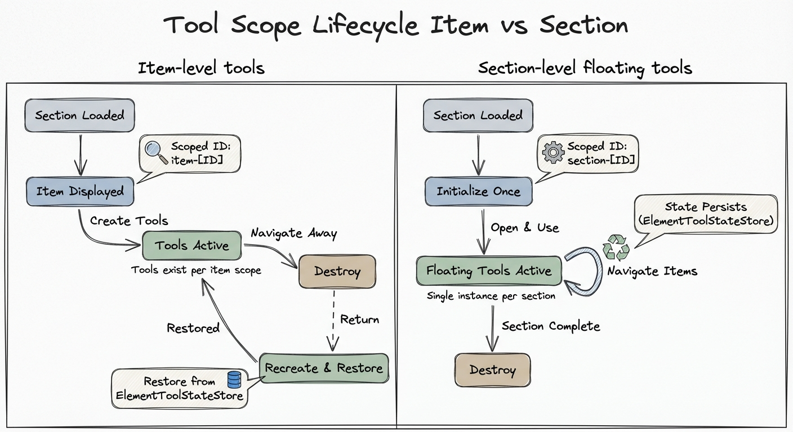
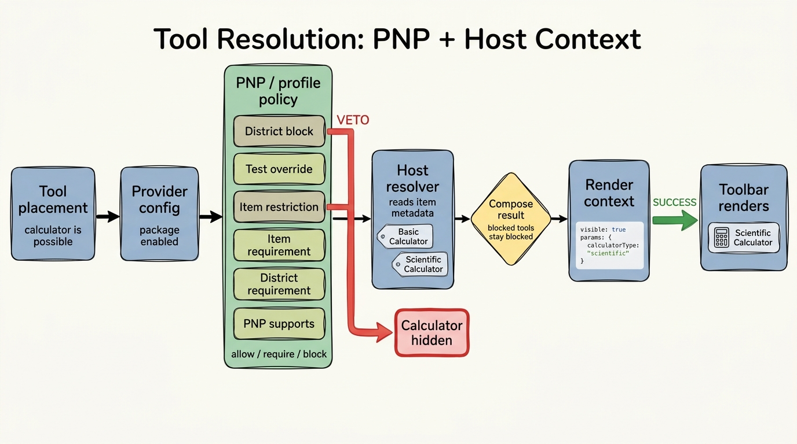

# PIE Assessment Tools & Accommodations Architecture

---

## Executive Summary

This document describes the architecture of the PIE assessment tools and accommodations system—a flexible, extensible toolkit that provides students with accessibility tools and accommodations during online assessments. The system supports essential accommodations such as text-to-speech, highlighting, calculators, rulers, and other assistive tools while aiming for WCAG 2.2 AA adherence.

The architecture leverages modern web standards (CSS Custom Highlight API, Web Components) to provide a framework-agnostic solution that integrates seamlessly with PIE-based assessment platforms.

> **Note:** For the authoritative tool registry reference, see `packages/assessment-toolkit/docs/TOOL_REGISTRY.md`.

See also:

- [`../wcag/readme.md`](../wcag/readme.md) for the WCAG reference library
- [`../wcag/patterns-and-widgets.md`](../wcag/patterns-and-widgets.md) for widget guidance
- [`../wcag/evaluation-method.md`](../wcag/evaluation-method.md) for review methodology

---

## Table of Contents

1. [Architectural Principles](#architectural-principles)
2. [System Context](#system-context)
3. [Component Architecture](#component-architecture)
4. [Tool Hierarchy](#tool-hierarchy)
5. [What Counts As A Tool](#what-counts-as-a-tool)
6. [Core Services](#core-services)
7. [Integration Patterns](#integration-patterns)
8. [Technology Stack](#technology-stack)
9. [Accessibility & Accommodations](#accessibility--accommodations)
10. [Production Status](#production-status)

---

## Architectural Principles

### Separation of Concerns

Tools are independent, self-contained components. Shared services (TTS, highlighting) are factored into reusable infrastructure. The player container orchestrates without coupling to tool internals.

**Benefit:** Tools can be developed, tested, and deployed independently. New tools can be added without modifying existing infrastructure.

### Modern Web Standards First

The architecture leverages native browser APIs that are now widely supported, reducing dependency on third-party libraries and enabling cleaner, more maintainable implementations.

**Key Standards Used:**
- **CSS Custom Highlight API** - Text highlighting without DOM mutation
- **Web Components** - Framework-agnostic custom elements
- **Web Speech API** - Browser-native text-to-speech
- **CSS Container Queries** - Responsive tool layouts

**Benefit:** Better performance, reduced bundle size, improved accessibility, and future-proof implementation.

### Framework Agnostic

Tools use the Web Components standard with internal implementation in Svelte 5. The public API surface is clean and consumable by any JavaScript framework.

**Benefit:** Assessment platforms using React, Vue, Angular, or vanilla JavaScript can integrate tools without friction.

### Zero DOM Mutation

Tools never modify PIE item content DOM directly. Visual effects use modern browser APIs (CSS Custom Highlight API) that work above the DOM layer.

**Benefit:** Preserves framework virtual DOM integrity, maintains screen reader compatibility, and eliminates security risks from innerHTML manipulation.

### Accessibility First

WCAG 2.2 AA adherence is the primary requirement. All tools support keyboard navigation and screen reader compatibility. The system supports accommodations required by IEP and 504 plans.

**Legal Context:** Public education agencies receiving federal funds must comply with Section 508 (ADA) and Section 504 (Rehabilitation Act). WCAG conformance is the standard for meeting these legal obligations.

---

## System Context

### Purpose

The PIE Assessment Tools system provides:

1. **Accessibility accommodations** for students with disabilities
2. **Testing tools** required by assessment content
3. **Assistive technology integration** for equitable access
4. **Reference materials** (periodic table, formula sheets)

### Stakeholders

- **Students** - Primary users requiring accommodations
- **Assessment Administrators** - Configure available tools per test
- **Content Authors** - Specify required tools per item
- **Platform Integrators** - Embed toolkit in assessment systems
- **Accessibility Coordinators** - Ensure compliance with accommodation plans

### System Boundary

**In Scope:**
- Tool implementations (calculator, ruler, protractor, etc.)
- Coordination services (z-index, highlighting, TTS)
- Annotation infrastructure (highlight, underline)
- Accommodation configuration

**Out of Scope:**
- Assessment content authoring
- Item response validation
- Session management and timing
- Score reporting

---

## Component Architecture

### High-Level Components

**Section Player Container** (Primary Interface)
- Renders QTI 3.0 sections with passages and items
- Registers authored catalogs and preprocessed `extractedCatalogs`
- Manages accessibility catalog lifecycle
- Integrates toolkit services (TTS, tools, highlighting)
- Renders TTS tools inline in passage/item headers

**PIE Item Player**
- Renders individual assessment items
- Manages PIE element instances
- Collects and validates responses
- Provides content queries for tools

**Tool Registry & Toolbar**
- Central tool registry and launcher
- Manages tool button states
- Delegates to ToolCoordinator for visibility
- Tool configuration UI

**Individual Tools**
- Self-contained functionality (calculator, ruler, etc.)
- Manage own UI and state
- Register with ToolCoordinator
- Communicate via events/props

**Annotation Toolbar**
- Text selection detection
- Floating toolbar on selection
- Gateway to translation and TTS
- Annotation creation (highlight/underline)

---

## Tool Hierarchy

### Three-Tier Architecture

Tools are organized into three tiers based on their dependencies:

#### Tier 1: Standalone Tools

**Characteristics:**
- No dependencies on other tools
- Direct user interaction
- Independent functionality
- Modal or floating UI

**Examples:**
- Calculator (basic, scientific, graphing)
- Ruler (metric/imperial)
- Protractor
- Periodic Table
- Graph Tool
- Line Reader (masking overlay)

#### Tier 2: Orchestrator Tools

**Characteristics:**
- Enable other tools
- Detect user intent or content state
- Coordinate multiple functions
- May have own UI

**Examples:**
- Annotation Toolbar (text selection gateway)
- Color Scheme Selector
- Answer Eliminator

**Why This Tier Matters:**
- Encapsulates complex selection logic once
- Provides consistent UX for text-based tools
- Centralizes accessibility implementation

#### Tier 3: Dependent Tools

**Characteristics:**
- Require Tier 2 orchestrator for input
- Cannot function standalone
- Receive data via props/events

**Examples:**
- Dictionary (requires selected text)
- Translation (requires selected text)
- TTS from selection

**Why This Tier Matters:**
- Tools focus on domain logic (definitions, translation)
- Avoids duplicated selection handling
- Simplifies testing with mock inputs

### Design Rationale

**Separation of Concerns:** Tier 2 tools encapsulate selection logic once. Tier 3 tools focus on their domain without duplicating infrastructure code.

**Maintainability:** Adding new Tier 3 tools is straightforward—implement the interface, receive text from orchestrator. No need to reimplement selection detection.

**Testing:** Tier 1 tools test in isolation. Tier 2 tools test selection detection. Tier 3 tools test with mock text input.

---

## What Counts As A Tool

Added 2026-08-07, prompted by fitting sign-language (ASL) support into this system. "Tool" in this codebase does not mean "gadget on a toolbar" — it means **policy-addressable capability**: something a `toolId` can name so district, test-administration, item, and student policy can decide whether it is available. `PnpPolicyDecisionEvent` calls this a `featureId`, which is the more honest name.

Registry membership therefore does *not* imply anything about three independent properties that are easy to conflate with it.

**1. Who may enable it (eligibility).** The assessment domain distinguishes *universal features* available to every student (highlighter, zoom, line reader), *designated supports* an educator indicates a need for (masking, color contrast, often TTS), and *accommodations* requiring a documented need such as an IEP or 504 (braille, ASL, scribe). This is the CCSSO / Smarter Balanced framing.

**Eligibility does not belong in a tool registration.** It is a property of the program, not of the capability: TTS is a universal tool in one program and a documented accommodation in another. It belongs in policy configuration, where the district and test-administration levels already live. `PnpPolicySource`'s precedence rules (`district-block`, `test-admin-override`, `item-restriction`, `item-requirement`, `district-requirement`, `pnp-support`, `pnp-prohibited`) are the right home.

**2. Whether it needs authored content.** A calculator works on any item. A highlighter works on any item. ASL needs a signing video authored for *that specific content*; braille needs a transcription; authored-SSML speech needs `<speak>` in that item. For these, availability is a function of the content as well as the student, and an affordance offered where no content exists is a dead affordance.

Unlike eligibility, this **is** intrinsic to the capability and belongs with it. AfA 3.0 formalizes it as the resource half of a matching pair — PNP describes learner needs, [DRD](https://www.imsglobal.org/accessibility/afav3p0pd/AfAv3p0_SpecPrimer_v1p0pd.html) describes what a resource offers. QTI 3 approximates DRD in-band: the presence of a catalog card *is* the resource-side declaration. PIE does the QTI version, so "is there a matching catalog card" is our DRD check.

**3. Where it renders.** Toolbar-invoked overlay, in-content transform, or its own layout region. Covered by [Tool Scope Architecture](#tool-scope-architecture-placement--scoped-ids) below and independent of the other two. Note this is also separate from the dependency tiers in [Tool Hierarchy](#tool-hierarchy) above — a capability's dependencies, its placement, its eligibility, and its content dependency are four orthogonal things.

### How The Standards Treat This

Neither reference point draws the tool-versus-accommodation line, and how each declines to is informative.

**AfA / PNP 3.0 refuses it deliberately.** On-screen calculators and dictionaries sit at the same structural level as captions and sign language; all are features a user may request. The [PNP information model](https://www.imsglobal.org/spec/afa/v3p0/info) contains no eligibility criteria and no authorization levels at all — who may grant a support is out of scope by design, left to policy frameworks above the spec.

**Learnosity has no accommodation concept in its content model.** It splits content into Questions (capture a response, scored) and [Features](https://help.learnosity.com/hc/en-us/articles/16684575643549-feature-types) (no response, not scored). Feature types include Audio player, Calculator, Imagetool, Line Reader, Passage, and Video player — so a signing video is authored as ordinary item content and renders unconditionally. Calculator and Line Reader appear both as item-level Features and as activity-level tools, so their answer to "tool or content?" is "choose a configuration scope." Their only real axis is *where it is configured*: item, activity, or session.

### Consequence For PIE

The shape here is already right and is closer to the standards than it looks: an AfA-shaped, eligibility-free `supports` vocabulary (`pnpSupportIds`, `PersonalNeedsProfile.supports`), plus a policy engine supplying the tiering AfA omits.

So **accommodations are not a separate kind of thing in this architecture.** They get a feature id like everything else, their eligibility comes from policy configuration, and their content dependency is checked by catalog resolution. Sign language is the worked example: it takes a feature id so it inherits the six-level precedence, declares a content dependency so it is absent when an item carries no card, and renders as its own section-player region rather than a toolbar surface — three independent answers, none of which follow from the other two. See [`../prds/sign-language-asl-support.md`](../prds/sign-language-asl-support.md).

Two mechanisms this needed, added 2026-08-08 when signing shipped:

**Decisions without a placement.** `decide(...)` answers "should this tool appear in *this* toolbar," which is the wrong question for a capability that has no toolbar surface — the answer comes back absent because nothing placed it, not because policy refused. `ToolPolicyEngine.decideFeature(featureId)` (exposed as `ToolkitCoordinator.decideFeaturePolicy(featureId)`) resolves one feature id through the same six levels, independent of placement. It delegates to `PnpPolicySource.resolveFeature(...)`, which reuses the existing rule evaluation rather than restating the precedence, so the two paths cannot drift. Note it deliberately does not consult `pnpEnforcement`: that flag governs whether profile policy *refines* an otherwise-visible tool set, and a capability with no placement has no unrefined baseline to fall back to, so honouring the flag would make the accommodation permanently unavailable rather than merely unrefined.

**Eligibility tier is configuration, not a derivation.** The core ships no populated default profile: `createEmptyPersonalNeedsProfile()` grants nothing. A default was briefly derived from every registered tool's `pnpSupportIds`, which read registry membership as eligibility tier — registration means "policy-addressable", not "universal, on by default" — so an accommodation-tier capability was granted to every student of every host that supplied no profile. The remedy was `ACCOMMODATION_ONLY_SUPPORT_IDS`, a compile-time list of ids to exclude that a host could not extend for its own accommodation; both the derivation and the list are gone.

Tiering belongs where the district and test-administration levels already live, because it is a property of the program rather than of the capability: TTS is a universal feature in one program and a documented accommodation in another. `@pie-players/pie-default-tool-loaders` ships today's universal set as `UNIVERSAL_SUPPORTS_PRESET` and `createUniversalPersonalNeedsProfile()` — data a host adopts, extends or replaces. What does belong on a registration is the content dependency, `requiresAuthoredContent`: signing needs an authored catalog card, braille a transcription. That is the resource half of AfA's PNP/DRD pair, it is intrinsic to the capability, and declaring it keeps a content-dependent accommodation out of a wholesale grant structurally rather than by name.

---

## Capability Ownership Layers

Four layers, and which one a piece of code belongs to is decided by whether it names a capability.

| Layer | Package | Knows |
| --- | --- | --- |
| Core | `assessment-toolkit` | `featureId`, placement levels, activation kinds, precedence, the registration contract. **No capability ids.** |
| Capability | `tool-*` | One capability: its registration, its content resolver, its element |
| Composition | `default-tool-loaders` | Which capabilities a deployment has, their tags, placement presets, universal supports, module loaders |
| Renderer | `section-player`, `item-player`, toolbars | Surfaces and layout. Asks the registry what to mount |

`bun run check:capability-neutrality` fails when a capability id or a `pie-tool-*` tag appears in core. A renderer is held to the same rule by its own source-boundary tests, because a renderer that names one is the same defect one layer up: it means a host cannot contribute that kind of capability without a PR here.

The rule this encodes: **a capability id may only appear in the layer that is a decision about capabilities.** Core naming one turns a deployment choice into a code change. That happened three ways at once — the packaged registry was core's fallback for an absent one, the default profile was derived from registry membership, and two renderers named the specific capability they mounted — and each had to be undone before a host could contribute anything.

Within the composition layer, PIE's packaged set is authored through one
**Packaged Capability Composition**. A capability entry binds its registration
to its custom-element delivery and lazy-loader bootstrap sets, its membership
and order in the shipped placement presets, its toolbar order, and an explicit
list of support ids this program treats as universal. The familiar root exports
— `PACKAGED_TOOL_REGISTRATIONS`, tag and loader maps, placement/order constants,
the universal preset, and `createPackagedToolRegistry()` — are projections of
that module rather than independent catalogues. Universal policy remains
explicit data: the composition validates a declared universal id against its
registration but never infers eligibility from registry membership.

Composition invariants are strict in the package build because they are
PIE-authored release data, not runtime host input. They are not repeated as a
browser import-time exception. Host behavior stays fail-soft: loader
installation is still opt-in, overrides keep their existing precedence, and an
unknown id in a `toolIds` selection is ignored while known capabilities continue
to register. That distinction catches a package author forgetting a loader or
tagging a region as a toolbar element without making our defect — or a host's
non-critical stale selection — block an assessment.

### Host surfaces

A capability that does not render on a toolbar declares `activation: "region"`, the host slot names it fits in `surfaces`, and `renderSurface(context)`. The renderer asks `registry.getToolsBySurface(name)` and mounts what comes back, so it names no capability and a host opens a new surface without a change here. Surface names belong to the renderer; core validates only that a region capability claims one.

Section-player's three slots — `content-lead`, `content-media`, and
`section-overlay` — are geometry adapters over one internal **Tool Surface
Host**. Its narrow interface is `update(currentInput)` plus `destroy()`, with a
snapshot containing only `mountable` and `occupied`. The module owns registry,
policy, and catalog observation; eligibility; structural comparison; lazy
loading; ordered DOM reconciliation; synchronization; diagnostics; and
teardown. Deleting it would put the same lifecycle back into all three
adapters, which is why this seam earns its place.

Availability at a surface is grant **and** content: `decideFeaturePolicy(supportId)`, then `requiresAuthoredContent.resolve(...)`, then `renderSurface`. Neither half implies the other, which is what keeps a learner with an accommodation from seeing a dead affordance on the items that carry no resource. The catalog resolver owns entity/model traversal and owner-filtered observation; `resolve` receives only the immutable cards visible to that owner, not the raw entity plus resolver plus a separately assembled context.

Two constraints follow. A `region` capability is gated on the feature question and never the placement question — placing one is a `tools.unplaceableActivation` error, so the placement question has no answer to give. And a content dependency resolves against an item model or a passage, never a section, because a DRD resource pairs with content rather than with a container: a section-scoped surface declines a capability that declares one.

The host's off switch for a `region` capability is therefore `tools.policy.blocked`, which names capabilities rather than placements. `decideFeature(...)` applies it, and `tools.policy.allowed` as an allow-list, before any policy source is consulted; the denial reports `rule: "host-blocked"` / `"host-allowlist"` at precedence 0, the same vocabulary `composeDecision(...)` records. `provider-disabled` and `placement-membership` stay out of the feature path, both being statements about a toolbar the capability was never on. A host denial outranks `resolvesWithoutGrant`: that flag lets a content-dependent capability answer from the content when policy granted nobody — an authored `visibility: "always"` transcript is not an accommodation — while a blocklist entry says the capability has no place in this delivery, which the content does not get to reopen.

The host observes successful `ToolRegistry` mutations. Registering a capability
adds it in registration order; unregistering or clearing destroys it; overriding
remounts that id with the new registration; component-override and late-loader
changes are reconciled without a player rerender. Lazy completions are guarded
against stale registrations and teardown, and mounted nodes are reordered
without recreation when modules resolve out of order.

A failure in resolution, loading, rendering, synchronization, or teardown is
isolated to that capability and reported as a recoverable `tool-surface`
framework warning. Render failure omits only that capability, sync failure keeps
its last working element, and destroy failure still force-removes the node.
Recoverable warnings remain observable through events and hooks but do not set
section readiness to `error`; nonrecoverable framework errors retain the
existing blocking behavior.

`@pie-players/pie-tool-sign-language` is the worked example. It is deliberately absent from `createPackagedToolRegistry`, because a content-dependent accommodation is opt-in, so a host installs and registers it exactly as it would one of its own. `packages/assessment-toolkit/docs/TOOL_REGISTRY.md` carries both contracts.

Host surfaces are one instance of a broader pattern: a fact only the container knows, published for whichever descendant needs it rather than pushed to a known list of consumers. `renderSurface(context)` publishes, the capability resolves, and `sync(context)` is the change signal — which it lacked until it was found to be re-applying the values the host already had. [`../architecture/composition-context.md`](../architecture/composition-context.md) states the pattern and the invariants that failure violated.

---

## Tool Scope Architecture: Placement + Scoped IDs

In addition to the three-tier dependency hierarchy, tools are categorized by their **scope and lifecycle** within an assessment:

### Item-Level Tools

Tools that operate within the context of a specific question/item:



**Lifecycle:**
- See diagram above for creation, teardown, and state-restore flow.

**Characteristics:**
- **Instance per item**: Each question has its own tool instances
- **DOM-scoped**: Tools query/interact with specific item's DOM subtree
- **State isolation**: Tool state tracked per-item (Q5 eliminations ≠ Q6 eliminations)
- **UI integration**: Rendered inline in question headers/toolbars
- **Compact footprint**: Small buttons appropriate for inline placement

**Examples:**
- **TTS (tool-tts-inline)**: Reads this question's text (not other questions)
- **Answer Eliminator**: Strikes through choices for this item only
- **Highlighter**: Highlights within this item's text

**State Management:**
```typescript
// State stored with item-specific ID
elementToolStateStore.setState(
  'assessment:section-1:question-5:mc1',
  'answerEliminator',
  { eliminatedChoices: ['choice-b', 'choice-d'] }
);

// When user returns to Q5, state is restored
const state = elementToolStateStore.getState('assessment:section-1:question-5:mc1', 'answerEliminator');
// { eliminatedChoices: ['choice-b', 'choice-d'] }
```

### Section-Level Floating Tools

Tools that float above the entire assessment and persist across navigation:

**Lifecycle:**
- See diagram above for persistent section-level lifecycle behavior.

**Characteristics:**
- **Single instance per section**: One calculator, one graph, etc. for entire section
- **Global scope**: Not bound to specific item's DOM
- **Persistent state**: Calculator history, graph equations, tool positions maintained
- **UI pattern**: Draggable floating panels/overlays with z-index management
- **Rich UI**: Full-featured interfaces (can be large, user controls positioning)

**Examples:**
- **Calculator**: Computation history persists across questions
- **Graph**: Plot multiple functions, reference throughout test
- **Periodic Table**: Reference material available anytime
- **Protractor**: Measure angles in diagrams across items
- **Ruler**: Measure lengths in diagrams across items
- **Line Reader**: Reading guide overlay across all content
- **Magnifier**: Screen magnification across entire assessment
- **Color Scheme**: High-contrast mode affects all content

**State Management:**
```typescript
// Calculator state is global (not item-specific)
calculatorState = {
  history: [
    { expression: '45 * 12', result: 540 },
    { expression: 'sqrt(144)', result: 12 }
  ],
  position: { x: 100, y: 200 },
  size: { width: 300, height: 400 }
};

// State persists as user navigates between questions
```

### Configuration in ToolkitCoordinator

The configuration structure reflects this scope distinction via `tools.placement` and `tools.providers`:

```typescript
const coordinator = new ToolkitCoordinator({
  assessmentId: 'math-exam',
  tools: {
    placement: {
      item: ['calculator', 'textToSpeech', 'answerEliminator'],
      passage: ['textToSpeech'],
      section: ['calculator', 'graph', 'periodicTable', 'protractor', 'lineReader', 'ruler', 'theme']
    },
    providers: {
      calculator: {
        enabled: true,
        provider: {
          runtime: {
            authFetcher: async () => {
              const res = await fetch('/api/tools/desmos/token');
              return res.json();
            }
          }
        }
      },
      textToSpeech: {
        enabled: true,
        settings: { backend: 'browser' }
      }
    }
  }
});
```

### Canonical Tool Resolution Flow

Tool resolution is split between policy, host item metadata, and tool-owned
rendering:



The canonical order is:

1. Static placement and provider config define the candidate set for the
   current level (`section`, `item`, or `passage`).
2. Policy rules narrow that set: `tools.policy`, provider `enabled`, custom
   `PolicySource`s, and PNP/profile precedence.
3. A host `toolContextResolvers[toolId]` callback may hide a surviving tool
   for the current item/passage or attach render params such as
   `{ calculatorType: "scientific" }`.
4. If no host resolver is registered, the tool registration applies its
   default `isVisibleInContext` relevance check.
5. `renderToolbar` receives a resolved `ToolbarContext`, including
   `getToolRenderParams(toolId)`, and renders the final button and tool
   element.

The host resolver intentionally cannot re-enable a tool removed by placement,
provider config, district/test policy, or PNP/profile rules. It is the right
place for content metadata, such as Pieoneer's `searchMetaData.k12_tags`, to
choose whether the calculator appears and which calculator type to pass to the
packaged tool.

### Structured Tool Instance IDs

Tool instances use a scoped ID format:

```text
<toolId>:<scopeLevel>:<scopeId>[:inline]
```

Examples:
- `calculator:item:item-12`
- `calculator:section:section-1`
- `textToSpeech:passage:passage-2`
- `highlighter:rubric:rb-5`

Supported built-in levels include `assessment`, `section`, `item`, `passage`, and `rubric`.
The runtime can register additional levels if your product needs custom scopes.

### Why This Separation Matters

**1. Different Lifecycle Management**
- Item tools created/destroyed per navigation event
- Floating tools initialized once, persist throughout section

**2. Different Service Requirements**
- Any tool may declare provider/runtime hooks (auth, backend request bridge, host events)
- Item tools typically use simpler built-in services

**3. Different UI Patterns**
- Item tools: compact inline buttons (limited space in question headers)
- Floating tools: rich draggable panels (full-featured interfaces)
- Floating shell host notifies optional tool hooks (`onHostedMount`, `onHostedResize`, `onHostedUnmount`)

**4. Different State Models**
- Item tools: state per-question (which answers eliminated for Q5)
- Floating tools: global state (calculator equation history)

**5. Different PNP Mapping**
- QTI 3.0 accessibility features map to appropriate tool level
- Example: `ext:answer-masking` → item-level answerEliminator
- Example: `ext:calculator-scientific` → floating calculator

### Implementation Example

**Section Player Rendering:**

```svelte
<!-- Section-level: One toolbar for all questions -->
<pie-section-toolbar toolCoordinator={coordinator.toolCoordinator} />

<!-- Item-level: New toolbar instance per question -->
{#each items as item}
  <div class="item-container">
    <!-- Question header with item-scoped tools -->
    <pie-item-toolbar
      itemId={item.id}
      tools="tts,answerEliminator"
      toolCoordinator={coordinator.toolCoordinator}
      ttsService={coordinator.ttsService}
      scopeElement={itemElement}
    />

    <!-- Question content -->
    <pie-item-player item={item} />
  </div>
{/each}

<!-- Floating tool instances (outside item loop) -->
<tool-calculator visible={showCalculator} />
<tool-graph visible={showGraph} />
<!-- ... other floating tools ... -->
```

### Architecture Decision: Why Two Categories?

This separation emerged from real-world assessment platform analysis and reflects natural tool usage patterns:

**Educational Context:**
- Students need **contextual tools** (TTS, eliminator) that change per-question
- Students need **utility tools** (calculator, ruler) that remain available throughout

**Technical Benefits:**
- Clear lifecycle boundaries (when to create/destroy)
- Appropriate state management (per-item vs global)
- Natural UI patterns (inline vs floating)
- Simplified PNP resolution (features map to correct scope)

**User Experience:**
- Intuitive: contextual tools are scoped to their context
- Predictable: utility tools remain accessible and maintain state
- Efficient: compact inline tools don't clutter screen, floating tools can be positioned as needed

---

## Core Services

### ToolCoordinator

**Purpose:** Central service managing tool visibility and z-index layering.

**Responsibilities:**
- Register/unregister tools
- Show/hide tools
- Bring tool to front on interaction
- Maintain z-index layers
- Notify subscribers of state changes

**Z-Index Layers:**
```
0-999:     PIE content and player chrome
1000-1999: Non-modal tools (ruler, protractor, line reader)
2000-2999: Modal tools (calculator)
3000-3999: Tool control handles (drag, resize)
4000-4999: Highlight infrastructure (TTS, annotations)
5000+:     Critical overlays (errors, notifications)
```

**Pattern:** Singleton service with listener-based subscriptions.

**Benefits:**
- No z-index conflicts between tools
- Consistent visual stacking
- Tools don't need to know about each other
- Easy "hide all tools" functionality
- Simplifies state persistence

### HighlightCoordinator

**Purpose:** Manages text highlighting for TTS and annotations using CSS Custom Highlight API.

**The Problem:** Both TTS (temporary word highlighting) and student annotations (persistent highlighting) need to highlight text simultaneously without interfering.

**The Solution:** HighlightCoordinator manages separate highlight registries for TTS vs annotations, using the browser's native CSS Custom Highlight API.

**Key Methods:**
```typescript
// TTS Highlights (temporary)
highlightTTSWord(textNode, startOffset, endOffset)
highlightTTSSentence(ranges)
clearTTS()

// Annotation Highlights (persistent)
addAnnotation(range, color) → annotationId
removeAnnotation(annotationId)
clearAnnotations()
```

**Technology: CSS Custom Highlight API**

Modern browser standard (Chrome 105+, Safari 17.2+, Firefox 128+) for highlighting text without DOM mutation:

```typescript
// NO DOM changes - virtual highlight layer
const range = new Range();
range.setStart(textNode, startOffset);
range.setEnd(textNode, endOffset);

const highlight = new Highlight(range);
CSS.highlights.set('highlight-name', highlight);
```

**Benefits vs Traditional Approach:**
- Zero DOM mutation (preserves React/Vue/Svelte virtual DOM)
- Framework-compatible
- Screen reader friendly (text structure unchanged)
- Multiple highlights overlap gracefully
- Better performance
- No security risks (no innerHTML)

**Browser Support:** ~85% global coverage (2025). Graceful degradation for older browsers.

### TTS Service

**Purpose:** Singleton service providing text-to-speech with word highlighting synchronization.

**Why TTS Matters:**
- Primary accommodation for students with reading disabilities
- Supports English Language Learners
- Required by IEP/504 plans
- Must work reliably across all content types

**Capabilities:**
- Read full question or selected text
- Pause, resume, stop playback
- Word-level highlighting synchronized with audio
- Voice selection and speed control
- State management (playing, paused, stopped)

**Provider Architecture:**

The service uses a pluggable provider pattern:
- **BrowserTTSProvider** - Uses Web Speech API (currently implemented)
- **AWS Polly Provider** - Cloud-based neural voices; client provides integration
- Provider registration is descriptor-driven from tool registrations.
- `tools.providers[toolId]` is generic for every tool (`enabled`, `provider`, `settings`).
- Runtime hooks (`provider.runtime`) support auth fetch, backend request bridging, and host event wiring.

**Integration with Highlighting:**
```
TTS Service
  ↓ triggers
HighlightCoordinator.highlightTTSWord()
  ↓ creates
CSS.highlights.set('tts-current-word', highlight)
  ↓ renders
Yellow highlight with border (::highlight CSS)
```

**QTI 3.0 Catalog Integration:** TTS integrates with AccessibilityCatalogResolver for SSML support. The section player registers authored catalogs and `config.extractedCatalogs`; embedded `<speak>` extraction must run before render if that content style is used.

**Multi-Level TTS Entry Points:**

- **Content-Level TTS** (`tool-tts-inline`): Speaker icons in passage/item headers pass catalog context and a live content element, allowing `TTSService` to resolve `data-catalog-idref` regions.
- **Floating selection TTS** (`tool-text-to-speech`): Can detect the nearest `data-catalog-idref` and request a catalog-backed utterance.
- **Annotation toolbar read-aloud**: Speaks the selected visible range and intentionally bypasses catalogs with `ignoreCatalogs`.

**Read-aloud suppression:** `data-tts-suppress` on a content element marks it never-spoken, for items where reading is the construct (decoding, spelling). It is enforced in *every* entry point above — including the selection path, which filters the `Range` because it never walks the DOM — and it overrides both an authored `spoken` card and the learner's PNP entitlement. Speech-only by decision: braille preserves orthography where speech destroys it, and for signing the deciding fact lives in the recording rather than the markup. See [Accessibility Catalogs Integration Guide](../accessibility/accessibility-catalogs-integration-guide.md#suppressing-read-aloud).

**Recorded audio:** a `spoken` card may carry an audio file instead of a script, which QTI treats as the same support rather than a separate accommodation. The clip plays in the composed chunk sequence, the docked node highlights as a block for its duration since a recording emits no word boundaries, and a clip that will not play degrades to the node's script. See [Recorded Audio as a Spoken Alternate](../accessibility/accessibility-catalogs-integration-guide.md#recorded-audio-as-a-spoken-alternate).

**Design Decision:** TTS is a singleton service, not a tool. Multiple entry points all use the same service to prevent conflicts. Catalog resolution is shared for entry points that pass catalog IDs or content elements; selection-only read-aloud can intentionally use visible text.

---

## Integration Patterns

### Tool Registration Pattern

Tools register with ToolCoordinator on mount:

```typescript
onMount(() => {
  coordinator.registerTool(toolId, toolName, element, ZIndexLayer.MODAL);
  return () => coordinator.unregisterTool(toolId);
});
```

**Benefits:**
- Declarative lifecycle management
- Automatic cleanup on unmount
- Type-safe layer assignment

### Text Selection Pattern

Annotation Toolbar detects selection and provides gateway to text-based tools:

```
User selects text
  ↓
Annotation Toolbar detects (mouseup, keyup events)
  ↓
Extract range, validate (highlightable content)
  ↓
Show floating toolbar with options
  ↓
User clicks action → Emit event with text/range
  ↓
Tool receives event and displays with data
```

**Benefits:**
- Single implementation of selection logic
- Consistent UX across text tools
- Centralized accessibility handling
- Easy to add new text-based tools

### Selection-Gateway Runtime Model

`annotationToolbar` is treated as a section-scoped singleton gateway, not a per-item toggle button:

- Mounted once per section runtime
- Activated by text selection events in content
- Hosts action modules (highlight/underline now; dictionary/picture dictionary later)

Enable/disable uses canonical tool config and follows standard precedence:

1. Provider flag (`tools.providers.annotationToolbar.enabled !== false`)
2. Placement/policy resolution (`tools.placement` + `tools.policy`)
3. PNP allowance when applicable

### State Persistence Pattern

Tools save state per item using player container's storage API:

```typescript
// On item load
const state = await player.loadToolState(itemId, toolId);
if (state) loadState(state);

// On item unload or user action
const state = saveState();
await player.saveToolState(itemId, toolId, state);
```

**Storage Options:**
- sessionStorage (temporary, current session)
- IndexedDB (persistent, cross-session)

**Benefits:**
- State isolated per item
- Survives navigation
- Player container controls storage strategy
- Tools don't need storage logic

### PIE Element Integration

Tools query PIE content using data attributes:

```html
<!-- Highlighting -->
<p data-highlightable="true" data-highlight-group="passage">
  Content that students can highlight
</p>

<!-- TTS -->
<div data-readable="true"
     data-reading-order="1"
     data-content-type="question"
     lang="en">
  Question text to be read aloud
</div>

<!-- Answer Elimination -->
<button data-eliminatable="true" data-option-id="option-a">
  Option A
</button>
```

**Benefits:**
- Non-invasive (data- attributes ignored by screen readers)
- Tools query without tight coupling to PIE internals
- Content authors control tool behavior per element
- Clear contract between content and tools

---

## Technology Stack

### Core Technologies

**Web Components (Custom Elements)**
- Framework-agnostic standard
- Native browser support
- Encapsulation with shadow DOM (optional)
- Lifecycle hooks (connectedCallback, disconnectedCallback)

**Svelte 5**
- Internal tool implementation
- Reactive state management with runes ($state, $derived, $effect)
- Compiles to efficient vanilla JavaScript
- Small bundle size (~3KB per component)

**CSS Custom Highlight API**
- Native browser highlighting without DOM mutation
- Multiple overlapping highlights
- Screen reader compatible
- Better performance than span-based approaches

**Web Speech API**
- Browser-native text-to-speech
- Voice selection and rate control
- Word boundary events for highlighting
- No external dependencies

### Supporting Libraries

**Moveable.js**
- Drag, rotate, resize functionality
- Used by ruler and protractor tools
- Keyboard navigation support
- Accessible interactions

**Desmos API**
- Graphing calculator integration
- Scientific calculator modes
- LaTeX math expression support

### Browser Support

**Target:** Modern evergreen browsers (Chrome, Edge, Firefox, Safari)

**Key API Support:**
- CSS Custom Highlight API: Chrome 105+, Safari 17.2+, Firefox 128+
- Web Components: Universal support
- Web Speech API: Universal support
- CSS Container Queries: Chrome 105+, Safari 16+, Firefox 110+

**Coverage:** ~85% global browser market (2025)

**Fallback Strategy:** Graceful degradation for highlighting (features work, visuals may be limited)

---

## Accessibility & Accommodations

### WCAG 2.2 AA Compliance

The toolkit meets WCAG 2.2 Level AA requirements:

**Keyboard Accessibility (2.1.1)**
- All tools fully keyboard navigable
- Tab/Shift+Tab for focus management
- Arrow keys for tool interactions
- Escape to close modals
- No keyboard traps

**Focus Management (2.4.3, 2.4.7)**
- Logical focus order
- Visible focus indicators
- Focus trapped in modals
- Focus returns on close

**Color Contrast (1.4.3)**
- 4.5:1 minimum for text
- 3:1 minimum for UI components
- Uses PIE color variables for consistency

**ARIA (4.1.2, 4.1.3)**
- Proper semantic HTML
- ARIA labels on all controls
- Role attributes (dialog, toolbar, button)
- Live regions for dynamic updates

**Screen Reader Support**
- Tested with JAWS, NVDA, VoiceOver
- Announces tool states
- Describes interactions
- Reading order preserved

### Accommodation Types

**Text-to-Speech**
- Reads question, passage, or selection
- Word highlighting synchronized with audio
- Speed and voice control
- Pause/resume capability

**Visual Accommodations**
- Color scheme adjustment (high contrast)
- Text highlighting (4 colors)
- Line reader (focus/masking)
- Magnification

**Calculation Support**
- Basic, scientific, graphing calculators
- History and memory functions

**Measurement Tools**
- Ruler (metric/imperial)
- Protractor (degree measurement)
- Reference materials (periodic table)

### Three-Tier Configuration

Accommodations are determined by merging three configuration levels:

```
Item Level (most specific):
  "This question requires scientific calculator"
      ↓
Roster/Test Level:
  "Calculator allowed, lineReader blocked"
      ↓
Student Level:
  "Student has TTS accommodation per IEP"
      ↓
Final Configuration:
  Scientific calculator (required) + TTS (enabled)
```

**Precedence Rules:**
1. Item requirements override student preferences
2. Roster blocks override accommodations
3. Student accommodations fill remaining gaps

---

## Production Status

### Implemented & Production Ready

✅ **Calculator Tool**
- Desmos provider
- Full featured with settings
- Tested and deployed

✅ **Ruler Tool**
- Drag, rotate, snap
- Metric/imperial units
- Keyboard accessible

✅ **Protractor Tool**
- 180° protractor with center origin
- Drag and rotate
- Snap to increments

✅ **Line Reader Tool**
- Transparent reading window with obscuring frame
- Frame opacity control
- Resize handle

✅ **Annotation Toolbar**
- Text selection detection
- Highlight (4 colors) and underline
- TTS integration
- Dictionary/translation gateway

✅ **ToolCoordinator**
- Z-index management
- Tool visibility state
- Bring to front behavior

✅ **HighlightCoordinator**
- CSS Custom Highlight API
- TTS + annotation coexistence
- Dynamic color injection

✅ **TTS Service**
- Web Speech API provider
- Word highlighting
- Pause/resume/stop controls

### Partially Implemented

⚠️ **AWS Polly TTS Provider**
- Interface defined
- Implementation pending
- Web Speech API covers basic needs

⚠️ **Range Serialization**
- Basic path-based export implemented
- Complex restoration needs enhancement
- Works for simple cases

---

## Architecture Decisions

### Why CSS Custom Highlight API?

**DOM-Mutation Highlighting Pattern:**
```html
<span class="highlight-yellow">Selected text</span>
```

**Problems:**
- Breaks React/Vue/Svelte virtual DOM
- Security risk (innerHTML manipulation)
- Requires cleanup
- Interferes with screen readers
- Complex serialization

**Modern Approach (PIE):**
```typescript
const highlight = new Highlight(range);
CSS.highlights.set('annotation-yellow', highlight);
```

**Benefits:**
- Zero DOM changes
- Framework-compatible
- Screen reader friendly
- Better performance
- Simpler code (74% LOC reduction vs prior TTS implementations)

### Why Singleton Services?

**ToolCoordinator, TTS Service, HighlightCoordinator are singletons.**

**Rationale:**
- Single source of truth for state
- Prevents conflicts (one TTS playback, one z-index manager)
- Simplifies tool implementation (no coordination needed)
- Easier testing (mock singleton instance)
- Matches player container lifecycle (one per session)

### Why Three-Tier Tool Hierarchy?

**Rationale:**
- **Tier 1:** Most tools are standalone (calculator, ruler, protractor)
- **Tier 2:** Selection logic is complex—implement once, reuse for all text tools
- **Tier 3:** Domain tools (translation) focus on their function without selection code duplication

**Benefits:**
- Clear dependency boundaries
- Easy to add new text-based tools
- Testable in isolation
- Maintainable architecture

### Why Web Components?

**Rationale:**
- Framework-agnostic (works with React, Vue, Angular, vanilla JS)
- Native browser standard
- No build-time dependencies for consumers
- Clean public API surface
- Future-proof

**Trade-offs:**
- Slightly larger than pure Svelte (but still small)
- Shadow DOM optional (we use 'none' for simplicity)
- Requires compilation step (handled by Svelte)

---

## Conclusion

The PIE Assessment Tools & Accommodations architecture provides a modern, scalable foundation for assistive technology in online assessments. By leveraging native browser APIs and Web Components, the system achieves framework independence while maintaining excellent performance and accessibility.

The three-tier tool hierarchy, singleton coordination services, and zero DOM mutation design enable a clean separation of concerns that simplifies development, testing, and maintenance.

The architecture is production-ready for core functionality, with clear paths for enhancement as needed.

---

## References

### Standards & Specifications

- [WCAG 2.2 Guidelines](https://www.w3.org/WAI/WCAG22/quickref/)
- [CSS Custom Highlight API](https://developer.mozilla.org/en-US/docs/Web/API/CSS_Custom_Highlight_API)
- [Web Components](https://developer.mozilla.org/en-US/docs/Web/API/Web_components)
- [Web Speech API](https://developer.mozilla.org/en-US/docs/Web/API/Web_Speech_API)

### Legal & Compliance

- [Section 508 Standards](https://www.section508.gov/)
- [Section 504 Rehabilitation Act](https://www2.ed.gov/about/offices/list/ocr/504faq.html)

### Implementation

- [Svelte 5 Documentation](https://svelte-5-preview.vercel.app/docs/introduction)
- [Desmos API](https://www.desmos.com/api/v1.10/docs/index.html)
- [Moveable.js](https://daybrush.com/moveable/)
