# Summary

This report refreshes the SchoolCity-to-PIE tool comparison using the [master gap-analysis document](https://renlearncrm-my.sharepoint.com/personal/justin_elston_renaissance_com/_layouts/15/Doc.aspx?sourcedoc=%7B41F7ACE6-1D81-40D5-91CE-DBC5D6BDD811%7D&file=SchoolCity%20and%20PIE%20Items%20gap%20analysis%20-%20visual%20examples.docx&action=default&mobileredirect=true) as the source of truth for SchoolCity behavior and visuals, while using this repository as the source of truth for the current PIE Players state. It also adds a Learnosity parity lens based on public Learnosity documentation and live screenshots from a local Pieoneer Learnosity Items API preview.

The main conclusion is unchanged but now better grounded: PIE Players has reusable packaged tools for the core visual, measurement, and reference overlay set: theme/color schemes, line reader, annotation/highlighting, answer eliminator, ruler, protractor, graph, and periodic table. SchoolCity’s student tool surface remains broader. It includes dictionary and translation tools, notes/comments, flags, writing checklists, resources, rollovers/pop-ups, magnifier, spell check, speech-to-text, media upload, robust response-editing controls, and item-authoring controls that are not packaged PIE toolkit tools today. One area clearly favors PIE: text-to-speech / read-aloud, where PIE ships a reusable, standards-aligned, multi-backend TTS subsystem that goes well beyond an application-specific read-aloud implementation.

The relevant Renaissance replacement path is a combination of:

- PIE Players toolkit behavior for reusable tools and custom elements.
- Quiz Engine or another assessment host for product chrome, test navigation, flagging, global settings, and tool placement decisions.
- PIE items and response editors for item-owned editing controls such as equation input, spell check, media upload, drawing, and robust text editing.

Quiz Engine status is treated here as product delivery context only. This report does not re-audit Quiz Engine implementation details. Learnosity is treated as an external benchmark for assessment-player tool placement, not as a target for wholesale feature cloning.

## PIE-500 Jira Cross-Reference

The table below maps the work identified by the SchoolCity master document and this report to stories under [PIE-500](https://illuminate.atlassian.net/browse/PIE-500). A ticket can be direct, adjacent, or host/item-owned; this table is not a statement that PIE Players alone should implement every story.

| Report capability / gap | PIE-500 story | Mapping note |
| --- | --- | --- |
| Ruler | [PIE-462](https://illuminate.atlassian.net/browse/PIE-462) Ruler | Direct match; PIE already has a packaged ruler tool. |
| Protractor | [PIE-463](https://illuminate.atlassian.net/browse/PIE-463) Protractor | Direct match; PIE already has a packaged protractor tool. |
| Equation Editor | [PIE-464](https://illuminate.atlassian.net/browse/PIE-464) Equation Editor | Direct item/response-editor ownership match. |
| Robust Text Editor | [PIE-465](https://illuminate.atlassian.net/browse/PIE-465) Undo/ Redo Text Support | Adjacent text-editor work; the master document calls out robust text editor ownership rather than undo/redo specifically. |
| Highlighter | [PIE-466](https://illuminate.atlassian.net/browse/PIE-466) Highlighter | Direct match; PIE annotation toolbar covers highlighting. |
| Line Reader | [PIE-468](https://illuminate.atlassian.net/browse/PIE-468) Line Reader | Direct match; PIE already has a packaged line reader. |
| English Dictionary | [PIE-469](https://illuminate.atlassian.net/browse/PIE-469) English Dictionary | Direct gap; no packaged PIE dictionary tool. |
| Notes | [PIE-470](https://illuminate.atlassian.net/browse/PIE-470) Student Notes | Direct gap; likely host/session-owned. |
| Flag | [PIE-471](https://illuminate.atlassian.net/browse/PIE-471) Flag Item | Direct host-owned match. |
| Color Contrast / Theme | [PIE-472](https://illuminate.atlassian.net/browse/PIE-472) Ability to apply a high contrast color scheme; [PIE-484](https://illuminate.atlassian.net/browse/PIE-484) Custom Color Schemes | Direct/adjacent matches; PIE has a theme tool and host theme support, but product behavior still needs review. |
| Speech to Text | [PIE-473](https://illuminate.atlassian.net/browse/PIE-473) Speech to Text (STT) | Direct response-editor/service gap. |
| Translation / Translate Selection / Full Assessment Translation | [PIE-474](https://illuminate.atlassian.net/browse/PIE-474) Translation | Direct language-support gap spanning full assessment and selected text. |
| Pop-up | [PIE-475](https://illuminate.atlassian.net/browse/PIE-475) Popups | Direct item/content-markup match. |
| Rollover | [PIE-476](https://illuminate.atlassian.net/browse/PIE-476) Rollovers | Direct item/content-markup match. |
| Spanish Dictionary | [PIE-477](https://illuminate.atlassian.net/browse/PIE-477) Spanish Dictionary | Direct gap; no packaged PIE Spanish dictionary tool. |
| Browser Zoom Support | [PIE-490](https://illuminate.atlassian.net/browse/PIE-490) Browser Zoom | Direct platform/browser-support match. |
| Comment | [PIE-491](https://illuminate.atlassian.net/browse/PIE-491) Comments | Direct anchored-comment gap. |
| Graph | [PIE-493](https://illuminate.atlassian.net/browse/PIE-493) Graphing Support | Direct match; PIE has a packaged graph tool, but product/provider expectations need confirmation. |
| Periodic Table | [PIE-494](https://illuminate.atlassian.net/browse/PIE-494) Periodic Table | Direct match; PIE already has a packaged periodic table. |
| Spell Check | [PIE-495](https://illuminate.atlassian.net/browse/PIE-495) Spell Check | Direct response-editor gap. |
| Text Magnifier | [PIE-496](https://illuminate.atlassian.net/browse/PIE-496) Text Magnifier | Direct gap; no packaged PIE magnifier tool. |
| Underline | [PIE-497](https://illuminate.atlassian.net/browse/PIE-497) Underline | Direct match through PIE annotation toolbar. |
| Writing Checklist | [PIE-498](https://illuminate.atlassian.net/browse/PIE-498) Writing Checklist | Direct gap; likely host/content/item-owned. |
| Answer Eliminator | [PIE-499](https://illuminate.atlassian.net/browse/PIE-499) Answer Choice Eliminator | Direct match; PIE has a packaged answer eliminator with UX differences. |
| Resources / References | [PIE-488](https://illuminate.atlassian.net/browse/PIE-488) References | Adjacent match; SchoolCity master document says Resources, while the Jira story says References. Ownership still needs product clarification. |
| Media Upload / Alternative input | [PIE-489](https://illuminate.atlassian.net/browse/PIE-489) Alternative Input Methods | Adjacent response-input work; the master document calls out Media Upload and Speech to Text separately. |
| Custom Speech / TTS pronunciation / audio language support | [PIE-479](https://illuminate.atlassian.net/browse/PIE-479) Multiple Languages Audio Support; [PIE-480](https://illuminate.atlassian.net/browse/PIE-480) Audio Support for Test Content and Instructions | PIE already ships a first-class, multi-backend TTS subsystem with authored-SSML pronunciation through QTI accessibility catalogs; these stories cover broadening multi-language audio coverage rather than a missing TTS capability. |
| Full Assessment Translation / bilingual delivery | [PIE-481](https://illuminate.atlassian.net/browse/PIE-481) Bilingual Test Versions (Code Switching) | Adjacent language-delivery work; not a direct selected-text tool match. |
| Disregard item-level settings / accommodation delivery | [PIE-485](https://illuminate.atlassian.net/browse/PIE-485) Student Accommodation Profile Support; [PIE-486](https://illuminate.atlassian.net/browse/PIE-486) IEP/504 Plans Support | Adjacent host/accommodation-policy work. |
| Line reader masking behavior | [PIE-487](https://illuminate.atlassian.net/browse/PIE-487) Masking Tool | Adjacent to line reader/masking behavior; confirm whether product expects a distinct masking tool. |

## PIE-500 Tickets Not Yet Covered By This Document

These [PIE-500](https://illuminate.atlassian.net/browse/PIE-500) child stories do not have a direct SchoolCity-master-document row or a direct current-report parity row:

- [PIE-467](https://illuminate.atlassian.net/browse/PIE-467) Extended Time
- [PIE-478](https://illuminate.atlassian.net/browse/PIE-478) Adjustable Font Sizes and Types
- [PIE-482](https://illuminate.atlassian.net/browse/PIE-482) Break Timers
- [PIE-483](https://illuminate.atlassian.net/browse/PIE-483) External Assistive Tech Support
- [PIE-492](https://illuminate.atlassian.net/browse/PIE-492) Full Screen Mode

They may still be valid accommodations work; they are simply outside the SchoolCity tool rows and visual examples covered by the master document used here.

## How To Read The Classifications

- **Strong** means PIE has a packaged tool with the same core student purpose.
- **Partial** means PIE has related capability, but discovery, placement, interaction model, or scope differs materially.
- **Missing** means no packaged PIE toolkit tool currently covers the SchoolCity capability.
- **Host-owned** means the capability belongs in assessment chrome, Quiz Engine, navigation, content rendering, or product configuration rather than a reusable PIE toolkit tool.
- **Item-owned** means the capability belongs in PIE item rendering, authoring, or response editors.
- **Out of parity scope** means the master document includes the row, but this comparison is not treating it as a gap to solve in this report.

## Current PIE Tool Surface

PIE Players registers these packaged tool IDs through the assessment toolkit (text-to-speech and calculator are covered in their own sections):

- `theme`
- `lineReader`
- `annotationToolbar`
- `highlighter`
- `answerEliminator`
- `ruler`
- `protractor`
- `graph`
- `periodicTable`

The screenshot below shows the current section-demos preferred placement, with section-level tools in the assessment chrome and item-level tools beside the active question.

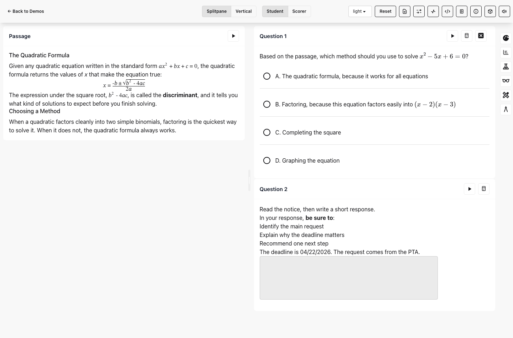

Beyond the student-facing tools, PIE Players also ships a set of developer and QA packages for exercising the toolkit itself. These publishable `@pie-players/*` web components include a PNP debugger (`section-player-tools-pnp-debugger`), a reusable TTS settings panel (`section-player-tools-tts-settings`), and session, event, and instrumentation debuggers (`section-player-tools-session-debugger`, `section-player-tools-event-debugger`, `section-player-tools-instrumentation-debugger`) built on a shared base (`section-player-tools-shared`). They let integrators inspect and drive PNP-driven tool policy, TTS settings, session state, runtime events, and instrumentation while building or validating a host, which makes the tools and accessibility-settings system easier to test with confidence.

## Text to Speech (Read Aloud)

Text-to-speech is the one area in this comparison where PIE Players clearly leads an application-specific implementation rather than trailing it. SchoolCity’s read-aloud is a product-specific front-end wired directly to the SchoolCity TTS backend. In the Renaissance context PIE uses that same SchoolCity backend today through the `@pie-players/tts-server-sc` custom-backend adapter — but in PIE the SchoolCity service is just one pluggable provider behind a reusable, standards-aligned TTS subsystem that ships with the toolkit and is shared with the QTI player in `pie-qti`.

Capabilities verified in this repository:

- **Pluggable, multi-backend providers.** A zero-dependency core interface (`@pie-players/pie-tts`) with shipped server providers for AWS Polly (`tts-server-polly`) and Google Cloud TTS (`tts-server-google`), the SchoolCity-backed adapter (`tts-server-sc`), and a browser-side client (`tts-client-server`). Any backend can be added by implementing the same provider interface.
- **Always-available browser fallback.** The toolkit always includes a Web Speech API provider, so read-aloud works with zero server configuration and degrades gracefully when a server provider is unavailable — an improvement over a single hard-wired backend.
- **Word- and block-level highlighting.** Server providers return millisecond-precise speech marks for word-level tracking; the highlight pipeline picks the smallest reliable visible target and falls back through sentence, region, and whole-formula blocks rather than ever showing a wrong or lagging highlight.
- **Mixed DOM + SSML model, aligned to QTI.** PIE reads visible DOM text directly and also plays authored SSML supplied through QTI 3.0 accessibility catalogs (`data-catalog-idref` + `<speak>`), mixing the two per region. `SSMLExtractor` can lift inline `<speak>` markup into catalogs. This authored-pronunciation path is exactly what SchoolCity’s “Custom Speech” and “Text to Speech Pronunciation” markup cover.
- **On-the-fly math speech.** Rendered MathML is converted to natural-language speech with the Speech Rule Engine (ClearSpeak), plus a math alignment plan so formulas can be highlighted glyph-by-glyph or as a whole-formula block — high-fidelity math read-aloud without pre-recorded audio.
- **Customizable control bar.** Hosts can configure any number of inline speed buttons (with custom labels), hide them entirely, and choose placement via layout modes (`reserved-row`, `expanding-row`, `floating-overlay`, `left-aligned`), alongside voice, rate, language, and engine settings.
- **Instrumentation and QA tooling.** The TTS service emits telemetry, and the toolkit ships a reusable settings/preview panel (`section-player-tools-tts-settings`) plus an instrumentation debugger for validating providers, voices, speech marks, and highlighting inside a host.

The Learnosity comparison is favorable as well. Based on public Learnosity documentation, read-aloud in Learnosity is delivered through marketplace partner integrations — ReadSpeaker and Everway/Texthelp’s SpeechStream — rather than a native first-party engine. Those partners do offer word/sentence highlighting and math reading, but as separately licensed third-party products layered onto the platform. PIE instead ships read-aloud as a first-party, standards-aligned subsystem with swappable backends, authored SSML plus generated math speech, and a customizable control bar. PIE’s mixed DOM/SSML-catalog model aligned to the QTI standard goes beyond what SchoolCity’s app-specific front-end exposes and, as far as public documentation shows, beyond what Learnosity surfaces as a built-in capability.

## Learnosity Parity Snapshot

Learnosity is the closest comparator in this report for an assessment-engine-style tool surface. Its public documentation separates tools across the Items/Assess player, the Accessibility Panel, Features, Response Masking, and the Annotations API. The screenshots in this section are captured from the local Pieoneer Learnosity Items API preview (assess mode), rendering a real Learnosity demo item with the assess toolbar configured to show Calculator, Ruler, Protractor, Line Reader, Response Masking, and Accessibility.

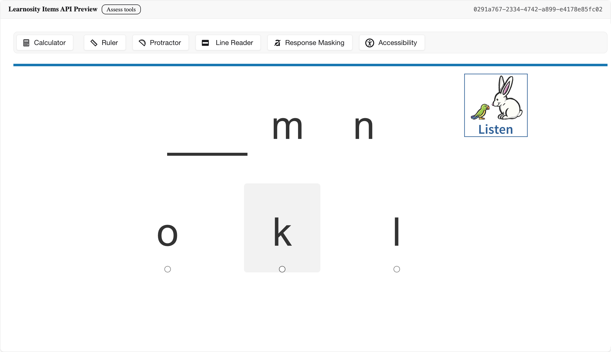

| Learnosity capability | Current PIE status | Parity read |
| --- | --- | --- |
| Assessment-player tool placement | PIE supplies the reusable tools and placement contracts; in the Renaissance context Quiz Engine (not the PIE assessment player) owns the assessment-player chrome and assessment-level controls. | Out of direct scope. The integrated player chrome is a Quiz Engine/host concern, so Learnosity’s all-in-one player is a different integration model rather than a PIE gap. |
| Accessibility panel / visual settings | PIE has a theme/color-scheme tool plus a QTI-aligned settings system: Personal Needs & Preferences (PNP)-driven tool policy and cascading assessment- and item-level QTI 3.0 accessibility catalogs. The student-facing settings widget (contrast, font size, zoom pickers) is a Quiz Engine/host surface; adjustable font size/type is tracked under PIE-500. | Strong underneath, host-owned on top. The one-panel settings widget is a Quiz Engine/host concern, not a PIE gap; PIE’s standards-aligned PNP and accessibility-catalog model is robust and complete for cascading, profile-driven delivery. |
| Line reader | PIE has a packaged `lineReader` overlay. | Strong. The core student purpose matches, with expected placement/styling differences. |
| Response masking / answer elimination | PIE has a packaged `answerEliminator` built on an extensible adapter registry — it ships adapters for multiple-choice, EBSR, and inline-dropdown, with priority-based auto-detection, pluggable elimination strategies (strikethrough/mask), per-element state, and a `registerAdapter` hook for more interaction types. It is not hard-coded to multiple-choice. | Strong. Both cover the same study strategy; PIE’s adapter registry already spans multiple-choice, EBSR, and inline-dropdown and is extensible to more, comparable to how Learnosity scopes response masking to its own set of supported question types. |
| Ruler and protractor | PIE has packaged `ruler` and `protractor` tools. | Strong for tool availability. Product UX still depends on host placement and item/tool policy. |
| Calculator | PIE ships Desmos as a first-class calculator provider (four-function, scientific, and graphing) via `@pie-players/pie-calculator-desmos`, with an assessment/restricted mode, state persistence, and a pluggable provider interface. | PIE-favored. PIE integrates Desmos — the strongest graphing/scientific calculator option available — as its provider. Learnosity’s built-in calculator is basic/scientific only; it can surface Desmos calculators too, but only through a separate Desmos Studio partner integration added per item rather than as its native tool. |
| Annotations: highlighting, sticky notes, notepad, drawing | PIE’s annotation toolbar covers content highlight/underline, implemented with the modern CSS Custom Highlight API (no DOM mutation, screen-reader-safe, with separate persistent-annotation and transient-TTS highlight layers). Persistent sticky notes, a cross-item notepad, and a freehand drawing layer are assessment-level surfaces owned by Quiz Engine/host rather than packaged PIE toolkit tools. | Mixed ownership. Content highlighting is covered by PIE; the notes, notepad, and drawing surfaces are assessment-level (Quiz Engine/host) concerns in the Renaissance context, not PIE toolkit gaps. |

The practical takeaway is that Learnosity validates the same split already visible in the SchoolCity analysis: overlay/reference tools are mostly covered by PIE, while response-type breadth is still broader in Learnosity. Several of Learnosity’s other apparent advantages fall outside a fair PIE-to-Learnosity comparison in the Renaissance context. First, integrated assessment-player controls, persistent annotation surfaces (sticky notes, a cross-item notepad, freehand drawing), and other assessment-level chrome are owned by Quiz Engine, not the PIE assessment player, so they are not PIE toolkit gaps. Second, the student-facing accessibility settings widget is likewise a Quiz Engine/host surface; underneath it, PIE already ships a QTI-aligned settings system — Personal Needs & Preferences (PNP)-driven tool policy plus cascading assessment- and item-level QTI 3.0 accessibility catalogs — that is strong and standards-complete. PIE should continue to avoid cloning Learnosity’s whole platform surface; the high-value comparison is whether PIE exposes reusable tools and clean contracts that the Renaissance assessment host can place, configure, persist, and report on.

### Learnosity Visual Examples

These examples are captured from the local Pieoneer Learnosity Items API preview (assess mode) at `/etl/playground/lsypie/lookup/lsypreview`, all rendering the same Learnosity demo item. Each shows a tool active over a real Learnosity-rendered item rather than a marketing page. The Notepad and Drawing annotation buttons did not render in this preview, so the annotation surface is described in the table above rather than shown here.

Line Reader: a draggable reading overlay that masks the page except for one band of content.

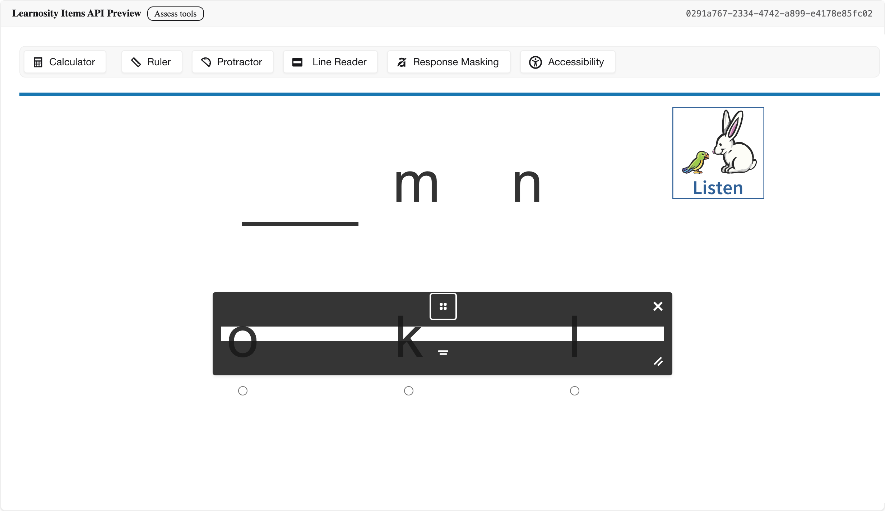

Response Masking: toggling the tool dims the answer options so the student can visually eliminate choices without changing the underlying response.

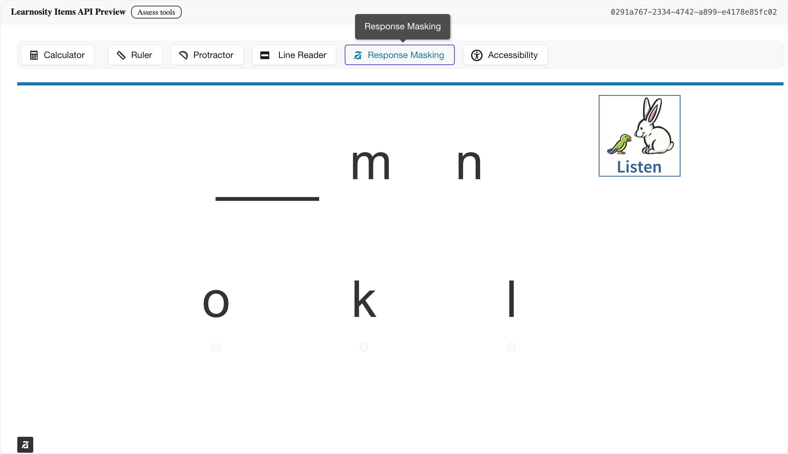

Ruler and protractor: draggable measurement overlays from the assess toolbar, shown here together over the item.

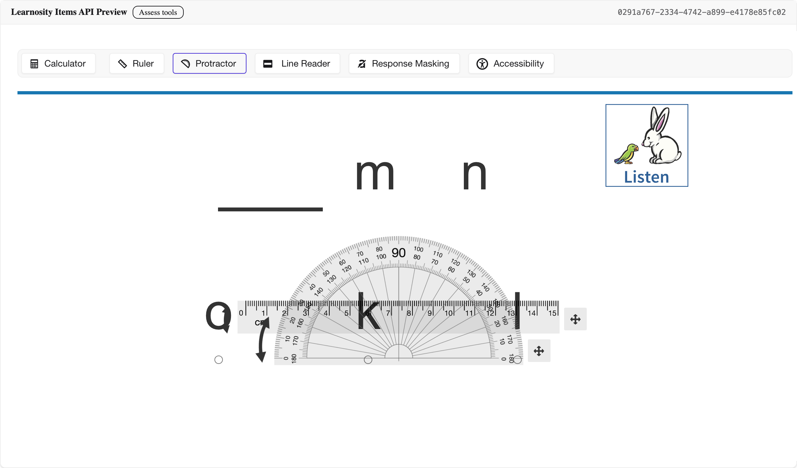

Accessibility panel: a single student-facing dialog combining color scheme, font size, and zoom controls. In PIE’s model this widget layer belongs to Quiz Engine/host chrome, while PIE owns the QTI-aligned settings underneath it (PNP-driven tool policy and cascading QTI 3.0 accessibility catalogs).

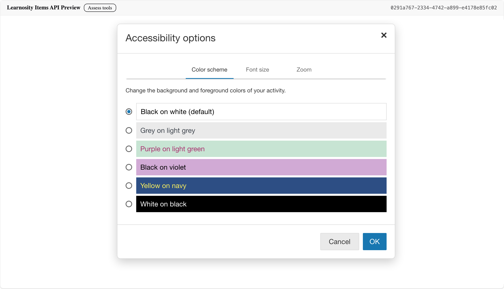

## Assessment-Level Tools

The master document divides most student tools into assessment-level tools first. The table below follows that list and maps each row to the current PIE status and likely ownership.

| SchoolCity tool | SchoolCity source | Current PIE status | Likely owner | Parity |
| --- | --- | --- | --- | --- |
| Calculator | Master DOCX; [Calculators](https://support.renaissance.com/s/article/Online-Tools-Calculators-1752860893682?language=en_US) | Present in PIE as calculator packages, but intentionally outside this report’s parity scope. | Toolkit / host provider | Out of parity scope |
| Full Assessment Translation | Master DOCX; [Language Translation](https://support.renaissance.com/s/article/Online-Tools-Language-Translation-1752860896306?language=en_US) | No packaged PIE full-assessment translation tool. | Host / localization service | Missing |
| Color Contrast | Master DOCX; [Visual Aides](https://support.renaissance.com/s/article/Online-Tools-Visual-Aides-1752860897682?language=en_US) | PIE has `theme` / color scheme tooling plus host-level theme support in demos. The recommended host-integrated path is the player/theme system rather than a SchoolCity-style top-bar setting. | Toolkit + host theme integration | Partial |
| English Dictionary | Master DOCX; [Visual Aides](https://support.renaissance.com/s/article/Online-Tools-Visual-Aides-1752860897682?language=en_US) | No packaged PIE dictionary tool. | Toolkit or host service decision | Missing |
| Graph | Master DOCX; [Visual Aides](https://support.renaissance.com/s/article/Online-Tools-Visual-Aides-1752860897682?language=en_US) | PIE has a packaged `graph` tool. | Toolkit | Partial |
| Highlighter | Master DOCX; [Visual Aides](https://support.renaissance.com/s/article/Online-Tools-Visual-Aides-1752860897682?language=en_US) | PIE has `annotationToolbar` / `highlighter` using the same custom element, implemented with the modern CSS Custom Highlight API (no DOM mutation, screen-reader-safe) instead of legacy span wrapping. It covers highlight/underline but not SchoolCity’s combined dictionary/translate/comment selection surface. | Toolkit | Partial |
| Line Reader | Master DOCX; [Visual Aides](https://support.renaissance.com/s/article/Online-Tools-Visual-Aides-1752860897682?language=en_US) | PIE has a packaged `lineReader` overlay. | Toolkit | Strong |
| Notes | Master DOCX; [Visual Aides](https://support.renaissance.com/s/article/Online-Tools-Visual-Aides-1752860897682?language=en_US) | No packaged PIE notes tool. | Host / session persistence | Missing |
| Periodic Table | Master DOCX; [Visual Aides](https://support.renaissance.com/s/article/Online-Tools-Visual-Aides-1752860897682?language=en_US) | PIE has a packaged `periodicTable` tool. | Toolkit | Strong |
| Picture Dictionary | Master DOCX; [Visual Aides](https://support.renaissance.com/s/article/Online-Tools-Visual-Aides-1752860897682?language=en_US) | No packaged PIE picture dictionary tool. | Toolkit or host service decision | Missing |
| Protractor | Master DOCX; [Visual Aides](https://support.renaissance.com/s/article/Online-Tools-Visual-Aides-1752860897682?language=en_US) | PIE has a packaged `protractor` tool. | Toolkit | Strong |
| Ruler | Master DOCX; [Visual Aides](https://support.renaissance.com/s/article/Online-Tools-Visual-Aides-1752860897682?language=en_US) | PIE has a packaged `ruler` tool. | Toolkit | Strong |
| Spanish Dictionary | Master DOCX; [Language Translation](https://support.renaissance.com/s/article/Online-Tools-Language-Translation-1752860896306?language=en_US) | No packaged PIE Spanish dictionary tool. | Toolkit or host service decision | Missing |
| Text Magnifier | Master DOCX; [Visual Aides](https://support.renaissance.com/s/article/Online-Tools-Visual-Aides-1752860897682?language=en_US) | No packaged PIE magnifier tool. PNP feature naming exists, but not a shipped packaged tool. | Toolkit / accessibility service | Missing |
| Text to Speech | Master DOCX; [Text to Speech](https://support.renaissance.com/s/article/Online-Tools-Text-to-Speech-1752860897670?language=en_US) | PIE ships a first-class, multi-backend TTS subsystem: browser fallback plus AWS Polly, Google, and SchoolCity providers, with word- and block-level highlighting, authored SSML via QTI catalogs, and on-the-fly math speech. | Toolkit / provider | Strong |
| Underline | Master DOCX; [Visual Aides](https://support.renaissance.com/s/article/Online-Tools-Visual-Aides-1752860897682?language=en_US) | Covered through PIE annotation toolbar. | Toolkit | Partial |
| Translate Selection | Master DOCX; [Visual Aides](https://support.renaissance.com/s/article/Online-Tools-Visual-Aides-1752860897682?language=en_US) | No packaged PIE selected-text translation tool. | Toolkit or host service decision | Missing |
| Flag | Master DOCX; [Visual Aides](https://support.renaissance.com/s/article/Online-Tools-Visual-Aides-1752860897682?language=en_US) | Not a packaged PIE toolkit tool. This belongs in assessment navigation/chrome. | Host | Host-owned |
| Browser Zoom Support | Master DOCX | Browser-native capability, not a PIE toolkit tool. | Browser / host guidance | Out of parity scope |
| Comment | Master DOCX; [Visual Aides](https://support.renaissance.com/s/article/Online-Tools-Visual-Aides-1752860897682?language=en_US) | No packaged anchored comment tool. | Host / annotation persistence | Missing |
| Custom Speech | Master DOCX; [Online Markup](https://support.renaissance.com/s/article/Online-Markup-for-Item-Bank-Assessments-1752860897413?language=en_US) | Covered by authored SSML in QTI 3.0 accessibility catalogs (`data-catalog-idref` + `<speak>`), which the TTS service plays in a mixed DOM/SSML model; `SSMLExtractor` lifts inline markup into catalogs. | Toolkit + authored SSML catalogs | Strong |
| Pop-up | Master DOCX; [Visual Aides](https://support.renaissance.com/s/article/Online-Tools-Visual-Aides-1752860897682?language=en_US) | No packaged toolbar tool. Likely authored content behavior. | Item / content markup | Item-owned |
| Rollover | Master DOCX; [Visual Aides](https://support.renaissance.com/s/article/Online-Tools-Visual-Aides-1752860897682?language=en_US) | No packaged toolbar tool. Likely authored content behavior. | Item / content markup | Item-owned |
| Resources | Master DOCX; [Online Markup](https://support.renaissance.com/s/article/Online-Markup-for-Item-Bank-Assessments-1752860897413?language=en_US) | No packaged resources panel/tool in PIE Players. Embedded media exists in content, but that is not the same capability. | Host / content | Missing |
| Writing Checklists | Master DOCX; [Writing Checklist](https://support.renaissance.com/s/article/Online-Tool-Writing-Checklist-1752860897688?language=en_US) | No packaged writing checklist tool. | Host / item content | Missing |
| Equation Editor | Master DOCX; [Equation Editor](https://support.renaissance.com/s/article/Online-Tools-Equation-Editor-1752860895748?language=en_US) | Not a packaged assessment toolkit tool. The master document explicitly raises ownership as a PIE item/response-editor decision. | Item / response editor | Item-owned |
| Spell Check | Master DOCX; [Visual Aides](https://support.renaissance.com/s/article/Online-Tools-Visual-Aides-1752860897682?language=en_US) | No packaged PIE spell check tool. | Response editor | Missing |
| Answer Eliminator | Master DOCX; [Visual Aides](https://support.renaissance.com/s/article/Online-Tools-Visual-Aides-1752860897682?language=en_US) | PIE has a packaged `answerEliminator` for choice elimination. SchoolCity’s visual affordance and state model differ. | Toolkit | Partial |
| Disregard Item Level Settings | Master DOCX | Product/configuration behavior, not a student runtime tool. | Host / authoring configuration | Host-owned |
| Online Markup text to speech | Master DOCX | Covered by PIE’s authored-SSML catalog path and generated speech; read-aloud markup is delivered through QTI accessibility catalogs rather than an item-only markup tool. | Toolkit + authored SSML catalogs | Strong |
| Media Upload | Master DOCX | No packaged toolkit tool. Belongs to response editors for CR/WP or similar item types. | Response editor | Item-owned |
| Speech to Text | Master DOCX; [Speech to Text](https://support.renaissance.com/s/article/Online-Tools-Speech-to-Text-1752860897146?language=en_US) | No packaged PIE speech-to-text tool. | Response editor / host service | Missing |
| Text to Speech Pronunciation | Master DOCX | Authored SSML (pronunciation, prosody, emphasis) via QTI catalogs, plus Speech-Rule-Engine math pronunciation generated on the fly. | Toolkit + authored SSML catalogs | Strong |
| Robust Text Editor | Master DOCX | Not a packaged toolkit tool. The master document frames this as a text-editor ownership and licensing decision. | Response editor / item | Item-owned |

## Visual Examples

Local SchoolCity screenshots extracted from the master DOCX are not embedded here because the source images include visible user identifiers and assessment content. The SchoolCity side is therefore cited through the master document and the public support URLs below; the embedded images in this section are current PIE screenshots captured from `section-demos`.

### Translation And Dictionaries

SchoolCity exposes full-assessment translation and selected-text dictionary / picture dictionary / translation experiences. PIE does not currently have packaged equivalents for these language-support tools.

SchoolCity source: [Language Translation](https://support.renaissance.com/s/article/Online-Tools-Language-Translation-1752860896306?language=en_US)

SchoolCity source: [Visual Aides](https://support.renaissance.com/s/article/Online-Tools-Visual-Aides-1752860897682?language=en_US)

### Color Contrast / Theme

SchoolCity presents color contrast as an online tool/settings affordance. PIE supports a packaged theme tool and host-level theme integration. In the demos, the host DaisyUI theme selector affects demo chrome, while the PIE theme tool applies toolkit/player color schemes.

SchoolCity source: [Visual Aides](https://support.renaissance.com/s/article/Online-Tools-Visual-Aides-1752860897682?language=en_US)

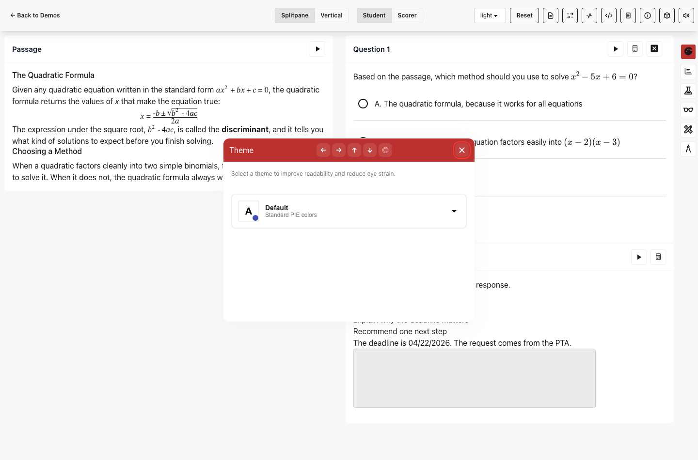

PIE’s theming is consistent across the whole player surface, not just a background color. Selecting a theme updates the color tokens (`--pie-*` variables) everywhere at once — passage and item text, choice rows, dividers, and even control and button styling all follow the active scheme. The previews below show the same section player in the built-in dark and light themes and in a custom “valentine” theme; the buttons, checkboxes, and toolbar restyle with each theme rather than only the page background changing.

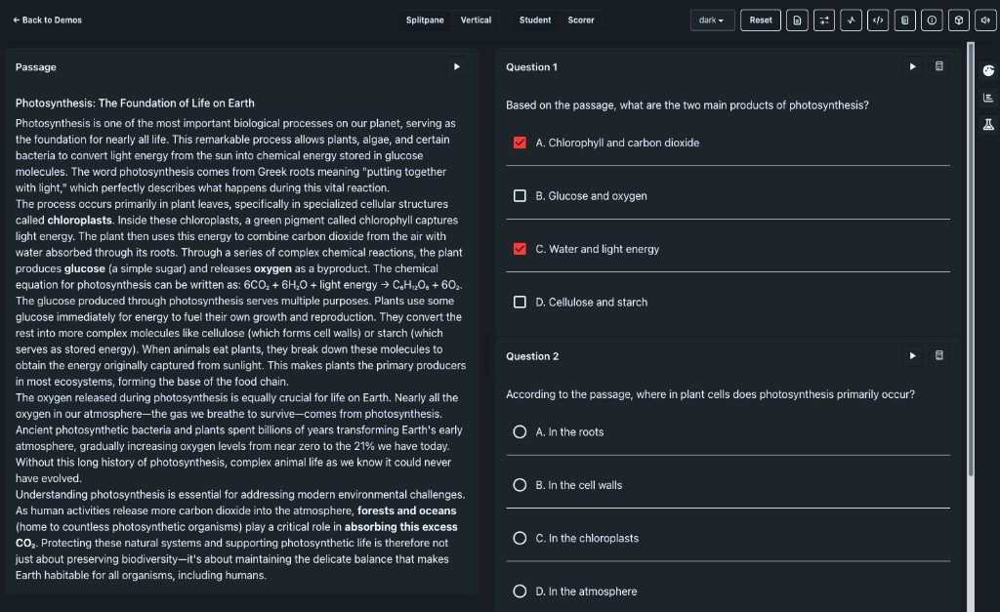

Built-in dark theme.

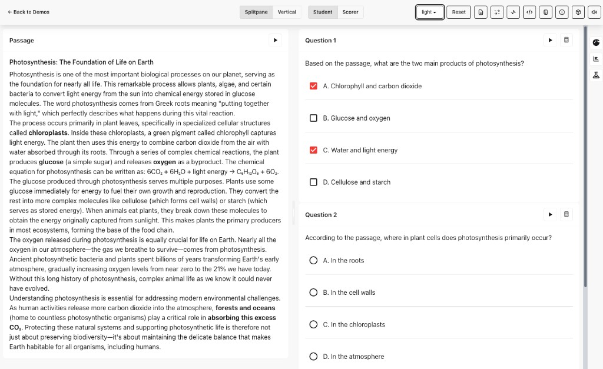

Built-in light theme.

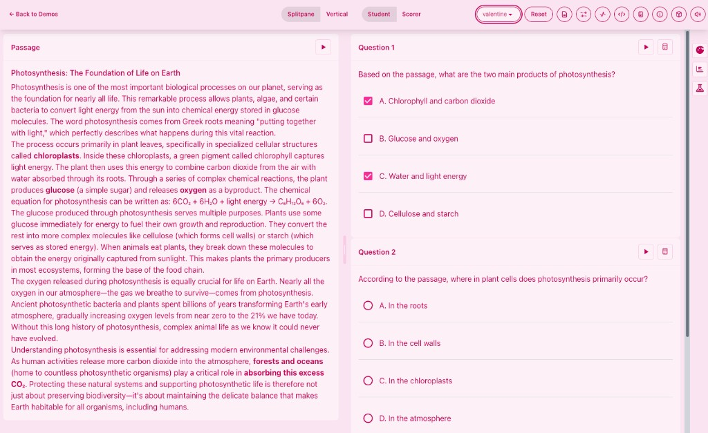

Custom “valentine” theme. Notice the buttons, checkboxes, and toolbar restyle with the scheme, not just the page background.

### Annotation, Highlighter, And Underline

SchoolCity’s selected-text surface groups highlighter, underline, dictionary, picture dictionary, translate selection, and comments more closely. PIE’s annotation toolbar currently covers highlight and underline. Dictionary, selected-text translation, and anchored comment parity remain gaps.

Highlighting itself is a core capability of the assessment toolkit, and PIE implements it with the modern CSS Custom Highlight API (`CSS.highlights` + `::highlight()`) rather than the legacy approach of wrapping selected text in `` elements. Because it paints ranges without mutating the DOM, it avoids the layout shifts, broken text selection, and re-render cost that span-wrapping causes; it keeps the underlying text intact for screen readers; and it supports separate, independently styled layers — persistent multi-color student annotations and transient TTS read-along highlighting — over the same content. A single `HighlightCoordinator` powers annotation, answer-eliminator, and TTS word/sentence highlighting, with theme-adaptive (WCAG-contrast) colors and range serialization for annotation persistence, and it feature-detects support so it degrades gracefully where the API is unavailable.

SchoolCity source: [Visual Aides](https://support.renaissance.com/s/article/Online-Tools-Visual-Aides-1752860897682?language=en_US)

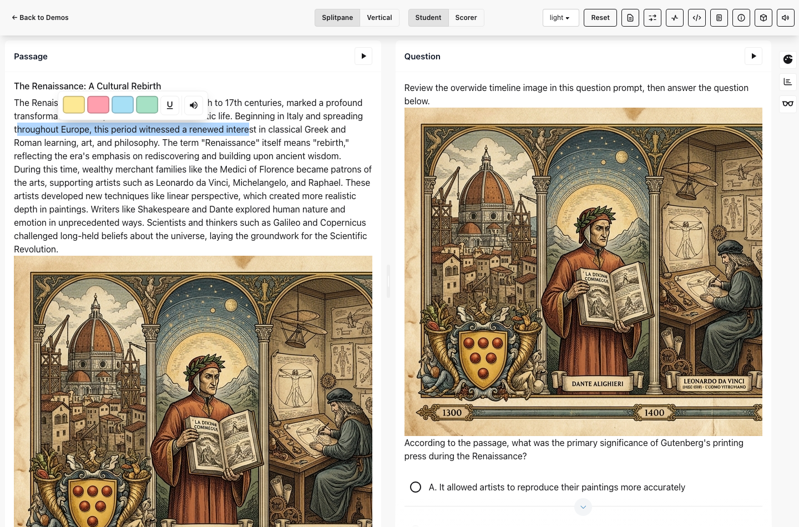

### Line Reader

Line reader is one of the stronger matches. Both products provide a reading overlay. The exact control placement and styling differ, but the core student purpose is covered by PIE’s packaged line reader.

SchoolCity source: [Visual Aides](https://support.renaissance.com/s/article/Online-Tools-Visual-Aides-1752860897682?language=en_US)

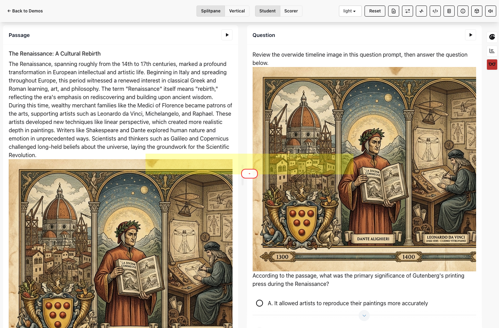

### Measurement And Reference Tools

PIE has strong packaged coverage for ruler, protractor, and periodic table. Graph is present as a packaged tool, but the expected product-level graphing behavior should be confirmed against the assessment host and provider expectations.

SchoolCity source: [Visual Aides](https://support.renaissance.com/s/article/Online-Tools-Visual-Aides-1752860897682?language=en_US)

SchoolCity source: [Visual Aides](https://support.renaissance.com/s/article/Online-Tools-Visual-Aides-1752860897682?language=en_US)

SchoolCity source: [Visual Aides](https://support.renaissance.com/s/article/Online-Tools-Visual-Aides-1752860897682?language=en_US)

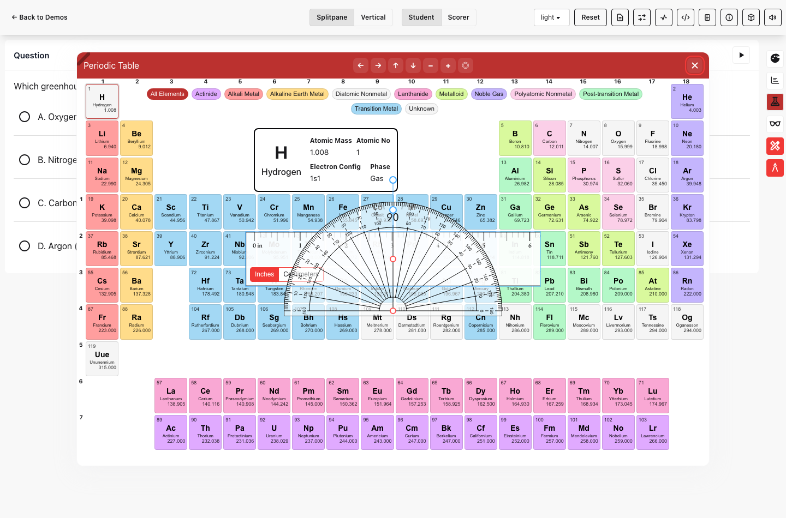

### Answer Eliminator

PIE has an answer eliminator tool for multiple-choice choices. SchoolCity’s student affordance and state treatment should still be compared carefully in product UX review, but this is not a missing toolkit capability.

SchoolCity source: [Visual Aides](https://support.renaissance.com/s/article/Online-Tools-Visual-Aides-1752860897682?language=en_US)

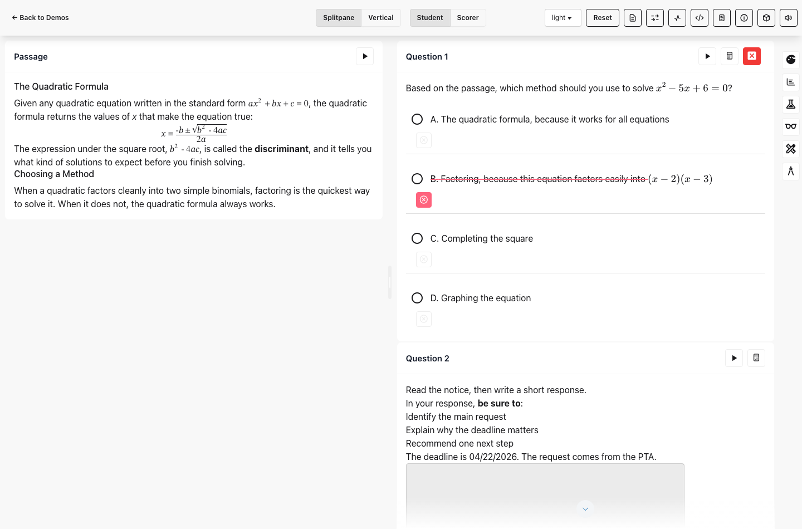

### Notes, Comments, Resources, And Markup

Notes, comments, resources, custom speech, rollovers, and pop-ups are important SchoolCity affordances, but they are not currently packaged PIE toolkit tools. These need ownership decisions before implementation: some belong in host chrome and persisted session state, while others belong in authored content markup or PIE item rendering.

SchoolCity source: [Visual Aides](https://support.renaissance.com/s/article/Online-Tools-Visual-Aides-1752860897682?language=en_US)

SchoolCity source: [Online Markup](https://support.renaissance.com/s/article/Online-Markup-for-Item-Bank-Assessments-1752860897413?language=en_US)

SchoolCity source: [Online Markup](https://support.renaissance.com/s/article/Online-Markup-for-Item-Bank-Assessments-1752860897413?language=en_US)

## Overlay Tools Versus Text-Interacting Tools

The master document makes a useful implementation distinction:

- Overlay/reference tools usually sit above or beside content and do not need to mutate item text. Ruler, protractor, periodic table, graph, line reader, and theme/color schemes mostly fall into this bucket.
- Text-interacting tools need selection, text range mapping, persistence, and sometimes content-language services. Highlighter, underline, dictionary, picture dictionary, translate selection, comments, custom speech, rollovers, and pop-ups fall into this bucket.

PIE is strongest in the overlay/reference bucket, and its current packaged tools already cover most of those capabilities. More important than the specific catalog of shipped tools, though, is that the assessment toolkit is a generic, application-independent framework for building them. Tools are registered against a shared contract (`ToolRegistration` / `ToolRegistry`, coordinated by `ToolkitCoordinator`) with PNP-driven tool policy, item/passage/section scoping, draggable/resizable tool shells, and visibility subscriptions, so a host or product can add its own tool using the exact same API as the built-ins. PIE ships a useful set of pre-fab tools, but standing up a new one is very doable — the section-demos app, for example, registers its own custom tools (such as a word counter) through the public registration API rather than forking the toolkit.

Just as important, cross-cutting concerns are solved once by the framework rather than re-implemented per tool. A single `ToolkitCoordinator` owns the shared services (tool policy, the `HighlightCoordinator`, `TTSService`, element tool state, and accessibility-catalog resolution); tools draw on common theming tokens (`--pie-*` variables and the `pie-theme` element) for automatic light/dark and high-contrast adaptation; highlighting runs through the one CSS Custom Highlight API layer; and capabilities such as `CSS.highlights` and `Intl.Segmenter` are feature-detected centrally with graceful fallbacks. A new tool therefore inherits consistent theming, accessibility, highlighting, policy, and capability-detection behavior without re-solving any of it.

The larger questions in the text-interacting and service-backed bucket are therefore less about whether PIE can build a given tool and more about decisions on selection range models, content ownership, persistence, language services, and whether a feature belongs in the toolkit, the assessment host, or item rendering.

## Text Editor, Equation Editor, And PIE Item Ownership

The master document calls out three ownership decisions:

- **Text editor**: choose a robust editor that meets product needs and works with the open-source PIE licensing model.
- **Equation editor**: SchoolCity has equation editor support, but ownership should likely shift toward PIE items and response editors if PIE is overhauling this area.
- **Custom speech / markup tools**: SchoolCity’s custom speech and markup affordances may need to be built into PIE item content or authoring flows rather than the generic assessment toolkit.

Those should not be treated as simple toolbar parity gaps. They affect item authoring, response capture, accessibility, content serialization, scoring, and licensing.

## Item-Level Tools

The master document lists several item-level controls. These are mostly authoring or response-editor capabilities, not assessment toolbar tools. Cross-checked against the current PIE elements source in `pie-elements-ng`, most of them already exist today as item model and configuration fields (noted per row), so the question is largely whether to keep, relocate, or retire them rather than whether PIE can do them.

| SchoolCity item-level capability | Master document evidence | Current PIE ownership read | Parity |
| --- | --- | --- | --- |
| Partial Credit Scoring | Master DOCX image mapping: `word/media/image27.png`; local extract not stored | Implemented in PIE items: `multiple-choice` ships `partialScoring` (on by default) and `scoringType`; `ebsr` carries partial scoring controlled by the host environment. | Supported (item-owned) |
| Relative Scoring | Master DOCX image mapping: `word/media/image28.png`; local extract not stored | Supported by the PIE backend (`pie-api-aws`), not the item model: every item is scored on a normalized 0–1 scale and then scaled to a configurable integer maximum via the runtime `maxPoints` parameter (e.g. `maxPoints: 3` → 0–3, rounded to the nearest integer). Combined with `partialScoring`, this provides relative point weighting across items. | Supported (backend-owned) |
| Drawing Tool | Master DOCX image mapping: `word/media/image29.png`; local extract not stored | Implemented as the packaged `drawing-response` element; `extended-text-entry` also supports teacher annotation marks. | Supported (item-owned) |
| Character Limit | Master DOCX image mapping: `word/media/image30.png`; local extract not stored | `extended-text-entry` enforces a character limit (`charactersLimit`), but currently applies a fixed default rather than an exposed authoring control. | Partial (item-owned) |
| Editable Part A/B label | Master DOCX row, no distinct extracted image | Implemented in `ebsr`: `partLabels` plus `partLabelType` (the "Part Labels" setting). | Supported (item-owned) |
| Type of Choices selector | Master DOCX image mapping: `word/media/image31.png`; local extract not stored | Implemented in `multiple-choice`/`ebsr` as `choicePrefix` (the "Choice Labels" setting: letters/numbers/none). | Supported (item-owned) |
| Text Options | Master DOCX image mapping: `word/media/image32.png`; local extract not stored | Closest match is the shared rich-text editor toolbar options (`baseInputConfiguration`); exact SchoolCity scope unconfirmed. | Partial (item-owned) |
| Limit number of choices | Master DOCX image mapping: `word/media/image33.png`; local extract not stored | Implemented in `multiple-choice` via `minAnswerChoices`/`maxAnswerChoices` authoring bounds. | Supported (item-owned) |
| Type of Choices language | Master DOCX image mapping: `word/media/image34.png`; local extract not stored | Implemented in `multiple-choice`/`ebsr` via `language`/`languageChoices` (the "Specify Language" setting). | Supported (item-owned) |
| Lock Choices Order | Master DOCX image mapping: `word/media/image35.png`; local extract not stored | Implemented in `multiple-choice`/`ebsr` as `lockChoiceOrder` ("Lock Choice Order", on by default); host policy may still influence shuffling. | Supported (item-owned / host-influenced) |
| Answer Choice Format | Master DOCX image mapping: `word/media/image36.png`; local extract not stored | Implemented in `multiple-choice` via `choiceMode` (radio/checkbox), `choicesLayout`, and `gridColumns`. | Supported (item-owned) |
| Answer Hint | Master DOCX image mapping: `word/media/image37.png`; local extract not stored | Closest match is `multiple-choice` `rationale` plus `teacherInstructions`; a distinct student-facing "hint" affordance is not a separate field. | Partial (item-owned) |

Because PIE elements already implement most of these as item-level model fields, the open product decision is less about building them and more about whether each should remain an item-level knob, move upward to assessment-level configuration, or be simplified or discontinued during migration. The genuine gaps here are narrower: author-configurable character limits and a distinct student-facing answer hint. Relative scoring is already handled by the PIE backend through `maxPoints` score scaling rather than a per-item knob.
