# Summary

This report refreshes the SchoolCity-to-PIE tool comparison using the [master gap-analysis document](https://renlearncrm-my.sharepoint.com/personal/justin_elston_renaissance_com/_layouts/15/Doc.aspx?sourcedoc=%7B41F7ACE6-1D81-40D5-91CE-DBC5D6BDD811%7D&file=SchoolCity%20and%20PIE%20Items%20gap%20analysis%20-%20visual%20examples.docx&action=default&mobileredirect=true) as the source of truth for SchoolCity behavior and visuals, while using this repository as the source of truth for the current PIE Players state. It also adds a Learnosity parity lens based on public Learnosity documentation and live screenshots from a local Pieoneer Learnosity Items API preview.

Reviewed and extended 2026-08-15. The SchoolCity column is now checked against the implementing source — `sc-online-testing`, `sc-suite-student`, `sc-suite-staff` and the three `sc-texttospeech-*` repositories — rather than the master document alone, and the Learnosity column against current documentation. Where the two disagree the row says so. Claims sourced from code are marked as verified in code; claims sourced from documentation are marked as documented, and the two are not merged.

Corrected 2026-08-16 on three rows. All three claims survived the August source-verification pass and failed only when someone implemented against the row, so reading a file for what it declares is a weaker check than reading it against the elements this repository renders. PIE-479's gap is discovery, not selection: voice selection was already plumbed. PIE-478's stylesheet was not merely unwired but aimed at an element this repository does not render, and regressed heading sizes wherever a host did apply it. And PIE-472's "scheme count" delta is eleven host-registrable overlays costing 2 to 18 tokens each, not eleven missing framework palettes. Jira was read for those three stories, which the [verification record](./schoolcity-parity-verification-record-2026-08.md) had noted as not consulted; PIE-472's status contradicted the table and now says so.

The main conclusion is unchanged in shape: PIE Players has reusable packaged tools for the core visual, measurement, and reference overlay set — theme/color schemes, line reader, annotation/highlighting, answer eliminator, ruler, protractor, graph, periodic table, and both dictionaries — and SchoolCity’s student tool surface remains broader, including translation tools, notes/comments, flags, writing checklists, resources, rollovers/pop-ups, magnifier, spell check, speech-to-text, media upload, robust response-editing controls, and item-authoring controls that are not packaged PIE toolkit tools today.

Four things changed the balance since the June pass, and the claim that read-aloud is the *only* area favoring PIE no longer holds.

- **Formative delivery shipped.** PIE now has a per-item Try budget, feedback reveal as an `env` projection, and a section mastery rollup, with a student-facing check-answer control. The June pass had no row for check-answer because PIE had no such capability; Learnosity does, and this closes it.
- **Two content accommodations shipped, and one exceeds both comparators.** A sign-language (ASL) region and an audio transcript are delivered through the QTI accessibility-catalog rail as policy-gated capabilities. SchoolCity has no signing capability anywhere in its source, so this is the second area where PIE leads rather than trails.
- **Theming and color schemes went from partial to substantially delivered** — ten built-in schemes plus custom registration over a unified resolution path, against six documented for Learnosity and fifteen for SchoolCity.
- **Text-to-speech still favors PIE, with one claim corrected.** Speech-mark fidelity is not uniform across providers as the June pass stated: only the Polly provider delivers authored SSML and native millisecond word offsets simultaneously.

Two findings cut the other way. Learnosity's response-type breadth remains the durable gap and is now quantified — 41 documented question types against 30 PIE elements, including audio recording, video recording and file upload, for which PIE has no equivalent in either repository. And PIE models no assessment time at all, while SchoolCity delivers extended time live over a proctor channel; that is a session model, not a tool.

Two of the master document's rows did not survive source review, which is the strongest argument for treating it as one input rather than the source of truth: "Browser Zoom Support" exists in none of the three SchoolCity repositories and appears to be the magnifier under its real name, and "Picture Dictionary" is already served by a PIE API endpoint, making it a missing player surface over an existing PIE backend rather than a missing capability — a surface that has since been built.

The relevant Renaissance replacement path is a combination of:

- PIE Players toolkit behavior for reusable tools and custom elements.
- Quiz Engine or another assessment host for product chrome, test navigation, flagging, global settings, and tool placement decisions.
- PIE items and response editors for item-owned editing controls such as equation input, spell check, media upload, drawing, and robust text editing.

Quiz Engine status is treated here as product delivery context only. This report does not re-audit Quiz Engine implementation details. Learnosity is treated as an external benchmark for assessment-player tool placement, not as a target for wholesale feature cloning.

## PIE-500 Jira Cross-Reference

The table below maps the work identified by the SchoolCity master document and this report to stories under [PIE-500](https://illuminate.atlassian.net/browse/PIE-500). A ticket can be direct, adjacent, or host/item-owned; this table is not a statement that PIE Players alone should implement every story.

| Report capability / gap | PIE-500 story | Mapping note |
| --- | --- | --- |
| Ruler | [PIE-462](https://illuminate.atlassian.net/browse/PIE-462) Ruler | Direct match; PIE already has a packaged ruler tool. |
| Protractor | [PIE-463](https://illuminate.atlassian.net/browse/PIE-463) Protractor | Direct match; PIE already has a packaged protractor tool. |
| Equation Editor | [PIE-464](https://illuminate.atlassian.net/browse/PIE-464) Equation Editor | Direct item/response-editor ownership match. |
| Robust Text Editor | [PIE-465](https://illuminate.atlassian.net/browse/PIE-465) Undo/ Redo Text Support | Adjacent text-editor work; the master document calls out robust text editor ownership rather than undo/redo specifically. |
| Highlighter | [PIE-466](https://illuminate.atlassian.net/browse/PIE-466) Highlighter | Direct match; PIE annotation toolbar covers highlighting. |
| Line Reader | [PIE-468](https://illuminate.atlassian.net/browse/PIE-468) Line Reader | Direct match; PIE already has a packaged line reader. |
| English Dictionary | [PIE-469](https://illuminate.atlassian.net/browse/PIE-469) English Dictionary | Surface delivered: PIE has a packaged `dictionary` tool. What remains is the corpus, which PIE does not ship. |
| Notes | [PIE-470](https://illuminate.atlassian.net/browse/PIE-470) Student Notes | Direct gap; likely host/session-owned. |
| Flag | [PIE-471](https://illuminate.atlassian.net/browse/PIE-471) Flag Item | Direct host-owned match. |
| Color Contrast / Theme | [PIE-472](https://illuminate.atlassian.net/browse/PIE-472) Ability to apply a high contrast color scheme; [PIE-484](https://illuminate.atlassian.net/browse/PIE-484) Custom Color Schemes | Both substantially delivered since the June pass: ten built-in schemes answer PIE-472 and `registerPieColorSchemes()` answers PIE-484, over a unified theme resolution and an 84-token published registry. SchoolCity ships 15 schemes, and the August pass called the count the remaining delta. Measured, it is not a delta of eleven palettes: four of the 15 are already built in (Black on White, White on Black, Black on Rose, Yellow on Blue, matched by colour pair rather than by label since SchoolCity brands tool names per tenant), and the other eleven are registrable by a host through `registerPieColorSchemes()` with no framework change — see [Color Contrast](#assessment-level-tools). PIE-472 itself is also not open in the way this table implies: it was deferred out of the SB v1 scope, its owner asked for it to move to PD-5359, and the question of which schemes matter and for which learners was never answered. |
| Speech to Text | [PIE-473](https://illuminate.atlassian.net/browse/PIE-473) Speech to Text (STT) | Direct response-editor/service gap. Scoped in [`../prds/speech-to-text.md`](../prds/speech-to-text.md). |
| Translation / Translate Selection / Full Assessment Translation | [PIE-474](https://illuminate.atlassian.net/browse/PIE-474) Translation | Direct language-support gap spanning full assessment and selected text. |
| Pop-up | [PIE-475](https://illuminate.atlassian.net/browse/PIE-475) Popups | Direct item/content-markup match. |
| Rollover | [PIE-476](https://illuminate.atlassian.net/browse/PIE-476) Rollovers | Direct item/content-markup match. |
| Spanish Dictionary | [PIE-477](https://illuminate.atlassian.net/browse/PIE-477) Spanish Dictionary | The packaged `dictionary` tool is language-agnostic and sends the reading language with every lookup, so this is the same surface pointed at a Spanish corpus. The gap is the corpus. |
| Browser Zoom Support | [PIE-490](https://illuminate.atlassian.net/browse/PIE-490) Browser Zoom | Direct platform/browser-support match, but the SchoolCity row behind it does not exist in source — the real tool is `Zoom`, which is the magnifier. Worth confirming with product whether PIE-490 means browser zoom or the magnifier already tracked as PIE-496. |
| Comment | [PIE-491](https://illuminate.atlassian.net/browse/PIE-491) Comments | Direct anchored-comment gap. |
| Graph | [PIE-493](https://illuminate.atlassian.net/browse/PIE-493) Graphing Support | Direct match; PIE has a packaged graph tool, but product/provider expectations need confirmation. |
| Periodic Table | [PIE-494](https://illuminate.atlassian.net/browse/PIE-494) Periodic Table | Direct match; PIE already has a packaged periodic table. |
| Spell Check | [PIE-495](https://illuminate.atlassian.net/browse/PIE-495) Spell Check | Direct response-editor gap. |
| Text Magnifier | [PIE-496](https://illuminate.atlassian.net/browse/PIE-496) Text Magnifier | Direct gap; no packaged PIE magnifier tool. |
| Underline | [PIE-497](https://illuminate.atlassian.net/browse/PIE-497) Underline | Direct match through PIE annotation toolbar. |
| Writing Checklist | [PIE-498](https://illuminate.atlassian.net/browse/PIE-498) Writing Checklist | Direct gap; likely host/content/item-owned. |
| Answer Eliminator | [PIE-499](https://illuminate.atlassian.net/browse/PIE-499) Answer Choice Eliminator | Direct match; PIE has a packaged answer eliminator with UX differences. |
| Resources / References | [PIE-488](https://illuminate.atlassian.net/browse/PIE-488) References | Adjacent match; SchoolCity master document says Resources, while the Jira story says References. Ownership still needs product clarification. |
| Media Upload / Alternative input | [PIE-489](https://illuminate.atlassian.net/browse/PIE-489) Alternative Input Methods | Adjacent response-input work; the master document calls out Media Upload and Speech to Text separately. |
| Custom Speech / TTS pronunciation / audio language support | [PIE-479](https://illuminate.atlassian.net/browse/PIE-479) Multiple Languages Audio Support; [PIE-480](https://illuminate.atlassian.net/browse/PIE-480) Audio Support for Test Content and Instructions | PIE already ships a first-class, multi-backend TTS subsystem with authored-SSML pronunciation through QTI accessibility catalogs; these stories cover broadening multi-language audio coverage rather than a missing TTS capability. PIE-480 narrowed since the June pass: a `spoken` card can now carry recorded audio, so authored human-voice audio for content and instructions is delivered rather than pending. For PIE-479, the SchoolCity backend supports 29 locales with one default voice each, and the gap is narrower than the August pass stated: it is discovery, not selection. `getVoices()` returns empty (`tts-server-sc/src/SchoolCityServerProvider.ts:853`), but `request.voice` is forwarded to the service (`:670`), and the service passes any `VoiceId` it is given straight to Polly, substituting its per-locale default only when `voice` is absent (`sc-texttospeech-api/src/api/polly.js:161`) — so its `voices.js` map is a default table, not an allow-list. What a caller cannot do is learn which locales exist, because the service's whole surface is `GET /ping` and an authenticated `POST /`, with no voice or locale endpoint to ask. So those locales are reachable, but only by a caller that already knows a `lang_id` to hardcode. Two consequences the pass missed: an unrecognized `lang_id` is rewritten to `en-US` rather than refused (`polly.js:153-155`), so an unserved locale returns English audio and no error; and every voice is a Polly *standard* voice, since no `Engine` is ever sent. |
| Full Assessment Translation / bilingual delivery | [PIE-481](https://illuminate.atlassian.net/browse/PIE-481) Bilingual Test Versions (Code Switching) | Adjacent language-delivery work; not a direct selected-text tool match. |
| Disregard item-level settings / accommodation delivery | [PIE-485](https://illuminate.atlassian.net/browse/PIE-485) Student Accommodation Profile Support; [PIE-486](https://illuminate.atlassian.net/browse/PIE-486) IEP/504 Plans Support | Adjacent host/accommodation-policy work. |
| Line reader masking behavior | [PIE-487](https://illuminate.atlassian.net/browse/PIE-487) Masking Tool | Answered by the line reader since the June pass. PIE-811 replaced its highlight/obscure modes with a window view — a transparent pane inside an obscuring frame whose fill and opacity are host settings — so page masking and the reading overlay are one tool. A distinct free-form masking tool, letting a student cover arbitrary regions, remains absent; SchoolCity has none either. |

## PIE-500 Tickets Not Yet Covered By This Document

These [PIE-500](https://illuminate.atlassian.net/browse/PIE-500) child stories have no direct SchoolCity-master-document row. Four of the five do have a verified SchoolCity implementation, found by reading the `sc-*` source rather than the master document — they were missing from the tool rows because they are not toolbar buttons, not because SchoolCity lacks them. Details in [SchoolCity Capabilities Outside The Tool Rows](#schoolcity-capabilities-outside-the-tool-rows).

- [PIE-467](https://illuminate.atlassian.net/browse/PIE-467) Extended Time — SchoolCity delivers this live: a per-student `OnlineDurationMinutes` plus a proctor top-up increment, and socket events that change a running timer mid-test. PIE's assessment toolkit models no time at all, so this is a session-time model plus a control channel rather than a tool.
- [PIE-478](https://illuminate.atlassian.net/browse/PIE-478) Adjustable Font Sizes and Types — scaffolded, and aimed at the wrong element rather than merely unwired. `@pie-players/pie-theme` publishes `./font-sizes.css` with four presets explicitly modelled on Learnosity's (100/125/150/175% via `--pie-font-scale`), nothing in the repository imports it, no tool exposes it, and no capability claims the `fontEnlargement` or `fontFamily` PNP support ids. The August pass recorded that a host could consume the stylesheet today; that was wrong on two counts, found when the file was read against the elements this repo defines. Every rule targeted `pie-player` — the externally loaded item wrapper `players-shared/src/pie/player-initializer.ts` fetches at runtime — so the section player's own content hosts (`pie-item-shell`, `pie-passage-shell`) and the standalone `pie-item-player` were never matched, and a host applying it scaled nothing this repo renders. And selecting a preset regressed items rather than enlarging them: `font-size: inherit !important` on `*` collapses every heading, `<small>` and superscript to body size, at 100% scale and before any accommodation takes effect. No consumer was hit by either defect — every rule is scoped under a `data-font-size` attribute and no recorded host sets it, so the file reaches Host A's bundle and matches nothing there, which the [consumer pad](../integrations/consumer-api-dependencies.md) now records. A second, independent path is equally dead — `ThemeProvider` writes `--pie-font-scale` from a `FontSize` setting (`assessment-toolkit/src/services/ThemeProvider.ts:183`), but nothing constructs it and nothing carries the `.pie-themed` class its rules key on. The two scales agree where they overlap, so there is no conflict to resolve; there was simply no live consumer of the token anywhere.
- [PIE-482](https://illuminate.atlassian.net/browse/PIE-482) Break Timers — no SchoolCity equivalent either. Its model is pause/resume plus a proctor time increment, so a break timer is a new concept rather than a parity gap.
- [PIE-483](https://illuminate.atlassian.net/browse/PIE-483) External Assistive Tech Support — adjacent to SchoolCity's two secure-browser integrations (Respondus LockDown Browser and Microsoft Take a Test), which are lockdown rather than assistive tech but are the nearest implemented behavior.
- [PIE-492](https://illuminate.atlassian.net/browse/PIE-492) Full Screen Mode — implemented in SchoolCity as route middleware that auto-enters fullscreen on every exam route unless LockDown Browser is active. Host chrome, not a toolkit tool.

One workstream outside PIE-500 has landed and belongs in the same view: sign-language (ASL) support, tracked under epic PIE-801 with PIE-879 in `pie-elements-ng`, PIE-880 in `pie-players` and PIE-881 in `pie-api-aws`. The `pie-players` contract is implemented — see [`../prds/sign-language-asl-support.md`](../prds/sign-language-asl-support.md). It has no master-document row because SchoolCity has no signing capability at all.

## How To Read The Classifications

- **Strong** means PIE has a packaged tool with the same core student purpose.
- **Partial** means PIE has related capability, but discovery, placement, interaction model, or scope differs materially.
- **Missing** means no packaged PIE toolkit tool currently covers the SchoolCity capability.
- **Host-owned** means the capability belongs in assessment chrome, Quiz Engine, navigation, content rendering, or product configuration rather than a reusable PIE toolkit tool.
- **Item-owned** means the capability belongs in PIE item rendering, authoring, or response editors.
- **Out of parity scope** means the master document includes the row, but this comparison is not treating it as a gap to solve in this report.

## Current PIE Tool Surface

PIE Players registers these packaged tool IDs through the assessment toolkit (text-to-speech and calculator are covered in their own sections):

- `theme`
- `lineReader`
- `annotationToolbar`
- `highlighter`
- `answerEliminator`
- `ruler`
- `protractor`
- `graph`
- `periodicTable`

Verified against `packages/default-tool-loaders/src/packaged-capability-composition.ts:135-276`, which is the composition table the registry is built from. With `calculator` and `textToSpeech` that is eleven toolbar capabilities, and the list is complete: `PACKAGED_TOOL_ORDER` names exactly those eleven.

Two capabilities landed after the June pass that are not toolbar tools, and the distinction is structural rather than cosmetic. A capability now declares `activation: "region"` and a set of host `surfaces`, so it renders into a slot the host opens instead of behind a button:

- **`audioTranscript`** — the text of an audio prompt, in the packaged set (`packages/default-tool-loaders/src/registrations/audio-transcript.ts:182`). One card shape serves two purposes through a `visibility` discriminant: `"always"` is authored presentation that no profile revokes, anything else is the accommodation, gated on the `transcript` support id. Shipped packaged rather than opt-in because an item authored to show its transcript must show it in every player.
- **`signLanguage`** — a signed (ASL) translation docked beside item or passage content, in its own package `@pie-players/pie-tool-sign-language` (`packages/tool-sign-language/src/sign-language-registration.ts:58-69`). Deliberately absent from `createPackagedToolRegistry`: an accommodation with an authored-content dependency, so a default grant would hand signing to every learner whose item happened to carry a card. Availability is two independent halves, both required — policy granted `signLanguage`, and the item carries a matching `sign-language` catalog card.

Section-player opens three such surfaces — `content-lead`, `content-media` on item and passage cards, and `section-overlay` at section scope (`packages/assessment-toolkit/src/services/ToolRegistry.ts:240-241`). Core defines no slot names and validates only that a region capability claims at least one, so a host can open a new surface without a change in the toolkit. `tool-sign-language` is the worked example of a capability contributed entirely from outside the player: no package in the player names signing, the `signLanguage` support id, or the `sign-language` catalog type.

The screenshot below shows the current section-demos preferred placement, with section-level tools in the assessment chrome and item-level tools beside the active question.

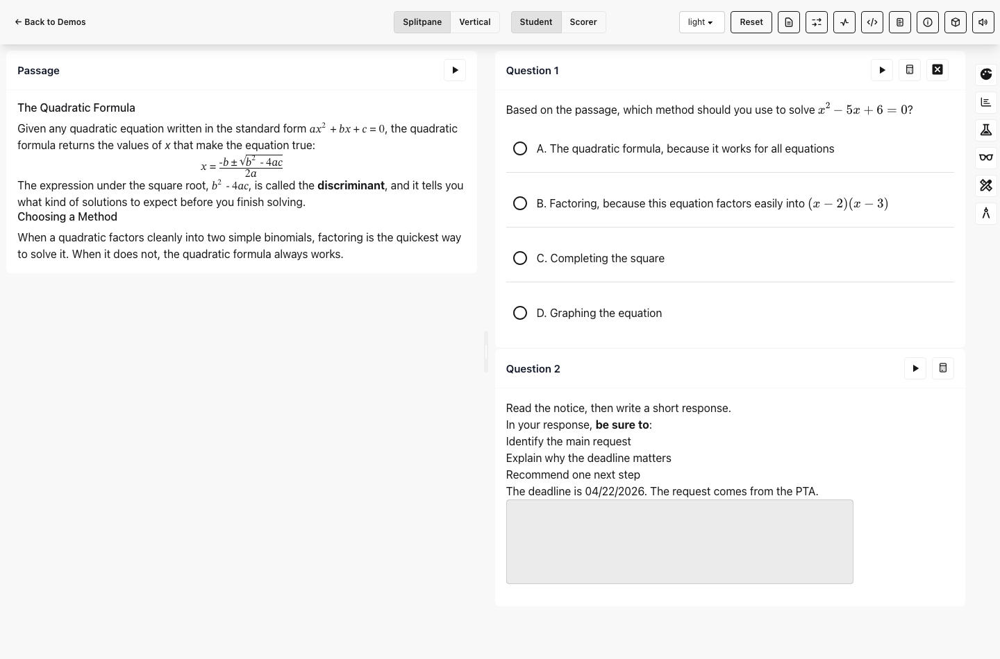

Beyond the student-facing tools, PIE Players also ships a set of developer and QA packages for exercising the toolkit itself. These publishable `@pie-players/*` web components include a PNP debugger (`section-player-tools-pnp-debugger`), a reusable TTS settings panel (`section-player-tools-tts-settings`), and session, event, and instrumentation debuggers (`section-player-tools-session-debugger`, `section-player-tools-event-debugger`, `section-player-tools-instrumentation-debugger`) built on a shared base (`section-player-tools-shared`). They let integrators inspect and drive PNP-driven tool policy, TTS settings, session state, runtime events, and instrumentation while building or validating a host, which makes the tools and accessibility-settings system easier to test with confidence.

## Text to Speech (Read Aloud)

Text-to-speech is the one area in this comparison where PIE Players clearly leads an application-specific implementation rather than trailing it. SchoolCity’s read-aloud is a product-specific front-end wired directly to the SchoolCity TTS backend. PIE reaches that same backend through the `@pie-players/tts-server-sc` custom-backend adapter — but in PIE the SchoolCity service is just one pluggable provider behind a reusable, standards-aligned TTS subsystem that ships with the toolkit and is shared with the QTI player in `pie-qti`.

The SchoolCity service is narrower than "a TTS backend" suggests, and reading its source rather than the master document settles what the adapter is actually integrating with. It is a two-route Fastify app — `GET /ping` and an authenticated `POST /` — over **AWS Polly only** (`sc-texttospeech-api/src/api/polly.js:38-48`), which the Terraform confirms: the ECS task role's sole TTS grant is `AmazonPollyReadOnlyAccess` (`sc-texttospeech-terraform/role.tf:78-80`). It supports 29 locales with one default Polly voice each (`sc-texttospeech-api/src/helpers/voices.js:1-31`), always sends `TextType: "ssml"`, and caches to S3/DynamoDB keyed on a hash of the transformed text. So PIE's "multi-backend" claim is a property of PIE, not inherited from SchoolCity — the SchoolCity side is single-engine.

Two consequences for the parity read, both verified in source rather than documented anywhere:

- **SchoolCity has no pronunciation store.** No lexicon endpoint, no `LexiconNames` on any Polly call, and none is provisionable — the Polly read-only role excludes `polly:PutLexicon`. SchoolCity's "Custom Speech" and "Text to Speech Pronunciation" are authored in the SchoolCity app and arrive at the service as SSML-bearing request text; `phoneme`, `sub`, `say-as`, `prosody`, `emphasis` and `lang` are in the service's permitted tag set (`sc-texttospeech-api/src/api/polly.js:387-392`). PIE's QTI-catalog path is therefore the same mechanism — author-supplied SSML at request time — moved onto a standards-based carrier, which is a stronger claim than the June pass made and rests on the same evidence.
- **PIE's production access to this service is not established from these repositories.** The service authorizes by JWT issuer against a per-issuer secret map. On `main` and `stage` that map holds `sc`, `dna` and `archivists` only; `pie-api` and `knowledge-check` exist on the `dev` branch (`sc-texttospeech-api/src/configurations/shared-secret.js`), and the Terraform variables provisioning their secrets exist only on an unmerged branch. The in-repo consumer is the section-demos route (`apps/section-demos/src/routes/api/tts/sc/+server.ts:139-154`). Whether a Renaissance production deployment uses this path is outside what these repositories show.

Capabilities verified in this repository:

- **Pluggable, multi-backend providers.** A zero-dependency core interface (`@pie-players/pie-tts`) with shipped server providers for AWS Polly (`tts-server-polly`) and Google Cloud TTS (`tts-server-google`), the SchoolCity-backed adapter (`tts-server-sc`), and a browser-side client (`tts-client-server`). Any backend can be added by implementing the same provider interface.
- **Always-available browser fallback.** The toolkit always includes a Web Speech API provider, so read-aloud works with zero server configuration and degrades gracefully when a server provider is unavailable — an improvement over a single hard-wired backend.
- **Word- and block-level highlighting, with per-provider fidelity.** The highlight pipeline picks the smallest reliable visible target and falls back through sentence, region, and whole-formula blocks rather than ever showing a wrong or lagging highlight. Speech-mark quality is not uniform across providers, and the June pass stated it as if it were: Polly returns native millisecond word marks (`packages/tts-server-polly/src/PollyServerProvider.ts:305-312`); Google derives marks by injecting `<mark>` before every word and reading SSML timepoints (`packages/tts-server-google/src/GoogleCloudTTSProvider.ts:416-461`), returns none at all for Studio voices (`:212`, `:250-271`), and **discards authored SSML on the marks path** — `extractWordsFromSSML` strips every tag and re-injects marks over plain text (`:467-484`), which is the default since `includeSpeechMarks` defaults on; the SchoolCity adapter returns millisecond times with best-effort character offsets, rebased by a single scalar shift derived from a median of token matches (`packages/tts-server-sc/src/SchoolCityServerProvider.ts:549-564`), which drifts silently whenever the service's SSML sanitizer changes interior length. Only `tts-server-polly` delivers authored SSML and correct native offsets at the same time.
- **Mixed DOM + SSML model, aligned to QTI.** PIE reads visible DOM text directly and also plays authored SSML supplied through QTI 3.0 accessibility catalogs (`data-catalog-idref` + `<speak>`), mixing the two per region. `SSMLExtractor` can lift inline `<speak>` markup into catalogs. This authored-pronunciation path is exactly what SchoolCity’s “Custom Speech” and “Text to Speech Pronunciation” markup cover.
- **On-the-fly math speech.** Rendered MathML is converted to natural-language speech with the Speech Rule Engine (ClearSpeak), plus a math alignment plan so formulas can be highlighted glyph-by-glyph or as a whole-formula block — high-fidelity math read-aloud without pre-recorded audio.
- **Recorded audio as a `spoken` alternate**, added since the June pass. QTI 3 treats synthesis and a human recording as the same support, so a `spoken` card can now carry a `MediaAssetRef` of `kind: "audio"` plus an optional time range instead of a reading script, needing no new PNP entitlement. Highlighting for a clip is the docked node as a block for the clip's duration — a recording emits no word-boundary events, and deriving them from duration would highlight the wrong words confidently rather than the right region vaguely. A failed clip falls back to the synthesized path. This closes the gap for programs that require a human voice.
- **Content that is shown but never spoken.** `data-tts-suppress` (`packages/assessment-toolkit/src/services/tts/text-processing.ts:98`) excludes a region from read-aloud while leaving it visible, which is what a passage-internal answer key or a decorative label needs.
- **Customizable control bar.** Hosts can configure any number of inline speed buttons (with custom labels), hide them entirely, and choose placement via layout modes (`reserved-row`, `expanding-row`, `floating-overlay`, `left-aligned`), alongside voice, rate, language, and engine settings.
- **Instrumentation and QA tooling.** The TTS service emits telemetry, and the toolkit ships a reusable settings/preview panel (`section-player-tools-tts-settings`) plus an instrumentation debugger for validating providers, voices, speech marks, and highlighting inside a host.

The Learnosity comparison is favorable as well, and rechecked against current documentation it still holds. Read-aloud in Learnosity is delivered through marketplace partner integrations — [ReadSpeaker](https://learnosity.com/company/partners/partners-directory/readspeaker/) and Everway/Texthelp’s [SpeechStream](https://learnosity.com/company/partners/texthelp/) — rather than a native first-party engine. Those partners do offer word/sentence highlighting and math reading, but as separately licensed third-party products layered onto the platform. Learnosity’s own [accessibility authoring guidance](https://help.learnosity.com/hc/en-us/articles/29581962023197-Authoring-for-Accessibility) claims screen-reader support and author-supplied transcripts, not synthesis.

Two Learnosity features are adjacent enough to misread as first-party read-aloud, and neither is. The `audioplayer` [feature](https://help.learnosity.com/hc/en-us/articles/16685246517277-Audio-player) plays pre-recorded, author-supplied audio; the `audio` [question type](https://help.learnosity.com/hc/en-us/articles/16685294938909-Audio-recorder-audio) records the learner’s voice. Separately, first-party **SpokenMath** generates textual descriptions of formulas for an external screen reader — text out, not audio, so it is not an engine.

PIE instead ships read-aloud as a first-party, standards-aligned subsystem with swappable backends, authored SSML plus generated math speech, and a customizable control bar. PIE’s mixed DOM/SSML-catalog model aligned to the QTI standard goes beyond what SchoolCity’s app-specific front-end exposes and, as far as public documentation shows, beyond what Learnosity surfaces as a built-in capability. PIE now also plays a human recording through the same `spoken` support, which is the form the partner products are usually licensed to avoid.

## Formative Delivery And Check-Answer

The June pass had no row for check-answer or instant feedback, and PIE had no such capability to give one. It landed in `fc71c915`: a per-item Try budget, feedback reveal, and a section mastery rollup. The contract is [`../prds/formative-delivery-contract.md`](../prds/formative-delivery-contract.md) and the host-facing surface is documented in [`packages/section-player/README.md`](../../packages/section-player/README.md).

What was missing was never evaluation. `scorePieItem(...)` already called each element controller's `outcome(...)` under `mode: "evaluate"`, and `pie-item-player.provideScore()` already exposed it imperatively. The gap was the delivery state around it: how many times a learner may submit one item, when its feedback becomes visible, and how a section reports how much was mastered.

**Try** is the unit: one submitted-for-checking pass over one item. Named Try rather than attempt because `TestAttemptSession` is the assessment administration and `TestAttemptItemSession.attemptCount` counts distinct PIE session ids, so a third sense of "attempt" would be misread as one of those. Authoring is one optional field — `AssessmentSection.formative` sets the section default and `AssessmentItemRef.formative` overrides it field by field. Absent, or `enabled: false`, and delivery is byte-identical to before.

**Feedback reveal is an `env` projection, not a UI.** PIE renders no feedback of its own: a revealed item gets `mode: "evaluate"` over the section env, with `role: "instructor"` under `feedback: "solution"` — the element convention for also showing the authored correct response — and the element draws the rest. `env.role` selects a rendering and has never been an authorization boundary; the host decides whether a learner may see solutions by setting the policy, and PIE enforces that by not projecting the role otherwise.

**Mastery excludes what it cannot score.** Correctness is derived, never authored, and has four values — `correct`, `partial`, `incorrect`, `unknown`. An item holding a rubric element, or one whose bundle exposes no `outcome`, is `unknown` rather than `incorrect`, and the rollup drops it from the denominator instead of reporting a false negative. An untried item stays in the denominator, which is what keeps a section from reading as mastered after one correct answer.

The student-facing control is real and shipped: `SectionItemCard.svelte:219-223` renders a "Check answer" button that becomes "Try again" once a Try is spent, with tries-remaining and correctness announced in words rather than colour alone.

The vocabulary maps onto QTI 3 so a `pie-qti` adapter inherits it — `maxTries` to `qti-item-session-control@max-attempts` (`"unlimited"` ↔ `0`), `feedback` to `show-feedback` / `show-solution`, `tryCount` to item session `numAttempts`. No conformance is claimed. QTI's `allow-comment`, `allow-skipping` and `validate-responses` are unrepresented, because there is no candidate-comment surface, no skip gate and no response-validation step to honour them with.

Two boundaries bound the capability. Scoring is client-side: correctness is derived in the browser from the item model, which is the same exposure Learnosity closed in 2026.1.LTS with encrypted Check Answer validation, and the PRD lists server-authoritative scoring as an explicit non-goal. And branching is out of scope — making the next item depend on correctness is separate ground for which Try state is the prerequisite.

Against SchoolCity this is not a master-document row at all, so there is no parity verdict to give; it is a capability PIE now has and the June pass could not have credited.

## Element-Level Translation And The Translation Rows

The translation rows below (PIE-474, PIE-481) are usually read as needing a translation tool. They also need translated element chrome, and the two halves are in different repositories with different coverage.

`packages/players-shared/src/i18n` covers en/es/zh/ar with RTL (`loader.ts:18`, applied to the document at `simple-i18n.ts:167`) and `Intl.PluralRules` pluralization (`simple-i18n.ts:213-217`). Coverage inside pie-players is thinner than that infrastructure implies: the only consumer is the toolkit's `I18nService`. Tool registrations hardcode their labels — `name: "Ruler"` at `packages/default-tool-loaders/src/registrations/measurement-tools.ts:37` — while `translations/*/tools.json` carries `tool.ruler` and `tool.ruler_aria` already translated into all four locales. Section-player's formative strings are hardcoded English too ("Check answer", "Try again", "1 try left."). So the catalog is written and largely unread.

In `pie-elements-ng` element-level i18n exists and is partial. `@pie-lib/translator` (`packages/lib-react/translator/src/index.ts:11-23`) is an i18next instance with en + es bundles, locale normalization and plural suffixes, wired into 10 of 30 element packages and 5 delivery libs — delivery code, not only authoring. Alongside it, substantial user-facing English is hardcoded in the same files that translate other strings: `math-inline/src/controller/index.ts:237` calls `translator.t(...)` while lines 383-405 hardcode `'This field is required.'`; delivery `aria-label`s such as `'Math Response Question'` (`math-inline/src/delivery/index.ts:83`) and `'Written Response Question'` (`extended-text-entry/src/delivery/index.ts:101`) are literals. No Svelte element uses the translator.

The consequence for the parity rows: a selected-text translation tool or a full-assessment translation pass operates on authored content and would leave element chrome in English. SchoolCity's own answer is instructive here — its full-assessment translation is the public Google Translate widget over the rendered DOM (see [Translation And Dictionaries](#translation-and-dictionaries)), which translates chrome and content alike precisely because it does not distinguish them.

## Learnosity Parity Snapshot

Learnosity is the closest comparator in this report for an assessment-engine-style tool surface. Its public documentation separates tools across the Items/Assess player, the Accessibility Panel, Features, Response Masking, and the Annotations API. The screenshots in this section are captured from the local Pieoneer Learnosity Items API preview (assess mode), rendering a real Learnosity demo item with the assess toolbar configured to show Calculator, Ruler, Protractor, Line Reader, Response Masking, and Accessibility.

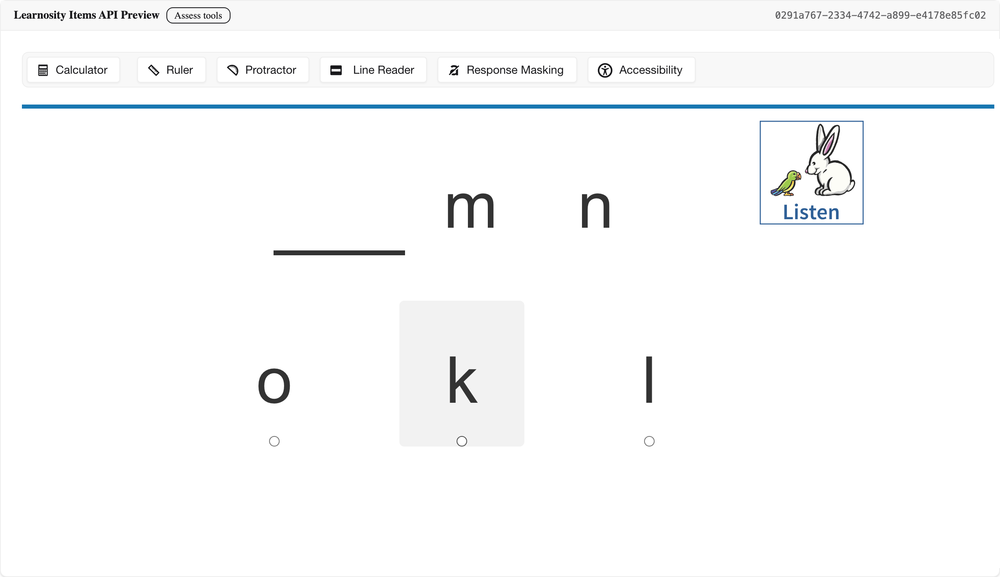

| Learnosity capability | Current PIE status | Parity read |
| --- | --- | --- |
| Assessment-player tool placement | PIE supplies the reusable tools and placement contracts; in the Renaissance context Quiz Engine (not the PIE assessment player) owns the assessment-player chrome and assessment-level controls. | Out of direct scope. The integrated player chrome is a Quiz Engine/host concern, so Learnosity’s all-in-one player is a different integration model rather than a PIE gap. |
| Accessibility panel / visual settings | PIE has a theme/color-scheme tool plus a QTI-aligned settings system: Personal Needs & Preferences (PNP)-driven tool policy and cascading assessment- and item-level QTI 3.0 accessibility catalogs. The student-facing settings widget (contrast, font size, zoom pickers) is a Quiz Engine/host surface; adjustable font size/type is tracked under PIE-500. | Strong underneath, host-owned on top, and PIE’s underneath is the deeper of the two. Learnosity’s [panel](https://help.learnosity.com/hc/en-us/articles/360000758397-Displaying-and-Configuring-the-Accessibility-Panel-in-an-Assessment) carries exactly three options — `colorscheme_option`, `fontsize_option`, `zoom_option` — and its zoom tab only renders instructions for using the browser’s own zoom. PIE ships ten built-in color schemes plus `registerPieColorSchemes()` for custom palettes, superseding the six Learnosity documents. |
| Line reader | PIE has a packaged `lineReader` overlay, reshaped since the June pass into a window view: a fully transparent pane inside an obscuring frame, with frame fill and opacity as host settings rather than student controls. | Strong, and now covering masking. The core student purpose matches, with expected placement and styling differences; the reading overlay and the page-masking behavior are one tool rather than two. |
| Response masking / answer elimination | PIE has a packaged `answerEliminator` built on an extensible adapter registry — it ships adapters for multiple-choice, EBSR, and inline-dropdown, with priority-based auto-detection, pluggable elimination strategies (strikethrough/mask), per-element state, and a `registerAdapter` hook for more interaction types. It is not hard-coded to multiple-choice, and since the June pass the strikethrough strategy also handles image-based and math-based choices. | Comparable in count, disjoint in coverage. Learnosity [documents six supported types](https://authorguide.learnosity.com/hc/en-us/articles/360000435238-How-the-Response-Masking-Setting-in-the-Activity-Editor-Works) — Classification, Multiple Choice, Token Highlight, Number Line Drag & Drop, Cloze Drag & Drop, Image with Drag & Drop — against PIE’s three. Only multiple choice is common to both: PIE covers EBSR and inline-dropdown, which Learnosity does not; Learnosity covers classification, token highlight and three drag-and-drop families, which PIE does not. |
| Ruler and protractor | PIE has packaged `ruler` and `protractor` tools. | Strong for tool availability. Product UX still depends on host placement and item/tool policy. |
| Calculator | PIE ships Desmos as a first-class calculator provider (basic, scientific, and graphing) via `@pie-players/pie-calculator-desmos` (`packages/calculator-desmos/src/desmos-provider.ts:43-47`), with an assessment/restricted mode, state persistence, and a pluggable provider interface. | PIE-favored, and confirmed against current docs. Learnosity’s [built-in calculator](https://help.learnosity.com/hc/en-us/articles/16685252610845-Calculator) offers `basic` and `scientific` modes only, with no native graphing calculator; [Desmos](https://learnosity.com/company/partners/partners-directory/desmos/) reaches Learnosity as a marketplace partner integration added per item. |
| Annotations: highlighting, sticky notes, notepad, drawing | PIE’s annotation toolbar covers content highlight/underline, implemented with the modern CSS Custom Highlight API (no DOM mutation, screen-reader-safe, with separate persistent-annotation and transient-TTS highlight layers). Persistent sticky notes, a cross-item notepad, and a freehand drawing layer are assessment-level surfaces owned by Quiz Engine/host rather than packaged PIE toolkit tools. | Mixed ownership, and a thinner Learnosity advantage than it appears. Learnosity’s four modules — `drawing`, `notepad`, `stickynote`, `texthighlight` — belong to a separate [Annotations API](https://help.learnosity.com/hc/en-us/articles/16458037777693-Annotations-API) that its own documentation calls a lower-level API, "not recommended for most projects, and may not be available on all plans", and all four are disabled by default. Content highlighting is covered by PIE; notes, notepad and drawing are assessment-level (Quiz Engine/host) concerns in the Renaissance context. |
| Check answer / instant feedback | PIE ships formative delivery since the June pass — a per-item Try budget, feedback reveal as an `env` projection, and a section mastery rollup. See [Formative Delivery And Check-Answer](#formative-delivery-and-check-answer). | Comparable capability, one real exposure. Learnosity’s `instant_feedback` and `feedback_attempts` [question attributes](https://help.learnosity.com/hc/en-us/articles/16685209606301-Multiple-choice-mcq) match Try and `maxTries`; PIE adds `revealOn: "on-final-try"` and a mastery denominator that excludes what it cannot score, neither of which Learnosity documents. Against that, Learnosity shipped **encrypted validation** for Check Answer in 2026.1.LTS to stop client-side answer extraction, and PIE derives correctness in the browser from the item model. |
| Timed media: play limits and seek restriction | No code. Design-only in [`../architecture/timed-media-section.md`](../architecture/timed-media-section.md) and [`../prds/timed-media-section-contract.md`](../prds/timed-media-section-contract.md), revalidated 2026-08-15 with one open renderer-dispatch decision. | Gap, but a smaller one than assumed. Learnosity’s limit is **audio-only**: the `audioplayer` feature carries `playback_limit` ("0 being unlimited"), while the [`videoplayer` feature](https://help.learnosity.com/hc/en-us/articles/16685252751005-Video-player) documents no play-count and no seek restriction at all. Neither product restricts seeking. |
| Math response validation | `math-inline` and `math-templated` support two equivalence modes, `symbolic` and `literal` (`pie-elements-ng/packages/elements-react/math-inline/src/author/response.tsx:294-295`), with `allowTrailingZeros` and `ignoreOrder` as literal sub-options. | Learnosity-favored. Its [six current scoring methods](https://authorguide.learnosity.com/hc/en-us/articles/360000619118-What-are-the-Different-Scoring-Methods-Available) are `equivLiteral`, `equivSymbolic`, `equivValue`, `stringMatch`, `equivSyntax` and `isTrue`, with significant-decimal-place and separator controls and a documented unit list; `isSimplified`, `isFactorised` and `isExpanded` are now filed as legacy. PIE covers two of the six. |
| Chemistry | No chemistry element and no chemistry-aware validation in `pie-elements-ng`; `tool-periodic-table` supplies chemistry *reference* only. | Learnosity-favored on breadth, but not on semantics. It ships four chemistry question types, and they reuse the same six general math rules over LaTeX, defaulting to `equivLiteral` — literal string comparison, not chemical equivalence. So the gap is an authoring surface and a keypad, not a validation engine PIE would have to match. |
| Question-type breadth | 30 element packages in `pie-elements-ng`. | Learnosity-favored, and this is the durable gap. Its [documented roster](https://help.learnosity.com/hc/en-us/articles/16684586288925-question-types) is 41 current types (plus 10 deprecated), including four PIE has no equivalent for at all: `audio` (learner voice recording), `video` (video recording), `fileupload`, and `imageupload`. |
| Player UI translation | `packages/players-shared/src/i18n` covers en/es/zh/ar with RTL and `Intl.PluralRules`; element-level coverage is partial — see [Element-Level Translation](#element-level-translation-and-the-translation-rows). | Learnosity-favored on locale count, weaker than it looks on quality. Its [label bundles](https://help.learnosity.com/hc/en-us/articles/360002918818-Translating-the-Learnosity-user-interface-with-label-bundles) cover 17 locale variants, but the documentation states many are machine-translated and should be verified by native speakers before production, and that bundles lag new features. Item *content* is not translated by Learnosity in either product’s model: parallel authored copies. |
| QTI interchange | PIE is QTI-aligned natively — accessibility catalogs, PNP support ids, and the formative vocabulary mapped onto `qti-item-session-control`. | Newly contested. Learnosity shipped a bidirectional **QTI 2.1/2.2 conversion library** in [2026.2.LTS](https://help.learnosity.com/hc/en-us/articles/36609838701597-2026-2-LTS-Release-Announcement) (10 June 2026), which the June pass predates. Conversion to QTI 2.x is a narrower claim than native QTI 3.0 alignment, but it removes interchange as a straightforward PIE advantage. |

The practical takeaway is that Learnosity validates the same split already visible in the SchoolCity analysis: overlay/reference tools are mostly covered by PIE, while response-type breadth is still broader in Learnosity — 41 documented question types against 30 element packages, and the four Learnosity types PIE cannot match at all (`audio`, `video`, `fileupload`, `imageupload`) are precisely the media-capture and upload responses. That is the durable gap, and it is a response-type gap rather than a tool gap.

Rechecking the tool rows against current documentation moved three of them in PIE's favor. Learnosity's accessibility panel is three options deep and its zoom tab only explains the browser's own zoom, against PIE's ten built-in color schemes plus custom registration. Its annotation modules sit behind a lower-level API its own documentation discourages and gates by plan. Its built-in calculator is still basic and scientific only. One row moved against PIE: response masking covers six question types to PIE's three, and the two sets overlap only on multiple choice.

Several of Learnosity’s other apparent advantages fall outside a fair PIE-to-Learnosity comparison in the Renaissance context. First, integrated assessment-player controls, persistent annotation surfaces (sticky notes, a cross-item notepad, freehand drawing), and other assessment-level chrome are owned by Quiz Engine, not the PIE assessment player, so they are not PIE toolkit gaps. Second, the student-facing accessibility settings widget is likewise a Quiz Engine/host surface; underneath it, PIE already ships a QTI-aligned settings system — Personal Needs & Preferences (PNP)-driven tool policy plus cascading assessment- and item-level QTI 3.0 accessibility catalogs — that is strong and standards-complete. PIE should continue to avoid cloning Learnosity’s whole platform surface; the high-value comparison is whether PIE exposes reusable tools and clean contracts that the Renaissance assessment host can place, configure, persist, and report on.

Everything in this section rests on public Learnosity documentation and the local Pieoneer preview, not on Learnosity source. Note also that `reference.learnosity.com` and `docs.learnosity.com` now redirect into `help.learnosity.com`, so the URLs here differ in form from the June pass while pointing at the same material. Current LTS is 2026.2 (10 June 2026); nothing newer had shipped as an LTS at the time of this refresh.

### Learnosity Visual Examples

These examples are captured from the local Pieoneer Learnosity Items API preview (assess mode) at `/etl/playground/lsypie/lookup/lsypreview`, all rendering the same Learnosity demo item. Each shows a tool active over a real Learnosity-rendered item rather than a marketing page. The Notepad and Drawing annotation buttons did not render in this preview, so the annotation surface is described in the table above rather than shown here.

Line Reader: a draggable reading overlay that masks the page except for one band of content.

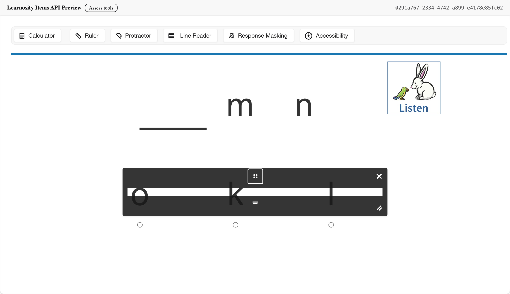

Response Masking: toggling the tool dims the answer options so the student can visually eliminate choices without changing the underlying response.

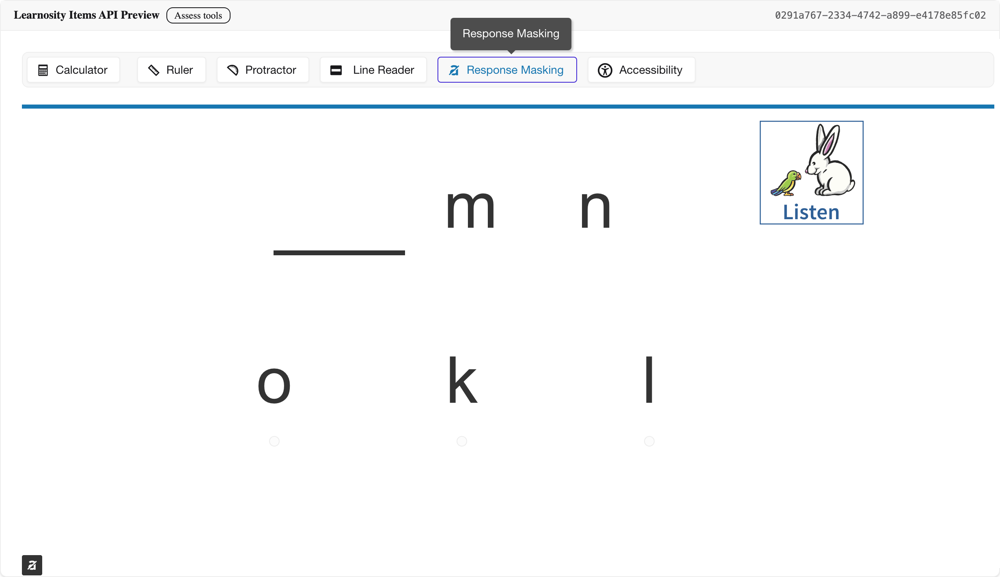

Ruler and protractor: draggable measurement overlays from the assess toolbar, shown here together over the item.

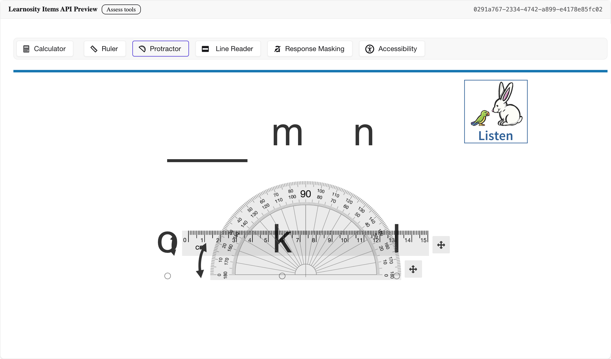

Accessibility panel: a single student-facing dialog combining color scheme, font size, and zoom controls. In PIE’s model this widget layer belongs to Quiz Engine/host chrome, while PIE owns the QTI-aligned settings underneath it (PNP-driven tool policy and cascading QTI 3.0 accessibility catalogs).

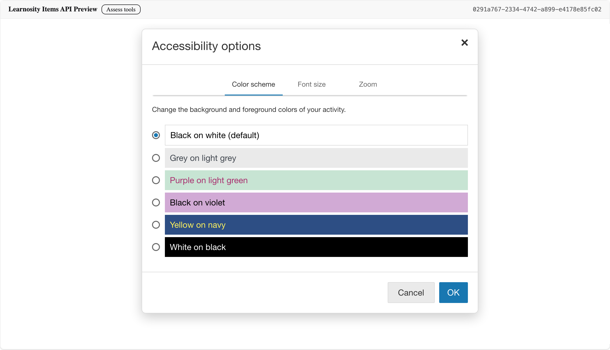

## Assessment-Level Tools

The master document divides most student tools into assessment-level tools first. The table below follows that list and maps each row to the current PIE status and likely ownership.

The SchoolCity column has since been checked against the implementing source — `sc-online-testing` (Nuxt 3, the current student client), `sc-suite-student` (ASP.NET MVC, legacy but live) and `sc-suite-staff` (admin configuration plus a third delivery implementation for staff preview). Three findings from that pass bear on how the whole table should be read.

**The canonical tool list is a database table, not a file.** `OnlineTool` (`sc-suite-staff/java/com/schoolcity/stars/entity/online/OnlineTool.java:13-54`) carries `OnlineToolID`, `Name`, `Handle`, `GroupName` and `SortOrder`; there are no `.sql` seeds in the repository. The clients special-case a subset of `ToolName` strings and render everything else as a generic checkbox keyed on `Handle`. So the master document is plausibly a dump of that table, and a row in it is not evidence that any client implements the tool — which is exactly the discrepancy the Browser Zoom row below turns out to be.

**The student tool surface is implemented three times and has diverged.** Closed Captioning is a real `ToolName` in both legacy clients and absent from the Nuxt client entirely — a SchoolCity delivery gap, not a documentation gap.

**Tool names are tenant-branded.** `(sSCBName == 'hisd' ? 'Sticky Notes' : 'Notes')` recurs across the staff preview code, so matching tools by display name is unsafe.

| SchoolCity tool | SchoolCity source | Current PIE status | Likely owner | Parity |
| --- | --- | --- | --- | --- |
| Calculator | Master DOCX; [Calculators](https://support.renaissance.com/s/article/Online-Tools-Calculators-1752860893682?language=en_US) | Present in PIE as calculator packages, but intentionally outside this report’s parity scope. Source review adds one substantive gap: SchoolCity self-hosts Desmos **and** TI-84, TI-108 and TI-34MV emulators (`sc-online-testing/components/exam/tools/CalculatorTool.vue:218-236`), with STAAR and Florida test modes restricting Desmos behaviour. PIE ships Desmos only. | Toolkit / host provider | Out of parity scope; TI emulators are an unscoped gap |
| Full Assessment Translation | Master DOCX; [Language Translation](https://support.renaissance.com/s/article/Online-Tools-Language-Translation-1752860896306?language=en_US) | No packaged PIE full-assessment translation tool. The mechanism to match is narrower than the row implies: SchoolCity injects the **public Google Translate website widget** and drives its `.goog-te-combo` select programmatically (`sc-online-testing/composables/exam/useGoogleTranslate.ts:675,689`), scoping it by toggling a `notranslate` class over passage/question/control regions. Machine translation of the rendered DOM, not authored bilingual content. | Host / localization service | Missing |
| Color Contrast | Master DOCX; [Visual Aides](https://support.renaissance.com/s/article/Online-Tools-Visual-Aides-1752860897682?language=en_US) | PIE ships ten built-in color schemes plus `registerPieColorSchemes()` for custom palettes, unified with theme resolution since the June pass and covering 84 documented `--pie-*` tokens. SchoolCity ships **15** schemes (`sc-online-testing/components/exam/settings/ContrastSettings.vue:48-63`). "Short on count" is the wrong read, and correcting it changes the verdict. Four of the 15 are built in already, and the other eleven are host palettes a programme registers itself: `registerPieColorSchemes()` accepts a *partial* overlay and validates only the contrast relationships whose tokens that overlay touches, so a scheme is not a 48-token palette in a host's hands. Cost measured against the enforced relationships, per background: 2 tokens on white, 4 for Green on White (SchoolCity's tightest ink, 4.73:1, which clears text but not the tinted recessed surfaces), 10 on pure black (borrowable wholesale from the dark base theme), and about 18 on a mid-tone (blue, red, green, dark gray), where neither the light nor the dark inks hold and the icons, control boundaries and focus rings are all re-chosen. All 15 clear 4.5:1 for ordinary text, so the text pair never blocks a scheme; the other 24 relationships do. One trap for a host: contrast diagnostics come back as warnings rather than errors, because a registered palette is host-owned, so a two-token White on Blue registers successfully with fourteen warnings and a host filtering on `severity === "error"` ships cyan links on a mid-blue page. | Toolkit + host theme integration | Strong; remaining schemes are host-registrable |
| English Dictionary | Master DOCX; [Visual Aides](https://support.renaissance.com/s/article/Online-Tools-Visual-Aides-1752860897682?language=en_US) | PIE has a packaged `dictionary` tool: a floating panel with its own term field, opened from the toolbar or from an action on the learner's selection, granted through the PNP rather than universally. It ships no endpoint, because the corpus behind a dictionary is licensed per programme and a default would bake one deployment into the package; a host names one and the panel calls it on the assessment's own session. SchoolCity's is **self-hosted** at `dictionary.schoolcity.com/en` (`sc-online-testing/composables/useAnnotation.js:1222`); no third-party dictionary vendor is named in any of the three repositories, so the licensed content behind that host is not identifiable from source. Sourcing that content is the remaining decision. | Toolkit surface; corpus is a host service decision | Strong (surface); corpus unresolved |
| Graph | Master DOCX; [Visual Aides](https://support.renaissance.com/s/article/Online-Tools-Visual-Aides-1752860897682?language=en_US) | PIE has a packaged `graph` tool. SchoolCity's is a custom SVG grid/plotter rather than a Desmos surface (`sc-online-testing/components/exam/tools/GraphTool.vue`), named "Graph Paper" in the legacy client — so the capability to match is graph paper, not a graphing calculator. | Toolkit | Partial |
| Highlighter | Master DOCX; [Visual Aides](https://support.renaissance.com/s/article/Online-Tools-Visual-Aides-1752860897682?language=en_US) | PIE has `annotationToolbar` / `highlighter` using the same custom element, implemented with the modern CSS Custom Highlight API (no DOM mutation, screen-reader-safe) instead of legacy span wrapping. SchoolCity uses a **rangy** `classApplier` with four colors (`sc-online-testing/composables/utils/annotationRangyUtils.js:20`), which is the span-wrapping approach PIE deliberately does not use — so PIE's implementation is the better one on the axis that matters for screen readers. It covers highlight, underline and — since the dictionary tools landed — dictionary and picture-dictionary lookup on the selection, through host-supplied actions the strip renders and does not name. Selected-text translation and anchored comments are still absent from it. | Toolkit | Partial |
| Line Reader | Master DOCX; [Visual Aides](https://support.renaissance.com/s/article/Online-Tools-Visual-Aides-1752860897682?language=en_US) | PIE has a packaged `lineReader`, reshaped since the June pass (PIE-811) from highlight/obscure modes into a window view: a transparent pane inside an obscuring frame, with frame fill and masking opacity as host settings. This also covers the masking behavior tracked separately under PIE-487. | Toolkit | Strong |
| Notes | Master DOCX; [Visual Aides](https://support.renaissance.com/s/article/Online-Tools-Visual-Aides-1752860897682?language=en_US) | No packaged PIE notes tool. SchoolCity persists these as an `ItemNote` record and brands the tool "Sticky Notes" for one tenant; Comment is a sub-feature of the same tool rather than an independent one. | Host / session persistence | Missing |
| Periodic Table | Master DOCX; [Visual Aides](https://support.renaissance.com/s/article/Online-Tools-Visual-Aides-1752860897682?language=en_US) | PIE has a packaged `periodicTable` tool. | Toolkit | Strong |
| Picture Dictionary | Master DOCX; [Visual Aides](https://support.renaissance.com/s/article/Online-Tools-Visual-Aides-1752860897682?language=en_US) | PIE has a packaged `pictureDictionary` tool, and the service behind SchoolCity's is already PIE's, so both halves now exist. The Nuxt client reads `appSettings.PIEAPIDictionary` for a base URL and service token (`sc-online-testing/composables/useAnnotation.js:1233-1248`) and the legacy client calls `https://api.pie-api.com/api/picture-dictionary` directly. The packaged panel takes an endpoint from the host and shapes a POST of its own rather than speaking that route's contract; pointing it at the existing PIE service means either matching the panel's payload server-side or handing it a host resolver, which it accepts. | Toolkit surface over existing PIE API | Strong (surface); wiring to the existing service is host work |
| Protractor | Master DOCX; [Visual Aides](https://support.renaissance.com/s/article/Online-Tools-Visual-Aides-1752860897682?language=en_US) | PIE has a packaged `protractor` tool. | Toolkit | Strong |
| Ruler | Master DOCX; [Visual Aides](https://support.renaissance.com/s/article/Online-Tools-Visual-Aides-1752860897682?language=en_US) | PIE has a packaged `ruler` tool. | Toolkit | Strong |
| Spanish Dictionary | Master DOCX; [Language Translation](https://support.renaissance.com/s/article/Online-Tools-Language-Translation-1752860896306?language=en_US) | No packaged PIE Spanish dictionary tool. | Toolkit or host service decision | Missing |
| Text Magnifier | Master DOCX; [Visual Aides](https://support.renaissance.com/s/article/Online-Tools-Visual-Aides-1752860897682?language=en_US) | No packaged PIE magnifier tool. PNP feature naming exists (`magnification`, `screenMagnifier`), but no tool claims those support ids. SchoolCity's is a CSS-transform lens over a cloned DOM subtree (`sc-online-testing/components/exam/tools/TextMagnifier.vue`), reached under `ToolName === 'Zoom'` in the legacy client. | Toolkit / accessibility service | Missing |
| Text to Speech | Master DOCX; [Text to Speech](https://support.renaissance.com/s/article/Online-Tools-Text-to-Speech-1752860897670?language=en_US) | PIE ships a first-class, multi-backend TTS subsystem: browser fallback plus AWS Polly, Google, and SchoolCity providers, with word- and block-level highlighting (fidelity varies by provider — see [Text to Speech](#text-to-speech-read-aloud)), authored SSML via QTI catalogs, on-the-fly math speech, and recorded audio as a `spoken` alternate since the June pass. SchoolCity's own read-aloud is AWS Polly through `tts.svcdev.schoolcity.com` with speech-mark JSONL driving word highlighting — the same engine and the same highlighting technique PIE's Polly provider uses, in a ~6.8k-line client-side store rather than a reusable subsystem. | Toolkit / provider | Strong |
| Underline | Master DOCX; [Visual Aides](https://support.renaissance.com/s/article/Online-Tools-Visual-Aides-1752860897682?language=en_US) | Covered through PIE annotation toolbar. | Toolkit | Partial |
| Translate Selection | Master DOCX; [Visual Aides](https://support.renaissance.com/s/article/Online-Tools-Visual-Aides-1752860897682?language=en_US) | No packaged PIE selected-text translation tool. | Toolkit or host service decision | Missing |
| Flag | Master DOCX; [Visual Aides](https://support.renaissance.com/s/article/Online-Tools-Visual-Aides-1752860897682?language=en_US) | Not a packaged PIE toolkit tool. This belongs in assessment navigation/chrome. | Host | Host-owned |
| Browser Zoom Support | Master DOCX | Browser-native capability, not a PIE toolkit tool. **The SchoolCity row does not survive source review**: the string "Browser Zoom" appears in none of the three repositories and `git log -S` finds it in no history. The nearest real row is legacy `ToolName === 'Zoom'` (`OnlineToolID` 20, handle `magnify`), which drives the **magnifier**, and the Nuxt client has no `'Zoom'` tool name at all. Most likely the master-document row is `Zoom` with "Browser" added editorially, making this a duplicate of Text Magnifier rather than a distinct capability. Learnosity treats zoom the same way — its accessibility panel's zoom tab only renders instructions for using the browser's own zoom. | Browser / host guidance | Out of parity scope; row likely a documentation artifact |
| Comment | Master DOCX; [Visual Aides](https://support.renaissance.com/s/article/Online-Tools-Visual-Aides-1752860897682?language=en_US) | No packaged anchored comment tool. | Host / annotation persistence | Missing |
| Custom Speech | Master DOCX; [Online Markup](https://support.renaissance.com/s/article/Online-Markup-for-Item-Bank-Assessments-1752860897413?language=en_US) | Covered by authored SSML in QTI 3.0 accessibility catalogs (`data-catalog-idref` + `<speak>`), which the TTS service plays in a mixed DOM/SSML model; `SSMLExtractor` lifts inline markup into catalogs. Source review confirms the mechanisms match: SchoolCity authors SSML in a staff editor (`sc-suite-staff/WebContent/WEB-INF/Jsp/common/AddSSML.jsp:94`) and its TTS store reads the SSML alias at delivery, with no pronunciation store on the service side. | Toolkit + authored SSML catalogs | Strong for a Polly-backed configuration; see the per-provider caveat |
| Pop-up | Master DOCX; [Visual Aides](https://support.renaissance.com/s/article/Online-Tools-Visual-Aides-1752860897682?language=en_US) | No packaged toolbar tool. Likely authored content behavior. | Item / content markup | Item-owned |
| Rollover | Master DOCX; [Visual Aides](https://support.renaissance.com/s/article/Online-Tools-Visual-Aides-1752860897682?language=en_US) | No packaged toolbar tool. Likely authored content behavior. | Item / content markup | Item-owned |
| Resources | Master DOCX; [Online Markup](https://support.renaissance.com/s/article/Online-Markup-for-Item-Bank-Assessments-1752860897413?language=en_US) | No packaged resources panel/tool in PIE Players. Embedded media exists in content, but that is not the same capability. | Host / content | Missing |
| Writing Checklists | Master DOCX; [Writing Checklist](https://support.renaissance.com/s/article/Online-Tool-Writing-Checklist-1752860897688?language=en_US) | No packaged writing checklist tool. | Host / item content | Missing |
| Equation Editor | Master DOCX; [Equation Editor](https://support.renaissance.com/s/article/Online-Tools-Equation-Editor-1752860895748?language=en_US) | Not a packaged assessment toolkit tool. The master document explicitly raises ownership as a PIE item/response-editor decision. Source review sharpens the target: SchoolCity ships this as a `GroupName` with four tiers — `Elementary Editor`, `Algebra Editor`, `Algebra with Trigonometry`, `Advanced Equation Editor` — over MathLive and MathJax (`sc-online-testing/composables/exam/CRWP/useTextEditor.ts:92`). A bare `Equation Editor` tool name is dead. So the decision is about a graduated set, not one editor. | Item / response editor | Item-owned |
| Spell Check | Master DOCX; [Visual Aides](https://support.renaissance.com/s/article/Online-Tools-Visual-Aides-1752860897682?language=en_US) | No packaged PIE spell check tool. SchoolCity's is a custom CKEditor 5 plugin against `spellcheck.schoolcity.com` (`sc-online-testing/config/ckeditor.ts:271-278`) — a hosted service, not a browser capability, so parity here implies standing up a service. | Response editor | Missing |
| Answer Eliminator | Master DOCX; [Visual Aides](https://support.renaissance.com/s/article/Online-Tools-Visual-Aides-1752860897682?language=en_US) | PIE has a packaged `answerEliminator` for choice elimination, extended since the June pass (PIE-840, PIE-841) to strike image-based and math-based choices. SchoolCity's covers MC, MR and EBSR-with-`choiceInteraction` only (`sc-online-testing/composables/exam/useAnswerEliminator.ts`), so PIE's adapter set is comparable and its strategy now handles content types SchoolCity's does not. SchoolCity’s visual affordance and state model still differ. | Toolkit | Partial |
| Disregard Item Level Settings | Master DOCX | Product/configuration behavior, not a student runtime tool — confirmed in source, and more precisely than the row states. It is `OnlineToolID` 230 but an assessment administration toggle (`AssessmentOnlineSetup.OverrideItemLevelSetting`, `sc-suite-staff/WebContent/WEB-INF/Jsp/assessment/OnlineSettings.jsp:670-708`), absent from both student clients: the student receives only the resolved `OnlineToolList`. Its own help text states that assessment-level tools override item-level tools while student accommodation profiles are unaffected — a precedence rule, which is what PIE's `PnpPolicySource` levels already express. | Host / authoring configuration | Host-owned |
| Online Markup text to speech | Master DOCX | Covered by PIE’s authored-SSML catalog path and generated speech; read-aloud markup is delivered through QTI accessibility catalogs rather than an item-only markup tool. | Toolkit + authored SSML catalogs | Strong |
| Media Upload | Master DOCX | No packaged toolkit tool; belongs to response editors for CR/WP or similar item types. No upload response exists anywhere in PIE: no `<input type="file">` in a delivery path in either repository. SchoolCity ships this as a `GroupName` with `Image`, `Audio` and `Video` members, implemented as CKEditor plugins posting to `scfileupload.schoolcity.com/upload` (`sc-online-testing/composables/useMediaUpload.ts`) — upload of existing files, not capture. | Response editor | Item-owned |
| Writing Checklists (second gate) | Master DOCX; [Writing Checklist](https://support.renaissance.com/s/article/Online-Tool-Writing-Checklist-1752860897688?language=en_US) | Beyond the missing tool, note the gating shape PIE would have to match: SchoolCity gates this on the tool row **and** an instance-app entitlement (`sc-online-testing/composables/useAppEnabled.ts:42`), and restricts it to CR/WP items. Two-factor entitlement of that kind is expressible in PIE's policy engine but is not what a single PNP support id models. | Host / item content | Missing |
| Speech to Text | Master DOCX; [Speech to Text](https://support.renaissance.com/s/article/Online-Tools-Speech-to-Text-1752860897146?language=en_US) | No packaged PIE speech-to-text tool. Platform (non-embedded) dictation into a PIE response surface is now a tested guarantee — see [`./non-embedded-dictation.md`](./non-embedded-dictation.md). An embedded recognizer is scoped in [`../prds/speech-to-text.md`](../prds/speech-to-text.md). | Response editor / host service | Missing (embedded); supported (non-embedded) |
| Text to Speech Pronunciation | Master DOCX | Authored SSML (pronunciation, prosody, emphasis) via QTI catalogs, plus Speech-Rule-Engine math pronunciation generated on the fly. | Toolkit + authored SSML catalogs | Strong |
| Robust Text Editor | Master DOCX | Not a packaged toolkit tool. The master document frames this as a text-editor ownership and licensing decision, and source review names the artifact: it is not a tool row at all but **CKEditor 5 with premium features** (`sc-online-testing/config/ckeditor.ts:334-385`), CKEditor 4 in the legacy client. The licensing decision the master document raises is therefore a concrete one about CKEditor's commercial tier against the open-source PIE model. | Response editor / item | Item-owned |
| Speech to Text (engine) | Master DOCX; [Speech to Text](https://support.renaissance.com/s/article/Online-Tools-Speech-to-Text-1752860897146?language=en_US) | The engine differs between SchoolCity's own clients: the Nuxt client uses the browser's `webkitSpeechRecognition` plus a punctuation service, while the legacy client uses **AWS Transcribe Streaming**. The browser-recognition path is the same non-embedded capability PIE already gets for free and does not test, which narrows the gap for one of the two implementations. | Response editor / host service | Missing |

## SchoolCity Capabilities Outside The Tool Rows

The master document is tool-by-tool, so it captured toolbar buttons and missed student-facing behavior that is not one. Everything here is verified in `sc-*` source and has no row above. Ordered by how much it should affect PIE planning.

**Time is a delivered, live-controlled capability, not a setting.** A proctor changes a running test: `sc-online-testing/stores/exam/socketStore.ts:139-180` handles `TIMER_PAUSE`, `TIMER_START`, `TIMER_CHANGE_DURATION`, `TIME_OUT`, `SESSION_TIME_OFF`, `STOP` and `TIMER_DISABLE` over socket.io, with the student joined to a per-user room. Extended time arrives mid-test. Section timers are separate, on `AssessmentSession.DurationMinutes`. Nothing in the PIE assessment toolkit models time at all — no section timer, no extended time, no break timer — which makes PIE-467 and PIE-482 larger than a tool row: the gap is a session-time model plus a live control channel, and the break-timer concept does not exist on the SchoolCity side either (the model is pause/resume plus a proctor top-up increment).

**Accommodation profiles are a full subsystem, and the domain does not call them IEP or 504.** The terms are **Accommodation Template** and **Student Profiler** (`sc-suite-staff/WebContent/WEB-INF/Javascript/common/AccommodationSettings.js`, ~1400 lines; `java/com/schoolcity/stars/dao/admin/AccommodationTemplateDAOImpl.java`). Per student: `OnlineDurationMinutes` (extended time), `OnlineTimeIncrement` (proctor top-up), time and day windows, plus overrides of hint visibility, item and choice randomization, timer visibility, and the tool list itself. Per tool: `PreventOverride` / `PadLock` flags. Resolution runs district/campus → assessment → item → student with locks available at each level, and there is a printable accommodations report and a TestHound integration flag. PIE's `PnpPolicySource` already expresses six precedence levels, so the shape is compatible; what PIE lacks is the authoring and lock semantics. This is the substance behind PIE-485 and PIE-486, and searching for "IEP" or "504" in the SchoolCity source finds nothing.

**Two secure-browser products, mutually exclusive per tenant.** Respondus LockDown Browser via an `ldb1:` custom URL protocol (`sc-online-testing/composables/exam/useLDBTest.ts`) and Microsoft Take a Test (`sc-suite-staff/WebContent/WEB-INF/Javascript/common/SCCF.js:3846-3883`, gated on `IsTakeATestSecureBrowserLicensed`). Neither appears in the master document. Adjacent to but distinct from PIE-483.

**Forced fullscreen.** `sc-online-testing/middleware/fullscreen.global.ts:21-24` auto-enters fullscreen on every exam route unless LockDown Browser is active. Best-effort — no re-entry detection or violation logging. This is PIE-492, which the report lists as uncovered, and it is a host-chrome concern rather than a toolkit one.

**A paper/online hybrid delivery mode.** The Online Bubble Sheet ("AKO", `sc-online-testing/pages/exam/ako.vue`) renders the assessment PDF in a pdf.js viewer while the student enters answers online. Staff-side print and bulk print choose a bubble-sheet vendor by delivery method — SchoolCity's own sheets or **GradeCam** — and there is a scanning module. PIE's print player is a different thing: it renders items to paper, with no answer-capture pairing. Relevant to the print-coverage limit noted under [Item-Level Tools](#item-level-tools).

**State-specific test modes.** `ShowSTAARTestMode` and `ShowFLORIDATestMode` restrict Desmos calculator behavior per program. PIE's calculator has an assessment/restricted mode but no program-keyed policy.

**Closed Captioning** is a real tool row in both legacy clients, checked against `<track>` elements, and absent from the Nuxt client — a SchoolCity internal parity gap. PIE has no captions capability either, though `captions` and `closedCaptions` exist in its PNP vocabulary.

Smaller student-facing surfaces with no PIE equivalent, all in `sc-online-testing`: an accented-character picker for Spanish and French input (`directives/characterPicker.ts`), an on-screen numeric keypad, a student-facing rubric viewer, teacher feedback notes surfaced to the student, a split-screen passage/question resizer, a progress thermometer, a review summary filtered by flagged items, offline and reconnect detection, a keepalive response save on unload, and LTI 1.0 launch with score post-back.

**What SchoolCity does not have**, grepped across all three repositories, because these bound PIE's gaps: no ASL or sign-language video anywhere; no audio recording (`MediaRecorder` absent, and a CKEditor `audioRecorder` toolbar button exists with no capture path behind it); no audio or video play-count limit or seek restriction; no masking tool; no scratchpad. PIE's shipped sign-language accommodation therefore exceeds SchoolCity rather than trailing it, and timed media is a gap against Learnosity's audio player only, not against SchoolCity.

### SchoolCity As A PIE Consumer

Both student clients already consume PIE, and the legacy one is coupled to player internals in a way that constrains pie-players. `sc-suite-student/StudentPortal.Web/Scripts/Exam/Exam.js:4903` and `:4919` read a response as `Array.from(playerapi?.children).find(c => c.tagName === 'PIE-PLAYER')?.session?.data[0]?.answer`. Any change to child-element structure, `session.data` shape, or the `answer` key breaks answer capture there, and the failure is swallowed into a `console.log` with `error.toString()` written into the stored response. The surface it depends on: `item-id`, `token` and `preview` attributes; `env` and `sessionId` properties; `score()` returning `{points, extraProps.correctResponse}`; and the `session-created`, `session-changed` and `load-complete` events. The Nuxt client goes through `@pie-api/pie-api-components` instead.

One consequence for the item-level table below: the legacy client hardcodes `partialscoring: false` into the PIE player env (`Exam.js:4866`, `:4877`). PIE's `multiple-choice` defaults partial scoring on, and this consumer turns it off unconditionally.

## Visual Examples

Local SchoolCity screenshots extracted from the master DOCX are not embedded here because the source images include visible user identifiers and assessment content. The SchoolCity side is therefore cited through the master document and the public support URLs below; the embedded images in this section are current PIE screenshots captured from `section-demos`.

### Translation And Dictionaries

SchoolCity exposes full-assessment translation and selected-text dictionary / picture dictionary / translation experiences. PIE has packaged both dictionaries, each reachable from the toolbar and from an action on the learner's selection, and neither shipping a corpus. Translation — full-assessment and selected-text alike — has no packaged equivalent.

SchoolCity source: [Language Translation](https://support.renaissance.com/s/article/Online-Tools-Language-Translation-1752860896306?language=en_US)

SchoolCity source: [Visual Aides](https://support.renaissance.com/s/article/Online-Tools-Visual-Aides-1752860897682?language=en_US)

### Color Contrast / Theme

SchoolCity presents color contrast as an online tool/settings affordance. PIE supports a packaged theme tool and host-level theme integration. In the demos, the host DaisyUI theme selector affects demo chrome, while the PIE theme tool applies toolkit/player color schemes.

SchoolCity source: [Visual Aides](https://support.renaissance.com/s/article/Online-Tools-Visual-Aides-1752860897682?language=en_US)

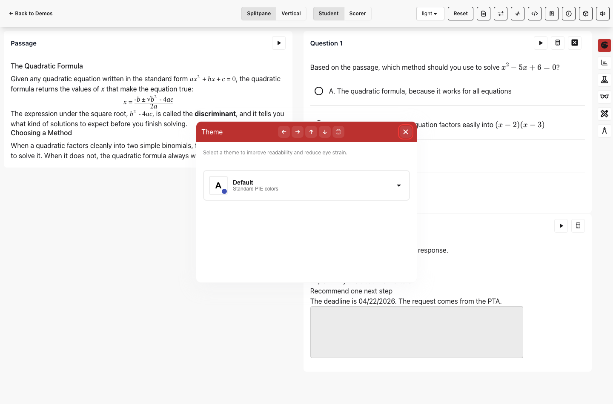

PIE’s theming is consistent across the whole player surface, not just a background color. Selecting a theme updates the color tokens (`--pie-*` variables) everywhere at once — passage and item text, choice rows, dividers, and even control and button styling all follow the active scheme. The previews below show the same section player in the built-in dark and light themes and in a custom “valentine” theme; the buttons, checkboxes, and toolbar restyle with each theme rather than only the page background changing.

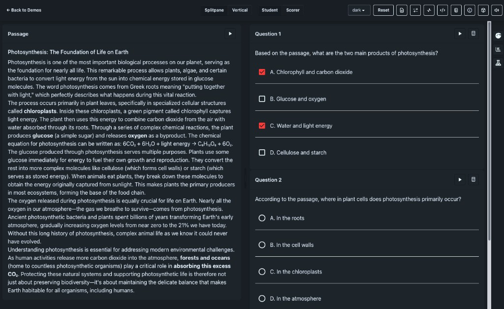

Built-in dark theme.

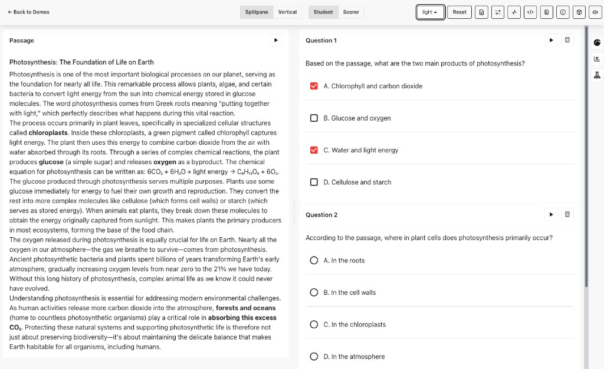

Built-in light theme.

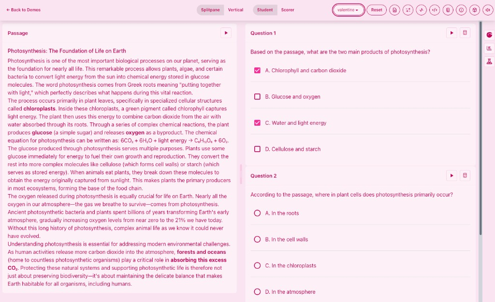

Custom “valentine” theme. Notice the buttons, checkboxes, and toolbar restyle with the scheme, not just the page background.

### Annotation, Highlighter, And Underline

SchoolCity’s selected-text surface groups highlighter, underline, dictionary, picture dictionary, translate selection, and comments more closely. PIE’s annotation toolbar covers highlight, underline, and both dictionaries. Selected-text translation and anchored comments remain gaps.

The dictionaries reach the strip without either side naming the other: the strip renders host-supplied selection actions and knows nothing about dictionaries, the panels know nothing about selections, and the pairing lives in the composition layer that is allowed to know both. That is also why a selection is never a capability's only route — a sighted keyboard-only learner cannot originate one in non-editable content, so each panel carries its own term field.

Highlighting itself is a core capability of the assessment toolkit, and PIE implements it with the modern CSS Custom Highlight API (`CSS.highlights` + `::highlight()`) rather than the legacy approach of wrapping selected text in `` elements. Because it paints ranges without mutating the DOM, it avoids the layout shifts, broken text selection, and re-render cost that span-wrapping causes; it keeps the underlying text intact for screen readers; and it supports separate, independently styled layers — persistent multi-color student annotations and transient TTS read-along highlighting — over the same content. A single `HighlightCoordinator` powers annotation, answer-eliminator, and TTS word/sentence highlighting, with theme-adaptive (WCAG-contrast) colors and range serialization for annotation persistence, and it feature-detects support so it degrades gracefully where the API is unavailable.

SchoolCity source: [Visual Aides](https://support.renaissance.com/s/article/Online-Tools-Visual-Aides-1752860897682?language=en_US)

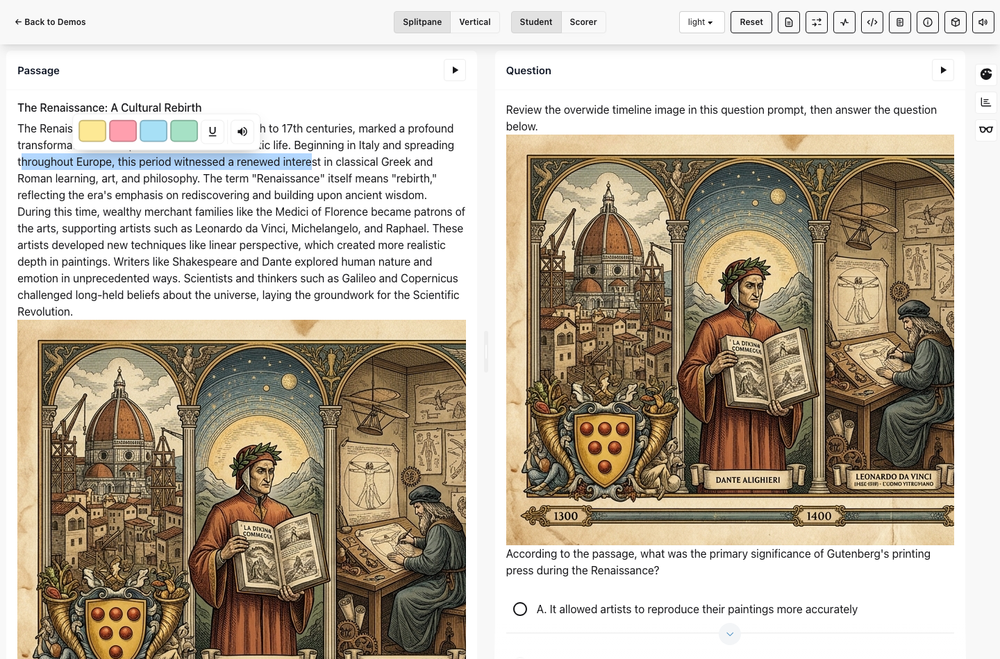

### Line Reader

Line reader is one of the stronger matches. Both products provide a reading overlay. The exact control placement and styling differ, but the core student purpose is covered by PIE’s packaged line reader.

SchoolCity source: [Visual Aides](https://support.renaissance.com/s/article/Online-Tools-Visual-Aides-1752860897682?language=en_US)

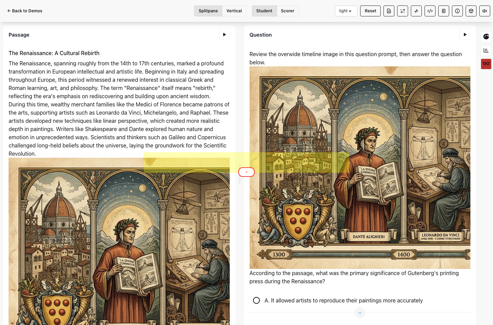

### Measurement And Reference Tools

PIE has strong packaged coverage for ruler, protractor, and periodic table. Graph is present as a packaged tool, but the expected product-level graphing behavior should be confirmed against the assessment host and provider expectations.

SchoolCity source: [Visual Aides](https://support.renaissance.com/s/article/Online-Tools-Visual-Aides-1752860897682?language=en_US)

SchoolCity source: [Visual Aides](https://support.renaissance.com/s/article/Online-Tools-Visual-Aides-1752860897682?language=en_US)

SchoolCity source: [Visual Aides](https://support.renaissance.com/s/article/Online-Tools-Visual-Aides-1752860897682?language=en_US)

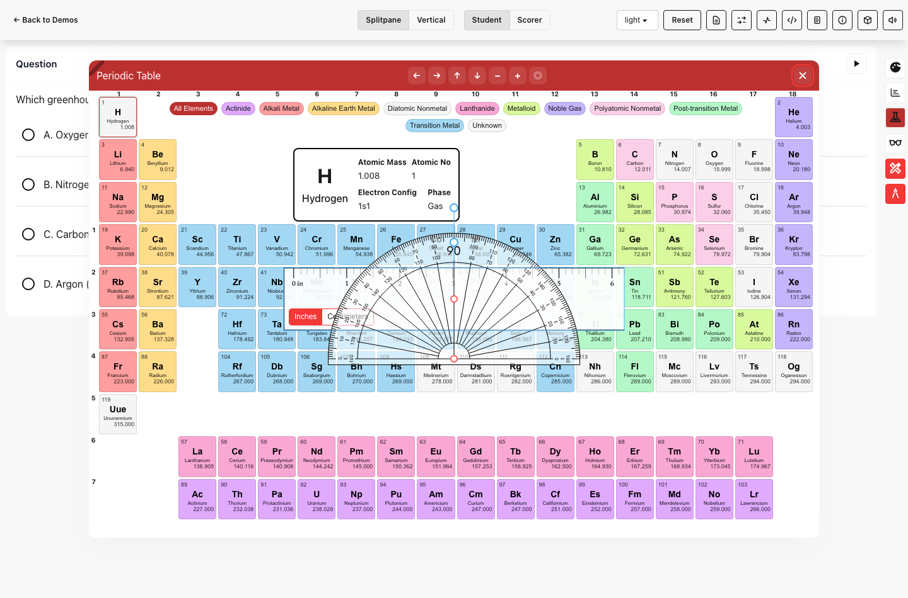

### Answer Eliminator

PIE has an answer eliminator tool for multiple-choice choices. SchoolCity’s student affordance and state treatment should still be compared carefully in product UX review, but this is not a missing toolkit capability.

SchoolCity source: [Visual Aides](https://support.renaissance.com/s/article/Online-Tools-Visual-Aides-1752860897682?language=en_US)

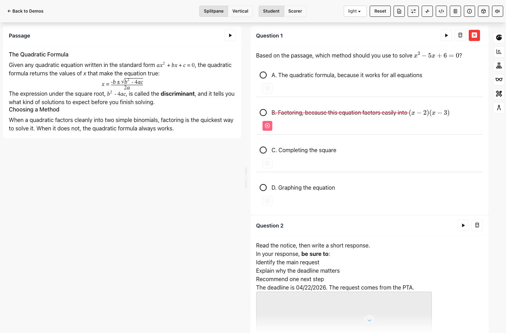

### Notes, Comments, Resources, And Markup

Notes, comments, resources, custom speech, rollovers, and pop-ups are important SchoolCity affordances, but they are not currently packaged PIE toolkit tools. These need ownership decisions before implementation: some belong in host chrome and persisted session state, while others belong in authored content markup or PIE item rendering.

SchoolCity source: [Visual Aides](https://support.renaissance.com/s/article/Online-Tools-Visual-Aides-1752860897682?language=en_US)

SchoolCity source: [Online Markup](https://support.renaissance.com/s/article/Online-Markup-for-Item-Bank-Assessments-1752860897413?language=en_US)

SchoolCity source: [Online Markup](https://support.renaissance.com/s/article/Online-Markup-for-Item-Bank-Assessments-1752860897413?language=en_US)

## Overlay Tools Versus Text-Interacting Tools

The master document makes a useful implementation distinction:

- Overlay/reference tools usually sit above or beside content and do not need to mutate item text. Ruler, protractor, periodic table, graph, line reader, and theme/color schemes mostly fall into this bucket.
- Text-interacting tools need selection, text range mapping, persistence, and sometimes content-language services. Highlighter, underline, dictionary, picture dictionary, translate selection, comments, custom speech, rollovers, and pop-ups fall into this bucket.

PIE is strongest in the overlay/reference bucket, and its current packaged tools already cover most of those capabilities. More important than the specific catalog of shipped tools, though, is that the assessment toolkit is a generic, application-independent framework for building them. Tools are registered against a shared contract (`ToolRegistration` / `ToolRegistry`, coordinated by `ToolkitCoordinator`) with PNP-driven tool policy, item/passage/section scoping, draggable/resizable tool shells, and visibility subscriptions, so a host or product can add its own tool using the exact same API as the built-ins. PIE ships a useful set of pre-fab tools, but standing up a new one is very doable — the section-demos app, for example, registers its own custom tools (such as a word counter) through the public registration API rather than forking the toolkit.

Just as important, cross-cutting concerns are solved once by the framework rather than re-implemented per tool. A single `ToolkitCoordinator` owns the shared services (tool policy, the `HighlightCoordinator`, `TTSService`, element tool state, and accessibility-catalog resolution); tools draw on common theming tokens (`--pie-*` variables and the `pie-theme` element) for automatic light/dark and high-contrast adaptation; highlighting runs through the one CSS Custom Highlight API layer; and capabilities such as `CSS.highlights` and `Intl.Segmenter` are feature-detected centrally with graceful fallbacks. A new tool therefore inherits consistent theming, accessibility, highlighting, policy, and capability-detection behavior without re-solving any of it.

The larger questions in the text-interacting and service-backed bucket are therefore less about whether PIE can build a given tool and more about decisions on selection range models, content ownership, persistence, language services, and whether a feature belongs in the toolkit, the assessment host, or item rendering.

## Text Editor, Equation Editor, And PIE Item Ownership

The master document calls out three ownership decisions:

- **Text editor**: choose a robust editor that meets product needs and works with the open-source PIE licensing model.
- **Equation editor**: SchoolCity has equation editor support, but ownership should likely shift toward PIE items and response editors if PIE is overhauling this area.
- **Custom speech / markup tools**: SchoolCity’s custom speech and markup affordances may need to be built into PIE item content or authoring flows rather than the generic assessment toolkit.

Those should not be treated as simple toolbar parity gaps. They affect item authoring, response capture, accessibility, content serialization, scoring, and licensing.

## Item-Level Tools

The master document lists several item-level controls. These are mostly authoring or response-editor capabilities, not assessment toolbar tools. Cross-checked against the current PIE elements source in `pie-elements-ng`, most of them already exist today as item model and configuration fields (noted per row), so the question is largely whether to keep, relocate, or retire them rather than whether PIE can do them.

| SchoolCity item-level capability | Master document evidence | Current PIE ownership read | Parity |
| --- | --- | --- | --- |
| Partial Credit Scoring | Master DOCX image mapping: `word/media/image27.png`; local extract not stored | Implemented in PIE items: `multiple-choice` ships `partialScoring` (on by default) and `scoringType`; `ebsr` carries partial scoring controlled by the host environment. Source review qualifies the parity read: on the SchoolCity side this is not a student tool but a per-item-type authoring switch plus score reporting, and the legacy client hardcodes `partialscoring: false` into the PIE player env — so PIE's default is on and its largest consumer overrides it off. | Supported (item-owned); consumer disables it |
| Relative Scoring | Master DOCX image mapping: `word/media/image28.png`; local extract not stored | Supported by the PIE backend (`pie-api-aws`), not the item model: every item is scored on a normalized 0–1 scale and then scaled to a configurable integer maximum via the runtime `maxPoints` parameter (e.g. `maxPoints: 3` → 0–3, rounded to the nearest integer). Combined with `partialScoring`, this provides relative point weighting across items. | Supported (backend-owned) |
| Drawing Tool | Master DOCX image mapping: `word/media/image29.png`; local extract not stored | Implemented as the packaged `drawing-response` element; `extended-text-entry` also supports teacher annotation marks. | Supported (item-owned) |
| Character Limit | Master DOCX image mapping: `word/media/image30.png`; local extract not stored | Re-verified and confirmed as a gap, more sharply than the June pass put it: `charactersLimit={50000}` is a bare literal in delivery (`pie-elements-ng/packages/elements-react/extended-text-entry/src/delivery/main.tsx:204`), its only occurrence in the package. It is in neither the authoring model nor the configuration block, and the config panel exposes no control for it — `numberFields` is imported and used only for width/height. Not authorable and not overridable from the item model. SchoolCity's equivalent is a coded value pair (`CRCharacterLimitCode` / `CRCharacterLimitValue`) with per-part limits. | Partial (item-owned) |
| Editable Part A/B label | Master DOCX row, no distinct extracted image | Implemented in `ebsr`: `partLabels` plus `partLabelType` (the "Part Labels" setting). | Supported (item-owned) |
| Type of Choices selector | Master DOCX image mapping: `word/media/image31.png`; local extract not stored | Implemented in `multiple-choice`/`ebsr` as `choicePrefix` (the "Choice Labels" setting: letters/numbers/none). | Supported (item-owned) |
| Text Options | Master DOCX image mapping: `word/media/image32.png`; local extract not stored | Closest match is the shared rich-text editor toolbar options (`baseInputConfiguration`); exact SchoolCity scope unconfirmed. | Partial (item-owned) |
| Limit number of choices | Master DOCX image mapping: `word/media/image33.png`; local extract not stored | Implemented in `multiple-choice` via `minAnswerChoices`/`maxAnswerChoices` authoring bounds. | Supported (item-owned) |
| Type of Choices language | Master DOCX image mapping: `word/media/image34.png`; local extract not stored | Implemented in `multiple-choice`/`ebsr` via `language`/`languageChoices` (the "Specify Language" setting). | Supported (item-owned) |
| Lock Choices Order | Master DOCX image mapping: `word/media/image35.png`; local extract not stored | Implemented in `multiple-choice`/`ebsr` as `lockChoiceOrder` ("Lock Choice Order", on by default); host policy may still influence shuffling. | Supported (item-owned / host-influenced) |
| Answer Choice Format | Master DOCX image mapping: `word/media/image36.png`; local extract not stored | Implemented in `multiple-choice` via `choiceMode` (radio/checkbox), `choicesLayout`, and `gridColumns`. | Supported (item-owned) |
| Answer Hint | Master DOCX image mapping: `word/media/image37.png`; local extract not stored | Re-verified and confirmed as a gap. The closest matches remain `multiple-choice` `rationale` plus `teacherInstructions`; `hint` appears nowhere across the 30 elements as a model field, prop or delivery affordance — the only occurrences are a CSS class in one element's authoring UI and two code comments. `rationale` is not a substitute: it is instructor-gated, emitted only when `env.role === 'instructor'`, so there is no student-facing explanatory affordance at all. SchoolCity carries a per-student `OnlineShowHint` override, which implies a student-visible hint exists on that side. | Partial (item-owned) |

Because PIE elements already implement most of these as item-level model fields, the open product decision is less about building them and more about whether each should remain an item-level knob, move upward to assessment-level configuration, or be simplified or discontinued during migration. The genuine gaps here are narrower: author-configurable character limits and a distinct student-facing answer hint. Both were re-checked against `pie-elements-ng` for this refresh and both still hold, with the character limit now pinned to a hardcoded `50000`. Relative scoring is already handled by the PIE backend through `maxPoints` score scaling rather than a per-item knob.

Two limits on the element layer sit outside the master document's rows and bear on migration planning.

**Print coverage is partial.** 12 of the 30 elements export a `./print` subpath; 18 do not, including `graphing`, `charting`, `categorize`, `hotspot`, `drag-in-the-blank`, `number-line`, `matrix` and `placement-ordering`. The print player HEAD-checks for the module and, on a miss, renders a placeholder reading "Print module is not configured for this item type" (`packages/print-player/src/element-resolver.ts:88-94`) — so a paper form degrades element by element rather than failing, and the other items on the form print normally. A `fallback: "delivery"` for the print view is defined in the generic ESM loader (`packages/players-shared/src/loaders/esm-adapter.ts:41`) but the print player supplies its own view config without it, and the HEAD pre-check short-circuits before any import, so the fallback is unreachable from the print path. Given SchoolCity's paper and bubble-sheet delivery, this is a migration constraint rather than a cosmetic gap.

**The advertised delivery variants do not exist.** `../architecture/architecture.md:108-112` lists `delivery-mobile`, `delivery-a11y`, `delivery-simple` and `delivery-branded` as custom views enabled by package subpath exports, and `pie-elements-ng/docs/ARCHITECTURE.md:148-164` goes further, diagramming them as shipped peer folders. No element exports any of them; `BUILT_IN_VIEWS` defines exactly three — `delivery`, `author`, `print` (`packages/players-shared/src/loaders/esm-adapter.ts:38-42`). The mechanism is real and the variants are not, and there is live tooling in the demo apps that labels and tests for view names no package produces. A touch-optimized or accessibility-optimized delivery variant is available as a design, not as a shipped artifact.
