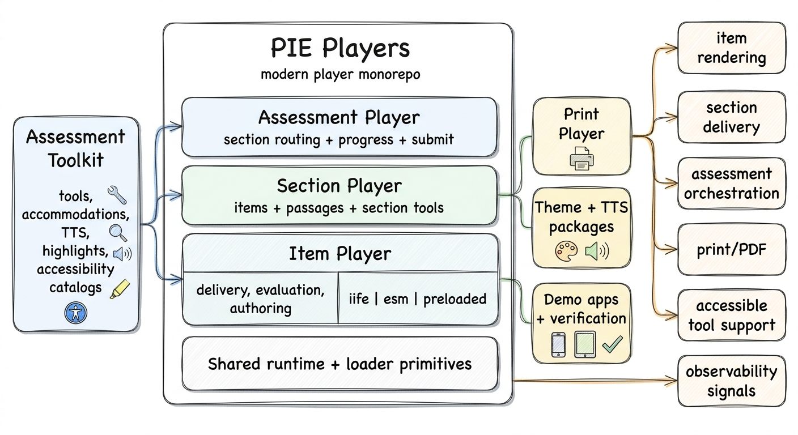
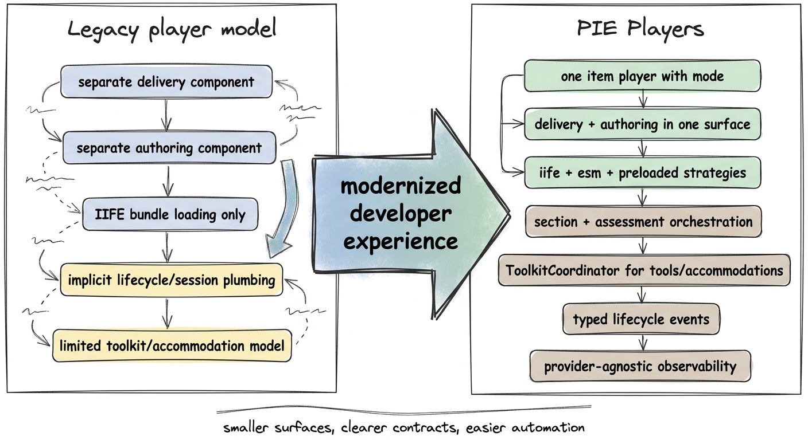

# Why a New Project?

PIE Players is the modern player project for the PIE ecosystem. It provides the runtime pieces that render PIE items, compose sections, orchestrate assessment attempts, coordinate tools and accommodations, support print workflows, and expose observability signals for production hosts.

The project exists because the legacy player model solved item rendering, but it did not give us a clean foundation for modern module loading, authoring and delivery in one surface, section-level composition, assessment-level orchestration, or coordinated tool and accommodation support. PIE Players keeps compatibility with existing PIE content while giving new integrations clearer contracts and a better development experience.

## What PIE Players Covers

PIE Players is a project, not just a single custom element. It includes:

- **Item player**: renders one PIE item, loads the required element bundles, manages item session state, and emits item-level lifecycle and response events.
- **Section player**: composes items, passages, section-level tools, item and passage toolbars, layouts, and section session state into a complete section screen.
- **Assessment player**: coordinates section routing, assessment-level session snapshots, progress, and submission without replacing the section player as the rendering workhorse.
- **Assessment toolkit**: coordinates tools, accommodations, text-to-speech, highlighting, accessibility catalogs, and tool state through a single runtime coordinator.
- **Tools and accommodations**: calculators, text-to-speech, ruler, protractor, line reader, answer eliminator, color scheme tools, and related service infrastructure.
- **Print, theming, TTS, demos, and verification**: supporting packages and apps that make the runtime testable, publishable, and usable in production-style environments.

## Why a New Player Project

The legacy open-source player model exposed separate components for delivery and authoring, relied primarily on IIFE bundle loading, and left many higher-level concerns to each consuming product. That made integration possible, but it also meant teams repeatedly rebuilt similar section layouts, tool coordination, session wiring, accessibility behavior, and telemetry conventions.

PIE Players modernizes that model around web components, TypeScript, Svelte 5, ESM-first package boundaries, standard build tooling, and explicit controller/event contracts. The result is easier for developers to reason about and easier for AI-supported development to navigate: fewer implicit conventions, clearer package responsibilities, and more runtime behavior expressed as typed events, policies, and coordinator APIs.

## Architecture at a Glance

## What Changed from pie-player-components

| Area | Legacy player model | PIE Players model |
| --- | --- | --- |
| Delivery and authoring | Separate delivery and authoring custom elements. | One item player surface supports delivery, evaluation, and authoring through mode. |
| Loading | Primarily IIFE bundle loading through script injection. | Three strategies: IIFE for compatibility, ESM for modern module loading, and preloaded for zero runtime fetch paths. |
| Session handling | More logic was embedded in player implementation details. | Item, section, and assessment controllers expose clearer ownership for response, navigation, and persistence snapshots. |
| Composition | Products often built their own item-plus-passage and assessment shells. | Section and assessment players provide tested composition layers while still letting hosts own product policy. |
| Tools and accommodations | No central toolkit model in the player itself. | Assessment toolkit coordinates tools, accommodations, TTS, highlighting, catalogs, and tool state. |
| Observability | Telemetry was narrower and more implementation-specific. | Provider-agnostic streams exist across item, section, assessment, toolkit, and tool/backend operations. |

## Player Layers

The project is layered so teams can adopt only what they need:

- **Use item player** when a product needs to render a single PIE item and own the surrounding application shell itself.
- **Use section player** when the product needs a complete section screen: passages, items, section navigation, section tools, item and passage toolbars, and section session state.
- **Use assessment player** when the product needs a tested foundation for routing across sections, aggregating assessment session state, tracking progress, and submitting an attempt.

The important boundary is that players own runtime mechanics, while host applications own durable data and product policy: authentication, timing, save cadence, navigation rules, submission confirmation, app routing, and backend integration.

## Loading Strategies

The item player supports three loading strategies, and section and assessment players pass those strategies through to embedded item players:

- **IIFE**: the compatibility path for existing bundle infrastructure and deployed PIE content.
- **ESM**: the modern path for dynamic module loading, browser module caching, better development tooling, and future element delivery.
- **Preloaded**: the performance and predictability path where required custom elements are registered before the item player renders. This supports offline-like deployments, CI-built element sets, and test harnesses with no runtime bundle fetch.

## Tools and Accommodations

PIE Players brings tools and accommodations into the PIE runtime instead of treating them as one-off host application features. The assessment toolkit provides a coordinator that owns shared services for text-to-speech, tool visibility and z-index, highlighting, accessibility catalogs, and element-level tool state.

This matters because real assessment screens are not just questions. They include passages, answer eliminators, calculators, rulers, protractors, line readers, TTS controls, color and contrast tools, item-level controls, passage-level controls, and section-wide tools. The toolkit gives those pieces a consistent runtime model while letting products decide which tools a student receives and why.

## Observability and Runtime Signals

Observability is part of the architecture, not an afterthought. PIE Players uses provider-agnostic instrumentation contracts so a host can route signals to New Relic, a debug overlay, a composite provider, or another monitoring backend.

Each layer owns its own semantic stream:

- **Item layer**: element loading, resource retries, item load completion, session changes, and player errors.
- **Section layer**: section lifecycle, stage changes, composition changes, section loading completion, section session changes, and framework errors.
- **Assessment layer**: assessment controller readiness, route changes, progress changes, assessment session changes, submission state, and assessment errors.
- **Toolkit and tool layer**: toolkit readiness, tool initialization, backend calls, library loading, runtime fallback, and tool-specific failures.

Keeping those streams separate makes production telemetry easier to interpret and makes local debugging more reliable.

## Developer Experience

The project improves developer experience in several ways:

- **One player family**: item, section, assessment, print, tools, toolkit, TTS, and themes are versioned and tested as one suite.
- **Standard tooling**: Bun, Turbo, Vite, TypeScript, Biome, Playwright, and Changesets replace more bespoke workflows.
- **Dist-first demos**: demo apps load built package artifacts the same way consumers do, reducing "works locally but not from npm" drift.
- **Explicit boundaries**: consumers import custom-element entrypoints and package exports, not internal source paths.
- **Clear controllers**: item, section, and assessment controllers make ownership of session, navigation, and persistence snapshots more explicit.
- **Verification gates**: package metadata, custom element registration, source export boundaries, runtime compatibility, dependency integrity, type surfaces, package packing, and fixed versioning are checked before publish.

These same qualities improve AI-assisted development. Agents and developers have fewer hidden conventions to infer, clearer public surfaces to follow, and better tests/checks to catch accidental boundary violations.

## Release and Quality Model

Publishable packages in the project use fixed versioning. Consumers can pick one version of the `@pie-players/*` suite and update the suite together, without maintaining a compatibility matrix across players, tools, toolkit services, and shared packages.

The release pipeline builds publishable packages, verifies package metadata and exports, checks custom element safety, validates type and pack surfaces, runs dependency and consumer-boundary checks, enforces fixed versioning, and publishes preloaded player variants as part of the release flow.

## Current Status

PIE Players is the forward-looking player project for the PIE ecosystem. The item player provides the bridge from legacy-compatible rendering to ESM and preloaded strategies. The section player and assessment player add higher-level orchestration. The assessment toolkit brings tools and accommodations into the same runtime model. Together, they form the foundation for modern PIE assessment delivery.

## Quick Reference

| Need | Use |
| --- | --- |
| Install dependencies | `bun install` |
| Build publishable packages | `bun run build` |
| Run item demos | `bun run dev:item` |
| Run section demos | `bun run dev:section` |
| Run assessment demos | `bun run dev:assessment` |
| Run docs app | `bun run dev:docs` |
| Run tests | `bun run test` |
| Run publish verification | `bun run verify:publish` |
