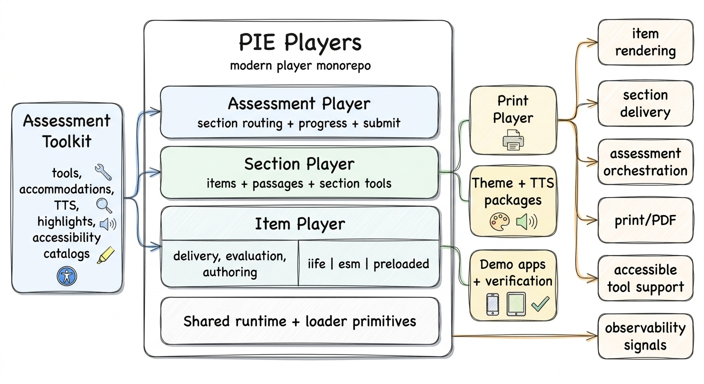
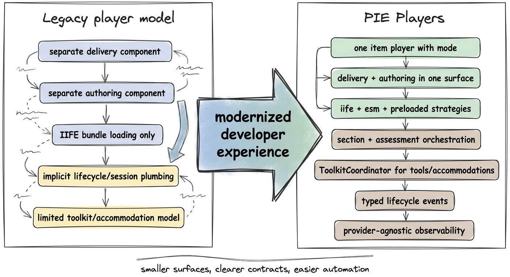

# Why a New Project?

PIE Players is the modern player project for the PIE ecosystem. It provides the runtime pieces that render PIE items, compose sections, keep assessment-session state, coordinate tools and accommodations, support print workflows, and expose observability signals for production hosts. Hosts assemble their production assessment players from these pieces; PIE ships a basic assessment player as a reference assembly ([product scope](./architecture/architecture.md#product-scope)).

The project exists because the prior player model solved item rendering, but it did not give us a clean foundation for modern module loading, authoring and delivery in one surface, section-level composition, assessment-level orchestration, or coordinated tool and accommodation support. PIE Players supports deployed PIE content while giving new integrations clearer contracts and a better development experience.

## What PIE Players Covers

PIE Players is a suite of packages. It includes:

- **Item player**: renders one PIE item, loads the required element bundles, manages item session state, and emits item-level lifecycle and response events.
- **Section player**: composes items, passages, section-level tools, item and passage toolbars, layouts, and section session state into a complete section screen.
- **Assessment player**: a reference assembly that coordinates section routing, assessment-level session snapshots, progress, and submission on top of the section player. It shows how a custom multi-section player is built and is not a production delivery shell.
- **Assessment toolkit**: coordinates tools, accommodations, text-to-speech, highlighting, accessibility catalogs, and tool state through a single runtime coordinator.
- **Tools and accommodations**: calculators, graphing, a periodic table, dictionary and picture dictionary, text-to-speech, highlighting and underlining, ruler, protractor, line reader, answer eliminator, color scheme tools, sign language video, and related service infrastructure.
- **Print, theming, TTS, demos, and verification**: supporting packages and apps that make the runtime testable, publishable, and usable in production-style environments.

## Why a New Player Project

The prior open-source player model exposed separate components for delivery and authoring, relied primarily on IIFE bundle loading, and left many higher-level concerns to each consuming product. That made integration possible, but it also meant teams repeatedly rebuilt similar section layouts, tool coordination, session wiring, accessibility behavior, and telemetry conventions.

PIE Players modernizes that model around web components, TypeScript, Svelte 5, ESM-first package boundaries, standard build tooling, and explicit controller/event contracts. The result is easier for developers to reason about and easier for AI-supported development to navigate: fewer implicit conventions, clearer package responsibilities, and more runtime behavior expressed as typed events, policies, and coordinator APIs.

## Architecture at a Glance

## What Changed from pie-player-components

| Area | Prior player model | PIE Players model |
| --- | --- | --- |
| Delivery and authoring | Separate delivery and authoring custom elements. | One item player surface supports delivery, evaluation, and authoring through mode. |
| Loading | Primarily IIFE bundle loading through script injection. | Three strategies: IIFE for compatibility, ESM for modern module loading, and preloaded for zero runtime fetch paths. |
| Session handling | More logic was embedded in player implementation details. | Item and section controllers, with the toolkit's assessment-session helpers, expose clearer ownership for response, navigation, and persistence snapshots. |
| Composition | Products often built their own item-plus-passage and assessment shells. | The section player provides a tested composition layer and the toolkit the assessment-session state above it; hosts build the multi-section shell and own its policy, with the assessment player as a reference. |
| Tools and accommodations | No central toolkit model in the player itself. | Assessment toolkit coordinates tools, accommodations, TTS, highlighting, catalogs, and tool state. |
| Observability | Telemetry was narrower and more implementation-specific. | Provider-agnostic streams exist across item, section, assessment, toolkit, and tool/backend operations. |

## Player Layers

The project is layered so teams can adopt only what they need:

- **Use item player** when a product needs to render a single PIE item and own the surrounding application shell itself. Wrapped in `<pie-item-scope>` inside `<pie-assessment-toolkit>`, it gets the toolkit's tools and accommodations without a section player.
- **Use section player** when the product needs a complete section screen: passages, items, section navigation, section tools, item and passage toolbars, and section session state.
- **Build your own assessment player** for multi-section delivery: section players, one toolkit coordinator per attempt, and the toolkit's assessment-session helpers, with routing, persistence and submission against your backend. The assessment player and its demos show that assembly working and are the place to start reading.

The important boundary is that players own runtime mechanics, while host applications own durable data and product policy: authentication, timing, save cadence, navigation rules, submission confirmation, app routing, and backend integration.

## Loading Strategies

The item player supports three loading strategies, and section and assessment players pass those strategies through to embedded item players:

- **IIFE**: the compatibility path for existing bundle infrastructure and deployed PIE content.
- **ESM**: the modern path for dynamic module loading, browser module caching, better development tooling, and future element delivery.
- **Preloaded**: the performance and predictability path where required custom elements are registered before the item player renders. This supports offline-like deployments, CI-built element sets, and test harnesses with no runtime bundle fetch.

## Tools and Accommodations

PIE Players brings tools and accommodations into the PIE runtime instead of treating them as one-off host application features. The assessment toolkit provides a coordinator that owns shared services for text-to-speech, tool visibility and z-index, highlighting, accessibility catalogs, and element-level tool state.

This matters because real assessment screens are not just questions. They include passages, answer eliminators, calculators, rulers, protractors, line readers, TTS controls, color and contrast tools, item-level controls, passage-level controls, and section-wide tools. The toolkit gives those pieces a consistent runtime model while letting products decide which tools a student receives and why.

## Observability and Runtime Signals

Every layer emits provider-agnostic instrumentation, so a host can route signals to New Relic, a debug overlay, a composite provider, or another monitoring backend.

Each layer owns its own semantic stream:

- **Item layer**: element loading, resource retries, item load completion, session changes, and player errors.
- **Section layer**: section lifecycle, stage changes, composition changes, section loading completion, section session changes, and framework errors.
- **Assessment layer**: assessment controller readiness, route changes, progress changes, assessment session changes, submission state, and assessment errors.
- **Toolkit and tool layer**: toolkit readiness, tool initialization, backend calls, library loading, runtime fallback, and tool-specific failures.

Keeping those streams separate makes production telemetry easier to interpret and makes local debugging more reliable.

## Developer Experience

The project improves developer experience in several ways:

- **One player family**: item, section, assessment, print, tools, toolkit, TTS, and themes are versioned and tested as one suite.
- **Standard tooling**: Bun, Turbo, Vite, TypeScript, Biome, Playwright, and Changesets replace more bespoke workflows.
- **Dist-first demos**: demo apps load built package artifacts the same way consumers do, reducing "works locally but not from npm" drift.
- **Explicit boundaries**: consumers import custom-element entrypoints and package exports, not internal source paths.
- **Clear controllers**: item and section controllers, with the toolkit's assessment-session helpers, make ownership of session, navigation, and persistence snapshots more explicit.
- **Verification gates**: package metadata, custom element registration, source export boundaries, runtime compatibility, dependency integrity, type surfaces, package packing, and fixed versioning are checked before publish.

These same qualities improve AI-assisted development. Agents and developers have fewer hidden conventions to infer, clearer public surfaces to follow, and better tests/checks to catch accidental boundary violations.

## Release and Quality Model

Publishable packages in the project use fixed versioning. Consumers can pick one version of the `@pie-players/*` suite and update the suite together, without maintaining a compatibility matrix across players, tools, toolkit services, and shared packages.

The release pipeline builds publishable packages, verifies package metadata and exports, checks custom element safety, validates type and pack surfaces, runs dependency and consumer-boundary checks, and enforces fixed versioning. Preloaded player builds publish from their own workflow on pushes to `master`.

## Current Status

PIE Players is the forward-looking player project for the PIE ecosystem. The item player provides the bridge from IIFE bundle loading to ESM and preloaded strategies. The section player adds higher-level composition, and the assessment toolkit brings tools, accommodations and assessment-session state into the same runtime model. Together, they are the building blocks hosts assemble modern PIE assessment delivery from; the assessment player is the reference assembly.

## Quick Reference

| Need | Use |
| --- | --- |
| Install dependencies | `bun install` |
| Build publishable packages | `bun run build` |
| Run item demos | `bun run dev:item` |
| Run section demos | `bun run dev:section` |
| Run assessment demos | `bun run dev:assessment` |
| Run docs app | `bun run dev:docs` |
| Run tests | `bun run test` |
| Run publish verification | `bun run verify:publish` |
