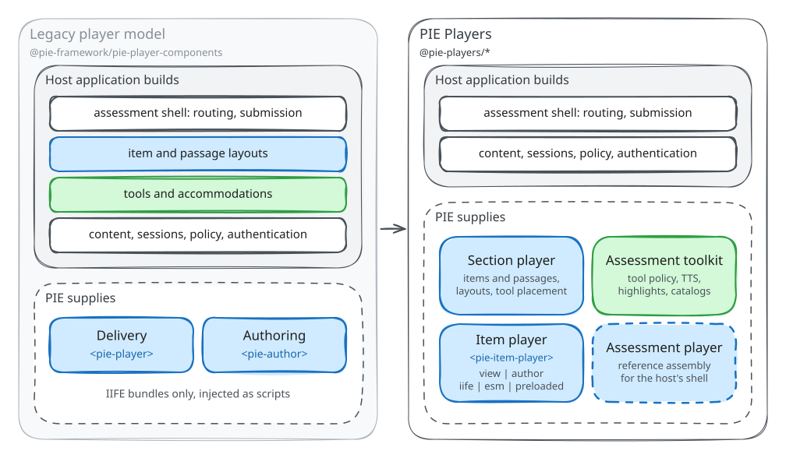

# The case for a new player project

PIE Players is the player suite for PIE (Portable Interactions and Elements) content, and succeeds the legacy `@pie-framework/pie-player-components` player. A PIE item is authored assessment content whose interactions each render through a PIE element, a custom element for one interaction type; [pie-elements-ng](https://github.com/pie-framework/pie-elements-ng) maintains the current element set. The suite renders PIE items, composes items and passages into sections, keeps assessment-session state, coordinates tools and accommodations, prints items, and reports instrumentation. Hosts assemble their production assessment players from these building blocks; the assessment player in this repository is a reference assembly ([product scope](./architecture/architecture.md#product-scope)).

The legacy player solved item rendering. It shipped separate delivery and authoring elements, loaded IIFE bundles only, and left section layout, tool coordination, session wiring, accessibility behavior and telemetry to each host, so every host rebuilt them. PIE Players moves that work into shared, tested packages behind typed contracts, and still renders deployed PIE content through the IIFE strategy. The [migration guide](./item-player/migration-from-pie-player-components.md) maps each legacy element, property, event and method to its replacement.

## Changes from the legacy player

| Area | Legacy player | PIE Players |
| --- | --- | --- |
| Delivery and authoring | Separate `<pie-player>` and `<pie-author>` elements | One `<pie-item-player>` for delivery, evaluation and authoring, switched by mode |
| Loading | IIFE bundles injected as scripts | Three strategies: `iife` for deployed content, `esm` for static browser builds, `preloaded` for elements the host bundles |
| Session handling | Logic inside the player implementation | Item and section controllers, plus the toolkit's assessment-session helpers, own responses, navigation and persistence snapshots |
| Composition | Each host built its own item-plus-passage and assessment shells | The section player composes a section; the toolkit keeps the assessment-session state above it; the host builds the multi-section shell and owns its policy |
| Tools and accommodations | Outside the player | The assessment toolkit coordinates tools, accommodations, text-to-speech, highlighting, accessibility catalogs and tool state |
| Instrumentation | Narrow and implementation-specific | Provider-agnostic streams from the item, section, assessment, toolkit and tool layers |

## Building blocks

- **Item player** renders one PIE item: it loads the item's element code, keeps the item session, and emits lifecycle and response events.
- **Section player** composes the items and passages of one section, with section-level tools, item and passage toolbars, layouts, and section session state.
- **Assessment toolkit** coordinates tools, accommodations, text-to-speech, highlighting, accessibility catalogs and tool state through one coordinator.
- **Tools and accommodations**: calculators, graphing, a periodic table, dictionaries and picture dictionaries, text-to-speech, highlighting and underlining, ruler, protractor, line reader, answer eliminator, the color-scheme tool (`theme`), sign language video, and the services behind them.
- **Print player** renders items for paper, answer keys and PDF export.
- **Theme** carries design tokens and color schemes.
- **Assessment player** is the reference assembly: section routing, assessment-session snapshots, progress and submission on top of the section player. It shows how a custom multi-section player is built and is no production delivery shell.

Every player is a custom element and bundles its own runtime, so a host installs no framework to use one.

## Adoption layers

A host adopts the layer it needs:

- **Item player** when the host renders single items and owns the surrounding shell. Inside `<pie-assessment-toolkit>`, with a `<pie-item-scope>` per item, it gets the toolkit's tools and accommodations without a section player.
- **Section player** when the host needs a complete section screen: passages, items, section navigation, section tools, item and passage toolbars, and section session state.
- **A custom assessment player** for multi-section delivery: section players, one toolkit coordinator per assessment attempt, and the toolkit's assessment-session helpers, with routing, persistence and submission against the host's backend. The reference assessment player and its demos show that assembly working.

Players own runtime mechanics. Hosts own durable data and product policy: authentication, timing, save cadence, navigation rules, submission confirmation, routing and backend integration. Standards alignment, policy authoring, gradebooks and reporting, item banks and media hosting, durable persistence, authorization and proctoring, psychometrics, adaptive selection engines and review workflows stay out of PIE; [framework-completing work](./architecture/framework-completing-work.md#classification) sets out where that line falls.

## Loading strategies

The item player loads element code in one of three ways, and the section and assessment players pass the choice through to every item player they embed:

- **`iife`** loads pre-built element bundles from the bundle host (the `bundleHost` option). It is the default and the path for deployed PIE content.
- **`esm`** imports static browser builds of the elements from a CDN, with browser module caching.
- **`preloaded`** uses elements the host registered before the player renders, with no runtime fetch. It suits fixed element sets, CI-built sets and test harnesses.

[Loading strategies](./item-player/loading-strategies.md) compares them.

## Tools and accommodations

An assessment screen carries passages, answer eliminators, calculators, rulers, protractors, line readers, read-aloud controls and the color-scheme tool at item, passage and section level. The assessment toolkit gives them one runtime model: a coordinator owns the shared services for text-to-speech, tool visibility and stacking, highlighting, accessibility catalogs and element-level tool state, and a policy engine resolves which of the placed tools a learner receives from the district, test-administration, item and Personal Needs and Preferences (PNP) settings the host supplies. [Tools and accommodations](./tools-and-accomodations/architecture.md) describes the model.

## Instrumentation

Every layer reports through a provider-agnostic instrumentation contract, so a host routes the signals to New Relic, a debug overlay, a composite provider or another backend. Each layer owns one stream:

- **Item**: element loading, resource retries, load completion, session changes and player errors.
- **Section**: lifecycle, stage changes, composition changes, load completion, section session changes and framework errors.
- **Assessment**: controller readiness, route changes, progress, assessment session changes, submission state and errors.
- **Toolkit and tools**: toolkit readiness, tool initialization, backend calls, library loading, runtime fallback and tool failures.

[Instrumentation providers](./architecture/instrumentation-providers.md) lists every event.

## Engineering model

- **One suite.** The item, section, assessment and print players, the toolkit, tools, TTS and theme release together under one version number, so a host picks one `@pie-players/*` version and upgrades everything at once.
- **Standard tooling.** Bun, Turbo, Vite, TypeScript, Biome, Playwright and Changesets.
- **Dist-first demos.** Demo apps load the built package artifacts the way hosts do, so a demo exercises what npm publishes.
- **Explicit boundaries.** Hosts import custom-element entry points and package exports, never source paths.
- **Publish gates.** Package metadata, custom element registration, source export boundaries, runtime compatibility, dependency integrity, type surfaces, package contents and fixed versioning are checked before every publish.

The same explicit contracts serve AI-assisted development: fewer hidden conventions to infer, public surfaces to follow, and checks that catch a boundary violation.

[Environment setup](./setup/environment-setup.md) and the [demo system](./setup/demo_system.md) cover building, testing and running the demos.
